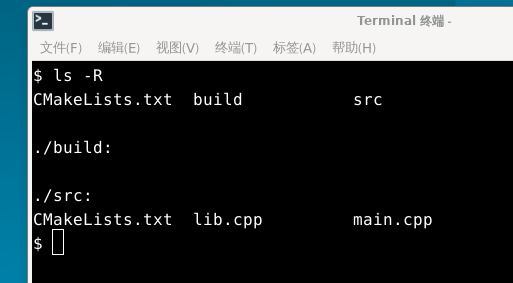
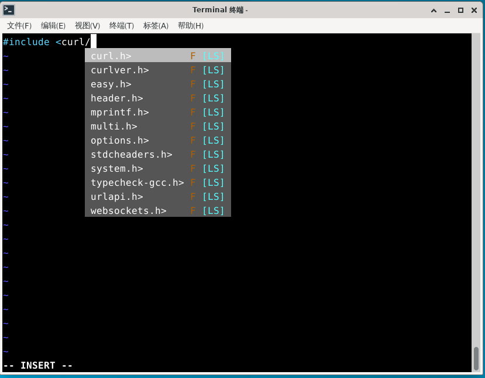
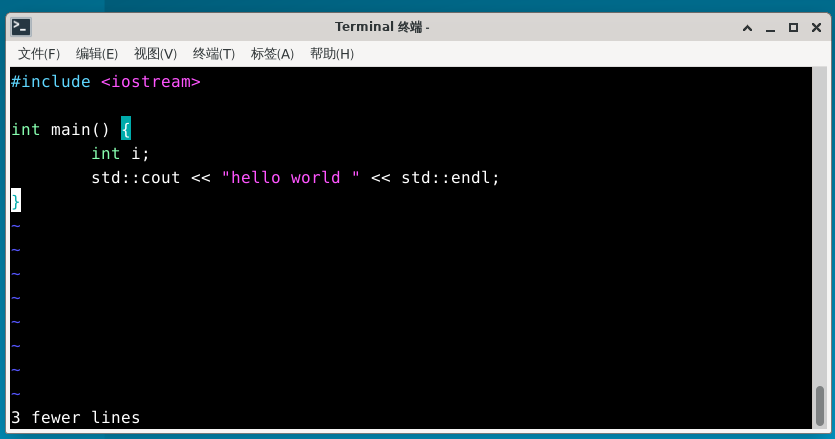
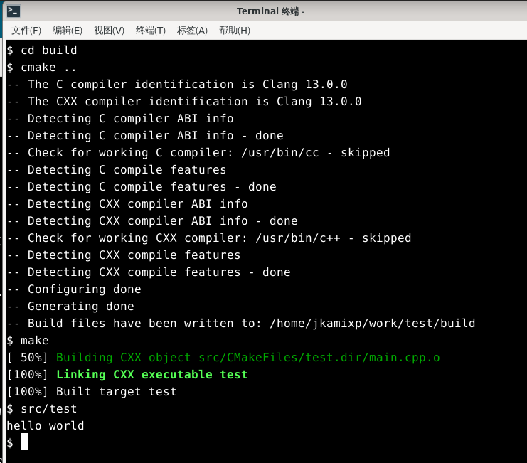
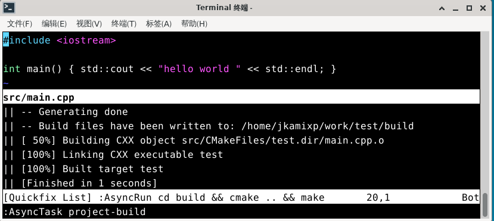

# 22.2 Vim Development Environment

Vim is a highly configurable text editor designed for efficient text editing. It is an improved version of the vi editor and is included in most UNIX systems.

Vim is often referred to as a "programmer's editor" and is highly practical in programming, leading many developers to consider it a complete IDE. In reality, Vim is not limited to programming — it is suitable for all kinds of text editing tasks, from composing emails to editing configuration files.

> **Discussion Question**
>
> From the perspective of tool philosophy, over-investing in editor beautification and configuration while neglecting actual programming efficiency is a tool usage tendency worth reflecting upon.
>
> Tool selection should distinguish between exploratory use and productive use: the former stems from technical curiosity, while the latter serves specific engineering objectives. Professionalism applies not only to formal settings but equally to amateur exploratory activities.
>
> How do you view the balance between tool optimization and actual productivity?

## Installing Vim and Plugin Manager

> **Note**
>
> The LLVM version numbers such as `clangd20`, `clang20`, and `clang-format19` in this section are the Ports versions available at the time of writing. Please adjust according to the latest LLVM version available in FreeBSD Ports, which can be queried via `pkg search llvm`.

Before starting the configuration, you need to install Vim and its plugin manager.

### Installing Vim

Install using pkg:

```sh
# pkg install vim
```

Or install using Ports:

```sh
# cd /usr/ports/editors/vim/
# make install clean
```

### Installing the Vim Plugin Manager

Vim's functionality can be extended through plugins. You need to install a plugin manager first for unified management. This section uses the Vim plugin manager vim-plug. If you use another plugin manager, please adjust accordingly:

```sh
$ mkdir -p ~/.vim/autoload   # Create the Vim autoload directory
$ fetch -o ~/.vim/autoload/plug.vim https://raw.githubusercontent.com/junegunn/vim-plug/master/plug.vim   # Download the vim-plug plugin manager to the specified directory
```

Configuration file structure:

```sh
~/.vim/
├── autoload/
│   └── plug.vim    # vim-plug plugin manager file
├── plugged/        # Plugin installation directory
├── coc-settings.json  # coc.nvim configuration file
└── tasks.ini      # asynctasks.vim global task configuration
```

## Adding clangd Completion with coc.nvim

coc.nvim is a code completion plugin based on Node.js, suitable for Vim and Neovim, with full LSP (Language Server Protocol) support. LSP is an open protocol for communication between editors and language services, which separates code analysis, completion, jump-to-definition, and other functions from the editor, provided by independent language services. Its configuration style and overall plugin system design are similar to VS Code. clangd provides LSP support for C/C++.

When installing coc.nvim dependencies, please refer to the Node.js-related chapters in this book to install npm. Node.js will be installed automatically as a dependency.

Write the following in the **~/.vimrc** file:

```ini
call plug#begin('~/.vim/plugged')           " Initialize vim-plug and specify the plugin installation directory
Plug 'neoclide/coc.nvim', {'branch':'release'}  " Install the release branch of the coc.nvim plugin
call plug#end()                             " End the plugin installation block
```

Enter `vim` and type the following command to install all configured plugins using vim-plug:

```sh
:PlugInstall
```

After the plugins are installed, continue to install the JSON, clangd, and CMake completion plugins in Vim:

```sh
:CocInstall coc-json coc-clangd coc-cmake
```

Configure clangd completion:

```sh
:CocConfig
```

After opening the configuration file, enter the following content and save it (you can also manually edit the **~/.vim/coc-settings.json** file to add the following content):

```json
{
        "clangd.path":"clangd20"
}
```

At this point, you can use the code completion feature through coc.nvim.

---

For simple small programs, create a `compile_flags.txt` file in the source file directory and enter:

```sh
-I/usr/local/include
```

This enables completion for header files under **/usr/local/include** in coc (specifying the path for the compiler to search for header files as **/usr/local/include**).

For complex projects, you should use a `compile_commands.json` file to configure completion. clangd searches in the parent directory of the file's directory and the `build/` subdirectory. For example, when editing `$SRC/gui/window.cpp`, clangd will search `$SRC/gui/`, `$SRC/gui/build/`, `$SRC/`, `$SRC/build/`, and so on.

Taking a CMake project as an example, in the project folder, the project structure is as follows:



```sh
$ mkdir build                    # Create the build directory
$ cd build                        # Enter the build directory
$ cmake -DCMAKE_EXPORT_COMPILE_COMMANDS=1 ..   # Generate the build system and export compilation commands to compile_commands.json
```

Or add the following in `CMakeLists.txt`:

```cmake
set(CMAKE_EXPORT_COMPILE_COMMANDS ON)
```

This will automatically generate the `compile_commands.json` file. Once this file is generated, you can use the completion feature when editing source files.

CMake defaults to using the system's built-in Clang compiler. You can specify clang20 with the following:

```sh
$ export CC=clang20       # Set the C compiler to clang20
$ export CXX=clang++20    # Set the C++ compiler to clang++20
```

Then execute `cmake` to use clang20.

You can add the following to `.xprofile` or similar files:

```ini
export CC=clang20       # Set the C compiler to clang20
export CXX=clang++20    # Set the C++ compiler to clang++20
```

This makes clang20 and clang++20 the default compilers, but whether to set this should be determined based on project requirements.


At this point, the `compile_commands.json` file has been generated, and you can use completion in Vim.



> **Note**
>
> The following operations are for sh/bash/zsh. For csh/tcsh, make the corresponding changes. Please ensure your shell environment is properly configured.

## Code Formatting

Code formatting can unify code style and improve code readability. The vim-clang-format plugin is incompatible with the command-line interface changes in newer versions of clang-format, and has not been updated for years. It has issues with newer clang-format versions (clang-format15 works properly, while clang-format17 and clang-format19 may have issues). Therefore, vim-codefmt is recommended.

### vim-codefmt Code Formatting

vim-codefmt is a code formatting plugin developed by Google. Add the following to the **~/.vimrc** file:

```ini
Plug 'google/vim-maktaba'   " Install Google's vim-maktaba plugin
Plug 'google/vim-codefmt'   " Install Google's vim-codefmt plugin for code formatting
Plug 'google/vim-glaive'    " Install Google's vim-glaive plugin
```

Also add the following settings in the **~/.vimrc** file:

```sh
call glaive#Install()

Glaive codefmt clang_format_executable="/usr/local/bin/clang-format19"
Glaive codefmt clang_format_style="{BasedOnStyle: LLVM, IndentWidth: 4}"

augroup autoformat_settings
  autocmd FileType c,cpp AutoFormatBuffer clang-format
  autocmd InsertLeave *.h,*.hpp,*.c,*.cpp :FormatCode
augroup END
```

| Configuration Item | Description |
| ------------------ | ----------- |
| `Glaive codefmt clang_format_executable` | Set the clang-format executable path |
| `Glaive codefmt clang_format_style` | Set the formatting style. Can also be set to `"file"` or `"file:<format_file_path>"`. Refer to ClangFormatStyleOptions[EB/OL]. [2026-03-25]. <https://clang.llvm.org/docs/ClangFormatStyleOptions.html>. This document lists all configurable formatting options and their value descriptions for clang-format |
| `autocmd FileType c,cpp AutoFormatBuffer clang-format` | Enable AutoFormatBuffer clang-format when the file type is c/cpp |
| `autocmd InsertLeave *.h,*.hpp,*.c,*.cpp :FormatCode` | Execute `:FormatCode` command when leaving insert mode for files with `.h`, `.hpp`, `.c`, `.cpp` extensions |

---

After saving the **~/.vimrc** file, use vim-plug to install all configured Google plugins:

```sh
:PlugInstall
```

At this point, code will be automatically formatted when you exit insert mode. You can also manually execute the `:FormatCode` command in Vim to format code.

### vim-clang-format Code Formatting

In addition to vim-codefmt, vim-clang-format is another code formatting plugin. You can configure it as follows:

Add the following line to the **~/.vimrc** file to install the vim-clang-format plugin for automatic code formatting:

```sh
Plug 'rhysd/vim-clang-format'
```

And add the following settings in the **~/.vimrc** file:

```ini
let g:clang_format#code_style = "google"                     " Set clang-format to use Google style
let g:clang_format#command = "clang-format15"                " Specify the clang-format command version
let g:clang_format#auto_format = 1                            " Enable auto-formatting
let g:clang_format#auto_format_on_insert_leave = 1           " Auto-format code when leaving insert mode
```

After saving the **~/.vimrc** file, use vim-plug to install the vim-clang-format plugin:

```sh
:PlugInstall
```

After installing the plugin, you can use it. For example:


Exiting insert mode



## asynctasks.vim Build Task System

Build task management can simplify workflows such as compilation, running, and testing. The asynctasks.vim plugin introduces a VSCode-like tasks system for Vim, systematically managing various compilation, running, testing, and deployment tasks in a unified manner.

Install the plugins:

```ini
Plug 'skywind3000/asynctasks.vim'   " Install the asynctasks.vim plugin for asynchronous task management
Plug 'skywind3000/asyncrun.vim'     " Install the asyncrun.vim plugin for running external commands asynchronously
```

Add the following settings in the **~/.vimrc** file:

```ini
let g:asyncrun_open = 6                                  " Set asyncrun output window behavior (6 means auto-open at the bottom)
let g:asyncrun_rootmarks = ['.git', '.svn', '.root', '.project']  " Specify project root directory marker files
```

The `asyncrun_rootmarks` option specifies the files/directories that mark the project root directory.

`asynctasks.vim` places a `.tasks` file in each project root directory to describe local tasks for that project, and also maintains a global task configuration in **~/.vim/tasks.ini** for more general-purpose tasks, avoiding the need to write duplicate `.tasks` configurations for each project.

In Vim, you can use `:AsyncTaskEdit` to edit local tasks and `:AsyncTaskEdit!` to edit global tasks.

For example:

```ini
[project-build]
command=cd build && cmake .. && make     # Run make in the current project's root directory
cwd=$(VIM_ROOT)

[project-run]
command=src/test                         # <root> is an alias for $(VIM_ROOT), more convenient to write
cwd=<root>
```

References:

- skywind3000. asynctasks.vim: Modern Build Task System[EB/OL]. [2026-03-25]. <https://github.com/skywind3000/asynctasks.vim/blob/master/README.md>. This plugin provides a VSCode-like task system for Vim, unifying the management of compilation, running, and other workflows.

## A Simple C++ Hello World Project Example

The following uses the simplest C++ project as an example to demonstrate the usage flow of the entire development environment. The project file structure is as follows:

```sh
/home/j/
└── project/
    ├── CMakeLists.txt  # Main project CMake configuration file
    ├── src/
    │   ├── CMakeLists.txt  # Sub-project CMake configuration file
    │   └── main.cpp       # Source file
    └── build/              # Build directory
```

- **/home/j/project/CMakeLists.txt** file

```cmake
cmake_minimum_required(VERSION 3.10)      # Specify the minimum CMake version requirement as 3.10
project(test)                              # Define the project name as test

set(CMAKE_EXPORT_COMPILE_COMMANDS ON)       # Enable generation of the compile_commands.json file

include_directories(/usr/local/include)    # Add the header file search path /usr/local/include
add_subdirectory(src)                       # Add the src subdirectory as a build subdirectory
```

- **/home/j/project/src/CMakeLists.txt** file

```sh
add_executable(test main.cpp)   # Compile main.cpp into the executable test
```

- **/home/j/project/src/main.cpp** file

```cpp
#include <iostream>   // Include the standard input/output library

int main() {
    std::cout << "Hello World" << std::endl;   // Output "Hello World" and a newline
    return 0;                                  // Return 0 to indicate the program ended normally
}
```

Compile and run:

```sh
$ cd /home/j/project/build   # Enter the build directory
$ cmake ..                   # Run CMake to configure the project in the parent directory
```

This generates the program file **/home/j/project/build/src/test**, which can then be executed normally.



Or run `:AsyncTask project-build` and `:AsyncTask project-run` in Vim:




## Unfinished Work

### Future Directions

This section focuses on the basic configuration of Vim as a development environment. The following directions are worth further exploration:

- **Expanding functionality scope**: The current configuration mainly covers code completion and formatting. Future additions could include running, debugging, automated building, GUI integration, and AI-assisted programming modules.

If you would like to contribute the above content, you can submit it via Pull Request.
