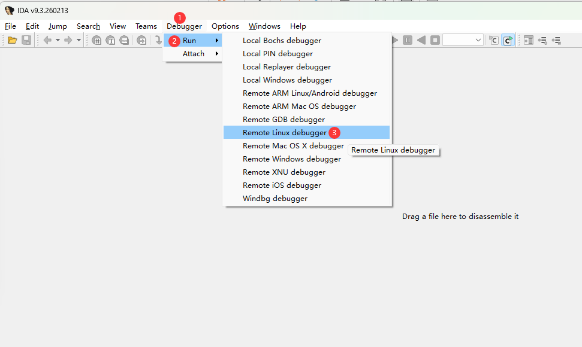

# 22.3 Debugging FreeBSD with IDA Pro

IDA Pro supports remote debugging using a client-server architecture. The Windows side runs the IDA Pro client, while the FreeBSD side runs the `linux_server` debug server through the Linux compatibility layer. This section is based on IDA Pro 9.3.260213 Windows x64.


## Remote Debugging Principle

IDA Pro's remote debugging uses a client-server architecture: a debug server program runs on the target system (FreeBSD), and the IDA Pro client runs on the analysis system (Windows). The two communicate over the network, controlling the target program and exchanging debug information.

The FreeBSD system can run the `linux_server` debug server provided by IDA through the Linux binary compatibility layer. This server is responsible for monitoring target program execution, handling breakpoints, retrieving register and memory states, and transmitting debug information back to the IDA Pro client.

## Preparing the Debug Server

First, on the Windows system, locate the **linux_server** file in the **dbgsrv** folder under the IDA installation path. This file is the 64-bit Linux debug server program provided by IDA, which can be run through FreeBSD's Linux compatibility layer.

Copy `linux_server` to the FreeBSD system, along with the target file to be remotely debugged. You can use WinSCP, SCP, or other file transfer tools.

View the debug server file details:

```sh
$ file linux_server
linux_server: ELF 64-bit LSB executable, x86-64, version 1 (SYSV), dynamically linked, interpreter /lib64/ld-linux-x86-64.so.2, BuildID[sha1]=ff98293848c412e3ef45ee78dac017464ac3059f, for GNU/Linux 3.2.0, stripped
```

Create a working directory on the FreeBSD system and place the files:

```sh
# mkdir -p /home/ykla/reverse
# cp linux_server /home/ykla/reverse/
# cp target /home/ykla/reverse/
```

Set execute permission for the debug server:

```sh
# chmod 755 /home/ykla/reverse/linux_server
```

Related file structure:

```sh
/home/ykla
└── reverse/ # Reverse engineering working directory
    ├── linux_server # IDA remote debug server
    └── target # Target file to debug
```

## Starting the Debug Server

Start the debug server:

```sh
# ./linux_server
IDA Linux 64-bit remote debug server(ST) v9.3.31. Hex-Rays (c) 2004-2026
2026-05-24 13:55:31 Listening on :::23946 (my ip 192.168.179.128)...
```

After running, the debug server will listen on the default port, waiting for the IDA Pro client to connect.

## Configuring the IDA Pro Client

Please use the 64-bit version of IDA and follow these steps.

Click "Debugger" in the top menu bar, then select "Run" from the menu, and select "Remote Linux debugger" from the submenu.




Fill in the following information in the debug configuration interface:

| Field | Description | Example |
| ----- | ----------- | ------- |
| `Application` | The file to debug | `target` |
| `Directory` | Full path to the debug file in the virtual machine | `/home/ykla/reverse/` |
| `Hostname` | IP address of the FreeBSD system | **192.168.179.128** |

After configuration, connect to the debug server. Once the connection is successful, you can start debugging.

The server side will display the following information:

```sh
2026-05-24 14:01:05 [1] Accepting connection from ::ffff:192.168.179.1...
```

This indicates that the client (**192.168.179.1**) has connected to the server.


You can now start analyzing the program.
