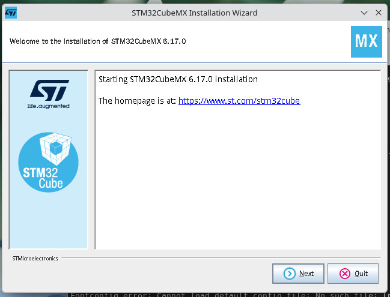
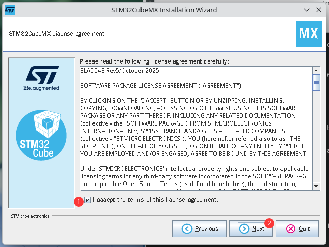
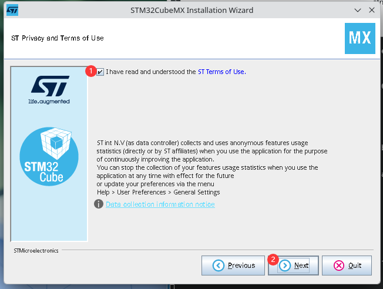
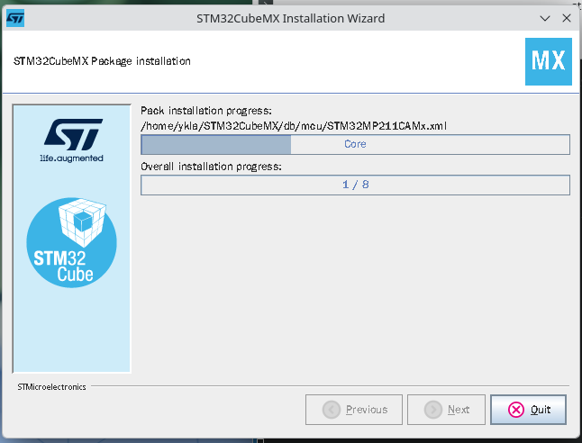
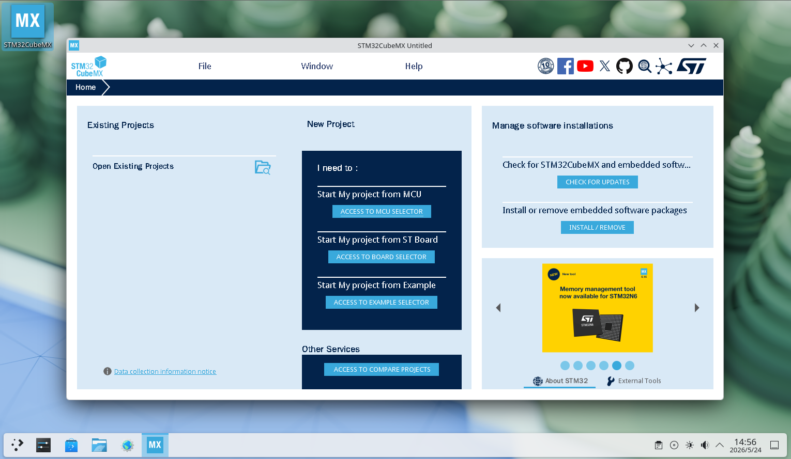

# 23.5 STM32 Development Environment

STM32 is a 32-bit microcontroller (Microcontroller Unit, MCU) product line introduced by STMicroelectronics (ST) since 2007. This product line is based on the ARM Cortex-M processor core architecture and is one of the mainstream MCU platforms in the embedded development field.

## Installing STM32CubeMX

STM32CubeMX is the official graphical hardware configuration and code generation tool provided by STMicroelectronics, which can be used to quickly complete hardware initialization for STM32 projects.

For developing STM32 embedded systems on the FreeBSD platform, it is recommended to use STM32CubeMX for initialization configuration. STM32CubeMX officially only supports Windows, Linux, and macOS. Running this software on FreeBSD requires the Linux compatibility layer.

For detailed tutorials on installing the Linux compatibility layer on FreeBSD, refer to other chapters in this book. The linux-rl9 compatibility layer maintained by FreeBSD is recommended.

Starting from STM32CubeMX V6.2.0, the installer includes a built-in Java Runtime Environment (JRE, Adoptium Temurin 21.0.3+9), eliminating the need for users to install Java separately. If you encounter issues running the installer under the FreeBSD Linux compatibility layer, you can try installing the system-level OpenJDK as an alternative. This section's example uses Port **java/openjdk25**.

After configuring the compatibility layer, download the archive from the [STM32CubeMX official website](https://www.st.com/en/development-tools/stm32cubemx.html) and extract it. At the time of writing, downloading does not require registration or login; you can download as a guest. The download link will be sent via email, so ensure your email address can receive messages normally. The downloaded file is **stm32cubemx-lin-v6-17-0.zip**.

Extract the installer **stm32cubemx-lin-v6-17-0.zip** to the directory **/home/ykla/stm**:

```sh
$ unzip stm32cubemx-lin-v6-17-0.zip -d /home/ykla/stm
```

> **Tip**
>
> The `/home/ykla` path in this section's example is for demonstration purposes; replace it with your actual home directory.

Navigate to the extracted folder and run the executable, which is `SetupSTM32CubeMX-6.17.0` in this example. Launch the installer:

```sh
$ ./SetupSTM32CubeMX-6.17.0
```

Begin installation:



Accept the license agreement, then click Next.



Accept the user terms, then click Next.



Enter the installation path. You should record this path; the example path is **/home/ykla/STM32CubeMX**.


Confirm using this path:


After confirmation, the program begins the installation:



Installation complete:


Exit the installer:


Create a desktop shortcut:

Create a `STM32CubeMX.desktop` file in the **~/Desktop** directory, then write the following:

```ini
[Desktop Entry]
Name=STM32CubeMX
Exec=/home/ykla/STM32CubeMX/STM32CubeMX %U
Terminal=false
Type=Application
Icon=/home/ykla/STM32CubeMX/help/STM32CubeMX.png
StartupWMClass=STM32CubeMX
Categories=Development;
Comment=STM32CubeMX
MimeType=application/x-STM32CubeMX-ioc;
```

Replace the `Exec` and `Icon` paths above with your actual paths. Then grant executable permissions.



## Installing Other Tools

In addition to STM32CubeMX, you also need to install the development toolchain and debugging tools. Install using pkg:

```sh
# pkg install gcc-arm-embedded cmake ninja openocd stlink
```

Or build using ports:

```sh
# cd /usr/ports/devel/gcc-arm-embedded && make install clean      # Embedded ARM toolchain
# cd /usr/ports/devel/cmake && make install clean      # Project build system core
# cd /usr/ports/devel/ninja && make install clean      # Efficient build tool
# cd /usr/ports/devel/openocd && make install clean      # Universal JTAG/SWD debugging and flashing tool
# cd /usr/ports/devel/stlink && make install clean      # ST official ST-LINK debugger user-space toolset
```

## Building and Flashing

Create a project using STM32CubeMX. In `Project Manager`, under `Project`, select CMake in the `Toolchain/IDE` field. In `Code Generator`, select `copy all used libraries into project folder` and `Generate peripheral initialization as a pair of '.c/.h' files per peripheral`.

After generating the project, modify the `CMakeLists.txt` file:

```cmake
# Minimum CMake version requirement
cmake_minimum_required(VERSION 3.22)

# Cross-compilation configuration
set(CMAKE_SYSTEM_NAME Generic)
set(CMAKE_SYSTEM_PROCESSOR arm)
set(CMAKE_TRY_COMPILE_TARGET_TYPE STATIC_LIBRARY)

# Default installation path for arm-none-eabi-gcc on FreeBSD
set(TOOLCHAIN_PREFIX "/usr/local/gcc-arm-embedded-14.2.rel1/bin")
set(CMAKE_C_COMPILER   ${TOOLCHAIN_PREFIX}/arm-none-eabi-gcc)
set(CMAKE_ASM_COMPILER ${TOOLCHAIN_PREFIX}/arm-none-eabi-gcc)
set(CMAKE_OBJCOPY      ${TOOLCHAIN_PREFIX}/arm-none-eabi-objcopy)

# Avoid searching for host libraries/headers
set(CMAKE_FIND_ROOT_PATH_MODE_PROGRAM NEVER)
set(CMAKE_FIND_ROOT_PATH_MODE_LIBRARY ONLY)
set(CMAKE_FIND_ROOT_PATH_MODE_INCLUDE ONLY)
set(CMAKE_FIND_ROOT_PATH_MODE_PACKAGE ONLY)

# Project definition
project(test LANGUAGES C ASM)      # Change to actual project name

# Collect source files
file(GLOB_RECURSE HAL_SOURCES "Drivers/STM32F1xx_HAL_Driver/Src/*.c")
# Exclude all template files; these should not be compiled
list(FILTER HAL_SOURCES EXCLUDE REGEX ".*_template\\.c$")

file(GLOB CORE_SOURCES "Core/Src/*.c")
set(ASM_SOURCES "startup_stm32f103xb.s")  # Placeholder — startup file, must be changed to the one matching the actual model

# Define compilation flags
set(MCU_FLAGS "-mcpu=cortex-m3" "-mthumb" "-mfloat-abi=soft")

# Create executable target
add_executable(${PROJECT_NAME}
    ${CORE_SOURCES}
    ${HAL_SOURCES}
    ${ASM_SOURCES}
)

# Configure target properties (Include, Options, Definitions)
target_include_directories(${PROJECT_NAME} PRIVATE
    Core/Inc
    Drivers/CMSIS/Include
    Drivers/CMSIS/Device/ST/STM32F1xx/Include
    Drivers/STM32F1xx_HAL_Driver/Inc
    Drivers/STM32F1xx_HAL_Driver/Inc/Legacy
)

target_compile_options(${PROJECT_NAME} PRIVATE
    ${MCU_FLAGS}
    -O2
    -ffunction-sections
    -fdata-sections
    -Wall
)

target_compile_definitions(${PROJECT_NAME} PRIVATE
    STM32F103xB          # Placeholder — chip model macro, must be changed to actual model
    USE_HAL_DRIVER       # Enable HAL driver
)

target_link_options(${PROJECT_NAME} PRIVATE
    ${MCU_FLAGS}
    -Wl,--gc-sections
    -T${CMAKE_CURRENT_SOURCE_DIR}/STM32F103XX_FLASH.ld  # Placeholder — linker script, must be changed to the .ld file matching the actual model
    -specs=nosys.specs
    -Wl,-Map=${PROJECT_NAME}.map
)

# Generate binary file
add_custom_command(TARGET ${PROJECT_NAME} POST_BUILD
    COMMAND ${CMAKE_OBJCOPY} -O binary $<TARGET_FILE:${PROJECT_NAME}> ${PROJECT_NAME}.bin
    COMMENT "Building ${PROJECT_NAME}.bin"
)

# Flash target
add_custom_target(flash
    COMMAND openocd -f interface/stlink.cfg -f target/stm32f1x.cfg -c "program ${PROJECT_NAME}.bin 0x08000000 verify reset exit"
    DEPENDS ${PROJECT_NAME}
    WORKING_DIRECTORY ${CMAKE_BINARY_DIR}
    COMMENT "Flashing ${CMAKE_BINARY_DIR}/${PROJECT_NAME}.bin via OpenOCD"
)
```

> **Tip**
>
> When switching STM32 models, there are multiple placeholders in CMakeLists.txt that are bound to the specific MCU model and must be adjusted individually. It is recommended to regenerate the project in STM32CubeMX after switching the target chip, then modify the corresponding positions in CMakeLists.txt accordingly.
>
> The linker script (`.ld` file) defines the starting addresses and sizes of Flash and RAM. Different models have different memory layouts; mixing them will cause the program to fail to run properly or to crash after flashing. STM32CubeMX automatically generates the correct linker script based on the selected chip. Never copy `.ld` files directly from other projects.

To use the gcc-arm-embedded toolchain in the terminal, add its binary files to PATH.

The configuration methods for each shell are as follows:

| Shell | Configuration File | Content to Write |
| ----- | ------------------ | ---------------- |
| sh / Bash / Zsh | `~/.profile` | `export PATH=/usr/local/gcc-arm-embedded-14.2.rel1/bin:$PATH` |
| fish | `~/.config/fish/config.fish` | `set -gx PATH /usr/local/gcc-arm-embedded-14.2.rel1/bin $PATH` |
| csh / tcsh | `~/.cshrc` | `setenv PATH /usr/local/gcc-arm-embedded-14.2.rel1/bin:$PATH` |

Begin building:

```sh
# Execute in the project root directory

# Create build directory and enter it
$ mkdir build && cd build

# Configure
$ cmake .. -G Ninja

# Begin building
$ ninja
```

Finally, flash to the development board:

```sh
# Execute in the build directory
ninja flash
```
