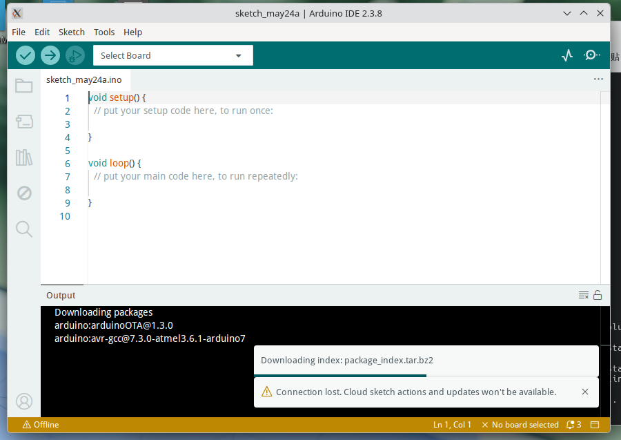

# 23.7 Arduino Development Environment

## Arduino Platform Overview

Arduino is an open-source hardware platform aimed at electronics enthusiasts and educators. The following are the installation and configuration steps on FreeBSD.

[Arduino](https://www.arduino.cc/) is an open-source electronic prototyping platform, co-founded in 2005 by faculty and students at the Interaction Design Institute Ivrea (IDII) in Ivrea, Italy. The project was originally intended for teaching purposes (specifically the Master's program in Interaction Design), enabling people without professional backgrounds to engage in electronic project development. In 2006, due to financial difficulties, the Interaction Design Institute Ivrea (which existed from 2001 to 2006) closed down, but the Arduino project prototype survived and continued to develop.

The Arduino project's vision shares common ground with the FreeBSD project's open-source philosophy. The [official Arduino vision](https://www.arduino.cc/en/about/) explicitly states that the Arduino platform should be accessible to anyone.

> **Background Knowledge**
>
> The name Arduino comes from an Italian ruler from over a thousand years ago, Arduin of Ivrea, whose name means "brave friend." In the birthplace of this ruler, the picturesque town of Ivrea in northern Italy, there was a bar called "di Re Arduino" (meaning "King Arduino's"). A co-founder of the Arduino project was a regular patron of this bar, and the project name originated from there.

This section recommends using OpenJDK 8. The FreeBSD Ports arduino18 Makefile declares `JAVA_VERSION= 8+` (i.e., Java 8 and above), but higher Java versions may have compatibility issues. If you encounter anomalies with OpenJDK 25, please switch back to OpenJDK 8.

## Arduino 1.X Installation Method

**Install using the pkg binary package manager:**

```sh
# pkg install arduino18 uarduno
```

Or build using ports:

```sh
# cd /usr/ports/devel/arduino18 && make install clean      # Arduino IDE
# cd /usr/ports/comms/uarduno && make install clean       # Arduino Uno kernel driver module
```

Edit the **/boot/loader.conf** file and add the following line to load the kernel driver by default:

```sh
uarduno_load="YES"
```

Restart the system.

Launch Arduino IDE from the desktop environment menu.


After setting the path, the main interface appears as follows:


## Arduino IDE 2.X

The Arduino 2.x series is based on the Eclipse Theia framework (not a VS Code fork), packaged as a desktop application using Electron, with a Go-language arduino-cli providing backend compilation services.

A Linux compatibility layer needs to be deployed in advance.

After granting executable permissions to the **arduino-ide** executable, it can be run directly:

```sh
$ ./arduino-ide --no-sandbox
```



## References

- Arduino China Official WeChat Account. Arduino, how should your name be pronounced?[EB/OL]. (2016-12-09)[2026-03-25]. <https://mp.weixin.qq.com/s/O4wfBF_WlHksmoWbMs7QeA>. Detailed introduction to the origin and correct pronunciation of the Arduino name. The WeChat account operator is Arduino's wholly foreign-owned enterprise in China, with founder Federico Musto as the legal representative.
- Encyclopaedia Britannica. Arduin of Ivrea[EB/OL]. [2026-03-25]. <https://www.britannica.com/biography/Arduin-of-Ivrea>. Encyclopaedia Britannica entry on the historical record of the Italian ruler Arduin of Ivrea.
- Eclipse Foundation. Eclipse Theia FAQ[EB/OL]. [2026-04-17]. <https://theia-ide.org/docs/faq/>. Clearly states that Theia is not a fork of VS Code, but an independently developed IDE platform.
