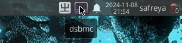
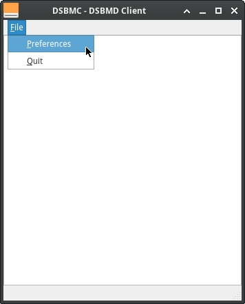
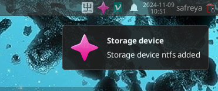
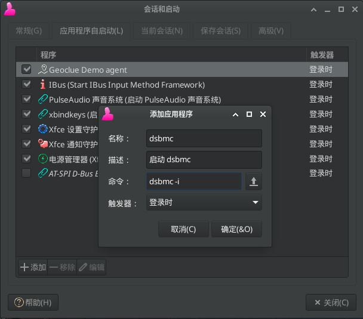
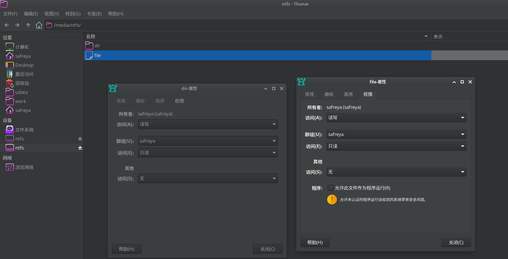

# 25.3 File System Automount

FreeBSD provides multiple methods for automatic mounting.

## Automount

> **Note**
>
> `automount` has limited permission control for regular users and primarily performs mount operations as root; if finer-grained permission control is needed, DSBMD is recommended.

automount is built into the FreeBSD base system and works with devd(8) to monitor device insertion events and automatically perform mount operations. The default mount point is located in the **/media** directory.

The **/etc/auto_master** file controls the behavior of automount. View this file:

```ini
#
# Automounter master map, see auto_master(5) for details.
#
/net		-hosts		-nobrowse,nosuid,intr
#/media		-media		-nosuid,noatime,autoro
#/-		-noauto
```

File description:

| Option | Description |
| ------ | ----------- |
| `-hosts` | Queries remote NFS servers and maps their exported shares |
| `-media` | Queries devices that are not yet mounted but contain valid file systems. Typically used to access files on removable media |
| `-noauto` | Mounts file systems configured as `noauto` in fstab(5) |
| `-null` | Prevents automountd(8) from mounting anything |

To automatically mount removable media, remove the comment symbol at the beginning of the **/media** line in the **/etc/auto_master** file, as follows:

```ini
/media		-media		-nosuid,noatime
```

After that, add the following content to the device state monitoring daemon configuration file **/etc/devd.conf**:

```ini
notify 100 {
	match "system" "GEOM";
	match "subsystem" "DEV";
	action "/usr/sbin/automount -c";
};
```

> **Note**
>
> This should not be added between existing comments.

Enable autofs(4) to start automatically at boot by adding the following line to **/etc/rc.conf**:

```ini
autofs_enable="YES"
```

Each automountable file system will have a corresponding directory under **/media/**. The directory is named after the file system label. If the label is missing, the directory name will be based on the device node. View the mounted files:

```sh
# ls /media/da0p1/
SpaceSniffer.exe
```

The file system is automatically mounted on first access and automatically unmounted after being idle for a period of time. You can also manually unmount automounted devices:

```sh
# automount -fu
```

### Unresolved Issues

#### Chinese Character Garbling

Append `-L=zh_CN.UTF-8` to the end of the **/media** line in **/etc/auto_master**. Note that `-L=zh_CN.UTF-8` is a proprietary parameter of mount_msdosfs(8), and mount programs for other file systems cannot recognize this parameter, which will cause other devices to fail to mount.

References:

- FreeBSD Forums. Autofs. Share your experience[EB/OL]. (2017-06-09) [2026-04-30]. <https://forums.freebsd.org/threads/autofs-share-your-experience.61251/>.

## DSBMD Automount

DSBMD (Desktop Scriptable Block Device Manager Daemon) is a media and file system type detection daemon for FreeBSD. It uses a client-server architecture that allows clients to mount storage devices in a controlled manner. The default configuration can automatically detect and mount removable media.

### Installing DSBMD

The DSBMD system consists of a daemon and clients, which can be installed in the following ways:

- Install using the pkg package manager:

```sh
# pkg install dsbmd       # DSBMD daemon
# pkg install dsbmc-cli   # DSBMC command-line client
# pkg install dsbmc       # DSBMC Qt graphical client
```

- Or compile and install using the Ports system:

```sh
# cd /usr/ports/filesystems/dsbmd/ && make install clean        # Compile and install the dsbmd daemon
# cd /usr/ports/filesystems/dsbmc-cli/ && make install clean   # Compile and install the dsbmc command-line client
# cd /usr/ports/filesystems/dsbmc/ && make install clean       # Compile and install the dsbmc Qt graphical client
```

Clients can be selectively installed based on actual needs. In a desktop environment, the `dsbmc` graphical client is recommended for ease of use.

### Configuring DSBMD

> **Technical Note**
>
> The DSBMD system is divided into two components: the daemon and the client. The client sends requests to DSBMD to mount, unmount, or eject media, and can also set the read speed of CD/DVD drives; the daemon receives and executes these requests. The daemon is a privileged system process with permissions to perform all operations, while the client, as a regular user process, is limited by system permission settings. Mount requests from users with insufficient permissions are verified by the daemon against user and group settings in the configuration file before deciding whether to allow them.

The daemon configuration file is located at **/usr/local/etc/dsbmd.conf**.

By default, members of the `wheel` and `operator` user groups can mount devices. If you need to grant mount permissions to other users, modify the relevant configuration items in the configuration file.

To enable the daemon, run the following commands:

```sh
# service dsbmd enable   # Set the dsbmd daemon to start at boot
# service dsbmd start    # Start the dsbmd daemon
```

#### Qt Client

The `dsbmc` client only sends requests to the daemon when it is running, so the client program needs to be started in the desktop environment.

After starting `dsbmc`, its icon can be observed in the system tray area.



Open the main window, click `preferences` → `general settings` in sequence, and check `automatically mount devices` to enable the automount feature.




After inserting removable media such as a USB drive, the system desktop will display a mount notification:



The mount point is located in the **/media** directory by default, and the owner of the mount point is the client user who initiated the mount request.


##### Xfce Autostart Configuration

In the Xfce desktop environment, you can configure `dsbmc` to start automatically. Click `Settings` → `Session and Startup`, and configure as follows:



#### Command-Line Client

Start the `dsbmc-cli` command-line client:

```sh
$ dsbmc-cli
```

Common parameters include:

| Parameter | Description |
| --------- | ----------- |
| `-e` | Eject device |
| `-m` | Mount device |
| `-u` | Unmount device |

You can add the following command to your shell startup configuration file or desktop startup file (such as the **~/.xinitrc** file or **~/.xprofile** file):

```sh
dsbmc-cli -a &
```

This configuration starts `dsbmc-cli` in the background and enables automounting. The `-a` parameter enables automount mode, where the client continuously monitors device events and automatically performs corresponding operations. This method does not provide graphical interface notifications.

### Daemon Configuration Details

The default configuration usually meets basic usage needs; if you need more fine-grained control over mounting, you need to modify the daemon's configuration file, located at **/usr/local/etc/dsbmd.conf**.

#### usermount Configuration Item Description

The `usermount` configuration item controls whether devices can be mounted as a regular user:

```ini
# usermount - Controls whether DSBMD mounts devices as user. This requires the
# sysctl variable vfs.usermount is set to 1.
usermount = true
```

The configuration file enables the `usermount` option by default, but for it to take effect, `vfs.usermount` must also be enabled in the system kernel parameters. Add the following content to the **/etc/sysctl.conf** file:

```ini
vfs.usermount=1
```

- When `usermount` is enabled, the mount program executes as a regular user; when `usermount` is not enabled, the mount program executes as the `root` privileged user.
- Regardless of whether `usermount` is enabled, the owner of the mount point is always the client user who initiated the request.

#### User Authorization for Automounting

By default, members of the operator and wheel user groups are allowed to connect:

```ini
# allow_users - Comma separated list of users who are allowed to connect.
# allow_users = jondoe, janedoe

# allow_groups - Comma separated list of groups whose members are allowed
# to connect.
allow_groups = operator, wheel
```

By modifying the `allow_users` and `allow_groups` configuration items, you can manage authorized users for the automount feature.

#### Modifying Mount Point and File Directory Access Permissions (Using NTFS as an Example)

Taking the NTFS file system as an example, you can modify the file access permissions to `640` (rw-r-----) and the directory access permissions to `750` (rwxr-x---).

```ini
# ...above configuration content omitted...

ntfs_mount_cmd = "/usr/local/bin/ntfs-3g -o \"uid=${DSBMD_UID},gid=${DSBMD_GID}\" ${DSBMD_DEVICE} \"${DSBMD_MNTPT}\""

# ...middle configuration content omitted...

ntfs_mount_cmd_usr = "/sbin/mount_fusefs auto \"${DSBMD_MNTPT}\" ntfs-3g ${DSBMD_DEVICE} \"${DSBMD_MNTPT}\""

# ...below configuration content omitted...
```

The NTFS mount configuration includes two command forms: when `usermount` is enabled, `ntfs_mount_cmd_usr` is used; otherwise, `ntfs_mount_cmd` is used. Example:

```ini
# ...above configuration content omitted...

# Mount NTFS using ntfs-3g, set file permission mask fmask=137, directory permission mask dmask=027, and specify owner UID and GID
ntfs_mount_cmd = "/usr/local/bin/ntfs-3g -o \"uid=${DSBMD_UID},gid=${DSBMD_GID},fmask=137,dmask=027\" ${DSBMD_DEVICE} \"${DSBMD_MNTPT}\""

# ...middle configuration content omitted...

# Mount NTFS as a regular user, set file permission mask fmask=137, directory permission mask dmask=027
ntfs_mount_cmd_usr = "/sbin/mount_fusefs auto \"${DSBMD_MNTPT}\" ntfs-3g -o fmask=137,dmask=027 ${DSBMD_DEVICE} \"${DSBMD_MNTPT}\""

# ...below configuration content omitted...
```

Here, the file permission mask `fmask=137` and directory permission mask `dmask=027` are specified in the mount options for `ntfs-3g`, which control the permissions of files and directories after mounting.



## File Structure

```sh
/
├── usr
│   ├── local
│   │   └── etc
│   │       └── dsbmd.conf              # DSBMD daemon configuration file
│   └── ports
│       └── filesystems
│           ├── dsbmd                   # DSBMD daemon Port directory
│           ├── dsbmc-cli               # DSBMC command-line client Port directory
│           └── dsbmc                   # DSBMC Qt graphical client Port directory
├── etc
│   └── sysctl.conf                       # System kernel parameter configuration file
├── media                                  # Default mount point directory
└── home
    └── ykla
        ├── .xinitrc                      # X initialization configuration file
        └── .xprofile                     # X session configuration file
```

## References

- FreeBSD Project. autofs -- filesystem automounter[EB/OL]. [2026-04-14]. <https://man.freebsd.org/cgi/man.cgi?query=autofs&sektion=4>. autofs file system manual page, describing the automount mechanism.
- FreeBSD Project. auto_master -- auto_master database[EB/OL]. [2026-04-14]. <https://man.freebsd.org/cgi/man.cgi?query=auto_master&sektion=5>. Automount master configuration file format manual page.
- FreeBSD Project. automountd -- daemon handling autofs mount requests[EB/OL]. [2026-04-14]. <https://man.freebsd.org/cgi/man.cgi?query=automountd&sektion=8>. Automount daemon manual page.
- FreeBSD Project. mount -- mount file systems[EB/OL]. [2026-04-14]. <https://man.freebsd.org/cgi/man.cgi?query=mount&sektion=8>. File system mount command manual page.
- FreeBSD Project. fstab -- static information about the filesystems[EB/OL]. [2026-04-14]. <https://man.freebsd.org/cgi/man.cgi?query=fstab&sektion=5>. File system table configuration file format manual page.
- FreeBSD Project. FreeBSD Handbook, Chapter 20: Storage[EB/OL]. [2026-04-14]. <https://docs.freebsd.org/en/books/handbook/disks/>. Configuration guide for storage and file systems in the FreeBSD Handbook.
