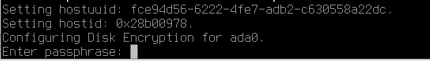

# 27.6 UFS Disk Encryption

## Overview of the GELI Encryption GEOM Class

`geli` is an encryption GEOM class. This control utility supports multiple encryption schemes and provides the following features:

- Utilizes the crypto(9) framework and automatically uses cryptographic hardware when available.
- Supports multiple encryption algorithms, such as AES-XTS, AES-CBC, and Camellia-CBC (CBC mode is not recommended for new deployments).
- Can encrypt the root partition. A password is required at system boot to access the encrypted root partition.
- Can use two independent keys.
- Performs simple sector-to-sector encryption, making it fast.
- Can back up and restore the master key. If a key is destroyed, the backed-up key can still be restored to access data.
- Can attach disks using random one-time keys, which is useful for swap partitions and temporary file systems.

The following example demonstrates how to generate a key file. The encryption provider will be mounted under **/mnt**, and the key file is used to protect the master key of the encryption provider. The key file provides random data for encrypting the master key. The master key is also protected by a passphrase. The provider's sector size is set to 4kB. This example also covers attaching the `geli` provider, creating a file system, mounting, operating, and unmounting.

## Loading the Kernel Module

Load the `geli` support module. `geli` support is provided as a loadable kernel module. To configure the system to automatically load this module at boot, add the following line to **/boot/loader.conf**:

```sh
geom_eli_load="YES"
```

To load the kernel module immediately:

```sh
# kldload geom_eli
```

## Generating a Key File

Generate a key file for the master key (stored as disk metadata). The following command generates a key file; all data will be encrypted using this as the credential. You can change the user key via `geli setkey`. The user key consists of the random bytes from the key file `/root/ada0.key` combined with a passphrase. This example uses `/dev/random` as the data source for the key file:

```sh
# dd if=/dev/random of=/root/ada0.key bs=64 count=1
```

## Encrypting the Disk

Encrypt disk **ada0** using **/root/ada0.key**:

```sh
# geli init -K /root/ada0.key -s 4096 /dev/ada0
```

The following output will be displayed:

```sh
Enter new passphrase: # Set a new passphrase:
Reenter new passphrase: # Re-enter the new passphrase:

Metadata backup for provider /dev/ada0 can be found in /var/backups/ada0.eli
and can be restored with the following command:

	# geli restore /var/backups/ada0.eli /dev/ada0

```

Using both a passphrase (pressing Enter to leave it empty is allowed) and a key file is not mandatory; either method can be used independently to protect the master key.

Attach the provider using the generated key. To attach the provider, specify the key file, disk name, and passphrase:

```sh
# geli attach -k /root/ada0.key /dev/ada0
Enter passphrase: # Enter the passphrase:
```

This creates a new device **ada0.eli** with the **.eli** extension:

```sh
# ls -al /dev/ada0*
crw-r-----  1 root operator 0x6f May 18 06:17 /dev/ada0
crw-r-----  1 root operator 0x75 May 18 06:17 /dev/ada0.eli
```

## Creating a New File System

Then format the device with a UFS file system and mount it to an existing mount point:

```sh
# newfs -U /dev/ada0.eli
# mount /dev/ada0.eli /mnt
```

The encrypted file system is now ready for use:

```sh
# df -H
Filesystem      Size    Used   Avail Capacity  Mounted on
/dev/nda0p2      19G    1.9G    16G    11%    /
devfs            1.0k     0B    1.0k     0%    /dev
/dev/nda0p1      268M   1.4M   267M     1%    /boot/efi
/dev/ada0.eli    5.2G   8.2k   4.8G     0%    /mnt
```

After completing operations on the encrypted partition, if the **/mnt** partition is no longer needed, you can unmount it and detach the `geli` encrypted partition from the kernel, placing the device into cold storage:

```sh
# umount /mnt
# geli detach ada0.eli
```

## Persistent Mounting

To simplify the process of mounting `geli` encrypted devices at boot, the system provides an **rc.d** script. In this example, add the following lines to **/etc/rc.conf**:

```sh
geli_devices="ada0"
geli_ada0_flags="-k /root/ada0.key"
```

This configures **/dev/ada0** as a geli device and specifies **/root/ada0.key** as the key file for the user key. After this, the file system will be mounted, typically through an entry in **/etc/fstab** (add the following line):

```ini
/dev/ada0.eli   /mnt   ufs   rw   0   0
```

Before the system shuts down, the provider will be automatically detached from the kernel. During the boot process, the script will prompt for a passphrase and then attach the provider. Other kernel messages during boot may appear before or after the passphrase prompt.



If the boot process stalls, look carefully for the passphrase prompt among other messages. After entering the correct passphrase, the provider will be attached.
