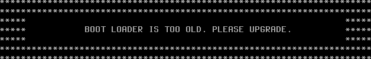

# 28.4 Updating ZFS Storage Pools

The available features of a ZFS storage pool are controlled by feature flags. After a FreeBSD major version upgrade, you must manually run `zpool upgrade` to enable the new feature set — this operation is irreversible. Once upgraded, older systems will not be able to recognize the new feature set. Before upgrading, evaluate whether older systems will need to import the pool again in the future.

> **Warning**
>
> Since the ZFS built into older systems is not compatible with the feature set of newer ZFS file systems, please prepare backups and an emergency CD to handle unexpected situations.

## Verifying the ZFS Version

First, verify the current system and ZFS version:

- Check the current system version

```sh
# freebsd-version -kru
15.0-RELEASE
15.0-RELEASE
15.0-RELEASE
```

- Check the ZFS/zpool related version

```sh
# zpool version
2.4.0-rc4-FreeBSD_g099f69ff5
zfs-kmod-2.4.0-rc4-FreeBSD_g099f69ff5
```

> **Warning**
>
> This means that any operating system with a ZFS version lower than 2.4.0-rc4 may fail to boot after the upgrade.

## Performing the Upgrade

After a FreeBSD upgrade, new ZFS feature flags are not available until `zpool upgrade` is executed. Perform the upgrade:

```sh
# zpool status  # Display the status and detailed information of all ZFS pools
  pool: zroot
 state: ONLINE
status: Some supported and requested features are not enabled on the pool.
        The pool can still be used, but some features are unavailable.
action: Enable all features using 'zpool upgrade'. Once this is done,
        the pool may no longer be accessible by software that does not support
        the features. See zpool-features(7) for details.
  scan: scrub repaired 0B in 00:01:08 with 0 errors on Sun Dec  7 20:34:48 2025
config:

        NAME        STATE     READ WRITE CKSUM
        zroot       ONLINE       0     0     0
          nda0p4    ONLINE       0     0     0

errors: No known data errors
```

> Status: Some supported and requested features are not yet enabled on the pool. The pool can still be used, but some features are unavailable.
>
> Action: Use 'zpool upgrade' to enable all features. Once this is done, software that does not support these features may no longer be able to access the pool.

> **Warning**
>
> The operation of enabling the new feature set with `zpool upgrade` is irreversible. Once upgraded, older systems will not be able to recognize the new feature set. Before executing, confirm that all systems that need to access the pool have been upgraded to a compatible version.

Based on the system prompt: The system indicates that an update is needed, but after the update, older systems may fail to boot. First, preview the features that will be updated:

```sh
# zpool upgrade  # View the upgradeable feature flags for all ZFS pools
This system supports ZFS pool feature flags.

All pools are formatted using feature flags.


Some supported features are not enabled on the following pools. Once a
feature is enabled the pool may become incompatible with software
that does not support the feature. See zpool-features(7) for details.

Note that the pool 'compatibility' feature can be used to inhibit
feature upgrades.

Features marked with (*) are not applied automatically on upgrade, and
must be applied explicitly with zpool-set(7).

POOL  FEATURE
---------------
zroot
      redaction_list_spill
      raidz_expansion
      fast_dedup
      longname
      large_microzap
      dynamic_gang_header(*)
      block_cloning_endian
      physical_rewrite
```

Except for features marked with \*, which require manual enabling, the remaining features will be enabled by default after the upgrade.

> **Note**
>
> `zpool upgrade` does not actually enable these feature flags; it is only used to preview the features that can be enabled. To perform the upgrade, you must also specify the pool name, for example `zpool upgrade zroot`. See: 'zpool status' gives confusing suggestion with 'zpool upgrade'[EB/OL]. [2026-03-26]. <https://github.com/openzfs/zfs/issues/17910>. OpenZFS project discussion about the zpool upgrade command issue.

> **Discussion Question**
>
> Some contributors considered the fix PR associated with the above issue to be trivial and insignificant, and rejected it on the grounds that each line must not exceed 80 characters. However, countless users have wasted significant amounts of time on such "minor issues." What is the true cost of ignoring the power of words?

Now perform the actual upgrade:

```sh
# zpool upgrade zroot  # Upgrade the ZFS pool zroot to the latest feature flag version supported by the current system
This system supports ZFS pool feature flags.

Enabled the following features on 'zroot':
  redaction_list_spill
  raidz_expansion
  fast_dedup
  longname
  large_microzap
  block_cloning_endian
  physical_rewrite

Pool 'zroot' has the bootfs property set, you might need to update
the boot code. See gptzfsboot(8) and loader.efi(8) for details.
```

- Display the current status and health information of all ZFS pools:

```sh
# zpool status
  pool: zroot
 state: ONLINE
  scan: scrub repaired 0B in 00:01:08 with 0 errors on Sun Dec  7 20:34:48 2025
config:

        NAME        STATE     READ WRITE CKSUM
        zroot       ONLINE       0     0     0
          nda0p4    ONLINE       0     0     0

errors: No known data errors
```

The upgrade completed successfully, and the ZFS pool status is normal.

### Appendix: Feature Flags Requiring Manual Enablement

This appendix describes ZFS feature flags that require manual enablement and how to enable them:

Check which feature flags currently require manual enablement (marked with \*):

```sh
# zpool upgrade  # View upgradeable ZFS pools and their supported feature flags
This system supports ZFS pool feature flags.

All pools are formatted using feature flags.


Some supported features are not enabled on the following pools. Once a
feature is enabled the pool may become incompatible with software
that does not support the feature. See zpool-features(7) for details.

Note that the pool 'compatibility' feature can be used to inhibit
feature upgrades.

Features marked with (*) are not applied automatically on upgrade, and
must be applied explicitly with zpool-set(7).

POOL  FEATURE
---------------
zroot
      dynamic_gang_header(*)
```

As shown, `dynamic_gang_header` can be manually enabled. Next, query the status of this feature flag in the ZFS pool:

```sh
# zpool get feature@dynamic_gang_header
NAME   PROPERTY                     VALUE                        SOURCE
zroot  feature@dynamic_gang_header  disabled                     local
```

This feature flag is not enabled. Now enable the `dynamic_gang_header` feature flag on the zroot pool:

```sh
# zpool set feature@dynamic_gang_header=enabled zroot
```

Check the current status of the dynamic_gang_header feature flag in the zroot pool again:

```sh
# zpool get feature@dynamic_gang_header
NAME   PROPERTY                     VALUE                        SOURCE
zroot  feature@dynamic_gang_header  enabled                      local
```

Check the currently upgradeable ZFS pools and their supported feature flags:

```sh
# zpool upgrade
This system supports ZFS pool feature flags.

All pools are formatted using feature flags.

Every feature flags pool has all supported and requested features enabled.
```

## Updating the Boot Loader (UEFI Boot)

> **Warning**
>
> Please update **loader.efi** before updating the ZFS version!

For systems using EFI boot, a copy of the boot loader resides on the EFI System Partition (ESP) and is used by the firmware to boot the kernel. If the root file system is ZFS, the boot loader must be able to read the ZFS boot file system. After a system upgrade and before executing `zpool upgrade`, the boot loader on the ESP must be updated first, otherwise the system may fail to boot. Although not mandatory, this should also be done when UFS is the root file system.

The command `efibootmgr -v` can be used to determine the location of the current boot loader. The value of `BootCurrent` is the boot entry number used to boot the current system. The corresponding entry in the output starts with `+`, as shown below:

```sh
# efibootmgr -v
Boot to FW : false
BootCurrent: 0004
BootOrder  : 0004, 0000, 0001, 0002, 0003
+Boot0004* FreeBSD HD(1,GPT,f83a9e2f-bd87-11ef-95b7-000c29761cd2,0x28,0x82000)/File(\efi\freebsd\loader.efi) # Note this line
                      nda0p1:/efi/freebsd/loader.efi (null)
 Boot0000* EFI VMware Virtual NVME Namespace (NSID 1) PciRoot(0x0)/Pci(0x15,0x0)/Pci(0x0,0x0)/NVMe(0x1,00-00-00-00-00-00-00-00)
 Boot0001* EFI VMware Virtual IDE CDROM Drive (IDE 1:0) PciRoot(0x0)/Pci(0x7,0x1)/Ata(Secondary,Master,0x0)
 Boot0002* EFI Network PciRoot(0x0)/Pci(0x11,0x0)/Pci(0x1,0x0)/MAC(000c29761cd2,0x0)
 Boot0003* EFI Internal Shell (Unsupported option) MemoryMapped(0xb,0xbeb4d018,0xbf07e017)/FvFile(c57ad6b7-0515-40a8-9d21-551652854e37)


Unreferenced Variables:
```

The ESP is typically already mounted at **/boot/efi**. If not, it can be mounted manually using the partition listed in the `efibootmgr` output (in this example, `nda0p1`): `mount_msdosfs /dev/nda0p1 /boot/efi`. For another example, see [loader.efi(8)](https://man.freebsd.org/cgi/man.cgi?query=loader.efi&sektion=8).

The value of the `File` field in the `efibootmgr -v` output, such as **\efi\freebsd\loader.efi**, is the path of the currently used boot loader in the EFI System Partition. If the mount point is **/boot/efi**, then this file is **/boot/efi/efi/freebsd/loader.efi**. (On FAT32 file systems, paths are case-insensitive; FreeBSD uses lowercase.) Another common value for `File` might be **\EFI\boot\bootXXX.efi**, where `XXX` is amd64 (i.e., `x64`), aarch64 (i.e., `aa64`), or riscv64 (i.e., `riscv64`); if not configured, this is the default boot loader. You should copy **/boot/loader.efi** to the correct path within **/boot/efi** to update both the configured and default boot loaders.

### Performing the Update

After a version update, the system may display a prompt during boot indicating that the boot loader version is too old, showing a message similar to the following.



> **Note**
>
> This screen appears briefly and may flash by on fast-booting systems. You can use a camera to capture and review it.

```sh
**************************************************************
**************************************************************
*****                                                    *****
*****      BOOT LOADER IS TOO OLD, PLEASE UPGRADE.       *****
*****                                                    *****
**************************************************************
**************************************************************
```

This indicates that the loader needs to be updated. You can also verify the version with the following commands:

```sh
# strings /boot/efi/efi/freebsd/loader.efi | grep FreeBSD | grep EFI  # Check the EFI boot loader version
FreeBSD/amd64 EFI loader, Revision 1.1

# strings /boot/loader.efi | grep FreeBSD | grep EFI  # Check the EFI boot loader version of /boot/loader.efi
FreeBSD/amd64 EFI loader, Revision 3.0
```

**/boot/efi/efi/freebsd/loader.efi** is the currently used loader (the version is indeed older).

Copy **/boot/loader.efi** to the FreeBSD directory on the EFI System Partition to update it:

```sh
# cp /boot/loader.efi /boot/efi/efi/freebsd/loader.efi
```

## Rewriting Boot Code (BIOS Legacy Boot)

Under BIOS legacy boot mode, after a storage pool upgrade, you may need to manually rewrite the boot code, otherwise the system may fail to boot properly.

> **Warning**
>
> The `bootfs` property is a key indicator for ZFS to boot FreeBSD. Ignoring this prompt may not cause immediate problems, but once the underlying risk manifests, it will result in the system failing to boot. Therefore, it is recommended to rewrite the `boot code` as prompted. Practical experience shows that failing to update the boot code in a timely manner may cause boot failures during subsequent system updates. If there is no **freebsd-boot** partition in the system, the following steps are not necessary.

List all disks and their partition table information in the system:

```sh
# gpart show

=>      40  33554352  ada0  GPT  (16G)
        40      1024     1  freebsd-boot  (512K)
      1064       984        - free -  (492K)
      2048   4194304     2  freebsd-swap  (2.0G)
   4196352  29356032     3  freebsd-zfs  (14G)
  33552384      2008        - free -  (1.0M)
```

Find the partition of type `freebsd-boot`. Here the partition index is `1`, which corresponds to the `-i` option in the following command, then rewrite the `bootcode`:

> **Warning**
>
> `gpart bootcode` will write boot code to the specified partition. Improper operation may cause the system to fail to boot. Please confirm that the partition index (the `-i` parameter) corresponds to the `freebsd-boot` partition.

```sh
# gpart bootcode -p /boot/gptzfsboot -i 1 ada0  # Write GPT ZFS boot code to partition 1 of disk ada0
partcode written to ada0p1
```

List the status and detailed information of all ZFS pools again:

```sh
# zpool status

  pool: zroot
 state: ONLINE
config:

NAME        STATE     READ WRITE CKSUM
zroot       ONLINE       0     0     0
  ada0p3    ONLINE       0     0     0

errors: No known data errors
```
