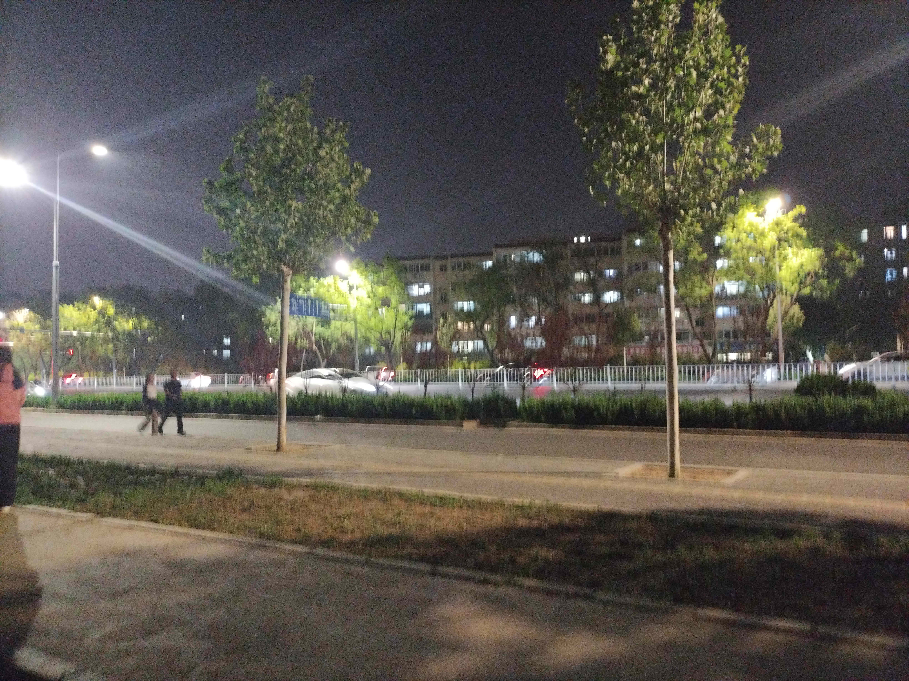
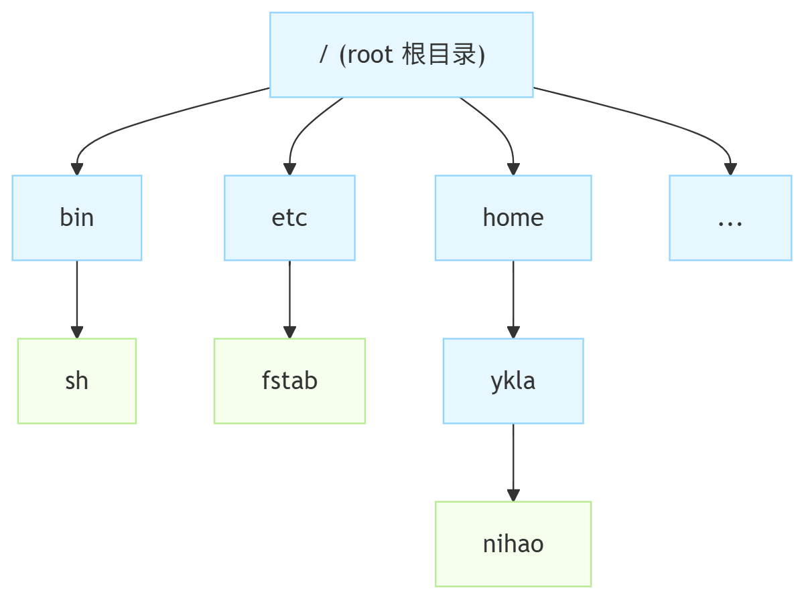
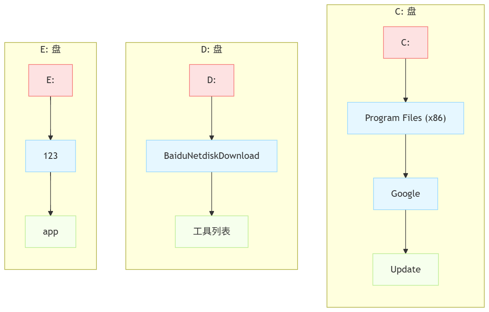
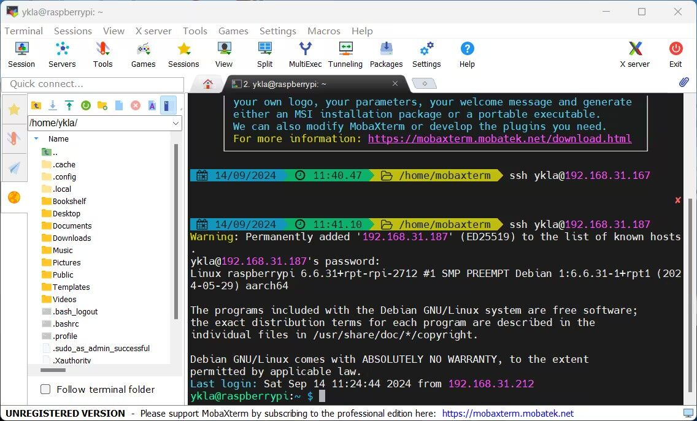

# 3.1 Windows User Migration Guide

Operating system migration involves multi-dimensional differences in file system concepts, character encoding, line ending conventions, and time zone handling. Users migrating from Windows to FreeBSD need to understand these differences before they can transition smoothly.

## File System Basics

First, observe the following two images:




The former image shows bamboo (Bambusoideae), while the latter shows several street trees.

Aristotle believed that a seed can grow into a tree because the seed contains a potentiality that, when environmental conditions are met, may grow into a tree (see *Metaphysics* IX.7, 1049b). The difference between humans and implements lies in the fact that humans have no fixed, unchanging potentiality — this aligns with the Confucian saying "the gentleman is not an implement" (He Yan, commentary; Xing Bing, sub-commentary. *Lunyu Zhushu*[M]. Beijing: China Zhigong Press, 2016. ISBN: 978-7-5145-0846-8.) and Sartre's notion that "existence precedes essence" (see Sartre J P. *Collected Philosophical Essays of Sartre*[M]. Translated by Pan Peiqing, et al. Hefei: Anhui Literature and Art Publishing House, 1998. ISBN: 7-5396-1632-6.). From this perspective, understanding the similarities and differences between UNIX directories and Windows directories allows one to gain insight into the logic of operating system design and implementation.



The growth and development of bamboo is often used as a classic biological example: many seemingly lush and thriving bamboo forests may actually have only one truly living bamboo — they all grow from the same underground root system, appearing as multiple independent individuals but actually belonging to a single organism. Botany calls this phenomenon **clonal growth**, which is also the origin of the saying "bamboo shoots after rain." No matter how far apart the bamboos are, they still prosper together and suffer together. Because of this, when bamboo (Bambusoideae) flowers, it often signals that a large area of the bamboo forest will subsequently die.

This is precisely the portrait of UNIX directories: all directories in the system rely on the root directory. The root (**/**) is the starting point of all directories, forming a **single-rooted directory hierarchy**. For example, **/home/ykla/nihao**, **/bin/sh**, **/etc/fstab** — tracing back to their origins, they all start from the root directory. That is to say, deleting **/** means deleting the entire system, and all directories on all devices will be deleted along with it.



Street trees are different; each one grows independently. Even if two trees stand side by side, they are still independent individuals. Street trees are like Windows directories, where drive letters are independent of each other — **C:\Program Files (x86)\Google\Update**, **D:\BaiduNetdiskDownload\Tool List**, **E:\123\app**: the `C`, `D`, and `E` drives are isolated from each other and do not interfere. Formatting the `D` drive does not affect the files stored on the `E` drive. Even formatting the `C` drive in a PE environment (which may not appear as the `C` drive) does not affect the files on the `E` drive.

Windows "drive letters" do not exist as fixed entities. In a PE environment, the `C` drive may appear as a different drive letter (such as `X`); a running Windows system can also arbitrarily assign drive letters.

Windows determines the correspondence between partitions and drive letters based on GPT partition type UUIDs (for example, the Windows data partition type UUID is `EBD0A0A2-B9E5-4433-87C0-68B6B72699C7`, which is the Microsoft Basic Data type, applicable to all Windows data partitions, not just the C drive) and the partition's unique GUID (the relevant configuration is written to the registry **HKLM\SYSTEM\MountedDevices** by the Windows Mount Manager), rather than relying on the drive letters themselves.

View the mapping between drive letters and volumes:

```powershell
PS C:\WINDOWS\system32> Get-ItemProperty -Path "HKLM:\SYSTEM\MountedDevices"


\DosDevices\C:                          : {68, 77, 73, 79...}   # C: drive letter mapping entry, corresponding to the binary identifier of a disk volume (Volume GUID/volume structure data)
#{6dc6b5e1-fff0-11f0-bf73-b0416f0b5119} : {68, 77, 73, 79...}   # Volume GUID (unique volume identifier), representing a physical partition; the right side is the internal binary data of that volume
\DosDevices\D:                          : {68, 77, 73, 79...}   # D: drive letter mapping entry, corresponding to the identifier data of another disk volume
PSPath
                                 :
……other output omitted……
```

Drive letters are an abstract mapping and inherently have no fixed physical significance. There is no hardcoded `C` drive identifier in the file system, which also explains why `C` drives are not visible in other operating systems (including Windows dual-boot environments). Only after the system is actually booted can Windows determine which partition corresponds to the `C` drive and write it to the registry. The assignment of other drive letters is uncertain; it is not uncommon for the `D` drive to become the `E` drive, for example, a virtual optical drive may be automatically loaded at startup.

> **Discussion Question**
>
> Read *Windows Internals, Part 2 (7th Edition)* (978-7-115-61974-7, Posts & Telecom Press) and other relevant literature, and answer the question: Under traditional BIOS + MBR boot, how does Windows identify the `C` drive?

### The Concept and Mechanism of Mounting


From a horticultural perspective, it is typically necessary to cut a branch from tree A, insert it diagonally into tree B and wrap it securely; after healing, the two become one: for example, a peach (mounting Windows' `C` drive) can grow on an apple tree (UNIX).

This method is called "grafting." Its essence is mounting the branch (file system) of tree A onto tree B (the grafting point is the mount point, which ultimately relies on the root directory **/**).

At the operating system technical level, mounting refers to the operation of attaching a file system to an existing directory (mount point) in the system directory tree. A file system can be viewed as a tree structure rooted at **/**, and one file system must be mounted onto a directory within another file system. After file system B is mounted to directory A, B's root directory replaces A, and the directories contained in B become visible; the original files in A are temporarily hidden until B is unmounted from A, at which point they reappear.

The mount tool invokes the nmount(2) system call to map and graft a special device or remote node (rhost:path) onto a node position in the file system tree. The system maintains a list of currently mounted file systems. If mount is called without any arguments, it will print this list.

> **Note**
>
> FreeBSD's `mount` originates from 4.4BSD and is largely compatible with Linux's `mount` in terms of option syntax, but FreeBSD uses the nmount(2) system call instead of Linux's mount(2). FreeBSD's `mount` automatically invokes the **/sbin/mount_type** program based on the file system type (such as `mount_nfs`, `mount_msdosfs`).

### The Concept and Mechanism of Unmounting


Readers familiar with horticulture should be no strangers to the plant cultivation method of "cutting":

Cut a newly grown side branch from a tree and insert it into the soil. After careful care for a period of time, a new seedling can be obtained.

This shares the same principle as unmounting: detaching a file system (such as **/mnt/test**) from the complete root (**/**), i.e., removing its association with the directory tree.

At the technical level, unmounting is the reverse operation of mounting; it separates a mounted file system from the system directory tree. After file system B is unmounted from A, the original files in A reappear.

### The fstab File

During the boot process, the system automatically mounts the file systems listed in the **/etc/fstab** file (except for entries marked with the `noauto` option).

The entry format in this file is as follows:

```sh
Device       /MountPoint FileSystem     Options      Dump     fsck Order
```

Description:

| Field | Description |
| ----- | ----------- |
| `Device` | Existing device name |
| `MountPoint` | Existing directory for mounting the file system |
| `FileSystem` | File system type passed to mount(8) |
| `Options` | `rw` for read-write file system, `ro` for read-only file system, can be followed by other options. Common options include `noauto`, which means this file system will not be mounted at boot |
| `Dump` | Used by dump(8) to determine which file systems need backup. Default value is `0` |
| `fsck Order` | Determines which file systems should be checked by fsck(8) after reboot, and the check order. File systems that should be skipped are set to `0`. The root file system should be checked first, set to `1`; other file systems should be set to values greater than 1. If multiple file systems have the same `passno`, fsck(8) will attempt to check them in parallel |

Example: The **/etc/fstab** file under a standard ZFS installation.

```sh
# Device		Mountpoint	FStype	Options		Dump	Pass#
/dev/gpt/efiboot0		/boot/efi	msdosfs	rw		2	2	# EFI partition
/dev/nda0p2		none	swap	sw		0	0	# Swap partition
```

> **Note**
>
> ZFS does not use the **/etc/fstab** file, so if no ZFS file system (**/**) exists in this file, this is normal.

Example: The **/etc/fstab** file under a standard UFS installation.

```sh
# Device	Mountpoint	FStype	Options	Dump	Pass#
/dev/nda0p2	/		ufs	rw	1	1	# Root partition
/dev/nda0p1	/boot/efi		msdosfs	rw	2	2	# EFI partition
/dev/nda0p3	none		swap	sw	0	0	# Swap partition
```

### References

- Microsoft. PARTITION_INFORMATION_GPT[EB/OL]. [2026-04-18]. <https://learn.microsoft.com/en-us/windows/win32/api/winioctl/ns-winioctl-partition_information_gpt>. GPT partition type GUID definitions, where the Microsoft Basic Data type is EBD0A0A2-B9E5-4433-87C0-68B6B72699C7.
- Microsoft. Supporting Mount Manager Requests in a Storage Class Driver[EB/OL]. [2026-04-18]. <https://learn.microsoft.com/en-us/windows-hardware/drivers/storage/supporting-mount-manager-requests-in-a-storage-class-driver>. The Windows Mount Manager persists the mapping between drive letters and partitions in the registry **HKLM\SYSTEM\MountedDevices**.
- GBIF. Bambusoideae Luerss.[EB/OL]. [2026-04-18]. <https://www.gbif.org/species/113642445>. Many species in the bamboo subfamily exhibit gregarious flowering characteristics, often dying from resource depletion after flowering; bamboo propagates through underground rhizome systems via clonal growth, with individuals in the same clone sharing resources.
- Aristotle. Metaphysics[M]. Translated by W. D. Ross. Oxford: Clarendon Press, 1908. Book IX (Theta), Chapter 7, 1049b. Aristotle on potentiality and actuality: a seed can grow into a tree because the seed implicitly contains a potentiality.

## Differences in File Name Conventions

### Invalid Characters

Many file names or paths that are legal in FreeBSD are illegal in Windows (i.e., contain invalid characters). This situation is commonly encountered when using Git to pull projects on Windows.

The following lists only some typical cases:

- File or folder names cannot contain the English colon `:`.


- A file or folder cannot be named `con`.


For more requirements, see: Microsoft. Naming Files, Paths, and Namespaces[EB/OL]. [2026-03-26]. <https://learn.microsoft.com/en-us/windows/win32/fileio/naming-a-file>.

> **Tip**
>
> You can use Git tools on Windows to pull the [freebsd-doc](https://github.com/freebsd/freebsd-doc) project to verify compatibility issues. Related bug report: [The colon in the file name of the security report of the FreeBSD doc is not compatible with Microsoft Windows](https://bugs.freebsd.org/bugzilla/show_bug.cgi?id=267636)

### Case Sensitivity

The case sensitivity comparison of common file systems is as follows:

| Operating System/File System | Case Behavior | Notes |
| ---------------------------- | ------------- | ----- |
| FreeBSD ZFS | Case-sensitive | Default |
| FreeBSD UFS | Case-sensitive | Default |
| macOS HFS+ | Case-insensitive by default | Case-sensitive variant can be selected during formatting |
| macOS APFS | Case-insensitive by default | Case-sensitive variant can be selected during formatting |
| Windows FAT32 | Case-insensitive | / |
| Windows NTFS | Case-preserving, insensitive by default | After Windows 10 1803, case sensitivity can be enabled per directory via `fsutil.exe file setCaseSensitiveInfo <path> enable`, and `fsutil.exe file queryCaseSensitiveInfo <path>` can query the case sensitivity status of a directory, primarily for WSL compatibility |

- Windows is **case-insensitive**


In Windows, `abc` and `ABC` are treated as the same file and cannot coexist.

> **Tip**
>
> A simple method to determine the type of website server: if both `https://example.com/path` and `https://example.com/PATH` are accessible and show the same content, the website may be running on the Windows operating system.

- FreeBSD is **case-sensitive**

```sh
$ touch ABC    # Create file ABC
$ touch abc    # Create file abc
$ ls           # List current directory contents (case-sensitive file names)
abc    ABC
```

In FreeBSD, `abc` and `ABC` are two independent files that can coexist.

#### References

- Microsoft. Adjust case sensitivity[EB/OL]. [2026-03-26]. <https://learn.microsoft.com/en-us/windows/wsl/case-sensitivity>. Windows file systems support setting case sensitivity per directory using attribute flags, providing cross-platform file compatibility support.
- Microsoft. FAT32 File System[EB/OL]. [2026-04-18]. <https://learn.microsoft.com/en-us/previous-versions/aa364047(v=vs.85)>. FAT file system volumes are case-insensitive.
- Apple. File system formats available in Disk Utility[EB/OL]. [2026-04-18]. <https://support.apple.com/guide/disk-utility/file-system-formats-dsku19ed921c/mac>. Both APFS and HFS+ are case-insensitive by default, but case-sensitive variants can be selected during formatting.

## Line Ending Differences

Carriage Return (CR) and Line Feed (LF) are different concepts, both originating from the teletypewriter (real TTY) era.

| Concept | Full Name | Function |
| ------- | --------- | -------- |
| CR | Carriage Return | Move the cursor to the beginning of the current line |
| LF | Line Feed | Move the cursor to the next line |

It can be seen that in the early days, the two were independent of each other; otherwise, CRLF would cause the current line to "sink" by one line.

The default text line ending for the Windows operating system is CRLF (i.e., `\r\n`, 0x0D 0x0A, `^M$`), while UNIX defaults to LF (i.e., `\n`, 0x0A, `$`), and Classic Mac OS uses `\r` (0x0D).

Today, these two symbols are typically found at the end of each line.

The two are mutually incompatible. Placing a file with Windows line endings on a UNIX system may result in an extra `^M` character at the end of each line; some tools may produce recognition errors as a result, and for FreeBSD Port-related files, multiple lines may be recognized as a single line.

However, the two line endings can be converted between each other. On FreeBSD, you can use the Port **converters/dos2unix**, which includes two commands: `dos2unix` (Windows line endings to UNIX) and `unix2dos` (UNIX line endings to Windows). The basic usage is `dos2unix -n a.txt b.txt`; if you don't need to keep the source file, you can directly use `dos2unix a.txt b.txt c.txt` (convert multiple files at once). You can use the command `file a.txt` to determine the line ending type of a file:

- Text file using regular UNIX line endings

```sh
$ file a.txt  # View file type
a.txt: Unicode text, UTF-8 text
```

- Text file using Windows line endings

```sh
$ file b.txt  # View file type
b.txt: Unicode text, UTF-8 text, with very long lines (314), with CRLF line terminators
```

### References

- IETF. RFC 2046: Multipurpose Internet Mail Extensions (MIME) Part Two: Media Types[EB/OL]. [2026-04-18]. <https://datatracker.ietf.org/doc/html/rfc2046>. Specifies that the canonical line ending for text types is CRLF (0x0D 0x0A).
- IETF. RFC 20: ASCII format for network interchange[EB/OL]. [2026-04-18]. <https://www.rfc-editor.org/rfc/rfc20.html>. ASCII character encoding standard, defining the 7-bit 128-character encoding, where 0x41 is the uppercase letter A; the standard defines CR as 0x0D (the 13th control character) and LF as 0x0A (the 10th control character), both originating from the physical operations of the teletypewriter era.
- Wasserburger E. dos2unix / unix2dos - Text file format converters[EB/OL]. [2026-04-18]. <https://dos2unix.sourceforge.io/>. dos2unix and unix2dos command-line tools for converting between CRLF (Windows) and LF (UNIX) line ending formats; the FreeBSD Port path is converters/dos2unix. The base system version and the Port version are different programs. The Port is an enhanced version that supports more options.

## Character Encoding Differences

Computers only recognize `0` and `1`, so character encoding is a rule system for converting characters into numeric representations. Characters can be visible text on screen or invisible control markers such as line feed (LF) and carriage return (CR), encompassing numbers, emoji, Chinese characters, Latin letters, and other common text elements. The encoding process assigns a unique numeric identifier (typically an integer) to these characters, known as a code point.

For example, in ASCII (American Standard Code for Information Interchange, ANSI X3.4) encoding, `0x41` (binary `0100 0001`) represents the uppercase letter `A`. ASCII only supports English letters, digits, and common punctuation, totaling 128 characters.

In the Unicode encoding system, the code point for the Chinese character "你" is U+4F60. Under the UTF-8 (8-bit Unicode Transformation Format) encoding method, it is encoded as the byte sequence `0xE4 0xBD 0xA0` (binary `11100100 10111101 10100000`). The range of characters contained in UTF-8 encoding far exceeds GBK (Guobiao Extension), even including Egyptian hieroglyphs. If you can see the three characters 𓀀 𓃕 𓌊 on the current screen, you are likely using UTF-8 encoding (if you are using UTF-8 encoding but still cannot display these characters, it is likely that the font does not support these character sets, not an encoding issue).

How do programs identify text encoding? Some files use specific byte sequences at the beginning (i.e., BOM, byte order mark) to indicate the encoding. For example, the BOM for UTF-8 is `0xEF 0xBB 0xBF`. However, many text files do not have a BOM, and reading programs need to guess the encoding format from context, which often leads to garbled text. Although encoding can be guessed by analyzing text content through programs (such as statistical character distribution or extracting characters for calculation), this method is not necessarily reliable. The fundamental cause of encoding issues lies in different default encodings across systems or the failure to explicitly specify encoding.

Windows defaults to GBK (in the Simplified Chinese environment, a superset of GB2312), while Linux or UNIX typically uses UTF-8.

- Windows 11 24H2 viewing the current console code page:

```powershell
PS C:\Users\ykla> chcp
Active code page: 936 # CP936 encoding (approximately GBK)
```

- Ubuntu 24.04/FreeBSD output of the current locale character encoding:

```sh
root@ykla:/home/ykla# locale charmap
UTF-8
```

Additionally, the system character encoding of Windows 10 and later versions can be set to UTF-8. However, such settings often introduce more encoding issues rather than fundamentally solving the problem.

FreeBSD's encoding is set in the [main/usr.bin/login/login.conf](https://github.com/freebsd/freebsd-src/blob/main/usr.bin/login/login.conf) file, with the compiled path being **/etc/login.conf**.

### References

- Microsoft. Code pages[EB/OL]. [2026-03-26]. <https://learn.microsoft.com/en-us/globalization/encoding/code-pages>. Microsoft officially states that 936 is GBK, used for Simplified Chinese character encoding; code page 936 initially covered the GB 2312 character set and was later extended to GBK. Strictly speaking, CP936 and GBK differ in two aspects: CP936 added the Euro symbol (U+20AC → 0x80) but lacks the 95 PUA (Private Use Area) character mappings defined in GBK 1.0; the two are not completely identical.
- Unicode Consortium. UTF-8, UTF-16, UTF-32 BOM[EB/OL]. [2026-04-18]. <https://www.unicode.org/faq/utf_bom.html>. The BOM for UTF-8 is the byte sequence 0xEF 0xBB 0xBF.
- Microsoft. Use UTF-8 code pages in Windows apps[EB/OL]. [2026-04-18]. <https://learn.microsoft.com/en-us/windows/apps/design/globalizing/use-utf8-code-page>. Windows 10 and later versions can enable UTF-8 support through system locale settings (Beta feature), but this may cause compatibility issues with older applications.
- FreeBSD Project. login.conf(5)[EB/OL]. [2026-04-18]. <https://man.freebsd.org/cgi/man.cgi?query=login.conf&sektion=5>. FreeBSD login class capability database; the source file is located at **usr.bin/login/login.conf**, and the compiled path is **/etc/login.conf**, used for setting user environment parameters such as character encoding.

## Time and Time Zone Differences

China uniformly uses UTC+8, i.e., the East Eighth Zone. UTC (Coordinated Universal Time) is practically equivalent to GMT (Greenwich Mean Time) in everyday use. UTC is based on the second length of International Atomic Time (temps atomique international, TAI) (the two are not entirely identical): taking the fixed numerical value of the cesium (Cs) frequency ΔνCs — the unperturbed ground-state hyperfine transition frequency of the cesium 133 atom — expressed in Hz (s⁻¹) as 9,192,631,770 to define the second, after which multiple corrections have been applied to International Atomic Time.

Users with experience installing both Windows and UNIX dual systems will find that the time displayed by Windows and UNIX always differs by 8 hours. Modern computer motherboards are typically equipped with a coin-cell battery-powered RTC (Real-time clock) chip to maintain timekeeping after the system loses power.

The computer operating system reads the RTC time at boot to set the system time. RTC time is not labeled with a time zone.

Windows directly reads the RTC value and treats it as local time; UNIX treats the RTC data as UTC time, resulting in an 8-hour difference between the two systems.

For example, suppose the RTC time is June 6, 2025, 12:00 noon (UTC+8). Under Windows, it displays as June 6, 2025, 12:00 noon (UTC+8); UNIX treats the 12:00 in the RTC as UTC, adds the UTC+8 offset to get 12+8=20, so UNIX displays June 6, 2025, 8:00 PM. Since UNIX treats the RTC as UTC rather than local time, its displayed time is 8 hours ahead of Windows.

For modern computer networks, time accuracy is crucial: system time deviations can cause HTTPS certificate validation failures (TLS certificates contain validity period fields; the client compares the system time with the certificate's validity period, and clock skew can cause handshake failures). This can be verified with a simple experiment — set the system time back to outside the certificate's validity period, open a browser, and you will find that most websites are inaccessible.

Time zones in computers are governed by the IANA Time Zone Database, which has a long history.

In the 28th year of the Republic of China (1939), the Republican government divided China into five time zones, then known as Changbai Time Zone (UTC+8:30), Zhongyuan Standard Time Zone (UTC+8), Longshu Time Zone (UTC+7), Xinzang Time Zone (UTC+6), and Kunlun Time Zone (UTC+5:30). In the IANA Time Zone Database, these time zones correspond to `Asia/Harbin`, `Asia/Shanghai`, `Asia/Chongqing`, `Asia/Urumqi`, and `Asia/Kashgar`, respectively.

From the perspective of actual geographic time zones, Xinjiang belongs to the UTC+6 zone (although the entire country uses Beijing Time uniformly). If the sun rises at 5:00 AM Beijing Time in the Beijing area, in Xinjiang the sun does not rise until 7:00 AM Beijing Time.

In time zone database version 2025b, `Asia/Harbin`, `Asia/Chongqing`, and `Asia/Shanghai` are all equivalent to Beijing Time. `Asia/Urumqi` resolves to UTC+6 (Xinjiang Time) in the IANA Time Zone Database, and `Asia/Kashgar` is a backward-compatible link pointing to `Asia/Urumqi`, also resolving to UTC+6.

In FreeBSD, Beijing Time is likewise `Asia/Shanghai` (UTC+8). Some domestic operating systems have independently defined the `Asia/Beijing` time zone; this practice does not conform to international standards and specifications, and may cause serious consequences — for example, causing the time to revert to UTC.

> **Note**
>
> The local time of Beijing (116°E) is not exactly equal to UTC+8. Beijing Time is not Beijing's local time, but rather the local time at 120°E longitude (Shanghai is at approximately 120°E).

> **Tip**
>
> China also once implemented daylight saving time (practiced for 6 summers from 1986 to 1991, officially suspended in 1992; clocks were advanced by one hour during summer, as the sun rises earlier in summer).

> **Discussion Question**
>
> What time zone is used in outer space (spaceships, planets, etc.)? Why?

## SSH and SCP Clients

### WinSCP

SCP stands for Secure Copy, a tool for securely transferring files between different devices, functioning similarly to a secure version of the `cp` command.

WinSCP is a graphical wrapper for the `scp` command that also supports FTP and various other protocols, enabling file transfers between Windows systems and Linux or BSD systems.

WinSCP official download address: [https://winscp.net/eng/download.php](https://winscp.net/eng/download.php)

Since OpenSSH 9.0, the `scp` command defaults to using the `SFTP` protocol for file transfers. WinSCP defaults to using `SFTP`. FreeBSD users can use WinSCP without any modifications.

### Xshell

Xshell is a terminal tool for the Windows platform that supports serial, SSH, and Telnet protocols.

Xshell download address (enter username and email to obtain):

[https://www.netsarang.com/zh/free-for-home-school](https://www.netsarang.com/zh/free-for-home-school)

If prompted to re-verify, you can visit the above website to obtain the installer again.

### MobaXterm

MobaXterm is a terminal software that integrates `scp` functionality and various network tools.

MobaXterm currently does not support Chinese; download address <https://mobaxterm.mobatek.net/download-home-edition.html>, choose either option.




Mouse operation is similar to Xshell.

### PuTTY

Download address: <https://www.chiark.greenend.org.uk/~sgtatham/putty/latest.html>

PuTTY's interface is relatively inconvenient to use, it does not support internationalization (i18n), and it has known security vulnerabilities ([CVE-2024-31497](https://nvd.nist.gov/vuln/detail/CVE-2024-31497), fixed in PuTTY 0.81). It is typically used indirectly as a component of other software. Historically, a Chinese modified version was found to have malicious code injected ([reference](https://safe.it168.com/a2012/0201/1305/000001305829.shtml)), so users are advised to obtain it only from official channels.

### Termius


Termius download address: <https://termius.com/download/>

It currently does not support Chinese; login and registration are required before use. Termius's mouse operation is similar to PuTTY, but right-click behavior differs from Xshell.

### References

- National Institute of Metrology, China. Definition of the Second[EB/OL]. [2026-03-26]. <https://www.nim.ac.cn/520/node/4.html>. Definition of the second, based on the cesium atom hyperfine transition frequency.
- BIPM. SI base unit: second[EB/OL]. [2026-04-18]. <https://www.bipm.org/en/si-base-units/second>. The SI definition of the second by the International Bureau of Weights and Measures; the unperturbed ground-state hyperfine transition frequency of the cesium 133 atom takes the fixed numerical value of 9,192,631,770 Hz.
- IANA. Time Zone Database[EB/OL]. [2026-03-26]. <https://www.iana.org/time-zones>. Time zone database, providing standardized global time zone information.
- Eggert P. Simplify China's time zones from five to two[EB/OL]. [2026-04-18]. <https://github.com/eggert/tz/commit/15b01c042afa770acd5068054c50e7c5c663cbd2>. This 2014 revision simplified China's time zones from five to two, removed the 1980 conversion of Asia/Urumqi to UTC+8 (now UTC+6), and changed Asia/Harbin, Asia/Chongqing, and Asia/Kashgar to backward-compatible links.
- Microsoft. Why does Windows keep your BIOS clock on local time?[EB/OL]. [2026-04-18]. <https://devblogs.microsoft.com/oldnewthing/20040902-00/?p=37983>. Historical reasons why Windows defaults to treating the hardware clock (RTC) as local time rather than UTC.
- Purple Mountain Observatory, Chinese Academy of Sciences. Introduction to Basic Ephemeris Terminology[EB/OL]. [2026-03-26]. <http://www.pmo.cas.cn/xwdt2019/kpdt2019/202203/t20220314_6389637.html#b4>. Precise explanations of the terminology discussed in this section can be found here.
- Xinhua Net. How "Beijing Time" Came About[EB/OL]. [2026-04-18]. <https://www.xinhuanet.com/politics/2015-10/28/c_1116958394.htm>. Beijing Time is not the local time of Beijing (116.4°E), but the zone time of the 120°E meridian; China implemented daylight saving time from 1986 to 1991.
- IETF. RFC 5280: Internet X.509 Public Key Infrastructure Certificate and CRL Profile[EB/OL]. [2026-04-18]. <https://www.rfc-editor.org/rfc/rfc5280>. X.509 certificates contain notBefore and notAfter validity fields (Section 4.1.2.5: Validity); clients compare system time with certificate validity during TLS handshakes, and clock skew can cause handshake failures.
- IETF. RFC 6557: Procedures for Maintaining the Time Zone Database[EB/OL]. [2026-04-18]. <https://www.rfc-editor.org/rfc/rfc6557>. IANA Time Zone Database maintenance procedures (BCP 175); the database was created by Arthur David Olson in the mid-1980s (traceable to at least 1986) and has been hosted by ICANN/IANA since October 2011.

## Further Reading

### Windows

The following books are available for readers who wish to further study Windows operating system design and implementation:

- Russinovich M, Solomon D, Ionescu A, et al. *Windows Internals, Part 1, 7th Edition*[M]. Translated by Liu Hui. Beijing: Posts & Telecom Press, 2021. ISBN: 978-7-115-55694-3. Official Microsoft textbook, systematically explaining the Windows kernel architecture.
- Russinovich M, Solomon D, Ionescu A, et al. *Windows Internals, Part 2, 7th Edition*[M]. Translated by Liu Hui. Beijing: Posts & Telecom Press, 2024. ISBN: 978-7-115-61974-7. Official Microsoft textbook, detailing Windows system components.

### Astronomy and Calendars

- Purple Mountain Observatory, Chinese Academy of Sciences. *2026 Chinese Astronomical Almanac*[M]. Beijing: Science Press, 2025. ISBN: 978-7-03-082584-1. Note: Published annually. While ordinary calendars show tide times and sunrise/sunset times, this book is comprehensive, providing precise astronomical data.
- Hu Zhongwei. *A Course in Astronomy (Volume 1)*[M]. Shanghai: Shanghai Jiao Tong University Press, 2019. ISBN: 978-7-3132-1655-7. Astronomy has a long history; this is a modern introductory astronomy book, an undergraduate textbook that systematically introduces the fundamentals of astronomy.
- Hu Zhongwei. *A Course in Astronomy (Volume 2)*[M]. Shanghai: Shanghai Jiao Tong University Press, 2020. ISBN: 978-7-3132-3572-5. Astronomy is a first-level discipline; this volume provides in-depth coverage of astrophysics and cosmology.
- Dodelson S, Schmidt F. *Modern Cosmology*[M]. Translated by Yu Haoran. 2nd edition. Beijing: Science Press, 2024. ISBN: 978-7-03-078693-7. This book uses mathematics and physics to describe the macroscopic whole of the universe rather than specific celestial bodies or planets, providing a modern cosmological theoretical framework.
- Lu Yang. *Chinese Ancient Astrology*[M]. Beijing: China Science and Technology Press, 2013. ISBN: 978-7-5046-6140-1. An introduction to ancient Chinese astronomy; astrology interprets astronomy through philosophy or mysticism, surveying ancient astrological culture.
- Carroll B W, Ostlie D A. *An Introduction to Modern Astrophysics*[M]. Translated by Jiang Biwei, Li Qingkang, Gao Jian, et al. 2nd edition. Beijing: Science Press, 2023. ISBN: 978-7-03-076666-3. Astrophysics interprets astronomy through physics and is the core of modern astronomy (some measurement, classification, and astronomical calendar aspects fall outside this scope), providing a systematic introduction to astrophysics.

> **Discussion Question**
>
>> There are too many ways to describe the world. As Marx stated, "Philosophers have only interpreted the world in various ways..." (*Theses on Feuerbach*, Eleventh Thesis: The Mission of Marxist Philosophy)
>>
>> What do you think are the advantages of explaining the world through mathematics and physics? If we exclude pragmatism, positivism, and empiricism, what remains?
>>
>> What do you think are the disadvantages of explaining the world through philosophy and mysticism/religious theology? If we exclude pragmatism and empiricism, what remains?
>>
>> > Marx also argued that only necessary free time can ensure true freedom (Deng Xiaomang. Marx on "Being and Time"[J]. Philosophical Trends, 2000(6): 11-14):
>> >
>> > "Sensuous time must be liberated from coercive, socially general abstract time."
>> >
>> > "Practice also cannot be distorted into alienated productive activity, i.e., something akin to animalistic muscular activity and physical exertion; at the very least, alienated labor cannot be regarded as practice in Marx's original sense."
>>
>> How do you understand the fact that we **obviously have sufficient** free time, yet we still **cannot possess** so-called **"free" time** to learn about "meaningless" things (for non-academic purposes), such as astronomy?
>>
>> Does the energy we spend constantly scrolling through short videos and reading web novels also constitute **productive activity** in some sense? Does the time spent constitute **socially average labor time** in some sense? In other words, is this relaxation of free time genuine freedom or a capitalized illusion (actually another form of work)? This free time is often seen as relaxation from work, for the purpose of working better, rather than simply realizing free time; and the pleasure and **wages** we obtain through platforms are far lower than the value that platforms derive from users in the form of algorithms, personalized data, content, and advertising. How do you view this capitalist alienation of free time?

## Exercises

1. Mount a Windows NTFS partition in FreeBSD, use **converters/dos2unix** to batch convert text files containing Windows line endings, and write a shell script to automate the process.
2. Examine the FreeBSD kernel source code for the case sensitivity handling logic in the UFS/ZFS file systems, and analyze the differences in implementation mechanism compared to the case-insensitive design of Windows NTFS.
3. Modify the Windows registry to make it treat the hardware clock as UTC, and record the differences in time display between FreeBSD and Windows in a dual-boot system before and after the modification.
