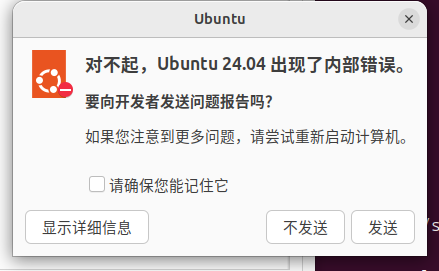

# 3.2 Linux User Migration Guide

Linux and FreeBSD are both UNIX-like operating systems, but they differ fundamentally in kernel architecture, package management philosophy, and system design principles. Deeply understanding BSD's construction approach and original intent is no easy task, and the resulting disappointment is inevitable.

## The Lost World

Many core concepts and technical practices in the Linux world were first proposed and practiced by BSD systems, including:

- The prototype of container technology can be traced back to the FreeBSD Jail mechanism;
- The distribution concept framework;
- The Ports package management methodology adopted by Gentoo can be traced back to the BSD Ports framework in its technical origins;
- BSD was one of the earliest practitioners of the open source concept, and the BSD license is also one of the earliest free software licenses in history (earlier than the 1989 GPL, but later than the 1985 GNU Emacs license).

> **Discussion Question**
>
>> "All true history is contemporary history."
>>
>> How do readers understand this statement? How do you define "true" and "non-true"?

### References

- FreeBSD Foundation. FreeBSD: The Torchbearer of the Original Operating System Distribution[EB/OL]. [2026-04-04]. <https://freebsdfoundation.org/blog/freebsd-the-torchbearer-of-the-original-operating-system-distribution/>. BSD first proposed and practiced the "distribution" concept framework.
- Linux Foundation. A Brief Look at the Roots of Linux Containers[EB/OL]. [2026-04-18]. <https://www.linuxfoundation.org/blog/blog/a-brief-look-at-the-roots-of-linux-containers>. The article states: "In 2000, FreeBSD extended chroot to FreeBSD Jails"; the prototype of container technology can be traced back to FreeBSD Jail.
- Amadio G, Xu B. Portage: Bringing Hackers' Wisdom to Science[EB/OL]. arXiv preprint arXiv:1610.02742, 2016. [2026-04-18]. <https://arxiv.org/abs/1610.02742>. The paper states: "Portage, written in Python and inspired by the ports system from FreeBSD" and "Portage is a GPLv2 package management system based on FreeBSD's ports collection"; Gentoo Portage's technical origins can be traced back to BSD Ports.
- FreeBSD Project. Why you should use a BSD style license for your Open Source Project[EB/OL]. [2026-04-18]. <https://www.freebsd.org/doc/en/articles/bsdl-gpl/>. This article documents that the BSD license has practiced open source principles through free source code distribution since the late 1970s, earlier than the 1985 GNU Emacs license and the 1989 GPL.
- Red Hat. What are Linux containers?[EB/OL]. [2026-04-04]. <https://www.redhat.com/zh/topics/containers/whats-a-linux-container>. Introduction to the basic concepts and technical principles of Linux containers.
- Open Source Initiative. The Open Source Definition[EB/OL]. [2026-04-17]. <https://opensource.org/osd>. Although the term "Open Source" was not formally coined by Christine Peterson until 1998, the BSD license had been practicing this concept through free source code distribution since the 1980s.
- Croce B. *Theory and History of Historiography*[M]. Translated by Tian Shigang. Beijing: China Social Sciences Press, 2018. Proposes the core thesis that all true history is contemporary history, exploring the contemporaneity of historical understanding.

## Understanding FreeBSD's Operating System Nature: Not a Distribution

FreeBSD is a complete operating system comprising two independent major parts: the base system (userland + kernel) and the Ports framework.

### The Self-Sustaining Base System

freebsd-src = base system repository = userland + kernel.

FreeBSD version branches are divided into three main series:

| Branch | Type | Example Branch |
| ------ | ---- | -------------- |
| CURRENT | Development version | main |
| STABLE | Fixed branch | stable/15 |
| RELEASE | Official release | releng/15.0 |

New features are first committed to CURRENT (main branch), then MFC'd to the STABLE branch after testing, and finally enter the point release RELEASE. The stable/ branch is cut from the main branch, and the releng/ branch for major versions (dot-zero versions) is then cut from the stable/ branch; point releases are published from the stable/ branch.

PkgBase is built directly from freebsd-src:

```sh
# cd /usr/src # Requires pre-fetching freebsd-src to this path
# make -j8 buildworld # World is the userland
# make -j8 buildkernel # Kernel
# make -j8 packages # Build PkgBase binary packages
```

### The Ports Framework and pkg Package Manager for Installing Third-Party Software

freebsd-ports = third-party software collection (each individual is called a Port) = Ports framework repository.

A Port is a collection of files consisting of source code package checksums, description files, patches, etc., with Makefile as the core. Arch's PKGBUILD or Gentoo's ebuild are similar; in fact, they were inspired by the Ports framework.

pkg packages are built directly from freebsd-ports through the poudriere build system.

The main branch of freebsd-ports is the latest source, and branches in the form of 2026Q1 (the most recent quarter) are the quarterly branches. Quarterly branches are cut directly from main on a quarterly basis.

By default, the base system does not include any Port software, not even the pkg package manager itself (in the traditional installation mode). Most hardware firmware has also been moved from the base system to Ports.

### The init System

FreeBSD uses BSD init rather than systemd; BSD init also differs from traditional SysVinit — BSD has no runlevels and no **/etc/inittab**; everything is controlled by the rc system.

Running init as a user process can emulate the behavior of AT&T System V UNIX: the superuser can specify the desired runlevel on the command line, and the init process sends specific signals to the original init process (with PID 1) to perform corresponding operations.

### Shell

The default shell for all FreeBSD users is sh (prior to version 14, root defaulted to csh), not Bash (it can be switched if needed).

### De-GNUification of the Base System

The FreeBSD base system contains virtually no software that is incompatible with the BSD license.

### References

- MYSQLZOUQI. Analysis of Linux Initialization init Systems, Part 1: sysvinit, Part 2: UpStart, Part 3: Systemd[EB/OL]. [2026-03-25]. <https://www.cnblogs.com/MYSQLZOUQI/p/5250336.html>. Archived; original no longer available; systematically introduces various initialization systems.
- FreeBSD Project. init -- process control initialization[EB/OL]. [2026-03-25]. <https://man.freebsd.org/cgi/man.cgi?query=init&sektion=8>. FreeBSD init manual page. BSD init has no SysV-style runlevels or **/etc/inittab**, and the runlevel-signal correspondence when running init as a user process.
- FreeBSD Project. ttys -- terminal initialization information[EB/OL]. [2026-04-17]. <https://man.freebsd.org/cgi/man.cgi?query=ttys&sektion=5>. Terminal initialization configuration file manual page.
- Gentoo. Comparison of init systems[EB/OL]. [2026-03-25]. <https://wiki.gentoo.org/wiki/Comparison_of_init_systems>. Comparison chart of major init systems, providing reference for system selection.
- FreeBSD Project. GPL Software in FreeBSD Base[EB/OL]. [2026-03-25]. <https://wiki.freebsd.org/GPLinBase>. GPL software in the FreeBSD base system; systematically reviews the license compatibility of the base system.
- FreeBSD Project. FreeBSD 14.0-RELEASE Release Notes[EB/OL]. [2026-04-18]. <https://www.freebsd.org/releases/14.0R/relnotes/>. "The default shell for the root user is now sh(1)"; starting from FreeBSD 14, the default root shell changed from csh/tcsh to sh.
- FreeBSD Project. Ports Quarterly Branch[EB/OL]. [2026-04-18]. <https://wiki.freebsd.org/Ports/QuarterlyBranch>. "quarterly is the familiar name for ports branched from main"; the main branch is the latest source, and quarterly branches are named YYYYQn.
- FreeBSD Core Team. Change to FreeBSD release scheduling and support period[EB/OL]. (2024-07-16)[2026-04-18]. <https://lists.freebsd.org/archives/freebsd-announce/2024-July/000143.html>. "the FreeBSD core team has approved reducing the stable branch support duration from 5 years to 4 years starting with FreeBSD 15".
- FreeBSD Wiki. Desktop[EB/OL]. [2026-04-18]. <https://wiki.freebsd.org/Desktop>. "NetworkManager itself cannot be ported due to a monolithic architecture and extensive Linux syscall use"; the real reason NetworkManager cannot be ported.

## Basic Comparison

| Operating System | Release/Lifecycle (Major Version) | Primary Package Manager (Command) | License (Primary) | Toolchain | Shell | Desktop |
| ---------------- | --------------------------------- | --------------------------------- | ----------------- | --------- | ----- | ------- |
| Ubuntu | [2 years/5 years (LTS standard support), 10 years (requires Ubuntu Pro)](https://ubuntu.com/about/release-cycle) | [apt](https://ubuntu.com/server/docs/package-management) | [GNU](https://ubuntu.com/legal/intellectual-property-policy) | gcc | Bash | GNOME |
| Gentoo Linux | Rolling release | [Portage (emerge)](https://wiki.gentoo.org/wiki/Portage) | GNU | gcc | Bash | Optional |
| Arch Linux | Rolling release | [pacman](https://wiki.archlinux.org/title/pacman) | GNU | gcc | Bash | Optional |
| RHEL | [10 years standard/approx. 13 years (requires ELS add-on subscription)](https://access.redhat.com/zh_CN/support/policy/updates/errata) | [RPM (yum, dnf)](https://www.redhat.com/sysadmin/how-manage-packages) | GNU | gcc | Bash | GNOME |
| FreeBSD | [Approx. 2/4 years](https://www.freebsd.org/security/) (FreeBSD 14 and earlier: 5 years; from FreeBSD 15: reduced to 4 years) | pkg/Ports | BSD | clang | sh | Optional |

Linux extensively uses GNU tools, so theoretically, anything that does not depend on specific Linux libraries can run on FreeBSD.

| Linux Command/GNU Software | BSD Port/Command | Description | Notes |
| -------------------------- | ---------------- | ----------- | ----- |
| `lsusb` | `sysutils/usbutils` | Display USB information | Can also roughly use `cat /var/run/dmesg.boot` |
| `lspci` | `sysutils/pciutils` | Display PCI information | Can also roughly use `cat /var/run/dmesg.boot` |
| `lsblk` | `sysutils/lsblk` | Display disk usage | / |
| `free` | `sysutils/freecolor` | Display memory usage | The `free` command depends on Linux-specific features (typically provided by the `procps` package), so FreeBSD does not provide it. If `free` is truly needed, <https://github.com/j-keck/free> can be used; other alternatives include `vmstat` |
| `lscpu` | `sysutils/lscpu` | Display processor information | / |
| glibc | FreeBSD libc | C library | / |
| GCC | LLVM + Clang | Compiler, toolchain | If specifically needed, `devel/gcc` can also be installed |
| `vim` | `editors/vim` | Text editor | FreeBSD's `vi` is not a symlink to `vim`, but the earlier `nvi` |
| `wget` | `ftp/wget` | Downloader | The system's default download tool is `fetch` |
| bash | `shells/bash` | Shell | The system's default shell is `sh` (not a symlink). Can be changed manually. |
| NetworkManager | `net-mgmt/networkmgr` | Network connection tool | NetworkManager cannot be directly ported to FreeBSD due to its monolithic architecture and extensive dependence on Linux system calls |
| `lsmod` | `kldstat` | List loaded kernel modules | / |
| `strace` | `truss` | Trace system calls | / |
| `modprobe` | Load: `kldload`; Unload: `kldunload` | Load/unload kernel modules | / |

### References

- FreeBSD Foundation. Navigating FreeBSD's New Quarterly and Biennial Release Schedule[EB/OL]. [2026-04-16]. <https://freebsdfoundation.org/blog/navigating-freebsds-new-quarterly-and-biennial-release-schedule/>. This blog post explains the changes to the FreeBSD release cycle.

## FHS and FreeBSD Directory Structure

The Filesystem Hierarchy Standard (FHS) was originally maintained by the Linux Foundation's Linux Standard Base (LSB) working group, and has been hosted and managed by FreeDesktop.org since 2025. It defines specifications for directory structure and directory contents in UNIX-like operating systems, with the current version being FHS 3.0 (initially released in 2015, latest revision released on April 8, 2026).

FreeBSD's directory hierarchy is defined by hier(7). Compared to FHS, FreeBSD's directory structure has the following differences:

| Item | FHS | FreeBSD |
| ---- | --- | ------- |
| **/usr/local** | For administrator local software installation, initially empty | Default path for pkg/Ports to install third-party software |
| Configuration files | Third-party **/etc/opt**, subdirectories recommended | Third-party **/usr/local/etc**, system **/etc** |
| **/bin**, **/sbin**, **/lib** | Independent directories, separate from **/usr** | Independent directories, separate from **/usr** |
| **/libexec** | Optional, alternative to **/usr/lib**, stores internal binaries | Present under both **/** and **/usr**, system auxiliary programs |
| **/rescue** | Not defined | Statically linked emergency repair tools |
| **/srv** | Data for services provided by the system (ftp, www, etc.) | Not defined |
| **/media** | Removable media mount point | Managed by automount(8) or bsdisks(8) |
| **/opt** | Required, **/opt/package** | Not defined; uses **/usr/local** uniformly |
| **/mnt** | Temporary mount point | Temporary mount point |
| **/run** | Required (3.0), PID files and UNIX domain sockets | None; continues to use **/var/run** |
| **/sys** | Linux sysfs (§6.1.7) | None; uses sysctl(8) |
| **/proc** | Linux procfs (§6.1.5) | procfs(4) not used by default, retained only for compatibility |
| Shared libraries | **/lib** critical libraries, **/usr/lib** non-critical and programming libraries, **/lib** compatible | **/lib** critical libraries, **/usr/lib** shared/ar libraries, **/usr/lib32** |
| Kernel | **/** or **/boot** | **/boot/kernel/**, backup **/boot/kernel.old/** |
| **/home** | Optional, user home directories | User home directories |
| **/var/empty** | Not defined | Used by sshd(8) privilege separation chroot |
| **/nonexistent** | Not defined | Placeholder for accounts without home directories |

FHS classifies files along two dimensions: shareable/non-shareable and static/variable. **/usr** is shareable and read-only, **/var** is variable, and the root file system only needs to meet the minimum requirements for booting, recovery, and repair. FreeBSD follows this principle: the base system is confined to directories defined by hier(7), and third-party software is confined to **/usr/local**.

POSIX (IEEE 1003.1)/SUS (UNIX 03) has no similar requirements for directory structure. POSIX.1-2008 explicitly removed descriptions of **/bin**, **/usr/bin**, **/lib**, **/usr/lib** — on the grounds that they are not useful for applications. POSIX only requires **/**, **/dev** (containing **/dev/null**, **/dev/tty**, **/dev/console**), and **/tmp** to exist; temporary files are recommended to be located via the `TMPDIR` environment variable. FHS only notes consistency with POSIX in individual entries; the remaining directory specifications are all FHS's own definitions and fall outside the POSIX scope.

### References

- Linux Foundation. Filesystem Hierarchy Standard 3.0[EB/OL]. (2015-06-03)[2026-04-23]. <https://refspecs.linuxfoundation.org/fhs.shtml>. Filesystem Hierarchy Standard; the file hierarchy standard contains a set of requirements and guidelines for the placement of files and directories in UNIX-like operating systems. These guidelines aim to support interoperability among applications, system administration tools, development tools, and scripts, and to enhance the consistency of documentation for such systems.

## Appendix: GNU/Linux Distribution Comparison

The large-scale GNU open source movement and the vigorous development of Linux have confined most people's understanding of open source to the GPL license and Linux systems, with relatively little exposure to the BSD world such as FreeBSD. Some community organizations operating under the banner of open source also primarily conduct their activities within the Linux domain, rarely exploring beyond this scope.

This is not to say that these users or groups are doing anything wrong. There is nothing to criticize — "When the times are favorable, heaven and earth lend their strength; when the times are against you, even heroes are not free." Li Bai could never become a statesman of the High Tang. He studied swordsmanship from a young age, was fond of immortality cultivation, and in his youth aspired to be a knight-errant who "kills one person every ten steps and leaves no trace for a thousand miles"; later he wanted to become a court minister who would restore the state. But Tai Bai ultimately "found his sword no match for ten thousand, while his writings stole the fame of the four seas." The fate of operating systems is closely linked to the pulse of the times, and market demands constantly shape the functions and interaction patterns we take for granted today.

> **Discussion Question**
>
>> Knowing in my heart I cannot speak, yet wishing to dwell in Penglai.
>>
>> Bending my bow, I fear the Heavenly Wolf; clutching my arrow, I dare not draw.
>>
>> Wiping tears at the Golden Terrace, I cry to heaven for King Zhao.
>>
>> No one values the bones of swift steeds; the fine horse Luer gallops in vain.
>>
>> If Yue Yi were reborn, he too would flee today.
>>
>> How do readers understand the similarities between Li Bai's experiences and those of the FreeBSD project and its community and personnel. Has there ever been a moment when readers felt the powerlessness of the individual before the tide of the times.

This appendix provides a comparative analysis of mainstream GNU/Linux distributions to help readers gain a more comprehensive understanding of each distribution.

### Why It Is Called a GNU/Linux Distribution

GNU itself has no independent kernel, but uses Linux as its kernel — GNU Hurd is the exception, still under development.

Different operating systems/distributions, different worldviews. Providing a precise and unified definition of "distribution" is no easy task.

> **Discussion Question**
>
> How do you understand the statement "Different operating systems/distributions, different worldviews"?

Some have pointed out that "the seemingly complex array of Linux distributions is merely an illusion. They may not even possess autonomous decision-making power. For example, if the upstream adopts the systemd initialization system, distributions typically follow suit. Otherwise, they may be unable to continue using some third-party software, and the consequence is their own elimination. Linux distributions have never truly existed."

> **Discussion Question**
>
> "Linux distributions have never truly existed." This statement certainly has its limitations, but it offers an important insight — how should it be understood?

Where does the maintenance focus of common Linux distributions and some China-based Linux operating systems lie? They are typically not the original maintainers of upstream projects such as file systems, the Linux kernel, the GNU C Library (glibc), systemd, or desktop environments. For a large number of third-party software packages, their work is primarily integration and adaptation. Even the package managers and software repositories are mostly based on upstream tools and community resource configurations and management.

Red Hat Enterprise Linux (RHEL) has invested significant resources in long-term support and stability. This is an important characteristic that distinguishes it from many other distributions. RHEL guarantees the long-term stability of the Application Binary Interface (ABI) and Kernel Application Binary Interface (kABI), providing support periods of up to ten years, which differs significantly from the support strategies of many other distributions. Relevant references are as follows:

- Red Hat. Red Hat Enterprise Linux 10: Application Compatibility Guide[EB/OL]. [2026-03-25]. <https://access.redhat.com/articles/rhel10-abi-compatibility>.
- Red Hat. What is Kernel Application Binary Interface (kABI)?[EB/OL]. [2026-03-25]. <https://access.redhat.com/solutions/444773>.

Many distributions do not directly maintain or comprehensively test the above software and tools, nor do they necessarily continuously write patches or documentation. Distributions that directly backport modifications and contribute them upstream are relatively few; Ubuntu is a typical example. At the same time, even if distribution maintainers wish to contribute code upstream, they may face the challenge of patches being difficult to get accepted by upstream projects, as they have no direct decision-making authority over them.

Many commercial distributions (such as RHEL) do contribute significant code to upstream projects (such as the Linux kernel) — this is an objective fact. However, this has not fully resolved the widespread problem of insufficient maintenance resources for foundational tools. Meanwhile, analysis based on commit volume shows that commercial companies account for a large proportion of code contributions, with Red Hat being one of the important contributors. This reflects a structural shift in project contribution and governance between communities and commercial organizations, and also reveals the substantive transfer of open source community dominance over open source projects. This phenomenon is often discussed using the Xorg project as a case study; currently, its maintenance and development direction are primarily led by a few core maintainers and related organizations, with the project's overall focus gradually shifting toward new display technology paths such as Wayland. The impact of commercial distributions on the Linux ecosystem is not always positive; there may be tension between their commercial objectives and the development direction of some open source projects — in this context, the institutional design of the GPL produces a self-undermining effect.

> **Discussion Question**
>
>> Serious commercial distributions strive for stability above all else, requiring centralized unified management; yet most Linux foundational tools emphasize agile development strategies, where stability is often not the highest priority, and control over these tools is extremely decentralized.
>>
>> Are commercial distributions' contributions to open source projects, fundamentally, for developing the projects, or for completely eliminating them? Why?

Users appear to have multiple distributions to choose from, but under compatibility, dependency, and ecosystem constraints, the actual range of choices is far more limited than it appears. In some scenarios, there is no choice at all. The choices users make appear autonomous, but the available options are often predetermined by others. Most readers have the capability — and may already be — maintaining their own distribution; but what exactly are they maintaining? From a technical standpoint, there are virtually no independently maintainable components. This is the reality determined by the current ecosystem structure.

> **Discussion Question**
>
>> Free will and God's predestination do not conflict. This is not about faith; it is a logical question.
>>
>> Please discuss the relationship between individual choice and the constraints of social productive forces.
>>
>> Analysis: Why can seemingly free choices also be "predetermined"?

### Ubuntu

Some users have reported that the Ubuntu system displays an "[internal error](https://www.google.com/search?q=internal+error+ubuntu+site:askubuntu.com)" prompt. Some believe this is Ubuntu's unified way of presenting error messages. It should be noted that Ubuntu periodically introduces packages from Debian SID (the unstable branch) during development, which may cause stability fluctuations at specific stages (whether regular or LTS versions). For example, during cross-major or cross-minor version upgrades, some users have reported risks of upgrade failure — even with a clean initial environment, this can still happen.

The following commands can be used to query the association between Ubuntu 24.04 and Debian versions:

```bash
ykla@ykla-ubuntu:~$ cat /etc/debian_version	# View the current Debian system version number
trixie/sid # trixie is Debian 13, released on August 9, 2025, as the current stable version. Debian 12 bookworm is the oldstable.
ykla@ykla-ubuntu:~$ cat /etc/lsb-release	# View detailed information about the current Linux distribution
DISTRIB_ID=Ubuntu
DISTRIB_RELEASE=24.04
DISTRIB_CODENAME=noble
DISTRIB_DESCRIPTION="Ubuntu 24.04 LTS"
```

Testing Ubuntu 24.04 LTS (released on April 25, 2024, London local time) on a VMware Workstation 17 Pro virtual machine revealed that the overall user experience has declined compared to previous versions. Error prompts appeared during installation, and subsequent use encountered issues such as window display anomalies, mouse cursor disappearance, and input boxes failing to gain focus. After installation was complete, the system frequently displayed "internal error" prompts upon boot.




### Fedora Linux

Fedora has an informal nickname "地沟油" (gutter oil) in some communities.

Fedora is the upstream distribution of Red Hat Enterprise Linux (RHEL), positioned primarily for technology validation and cutting-edge feature testing. Its fundamental purpose is to serve as a testing platform for new designs and architectures in the RHEL system (this community is entirely led by Red Hat). Once features stabilize, they are incorporated into RHEL.

Therefore, stability is not the primary design goal of this distribution. Fedora has a relatively high failure rate for direct cross-major version upgrades. This means that after long-term use, users may need to perform a fresh installation and reconfigure their environment. It is difficult for users to obtain long-term stability support on this distribution. Unlike Debian-based distributions, software repositories across different major Fedora versions are generally not interchangeable due to frequent changes in software dependencies. Each version is positioned more like a continuously iterating development branch. All versions contain numerous new features, and their stability performance is relatively close to that of continuously integrated [nightly](https://openqa.fedoraproject.org/nightlies.html) builds, with little difference. Its stability characteristics are similar to those of rolling-release distributions. In some testing scenarios, its stability may be inferior to Ubuntu. For example, when performing long-duration, high-load compilation tasks with screen saver and lock screen sleep disabled, the Fedora system may become unresponsive after several hours, while Ubuntu runs normally under the same conditions.

Some open source software projects adopt a development path of "community testing, with mature results entering commercial or enterprise products," such as Wine and CrossOver.

> **Discussion Question**
>
> How do you view this development model where the open source community always tests and provides feedback, stable results are introduced into commercial products, and a new round of projects or components awaiting testing is then introduced? Is this a form of formalistic open source — where the open source community contributes substantive labor, but the results are appropriated by capital, and community users always receive defective products with no compensation or recognition? Commercial companies use this model to shift costs that should be borne by themselves, such as testing and customer service, onto the open source community.

In recent years, Fedora's system resource requirements have increased. In a VMware virtual machine environment, allocating only 4 GB of memory may not be sufficient for a smooth installation; 6 GB to 8 GB of memory is needed to avoid the installation process stalling.

### CentOS/Rocky Linux/RHEL

CentOS has transitioned from its original role as a stable distribution rebuilt from RHEL source code to an upstream development and testing branch for RHEL (i.e., CentOS Stream), with a positioning similar to Fedora. There are many alternatives, including Huawei's commercial distribution EulerOS (whose open source community edition is openEuler); EulerOS once passed The Open Group's UNIX 03 specification certification. Rocky Linux is also one such alternative.

These systems are widely deployed in the server domain, characterized by sacrificing software version novelty in exchange for stability, so the software versions they include are typically quite old. Similarly, they generally do not support direct cross-major version upgrades and are relatively conservative in their security update policies.

### Debian


Debian's name and logo are occasionally subject to informal pun-based teasing in Chinese contexts as "大便" (homophonic with "/ˈde.bi.ən/").

If a root password is set during Debian installation, the system may not install the sudo tool by default. This design is typically motivated by security considerations. However, this may create tension with the convention of GNOME and other desktop environments and most display managers that prohibit direct root account login.

At the same time, in some versions (such as Debian 12.6), although sudo is installed, the first regular user created is not added to the `sudo` group by default. This causes inconvenience in practice — for example, that regular user cannot directly restart network services via the sudo command. The user needs to switch to a TTY console and log in as root to perform operations, which to some extent reduces the convenience of using the default GUI installation environment.

> ```sh
> ykla@debian:~$ sudo su # Switch to root user
> [sudo] password for ykla:
> ykla is not in the sudoers file.
> ykla@debian:~$ id # Display current user's UID, GID, and group membership
> uid=1000(ykla) gid=1000(ykla) groups=1000(ykla),24(cdrom),25(floppy),29(audio),30(dip),44(video),46(plugdev),100(users),106(netdev),111(bluetooth),113(lpadmin),116(scanner)
> ykla@debian:~$ hostnamectl # Display or set system hostname and related information
> Static hostname: debian
>       Icon name: computer-vm
>         Chassis: vm
>      Machine ID: 9b3107b788dd461f94ca93150474946e
>         Boot ID: 081c39d5ac4748fa9ec0b2157c9a5beb
>  Virtualization: vmware
> Operating System: Debian GNU/Linux 12(bookworm)
>          Kernel: Linux 6.1.0-22-amd64
>    Architecture: x86-64
> Hardware Vendor: VMware, Inc.
>  Hardware Model: VMware Virtual Platform
>  Firmware Version: 6.00
> ```

The above issues are quite prominent during actual installation and use. For example, the installer may not synchronize the `debian-security` repository when configuring software sources, yet defaults to attempting online system updates (this issue also exists in Ubuntu; it can be bypassed in Debian's advanced installation), sometimes causing installation failure.

Additionally, its network management tool [NetworkManager](https://wiki.debian.org/NetworkManager) may conflict with some systemd functionality integration. Similar designs easily cause user confusion in practice.

The process for ordinary users to submit bug reports to the Debian community and receive timely feedback is relatively complex. Debian's [Bug reporting process](https://www.debian.org/Bugs/Reporting) has a higher barrier for ordinary users compared to some more user-friendly open source projects.

Debian Stable's package policy prioritizes stability; most software, once released, typically does not have its major version number upgraded during its lifecycle. Software versions are locked, so Stable should be understood as both "stable" and "fixed." If newer software versions are needed, one must switch to the Testing or Unstable (Sid) branch, but this sacrifices overall system stability.

Debian Stable is characterized by system stability, and its package versions are correspondingly older. In terms of pursuing stability and having outdated software packages, it shares similarities with RHEL.

### openSUSE

After installing a complete openSUSE on a physical machine, some users have reported system stuttering. The performance issues may be related to certain characteristics or configurations of the Btrfs file system used by default. Testing on multiple Intel platform physical machines of different generations all observed stuttering. System response slowdown may occur shortly after installation. Therefore, different users may have divergent evaluations of the user experience. Some users have worked around this issue by switching the root file system from Btrfs to ext4. Searching for "openSUSE btrfs hang" online reveals similar feedback, suggesting this may not be an isolated phenomenon.

openSUSE is nicknamed "大蜥蜴" (big lizard) in the community due to its logo.

Its version numbering once had an interesting episode: to commemorate the number "42" mentioned by British author Douglas Adams in *The Hitchhiker's Guide to the Galaxy* (hailed as "the ultimate answer to life, the universe, and everything"), openSUSE jumped its version number from 13.x to 42.x, then dropped back to 15.x. This created a logical problem with version numbers: since 42 is greater than 15, upgrading from 42.x to 15.x could cause the package manager to misidentify it as a downgrade and refuse the operation. This phenomenon of version numbers jumping and then falling is rare among distributions.

openSUSE sometimes introduces experimental features in stable release packages without clear notification. This may lead users to report them as software bugs. Users may need to submit issue reports before learning from maintainers that the behavior is due to an experimental feature.

> **Discussion Question**
>
> Would such version anomalies and unapproved testing behavior be allowed in a serious commercial distribution? Please reflect on this.
>
> Can this be used to argue that community distributions are merely testing grounds for enterprise distributions?

openSUSE's native package manager is `zypper`. Some users have compared it with Fedora's `dnf`, suggesting that `zypper` needs optimization in interactive response speed or performance in certain scenarios ~~for example, count how many letters are in the name?~~; `zypper` exhibits noticeable stuttering and latency compared to `dnf`. And these two package managers compete with each other in some situations, see: Bug 1213158 - Packages install failed with ndb backend[EB/OL]. [2026-03-26]. <https://bugzilla.opensuse.org/show_bug.cgi?id=1213158>.

### Gentoo Linux

Gentoo calls itself a "*Metadistribution*." Its traditional installation method is to **compile** all software from source code. Although official binary package support has been provided in recent years, there is still some complexity in dependency management, and the binary packages have extremely limited generality.

The disadvantage of Gentoo's package management system is that if a software package fails to compile, it cannot be installed, and compilation failures occur from time to time. If the system is not updated for a long time, updating again may encounter complex **circular dependency** issues. At the same time, Gentoo is difficult to deploy at scale in a standardized manner and is relatively rarely used in server environments.

Gentoo's Portage package manager is primarily written in [Python](https://github.com/gentoo/portage). Calculating dependencies for large-scale software sets (such as the KDE desktop environment) may take a considerable amount of time. On processors with limited performance, this calculation process may take from several minutes to several hours, with significant performance overhead. Due to potential issues such as circular dependencies, the dependency resolution process often requires multiple iterations, sometimes even failing to resolve automatically, resulting in installation failures. As the number of software packages installed on the system increases, the time spent on package management operations (such as dependency calculation) grows geometrically.

Gentoo's package manager has a unique design philosophy, but its learning curve is steep, and the barrier to entry is high for ordinary users. ~~Gentoo's package manager is fun but not practical — it's probably the most interesting package manager.~~

Overall, Gentoo's highly flexible USE flag system and source code compilation mechanism, while giving users great control, also bring high complexity. Dependency issues (including circular dependencies) can affect system stability and make software installation, upgrading, and uninstallation difficult.

Gentoo's highly customizable philosophy requires users to invest more effort in system management and maintenance.

If Arch Linux may encounter problems during rolling updates, then Gentoo may have the update process itself become difficult due to dependency conflicts and other issues. If the system has not been updated for a long time, attempting to update again may result in being unable to proceed with any package management operations due to dependency hell. The complex USE flag system means that even experienced Gentoo users must deal with the complexity brought by this philosophical system day after day. Solving dependency problems is a common technical discussion topic in the Gentoo community.

Gentoo's philosophy shares similarities with C++ philosophy:

> "C++ is a language, not a complete system. It provides comprehensive support for every style that should be supported, **without trying to force anyone to do anything.**"

> "If a tool **forces users** to operate in a specific way, then the tool is actually working against the user rather than serving them. **We've all experienced tools imposing their own will.** This is wrong and goes against Gentoo's philosophy."

Just as no one in the world dares to claim mastery of C++, the same is true for Gentoo. Freedom of choice is certainly a nature that humans aspire to, but it also brings endless anxiety and depression.

> **Discussion Question**
>
> Is forced freedom a viable means of achieving freedom, or is it a form of formalism and fascism?
>
> On this foundation, please re-examine the GPL license and the BSD license.

Gentoo's bug tracking and feedback process may not be user-friendly for ordinary users. In some cases, related issues may be marked as no longer applicable after a long period when the software is removed. The search and usage experience of its bug reporting platform needs improvement. Sometimes using an external search engine (such as Google) with the "site:bugs.gentoo.org" syntax may be more effective than using the platform's built-in search. The [Advanced Search](https://bugs.gentoo.org/query.cgi) feature is also relatively complex to use.

### Deepin/UOS/NeoKylin

The relationship between UOS and Deepin is similar to that between Red Hat Enterprise Linux (RHEL) and Fedora, where the former is commercially refined and deeply customized based on the latter's community version.

The Deepin system has received considerable criticism from users due to insufficient testing of some update packages. There are reports that some problematic updates were not promptly withdrawn after being pushed, with the official response being limited to publishing repair tutorials. This handling approach has affected the user experience. For example, some users reported encountering system crashes immediately after upgrading on a freshly installed system.

In earlier versions, the Deepin system experienced interface stuttering or unresponsiveness during basic desktop operations such as copying files.

Similar situations of insufficient update testing have also been reported by users in the UOS system. Such occurrences are not isolated; users have encountered UOS update server outages or configuration errors causing client anomalies (such as browsers endlessly opening dozens or even hundreds of UOS homepages), while official status announcements were sometimes not timely.

UOS servers have limited capacity, so UOS has restricted mirror download methods, making it impossible for ordinary users to download using Thunder. User testing has reported that the download server bandwidth is limited, and users on certain network carriers (such as China Mobile) may have difficulty connecting.

The problem is that many UOS system functions (such as developer mode activation) require online account login and server interaction; if the server connection is unstable, it directly affects the use of these functions. From a technical perspective, adopting more efficient mirror distribution methods (such as BitTorrent) could potentially improve the download experience. The official has also occasionally provided Baidu Netdisk for users. ~~So it's a choice between 100 K/s or 101 K/s...~~

> **Discussion Question**
>
>> "From a technical perspective, adopting more efficient mirror distribution methods (such as BitTorrent) could potentially improve the download experience." Clearly there are more efficient distribution methods (before the PCDN poisoning incident), so why is it difficult to push for technical realization?
>>
>> How do you understand whether individuals in modern enterprises have a nihilistic sense of responsibility and professional ethics toward the enterprise?
>>
>> Ultimately, the two are merely employment relationships. Are professional ethics and the halo of honor a social construct or an indispensable spiritual pillar of human civilization? If everything is flattened, it would actually go against common sense.
>>
>> How do you understand this?

This issue can also be observed from the default configuration strategy: early versions of UOS allocated only about 20 GB of space for the system partition in the default installation scheme, which could easily be exhausted during daily use. Users typically need to research how to customize partitions, often needing to reinstall the system shortly after acquiring the device. The remaining 50% of unallocated space was designed for system backup and restore functionality, with a mechanism closer to complete system image recovery. If users adopt a custom partition scheme, they may lose the factory-provided system restore function. This is a dilemma. Later versions have supported adjusting the system partition size, but the default installation scheme remained unchanged for a long time.

The NeoKylin system has been criticized by users for not promptly fixing common basic issues such as garbled text when decompressing ZIP archives.

For intranet machines requiring offline deployment, timely installation of security patches may be difficult. Since Linux system updates (especially those involving low-level libraries) often have complex dependency relationships, installing a single security patch in a fixed-version intranet environment may encounter unsatisfied dependency issues. This is a widespread challenge in offline environment software maintenance and is difficult to completely avoid under existing dependency management models. The presentation format of its security vulnerability announcement pages went through multiple iterations before becoming standardized.

> **Discussion Question**
>
> What is a Linux operating system root community?
>
> - Built from the Linux kernel and other open source components, not dependent on upstream distribution communities
>
> - Adopts open source community operating models, with a large number of external individual contributors and enterprise participants
>
> - Widely recognized, spawning different branches or downstream communities
>
> - Has smooth communication with various open source component communities and continuously feeds back its own capabilities
>
> ——white777. Deepin Community's New Plan: Building a China-Led Desktop System Root Community![EB/OL]. (2022-05-19)[2026-04-04]. <https://bbs.deepin.org/post/237175>.
>
>> ① If an operating system looks like Debian, runs software that all comes from Debian, and has the exact same kernel, then on what basis can it be called Ubuntu?
>>
>> ② Where exactly is the "root" of the root community? What "root" are they actually maintaining? Does their "root" comply with the GPL?

### Arch Linux/Manjaro

Arch Linux has some informal nicknames in the Chinese community: "**Cult**" and "**Shampoo**." It is a Linux distribution known for its rolling release model, attracting many users with its high customizability and software novelty.

However, the rolling release model also means the system may face higher instability risks. As the number of software packages installed on the system increases, the probability of problems due to dependency conflicts or version incompatibilities may also rise. Some argue that most issues can be avoided by carefully reading official update announcements. But this requires users to have a high level of proactive maintenance awareness and troubleshooting ability.

Arch Linux's main advantage lies in its very new software package versions. But not all software is this way; some domain-specific tool packages (such as certain R language packages) may not be updated as promptly as on other distributions (such as FreeBSD). Arch Linux has a high profile in technical communities.

The number of packages in Arch Linux's Official Repository is limited; users typically need to enable the Arch User Repository (AUR) to access a richer selection of software. However, the AUR source undergoes no code review whatsoever. In reality, there is a lack of systematic centralized review: malicious or high-risk scripts are frequently submitted to it. Although the build process is executed in a restricted environment, there is no guarantee that the generated packages themselves are secure. This is similar to how any software source without rigorous review (including some official app stores) may contain malicious software.

This is not fear-mongering; malicious packages have indeed existed in the AUR.

As FreeBSD developer Warner Losh said, "In today's increasingly challenging environment for open source projects, some seemingly redundant steps are often necessary."

### NixOS

First, readers need not feel confused by the series of terms NixOS introduces; some of these concepts are easily misunderstood in practice.

Its core concept is not simply "OS as Code"; its package management and configuration approach shares similarities with Node.js dependency management in some respects. ~~It is not "OS as Code," but rather "OS as Node.js."~~

For users familiar with declarative configuration and functional package management concepts (especially those with Node.js ecosystem experience), using this system is simpler than most Linux distributions, and not necessarily as arcane as some promotional materials suggest.

Essentially, NixOS applies the declarative and functional dependency management paradigm to the entire operating system level. ~~NixOS is basically Node.js made into an operating system.~~

NixOS emphasizes reproducible system builds. Its configuration files (such as **/etc/nixos/configuration.nix**), dependency locking (such as the `flake.lock` file), and other mechanisms are conceptually similar to Node.js's `package.json` and `package-lock.json`: in some cases, error messages do not intuitively reflect the actual problem, such as reporting a dependency missing as a syntax error.

- **Declarative Configuration**: All system configuration is centralized in a declarative file (such as **/etc/nixos/configuration.nix**), similar to `package.json` in a Node.js project.
- **Flakes**: This is an experimental feature that provides more reproducible dependency management and project structure; its lock file (`flake.lock`) functions similarly to `package-lock.json`.
- **Reproducibility**: Based on declared configuration and locked dependencies, the entire system environment can be precisely reproduced.
- **No Dependency Conflicts**: Conflicts are avoided by creating independent storage paths for each dependency. However, this may result in large storage usage, and old version packages require manual cleanup. ~~There is considerable redundant storage similar to node_modules, with high cleanup costs.~~
- **Rollback**: Each system update (via `nixos-rebuild switch`) generates a new system generation (i.e., a new boot option), allowing users to easily roll back to any previous version. A restart is typically required after switching for changes to take full effect.

Node.js dependencies are stored in the **node_modules** directory, while all Nix/NixOS packages are stored in the **/nix/store** directory.

Similar to how the Node.js ecosystem has multiple package managers (such as npm, yarn, bun, pnpm), the Nix ecosystem has also seen different tools and frontends emerge (such as Nix, NixOS with Flakes, Nix with Home Manager), bringing diversity of choice but also potentially causing some ecosystem fragmentation. ~~From the current situation, NixOS is retracing Node.js's old path.~~

~~Therefore, people who like Node.js will certainly like this system, and people who dislike Node.js naturally won't warm up to NixOS either.~~

### References

- ykla. Set root password will not install sudo[EB/OL]. (2020-02-05)[2026-04-04]. <https://lists.debian.org/debian-cd/2020/02/msg00000.html>. Documents the relationship between root password setting and sudo package installation during Debian installation.
- Debian. About Debian[EB/OL]. [2026-04-04]. <https://www.debian.org/intro/about>. Debian pronunciation.
- Debian. Debian Installation Manual, Appendix A.3[EB/OL]. [2026-04-18]. <https://www.debian.org/releases/bookworm/i386/apas03.en.html>. "If you do not specify a password for the 'root' user, this account will be disabled but the sudo package will be installed later"; confirms the relationship between setting a root password and sudo installation during Debian installation.
- Moegirl. Fedora-chan[EB/OL]. (2025-05-03)[2026-04-04]. <https://zh.moegirl.org.cn/zh-hans/Fedora%E5%A8%98>. Fedora's nickname "地沟油" (gutter oil).
- Moegirl. Arch Linux-chan[EB/OL]. (2023-08-24)[2026-04-04]. <https://zh.moegirl.org.cn/zh-hans/Arch_Linux%E5%A8%98>. The origin of the "cult" label for Arch Linux.
- Arch Linux Chinese Forum. Return to Shampoo[EB/OL]. [2026-04-04]. <https://bbs.archlinuxcn.org/viewtopic.php?id=694>. Example of the "shampoo" usage for Arch Linux.
- Gentoo Foundation. About Gentoo[EB/OL]. [2026-04-04]. <https://www.gentoo.org/get-started/about/>. The "metadistribution" description of Gentoo Linux comes from here.
- Bugzilla – Bug 1213157 repo <https://download.opensuse.org/update/leap/15.5/oss>. metadata expired[EB/OL]. [2026-03-26]. <https://bugzilla.opensuse.org/show_bug.cgi?id=1213157>.
- Arch Linux Wiki. Arch User Repository[EB/OL]. [2026-04-04]. <https://wiki.archlinux.org/title/Arch_User_Repository>. The Wiki states: "Warning: AUR packages are user-produced content. These PKGBUILDs are completely unofficial and have not been thoroughly vetted. Any use of the provided files is at your own risk."
- Linux Uprising. Malware Found On The Arch User Repository (AUR)[EB/OL]. (2018-07-09)[2026-04-04]. <https://www.linuxuprising.com/2018/07/malware-found-on-arch-user-repository.html?m=1>. Malicious packages have indeed existed in the AUR.
- BleepingComputer. Malware Found in Arch Linux AUR Package Repository[EB/OL]. (2018-07-10)[2026-04-18]. <https://www.bleepingcomputer.com/news/security/malware-found-in-arch-linux-aur-package-repository/>. Reported that at least three packages in the AUR, including acroread, were injected with malicious code in 2018.
- LWN.net. Malware found in the Arch Linux AUR repository[EB/OL]. (2018-07-10)[2026-04-18]. <https://lwn.net/Articles/759461/>. LWN's independent report on the same incident, cross-validating the fact of malicious AUR packages.
- openSUSE. Version naming question: 13 -> 42 -> 15 - Why?[EB/OL]. [2026-04-17]. <https://forums.opensuse.org/t/version-naming-question-13-42-15-why/131061>. openSUSE community discussion about upgrade issues caused by version numbers dropping from 42 to 15.
- The Open Group. Register of UNIX® Certified Products[EB/OL]. [2026-04-17]. <https://www.opengroup.org/openbrand/register/brand3622.htm>. EulerOS (not the openEuler community edition) passed UNIX 03 certification. "Product Name: Huawei EulerOS 2.0, Registered on: 8-Sep-2016".
- Gentoo. Benefits of Gentoo[EB/OL]. [2026-03-25]. <https://wiki.gentoo.org/wiki/Benefits_of_Gentoo>. Expounds on the advantages of Gentoo's source code compilation model in terms of flexibility and performance optimization.
- Gentoo. The philosophy of Gentoo[EB/OL]. [2026-03-25]. <https://www.gentoo.org/get-started/philosophy/>. Introduces Gentoo's design philosophy centered on user freedom of choice and compilation customization.
- Arch Linux. Arch compared to other distributions[EB/OL]. [2026-03-25]. <https://wiki.archlinux.org/title/Arch_compared_to_other_distributions>. Compares Arch Linux with other distributions in terms of package management and rolling release strategies.
- Stroustrup B. *The Design and Evolution of C++*[M]. Translated by Qiu Zongyan. Beijing: Posts & Telecom Press, 2020. ISBN: 978-7-115-49711-6. Written by the creator of C++, detailing the language's design decisions and evolutionary history.
- UnionTech Security Emergency Response Center. deepin-devicemanager command injection vulnerability security advisory (UTSA-2024-003941)[EB/OL]. [2026-04-04]. <https://src.uniontech.com/#/security_advisory_detail?utsa_id=UTSA-2024-003941>. Discloses technical details and impact scope of the deepin device manager command injection vulnerability.
- Fedora Project. Fedora Council Charter[EB/OL]. [2026-04-04]. <https://docs.fedoraproject.org/en-US/council/>. The Fedora project is entirely controlled by Red Hat.
- Fedora Project. Fedora and Red Hat Enterprise Linux[EB/OL]. [2026-04-18]. <https://docs.fedoraproject.org/en-US/quick-docs/fedora-and-red-hat-enterprise-linux/>. "Fedora is a kind of 'upstream' of Red Hat Enterprise Linux"; Fedora is upstream of RHEL.
- CentOS Project. CentOS Stream documentation[EB/OL]. [2026-04-18]. <https://docs-centos-org-b1e6ff.gitlab.io/stream-docs/>. This document explains the positioning of CentOS Stream as a midstream development branch for RHEL.
- mdd3135. Do deepin developers not test at all?[EB/OL]. Deepin Technology Forum. (2021-04-03)[2026-04-04]. <https://bbs.deepin.org/post/218041>. Community users' questioning and discussion of deepin system software quality.
- Gentoo Foundation. Gentoo offers a full range of binary packages[EB/OL]. (2023-12-29)[2026-04-04]. <https://www.gentoo.org/news/2023/12/29/Gentoo-binary.html>. Gentoo binary packages.
- NixOS Wiki. NixOS[EB/OL]. [2026-04-18]. <https://wiki.nixos.org/wiki/NixOS>. NixOS's declarative configuration model and nixos-rebuild switch mechanism.

## Exercises

1. Build a simple Port on FreeBSD, write a Makefile that can download, compile, and install a minimal program, and verify the complete build process of the Ports framework.
2. Use the `tree` or `find` command to traverse FreeBSD's directory tree structure, and compare it with the latest Ubuntu LTS version in terms of the organization of the **/etc**, **/usr**, and **/var** directories.
3. From the perspective of technical ontology, analyze: when all components of a Linux distribution (kernel, package manager, desktop environment, etc.) can be independently replaced, what is the basis for the identity of the concept of "distribution"?
