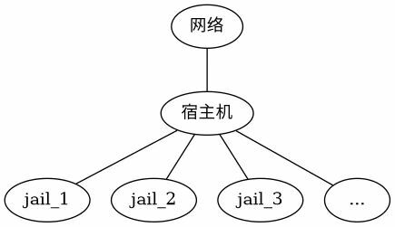

# 32.3 Qjail

## Jail Management Tools Comparison

Qjail is a wrapper tool for deploying Jail environments, providing security and performance enhancement features.

The conceptual structure of the Jail deployed in this section is shown in the following diagram:



## Reserving Jail IP Addresses: Network Interface Configuration

Add the following configuration to the **/etc/rc.conf** file. The cloned interface lo1 separates Jail network configuration from the host network configuration, enhancing isolation.

```ini
cloned_interfaces="lo1"  # Clone lo1, should be separated from host network configuration ①
ifconfig_lo1_alias0="inet 192.168.1.1/28" # Create an independent subnet with 14 assignable IP addresses. Adjust the address range according to the actual network environment
```

> **Warning**
>
> ① To create multiple interfaces, describe them on the same line separated by spaces, rather than creating multiple lines. It should be `cloned_interfaces="lo1 lo2"`. When written on separate lines, only the first line takes effect.

Restart all network interfaces to apply the configuration:

```sh
# service netif restart
```

lo1 will have 14 IP addresses available, all of which can be assigned to individual Jails.

## Installing Qjail

Install Qjail using pkg:

```sh
# pkg install qjail
```

Or install using Ports:

```sh
# cd /usr/ports/sysutils/qjail/
# make install clean
```

Enable the `qjail` service to start at boot:

```sh
# sysrc qjail_enable=YES
```

## Deploying the Qjail Directory Structure

Before using Qjail, deploy its directory structure using one of the following two methods:

### Method 1: Automatic Download from Official Mirror

```sh
# qjail install
```

Qjail will download the base.txz file from the FreeBSD official site. Example output:

```sh
# qjail install
resolving server address: ftp.freebsd.org:80
requesting http://ftp.freebsd.org/pub/FreeBSD/releases/amd64/amd64/15.0-RELEASE/base.txz
remote size / mtime: 195363380 / 1652346155
...
```

### Method 2: Download from a Chinese Mirror

When network access within China is restricted, a mirror site can be used for manual download. Taking the University of Science and Technology of China Open Source Mirror as an example. Use the `freebsd-version` command to confirm the host's FreeBSD version; Qjail requires the file version to match the host. The following example is for FreeBSD amd64 15.0:

Download the FreeBSD base system file from the mirror server:

```sh
# fetch https://mirrors.ustc.edu.cn/freebsd/releases/amd64/15.0-RELEASE/base.txz
```

Install the base system to the specified Jail using qjail:

```sh
# qjail install base.txz
```

After deploying the Qjail directory structure, four directories — `sharedfs`, `template`, `archive`, and `flavors` — will be automatically generated under the **/usr/jails** directory. These four directories constitute the core file system architecture of Qjail:

| Directory | Description |
| --------- | ----------- |
| **sharedfs** | Contains a read-only operating system executable library, shared among Jails via nullfs to save storage space. nullfs is a special file system provided by FreeBSD that can mount the same file system at multiple locations on the same host |
| **template** | Contains the operating system configuration file templates, which will be copied to each Jail's base file system as the initial configuration for new Jails |
| **archive** | Stores archive files produced by the Jail archive command, used for Jail backup and restoration |
| **flavors** | Contains system flavors and user-created custom flavors, which are essentially predefined configuration file sets for quickly customizing new Jail configurations |

File structure:

```sh
/usr/jails/
├── sharedfs/         # Read-only OS library (shared by all Jails)
├── template/         # Configuration file templates
├── archive/          # Jail archive files
├── flavors/          # System flavor configurations
│   └── default/
│       └── usr/
│           └── local/
│               └── etc/
│                   └── pkg/
│                       └── repos/
│                           └── FreeBSD.conf  # Custom pkg mirror configuration
├── jail1/            # jail1 root directory
└── jail2/            # jail2 root directory
    └── usr/
        └── local/
            └── etc/
                └── pkg/
                    └── repos/
                        └── FreeBSD.conf  # Automatically copied configuration
```

## Deploying Jails

Create Jail jail1, specifying the network interface and IPv4 address:

```sh
# qjail create -n lo1 -4 192.168.1.1 jail1
```

- `-n` specifies lo1 as the network interface
- `-4` specifies the IPv4 address

After creating jail1, a `jail1` directory will be created under **/usr/jails/** (**/usr/jails/jail1/**) to store the corresponding files.

Custom configuration files can be created in the aforementioned `flavors` directory, so that they are automatically copied when deploying new Jails. For example, create a new file **/usr/jails/flavors/default/usr/local/etc/pkg/repos/FreeBSD.conf**, and subsequently created Jails will automatically copy this file:

```sh
# qjail create -n lo1 -4 192.168.1.2 jail2
```

After creating jail2, the file **/usr/jails/jail2/usr/local/etc/pkg/repos/FreeBSD.conf** is automatically generated, effectively modifying the default `pkg` mirror for all subsequent Jails. However, since the corresponding file was not written to the flavors directory when jail1 was created, jail1 does not have this file.

## Qjail Basic Usage

Jails managed by Qjail are essentially standard FreeBSD Jails, so system commands like `jls` and `jexec` can also be used to view and operate these Jails. The following are Qjail-specific management commands.

List Jails managed by Qjail:

```sh
# qjail list
```

Start Jails:

```sh
# qjail start # Start all Jails
# qjail start jail1 # Start jail1
```

Stop Jails:

```sh
# qjail stop # Stop all Jails
# qjail stop jail1 # Stop jail1
```

Restart Jails:

```sh
# qjail restart # Restart all Jails
# qjail restart jail1 # Restart jail1
```

Enter the Jail console:

```sh
# qjail console jail1
```

After entering the Jail console, operations will be performed as the root account within the Jail (no password required). Since the Jail may expose services externally, it is recommended to set a root account password for security.

Back up Jails:

```sh
# qjail archive -A  # Back up all Jails
# qjail archive jail1  # Back up jail1
```

Restore Jails from backup:

```sh
# qjail restore jail1
```

Delete Jails:

```sh
# qjail delete jail1  # Delete jail1
# qjail delete -A     # Delete all Jails
```

## Updating Jails

Since these files are shared via nullfs as a single copy, some Jail updates are not applied to individual Jails but to all Jails.

### Updating the Base System in Jails

Update the files in sharedfs:

```sh
# qjail update -b
```

### Updating Ports

The `-P` (uppercase) option uses the host's Ports to update the Jail's Ports tree.

```sh
# qjail update -P
```

### Updating System Source Code

```sh
# qjail update -S # S is uppercase
```

### Update Process

The complete update process is as follows:

Fetch and install FreeBSD system updates:

```sh
# freebsd-update fetch
# freebsd-update install
```

Stop all qjail Jails:

```sh
# qjail stop
```

Update the qjail base system:

```sh
# qjail update -b
```

Update qjail source code:

```sh
# qjail update -S
```

Update qjail Ports:

```sh
# qjail update -P
```

Start all qjail Jails:

```sh
# qjail start
```

## Jail Settings

Qjail provides the `qjail config` command for customizing each Jail's configuration. Core configuration parameters cannot be safely modified while a Jail is running, so the target Jail must be stopped before executing this command.

The `qjail config` command provides a rich set of configuration options. The following lists several commonly used parameters.

### `-h`

Quickly configure SSH service for jail1:

```sh
# qjail config -h jail1
```

This command quickly enables the SSH service for jail1, creates a new wheel group user with the same username and password as the jail name, and the system will require a password change on first login with that user. Alternatively, the `sshd` service can be configured manually after logging into the jail1 console.

### `-m`, `-M`

Set jail1 to manual start state:

```sh
# qjail config -m jail1
```

Set jail1 to manual start state (manual state). After `qjail_enable="YES"` is written to the **/etc/rc.conf** file, the system will automatically start all Jails at boot; setting a Jail to manual start means it will not start automatically at boot and must be manually started using `qjail start jailname`.

Corresponding to the lowercase `-m` option, there is an uppercase `-M` option, which disables the manual start state, i.e., clears the manual state, allowing the Jail to start automatically at boot. Qjail has many similar options where lowercase letters enable a feature and uppercase letters disable it. This pattern will not be explained again when both lowercase and uppercase options appear together below.

### `-r`, `-R`

Set jail1 to not allowed to start (norun state):

```sh
# qjail config -r jail1
```

This configuration is equivalent to disabling jail1.

### `-y`, `-Y`

Enable System V IPC (Inter-Process Communication) for jail1:

```sh
# qjail config -y jail1
```

System V IPC is a classic UNIX inter-process communication mechanism, including shared memory, semaphores, and message queues. This option must be enabled when deploying applications such as PostgreSQL in jail1 that depend on shared memory and semaphores.

## Network Configuration

Some tutorials mention using `qjail config -k jailname` to enable the `raw_sockets` feature for external network access. This is a common misconception. `raw_sockets` is only needed for tools like `ping` and is not a prerequisite for network access. Enabling `raw_sockets` in a Jail poses security risks, as this is part of the Jail environment's default security design. Unless there is a genuine need to use tools like `ping` within the Jail, the `raw_sockets` feature should not be enabled.

This Jail is bound to the `lo1` network interface, and `lo1` cannot directly access the external network. Therefore, the Jail still cannot connect to external networks at this point. PF must be configured for networking, where `em0` is the external network interface. Use the `ifconfig` command to find the external network interface name on the system.

Write the configuration in the **/etc/pf.conf** file. Network Address Translation (NAT) allows Jails to access external networks, and port redirection allows external networks to access services on specific Jails:

```ini
rdr pass on em0 inet proto tcp from any to em0 port 22 -> 192.168.1.1 port 22 # Port redirection: forward TCP connections on port 22 of em0 to port 22 of 192.168.1.1 (jail1)
nat pass on em0 inet from lo1:network to any -> (em0)
```

> **Warning**
>
> The `rdr pass` rule above redirects all traffic entering port 22 on the `em0` interface to jail1. If the host also provides SSH service via `em0`, this will make the host inaccessible via SSH. It is recommended to change the target port or external port of the redirection to a non-22 port (e.g., change the external port to `2222`: `rdr pass on em0 inet proto tcp from any to em0 port 2222 -> 192.168.1.1 port 22`), or add conditions in the rule to exclude the host, to avoid the host's SSH service being shadowed.

> **Tip**
>
> The `em0` in the above example is a placeholder and must be replaced with the actual value.

Start the firewall service:

```sh
# service pf enable
# service pf start
```

At this point, Jails bound to lo1 can access external networks, and external networks can connect to jail1's port 22 via the host's port 22.

## Example: Deploying a PostgreSQL Jail

After reserving Jail IP addresses and successfully running the `qjail install` command as described earlier, this section uses PostgreSQL 15 as an example for deployment; other versions are also applicable.

### Operations on the Host

Create and configure the PostgreSQL Jail:

Create the jail postgres, bound to the lo1 interface, with the IPv4 address **192.168.1.3**:

```sh
# qjail create -n lo1 -4 192.168.1.3 postgres
```

Configure the postgres jail, enabling SysV IPC:

```sh
# qjail config -y postgres
```

Start the postgres jail:

```sh
# qjail start postgres
```

Edit the **/etc/pf.conf** file:

```ini
nat pass on em0 inet from lo1:network to any -> (em0)
rdr pass on em0 inet proto tcp from any to em0 port 5432 -> 192.168.1.3 port 5432
```

> **Note**
>
> Directly exposing PostgreSQL connections to the outside poses security risks; port forwarding should be enabled cautiously based on actual needs.

Start the PF firewall service:

```sh
# service pf start
```

Enter the jail postgres console:

```sh
# qjail console postgres
```

### Operations in the Jail Console

The following commands are all run within the Jail console. When installing with `pkg`, mirrors can be used as needed. If using a mirror, it can be configured in the Jail console in the same way as on the host; see the relevant chapters for details.

#### Configuring the PostgreSQL Dataset

The PostgreSQL installation process is omitted here; see other chapters in this book for details.

Enable the PostgreSQL service to start at boot:

```sh
# service postgresql enable
```

Create the PostgreSQL data directory (note the version number):

```sh
# mkdir -p -m 0700 /var/db/postgres/data15
```

Set the data directory owner to the postgres user:

```sh
# chown postgres:postgres /var/db/postgres/data15
```

Switch to the postgres user:

```sh
# su postgres
```

Initialize the PostgreSQL database:

```sh
$ initdb -A scram-sha-256 -E UTF8 -W -D /var/db/postgres/data15
```

Here `initdb` is used instead of **/usr/local/etc/rc.d/postgresql initdb** as suggested during installation, to avoid repeatedly modifying the `pg_hba.conf` file when setting the database password. A brief explanation of each option:

| Option | Description |
| ------ | ----------- |
| `-A` | Specifies the default authentication method for local users in `pg_hba.conf` |
| `-E` | Selects the encoding for the template databases |
| `-W` | Causes initdb to prompt for a password for the database superuser |
| `-D` | Specifies the directory where the database cluster should be stored |

Return to the jail root user:

```sh
$ exit
```

Start the PostgreSQL service immediately:

```sh
# service postgresql start
```

If the `qjail config -y postgres` command was not used to enable SysV IPC during the above process, the following errors may occur:

#### Error During Database Cluster Initialization


Error when starting PostgreSQL.


At this point, run `qjail config -y postgres` on the host console to fix the error, as follows:

Stop the postgres jail:

```sh
# qjail stop postgres
```

Configure the postgres jail, enabling SysV IPC:

```sh
# qjail config -y postgres
```

Start the postgres jail:

```sh
# qjail start postgres
```

After entering the Jail console again, the database cluster can be initialized and the PostgreSQL service can run normally.

## References

- FreeBSD Project. qjail(8) - Utility for deployment of jail environments[EB/OL]. [2026-04-17]. <https://man.freebsd.org/cgi/man.cgi?query=qjail&sektion=8>. Qjail official manual page, covering all command parameters and configuration options.
- Qjail Project. Qjail on SourceForge[EB/OL]. [2026-04-17]. <https://qjail.sourceforge.net/>. Qjail project homepage, introducing its design philosophy as a fourth-generation Jail management tool.
- FreeBSD Project. iocage(8)[EB/OL]. [2026-04-17]. <https://man.freebsd.org/cgi/man.cgi?query=iocage&sektion=8>. iocage manual page; this tool depends on ZFS for Jail management functionality.
