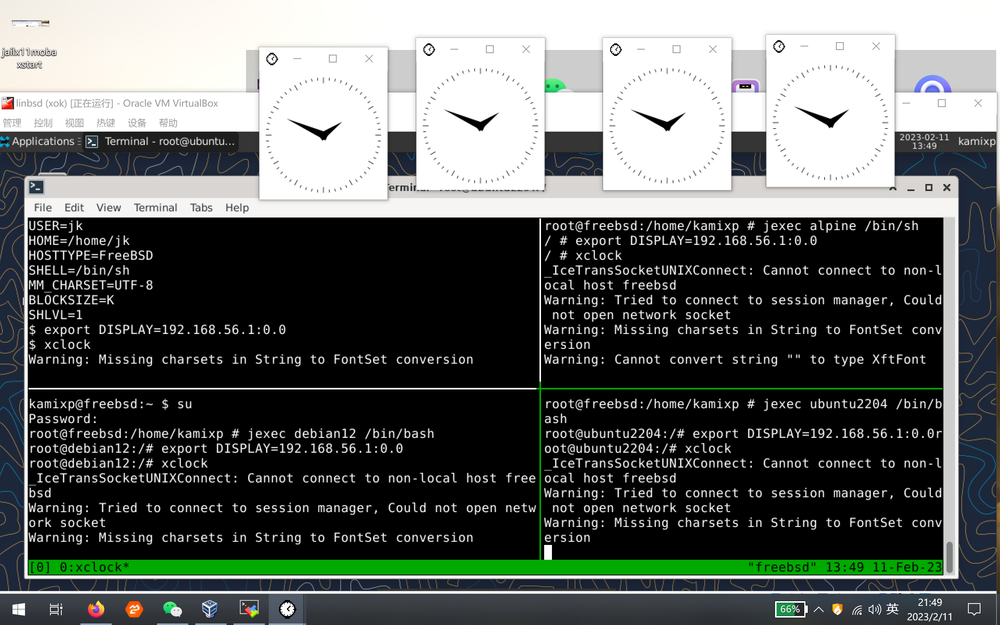
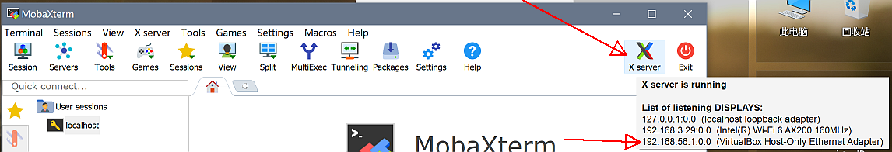
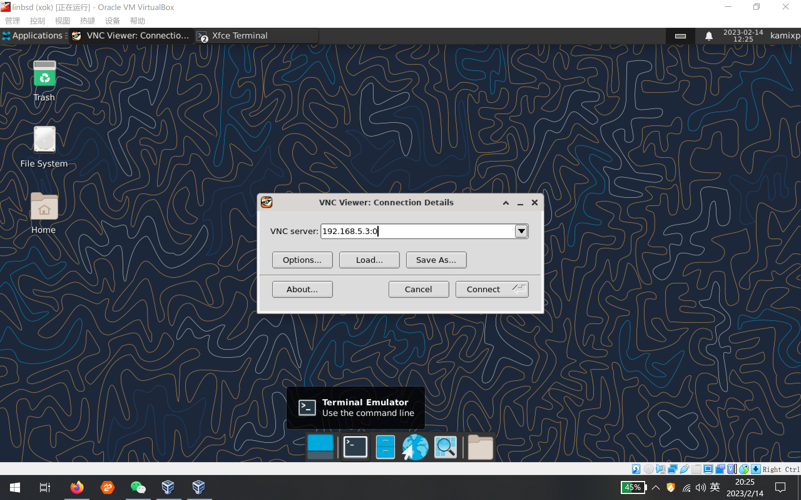
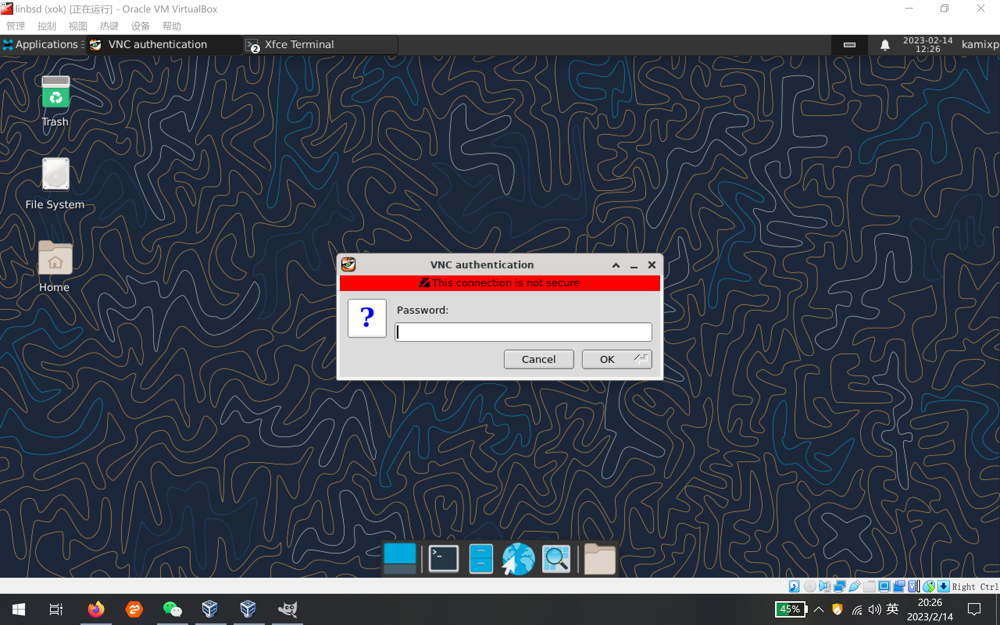
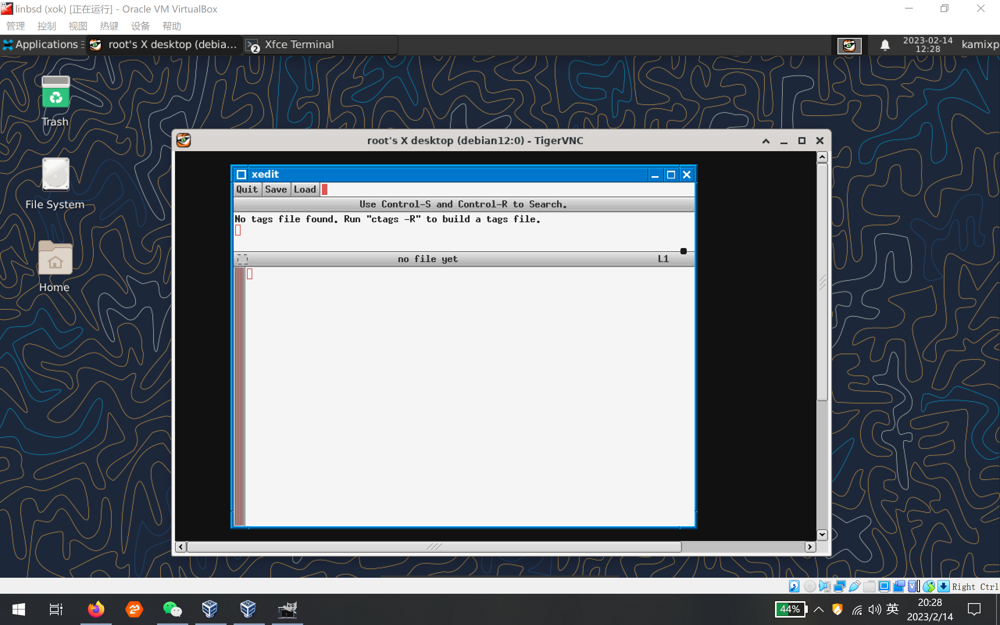

# 33.6 GUI in Linux Jails

## GUI in Jails

The example environment in this section is a Windows 10 physical machine with a FreeBSD 13.1 virtual machine installed in VirtualBox.

Four Jails have been deployed in the FreeBSD virtual machine. One of them is a FreeBSD Jail, referred to as `freebsd-jail` to distinguish it from the FreeBSD virtual machine in VirtualBox:

Windows 10 physical machine → FreeBSD 13.1 virtual machine → FreeBSD Jail (`freebsd-jail`) + debian Jail + Ubuntu Jail + Alpine Jail.

```sh
# jls
   JID  IP Address      Hostname                      Path
     1  192.168.5.1     debian                      /usr/jails/debian
     2  192.168.5.2     ubuntu                    /usr/jails/ubuntu
     3  192.168.5.4     alpine                        /usr/jails/alpine
     4  192.168.5.5     freebsd-jail                  /usr/jails/freebsd-jail
```

Directory structure:

```sh
/usr/jails/
├── debian/          # JID 1, IP 192.168.5.1
├── ubuntu/          # JID 2, IP 192.168.5.2
├── alpine/          # JID 3, IP 192.168.5.4
└── freebsd-jail/    # JID 4, IP 192.168.5.5
```

xclock, Firefox, Chrome, and jwm are installed in the four Jails respectively, with jwm used for interface management. In Alpine, the VNC method could not be debugged successfully, and Firefox and Chrome also failed to run, but xclock, xterm, and similar programs work normally.

> **Tip**
>
> There is no need to install xorg.

In Ubuntu 22.04, Firefox is distributed as a snap package by default. Since snap depends on systemd, it cannot be used in a Jail, so Firefox must be installed using the deb package. Chrome is only available as a deb package in Ubuntu and does not depend on snap, so it can be installed directly. The method is as follows:

```sh
# Download the Google Chrome stable installer package
# wget https://dl.google.com/linux/direct/google-chrome-stable_current_amd64.deb

# Install the downloaded deb package using dpkg
# dpkg -i google-chrome-stable_current_amd64.deb

# If dpkg has dependency issues, use apt to install the local deb package and automatically resolve dependencies
# apt install ./google-chrome-stable_current_amd64.deb
```

## Terminal with X Server

Use MobaXterm. MobaXterm works with its default configuration and requires no additional setup.



Make sure the X server is enabled, and note the `DISPLAY` value. The format is `hostname:displaynumber.screennumber`, which here is **192.168.56.1:0.0**.

Log into the Jail (any login method and any user):

```sh
$ export DISPLAY=192.168.56.1:0.0  # Inside the Jail, this is for sh/zsh/bash. For csh/tcsh, use setenv DISPLAY 192.168.56.1:0.0; same below
$ xclock&  # Run xclock in the background
```



Four independent xclock instances are displayed on the Windows 10 desktop, all running normally.

## Nested X Server

Xnest/Xephyr is a nested X Server technology. To X11 applications, it acts as an X Server; to the host X Server, it acts as an X Client. This nested structure allows running a complete X session within an X window.

Install Xnest or Xephyr in the FreeBSD virtual machine. Choose either one:

```sh
# pkg install xorg-nestserver
```

Or:

```sh
# pkg install xephyr
```

Enable it in FreeBSD:

```sh
$ Xephyr :1 -listen tcp
```

Parameter description:

- `:1` is the `displaynumber` in the `DISPLAY` value. The FreeBSD system IP is **10.0.2.15**, so the complete `DISPLAY` value is **10.0.2.15:1.0**. Since the FreeBSD system's X Server uses `displaynumber` `0`, start from `1`.
- `-listen tcp` listens on the TCP port.

In the Jail, use the same method as described earlier:

```sh
$ export DISPLAY=10.0.2.15:1.0
$ xclock&
```

All four Jails can open xclock simultaneously in a single Xnest/Xephyr window started on FreeBSD. However, without a window manager, xclock lacks window decorations and basic interaction features. You can run jwm before executing xclock, as follows:

```sh
$ export DISPLAY=10.0.2.15:1.0
$ jwm &
$ xclock&
```

jwm only needs to be run once; there is no need to run it in each Jail separately. jwm is used here because it is lightweight. Desktop environments such as Xfce can also be used, depending on your needs.

## Shared Host Socket Method

First, run the following on the FreeBSD system:

```sh
$ xhost +
```

> **Warning**
>
> `xhost +` disables access control, which poses a security risk. A more secure approach is to specify the IP addresses allowed to access.

Then add the following to the Jail's `fstab` file. Using the ubuntu Jail's `fstab` as an example; modify other Jails accordingly:

```ini
/tmp/.X11-unix   /usr/jails/ubuntu/tmp/.X11-unix    nullfs   ro   0  0
```

If necessary, first run `mkdir -p /usr/jails/ubuntu/tmp/.X11-unix` to ensure the mount point exists.

After restarting the Jail, run the following inside the Jail:

```sh
$ export DISPLAY=:0.0
$ xclock &
```

As mentioned earlier, the `fstab` file contains the following line:

```sh
#/tmp   /usr/jails/ubuntu/tmp   nullfs  rw    0  0
```

This configuration exposes the FreeBSD **/tmp** directory to the Jail with read-write access, breaking isolation, so it is commented out. Mounting only **/tmp/.X11-unix** significantly improves security.

## X Server TCP Listening with xhost Connection Management

This section uses the SDDM display manager. If using another display manager, refer to the corresponding documentation; the principle is the same.

On FreeBSD, edit or create the **/usr/local/etc/sddm.conf** file and modify `ServerArguments` as follows:

```sh
[X11]
ServerArguments=-listen tcp
```

After restarting, add the Jail IP on FreeBSD to allow access:

```sh
$ xhost + 192.168.5.1
```

This method is more secure than `xhost +`, as it only allows access from the specified IP.

Then, inside the Jail, run:

```sh
$ export DISPLAY=:0.0
$ xclock &
```

Setting `DISPLAY` to `:0.0`, **127.0.0.1:0.0**, or **10.0.2.15:0.0** all work. You can try any of the above methods.

## VNC

Install a VNC server in the Debian Jail; tightvncserver can be used. Using the Debian Jail as an example, run the following inside the Jail:

```sh
# apt install tightvncserver
$ vncpasswd
Password:
Verify:
Would you like to enter a view-only password (y/n)? n
A view-only password is not used
$ vncserver :0
```

The vncserver port number is 5900 plus the number after the colon. Here it is 5900; `:1` corresponds to port 5901, and so on.

Log into the Jail using a VNC client:







## Appendix and Addenda

One reason TCP listening is disabled by default is that the host X Server's TCP listening combined with xhost connection management has poor security.

When using the shared host socket method, note that only **/tmp/.X11-unix** should be mounted rather than the entire **/tmp**, and `xhost +<specified IP>` should be used instead of `xhost +`; meeting these two points ensures security.

The three methods — terminal with X Server, shared host socket, and VNC — are recommended. Regardless of the method used, Linux Jails have certain compatibility limitations, and not all X applications can run; in comparison, FreeBSD Jails have better compatibility.

Except for the shared host socket method, the other methods can also be used in non-Jail environments.

## References

* FreeBSD Wiki. LinuxApps[EB/OL]. [2026-03-25]. <https://wiki.freebsd.org/LinuxApps>. Lists Linux applications and methods running on FreeBSD, providing reference for compatibility practices.
* FreeBSD Chinese Handbook. 12.2. Configuring the Linux Binary Compatibility Layer[EB/OL]. [2026-03-25]. <https://handbook.bsdcn.org/di-12-zhang-linux-er-jin-zhi-jian-rong-ceng/12.2.-pei-zhi-linux-er-jin-zhi-jian-rong-ceng.html>. A detailed guide on Linuxulator configuration in the FreeBSD Chinese handbook.
* FreeBSD Project. linux -- Linux ABI support[EB/OL]. [2026-03-25]. <https://man.freebsd.org/cgi/man.cgi?query=linux&sektion=4>. The official manual detailing the system call translation mechanism of the Linux compatibility layer.
* FreeBSD Wiki. Linuxulator[EB/OL]. [2026-03-25]. <https://wiki.freebsd.org/Linuxulator>. Authoritative documentation on the technical principles and implementation details of Linuxulator.
* FreeBSD Wiki. LinuxJails[EB/OL]. [2026-03-25]. <https://wiki.freebsd.org/LinuxJails>. Introduction to deploying Linux user space environments in FreeBSD Jails.
