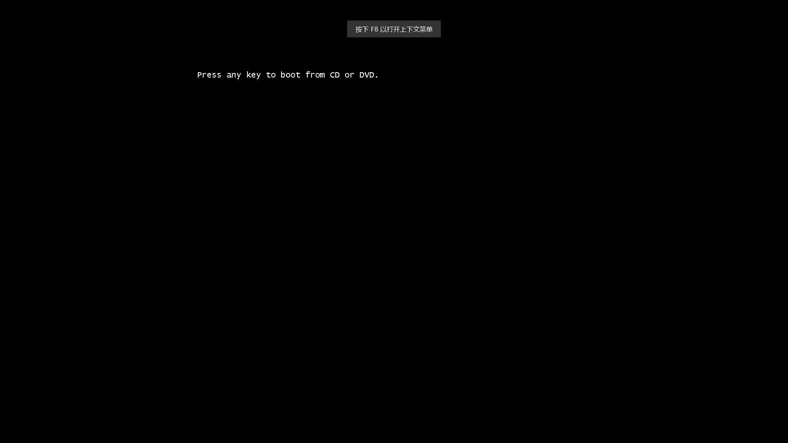
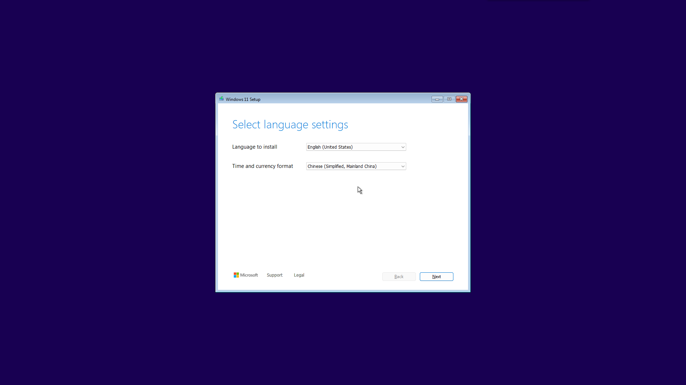
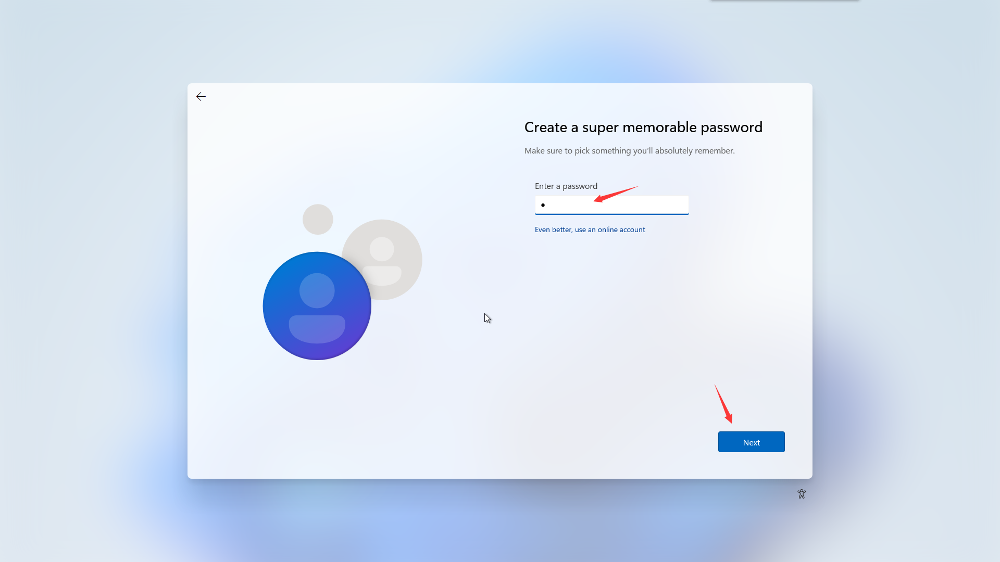
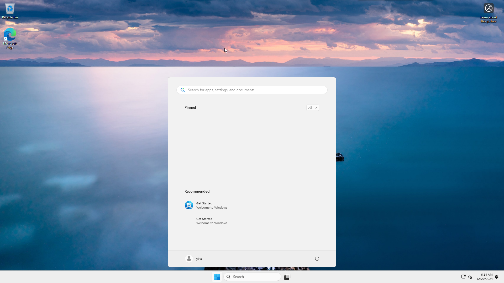
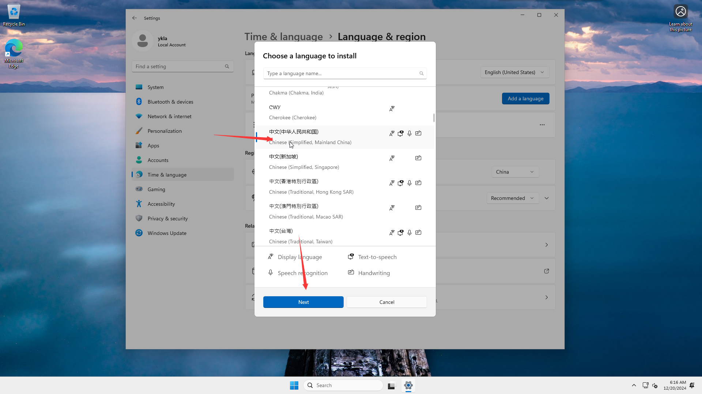
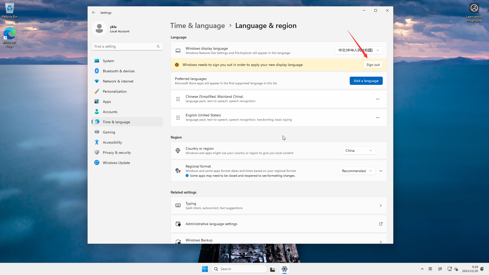
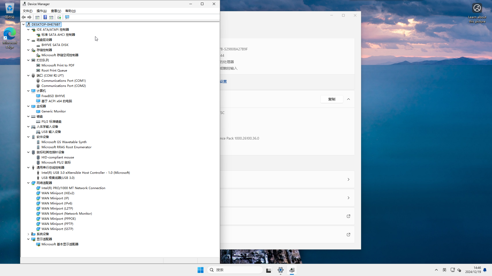
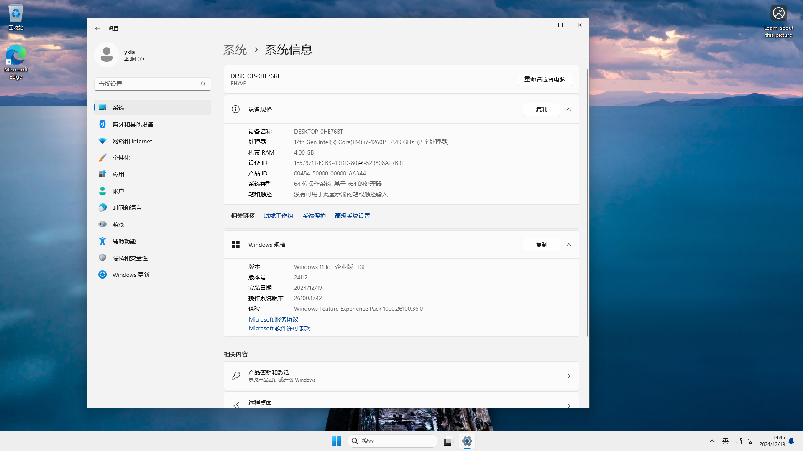

# 34.1 Installing Windows 11 with bhyve and vm-bhyve

vm-bhyve is a command-line management tool for bhyve that wraps the underlying bhyve commands, simplifying virtual machine configuration management.

This section is based on FreeBSD 14.2-RELEASE and Windows 11 IoT Enterprise LTSC, covering the installation, environment configuration, and system image preparation of the bhyve virtual machine management tool.

## Preparing the Windows Image

Windows 11 IoT Enterprise LTSC, version 24H2 (x64) - DVD (English) system download link (from MSDN I Tell You: <https://next.itellyou.cn/>):

The IoT version lists the Trusted Platform Module (TPM) as an optional requirement, and installation limits such as memory size are also more relaxed, lowering the deployment barrier.

SHA-256 checksum: `4F59662A96FC1DA48C1B415D6C369D08AF55DDD64E8F1C84E0166D9E50405D7A`

Magnet link: `magnet:?xt=urn:btih:7352bd2db48c3381dffa783763dc75aa4a6f1cff&dn=en-us_windows_11_iot_enterprise_ltsc_2024_x64_dvd_f6b14814.iso&xl=5144817664`

## Loading Kernel Modules

First, the kernel modules related to virtual machine management need to be loaded. vmm is the virtual machine monitor provided by the FreeBSD kernel, offering hardware-assisted virtualization support for bhyve. This module only needs to be loaded once; afterward, vm-bhyve will manage it automatically.

> **Tip**
>
> After a system reboot, there is no need to manually load it; vm-bhyve will automatically load this module.

```sh
# kldload vmm	# Load the FreeBSD virtual machine management module (vmm)
```

View the loaded vmm-related kernel modules. Among them, `vmm.ko` is the bhyve virtual machine monitor module, and `vmmemctl.ko` is the VMware memory balloon driver, which is unrelated to bhyve:

```sh
# kldstat | grep vmm
 7    1 0xffffffff83320000     44b0 vmmemctl.ko
10    1 0xffffffff83400000   33e438 vmm.ko
```

## Installing vm-bhyve Related Software

Next, install the Unified Extensible Firmware Interface (UEFI) firmware, Virtual Network Computing (VNC) client, and vm-bhyve management tool. The UEFI firmware provides modern boot support for virtual machines, and the VNC client is used to access the virtual machine graphical interface.

1. **Install using pkg**:

    ```sh
    # pkg install bhyve-firmware vm-bhyve tigervnc-viewer
    ```

2. **Or install using Ports**:

    ```sh
    # Install bhyve firmware
    # cd /usr/ports/sysutils/bhyve-firmware && make install clean

    # Install vm-bhyve management tool
    # cd /usr/ports/sysutils/vm-bhyve && make install clean

    # Install TigerVNC Viewer
    # cd /usr/ports/net/tigervnc-viewer && make install clean
    ```

## Configuring vm-bhyve

Edit the **/etc/rc.conf** file to enable the vm service and specify the virtual machine storage directory:

```sh
# Enable the vm-bhyve service
vm_enable="YES"

# Specify the virtual machine storage directory; subsequent operations will use this path
vm_dir="/home/ykla/vm"
```

> **Tip**
>
> The `/home/ykla` shown in the examples in this section is a sample path; please replace it with the actual user home directory in your environment.

Create the template path:

```sh
# mkdir -p /home/ykla/vm/.templates
```

Copy templates to the virtual machine template location:

```sh
# cp /usr/local/share/examples/vm-bhyve/* /home/ykla/vm/.templates
```

Next, configure the virtual network. `public` is the virtual switch name specified by the template, and `ue0` is the current host's physical network interface name; please modify it according to your actual network card (you can check it with the `ifconfig` command). The virtual switch uses bridge(4) to complete network bridging, connecting the virtual machine network stack to the host's physical network interface, allowing the virtual machine to directly access the physical network.

```sh
# Create the virtual switch public
# vm switch create public

# Add physical network card ue0 to the public virtual switch
# vm switch add public ue0
```

After creation, view the newly added `vm-public`:

```sh
# ifconfig

...part omitted...

vm-public: flags=1008843<UP,BROADCAST,RUNNING,SIMPLEX,MULTICAST,LOWER_UP> metric 0 mtu 1500
	options=0
	ether 62:bc:e8:9f:f7:e1
	id 00:00:00:00:00:00 priority 32768 hellotime 2 fwddelay 15
	maxage 20 holdcnt 6 proto rstp maxaddr 2000 timeout 1200
	root id 00:00:00:00:00:00 priority 32768 ifcost 0 port 0
	member: ue0 flags=143<LEARNING,DISCOVER,AUTOEDGE,AUTOPTP>
	        ifmaxaddr 0 port 3 priority 128 path cost 20000
	groups: bridge vm-switch viid-4c918@
	nd6 options=9<PERFORMNUD,IFDISABLED>
```

> **Tip**
>
> If created incorrectly, you can delete the virtual switch with the following command:
>
> ```sh
> # vm switch destroy public
> ```

View the assigned virtual switches:

```sh
# vm switch list
NAME    TYPE      IFACE      ADDRESS  PRIVATE  MTU  VLAN  PORTS
public  standard  vm-public  -        no       -    -     ue0
```

To use the xHCI mouse on hosts running FreeBSD 13.0 and above, the USB HID subsystem must be enabled. Add the following to the **/boot/loader.conf** file:

```sh
# Enable USB HID support
hw.usb.usbhid.enable="1"

# Automatically load the usbhid kernel module at boot
usbhid_load="YES"
```

Related file structure:

```sh
/
├── boot/
│   └── loader.conf # Kernel module loading configuration
├── etc/
│   └── rc.conf # System startup configuration
├── home/
│   └── ykla/
│       ├── vm/ # Virtual machine storage directory
│       │   ├── .templates/ # Virtual machine template directory
│       │   └── winguest/
│       │       ├── winguest.conf # Virtual machine configuration file
│       │       └── disk0.img # Virtual machine disk image
│       └── en-us_windows_11_iot_enterprise_ltsc_2024_x64_dvd_f6b14814.iso # Windows ISO image
└── usr/
    ├── local/
    │   └── share/
    │       └── examples/
    │           └── vm-bhyve/ # vm-bhyve example files
    └── ports/
        ├── sysutils/
        │   ├── bhyve-firmware/ # bhyve firmware Ports directory
        │   └── vm-bhyve/ # vm-bhyve Ports directory
        └── net/
            └── tigervnc-viewer/ # TigerVNC Viewer Ports directory
```

## Configuring the Virtual Machine Template

Virtual machine templates are the base configuration files for creating virtual machines. The following demonstrates how to create and configure a Windows virtual machine template.

> **Tip**
>
> If running a version prior to Windows 10, or when installing Microsoft SQL Server on a Windows system, you need to use the parameter `disk0_opts="sectorsize=512"` to set the disk sector size to 512.

Create a Windows virtual machine based on the template with a 40 GB disk:

```sh
# vm create -t windows -s 40G winguest
```

> **Tip**
>
> Command to destroy a virtual machine:
>
> ```sh
> # vm destroy winguest
>
> Are you sure you want to completely remove this virtual machine (y/n)? # Enter y and press Enter to delete
> ```

The default template has issues and needs to be modified. The configuration file path is **/home/ykla/vm/winguest/winguest.conf**:

> **Note**
>
> In older versions of FreeBSD (prior to FreeBSD 14.0), **/home/** is a symbolic link to **/usr/home/**, and both are identical.
>
> Since FreeBSD 14, symbolic links are no longer used; the **/home/** directory is used directly.

```ini
# Set the virtual machine to use UEFI boot; Windows without UEFI support cannot boot (e.g., Windows XP), Windows 7 64-bit version supports UEFI
loader="uefi"

# Enable graphical interface; the virtual machine pauses at startup until a VNC client connects
graphics="yes"

# Enable USB 3.0 mouse support
xhci_mouse="yes"

# Number of CPUs allocated; adjust appropriately based on host performance
cpu=2

# Memory size allocated
memory=4G

# By default, bhyve does not enable -H; the virtual machine will consume 100% of the host CPU when idle
# To enable HLT to yield CPU, use the bhyve_options field to pass the -H parameter to bhyve
# bhyve_options="-H"  # Yield host CPU when guest executes HLT, can reduce idle VM CPU usage
# cpu_hlt="yes"  # This option is not an official vm-bhyve configuration parameter

# Limit the number of devices attached to a single AHCI controller to avoid PCI slot numbering changes after adding disks
# which would cause Windows to recognize the network device as a new network card
ahci_device_limit="8"

# Network configuration
# It is recommended to switch to virtio-net and install drivers in the guest; e1000 works out of the box
network0_type="e1000"
network0_switch="public"

# Disk configuration
disk0_type="ahci-hd"
disk0_name="disk0.img"

# Windows uses local time by default instead of UTC
utctime="no"

# VNC display resolution
graphics_res="1920x1080"

# Virtual machine unique identifier
uuid="af86e094-56da-11ed-958f-208984999cc9"

# Network MAC address
network0_mac="58:9c:fc:0c:5e:bb"
```

## Installing the Windows System

In installation mode, `vm-bhyve` will wait for a VNC client to connect before starting the virtual machine, in order to capture the "Press any key to boot from a CD/DVD" prompt that Windows may display. At this point, `vm list` will show the virtual machine in a locked state:

```sh
# vm install winguest /home/ykla/en-us_windows_11_iot_enterprise_ltsc_2024_x64_dvd_f6b14814.iso # Please replace with the actual path
Starting winguest
  * found guest in /home/ykla/vm/winguest
  * booting...
```

### Accessing Win11 via VNC

After the virtual machine starts, you must connect with a VNC client to complete the system installation:



After the `Press any key to boot from a CD/DVD` prompt appears, quickly press Enter a few times.

> **Tip**
>
> If you miss the key press and fall back to the UEFI Shell, stop the virtual machine and re-execute the installation steps above.
>
> 




Change the second item to "Chinese (Simplified, Mainland China)".


Select "Chinese (Simplified, Mainland China)".


During installation, the VNC connection may disconnect several times; reconnecting will resume the session.

In tigervnc-viewer, enter `localhost`, click Connect, and then press any key to continue the installation process.

> **Tip**
>
> To stop the virtual machine: prefer using the `vm stop` command to send an ACPI shutdown signal to the virtual machine. If the virtual machine is blocking the host shutdown, you can press `Ctrl`+`C` in the tty to skip the wait and force a shutdown.
>
> ```sh
> # vm list
> NAME      DATASTORE  LOADER  CPU  MEMORY  VNC           AUTO  STATE
> winguest  default    uefi    2    4G      0.0.0.0:5900  No    Running (2072)
> # vm stop winguest
> Sending ACPI shutdown to winguest
> ```
>
> If `vm stop` is ineffective, use the SIGTERM signal:
>
> ```sh
> # ps -el | grep bhyve
> UID  PID PPID C PRI NI     VSZ    RSS MWCHAN STAT TT     TIME COMMAND
>  0 1858    1 1  68  0   16388      4 wait   IW    3  0:00.00 () /bin/sh /usr/local/sbin/vm _run winguest /home/ykla/zh-cn_windows_11_business_editions_version_24h2_x64_dvd
> # kill 1858
> ```
>
> Wait approximately 10-30 seconds to confirm the process has exited, then run `bhyvectl --destroy --vm=winguest` to clean up. Only use `kill -9` as a last resort if SIGTERM fails after multiple attempts (**Warning: this may cause virtual machine disk data corruption**).

### Post-Installation Configuration

After the system installation is complete, initial configuration is required. The steps are as follows:


Select "China".

Start the virtual machine after installation:

```sh
# vm start winguest
```

Open a VNC connection to proceed.


Enter a username.



Enter a password.


Re-enter the password.


Enter security questions; the system will repeat this three times, requiring three different questions to be set.


Privacy settings. Adjust as needed, then click "Accept".


During installation, the system will perform updates; you can try to skip this step (testing has shown that `oobe\bypassnro` is ineffective), depending on your situation.




Chinese environment configuration:











### Troubleshooting and Unresolved Issues

This section lists issues that may be encountered when using bhyve virtual machines and their solutions.

If you encounter problems, please restart the host first; if the problem persists, you can use `ifconfig` to check and remove extra network interfaces.

If the virtual machine remains in the stopped state for a long time, please check the network configuration.

View network configuration (virtual machine off):

```sh
# ifconfig
alc0: flags=8802<BROADCAST,SIMPLEX,MULTICAST> metric 0 mtu 1500
        options=c319a<TXCSUM,VLAN_MTU,VLAN_HWTAGGING,VLAN_HWCSUM,TSO4,WOL_MCAST,WOL_MAGIC,VLAN_HWTSO,LINKSTATE>
        ether 20:89:82:94:7c:c9
        media: Ethernet autoselect
        nd6 options=29<PERFORMNUD,IFDISABLED,AUTO_LINKLOCAL>
lo0: flags=8049<UP,LOOPBACK,RUNNING,MULTICAST> metric 0 mtu 16384
        options=680003<RXCSUM,TXCSUM,LINKSTATE,RXCSUM_IPV6,TXCSUM_IPV6>
        inet6 ::1 prefixlen 128
        inet6 fe80::1%lo0 prefixlen 64 scopeid 0x2
        inet 127.0.0.1 netmask 0xff000000
        groups: lo
        nd6 options=21<PERFORMNUD,AUTO_LINKLOCAL>
ue0: flags=8943<UP,BROADCAST,RUNNING,PROMISC,SIMPLEX,MULTICAST> metric 0 mtu 1500
        options=8000b<RXCSUM,TXCSUM,VLAN_MTU,LINKSTATE>
        ether f8:e2:3b:3f:ea:4c
        inet 192.168.31.169 netmask 0xffffff00 broadcast 192.168.31.255
        media: Ethernet autoselect (1000baseT <full-duplex>)
        status: active
        nd6 options=29<PERFORMNUD,IFDISABLED,AUTO_LINKLOCAL>
vm-public: flags=8843<UP,BROADCAST,RUNNING,SIMPLEX,MULTICAST> metric 0 mtu 1500
        ether 3a:e1:fa:98:33:b4
        id 00:00:00:00:00:00 priority 32768 hellotime 2 fwddelay 15
        maxage 20 holdcnt 6 proto rstp maxaddr 2000 timeout 1200
        root id 00:00:00:00:00:00 priority 32768 ifcost 0 port 0
        member: ue0 flags=143<LEARNING,DISCOVER,AUTOEDGE,AUTOPTP>
                ifmaxaddr 0 port 3 priority 128 path cost 20000
        groups: bridge vm-switch viid-4c918@
        nd6 options=9<PERFORMNUD,IFDISABLED>
```

View network configuration (virtual machine on); an additional network interface `tap0` will appear:

```sh
tap0: flags=8943<UP,BROADCAST,RUNNING,PROMISC,SIMPLEX,MULTICAST> metric 0 mtu 1500
        description: vmnet/winguest/0/public
        options=80000<LINKSTATE>
        ether 58:9c:fc:10:ff:d6
        groups: tap vm-port
        media: Ethernet autoselect
        status: active
        nd6 options=29<PERFORMNUD,IFDISABLED,AUTO_LINKLOCAL>
        Opened by PID 2519
```

## Optional Configuration

The following are additional virtual machine management commands:

1. **View all virtual machine statuses**:

    ```sh
    # vm list
    NAME      DATASTORE  LOADER  CPU  MEMORY  VNC  AUTO  STATE
    winguest  default    uefi    2    4G      -    No    Stopped
    ```

2. **View a specific virtual machine status**:

    ```sh
    # vm info winguest
    ------------------------
    Virtual Machine: winguest
    ------------------------
      state: stopped
      datastore: default
      loader: uefi
      uuid: af86e094-56da-11ed-958f-208984999cc9
      cpu: 2
      memory: 4G

      network-interface
        number: 0
        emulation: e1000
        virtual-switch: public
        fixed-mac-address: 58:9c:fc:0c:5e:bb
        fixed-device: -

      virtual-disk
        number: 0
        device-type: file
        emulation: ahci-hd
        options: -
        system-path: /home/ykla/vm/winguest/disk0.img
        bytes-size: 42949672960 (40.000G)
        bytes-used: 23557898240 (21.940G)
    ```

## References

- vm-bhyve Project. vm-bhyve/wiki/Running-Windows[EB/OL]. vm-bhyve Project, [2026-03-25]. <https://github.com/churchers/vm-bhyve/wiki/Running-Windows>. The tutorial primarily references this source, which details Windows virtual machine deployment; a Chinese version is available at [vm-bhyve Wiki](https://book.bsdcn.org/wen-zhang/wen-zhang/vm-bhyve).
- bhyve dev. The win11 release ISO requires the install-time regedit TPM workaround[EB/OL]. Twitter, (2021-10-08)[2026-03-25]. <https://twitter.com/bhyve_dev/status/1446404943020056581>. Provides a Windows 11 TPM bypass method.
- rootbert. windows 11 on bhyve[EB/OL]. The FreeBSD Forums, [2026-03-25]. <https://forums.freebsd.org/threads/windows-11-on-bhyve.82371/>. Community discussion on Windows 11 deployment issues and solutions.
- dadv. FreeBSD, bhyve и Windows 11[EB/OL]. livejournal.com, [2026-03-25]. <https://dadv.livejournal.com/209650.html>. Provides a Russian Windows 11 deployment guide.
- FreeBSD Project. wiki/bhyve/Windows[EB/OL]. FreeBSD Wiki, [2026-03-25]. <https://wiki.freebsd.org/bhyve/Windows>. Official Wiki providing Windows virtual machine support information.
- vm-bhyve Project. churchers/vm-bhyve/wiki[EB/OL]. vm-bhyve Project, [2026-03-25]. <https://github.com/churchers/vm-bhyve/wiki>. vm-bhyve official documentation.
- srobb.net. Using Windows on FreeBSD's vm-bhyve[EB/OL]. srobb.net, [2026-03-25]. <https://srobb.net/vm-bhyve.html>. Provides a practical configuration guide for Windows virtual machines.
- Microsoft. Minimum system requirements - Windows IoT Enterprise[EB/OL]. [2026-04-17]. <https://learn.microsoft.com/en-us/windows/iot/iot-enterprise/hardware/system_requirements>. Microsoft Learn. Windows 11 IoT Enterprise LTSC lists TPM 2.0 as an optional requirement.
- FreeBSD Project. usbhid(4)[EB/OL]. [2026-04-17]. <https://man.freebsd.org/cgi/man.cgi?query=usbhid&sektion=4>. FreeBSD USB HID subsystem manual page.
- Microsoft. Firmware WEG: Frequently asked questions (FAQ)[EB/OL]. [2026-04-17]. <https://learn.microsoft.com/en-us/windows-hardware/drivers/bringup/frequently-asked-questions>. Microsoft Learn. Windows UEFI boot requirements explanation; 64-bit Windows 7 requires CSM or 64-bit UEFI firmware support.
