# 34.2 Managing bhyve Virtual Machines via Web Interface with BVCP

bhyve is the native hypervisor for FreeBSD, providing hardware-assisted virtualization support through the vmm kernel module, allowing guest operating systems to directly utilize CPU virtualization extension instruction sets.

BVCP (bhyve Virtual-Machine Control Panel) is a web-based graphical management tool for bhyve that can create, start, and stop virtual machines.

This section's test environment is based on FreeBSD 14.2-RELEASE. BVCP version 2.1.4 does not yet support Chinese localization.

The software project repository address is: <https://github.com/DaVieS007/bhyve-webadmin>

> **Tip**
>
> No need to configure any services, load any modules, or install other software in advance. Following the steps in this section will complete the operation.

## Installing BVCP

Installing BVCP involves the following steps:

- **Download the BVCP distribution file**: Use the `fetch` command to obtain the BVCP archive from the official server.

```sh
# fetch https://bhyve.npulse.net/release.tgz
```

- **Extract the BVCP distribution file**: Extract the downloaded archive to the current directory.

```sh
# tar -xzvf release.tgz
```

- **Install BVCP**: Enter the extracted directory and execute the installation script, which will automatically complete software deployment, database initialization, and service configuration.

```sh
# cd bhyve-webadmin
root@ykla:/home/ykla/bhyve-webadmin # ./install.sh
Installing BVCP into your FreeBSD Installation within seconds ...

Press [CTRL] + [C] to Abort !
bvcp_enable:  -> YES
 N  2024-12-21 11:32:35 | Kinga-Framework | 2024/02-17@build-336/FreeBSD64-L
 N  2024-12-21 11:32:35 | Product Name| BVCP-Backend
 N  2024-12-21 11:32:35 | Description | BVCP Bhyve Backend/Helper Module
 N  2024-12-21 11:32:35 | License | Community Edition
 N  2024-12-21 11:32:35 | Copyright   | All rights reserved for the author: nPulse.net / Viktor Hlavaji
 N  2024-12-21 11:32:35 | Guardian | Create Process, PID: 1132
 N  2024-12-21 11:32:35 | SW | VFS:BuiltIn Loaded
 N  2024-12-21 11:32:35 | ThreadPool | 10/10 Threads initialised
 N  2024-12-21 11:32:35 | LVM::MAIN | Initialising ..


                        ██████╗ ██╗   ██╗ ██████╗██████╗
                        ██╔══██╗██║   ██║██╔════╝██╔══██╗
                        ██████╔╝██║   ██║██║     ██████╔╝
                        ██╔══██╗╚██╗ ██╔╝██║     ██╔═══╝
                        ██████╔╝ ╚████╔╝ ╚██████╗██║
                        ╚═════╝   ╚═══╝   ╚═════╝╚═╝

 N  2024-12-21 11:32:35 | BVCP | Initialising BVCP-Backend 2.1.4 Application

  [>] Generating Entropy ... [217157D53CDD4122589AEE05D866C84C]

 Welcome to initial setup menu!
 The Software is located at: /var/lib/nPulse/BVCP

 The Software is producing pseudo filesystem scheme for virtual machines using symlinks
 Where to create metadata, iso_images, database, config, logs: (Does not need much space), default: [/vms]_>   # Press Enter to confirm; the iso_images required for installation will be stored in this directory

……part omitted……


Bhyve Virtual-Machine Control Panel under FreeBSD

 N  2024-12-21 11:33:46 | BVCP | Initialising BVCP-Backend 2.1.4 Application
 N  2024-12-21 11:33:48 | BVCP | Starting Database ...
 (!) Admin Credentials recreated,
   - User: admin 		# Username admin
   - Password: AdJFjNjG # Password AdJFjNjG

 N  2024-12-21 11:33:48 | SW | Program exited gracefully...
Installation Finished!

Navigate: https://[your-ip]:8086  # Access address is https://[your-ip]:8086; if accessing from the machine where BVCP is installed, you can use https://localhost:8086
```

> **Warning**
>
> The above administrator password is displayed in plaintext on standard output. **Please log in to the web interface and change the default password immediately after installation** to prevent unauthorized access. If the installation process takes place in a non-secure environment (such as a remote SSH session, shared terminal, etc.), ensure that the output has not been intercepted by others.

> **Tip**
>
> The username `ykla`, hostname `ykla`, and path **/home/ykla** shown in the examples in this section are all samples; please replace them with actual values based on your environment.

File structure:

```sh
/
├── var/
│   └── lib/
│       └── nPulse/
│           └── BVCP/ # BVCP software installation location
└── vms/ # Virtual machine metadata, ISO images, database, configuration, and logs storage directory
    └── iso_images/ # ISO image storage directory
```

## Installing Ubuntu 24.04

The installation process is divided into two main steps: obtaining the installation image and configuring the virtual machine through the web interface.

- **Download the Ubuntu 24.04 installation image**: Obtain the Ubuntu 24.04 desktop edition installation image from the University of Science and Technology of China mirror site.

```sh
# fetch https://mirrors.ustc.edu.cn/ubuntu-releases/noble/ubuntu-24.04.1-desktop-amd64.iso
```

- **Move the image to the BVCP image directory**: Move the downloaded ISO file to the BVCP-configured image storage directory so that the web interface can recognize and use it.

```sh
# mv ubuntu-24.04.1-desktop-amd64.iso /vms/iso_images
```

After completing the above preparations, you can start creating the virtual machine through the web interface. The following screenshots demonstrate the complete configuration process:


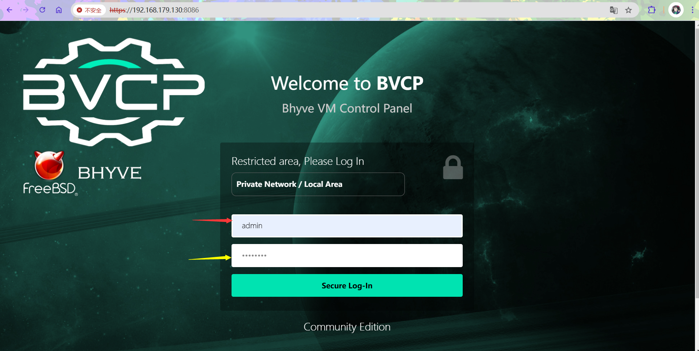

When logging in, ignore the email field displayed at the top; simply enter the username `admin` and the corresponding password generated during installation.


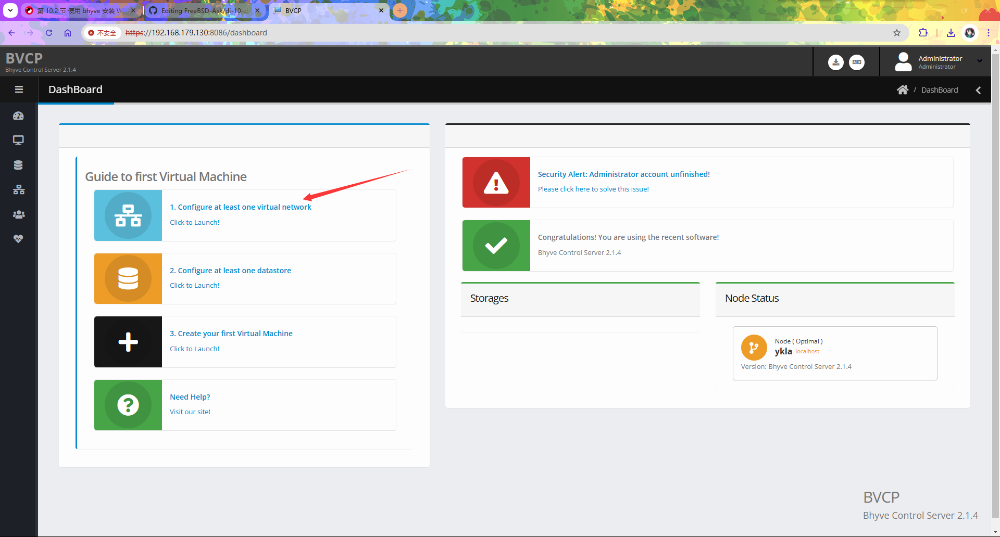


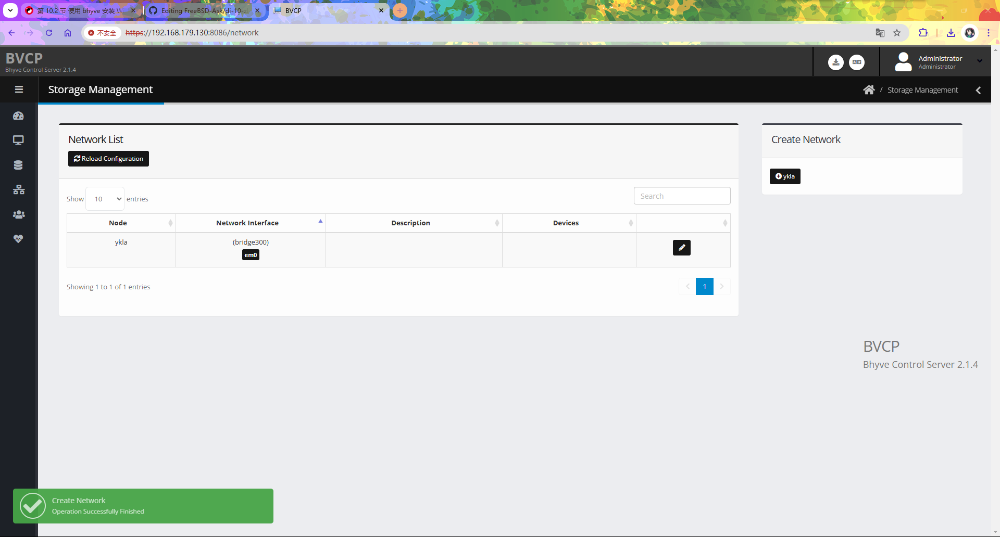

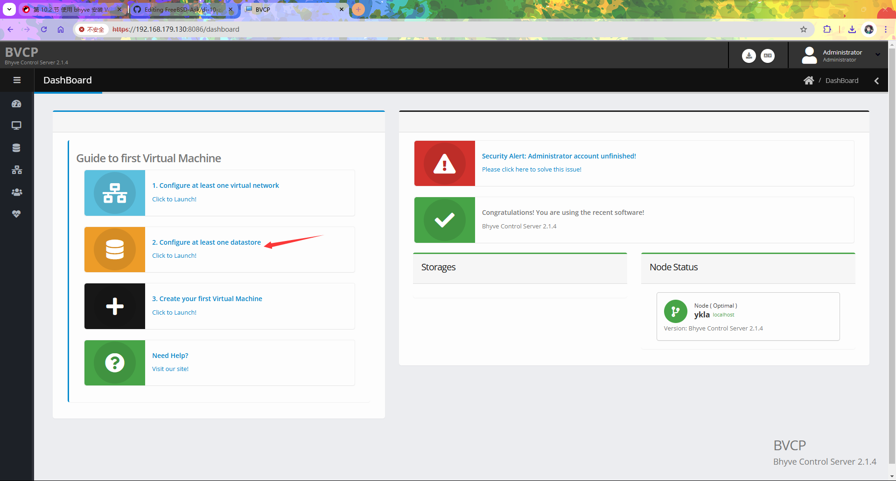

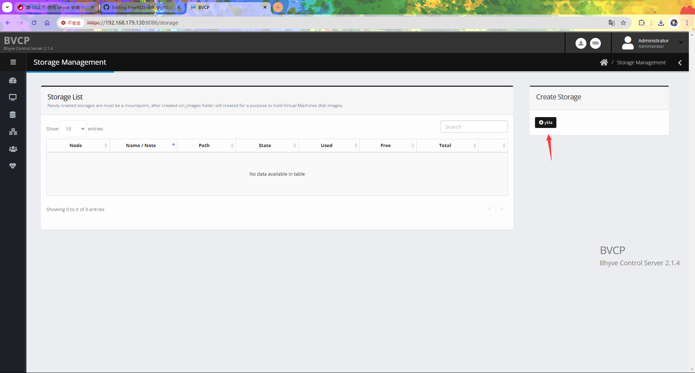

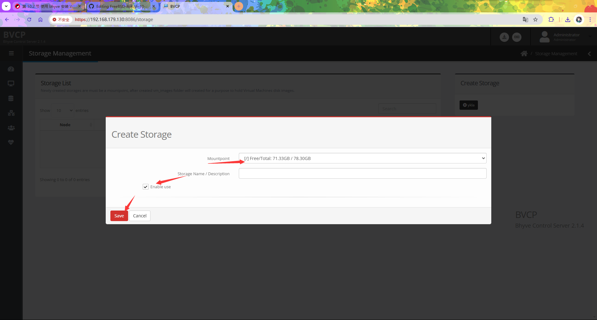


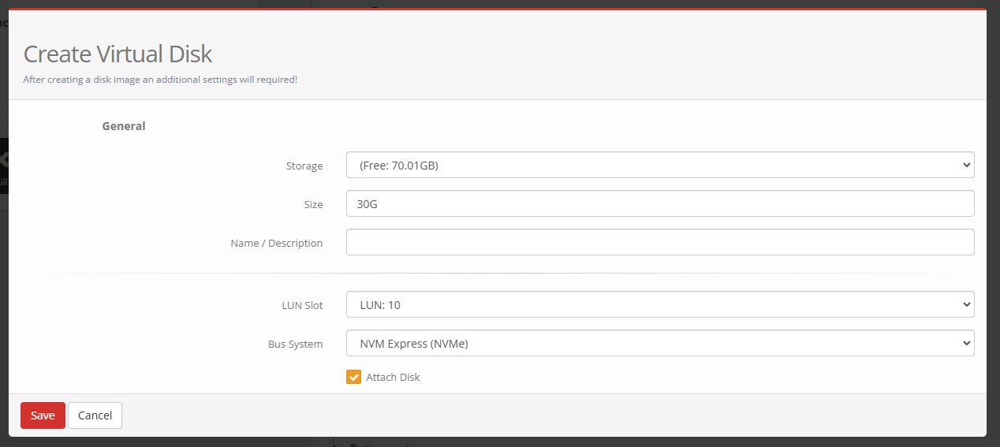

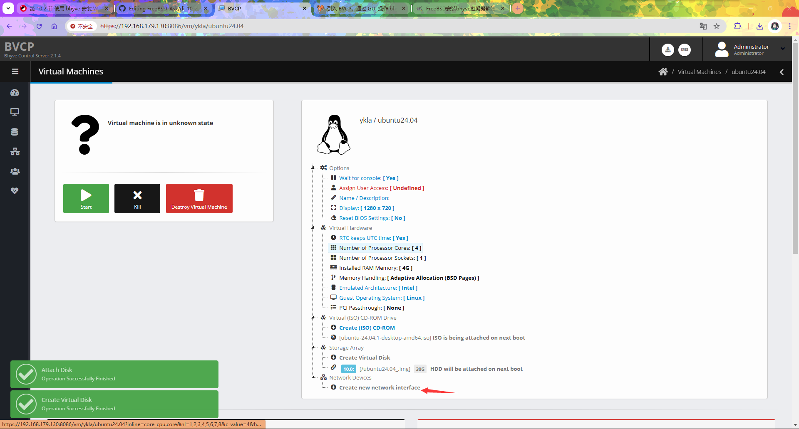

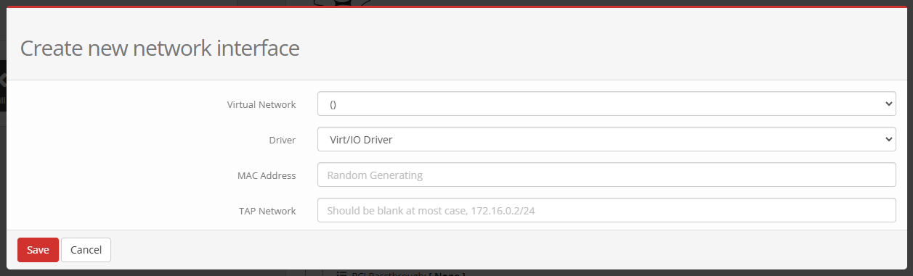

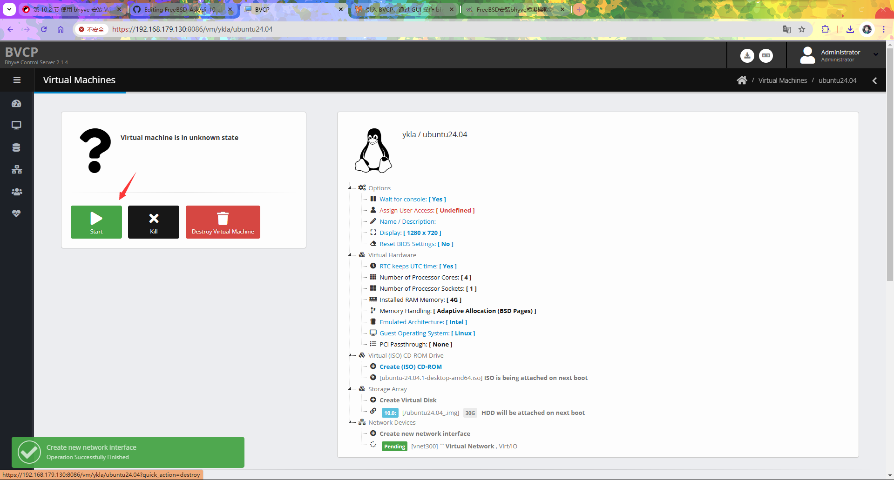


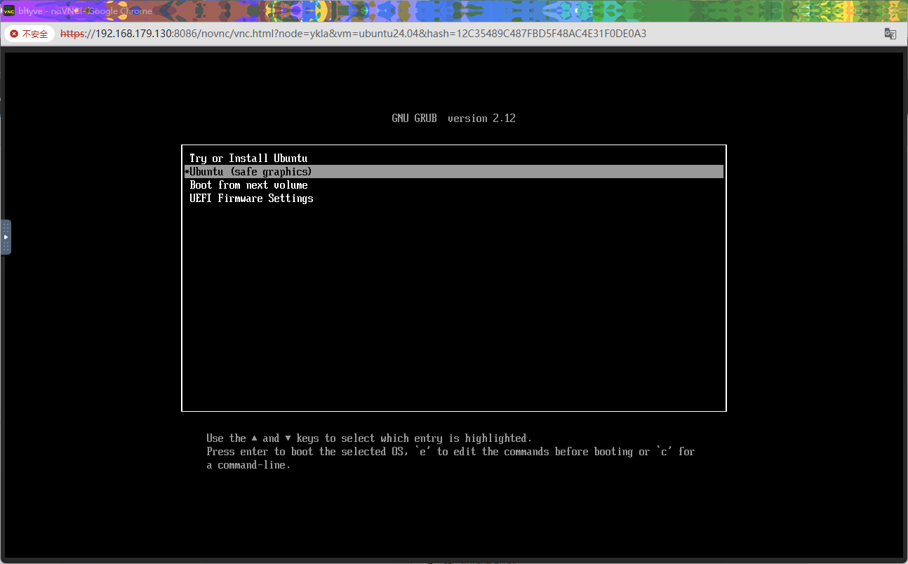

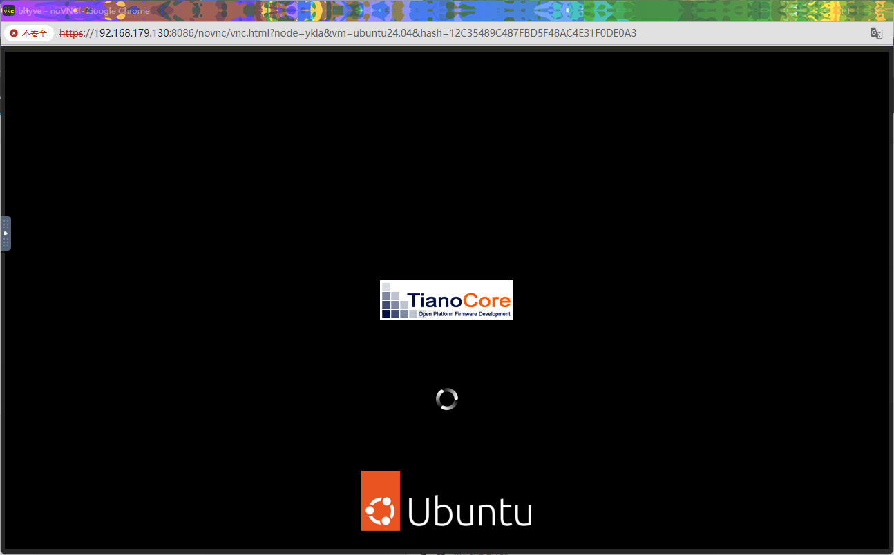

After installation is complete, press Enter to reboot the system.


After rebooting, enter the new system:

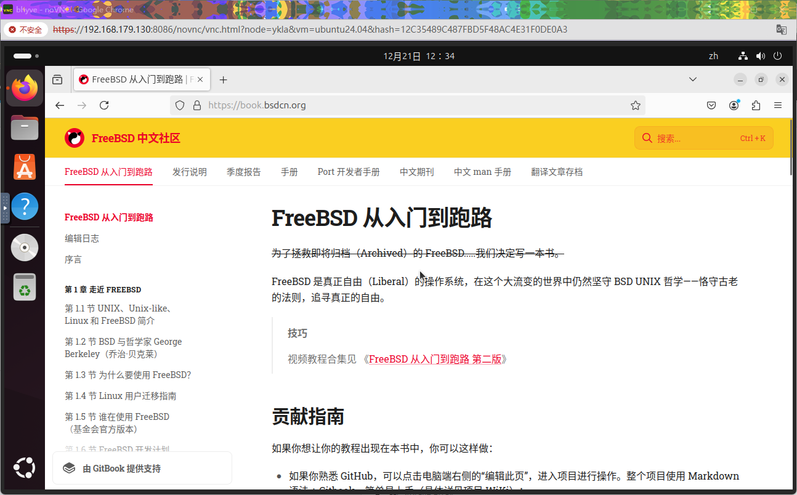

## Installing Windows 11 IoT Enterprise LTSC, version 24H2 (x64) - DVD (English)

The detailed steps are similar to the Ubuntu 24.04 installation instructions above; see the previous section "Installing Windows 11 Using bhyve and vm-bhyve" for details. Only the key differences are listed here.

When creating a new network interface in the `Create new network interface` step, pay special attention to the network card type selection:


Windows does not include drivers for other network card types by default, so please select the `Intel PRO e1000` network card type.

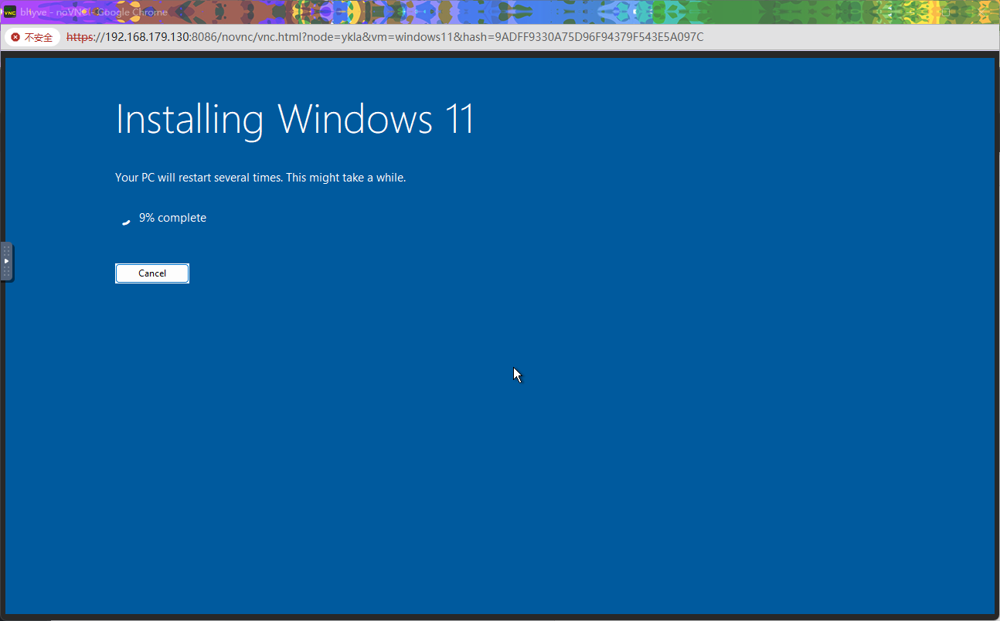

After completing the network card configuration, you can begin the installation.

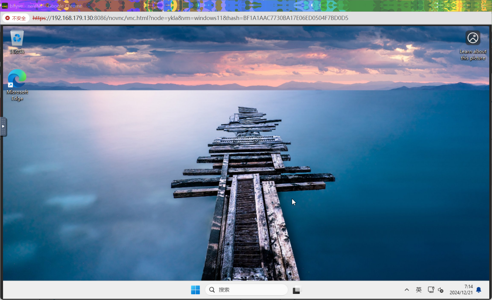

## Troubleshooting and Unresolved Issues

This section lists issues that may be encountered when using BVCP and their solutions.

### How to Uninstall BVCP

If you need to uninstall BVCP, refer to the official documentation (FreeBSD bhyve Project. Uninstallation of BVCP[EB/OL]. [2026-03-26]. <https://bhyve.npulse.net/uninstall>).

## References

- たかちゃん. bhyve を GUI で 操作 する BVCP の 導入。[EB/OL]. running-dog.net, (2024-02-05)[2026-03-25]. <https://running-dog.net/2024/02/post_2933.html>. Provides a practical guide for BVCP installation and configuration.
- FreeBSD bhyve Project. How to install BVCP[EB/OL]. [2026-03-25]. <https://bhyve.npulse.net/installation>. Official installation instructions detailing the BVCP deployment process.
- FreeBSD bhyve Project. TroubleShoot / Frequently Asked Questions (FAQ)[EB/OL]. [2026-03-25]. <https://bhyve.npulse.net/technical>. Common troubleshooting and FAQ, providing troubleshooting solutions.
- FreeBSD bhyve Project. Deploy Virtual Machine (Windows)[EB/OL]. [2026-03-25]. <https://bhyve.npulse.net/deploy_windows>. Official Windows installation instructions detailing Windows virtual machine deployment.
