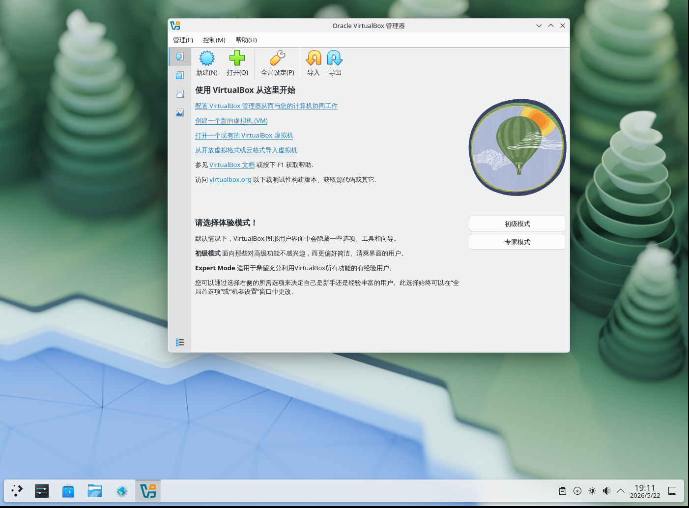

# 34.4 Installing VirtualBox on FreeBSD

VirtualBox is a cross-platform Type-2 hypervisor developed by Oracle Corporation, suitable for most operating systems including Windows, macOS, Linux, and FreeBSD. It can also run Windows or UNIX-like virtual machine systems.

Since version 7.0, VirtualBox has been released as open source under the GNU General Public License version 3 (GPLv3) (versions 4.0 to 6.1 were under GPLv2), supporting hardware-assisted virtualization (Intel VT-x and AMD-V) for x86 and AMD64 architectures. Hardware-assisted virtualization technology allows virtual machines to directly access certain hardware resources, significantly improving virtualization performance.

Since 4.0, VirtualBox has only had an open source edition (versions 4.0 to 6.1 called Open Source Edition; since 7.0, the base package is released directly under GPLv3), with remaining components provided separately as the closed-source Extension Pack (VirtualBox Extension Pack), which is **not yet supported** on FreeBSD. Since 7.0, EHCI and xHCI USB controller devices have been included in the open source base package, allowing USB 2.0/3.0 passthrough functionality without the Extension Pack; previously, this functionality was provided by the Extension Pack. The Extension Pack currently only provides additional features such as PXE network boot ROM and cloud integration (note: VRDP server, USB smart card emulation, and disk and virtual machine encryption have been moved into the base package since 7.2.6; USB camera has been moved into the base package since 7.2.2).

VirtualBox has multiple versions available on FreeBSD. Version 7.2 is the currently maintained version. All versions provide a `-nox11` variant (e.g., **emulators/virtualbox-ose-nox11-72**) for server environments without a graphical interface, operable only through the `VBoxManage` command-line tool.

## Installing VirtualBox

This section installs **emulators/virtualbox-ose-72**.

Precompiled kernel modules installed via pkg may not match the currently running kernel version and lack the enhancement tools required by virtual machines, whereas building and installing via Ports ensures that kernel modules fully match the current system kernel.

> **Note**
>
> Building VirtualBox requires kernel source code to be placed in the **/usr/src/** directory.

It is recommended to install using Ports:

```sh
# cd /usr/ports/emulators/virtualbox-ose-72/
# make config-recursive
# make install clean
```

You need to select the utility option `GuestAdditions` in the Ports configuration menu, which will generate the **/usr/local/lib/virtualbox/additions/VBoxGuestAdditions.iso** file.


`GuestAdditions` provides several useful features for the virtual machine operating system, such as mouse pointer integration (sharing the mouse between host and virtual machine without needing a hotkey to switch) and faster video rendering, which is especially noticeable in Windows virtual machines. After the virtual machine system installation is complete, you can select "Install Guest Additions..." from the settings menu.


You can view detailed installation instructions and configuration guidance with the following command:

```sh
# pkg info -D virtualbox-ose-72
```

## File Structure

```sh
/
├── boot/
│   └── loader.conf # Kernel module loading configuration
├── etc/
│   ├── rc.conf # System startup configuration
│   ├── devfs.rules # DevFS rules file
│   └── vbox/
│       └── networks.conf # Legacy VirtualBox network configuration location
├── tmp/
│   └── .vbox-*-ipc # VirtualBox IPC temporary files
└── usr/
    ├── local/
    │   └── etc/
    │       └── vbox/
    │           └── networks.conf # VirtualBox network configuration
    ├── ports/
    │   └── emulators/
    │       └── virtualbox-ose-72/ # VirtualBox Ports directory
    └── src/ # Kernel source code directory
```

## Configuring VirtualBox

Load the vboxdrv kernel module, which provides core virtualization functionality for VirtualBox. In addition to writing to **/boot/loader.conf**, you can also manually load it with `kldload vboxdrv` for immediate effect.

- **Load kernel module**: Add the following line to the **/boot/loader.conf** file to set the system to load the VirtualBox kernel module at boot

    ```ini
    vboxdrv_load="YES"
    ```

- **Enable bridged network support**: Allows virtual machines to directly connect to the physical network

    ```sh
    # service vboxnet enable
    ```

	By default, the permissions for **/dev/vboxnetctl** are restrictive:

	```sh
	ls -loa  /dev/vboxnetctl
	crw-------  1 root wheel - 0x75  May 22 19:07 /dev/vboxnetctl
	```

	You need to change the permissions to enable bridged networking. Add the following to **/etc/devfs.conf**:

	```ini
	own     vboxnetctl root:vboxusers
	perm    vboxnetctl 0660
	```

- **User group management**: The vboxusers user group is created when VirtualBox is installed. All users who use VirtualBox must be added to this group and the `operator` group (for USB support).

    You can use the pw command to add user `ykla` (replace with the actual user):

    ```sh
    # pw groupmod vboxusers -m ykla
	# pw groupmod operator -m ykla
    ```

	Verify the result:

	```sh
	# id ykla
	uid=1001(ykla) gid=1001(ykla) groups=1001(ykla),0(wheel),5(operator),44(video),920(vboxusers)
	```

After completing all the above configuration, click "Oracle VM VirtualBox" in the menu to start VirtualBox, as shown:



Try installing Kali Linux:


### VirtualBox USB Support and DVD/CD Support

VirtualBox supports passing USB devices through to the virtual machine operating system.

For regular users to use VirtualBox's DVD/CD functionality, they must have access to **/dev/xpt0**, **/dev/cdN**, and **/dev/passN**. Add the following to the **/etc/devfs.rules** file (create it if it does not exist):

```ini
[system=10]
add path 'usb/*' mode 0660 group operator
```

Also add access permissions for USB devices, setting the file mode to `0660` and the group to `operator`. Add the following to the **/etc/devfs.conf** file:

```ini
perm cd* 0660
perm xpt0 0660
perm pass* 0660
```

To use this ruleset, you need to configure DevFS. Edit the **/etc/rc.conf** file and add the following line:

```ini
devfs_system_ruleset="system"
```

Restart the DevFS service to apply the new ruleset:

```sh
# service devfs restart
```

Virtual machine system access to the host's DVD/CD drive is achieved through sharing the physical device. In VirtualBox, this can be configured through the Storage window in the virtual machine settings. If needed, first create an empty IDE CD/DVD device. Then select Host Drive from the virtual CD/DVD selection menu. A Passthrough checkbox will appear; checking this option allows the virtual machine to directly access the hardware. For example, audio CD or burning functionality is only available when this option is enabled.

Since VirtualBox 7.0, EHCI and xHCI USB controller devices have been included in the open source base package, allowing USB 2.0/3.0 passthrough to be configured without the Extension Pack.

## Troubleshooting and Unresolved Issues

This section provides issues that may be encountered when using VirtualBox and their solutions.

### Windows Installation Stalls

Please check the status of the `vboxnet` service.

## References

- Oracle Corporation. VirtualBox and open source[2026-04-17]. <https://www.virtualbox.org/wiki/Editions>. Version information.
- Oracle Corporation. GPL[EB/OL]. (2022-10-10)[2026-04-17]. <https://www.virtualbox.org/wiki/GPL>. From version 4.0 to version 6.1 (inclusive), the VirtualBox base package was distributed under GPLv2. (Certain parts of VirtualBox, especially libraries, may also be released under other licenses.)
- Oracle Corporation. GPLv3[EB/OL]. (2022-10-10)[2026-04-17]. <https://www.virtualbox.org/wiki/GPLv3>. Starting from version 7.0, the VirtualBox base package is licensed under the GPLv3 license. The Qt library changed its license, necessitating a license change to maintain compatibility.
- Oracle. VirtualBox Licensing FAQ[EB/OL]. [2026-04-17]. <https://www.virtualbox.org/wiki/Licensing_FAQ>. The VirtualBox base package is released under GPLv3, and the Extension Pack is licensed under [PUEL](https://www.virtualbox.org/wiki/VirtualBox_PUEL) (VirtualBox Extension Pack Personal Use and Evaluation License).
- Oracle. Oracle VM VirtualBox Extension Pack[EB/OL]. [2026-04-17]. <https://docs.oracle.com/en/virtualization/virtualbox/7.0/user/Introduction.html>. Additional features provided by the Extension Pack have been gradually moved into the base package: EHCI and xHCI USB controllers since 7.0; USB camera since 7.2.2; VRDP, USB smart card emulation, and disk and virtual machine encryption since 7.2.6.
- FreeBSD Wiki. VirtualBox[EB/OL]. [2026-04-17]. <https://wiki.freebsd.org/VirtualBox>. Known issues and troubleshooting for VirtualBox on FreeBSD.
- FreshPorts. virtualbox-ose-72[EB/OL]. [2026-04-17]. <https://www.freshports.org/emulators/virtualbox-ose-72/>. Current maintenance status of VirtualBox versions in FreeBSD Ports.
