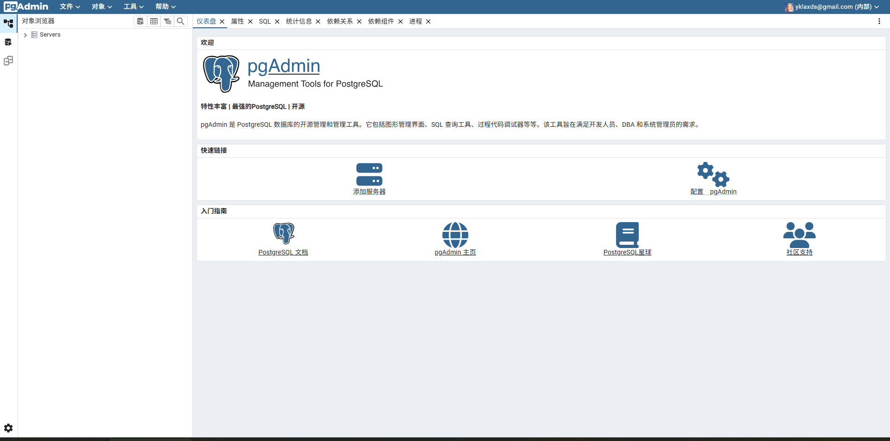
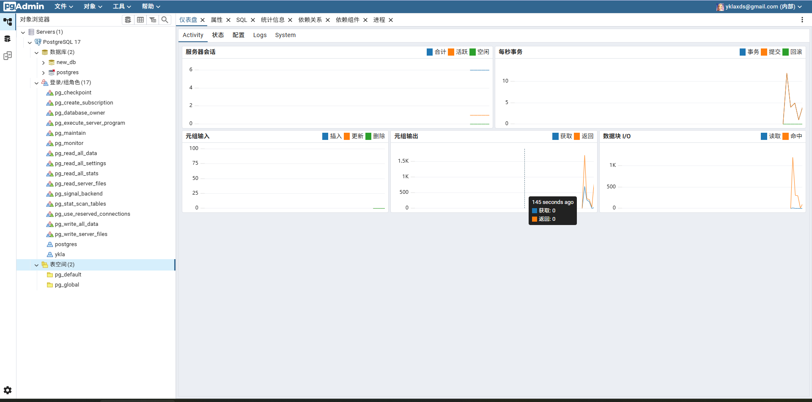

# 35.3 pgAdmin4

> **Warning**
>
> Please note the following upstream known issues: pgAdmin4 running on FreeBSD may be affected by [Bug 7836](https://github.com/pgadmin-org/pgadmin4/issues/7836) and [Bug 8869](https://github.com/pgadmin-org/pgadmin4/issues/8869).

This section is based on the FreeBSD 14.3-RELEASE operating system environment.

pgAdmin4 is an open-source software for managing PostgreSQL database servers, and is also the officially recommended graphical management tool for PostgreSQL. pgAdmin4 is written in Python (Flask framework) and React, supports multiple operating system environments (such as Windows, UNIX, Linux, etc.), and can run in both desktop mode and server mode.

> **Note**
>
> pgAdmin4 is installed via pip and uses SQLite to store its own configuration data; it can run without a locally installed PostgreSQL database. However, it needs to connect to a PostgreSQL database server to fully utilize its management capabilities.

pgAdmin4 requires a Python environment to run, and installation requires the Python `pip` package management tool, so Python must be installed first. This section uses the system's default Python version as an example. Note that FreeBSD systems may not have Python installed by default; you can verify this by launching the Python interpreter:

```sh
# python
python: Command not found   # Indicates that the Python environment is not currently installed
```

> **Tip**
>
> You can use the following command to check the installed Python 3 version:
>
> ```sh
> $ python3 -V
> Python 3.11.12
> ```

## Installing Python and pip

Install using pkg:

```sh
# pkg install python3 py311-pip
```

Or using Ports:

```sh
# cd /usr/ports/lang/python/ && make install clean
# cd /usr/ports/devel/py-pip/ && make install clean
```

Note: `pip` is the Python package manager, used to install and manage Python packages and their dependencies.

## Installing and Configuring virtualenv

`virtualenv` is used to create independent Python virtual environments.

This section uses `virtualenv` to create an independent Python environment for installing pgAdmin4.

The following command is used to install `virtualenv`:

Install using pkg:

```sh
# pkg install devel/py-virtualenv
```

Install using Ports:

```sh
# cd /usr/ports/devel/py-virtualenv/
# make install clean
```

Create a Python virtual environment named pgadmin4 (virtual environment) by running the following command:

```sh
# virtualenv pgadmin4
```

After creation is complete, the following information will be displayed:

```sh
# virtualenv pgadmin4
created virtual environment CPython3.11.12.final.0-64 in 607ms
  creator CPython3Posix(dest=/root/pgadmin4, clear=False, no_vcs_ignore=False, global=False)
  seeder FromAppData(download=False, pip=bundle, setuptools=bundle, via=copy, app_data_dir=/root/.local/share/virtualenv)
    added seed packages: pip==25.1.1, setuptools==80.3.1
  activators BashActivator,CShellActivator,FishActivator,NushellActivator,PowerShellActivator,PythonActivator
```

A virtual environment named `pgadmin4` has been generated in the root user's home directory (/root) (other file outputs omitted):

```sh
# ls
pgadmin4
```

## File Structure

The file structure of pgAdmin4 is as follows.

```sh
/
├── root/
│   ├── pgadmin4/              # pgAdmin4 virtual environment directory
│   │   ├── bin/
│   │   │   └── activate       # Virtual environment activation script
│   │   └── lib/
│   │       └── python3.11/
│   │           └── site-packages/
│   │               └── pgadmin4/
│   │                   ├── config.py        # pgAdmin4 configuration file
│   │                   └── config_local.py  # pgAdmin4 local configuration file
│   └── .config/
│       └── pip/
│           └── pip.conf       # pip configuration file
├── var/
│   ├── lib/
│   │   └── pgadmin/           # pgAdmin4 data storage directory
│   └── log/
│       └── pgadmin/           # pgAdmin4 log directory
└── usr/
    └── ports/
        ├── lang/
        │   └── python/        # Python Port
        ├── devel/
        │   ├── py-pip/        # pip Port
        │   └── py-virtualenv/ # virtualenv Port
        └── databases/
            └── py-sqlite3/    # py-sqlite3 Port
```

## Installing sqlite3

Install using pkg:

```sh
# pkg install py311-sqlite3
```

> **Tip**
>
> Note that the version must match Port **lang/python**.

Or install using Ports:

```sh
# cd /usr/ports/databases/py-sqlite3/
# make install clean
```

Activate the pgAdmin4 virtual environment (you need to add `.` (dot) and a space before the command):

```sh
# . pgadmin4/bin/activate
```

You can see that the shell prompt has changed to (pgadmin4) (all subsequent operations are performed in this shell):

```sh
(pgadmin4) #

```

## Installing pgAdmin4

The current `pip` source requires HTTPS; if the system lacks SSL certificates, you need to install the certificate package first.

```sh
(pgadmin4) root@ykla:~# pkg install ca_root_nss
```

If you encounter network issues, you can switch to a pip mirror source. Set it to the Tsinghua University mirror source:

```sh
(pgadmin4) root@ykla:~# pip config set global.index-url https://pypi.tuna.tsinghua.edu.cn/simple
Writing to /root/.config/pip/pip.conf
```

Install dependencies, including the OpenJPEG library and the Rust programming language environment:

```sh
(pgadmin4) root@ykla:~# pkg install openjpeg rust
```

Install the specified version of pgAdmin4 (version 9.4):

```sh
(pgadmin4) root@ykla:~# pip install pgadmin4==9.4
```

> **Note**
>
> If memory is insufficient (less than 4 GB) and there is no swap, it will show `killed`; if this problem occurs, please add swap space first.

### Troubleshooting

If the following error occurs:

```python
WARNING: Retrying (Retry(total=3, connect=None, read=None, redirect=None, status=None)) after connection broken by 'SSLError(SSLCertVerificationError(1, '[SSL: CERTIFICATE_VERIFY_FAILED] certificate verify failed: certificate is not yet valid (_ssl.c:1136)'))': /simple/pgadmin4/
```

The above error is caused by inaccurate system time; use `ntpd -q -g pool.ntp.org` to synchronize the system time to resolve it. For detailed instructions, refer to other relevant chapters in this book.

## Configuring and Running pgAdmin4

After installation is complete, pgAdmin4 needs to be configured before it can run properly.

After installation, create the pgAdmin4 local configuration file (note the Python version):

```sh
(pgadmin4) root@ykla:~# touch ./pgadmin4/lib/python3.11/site-packages/pgadmin4/config_local.py
```

> **Warning**
>
> Do not directly copy **./pgadmin4/lib/python3.11/site-packages/pgadmin4/config.py** to **./pgadmin4/lib/python3.11/site-packages/pgadmin4/config_local.py**, otherwise no configuration changes will take effect; please create an empty file directly.

Edit the configuration **./pgadmin4/lib/python3.11/site-packages/pgadmin4/config_local.py**. Example:

```ini
DEFAULT_SERVER = '0.0.0.0'        # Set pgAdmin4 to listen on all network interfaces
DEFAULT_SERVER_PORT = 5050        # Set the pgAdmin4 service port to 5050
```

- `DEFAULT_SERVER` changes the default server listening address to **0.0.0.0**.
- `DEFAULT_SERVER_PORT` can modify the port that the application listens on.

Manually create the pgAdmin4 data and log directories:

```sh
(pgadmin4) root@ykla:~# mkdir -p /var/lib/pgadmin   # Create the pgAdmin data storage directory and its parent directories
(pgadmin4) root@ykla:~# mkdir -p /var/log/pgadmin   # Create the pgAdmin log directory
```

After editing the configuration file, execute the following command to initialize the login account and password.

Start the pgAdmin4 application:

```sh
(pgadmin4) root@ykla:~# pgadmin4
```

Example output:

```sh
NOTE: Configuring authentication for SERVER mode.
Enter the email address and password to use for the initial pgAdmin user account:
Email address: your_email		# Enter the email address
Password: your_new_password		# Enter the login password, minimum 6 characters; the password will not be printed, nor will it show ***
Retype password:				# Enter the password again
pgAdmin 4 - Application Initialisation
======================================

Starting pgAdmin 4. Please navigate to http://0.0.0.0:5050 in your browser.
 * Serving Flask app 'pgadmin'
 * Debug mode: off
```

At this point, pgAdmin4 has been installed and is running; you can access the web control panel via `http://ip:5050`:


The area indicated by the arrow allows you to switch languages.





## Keeping pgAdmin4 Running in the Background

After the service is stopped, if you need to run it again, use the pgadmin4 installation user (in this case `root`) to enter their home directory and execute the following commands to activate the pgadmin4 virtual environment and start the service (`&` indicates running in the background):

```sh
root@ykla:~# . pgadmin4/bin/activate
(pgadmin4) root@ykla:~# pgadmin4 &
```

## Upgrading pgAdmin4

If you need to upgrade pgAdmin4, follow the steps below.

In this test, directly using `pip` to upgrade pgAdmin4 may still display old version information.

pgAdmin4 is updated frequently; if you need to upgrade, you must first delete the original pgadmin4 directory created with virtualenv, then use the installation user to execute the following command again to create the Python virtual environment pgadmin4:

```sh
root@ykla:~# virtualenv pgadmin4
```

After the virtual directory is created, activate the pgadmin4 virtual environment:

```sh
root@ykla:~# . pgadmin4/bin/activate
```

After activation, do not start the service; directly upgrade pgAdmin4 to the latest version:

```sh
(pgadmin4) root@ykla:~# pip install --upgrade pgadmin4
```

After the upgrade is complete, start the pgAdmin4 application:

```sh
(pgadmin4) root@ykla:~# pgadmin4
```

The login account and password remain unchanged (after logging in, there will be no update prompt; the version is already the latest).

## References

- FreeBSD Project. PostgreSQL/Setup - FreeBSD Wiki[EB/OL]. (2024-06-09)[2026-03-25]. <https://wiki.freebsd.org/PostgreSQL/Setup>. Systematically introduces the installation and configuration methods for PostgreSQL on FreeBSD, providing official guidance reference for this section.
- pgAdmin Development Team. pgAdmin 4 GitHub Repository[EB/OL]. [2026-04-17]. <https://github.com/pgadmin-org/pgadmin4>. The official pgAdmin 4 repository, documenting its technology stack as a Python (Flask) backend with a React frontend.
