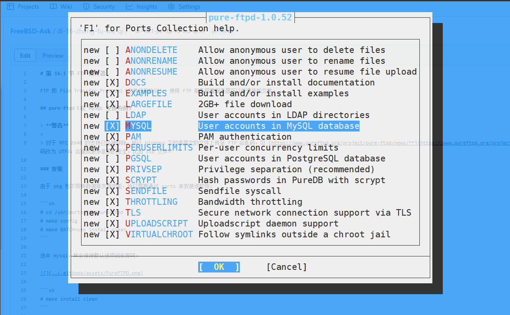

# 36.2 Pure-FTPd (with MySQL)

## Pure-FTPd Does Not Support Chinese Environments

Pure-FTPd has removed support for the FTP protocol internationalization framework defined in RFC 2640. When using FTP command-line tools in Windows to access files with non-English characters, garbled text may appear. For specific changes, refer to the Pure-FTPd 1.0.48 release announcement.

An example of attempting to enable UTF-8 encoding:

```powershell
ftp> quote opts utf8 on
504 Unknown command
```

Using command-line tools or clients such as WinSCP on FreeBSD to test Pure-FTPd will not produce garbled text.

## Installing Pure-FTPd

Pure-FTPd installed via pkg does not include database support; it must be installed via Ports to enable MySQL integration.

```sh
# cd /usr/ports/ftp/pure-ftpd
# make config
```

During configuration, check `MYSQL`, keep the remaining options at their default values, and confirm.



```sh
# make install clean
```

## Configuration Files

Configuration files must first be copied from the sample files, then edited according to actual needs. The configuration file path is: **/usr/local/etc/pure-ftpd.conf**.

### Generating Configuration Files

Copy the sample configuration files to the actual configuration files:

```sh
# cp /usr/local/etc/pure-ftpd.conf.sample /usr/local/etc/pure-ftpd.conf          # Copy the Pure-FTPd sample configuration file as the default configuration
# cp /usr/local/etc/pureftpd-mysql.conf.sample /usr/local/etc/pureftpd-mysql.conf   # Copy the Pure-FTPd MySQL sample configuration file as the default configuration
```

The configuration file structure is as follows:

```sh
/usr/local/etc/
├── pure-ftpd.conf.sample      # Pure-FTPd sample configuration file
├── pure-ftpd.conf             # Pure-FTPd main configuration file
├── pureftpd-mysql.conf.sample # Pure-FTPd MySQL sample configuration file
└── pureftpd-mysql.conf        # Pure-FTPd MySQL configuration file
```

### MySQL Integration Configuration

Edit the **/usr/local/etc/pure-ftpd.conf** file and adjust the relevant configuration items to enable MySQL authentication:

```ini
# Compatible with non-standard FTP clients such as IE

BrokenClientsCompatibility yes

# Port range for passive connection responses.

PassivePortRange 30000 50000

# Minimum UID allowed for authenticated users to log in.
# For example, a value of 100 would prevent all users with a UID less than 100 from logging in.
# Use 0 if you want root to be able to log in.

MinUID 2000

# Only allow authenticated users to perform FXP transfers.

AllowUserFXP yes

# If this item is not commented out, you will not find ftp user prompt messages in the logs

# AntiWarez                    yes

# Automatically create user home directory if it does not exist

CreateHomeDir yes

# MySQL configuration file (see README.MySQL)

MySQLConfigFile /usr/local/etc/pureftpd-mysql.conf
```

## Configuring MySQL

This section uses MySQL 8.x as an example.

Please refer to other relevant chapters to complete the installation and configuration of MySQL 8.x.

### Creating the Database

Create the database and user table for Pure-FTPd:

```sql
CREATE DATABASE pureftpd;   -- Create database pureftpd
USE pureftpd;                -- Select the pureftpd database for use

DROP TABLE IF EXISTS `users`;  -- Drop the users table if it exists
CREATE TABLE `users` (
   `User` varchar(255) CHARACTER SET utf8mb4 COLLATE utf8mb4_bin NOT NULL,  -- Username, primary key
   `Password` varchar(255) CHARACTER SET utf8mb4 COLLATE utf8mb4_bin NOT NULL,  -- Password
   `Uid` int(11) NOT NULL DEFAULT -1 COMMENT 'User ID',  -- User ID
   `Gid` int(11) NOT NULL DEFAULT -1 COMMENT 'User group ID',  -- User group ID
   `Dir` varchar(255) CHARACTER SET utf8mb4 COLLATE utf8mb4_bin NOT NULL,  -- User directory
   `QuotaFiles` int(11) NULL DEFAULT 500,  -- File count quota
   `QuotaSize` int(11) NULL DEFAULT 30,  -- Storage space quota
   `ULBandwidth` int(11) NULL DEFAULT 80,  -- Upload bandwidth limit
   `DLBandwidth` int(11) NULL DEFAULT 80,  -- Download bandwidth limit
   `ipaddress` varchar(255) CHARACTER SET utf8mb4 COLLATE utf8mb4_general_ci NULL DEFAULT '*',  -- Restricted IP address
   `comment` varchar(255) NULL DEFAULT NULL,  -- Comment
   `status` tinyint(4) NULL DEFAULT 1,  -- User status
   `ulratio` int(11) NULL DEFAULT 1,  -- Upload ratio
   `dlratio` int(11) NULL DEFAULT 1,  -- Download ratio
   PRIMARY KEY (`User`) USING BTREE  -- Set primary key to User
) ENGINE=InnoDB DEFAULT CHARSET=utf8mb4 COLLATE=utf8mb4_general_ci ROW_FORMAT=Dynamic;  -- Table engine and character set configuration
```

### Creating a Database Login User and Setting a Password

Create a dedicated Pure-FTPd user for connecting to the database:

```sql
-- Please replace 'your_secure_password' with a strong password
CREATE USER 'pftp'@'localhost' IDENTIFIED BY 'your_secure_password';   -- Create MySQL user pftp, allowed to connect from localhost
GRANT SELECT, INSERT, UPDATE, DELETE ON pureftpd.* TO 'pftp'@'localhost';   -- Grant pftp user CRUD permissions on the pureftpd database
FLUSH PRIVILEGES;   -- Flush privileges to make the configuration take effect immediately
```

Test the database connection:

```sh
# mysql -u pftp -p -h localhost pureftpd
```

### Configuration File

Complete example of the **/usr/local/etc/pureftpd-mysql.conf** file:

```ini
##############################################
#                                            #
# Sample Pure-FTPd MySQL configuration file. #
# See README.MySQL for details.              #
#                                            #
##############################################

# MYSQLServer database server address
MYSQLServer     127.0.0.1

# MYSQLServer database server port
MYSQLPort       3306

# Optional: path to mysql.sock if the database server runs on the local machine.
MYSQLSocket     /tmp/mysql.sock

# Database username
MYSQLUser       pftp

# Database password
MYSQLPassword   <your_database_password>

# Database name
MYSQLDatabase   pureftpd

# Password encryption method (plaintext here)
# Valid values include: "cleartext", "argon2", "scrypt", "crypt", and "any"
MYSQLCrypt      cleartext

# In the following settings, string portions are replaced at runtime:
#
# \L is replaced by the username attempting to authenticate.
# \I is replaced by the IP address the user is connecting to.
# \P is replaced by the port number the user is connecting to.
# \R is replaced by the IP address the user is connecting from.
# \D is replaced by the remote IP address in long integer form.
#
# Using these replacement strings enables very complex queries, particularly useful for virtual hosting setups.

# SQL query statement to retrieve the password
MYSQLGetPW      SELECT Password FROM users WHERE User='\L'

# SQL query statement to retrieve the system username or UID
MYSQLGetUID     SELECT Uid FROM users WHERE User='\L'

# Default UID - when set, it overrides the MYSQLGetUID query result
MYSQLDefaultUID 2000

# SQL query statement to retrieve the system group name or GID
MYSQLGetGID     SELECT Gid FROM users WHERE User='\L'

# Default GID - when set, it overrides the MYSQLGetGID query result
MYSQLDefaultGID 2000

# SQL query statement to retrieve the user home directory
MYSQLGetDir     SELECT Dir FROM users WHERE User='\L'

# Optional: query to retrieve the maximum number of files (virtual quota support must be enabled)
MySQLGetQTAFS  SELECT QuotaFiles FROM users WHERE User='\L'

# Optional: query to retrieve the maximum disk usage (in MB, requires virtual quota support)
MySQLGetQTASZ  SELECT QuotaSize FROM users WHERE User='\L'

# Optional: upload/download ratio, the server must support ratio functionality
MySQLGetRatioUL SELECT ULRatio FROM users WHERE User='\L'
MySQLGetRatioDL SELECT DLRatio FROM users WHERE User='\L'

# Optional: bandwidth limit in KB/s, the server must support bandwidth limiting functionality
MySQLGetBandwidthUL SELECT ULBandwidth FROM users WHERE User='\L'
MySQLGetBandwidthDL SELECT DLBandwidth FROM users WHERE User='\L'

# Enable ~ path expansion. Do not enable this blindly unless the following conditions are met:
# 1) You clearly understand what it does.
# 2) Actual users and virtual users are the same.
# MySQLForceTildeExpansion 1

# If using a transactional storage engine, you can enable SQL transactions to avoid race conditions.
# If using the traditional MyISAM engine, keep this commented out.
# MySQLTransactions On
```

### Adding FTP Groups and Users

> **Warning**
>
> After using the database, the `pure-pw` command will no longer take effect.

Create system users and groups for virtual FTP users to inherit permissions:

```sh
# pw groupadd ftpgroup -g 2000   # Create user group ftpgroup with GID 2000
# pw useradd ftpuser -u 2001 -g 2000 -s /sbin/nologin -w no -d /home/pureftp -c "VirtualUser Pure-FTPd" -m   # Create virtual FTP user ftpuser, UID 2001, home directory /home/pureftp, no system login allowed, auto-create home directory
```

When adding FTP login users, you must manually write their information into the MySQL database. The following example creates the user `test` with the password `test2`:

```sql
USE pureftpd;   -- Select the pureftpd database
INSERT INTO `users` (`User`, `Password`, `Uid`, `Gid`, `Dir`, `quotafiles`, `quotasize`, `ulbandwidth`, `dlbandwidth`, `ipaddress`, `comment`, `status`, `ulratio`, `dlratio`)
VALUES ('test', 'test2', 2001, 2000, '/home/pureftp/www', 500, 30, 80, 80, '*', NULL, 1, 1, 1);   -- Insert a test user record into the users table
```

> **Note**
>
> The `Uid` and `Gid` written into the table must be consistent with the user previously created via `pw useradd`.

> **Tip**
>
> The design concept is: virtual users in the database inherit the permissions and UID/GID of the user created by `pw useradd`, and perform FTP file operations using the user information in the database.

Actual operation example:

```sql
root@localhost [(none)]> show databases;	-- Display the list of all databases on the current MySQL server
+--------------------+
| Database           |
+--------------------+
| information_schema |
| mysql              |
| performance_schema |
| pureftpd           |
| sys                |
+--------------------+
5 rows in set (0.00 sec)
root@localhost [pureftpd]> USE pureftpd;   -- Select the pureftpd database as the current operating database
Database changed
root@localhost [pureftpd]> INSERT INTO `users` (`User`, `Password`, `Uid`, `Gid`, `Dir`, `quotafiles`, `quotasize`, `ulbandwidth`, `dlbandwidth`, `ipaddress`, `comment`, `status`, `ulratio`, `dlratio`)
    -> VALUES ('test', 'test2', 2001, 2000, '/home/pureftp/www', 500, 30, 80, 80, '*', NULL, 1,1, 1);
Query OK, 1 row affected (0.01 sec)
root@localhost [pureftpd]> select * from users;   -- Query all records in the users table
+------+----------+------+------+-------------------+------------+-----------+-------------+-------------+-----------+---------+--------+---------+---------+
| User | Password | Uid  | Gid  | Dir               | quotafiles | quotasize | ulbandwidth | dlbandwidth | ipaddress | comment | status | ulratio | dlratio |
+------+----------+------+------+-------------------+------------+-----------+-------------+-------------+-----------+---------+--------+---------+---------+
| test | test2    | 2001 | 2000 | /home/pureftp/www |        500 |        30 |          80 |    80 | *         |    NULL |      1 |       1 |       1 |
+------+----------+------+------+-------------------+------------+-----------+-------------+-------------+-----------+---------+--------+---------+---------+
1 row in set (0.01 sec)
```

Configure the FTP directory:

```sh
# mkdir -p /home/pureftp/www                   # Create the FTP user's home directory and subdirectories
# chown -R ftpuser:ftpgroup /home/pureftp     # Set directory owner to ftpuser and group to ftpgroup
# chmod -R 775 /home/pureftp                  # Set directory permissions to 775, allowing group users to read and write
```

Structure overview:

```sh
/home/
└── pureftp/
    └── www/ # FTP user's home directory
```

### References

- osc_e0e3b1a8. Linux 环境下 FTP 权限设置详解与操作步骤全攻略[EB/OL]. [2026-03-25]. <https://my.oschina.net/emacs_8748786/blog/17171107>. Detailed explanation of FTP service user permission configuration and directory access control methods.

## Service Operations

After configuration is complete, start and manage the Pure-FTPd service:

```sh
# service pure-ftpd enable    # Set Pure-FTPd service to start on boot
# service pure-ftpd start     # Start the Pure-FTPd service
# service pure-ftpd stop      # Stop the Pure-FTPd service
# service pure-ftpd restart   # Restart the Pure-FTPd service
```

## References

- Curtin B. RFC 2640: Internationalization of the File Transfer Protocol[EB/OL]. (1999-07)[2026-03-26]. <https://www.rfc-editor.org/rfc/rfc2640>. This RFC defines the internationalization framework for the FTP protocol.
- Pure-FTPd. Version 1.0.48 released[EB/OL]. [2026-03-26]. <https://www.pureftpd.org/project/pure-ftpd/news>. Pure-FTPd 1.0.48 release announcement.
- Denis F. COPYING for Pure-FTPd[EB/OL]. (2001–2026)[2026-04-18]. <https://github.com/jedisct1/pure-ftpd/blob/master/COPYING>. Pure-FTPd license is the ISC license, functionally equivalent to the 2-clause BSD license.
- falko. Virtual Hosting With PureFTPd And MySQL (Incl. Quota And Bandwidth Management)[EB/OL]. (2007-11-07)[2026-03-25]. <https://archive.org/download/pdfbackup_18_aout-2014/Virtual_Hosting_With_PureFTPd_And_MySQL__Incl._Quota_And_Ban.pdf>. PureFTPd configuration tutorial.

## Troubleshooting

- Pure-FTPd log files are located at **/var/log/messages**.
