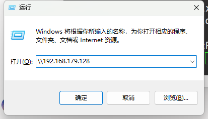
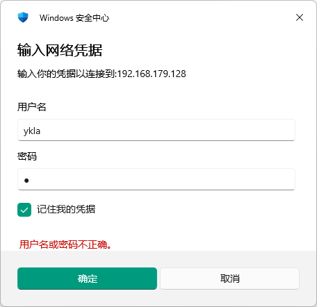
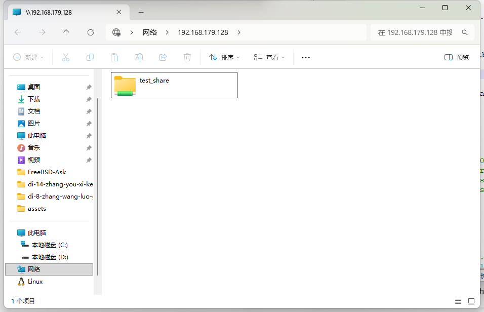
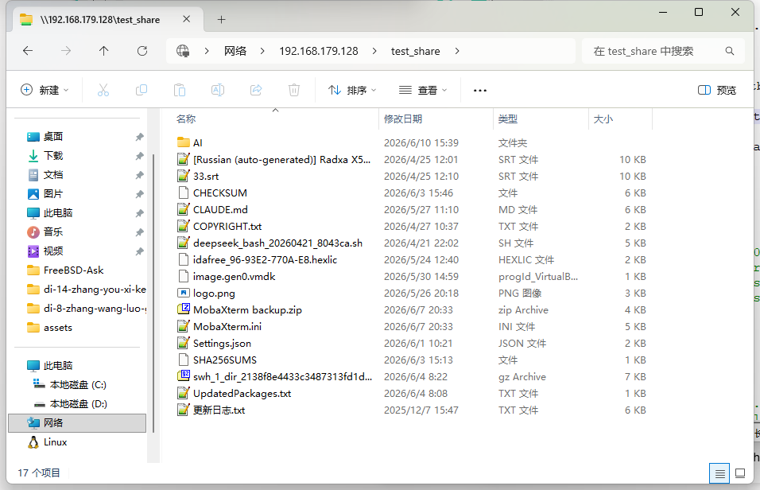

# 37.2 Samba File Sharing

## Samba Overview

Samba is a free software reimplementation of the Server Message Block (SMB) and Common Internet File System (CIFS) protocols. Its core objective is to achieve interoperability between UNIX systems and Windows network environments.

In terms of architecture, smbd (file and print service daemon) and nmbd (NetBIOS name service daemon) work together: smbd handles file sharing and print service requests, while nmbd provides NetBIOS name resolution and network browsing services.

Samba requires the following ports to be allowed through the firewall:

| Protocol | Port | Service | Requirement |
| -------- | ---- | ------- | ----------- |
| TCP | 139 | NetBIOS Session Service | Required only when using the SMBv1 (NT1) protocol |
| UDP | 137 | NetBIOS Name Service | Required only when using the SMBv1 (NT1) protocol |
| UDP | 138 | NetBIOS Datagram Service | Required only when using the SMBv1 (NT1) protocol |
| TCP | 445 | SMB over TCP | Always required |

If `min protocol = SMB2` or higher is configured, only TCP 445 needs to be opened.

Samba author Andrew Tridgell had to rename the project in its early days because the original name "smbserver" was claimed as a trademark by Syntax (whose commercial product TotalNet Advanced Server held the trademark for that name). The new name was found by searching the system dictionary for words containing the letters s, m, b in sequence using the Unix command `grep -i '^s.*m.*b' /usr/share/dict/words`, and thus "Samba" was born. It should be noted that "samba" also means "samba dance" in Portuguese and English, which is a coincidental resemblance.

## Installing Samba

There are two main ways to install Samba:

- Install using pkg:

```sh
# pkg install samba423
```

- Or install using Ports:

```sh
# cd /usr/ports/net/samba423/
# make install clean
```

- View installation information:

```sh
# pkg info -D samba423
```

## Related Project Structure

```sh
/
├── usr
│   └── local
│       ├── etc
│       │   └── smb4.conf                # Samba main configuration file
│       └── bin
│           └── samba-tool               # Samba comprehensive management tool
├── var
│   ├── db
│   │   └── samba4                       # Samba related database directory
│   └── log
│       └── samba4                       # Samba log directory
├── etc
│   ├── rc.conf                           # System startup configuration file
│   ├── resolv.conf                       # DNS resolution configuration file
│   ├── sysctl.conf                        # System parameter configuration file
│   └── nsswitch.conf                      # Name service switch configuration file
└── samba
    └── testshare                         # Samba shared directory
```

## Basic Configuration

### Editing the Samba Configuration File

Create the Samba configuration file **/usr/local/etc/smb4.conf**, write the following content and save:

```ini
[global]
    min protocol = SMB2

[test_share]
    comment = root's stuff
    path = /home/ykla/test
    valid users = ykla
    public = no
    browseable = yes
    writable = yes
    printable = no
    create mask = 0644
```

Configuration item descriptions:

| Configuration Item | Description |
| ------------------ | ----------- |
| `[global]` | Global configuration section, applies to all shares |
| `min protocol = SMB2` | Restricts the minimum supported protocol to SMB2, allowing newer versions of Windows to access |
| `[test_share]` | Defines the share name |
| `comment = root's stuff` | Description of the share; this text is displayed when browsing shares in Windows Explorer |
| `path = /root` | The actual path of the share is **/root**; sharing this directory is **not recommended** in production environments |
| `valid users = ykla` | Only allows user ykla to access the Samba server |
| `public = no` | Does not allow anonymous access (equivalent to `guest ok = no`) |
| `browseable = yes` | The share can be browsed in Network Neighborhood |
| `writable = yes` | Allows clients to write to this directory |
| `printable = no` | This share is not a printer share |
| `create mask = 0644` | Default permissions for newly created files are 0644, preventing files from being accidentally given execute permission |

### Directory Permission Adjustment

Prepare the directory and adjust directory permissions:

```sh
$ mkdir -p /home/ykla/test
# chown -R ykla:ykla /home/ykla/test
```

At this point, the permissions of the directory **/home/ykla/test** should be as follows:

```sh
drwxr-xr-x  2 ykla ykla  uarch    2 Jun 10 15:37 test
```

Place some files in the directory **/home/ykla/test** for testing.

### User Management

For security reasons, avoid creating a Samba root user.

Samba only recognizes accounts that have been added to its internal database, so FreeBSD user accounts must be mapped to the Samba account database before Windows clients can access shares. pdbedit(8) supports user databases based on multiple backends such as smbpasswd, ldap, nis+, and tdb. You can use pdbedit(8) to map the existing FreeBSD user account `ykla` to Samba:

```sh
# pdbedit -a -u ykla
new password: # Set the password for Samba user ykla here
retype new password: # Re-enter the password
Unix username:        ykla
NT username:
Account Flags:        [U          ]
User SID:             S-1-5-21-3200006731-1126116281-3495519786-1000
Primary Group SID:    S-1-5-21-3200006731-1126116281-3495519786-513
Full Name:            User &
Home Directory:       \\YKLA\ykla

……partial output omitted……
```

The password set here can be different from the FreeBSD user account password; it is only used to authenticate with the Samba server.

### Starting the Samba Service

- Set the Samba service to start at boot:

```sh
# service samba_server enable
```

- Start the Samba service

```sh
# service samba_server start
```

- View the running status of the Samba service:

```sh
# service samba_server status
nmbd is running as pid 5250.
smbd is running as pid 5255.
```

Samba includes three daemons: nmbd, smbd, and winbindd. Among them, nmbd and smbd are managed by `samba_server_enable`, while winbindd must be enabled separately via `winbindd_enable` (not required in this example).

## Using the Samba Share Service

- To access the shared folder on a Windows system: press **Windows logo key + R** simultaneously to open the "Run" dialog, and enter the following UNC path (replace the example IP address with the actual value):

```powershell
\\192.168.179.128
```



Enter the Samba username `ykla` and its password in the credential prompt:



After successful connection, you can see the shared item name "test_share".



Click on the shared item "test_share" to browse the files:



Both read and write operations work normally.

## Domain Member Configuration

### System Parameter Optimization

```sh
# echo "kern.maxfiles=25600" >> /etc/sysctl.conf        # Set the system maximum number of open files
# echo "kern.maxfilesperproc=16384" >> /etc/sysctl.conf # Set the maximum number of open files per process
# echo "net.inet.tcp.sendspace=65536" >> /etc/sysctl.conf  # Set the TCP send buffer size
# echo "net.inet.tcp.recvspace=65536" >> /etc/sysctl.conf  # Set the TCP receive buffer size
```

### Kerberos Authentication

```ini
[libdefaults]
    default_realm = SVROS.COM        # Set the Kerberos default realm
    dns_lookup_realm = false         # Disable DNS realm lookup
    dns_lookup_kdc = true            # Enable DNS KDC lookup
    ticket_lifetime = 24h            # Set ticket lifetime to 24 hours
    renew_lifetime = 7d              # Set ticket renewal period to 7 days
    forwardable = yes                # Allow forwardable tickets
```

### Configuring Name Services

Configure NSS so that the system resolves user records through local files and Winbind in order:

```sh
# sed -i '' -e "s/^passwd:.*/passwd: files winbind/" /etc/nsswitch.conf
```

Configure NSS so that the system resolves group records through local files and Winbind in order:

```sh
# sed -i '' -e "s/^group:.*/group: files winbind/" /etc/nsswitch.conf
```

### Samba Main Configuration File

```ini
[global]
	workgroup = SVROS
	server string = Samba Server Version %v
	security = ads
	realm = SVROS.COM
	domain master = no
	local master = no
	preferred master = no
	use sendfile = true

	idmap config * : backend = tdb
	idmap config * : range = 100000-299999
	idmap config SVROS : backend = rid
	idmap config SVROS : range = 10000-99999
	winbind separator = +
	winbind enum users = yes
	winbind enum groups = yes
	winbind use default domain = yes
	winbind nested groups = yes
	winbind refresh tickets = yes
	template homedir = /home/%D/%U
	template shell = /bin/false

	client use spnego = yes
	restrict anonymous = 2
	log file = /var/log/samba4/log.%m
	max log size = 50

#============================ Custom Share Information ==============================

[testshare]
	comment = Test share
	path = /samba/testshare
	read only = no
	force group = "Domain Users"
	directory mode = 0770
	force directory mode = 0770
	create mode = 0660
	force create mode = 0660
```

The `create mode` and `force create mode` items in the `testshare` share section above are used to adjust the permissions of newly created files during actual operation and are optional configurations:

```ini
create mode = 0750
force create mode = 0750
```

## Domain Management

### Service Auto-Start Configuration

Set the Winbind service to start automatically at boot:

```sh
# service winbindd enable
```

Join the host to the Active Directory domain without updating DNS:

```sh
net ads join --no-dns-updates -U administrator   #
net ads testjoin                                 # Test whether the host has successfully joined the domain
# Should output "Join is OK"
# Follow-up: Open the DNS Management Console (MMC) on the domain controller and add an A record for this BSD server so that clients can resolve it
```

### Kerberos Authentication Verification

```sh
kinit administrator   # Obtain a Kerberos ticket using the administrator account; after entering the password, it should return to the prompt normally
klist                  # View the current Kerberos ticket cache
# Example output:
Credentials cache: FILE:/tmp/krb5cc_0
    Principal: administrator@SVROS.COM

Issued                Expires               Principal
Dec  6 10:15:39 2021  Dec  7 10:15:39 2021  krbtgt
```

### Winbind Service Verification

```sh
wbinfo -u
# Should return the domain user list

wbinfo -g
# Should return the domain user group list

getent passwd
# The end of the user list should include domain users with UIDs greater than 10000

getent group
# The end of the user group list should include domain user groups with GIDs greater than 10000
```

If the `wbinfo` command returns an error, you can restart the Samba service and verify again:

```sh
# service samba_server restart
```

### Shared Directory Configuration

```sh
# mkdir -p /samba/testshare                                # Create shared directory
# chown "administrator:domain users" /samba/testshare   # Set directory owner to administrator, group to domain users
# chmod 0770 /samba/testshare                              # Set directory permissions to 0770 (owner and group can read, write, and execute; others have no permissions)
```

If you only want the owner to read and write, and the group to only read, you can execute:

```sh
# chmod 0750 /samba/testshare	# Set directory permissions to 0750 (owner can read, write, and execute; group can read and execute; others have no permissions)
```

If you only want the owner to read and write, and both the group and others to have no access, you can execute:

```sh
# chmod -R 0700 /samba/testshare	# Recursively set directory and its contents permissions to 0700 (only owner can read, write, and execute)
```

## Troubleshooting

Samba log files are located by default in the **/var/log/samba4** directory, with filenames prefixed with `log.` followed by the client hostname. These can be used to troubleshoot connection and authentication issues.

## References

- HERTEL C. Samba: An Introduction[EB/OL]. (2001)[2026-04-18]. <https://www.samba.org/samba/docs/SambaIntro.html>. Official Samba documentation, explaining the SMB/CIFS protocol implementation and the origin of the name.
- Microsoft Corporation. [MS-CIFS]: Common Internet File System (CIFS) Protocol[EB/OL]. (2025-06-11)[2026-04-18]. <https://learn.microsoft.com/en-us/openspecs/windows_protocols/ms-cifs/934c2faa-54af-4526-ac74-6a24d126724e>. Microsoft Open Specification; CIFS is a dialect of the SMB protocol.
