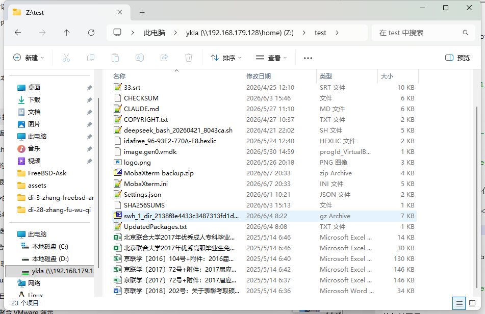

# 37.3 Network File System (NFS)

## NFS Overview

NFS (Network File System) was originally developed by Sun Microsystems in 1984. It is a distributed file storage protocol that allows remote servers to share file directories.

FreeBSD supports the Network File System (NFS), including NFSv2, NFSv3, and NFSv4, allowing servers to share directories and files with clients over the network. NFS implements communication through Remote Procedure Calls (RPC), enabling clients to transparently access remote files as if they were accessing a local file system.

NFS has many practical applications. Some common uses include:

- Data that needs to be replicated across multiple clients can be centrally stored in one location, accessible to all clients on the network.
- Multiple clients may need to access the **/usr/ports/distfiles** directory. Sharing this directory provides quick access to source files without downloading them to each client.
- In large networks, it is more convenient to centrally store all users' home directories on a single NFS server. Users can log in from any client on the network and access their home directories.
- Management of NFS exports is simpler. For example, security policies or backup policies only need to be set for a single file system.
- Other machines on the network can share removable storage media. This reduces the number of devices on the network and provides a centralized location for managing security. Installing software from a centrally mounted medium for multiple machines is also usually more convenient.

NFS consists of a server and one or more clients. Clients remotely access data stored on the server.

The NFS server declares the file systems to be shared in **/etc/exports**. Each line in this file specifies the file system to export, the clients allowed to access it, and the access options. When adding entries, each exported file system, its attributes, and the allowed hosts must be on the same line. If no clients are listed in an entry, any client on the network can mount that file system.

## Shared Directory

First, create the path **/home/ykla** to be shared, and place the files and directories you want to share into it.

To share the local directory **/home/ykla** and all its subdirectories with the remote host **192.168.179.1** (which can be specified by IP address or hostname), edit the **/etc/exports** file and add the following content:

```ini
/home/ykla -alldirs 192.168.179.1
```

The `-alldirs` flag allows subdirectories to be used as mount points. That is, it does not automatically mount subdirectories, but allows clients to mount the directories they need as required.

> **Tip**
>
> The path **/home/ykla** and the remote host address **192.168.179.1** in the above example are placeholders and need to be replaced with actual values.

After configuration, remote clients can mount and access the **/home/ykla** directory.

For each file system, the same client can only be specified once.

```ini
# This is the incorrect format
/usr/src   192.168.179.1
/usr/ports 192.168.179.1
```

They need to be specified in a single entry:

```ini
# This is the correct format
/usr/src /usr/ports  192.168.179.1
```

## Sharing a ZFS Dataset

The following example exports the **zroot/home/ykla** dataset, allowing the remote host **192.168.179.1** to mount it with read-write access:

```sh
# zfs set sharenfs="-maproot=root -rw 192.168.179.1" zroot/home/ykla
```

Explanation:

- The exported file system is read-write by default (option `-rw`), and clients can perform read and write operations on the exported file system. To set it as read-only, use the `-ro` flag.
- The `-maproot=root` option allows the root user on the remote system to write to the exported file system as root. If `-maproot=root` is not specified, the client's root user will be mapped to the credential `-2:-2` on the server (which typically corresponds to the nobody account) and will be subject to the corresponding access restrictions.

> **Exercise**
>
> Analyze why `-2:-2` typically corresponds to the nobody account (defined in **/etc/master.passwd** as `nobody:*:65534:65534::0:0:Unprivileged user:/nonexistent:/usr/sbin/nologin`).

>**Warning**
>
> Please exercise caution! The `-maproot=root` operation poses security risks and is recommended only for sharing within trusted networks.

Verify the status:

```sh
# zfs get sharenfs zroot/home/ykla
NAME             PROPERTY  VALUE                          SOURCE
zroot/home/ykla  sharenfs  rw=192.168.179.1,maproot=root  local
```

View the paths exported by the local machine:

```sh
# showmount -e
Exports list on localhost:
/home/ykla                         rw 192.168.179.1
```

## Service Startup Configuration

After completing the shared directory configuration, you also need to start the following daemons for NFS to work properly:

| Daemon | Description |
| ------ | ----------- |
| nfsd | NFS daemon, handles requests from NFS clients |
| mountd | NFS mount daemon, handles mount requests from NFS clients |
| rpcbind | Allows NFS clients to discover the ports used by the NFS server |

Set the following services to start automatically at boot:

```ini
# service rpcbind enable # Enable RPC service to support NFS
# service nfsd enable # Enable NFS service
# service mountd enable # Enable NFS mount daemon
```

- Start the RPC service:

```sh
# service rpcbind start
```

- Start the NFS mount daemon:

```sh
# service mountd start
```

- Start the NFS service:

```sh
# service nfsd start
```

- Whenever the NFS server is started, mountd starts automatically. However, mountd only reads **/etc/exports** at boot time. To make subsequent edits to **/etc/exports** take effect immediately, you can have mountd reload its configuration:

```sh
# service mountd reload
```

View the local shared files:

```sh
# showmount -e
Exports list on localhost:
/home/ykla/                        192.168.179.1
```

## Windows Client Mounting

To enable the NFS client service on Windows (IP address **192.168.179.1**), open PowerShell with administrator privileges, type the following command and press **Enter**:

```powershell
PS C:\WINDOWS\system32>dism /online /enable-feature /featurename:ClientForNFS-Infrastructure /all /norestart

Deployment Image Servicing and Management tool
Version: 10.0.26100.5074

Image Version: 10.0.26200.8246

Enabling one or more features
[==========================100.0%==========================]
The operation completed successfully.
```

After the command executes successfully, restart the computer for the changes to take effect.

Open PowerShell and type the following command, where **192.168.179.128** is the NFS server address:

```powershell
PS C:\Users\ykla> showmount -e 192.168.179.128
Exports list on 192.168.179.128:
/home/ykla/                        192.168.179.1
```

Check the network port:

```powershell
PS C:\Users\ykla> Test-NetConnection 192.168.179.128 -Port 2049


ComputerName     : 192.168.179.128
RemoteAddress    : 192.168.179.128
RemotePort       : 2049
InterfaceAlias   : VMware Network Adapter VMnet8
SourceAddress    : 192.168.179.1
TcpTestSucceeded : True
```

Open PowerShell (**non-administrator mode**) and type the following command, using the `mount` command to map the shared path to a drive letter (e.g., `Z:`).

```powershell
PS C:\Users\ykla> mount.exe 192.168.179.128:/home/ykla Z:
Z: is now successfully connected to 192.168.179.128:/home/ykla

The command completed successfully.
```

>**Warning**
>
> If you run the PowerShell command in administrator mode, File Explorer will not load the corresponding drive letter (`Z`).

View the mount status:

```powershell
New connections will be remembered.


Status       Local     Remote                    Network

-------------------------------------------------------------------------------
             Z:        \\192.168.179.128\home\ykla
                                                NFS Network
The command completed successfully.
```

Open File Explorer and you can see the network location `ykla (\\192.168.179.128\home)`, which is the Z drive:


Browse files:



## FreeBSD Client Mounting

Enable the NFS client service on the FreeBSD client (IP address **192.168.179.133**):

```sh
# service nfsclient enable
```

Then, run the following command on the NFS client:

```sh
# service nfsclient start
```

Before mounting, you can use the `showmount -e` command to view the list of NFS shares exported by the server. Mount the **/home/ykla** directory from the remote server **192.168.179.128** to the local mount point **/mnt**:

```sh
# showmount -e 192.168.179.128
Exports list on 192.168.179.128:
/home/ykla                         rw 192.168.179.133
# mount 192.168.179.128:/home/ykla /mnt
```

> **Tip**
>
> Please replace **192.168.179.128** with the actual value, which can be the NFS server's IP address or hostname.

Now, you can access the files and directories under **/home/ykla** on the server from the **/mnt** directory on the client.

To automatically mount the remote file system each time the client boots, add it to the **/etc/fstab** file:

```sh
192.168.179.128:/home/ykla    /mnt    nfs    rw    0    0
```

## Using autofs for Automatic Mounting

autofs is a collective term for a set of components that can automatically mount remote and local file systems when files or directories within the file system are accessed. It includes the kernel component autofs and several user-space applications: automount(8), automountd(8), and autounmountd(8).

The map format used by autofs is the same as other SVR4 automounters, such as those in Solaris, macOS, and Linux.

The autofs virtual file system is mounted by automount(8) at the specified mount point, typically invoked at boot time. Whenever a process attempts to access a file within an autofs mount point, the kernel notifies the automountd(8) daemon and suspends the triggering process. The automountd(8) daemon processes the kernel request by looking up the appropriate map and mounting the corresponding file system, then notifies the kernel to release the blocked process. Unless these file systems are still in use, the autounmountd(8) daemon will automatically unmount the auto-mounted file systems after a certain period of time.

The main autofs configuration file is **/etc/auto_master**. It assigns individual maps to top-level mount points.

There is a special auto-mount map mounted under the **/net** directory. When accessing files in this directory, autofs looks up the corresponding remote mount and automatically mounts it. For example, attempting to access a file in **/net/192.168.179.128/usr** will notify automountd(8) to mount the **/usr** exported file system from the **192.168.179.128** host.

**Example**: Using autofs to mount an exported file system

You can enable autofs at boot time by running the following command:

```sh
# service automount enable
```

Then, you can start autofs by running the following commands:

```sh
# service automount start
# service automountd start
# service autounmountd start
```

In this example, the `showmount -e` command shows the file systems that can be mounted from the NFS server **192.168.179.128**:

```sh
$ showmount -e 192.168.179.128
Exports list on 192.168.179.128:
/home/ykla                         rw 192.168.179.133
```

The `showmount` output shows that **/net/192.168.179.128/home/ykla** is an exported file system. When changing to the **/net/192.168.179.128/** directory, automountd(8) intercepts the request and attempts to resolve the hostname **192.168.179.128**.

```sh
$ cd /net/192.168.179.128/home/ykla
```

View the files:

```sh
ykla@ykla:/net/192.168.179.128/home/ykla $ ls
1.db	1.txt	2.db	ee.core	test
```

If successful, automountd(8) will automatically mount the source exported file system.

```sh
# mount

……other irrelevant output omitted……

map -hosts on /net (autofs)
192.168.179.128:/home/ykla on /net/192.168.179.128/home/ykla (nfs, nosuid, automounted)
```

## Troubleshooting and Unresolved Issues

### How to Disable ZFS NFS Sharing

If you want to disable sharing of the dataset **zroot/home/ykla**, you can use the following command:

```sh
# zfs set sharenfs=off zroot/home/ykla
```

### NFSv4 Demonstration

The built-in NFS client in Windows 11 Pro only supports NFSv2 and NFSv3, not NFSv4. Using NFSv4 requires third-party drivers (such as ms-nfs41-client). Testing of native support on Windows Server is pending.

### Windows Write Mounting

The NFS client in Windows 11 Pro mounts as read-only by default. Writing requires configuring AnonymousUID/AnonymousGID through the registry. Testing on Windows Server is pending. Read-write functionality has been verified on the FreeBSD NFS client.

### showmount Command Unresponsive

The following records were found in the system log **/var/log/messages**:

```sh
Jun 10 16:38:24 ykla mountd[6415]: bad exports list line '/home/logs/ykla/test': /home/logs: lstat() failed: No such file or directory.
Jun 10 16:38:29 ykla mountd[6416]: bad exports list line '/home/logs/ykla/test': /home/logs: lstat() failed: No such file or directory.
```

This indicates a shared file configuration error because the path **/home/logs/ykla/test** does not exist.

### Shared Directory Error Due to Symbolic Links

```sh
mount.nfs: access denied by server while mounting
```

The `access denied` here is not a user permission issue, but rather the NFS server rejected the mount request because the export path in **/etc/exports** cannot contain symbolic links.

The following record was found in the system log **/var/log/messages**:

```sh
bad exports list line '/abc/logs': symbolic link in export path or statfs failed
```

This record indicates that the path **/abc/logs** contains a symbolic link and therefore cannot be shared. Edit the **/etc/exports** file and change the **/abc/logs** path to the target of the symbolic link **/real_path**.

Reload the NFS mount daemon configuration:

```sh
# service mountd reload
```

Execute the following command on the client: first use `showmount -e server` to confirm that the server has exported the share, then mount the **/real_path** directory from the remote server `server` to the local mount point **/mnt**:

```sh
# showmount -e server
# mount server:/real_path /mnt
```

At this point, the remote directory has been successfully mounted to the local mount point **/mnt**.

## References

- FreeBSD Project. mount_nfs -- mount NFS file systems[EB/OL]. [2026-03-25]. <https://man.freebsd.org/cgi/man.cgi?query=mount_nfs&sektion=8>. This manual page provides complete parameter documentation for the mount_nfs command.
- Li Shouzhong. Li Shouzhong's Technical Notes[EB/OL]. [2026-03-25]. <https://note.lishouzhong.com>. This site contains Chinese translations of numerous Unix/Linux technical documents.
- chhquan. Problems encountered with FreeBSD NFS mounting[EB/OL]. [2026-03-25]. <https://blog.51cto.com/chhquan/1708250>. This article analyzes common FreeBSD NFS mounting issues and solutions.
