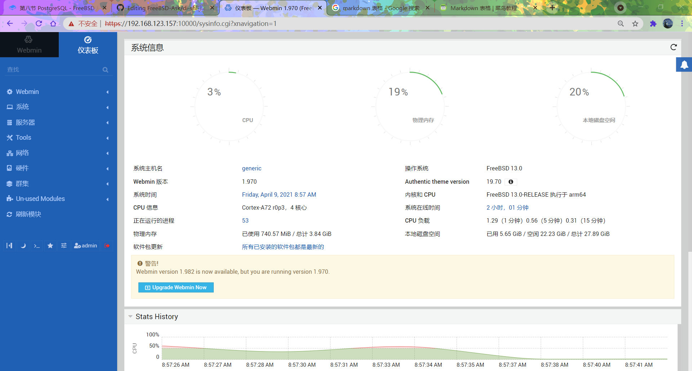

# 37.5 Webmin Management Platform

## Webmin Overview

Webmin is a web-based system management tool that supports UNIX-like operating systems such as FreeBSD, Linux, and Solaris, providing a graphical management interface.

Webmin uses a modular design and can be used to manage system administration tasks such as user accounts, disk quotas, service configuration, and network settings.

## Installing the Webmin Management Platform

Install using pkg:

```sh
# pkg install webmin
```

Or install using Ports:

```sh
# cd /usr/ports/sysutils/webmin/
# make install clean
```

View installation information:

```sh
# pkg info -D webmin
```

## Directory Structure

```sh
/
├── usr
│   └── local
│       ├── lib
│       │   └── webmin
│       │       └── setup.sh        # Webmin configuration script
│       ├── etc
│       │   └── webmin               # Webmin configuration file directory
│       └── bin
│           └── perl                 # Perl interpreter
└── var
    └── db
        └── webmin                   # Webmin log file directory
```

## Webmin Configuration Wizard

After installation, you need to run the configuration wizard to complete the initial setup and enable SSL.

**/usr/local/lib/webmin/setup.sh** is the configuration script in the Webmin installation directory, used to configure and initialize the Webmin service.

```sh
# /usr/local/lib/webmin/setup.sh
***********************************************************************
        Welcome to the Webmin setup script, version 2.013
***********************************************************************
Webmin is a web-based interface that allows Unix-like operating
systems and common Unix services to be easily administered.

Installing Webmin in /usr/local/lib/webmin

***********************************************************************
Webmin uses separate directories for configuration files and log files.
Unless you want to run multiple versions of Webmin at the same time
you can just accept the defaults.

Config file directory [/usr/local/etc/webmin]: # Configuration file directory
Log file directory [/var/db/webmin]: # Log file directory

***********************************************************************
Webmin is written entirely in Perl. Please enter the full path to the
Perl 5 interpreter on your system.

Full path to perl (default /usr/local/bin/perl): # Perl interpreter path

Testing Perl ..
.. done

***********************************************************************
Operating system name:    FreeBSD
Operating system version: 14.2

***********************************************************************
Webmin uses its own password protected web server to provide access
to the administration programs. The setup script needs to know :
 - What port to run the web server on. There must not be another
   web server already using this port.
 - The login name required to access the web server.
 - The password required to access the web server.
 - If the web server should use SSL (if your system supports it).
 - Whether to start webmin at boot time.

Web server port (default 10000): # Web server port number
Login name (default admin): # Login username, press Enter to use the default admin
Login password: # Enter password, the password will not be echoed or displayed as ****, i.e., nothing is displayed during input, same below
Password again: # Confirm password again
Use SSL (y/n): y # Whether to use SSL (https)

***********************************************************************
Creating web server config files ..
.. done

Creating access control file ..
.. done

Creating start and stop init scripts ..
.. done

Creating start and stop init symlinks to scripts ..
.. done

Copying config files ..
.. done

Changing ownership and permissions ..
.. done

Running postinstall scripts ..
.. done

Enabling background status collection ..
.. done
```

## Service Management

After the configuration wizard completes, you can manage Webmin through service commands.

Set the Webmin service to start automatically at boot:

```sh
# service webmin enable
```

Start the Webmin service:

```sh
# service webmin start
```

## Setting the Chinese Environment

Through the Webmin interface, you can set the console to display in Chinese. In Webmin, navigate to Change Language and Theme, select `Personal choice` in the `Webmin UI language` field, then select `Simplified Chinese (ZH_CN.UTF8)`, and click the `Make Changes` button. After returning to the menu → Dashboard, the console interface will switch to Chinese.

For convenience, you can also check the "Include machine translations" option next to it.

## Using Webmin

Enter `https://localhost:10000` in the browser to access the local machine. When accessing from another machine, enter the corresponding IP address, for example `https://192.168.123.157:10000`.

> **Tip**
>
> The **192.168.123.157** in the above example is a placeholder and needs to be replaced with the actual value.

After pressing Enter, if the browser prompts that the connection is not secure, select "Continue anyway", and the Webmin login interface will be displayed.

This interface is the Webmin management console. Enter the `admin` username and password in the text box, and click `Sign In` to log in to the console.


