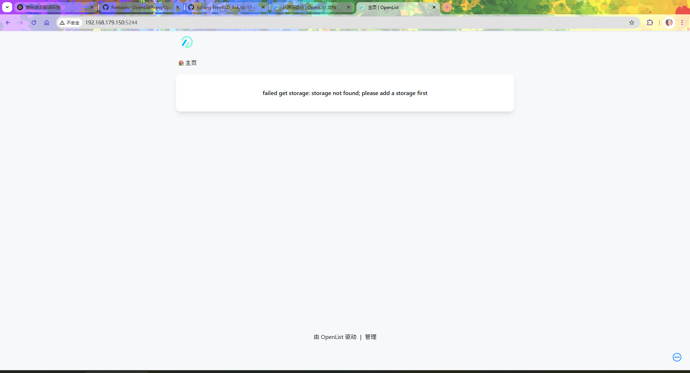

# 38.10 OpenList Deployment

OpenList is an open-source file listing and management tool, a community-driven fork of AList. Through a fully open-source governance model and transparent development process, it defends against trust attacks and ensures long-term reliability, following the AGPL-3.0 license. OpenList inherits all functionality of AList.

## Installing OpenList

### OpenList Official Binary Package

You can install using the official OpenList binary package.

Please execute the following operations as a regular user:

```sh
$ mkdir openlist                           # Create the openlist directory
$ cd openlist                              # Enter the openlist directory
$ fetch https://github.com/OpenListTeam/OpenList/releases/download/v4.0.8/openlist-freebsd-amd64.tar.gz   # Download the OpenList compressed package
$ tar zxvf openlist-freebsd-amd64.tar.gz   # Extract the downloaded compressed package
$ rm openlist-freebsd-amd64.tar.gz         # Delete the compressed package to save space
```

> **Tip**
>
> According to the [Manual Installation](https://doc.oplist.org/guide/installation/manual) documentation and actual testing, there is no need to additionally configure the backend OpenList-Frontend; the documentation provides complete manual installation guidance.

### Compiling and Installing OpenList (Optional)

If you need to compile and install OpenList from source, refer to the following steps.

#### Installing OpenList Dependencies

Install the required dependencies using pkg by executing the following command.

```sh
# pkg install git go
```

Or install the required dependencies using Ports:

```sh
# cd /usr/ports/devel/git/ && make install clean
# cd /usr/ports/lang/go/ && make install clean
```

#### Compilation Build

After installing the dependencies, you can begin compiling and building OpenList. Please execute as a regular user.

Download the OpenList source code by executing the following command:

```sh
$ git clone -b v4.0.8 https://github.com/OpenListTeam/OpenList   # Clone the OpenList repository and specify version v4.0.8
$ cd OpenList/public/dist                                        # Enter the frontend release directory (dist)
$ fetch https://github.com/OpenListTeam/OpenList-Frontend/releases/download/v4.0.8/openlist-frontend-dist-v4.0.8.tar.gz   # Download the official pre-compiled frontend files; the version must match the backend
$ tar zxvf openlist-frontend-dist-v4.0.8.tar.gz                  # Extract the frontend files
$ rm openlist-frontend-dist-v4.0.8.tar.gz                        # Delete the compressed package to clean up space
$ cd ../..                                                        # Return to the parent directory
```

Start building OpenList by executing the following command.

```sh
$ mkdir build                                  # Create the build directory
$ cd build                                     # Enter the build directory
$ go build -ldflags="-w -s" -tags=jsoniter ..  # Compile the project in the parent directory using Go, strip symbol table and debug info, and build with jsoniter tag
```

The compiled file is located in the `build` directory with the filename `OpenList`. For convenience in subsequent operations, it is renamed to `openlist` in the following tutorial.

## RC Script

Directory structure:

```sh
/
├── home
│   └── ykla
│       ├── OpenList
│       │   ├── openlist                       # OpenList executable file
│       │   ├── daemon
│       │   │   └── start.log                  # OpenList startup log
│       │   └── data
│       │       └── config.json                # OpenList configuration file
│       └── .local
│           └── share
│               └── applications
│                   ├── vlc-noschema.sh       # VLC URI handler script
│                   ├── mpv-noschema.sh       # MPV URI handler script
│                   └── userapp-vlc.desktop   # VLC custom .desktop file
├── usr
│   └── local
│       └── etc
│           └── rc.d
│               └── openlist                   # OpenList RC service script
```

> **Tip**
>
> The username `ykla`, hostname `ykla`, and path `/home/ykla` appearing in the examples in this section are for illustration only; please replace them with actual values according to your environment.

To facilitate managing the OpenList service, you can write a FreeBSD RC script. Create and edit the **/usr/local/etc/rc.d/openlist** file and add the following content:

```sh
#!/bin/sh
. /etc/rc.subr

name="openlist"
rcvar="openlist_enable"
command_path=/home/ykla/OpenList     # Directory where the OpenList executable is located
command="${command_path}/openlist"   # Command path
command_args="start"                 # Startup command arguments
stop_cmd=do_stop                     # Stop command arguments

do_stop()
{
    ${command} stop
}

load_rc_config $name                 # Load variables defined in rc.conf
: ${openlist_enable:=no}             # If openlist_enable is not set, default to no
run_rc_command "$1"                  # Run the service command
```

Grant executable permissions to the OpenList service script:

```sh
# chmod +x /usr/local/etc/rc.d/openlist
```

## Using the OpenList Service

After the RC script is written, you can use it to manage the OpenList service.

Set the OpenList service to start at boot:

```sh
# service openlist enable
```

For enhanced security, the process should be executed as a regular user (ykla is an example username; please modify to your actual username).

Set the user running the OpenList service to ykla.

```sh
# sysrc openlist_user=ykla
```

> **Warning**
>
> Note that the owner and group of the `OpenList` directory must be `ykla`, i.e., the regular username, otherwise an error will occur:
>
> `FATA[2025-07-06 11:27:56] 1511: failed to open start log file:open /home/ykla/OpenList/daemon/start.log: no such file or directory`.
>
> <Fix command> (Recursively change the owner and group of the **/home/ykla/OpenList** directory and its contents to ykla):
>
> ```sh
> # chown -R ykla:ykla /home/ykla/OpenList
> ```

## Initialization

After the service configuration is complete, you can start the OpenList service and initialize it.

Start the OpenList service instance:

```sh
# service openlist start
Starting openlist.
INFO[2025-07-06 11:32:41] success start pid: 1566
```

Reset the password for the OpenList user `admin` (please replace `your_strong_password` with a strong password):

```sh
root@ykla:/home/ykla/OpenList # ./openlist admin set your_strong_password
INFO[2025-07-06 11:39:39] reading config file: data/config.json
INFO[2025-07-06 11:39:39] load config from env with prefix: OPENLIST_
INFO[2025-07-06 11:39:39] init logrus...
INFO[2025-07-06 11:39:39] admin user has been updated:
INFO[2025-07-06 11:39:39] username: admin
INFO[2025-07-06 11:39:39] password: your_strong_password
```

## Logging In

After the service initialization is complete, you can access the OpenList web interface through a browser. Access `http://ip:5244`, replacing `ip` with the actual LAN address; the username is `admin`.




### References

- AlistGo. alist specifying --data does not work[EB/OL]. [2026-03-25]. <https://github.com/AlistGo/alist/issues/2580>. Records the issue and solution when using the `--data` parameter.
- Alist. Silent startup with start, etc.[EB/OL]. [2026-03-25]. <https://alist.nn.ci/zh/guide/install/manual.html#%E5%AE%88%E6%8A%A4%E8%BF%9B%E7%A8%8B>. Forces `--force-bin-dir`. For `start`, specifying any `data` will append `--force-bin-dir` afterwards. However, it is still ineffective; the documentation details the behavioral characteristics of silent startup.
- OpenList Team. OpenList GitHub Repository[EB/OL]. [2026-04-17]. <https://github.com/OpenListTeam/OpenList>. Official OpenList repository, stating it is a community-driven fork of AList, following the AGPL-3.0 license.

## Specifying an External Player for OpenList (VLC)

OpenList supports playing videos through external players. The following is the configuration method for VLC.

### URL Decoding

urlendec is a set of tools for URL encoding and decoding of arbitrary data streams, which can read data from the command line or standard input. This section uses urlendec for URL decoding.

- Install urlendec using pkg.

```sh
# pkg install urlendec
```

- Or install urlendec using Ports.

```sh
# cd /usr/ports/net/urlendec/
# make install clean
```

### Configuring VLC External Player

After installing urlendec, you can configure VLC as an external player. The built-in player in OpenList sometimes cannot play certain videos, but you can call external programs (using `xdg-open`) via URI to play them.

The video address specified by OpenList for VLC takes the form `vlc://http://xxx`; you only need to specify the VLC program for URIs starting with `vlc://`. Please install VLC yourself.

When `xdg-open` passes the URI to VLC, it includes the `vlc://` prefix, which VLC cannot directly parse. Therefore, the prefix must be removed before playback, then VLC is called. The corresponding script is **~/.local/share/applications/vlc-noschema.sh**:

```sh
#!/bin/sh
url="$1"                                     # Get the first parameter URL
clean_url='http:'"${url#vlc://http}"        # Remove the vlc://http prefix
vlc "$clean_url"                             # Play the processed URL using VLC
```

Grant executable permissions to the current user:

```sh
$ chmod u+x ~/.local/share/applications/vlc-noschema.sh
```

Create a new `userapp-xxx.desktop` file (only the `xxx` field can be changed to the desired name; other fields must not be changed, e.g., `userapp-abc.desktop`), so that xdg-open can call the above script. In this section, it is the **~/.local/share/applications/userapp-vlc.desktop** file:

```ini
[Desktop Entry]
Encoding=UTF-8
Version=1.0
Type=Application
NoDisplay=true
Exec=/home/ykla/.local/share/applications/vlc-noschema.sh %U
Name=VLC
Comment=Custom definition for VLC
```

Register the handler for the `vlc://` URI:

```sh
$ update-desktop-database ~/.local/share/applications   # Update the desktop application database
$ xdg-mime default userapp-vlc.desktop x-scheme-handler/vlc   # Set VLC as the custom URL protocol handler
```

### Configuring mpv External Player

Create a new file **~/.local/share/applications/mpv-noschema.sh**:

```sh
#!/bin/sh
url="$1"                                           # Get the first parameter URL
clean_url=$(urldecode "${url#mpv://}")           # Remove the mpv:// prefix and perform URL decoding
mpv "$clean_url"                                  # Play the processed URL using MPV
```

Grant executable permissions to the current user:

```sh
$ chmod u+x ~/.local/share/applications/mpv-noschema.sh
```

## Multi-Owner Permission Management for Local Storage

When using OpenList to mount local storage, you may encounter file permission issues. Running the service as a regular user is a secure approach, as described above using the user ykla.

In some cases, the owner of the local directories and their subdirectories and files mounted by OpenList may not be ykla, such as directories and files uploaded via HTTP services, directories and files downloaded by aria2 or qBittorrent running in daemon mode, and other similar situations.

Common solutions:

- Set (group and other) access permissions to allow the OpenList running user to access them.

- Plan ahead so that all possible services run as the same user, but this method is cumbersome and also causes the proprietary files of various services to lose isolation.

The above solutions are feasible when there are few owner differences, but become inconvenient when there are many differences. In such cases, using bindfs is more appropriate. Bindfs is similar to nullfs, but when mounting a target directory to another location, it can override the owner and group of files.

### Installing bindfs

To solve the multi-owner permission issue, you can use the bindfs tool.

- Install using pkg:

```sh
# pkg install fusefs-bindfs
```

- Install using Ports:

```sh
# cd /usr/ports/filesystems/bindfs/
# make install clean
```

### Test Case

After installing bindfs, you can verify its functionality through the following test case.

- Run with regular user permissions: Create a directory and its parent directory for storing uploaded web files.

```sh
$ mkdir -p /home/ykla/extdata/wwwupload
```

- Run with root user permissions: Use bindfs to mount **/var/www/upload** to **/home/ykla/extdata/wwwupload**, setting the owner and group to `ykla`.

```sh
# bindfs -u ykla -g ykla /var/www/upload /home/ykla/extdata/wwwupload
```

Here the owner of **/var/www/upload** is `www`.

This command mounts **/var/www/upload** to **/home/ykla/extdata/wwwupload**.

When user ykla accesses **/var/www/upload**, the owner of directories and files under it remains unchanged (still `www`); when accessing **/home/ykla/extdata/wwwupload**, the owner of directories and files under it all display as `ykla`.

At this point, OpenList only needs to use local storage to mount **/home/ykla/extdata/wwwupload** to resolve the access permission issue.

You can also use the `--map` option, adopting a UID/GID mapping mechanism similar to NFS (used to map certain users/groups to other users/groups), which may be a better choice in some scenarios.

#### References

- FreeBSD Project. bindfs[EB/OL]. [2026-03-25]. <https://man.freebsd.org/cgi/man.cgi?query=bindfs&sektion=1>. This manual page details the complete parameter set for filesystem mounting and permission mapping. For specific usage, refer to this manual page.

## Video Scraping

OpenList can work with video scraping tools to obtain related information about multimedia files. This solution uses Zsh; please install it yourself.

"Scraping" here refers to obtaining related information about local multimedia files, including posters, producer information, dubbing, subtitles, and other ancillary content.

OpenList does not have built-in native scraping functionality.

However, by utilizing OpenList's markdown (`top.md`, `bottom.md`, `readme.md`) mechanism, basic metadata display functionality can be achieved.

### Using inotify-tools to Monitor Directories

You can use inotify-tools to monitor directory changes, thereby triggering video scraping operations. inotify-tools provides a simple interface for filesystem events in shell scripts.

#### Installing inotify-tools

- Install using pkg:

```sh
# pkg install inotify-tools
```

- Or install using Ports:

```sh
# cd /usr/ports/sysutils/inotify-tools/
# make install clean
```

#### Monitoring Script

After installing inotify-tools, you can write a monitoring script to trigger video scraping. Create a new file **~/.monitor.zsh** and add the following content:

```sh
#!/usr/bin/zsh

zmodload zsh/datetime                               # Load the zsh datetime module

WATCH_DIR="/home/ykla/extdata/media"               # Directory to monitor
EVENTS="create,moved_to"                           # Event types to monitor
ACTION_SCRIPT="/home/ykla/searchtmdb.zsh"         # Path to the script executed when an event is triggered

inotifywait -m -r --format "%w%f %e" -e "$EVENTS" "$WATCH_DIR" | while read -r target event
do
        timestamp=$(strftime '%F %T')             # Get the current timestamp
        echo "[${timestamp}]${event}:${target}" >> dir.log   # Log the event to the log file
        echo "${event}" | grep -q 'ISDIR'        # Check if the event is for a directory
        if [[ $? == 0 ]]; then
           zsh "$ACTION_SCRIPT" >>dir.log        # If it is a directory, execute the scraping script and log it
        fi
done
```

Grant executable permissions to the current user:

```sh
$ chmod u+x ~/.monitor.zsh
```

Enable the monitoring script in the background.

Run the monitor script in the background, ignoring hangup signals; output is written to the `nohup.out` file by default:

```sh
$ nohup ~/.monitor.zsh
```

Or

```sh
$ ~/.monitor.zsh &   # Run the monitor script in the background
disown               # Detach the daemon from the current shell
```

#### References

- FreeBSD Project. inotifywait[EB/OL]. [2026-03-25]. <https://man.freebsd.org/cgi/man.cgi?query=inotifywait&sektion=1>. Provides complete command parameter descriptions for filesystem event monitoring.

### Writing Scraping Information

After the monitoring script triggers, the scraping information can be written to files such as `top.md` in the video directory.

TMDb is accessible in China, but may be affected by DNS pollution; it can be accessed normally after resolving DNS pollution. For the specific scraping script, see [this gist](https://gist.github.com/ykla/91e27db14e68ba60903e97fe1c437246).

The effect is as follows:


## Troubleshooting and Unfinished Items

If you encounter issues while using OpenList, you can check the relevant log files for troubleshooting. This section also lists items that need improvement.

### Logs

OpenList logs are located at **daemon/start.log**.

### bindfs Multi-threaded Model Has Defects

If bindfs runs in multi-threaded mode (using the `--multithreaded` option), there may be security concerns.

This issue requires further analysis and resolution.
