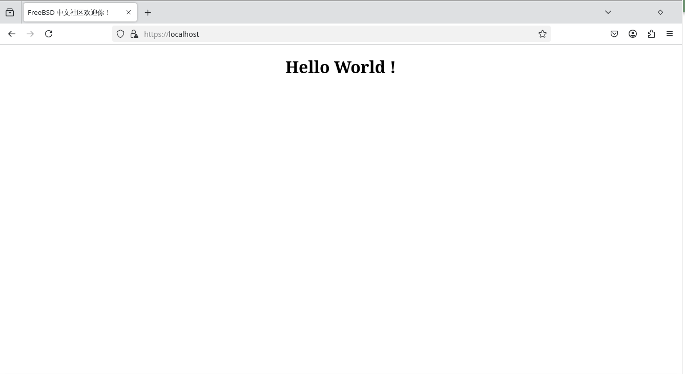

# 38.3 Caddy Web Server

Caddy is an open-source web server written in Go that provides secure web services.

## Installing Caddy

Install using the pkg package manager:

```sh
# pkg install caddy
```

Or install using Ports:

```sh
# cd /usr/ports/www/caddy/
# make install clean
```

After installation, you can view the Caddy package documentation to understand the necessary configuration and precautions:

```sh
# pkg info -D caddy
```

## Configuring Caddy

Directory structure:

```sh
/
├── usr
│   └── local
│       ├── etc
│       │   ├── caddy
│       │   │   └── Caddyfile              # Caddy main configuration file
│       │   └── rc.d
│       │       └── caddy                  # Caddy RC service script
│       └── www
│           └── caddy
│               └── index.html             # Caddy test page
└── var
    ├── log
    │   └── caddy
    │       └── caddy.log                  # Caddy runtime log
    ├── db
    │   └── caddy
    │       ├── data
    │       │   └── caddy                  # Automatic SSL certificate storage
    │       └── config
    │           └── caddy                  # Configuration auto-save
    └── run
        └── caddy
            └── caddy.sock                 # Management endpoint Unix socket
```

> **Note**
>
> Since non-privileged users cannot bind to port 443, the error `listen tcp :443: bind: permission denied` will occur.

Install the `security/portacl-rc` mentioned above by executing the following commands:

```sh
# pkg install security/portacl-rc
# sysrc portacl_users+=www
# sysrc portacl_user_www_tcp="http https"
# sysrc portacl_user_www_udp="https"
# service portacl enable
# service portacl start
```

Configure the service by executing the following commands in order:

```sh
# sysrc caddy_user=www caddy_group=www
# chown -R www:www /var/db/caddy /var/log/caddy /var/run/caddy
# service caddy enable
# service caddy start
```

Create a test page by executing the following command to create the directory:

```sh
# mkdir -p /usr/local/www/caddy/
```

Edit the **/usr/local/www/caddy/index.html** file and write the test content:

```html
<!DOCTYPE html>
<html lang="en">
<head>
    <meta charset="UTF-8">
    <meta name="viewport" content="width=device-width, initial-scale=1.0">
    <title>Chinese FreeBSD Community (CFC) Welcomes You!</title>
</head>
<body>
    <h1 style="text-align: center;">Hello World !</h1>
</body>
</html>
```

Start the Caddy service:

```sh
# service caddy start
Starting caddy... done
Log: /var/log/caddy/caddy.log
```

Open `https://localhost/` locally to view the test page:



### References

- OVVV. Caddy Installation and Usage Tutorial[EB/OL]. [2026-03-25]. <https://blog.ovvv.top/posts/f3ac7ef6/>. The HTML for the test page in this section is from this source.
