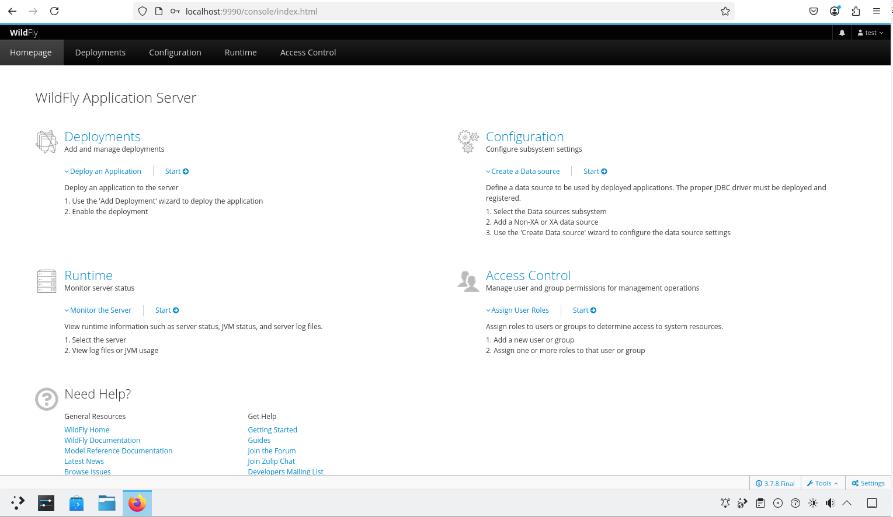

# 38.6 WildFly Application Server

## WildFly Overview

WildFly (formerly JBoss Application Server) is developed under the leadership of Red Hat and is an open-source Jakarta EE application server that provides a runtime environment and services for enterprise Java applications.

WildFly supports two running modes: standalone (standalone mode) for single-server deployments, and domain (domain mode) for multi-server centralized management.

## Installing the WildFly Application Server

This section describes the practical method for deploying WildFly on FreeBSD.

There are two main ways to install WildFly:

- Install using pkg:

```sh
# pkg install wildfly
```

- Install using Ports:

```sh
# cd /usr/ports/java/wildfly/
# make install clean
```

After installation, you can view the information provided by the package to understand the subsequent configuration steps.

```sh
# pkg info -D wildfly
```

## File Structure

```sh
/
├── usr
│   └── local
│       └── wildfly
│           ├── bin
│           │   └── add-user.sh                # WildFly user addition script
│           ├── standalone
│           │   └── configuration
│           │       ├── mgmt-users.properties # Standalone mode management user configuration
│           │       └── mgmt-groups.properties # Standalone mode management group configuration
│           └── domain
│               └── configuration
│                   ├── mgmt-users.properties # Domain mode management user configuration
│                   └── mgmt-groups.properties # Domain mode management group configuration
└── var
    └── log
        └── wildfly
            ├── error                             # WildFly error log
            └── log                               # WildFly general log
```

## Configuring the WildFly Application Server

After installation, basic configuration must be completed before use.

### Service Startup Configuration

Configure the WildFly service and set the bind address:

```sh
# service wildfly enable   # Set WildFly service to start automatically at system boot
# sysrc wildfly_args="-Djboss.bind.address=0.0.0.0 -Djboss.bind.address.management=0.0.0.0"   # Configure WildFly to bind to all network interfaces
```

### Service Startup and Verification

Start the WildFly service:

```sh
# service wildfly start
```

- Open `http://127.0.0.1:8080` (also accessible from other devices on the LAN) to verify the service status.


- Execute the WildFly user addition script **/usr/local/wildfly/bin/add-user.sh** to create an administrator account.

```sh
# /usr/local/wildfly/bin/add-user.sh

What type of user do you wish to add?
 a) Management User (mgmt-users.properties)
 b) Application User (application-users.properties)
(a): # Press Enter to select the default option
# Option a is for administrator account, option b is for application user

Enter the details of the new user to add.
Using realm 'ManagementRealm' as discovered from the existing property files.
Username : test # Enter the username to create
Password recommendations are listed below. To modify these restrictions edit the add-user.properties configuration file.
 - The password should be different from the username
# The password must not be the same as the username
 - The password should not be one of the following restricted values {root, admin, administrator}
# The password must not be root, admin, or administrator
 - The password should contain at least 8 characters, 1 alphabetic character(s), 1 digit(s), 1 non-alphanumeric symbol(s)
# The password should contain at least 8 characters, with at least 1 letter, 1 digit, and 1 non-alphanumeric character
Password : # Enter the password for the new user test, requirements as above
Re-enter Password : # Re-enter the password
What groups do you want this user to belong to? (Please enter a comma separated list, or leave blank for none)[  ]: # Press Enter to leave blank, not joining any user group
# Which user groups do you want this user to belong to? (Please enter a comma-separated list, or leave blank for none)[  ]:
About to add user 'test' for realm 'ManagementRealm'
# About to add user 'test' for realm 'ManagementRealm'.
Is this correct yes/no? yes # Confirm creation
Added user 'test' to file '/usr/local/wildfly/standalone/configuration/mgmt-users.properties'
Added user 'test' to file '/usr/local/wildfly/domain/configuration/mgmt-users.properties'
Added user 'test' with groups  to file '/usr/local/wildfly/standalone/configuration/mgmt-groups.properties'
Added user 'test' with groups  to file '/usr/local/wildfly/domain/configuration/mgmt-groups.properties'
```

- Open `http://localhost:9990` (also accessible from other devices on the LAN) to log in to the management interface.




## Troubleshooting and Unfinished Items

If the service fails to start, you can check the error logs through the **/var/log/wildfly/error** file and the **/var/log/wildfly/log** file.

## References

- WildFly Project. WildFly Documentation[EB/OL]. [2026-04-17]. <https://docs.wildfly.org/>. Official WildFly documentation, covering Jakarta EE support and configuration guides for various versions.
