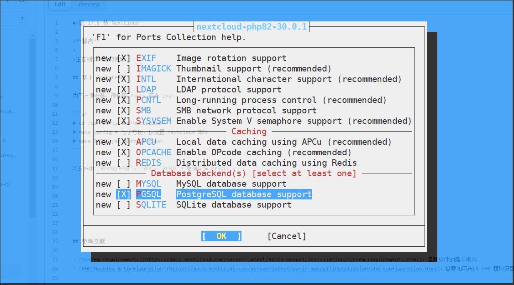
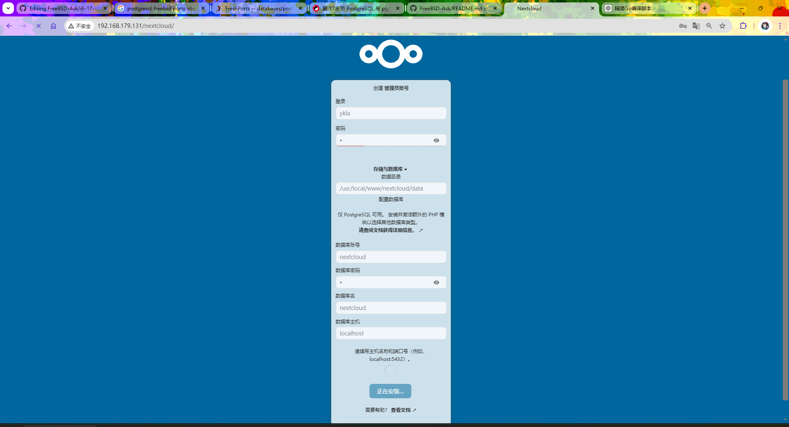
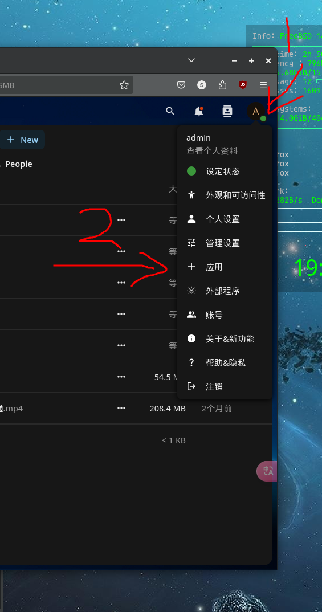
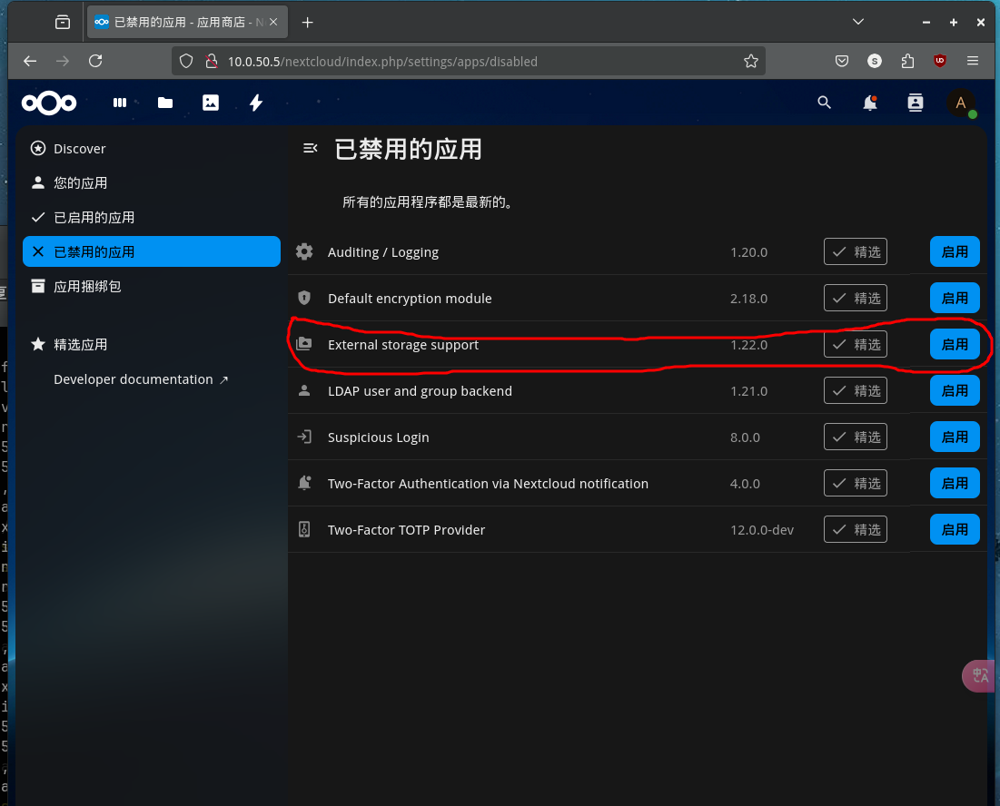
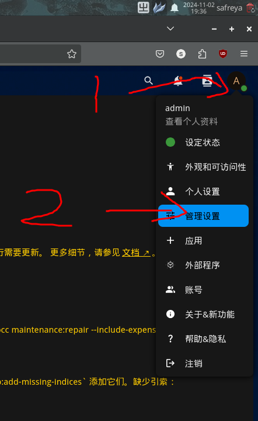

# 38.7 Nextcloud Cloud Service (Based on PostgreSQL)

Nextcloud is a self-hosted cloud storage and collaboration platform that provides file management, calendar, contacts, and online office functionality.

## Installing Nextcloud

To simplify the installation process, using Ports rather than the pkg package manager is recommended.

```sh
# cd /usr/ports/www/nextcloud/
# make config # Configure only the Nextcloud core
```

This section selects enabling `PGSQL`, `SMB`, and `PCNTL`; uncheck `MYSQL`:



Use Ports to compile and install Nextcloud by executing the following command.

```sh
# make BATCH=yes install clean
```

## Directory Structure

The Nextcloud file directory structure is as follows.

```sh
/usr/local/
└── www/
    └── nextcloud/
        ├── config/
        │   ├── config.php              # Nextcloud main configuration file
        │   ├── config.sample.php       # Nextcloud configuration sample file
        │   └── config.documented.php   # Configuration options document with annotations
        └── .htaccess.dist              # Apache .htaccess template file
```

## Installing and Configuring PostgreSQL

Nextcloud requires a database to store data; this section uses PostgreSQL. Install PostgreSQL (ensure its version is consistent with the `postgresql-client` installed via Ports above).

This section requires installing `postgresql16-server`, and completing initialization and service auto-start.

> **Note**
>
> If installing using pkg, you also need to install the Port **databases/php83-pdo_pgsql**; the PHP version numbers must all be consistent.

After PostgreSQL initialization is complete, execute the following commands to create the database and user:

```sql
$ psql -Upostgres # Enter PostgreSQL command-line mode
psql (16.7)
Type "help" for help.

postgres=# create user nextcloud; --Create user nextcloud for PostgreSQL
CREATE ROLE
postgres=# \password nextcloud --Set/modify password for user nextcloud, note the backslash \ must be entered
Enter new password for user "nextcloud": --Enter the password here; the password will not be displayed on screen, nor shown as asterisks (*); there will be no on-screen display while typing, same below
Enter it again: --Re-enter the password above
postgres=# create database nextcloud owner=nextcloud; --Create database nextcloud and assign ownership to user nextcloud
CREATE DATABASE
postgres-# \q --Exit PostgreSQL command line, note the backslash must be entered: \
```

> **Tip**
>
> If you need remote access to the database server, you must modify the **/var/db/postgres/data16/pg_hba.conf** file to allow user nextcloud to connect to PostgreSQL from a specified IP using SCRAM-SHA-256 authentication.
>
> Example (the IP segment **10.0.50.5/32** needs to be modified according to actual conditions):
>
> ```sh
> host    nextcloud       nextcloud       10.0.50.5/32               scram-sha-256
> ```

## Installing `mod_php`

Nextcloud's frontend requires PHP access, so the PHP Apache module must be installed. You can check the current PHP version using the `php -v` command to ensure it matches the system-installed version:

```sh
# php -v
PHP 8.3.17 (cli) (built: Feb 15 2025 01:11:28) (NTS)
Copyright (c) The PHP Group
Zend Engine v4.3.17, Copyright (c) Zend Technologies
    with Zend OPcache v8.3.17, Copyright (c), by Zend Technologies
```

Install mod_php using pkg by executing the following command.

```sh
# pkg install mod_php83
```

Set the PHP-FPM service to start at boot and start the service:

```sh
# service php_fpm enable   # Set PHP-FPM service to start at boot
# service php_fpm start    # Start the PHP-FPM service
```

## Based on Apache

If using Apache as the web server, corresponding configuration is needed so that Apache can correctly handle Nextcloud's PHP files. Refer to other sections to complete Apache installation and service auto-start.

### Viewing Apache Configuration Method

View the Apache configuration method for mod_php83:

```sh
# pkg info -D mod_php83
```

Start the Apache 24 service:

```sh
# service apache24 start
```

## Starting Nextcloud

After all configuration is complete, you can access Nextcloud through a browser to complete the initial setup. Access `http://ip/nextcloud`, replacing `ip` with the LAN IP address.


Enter the desired login account and password; other settings can be referenced from the image below.



After installation is complete, you will be redirected to plugin recommendations; you can ignore the recommendation page and reopen `http://ip/nextcloud` to start using it.


## Mounting Samba Shares in Nextcloud

Nextcloud supports mounting external storage, such as Samba shares. The corresponding PHP module must be installed first.

### Installing the `php83-pecl-smbclient` Module

Install the module on the Nextcloud server side.

- Install using pkg:

```sh
# pkg install php83-pecl-smbclient
```

- Or install using Ports:

```sh
# cd /usr/ports/net/pecl-smbclient/
# make install clean
```

- Restart the Apache 24 service to apply configuration changes:

```sh
# service apache24 restart
```

### Setting Up Samba Shares

After installing the module, you need to enable the external storage support application in Nextcloud and complete the corresponding configuration. Go to the "Apps" page:



Find the "External storage support" application and enable it (disabled by default).



Go to administration settings:



Locate the external storage under Administration (not the external storage under "Personal").


View all files; Samba is enabled:


## Unfinished Items

Nextcloud has several other commonly used plugins that can be installed. Other common plugins can be found using the command `pkg search -x nextcloud | grep php83`, then installed via pkg.

> **Tip**
>
> In some versions, permission issues may occur when initializing Nextcloud; please check the access permissions of the `config` directory and its files in **/usr/local/www/nextcloud** to ensure the user running Apache has read and write permissions.

## References

- Nextcloud GmbH. System requirements[EB/OL]. [2026-03-25]. <https://docs.nextcloud.com/server/latest/admin_manual/installation/system_requirements.html>. Clearly lists version compatibility requirements for each Nextcloud component.
- Nextcloud GmbH. PHP Modules & Configuration[EB/OL]. [2026-03-25]. <https://docs.nextcloud.com/server/latest/admin_manual/installation/php_configuration.html>. Detailed description of required and optional PHP modules and performance optimization configuration.
