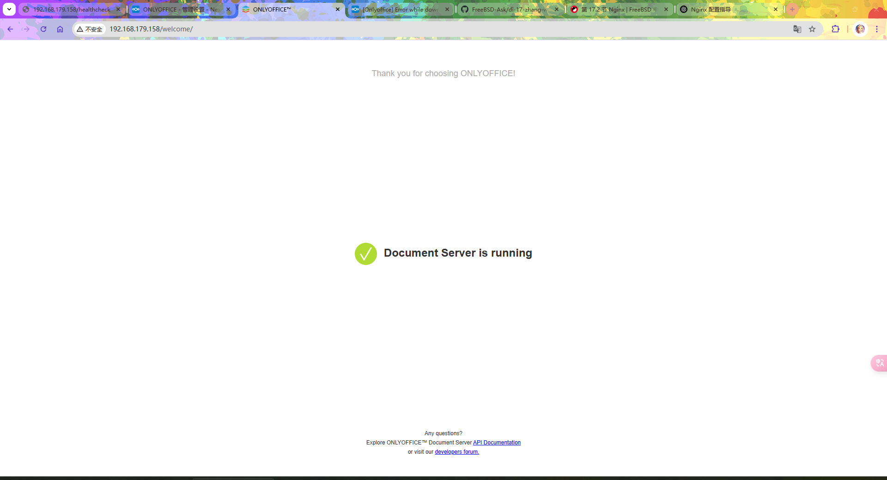
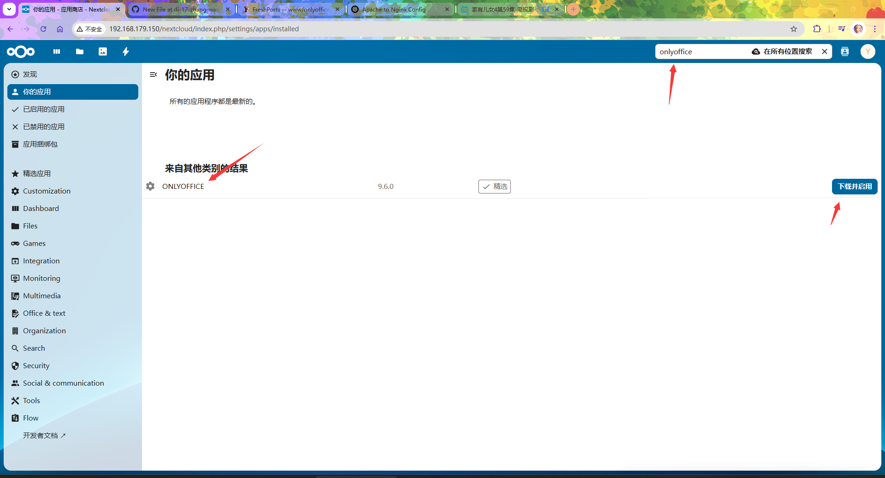

# 38.8 OnlyOffice Deployment (with PostgreSQL)

This section describes the complete steps for deploying OnlyOffice on FreeBSD via pkg and working with Nginx + Nextcloud.

## Installing Nextcloud and Nginx

OnlyOffice needs to work with Nextcloud; first install Nextcloud and Nginx on another machine. Only after installation is complete can you begin deploying the OnlyOffice document server.

## Installing OnlyOffice

Installing OnlyOffice using the pkg package manager is the simplest method; execute the following command to complete the installation:

```sh
# pkg install onlyoffice-documentserver
```

Alternatively, install OnlyOffice using Ports:

```sh
# cd /usr/ports/www/onlyoffice-documentserver/
# make install clean
```

## Viewing OnlyOffice Installation Information

Directory structure:

```sh
/
├── usr
│   └── local
│       ├── etc
│       │   ├── onlyoffice
│       │   │   └── documentserver
│       │   │       ├── local.json                      # OnlyOffice local configuration file
│       │   │       ├── default.json                    # OnlyOffice default configuration file
│       │   │       ├── nginx
│       │   │       │   └── ds.conf                     # OnlyOffice Nginx configuration
│       │   │       └── supervisor
│       │   │           └── *.conf                      # OnlyOffice supervisord configuration
│       │   └── supervisord.conf                        # supervisord main configuration file
│       ├── bin
│       │   ├── documentserver-pluginsmanager.sh       # Plugin manager script
│       │   └── documentserver-update-securelink.sh    # Secure link update script
│       └── www
│           └── onlyoffice
│               └── documentserver
│                   └── server
│                       └── schema
│                           ├── postgresql
│                           │   ├── createdb.sql      # PostgreSQL database creation script
│                           │   └── upgrade           # PostgreSQL upgrade scripts
│                           └── mysql
│                               ├── createdb.sql      # MySQL database creation script
│                               └── upgrade           # MySQL upgrade scripts
└── var
    ├── log
    │   └── onlyoffice
    │       └── documentserver
    │           └── converter
    │               └── out.log                        # OnlyOffice log file
    └── db
        └── rabbitmq
            └── .erlang.cookie                          # RabbitMQ Erlang Cookie
```

After installation, view the package documentation to understand the necessary configuration and precautions:

```sh
# pkg info -D onlyoffice-documentserver
```

## Configuring Services

After understanding the installation information, you need to configure the auto-start for OnlyOffice-related services.

```sh
# service nginx enable
# service rabbitmq enable
# service supervisord enable
```

## Configuring the Database

OnlyOffice requires a database to store data; this section uses PostgreSQL as the database. Please refer to other chapters in this book to complete the PostgreSQL database installation, initialization, and service auto-start.

Then execute the following commands to use the database:

```sh
# psql -U postgres -c "CREATE DATABASE onlyoffice;"
# psql -U postgres -c "CREATE USER onlyoffice WITH password 'onlyoffice';"
# psql -U postgres -c "GRANT ALL privileges ON DATABASE onlyoffice TO onlyoffice;"
# psql -U postgres -c "ALTER DATABASE onlyoffice OWNER to onlyoffice;"
# psql -hlocalhost -Uonlyoffice -d onlyoffice -f /usr/local/www/onlyoffice/documentserver/server/schema/postgresql/createdb.sql
```

## Configuring RabbitMQ

OnlyOffice requires RabbitMQ as the message queue service. Start the service:

```sh
# service rabbitmq start
```

Step one:

```sh
# rabbitmqctl --erlang-cookie `cat /var/db/rabbitmq/.erlang.cookie` add_user onlyoffice password  # Note: This step may take several minutes, the same applies to subsequent steps

...Some content omitted here...

attempted to contact: [rabbit@ykla]

rabbit@ykla:
  * connected to epmd (port 4369) on ykla
  * epmd reports node 'rabbit' uses port 25672 for inter-node and CLI tool traffic
  * can't establish TCP connection to the target node, reason: timeout (timed out)
  * suggestion: check if host 'ykla' resolves, is reachable and ports 25672, 4369 are not blocked by firewall

Current node details:
 * node name: 'rabbitmqcli-719-rabbit@ykla'
 * effective user's home directory: /root
 * Erlang cookie hash: mmhdcv/DKEfjrCrCEaZMvQ==
```

Step two:

```sh
# rabbitmqctl --erlang-cookie `cat /var/db/rabbitmq/.erlang.cookie` set_user_tags onlyoffice administrator
Error: unable to perform an operation on node 'rabbit@ykla'. Please see diagnostics information and suggestions below.

...Some content omitted here...

```

Step three:

```sh
# rabbitmqctl --erlang-cookie `cat /var/db/rabbitmq/.erlang.cookie` set_permissions -p / onlyoffice ".*" ".*" ".*"
Error: unable to perform an operation on node 'rabbit@ykla'. Please see diagnostics information and suggestions below.

...Some content omitted here...

```

## Allowing LAN Access

OnlyOffice's default configuration does not allow private IP address access; you need to modify the configuration to allow LAN access. Add the following snippet to the **/usr/local/etc/onlyoffice/documentserver/local.json** file:

```json
  "request-filtering-agent" : {
				"allowPrivateIPAddress": true,
				"allowMetaIPAddress": true
			},
```

That is:

```json
{
  "services": {
    "CoAuthoring": {
      "sql": {
        "type": "postgres",
        "dbHost": "localhost",
        "dbPort": "5432",
        "dbName": "onlyoffice",
        "dbUser": "onlyoffice",
        "dbPass": "onlyoffice"
      },
  "request-filtering-agent" : {
				"allowPrivateIPAddress": true,
				"allowMetaIPAddress": true
			},
      "token": {
        "enable": {
          "request": {
            "inbox": false,
            "outbox": false
          },
          "browser": false

//...Other configuration omitted here...

```

## Configuring Nginx

You need to configure Nginx to provide web access services for OnlyOffice. Edit the **/usr/local/etc/nginx/nginx.conf** file and add

```nginx
include /usr/local/etc/onlyoffice/documentserver/nginx/ds.conf;
```

to the `http` configuration block:

Example:

```nginx

# ...Other configuration omitted...

http {
    include       mime.types;
    default_type  application/octet-stream;
    include /usr/local/etc/onlyoffice/documentserver/nginx/ds.conf;

# ...Other configuration omitted...

```

## Configuring supervisord

OnlyOffice uses supervisord to manage its service processes. Edit the **/usr/local/etc/supervisord.conf** file, find the `;[include]` at the end, and remove the semicolon at the beginning of the line:

That is:

```ini
[include]
;files = relative/directory/*.ini
files = /usr/local/etc/onlyoffice/documentserver/supervisor/*.conf
```

```sh
# service supervisord start
```

## Starting the Service

After all configuration is complete, you can start the OnlyOffice document service.

```sh
# documentserver-update-securelink.sh
ds:docservice: stopped
ds:docservice: started
ds:converter: stopped
ds:converter: started
Performing sanity check on nginx configuration:
nginx: the configuration file /usr/local/etc/nginx/nginx.conf syntax is ok
nginx: configuration file /usr/local/etc/nginx/nginx.conf test is successful
```

Access the IP address directly, as shown below:



## Configuring Nextcloud

After the OnlyOffice document service starts, you need to configure the OnlyOffice plugin in Nextcloud. Open Nextcloud:

Install the OnlyOffice plugin by accessing `ip/nextcloud/index.php/settings/apps/office/onlyoffice`:



Click the avatar, then go to administration settings, find OnlyOffice, and configure as follows (note to confirm whether the secret key is empty):


## Completion

After all configuration is complete, you can test OnlyOffice functionality by previewing several files:


## Troubleshooting and Unfinished Items

If you encounter issues while using OnlyOffice, you can check the relevant log files for troubleshooting. This section also lists items that need improvement.

OnlyOffice logs are located at **/var/log/onlyoffice/documentserver/converter/out.log**.

## References

- Ascensio System SIA. How to allow Private IP to access OnlyOffice documentServer?[EB/OL]. [2026-03-25]. <https://forum.onlyoffice.com/t/how-to-allow-private-ip-to-access-onlyoffice-documentserver/5755/2>. Provides the configuration method for private IP address access to OnlyOffice.
