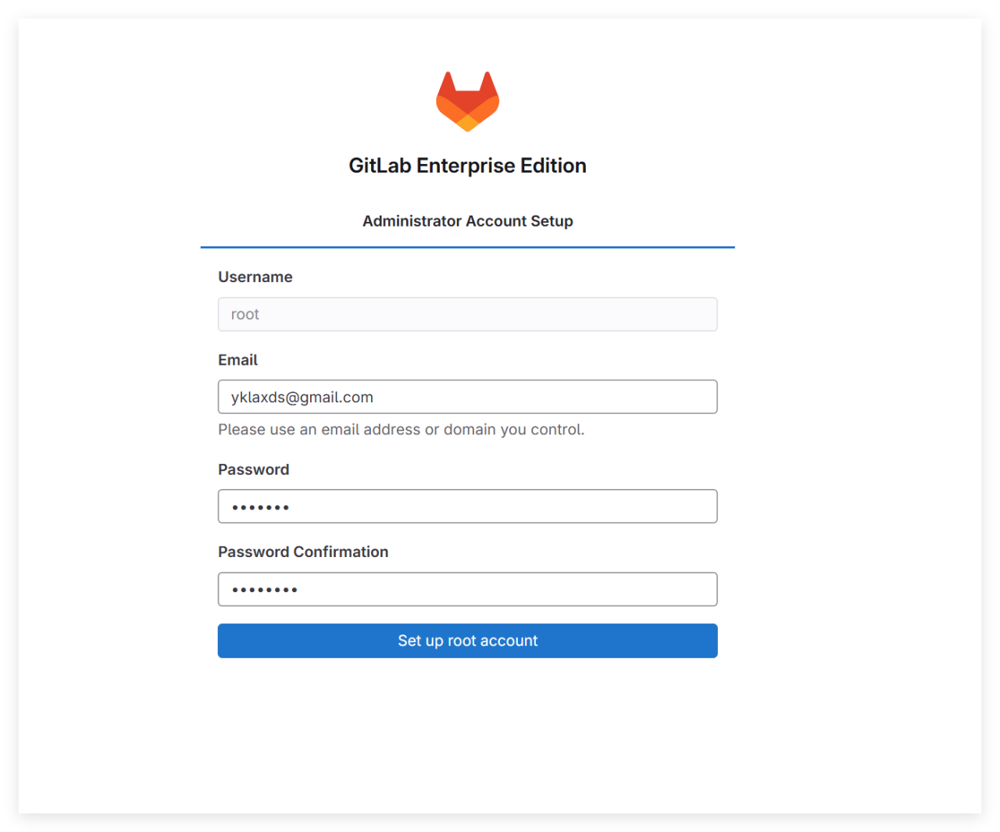
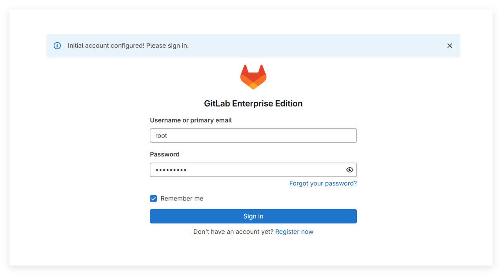
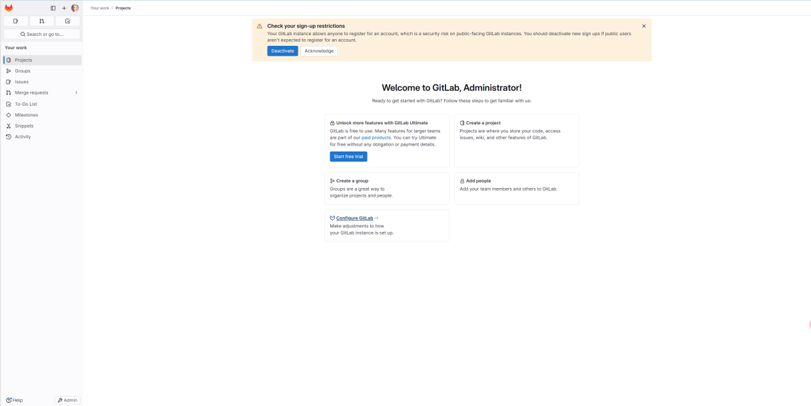
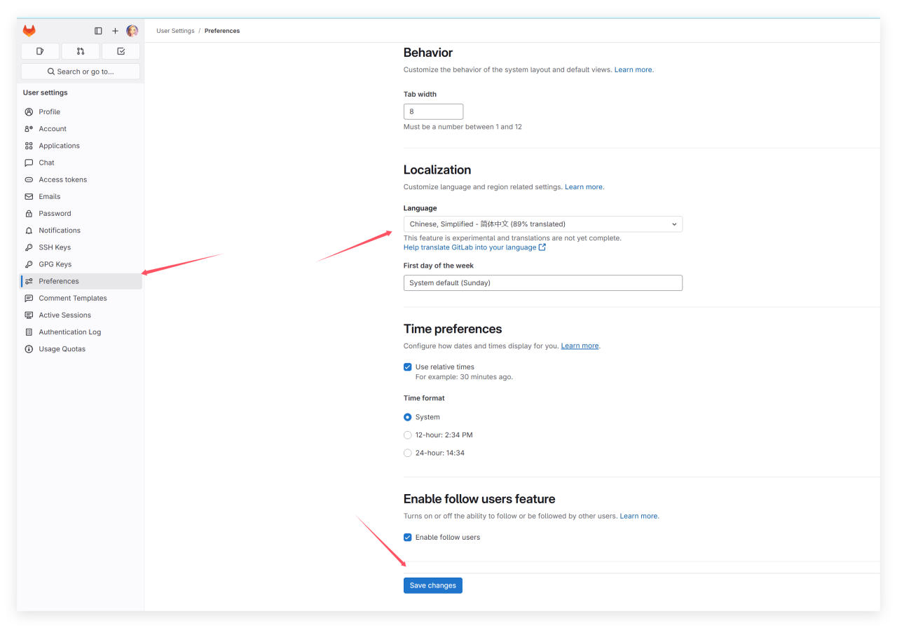
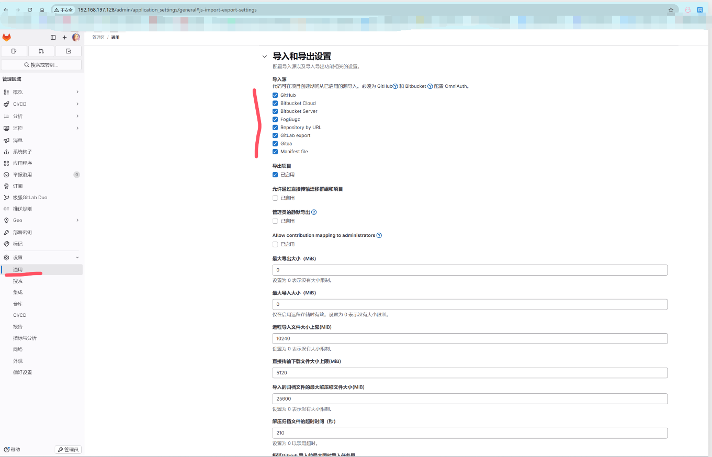
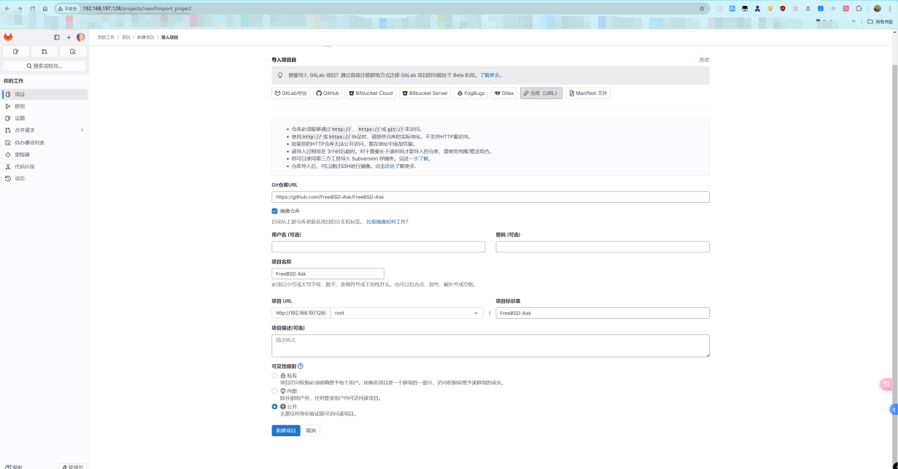

# 38.9 GitLab Enterprise Edition Deployment

GitLab EE provides additional enterprise features on top of the CE version.

## Installing GitLab EE

```sh
# pkg install gitlab-ee
```

Or install using Ports:

```sh
# cd /usr/ports/www/gitlab/
# make FLAVOR=ee install clean
```

This Port also includes GitLab CE (Community Edition); to install EE (Enterprise Edition), you must specify the parameter `FLAVOR=ee`.

After installation, view the package documentation to understand the subsequent configuration steps.

```sh
# pkg info -D gitlab-ee
```

The FreeBSD version of GitLab comes with complete installation instructions provided by the maintainer; please refer to: <https://gitlab.com/mfechner/freebsd-gitlab-docu/blob/master/install/17.8-freebsd.md>.

To sponsor this developer, visit: <https://www.patreon.com/mfechner_gitlab_freebsd>.

## Starting Services

After installation, you need to start the relevant services.

First, set the GitLab service to start at boot:

```sh
# service gitlab enable
```

## PostgreSQL Database Configuration

GitLab requires a PostgreSQL database. For PostgreSQL database version requirements, see [GitLab installation requirements — PostgreSQL](https://docs.gitlab.com/ee/install/requirements.html).

Please refer to other relevant chapters in this book to complete the PostgreSQL database deployment.

### Database and User Initialization

Create the database and user for GitLab:

```sql
$ psql -d template1 -U postgres -c "CREATE USER git CREATEDB SUPERUSER PASSWORD '<your_strong_password>';"   # Create PostgreSQL user git, grant database creation and superuser privileges; replace <your_strong_password> with a strong password
CREATE ROLE

$ psql -d template1 -U postgres -c "CREATE DATABASE gitlabhq_production OWNER git;"   # Create database gitlabhq_production with owner git
CREATE DATABASE

$ psql -U git -d gitlabhq_production   # Connect to the gitlabhq_production database as user git
psql (16.8)
Type "help" for help.

gitlabhq_production-# \q           # Exit psql
$ exit                              # Exit the postgres user
```

### Database Extension Configuration

Create the necessary extensions for the GitLab database:

```sh
# psql -U postgres -d gitlabhq_production -c "CREATE EXTENSION IF NOT EXISTS pg_trgm;"   # Create pg_trgm extension for the gitlabhq_production database
# psql -U postgres -d gitlabhq_production -c "CREATE EXTENSION IF NOT EXISTS btree_gist;"   # Create btree_gist extension for the gitlabhq_production database
# psql -U postgres -d gitlabhq_production -c "CREATE EXTENSION IF NOT EXISTS plpgsql;"   # Create plpgsql extension for the gitlabhq_production database
```

## Redis Cache Service Configuration

Redis is an open-source in-memory data structure store; GitLab uses it as a cache and session store. Redis is automatically installed as a dependency.

View post-installation information:

```sh
# pkg info -D redis
```

Redis-related file structure:

```sh
/
├── usr
│   └── local
│       └── etc
│           └── redis.conf    # Redis configuration file
└── var
    └── run
        └── redis
            └── redis.sock   # Redis UNIX socket
```

### Configuring Socket

Configure Redis to use UNIX socket communication:

```sh
# echo 'unixsocket /var/run/redis/redis.sock' >> /usr/local/etc/redis.conf   # Configure Redis to use UNIX socket
# echo 'unixsocketperm 770' >> /usr/local/etc/redis.conf                    # Set Redis UNIX socket permissions to 770
```

### Configuring the Service

Set the Redis service to start at boot:

```sh
# service redis enable
```

Restart the Redis service:

```sh
# service redis restart
```

### Configuring User Permissions

Add user git to the redis user group to allow GitLab to access Redis:

```sh
# pw groupmod redis -m git
```

## Git Environment Configuration

GitLab's core components include:

| Component | Description |
| --------- | ----------- |
| **Puma** | Web application server used by GitLab |
| **Gitaly** | Service responsible for Git repository storage and access |
| **Sidekiq** | Background job processing queue |
| **GitLab Workhorse** | Smart reverse proxy that handles HTTP requests |

Configure the Git environment:

```sh
# su -l git -c "git config --global core.autocrlf input" # Required for web editor
# su -l git -c "git config --global gc.auto 0" # GitLab automatically runs git gc when needed
# su -l git -c "git config --global repack.writeBitmaps true" # Speed up repository object access and clone operations
# su -l git -c "git config --global receive.advertisePushOptions true" # Allow the server to support push options during git push
# su -l git -c "git config --global core.fsync objects,derived-metadata,reference" # Reduce the risk of repository corruption during server crashes
# su -l git -c "mkdir -p /usr/local/git/.ssh" # Ensure the .ssh directory exists
# su -l git -c "mkdir -p /usr/local/git/repositories" # Ensure the repository directory exists, and set correct permissions afterwards
# chown git /usr/local/git/repositories     # Set the owner of /usr/local/git/repositories to the git user
# chgrp git /usr/local/git/repositories     # Set the group of /usr/local/git/repositories to git
# chmod 2770 /usr/local/git/repositories    # Set directory permissions to 2770, enable SGID, allowing group users to read/write and inherit the group
```

File structure:

```sh
/usr/local/git/
├── .ssh/ # SSH configuration directory
└── repositories/ # GitLab repository storage directory
```

## Configuring GitLab

The configuration file path is at **/usr/local/www/gitlab**.

```sh
/
├── usr
│   └── local
│       ├── www
│       │   └── gitlab
│       │       ├── config
│       │       │   ├── puma.rb                 # Puma configuration file
│       │       │   ├── database.yml           # Database connection configuration
│       │       │   └── secrets.yml            # Key configuration file
│       │       ├── db
│       │       │   └── fixtures
│       │       │       └── production         # Production environment data seed files
│       │       ├── lib
│       │       │   └── support
│       │       │       └── nginx
│       │       │           └── gitlab         # GitLab Nginx configuration file
│       │       ├── tmp
│       │       │   └── sockets
│       │       │       └── private
│       │       │           └── gitaly.socket  # Gitaly socket
│       │       └── package.json              # Node.js dependency configuration
│       └── share
│           └── gitlab-shell                  # GitLab Shell directory
```

### Adjusting GitLab Load

Check the number of CPU cores on the system:

```sh
# sysctl hw.ncpu
hw.ncpu: 16
```

Edit the **/usr/local/www/gitlab/config/puma.rb** file and change `workers 3` to the value output above, i.e., change to `workers 16`.

### Database Connection Configuration

Edit the **/usr/local/www/gitlab/config/database.yml** file and change `password: "secure password"` to `password: "password"` (`password` is the database password set above).

GitLab requires write permissions to create symbolic links:

```sh
# chown git /usr/local/share/gitlab-shell      # Set the owner of /usr/local/share/gitlab-shell to the git user
```

Initialize the GitLab database and related configuration:

```sh
# cd /usr/local/www/gitlab # Ensure the path is correct
root@ykla:/usr/local/www/gitlab # su -l git -c "cd /usr/local/www/gitlab && rake gitlab:setup RAILS_ENV=production" #  Initialize GitLab database and related configuration

...Some content omitted here...

This will create the necessary database tables and seed the database.
You will lose any previous data stored in the database.
Do you want to continue (yes/no)? yes # Type yes and press Enter here

Dropped database 'gitlabhq_production'
Created database 'gitlabhq_production'

...Some content omitted here...

Administrator account created:

login:    root # Note the username
password: You'll be prompted to create one on your first visit.

...Some content omitted here...
```

Revoke the previously granted permissions:

```sh
# chown root /usr/local/share/gitlab-shell      # Set the owner of /usr/local/share/gitlab-shell to the root user
```

Check whether GitLab and its environment are configured correctly:

```sh
# su -l git -c "cd /usr/local/www/gitlab && rake gitlab:env:info RAILS_ENV=production"      # Execute the command as the git user, switch to the GitLab directory and display production environment information

System information
System:
Proxy:		no
Current User:	git
Using RVM:	no
Ruby Version:	3.2.7
Gem Version:	3.6.4
Bundler Version:2.6.4
Rake Version:	13.2.1
Redis Version:	7.4.2
Sidekiq Version:7.2.4
Go Version:	unknown

GitLab information
Version:	17.8.2-ee
Revision:	Unknown
Directory:	/usr/local/www/gitlab
DB Adapter:	PostgreSQL
DB Version:	16.8
URL:		http://localhost
HTTP Clone URL:	http://localhost/some-group/some-project.git
SSH Clone URL:	git@localhost:some-group/some-project.git
Elasticsearch:	no
Geo:		no
Using LDAP:	no
Using Omniauth:	yes
Omniauth Providers:

GitLab Shell
Version:	14.39.0
Repository storages:
- default: 	unix:/usr/local/www/gitlab/tmp/sockets/private/gitaly.socket
GitLab Shell path:		/usr/local/share/gitlab-shell

...Some content omitted here...
```

If using corepack (Node.js), change the owner of the `package.json` file to the git user:

```sh
# chown git /usr/local/www/gitlab/package.json
```

Set the Python version; before setting, use `ls` to check:

```sh
# ls /usr/local/bin/python3.11
/usr/local/bin/python3.11
```

After confirming the version, set Yarn to use the specified Python interpreter as the git user:

```sh
# su -l git -c "cd /usr/local/www/gitlab && yarn config set python /usr/local/bin/python3.11"
yarn config v1.22.19
success Set "python" to "/usr/local/bin/python3.11".
Done in 0.03s.
```

Compile assets; install production dependencies as the git user in the GitLab directory using the lockfile:

```sh
# su -l git -c "cd /usr/local/www/gitlab && yarn install --production --pure-lockfile"
yarn install v1.22.19
$ node ./scripts/frontend/preinstall.mjs
[WARNING] package.json changed significantly. Removing node_modules to be sure there are no problems.
[1/5] Validating package.json...

...Some content omitted here...

[-/8] ⠠ waiting...
warning Your current version of Yarn is out of date. The latest version is "1.22.22", while you're on "1.22.19".
Done in 109.27s.
```

Compile GitLab assets in the production environment as the git user, while skipping database and storage validation:

```sh
# su -l git -c "cd /usr/local/www/gitlab && RAILS_ENV=production NODE_ENV=production USE_DB=false SKIP_STORAGE_VALIDATION=true bundle exec rake gitlab:assets:compile"

...Omitted. This step takes approximately tens of minutes; if an out-of-memory error occurs, increase swap space. It usually needs to be executed twice; if an out-of-memory error occurs, you need to repeat the execution once more...

The file does not introduce any side effects, we are all good.
gitlab:assets:check_page_bundle_mixins_css_for_sideeffects finished in 0.371513498 seconds
```

Set the PostgreSQL user git as a non-superuser:

```sh
# psql -d template1 -U postgres -c "ALTER USER git WITH NOSUPERUSER;"
ALTER ROLE
```

Start the GitLab service:

```sh
# service gitlab start

...Some content omitted here...

Started in 45s.
The GitLab web server with pid 8202 is running.
The GitLab Sidekiq job dispatcher with pid 8212 is running.
The GitLab Workhorse with pid 8216 is running.
Gitaly with pid 8218 is running.
GitLab and all its components are up and running.
```

## Nginx

Nginx is a high-performance web server and reverse proxy; GitLab uses it as the frontend web server.

Please refer to other chapters to install Nginx.

### Configuring the **/usr/local/etc/nginx/nginx.conf** File

Edit the **/usr/local/etc/nginx/nginx.conf** file and find:

```nginx
http {
    include       mime.types;
    default_type  application/octet-stream;
```

Modify as follows to include the Nginx configuration file provided by GitLab:

```nginx
http {
    include       mime.types;
    default_type  application/octet-stream;
    include       /usr/local/www/gitlab/lib/support/nginx/gitlab; # Add this line
```

Directory structure:

```sh
/
├── usr
│   └── local
│       └── etc
│           └── nginx
│               └── nginx.conf        # Nginx main configuration file
└── var
    └── log
        └── nginx
            ├── gitlab_error.log     # GitLab error log
            └── error.log            # Nginx error log
```

## Configuring Services

Set Nginx to start automatically at system boot:

```sh
# service nginx enable
```

Start the Nginx service:

```sh
# service nginx start
```

## Configuring GitLab Pages

GitLab Pages is a static website hosting service provided by GitLab. Configure GitLab Pages:

```sh
# su -l git -c "openssl rand -base64 32 > /usr/local/www/gitlab/.gitlab_pages_secret"   # Generate GitLab Pages secret as the git user
# chmod 640 /usr/local/www/gitlab/.gitlab_pages_secret   # Set the secret file permissions to 640
# chgrp gitlab-pages /usr/local/www/gitlab/.gitlab_pages_secret   # Change the group of the secret file to gitlab-pages
```

Directory structure:

```sh
/
├── usr
│   └── local
│       └── www
│           └── gitlab
│               ├── .gitlab_pages_secret                  # GitLab Pages secret
│               ├── .license_encryption_key.pub           # GitLab license encryption public key
│               └── .license_encryption_key.pub.back      # GitLab license encryption public key backup
└── var
    └── log
        ├── gitlab_pages.log                             # GitLab Pages log
        └── gitlab-shell
            └── gitlab-shell.log                         # GitLab Shell log
```

### Starting the Service

Start the GitLab Pages service:

```sh
# sysrc gitlab_pages_enable="YES"   # Set GitLab Pages to start automatically at system boot
# service gitlab_pages start        # Start the GitLab Pages service
```

## Checking Configuration

Check the GitLab production environment configuration as the git user:

```sh
# su -l git -c "cd /usr/local/www/gitlab && rake gitlab:check RAILS_ENV=production"
Checking GitLab subtasks ...

...Some content omitted here...

Checking GitLab App ... Finished

Checking GitLab subtasks ... Finished
```

## Platform Access and Initialization

Restart the GitLab service:

```sh
# service gitlab restart
```

Enter the server IP in the browser and press Enter, for example **192.168.197.128** in this example. Please fill in the email and set a password (at least 8 characters, must include complex characters).

> **Tip**
>
> The **192.168.197.128** in the above example is a placeholder and needs to be replaced with the actual value.



Log in:





## Language Environment Configuration

Click the avatar, go to "Preferences", find "Localization", select "Simplified Chinese", then click "Save changes" to save the setting:



## License Activation (For Learning Reference Only)

> **Warning**
>
> The following operations involve generating an unauthorized license, which **may violate the GitLab End User License Agreement (EULA)**. This content is provided for personal study and research reference only, and **is strictly prohibited for use in any production environment or commercial purpose**. The author and publisher of this book are not responsible for any legal liability arising from the misuse of this section. Please support the official version: [Purchase GitLab License](https://about.gitlab.com/pricing/).

Install `gitlab-license` (gem is the Ruby package manager, already installed automatically as a dependency):

```sh
# gem install gitlab-license
```

Create the license directory:

```sh
# mkdir gitlab-license           # Create the gitlab-license directory
```

Write the following content to the `gitlab-license/license.rb` file:

```ruby
require "openssl"
require "gitlab/license"
key_pair = OpenSSL::PKey::RSA.generate(2048)
File.open("license_key", "w") { |f| f.write(key_pair.to_pem) }
public_key = key_pair.public_key
File.open("license_key.pub", "w") { |f| f.write(public_key.to_pem) }
private_key = OpenSSL::PKey::RSA.new File.read("license_key")
Gitlab::License.encryption_key = private_key
license = Gitlab::License.new
license.licensee = {
"Name" => "ykla", # Modify to username
"Company" => "CFC", # Modify to organization
"Email" => "yklaxds@gmail.com", # Modify to email
}
license.starts_at = Date.new(2025, 1, 1) # Start date
license.expires_at = Date.new(2050, 1, 1) # End date
license.notify_admins_at = Date.new(2049, 12, 1)
license.notify_users_at = Date.new(2049, 12, 1)
license.block_changes_at = Date.new(2050, 1, 1)
license.restrictions = {
active_user_count: 10000,
}
puts "License:"
puts license
data = license.export
puts "Exported license:"
puts data
File.open("GitLabBV.gitlab-license", "w") { |f| f.write(data) }
public_key = OpenSSL::PKey::RSA.new File.read("license_key.pub")
Gitlab::License.encryption_key = public_key
data = File.read("GitLabBV.gitlab-license")
$license = Gitlab::License.import(data)
puts "Imported license:"
puts $license
unless $license
raise "The license is invalid."
end
if $license.restricted?(:active_user_count)
active_user_count = 10000
if active_user_count > $license.restrictions[:active_user_count]
    raise "The active user count exceeds the allowed amount!"
end
end
if $license.notify_admins?
puts "The license is due to expire on #{$license.expires_at}."
end
if $license.notify_users?
puts "The license is due to expire on #{$license.expires_at}."
end
module Gitlab
class GitAccess
    def check(cmd, changes = nil)
    if $license.block_changes?
        return build_status_object(false, "License expired")
    end
    end
end
end
puts "This instance of GitLab Enterprise Edition is licensed to:"
$license.licensee.each do |key, value|
puts "#{key}: #{value}"
end
if $license.expired?
puts "The license expired on #{$license.expires_at}"
elsif $license.will_expire?
puts "The license will expire on #{$license.expires_at}"
else
puts "The license will never expire."
end
```

Execute the `license.rb` script using Ruby:

```ruby
# ruby license.rb
License:
#<Gitlab::License:0x00001333815f0f88>
Exported license:
eyJkYXRhIjoiZlhQdzNWWldFOTIrcHFrNUx1MlZqQXBaZkpQVi9yaHJxN0cy

...Some content omitted here...

K2YwbWhobEpRPT1cbiJ9
Imported license:
#<Gitlab::License:0x0000133381f3ece8>
This instance of GitLab Enterprise Edition is licensed to:
Name: ykla
Company: CFC
Email: yklaxds@gmail.com
The license will expire on 2050-01-01
```

Back up the old public key:

```sh
# cp /usr/local/www/gitlab/.license_encryption_key.pub /usr/local/www/gitlab/.license_encryption_key.pub.back
```

View the files in the directory. Three files were generated in this directory:

```sh
root@ykla:~/gitlab-license # ls
GitLabBV.gitlab-license	license_key
license.rb		license_key.pub
```

Replace the original public key with the newly generated public key:

```sh
root@ykla:~/gitlab-license # cp license_key.pub /usr/local/www/gitlab/.license_encryption_key.pub
```

View the public key:

```sh
root@ykla:~/gitlab-license # cat GitLabBV.gitlab-license
eyJkYXRhIjoiZlhQdzNWWldFOTIrcHFrNUx1MlZqQXBaZkpQVi9yaHJxN0cy

...Some content omitted here...

K2YwbWhobEpRPT1cbiJ9
```

Visit [http://192.168.197.128/admin/application\_settings/general](http://192.168.197.128/admin/application_settings/general) (replace with the actual IP address), click "Add license", then paste the content of the `GitLabBV.gitlab-license` file into the "Enter license key" box:


### References

- Mengguyi. GitLab EE 16 Installation and Crack Tutorial[EB/OL]. (2023-07-05)[2026-03-26]. <https://blog.mengguyi.com/articles/GitLab-Install.html>. Records the installation process and license configuration method for GitLab Enterprise Edition.

## External Project Import Configuration

Open `http://192.168.197.128/admin`, click "General", select "Import and export settings" on the right, select the desired projects, and save.






### References

- Li Juncai. CI/CD Notes.Gitlab Series: 2024 Update - Setting GitLab Import Sources[EB/OL]. (2024-03-11)[2026-03-26]. <https://bbs.huaweicloud.com/blogs/423539>. Explains the steps for configuring external project import sources in the 2024 version of GitLab.

## Troubleshooting and Unfinished Items

### Logs

- **/var/log/nginx/gitlab_error.log**
- **/var/log/nginx/error.log**
- **/var/log/gitlab_pages.log**
- **/var/log/gitlab-shell/gitlab-shell.log**

### `500: We're sorry, something went wrong on our end`

Check the current status of the GitLab service:

```sh
# service gitlab status
The GitLab web server with pid 8202 is running.
The GitLab Sidekiq job dispatcher with pid 8212 is running.
The GitLab Workhorse with pid 8216 is running.
Gitaly with pid 8218 is running.
GitLab and all its components are up and running.
```

If the service is running normally and there are no anomalies in the error logs, it may be due to insufficient memory. Display kernel ring buffer messages:

```sh
# dmesg

...Some content omitted here...

swap_pager: out of swap space
swap_pager_getswapspace(11): failed
swap_pager: out of swap space
swap_pager_getswapspace(27): failed
swap_pager_getswapspace(11): failed
swap_pager_getswapspace(4): failed
pid 7965 (node), jid 0, uid 211, was killed: failed to reclaim memory
pid 7822 (ruby32), jid 0, uid 211, was killed: failed to reclaim memory
```

If the 500 error persists, it is recommended to check the system resource (memory and swap space) configuration.

#### References

- AppX. Installation, Backup, Migration, and Recovery of GitLab on CentOS 7[EB/OL]. (2018-11-14)[2026-03-26]. <https://blog.ifeegoo.com/the-installation-backup-migration-restore-of-gitlab-on-centos-7.html>. This document provides a practical guide for common GitLab troubleshooting and data management.
