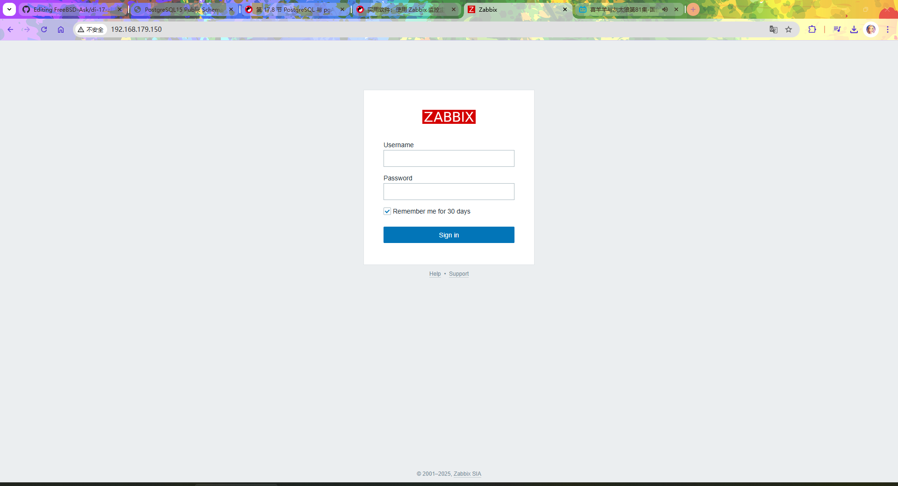
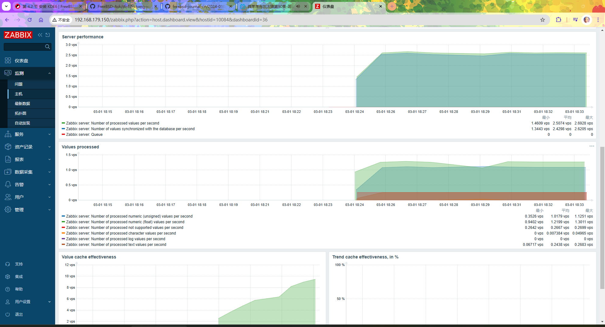

# 39.1 Zabbix Monitoring System (Based on PostgreSQL)

Zabbix is an enterprise-grade distributed open-source monitoring solution that provides real-time monitoring and alerting for network devices, servers, applications, and cloud services. This section uses the Ports method and provides complete installation and configuration steps based on PostgreSQL.

## Installing zabbix7-server

zabbix7-server is the server-side component (Zabbix Server), responsible for receiving and processing monitoring data. It should be installed on the monitoring server.

Installing via pkg will additionally introduce MySQL dependencies and may cause binding conflicts. Therefore, it is recommended to use the Ports method for installation to more precisely control dependencies and configuration options.

```sh
# cd /usr/ports/net-mgmt/zabbix7-server/
# make config
```


Configure as shown in the figure, select the `PGSQL` option and confirm, then execute the build and install commands. The build process is time-consuming:

```sh
# make install clean
```

## Installing PostgreSQL

Zabbix requires a database to store monitoring data.

For the installation, initialization, and service auto-start configuration of PostgreSQL 16, please refer to the relevant chapter in this book.

## Installing Nginx

The Zabbix frontend needs to be accessed through a web server. This section uses Nginx as the web server. For the installation and service auto-start configuration of Nginx, please refer to the relevant chapter in this book.

## Installing zabbix7-frontend

zabbix7-frontend is the web frontend (Zabbix Frontend), providing a graphical monitoring management interface.

Install via pkg:

```sh
# pkg install zabbix7-frontend-php83
```

The above installation process will automatically install PHP. The version installed in this section is PHP 8.3. Zabbix 7.0.10 and later also officially supports PHP 8.4. If needed, you can use `zabbix7-frontend-php84` and the corresponding php84 extension packages. For available versions, please refer to [zabbix7-frontend](https://www.freshports.org/net-mgmt/zabbix7-frontend), which provides the latest package information and compatibility notes.

You can also install via the Ports method:

```sh
# cd /usr/ports/net-mgmt/zabbix7-frontend/
# make install clean
```

## PDO

The Zabbix frontend needs to access the PostgreSQL database via PHP, so the corresponding PHP database extensions must be installed. PDO (PHP Data Objects) is the unified interface for PHP to access databases. The PHP version must be compatible with the Zabbix frontend.

Install PHP database extensions using pkg:

```sh
# pkg install php83-pdo_pgsql php83-pgsql
```

You can also install PHP database extensions via the Ports method:

```sh
# cd /usr/ports/databases/php83-pdo_pgsql/ && make install clean
# cd /usr/ports/databases/php83-pgsql/ && make install clean
```

## Installing zabbix7-agent

zabbix7-agent is the Zabbix client agent program, responsible for collecting monitoring data on the monitored host and sending it to the Zabbix Server. It should be installed on the hosts that need to be monitored and can be deployed on multiple hosts to achieve distributed monitoring.

Install zabbix7-agent using pkg:

```sh
# pkg install zabbix7-agent
```

You can also install zabbix7-agent via the Ports method:

```sh
# cd /usr/ports/net-mgmt/zabbix7-agent/
# make install clean
```

## Daemons

The related services need to be configured to start automatically at system boot.

```sh
# service zabbix_server enable   # Configure the Zabbix Server service to start automatically at system boot
# service zabbix_agentd enable   # Configure the Zabbix Agent service to start automatically at system boot
# service php_fpm enable         # Configure the PHP-FPM service to start automatically at system boot
```

## Setting Up the PostgreSQL Database

You need to create a dedicated database and user in PostgreSQL for Zabbix, and import the initial Zabbix data. After the PostgreSQL database initialization is complete, execute the following commands:

```sql
$ cd /usr/local/share/zabbix7/server/database/postgresql/             # Enter the Zabbix PostgreSQL database initialization script directory
$ psql                                     # Start the PostgreSQL command-line client
psql (16.8)
Type "help" for help.

template1=# create database zabbix;                 -- Create the zabbix database
CREATE DATABASE

template1=# CREATE USER zabbix WITH PASSWORD 'your_strong_password';  -- Create user zabbix and set a strong password
CREATE ROLE

postgres=# GRANT USAGE, CREATE on SCHEMA public to zabbix;  -- Grant the zabbix user usage and create permissions on the public schema
GRANT

postgres=# GRANT ALL PRIVILEGES ON DATABASE zabbix TO zabbix;  -- Grant the zabbix user all privileges on the zabbix database
GRANT

postgres=# ALTER DATABASE zabbix owner to zabbix;   -- Transfer ownership of the zabbix database to the zabbix user
ALTER DATABASE

postgres=# \q                                     -- Exit the PostgreSQL command line
```

> **Tip**
>
> The `your_strong_password` in the above example is a placeholder and must be replaced with an actual strong password.

You must exit the current session first, then continue with the subsequent operations using the correct user permissions:

```text
$ psql -U zabbix zabbix # Log in to the zabbix database using the user account zabbix
psql (16.8, server 16.7)
Type "help" for help.

zabbix=> \i schema.sql -- Execute the schema.sql script in the zabbix database to create the database structure
CREATE TABLE
CREATE INDEX
CREATE TABLE
CREATE INDEX
CREATE TABLE

...some content omitted here...

zabbix=> \i images.sql
INSERT 0 1
INSERT 0 1
INSERT 0 1
INSERT 0 1
INSERT 0 1

...some content omitted here...

zabbix=> \i data.sql
START TRANSACTION
INSERT 0 4
INSERT 0 1
INSERT 0 2

...some content omitted here...

zabbix=# \q -- Exit
$ exit # Exit the database user
root@ykla:~ #
```

### References

- ShowMe.Codes. PostgreSQL15 Public Schema Permission Issue Resolution[EB/OL]. [2026-03-25]. <https://showme.codes/zh-cn/2024-01-01-postgresql15-public-schema-permission/>. Details the public schema permission changes and solutions in PostgreSQL 15+.

## Configuring Zabbix Server

You need to configure the main configuration file of Zabbix Server to connect to the PostgreSQL database.

Directory structure:

```sh
/
├── usr
│   └── local
│       ├── etc
│       │   └── zabbix7
│       │       ├── zabbix_server.conf     # Zabbix Server configuration file
│       │       └── zabbix_agentd.conf     # Zabbix Agent configuration file
│       ├── share
│       │   └── zabbix7
│       │       └── server
│       │           └── database
│       │               └── postgresql    # Zabbix PostgreSQL database initialization scripts
│       └── www
│           └── zabbix7
│               └── conf
│                   ├── zabbix.conf.php           # Zabbix frontend configuration file
│                   └── zabbix.conf.php.example   # Zabbix frontend configuration example
└── var
    └── log
        └── zabbix
            ├── zabbix_server.log        # Zabbix Server log
            └── zabbix_agentd.log        # Zabbix Agent log
```

The main configuration file for Zabbix Server is located at **/usr/local/etc/zabbix7/zabbix_server.conf**.

Add the following content:

```ini
SourceIP=127.0.0.1           # Source IP address used by Zabbix Server when initiating connections
LogFile=/var/log/zabbix/zabbix_server.log   # Zabbix Server log file path
DBHost=                        # Database host address, leave empty to connect to localhost via UNIX domain socket
DBName=zabbix                  # Database name used by Zabbix Server
DBUser=zabbix                  # Database username
DBPassword=your_strong_password  # Database user password (must match the password created above)
Timeout=4                      # Timeout in seconds for Zabbix Server connections to the database or proxies
LogSlowQueries=3000            # Log slow queries exceeding the specified number of milliseconds
StatsAllowedIP=127.0.0.1       # IP addresses allowed to access Zabbix Server statistics
```

## Configuring Zabbix Agent

You need to configure the main configuration file of Zabbix Agent to communicate with Zabbix Server. The Zabbix Agent configuration file is located at **/usr/local/etc/zabbix7/zabbix_agentd.conf**.

Add the following content:

```ini
LogFile=/var/log/zabbix/zabbix_agentd.log   # Zabbix Agent log file path
SourceIP=127.0.0.1                          # Source IP address used by Zabbix Agent
Server=127.0.0.1                            # Zabbix Server IP address, for passive checks
ServerActive=127.0.0.1                      # Zabbix Server IP address, for active checks
Hostname=ykla                               # Hostname of the current host in Zabbix Server
```

## Configuring the Zabbix Frontend

You need to configure the Zabbix frontend configuration file to connect to the PostgreSQL database. The Zabbix frontend configuration template is located at **/usr/local/www/zabbix7/conf/zabbix.conf.php.example** (Zabbix Frontend configuration template).

Copy the Zabbix example configuration file to the active configuration file:

```sh
# cp /usr/local/www/zabbix7/conf/zabbix.conf.php.example /usr/local/www/zabbix7/conf/zabbix.conf.php
```

Edit the **/usr/local/www/zabbix7/conf/zabbix.conf.php** file, changing:

```ini
$DB['TYPE']                             = 'MYSQL';
$DB['SERVER']                   = 'localhost';
$DB['PORT']                             = '0';
$DB['DATABASE']                 = 'zabbix';
$DB['USER']                             = 'zabbix';
$DB['PASSWORD']                 = '';
```

to the following:

```ini
$DB['TYPE']     = 'POSTGRESQL';   # Set database type to PostgreSQL
$DB['SERVER']   = 'localhost';    # Database server address
$DB['PORT']     = '0';            # Database port, 0 means use the default port
$DB['DATABASE'] = 'zabbix';       # Database name
$DB['USER']     = 'zabbix';       # Database username
$DB['PASSWORD'] = 'your_strong_password';  # Database user password
```

> **Note**
>
> The above configuration is suitable for local development and testing environments. For production environments, it is recommended to:
>
> - Enable TLS encryption for communication between Zabbix Server, Agent, and the web frontend
> - Configure HTTPS using an Nginx reverse proxy to avoid transmitting monitoring data and login credentials in plain text

### Configuring Nginx

You need to configure Nginx to provide web access for the Zabbix frontend. Back up the original Nginx main configuration file:

```sh
# cp /usr/local/etc/nginx/nginx.conf /usr/local/etc/nginx/nginx.conf.simple
```

Edit the **/usr/local/etc/nginx/nginx.conf** file, replacing the original content with the following:

```nginx
worker_processes 1;                              # Number of worker processes
events {
  worker_connections 1024;                       # Maximum connections per worker process
}
http {
  include             mime.types;                # Include MIME type definitions file
  default_type        application/octet-stream; # Default MIME type
  sendfile            on;                        # Enable sendfile to improve static file transfer efficiency
  keepalive_timeout   65;                        # Keepalive timeout in seconds
  server {
    listen            80;                        # Listen on HTTP port 80
    server_name       localhost;                 # Virtual host name
    root /usr/local/www/zabbix7;                # Website root directory
    index index.php index.html index.htm;        # Default index file order
    location / {
      try_files $uri $uri/ =404;                # Return 404 when requested file does not exist
    }
    location ~ \.php$ {                           # Match .php file requests
      fastcgi_split_path_info ^(.+\.php)(/.+)$; # Split PATH_INFO
      fastcgi_param SCRIPT_FILENAME $document_root$fastcgi_script_name; # PHP script path
      fastcgi_param PATH_INFO $fastcgi_path_info;                         # Set PATH_INFO
      fastcgi_param REMOTE_USER $remote_user;                             # Set REMOTE_USER
      fastcgi_pass   127.0.0.1:9000;                                      # FastCGI service address
      fastcgi_index index.php;                                            # Default FastCGI index file
      include fastcgi_params;                                             # Include FastCGI parameters file
    }
  }
}
```

## Configuring PHP

You need to configure PHP to meet the runtime requirements of the Zabbix frontend.

### Editing the **/usr/local/etc/php.ini-production** File

Copy the production PHP configuration file as the default configuration file:

```sh
# cp /usr/local/etc/php.ini-production /usr/local/etc/php.ini
```

Edit the **/usr/local/etc/php.ini** file:

- Find `;date.timezone =` and change it to `date.timezone = Asia/Shanghai` (you need to remove the leading semicolon `;`)
- Find `post_max_size = 8M` and change it to `post_max_size = 16M`
- Find `max_execution_time = 30` and change it to `max_execution_time = 300`
- Find `max_input_time = 60` and change it to `max_input_time = 300`

## Starting Services

After all configurations are complete, you need to start the related services in order to ensure the Zabbix monitoring system runs properly.

```sh
# service postgresql restart    # Restart the PostgreSQL service
# service php_fpm start         # Start the PHP-FPM service
# service nginx start           # Start the Nginx service
# service zabbix_server start   # Start the Zabbix Server service
# service zabbix_agentd start   # Start the Zabbix Agent service
```

## Logging In

After the services start successfully, you can access the Zabbix web frontend through a browser to complete login and configuration. The default username and password for the Zabbix web frontend are as follows:

- Username: `Admin`
- Password: `zabbix`

> **Note**
>
> The default password is public information. Please change it to a strong password immediately after logging in via "User settings → Change password".



## Configuring Chinese Language

After logging in to Zabbix, you can set the interface language to Chinese.




## Troubleshooting and Outstanding Issues

If anomalies occur during Zabbix operation, you can check the relevant log files for troubleshooting. This section also lists several items that need improvement.

### Logs

Zabbix log files are located at the following paths.

- Agent: **/var/log/zabbix/zabbix_agentd.log** file
- Server: **/var/log/zabbix/zabbix_server.log** file
- PHP-related errors: **/var/log/nginx/error.log** file

### Unresolved Issues

The following are issues that need further investigation:

- Chinese text displays garbled characters;
- Some monitoring items are not displayed;
- HTTP and other security configurations need improvement.

## References

- FreeBSD Foundation. Monitor Your Hosts with Zabbix[EB/OL]. (2024-01)[2026-03-25]. <https://freebsdfoundation.org/our-work/journal/browser-based-edition/networking-10th-anniversary/practical-ports-monitor-your-hosts-with-zabbix/>. Provides a complete practical guide for deploying Zabbix monitoring on FreeBSD.
