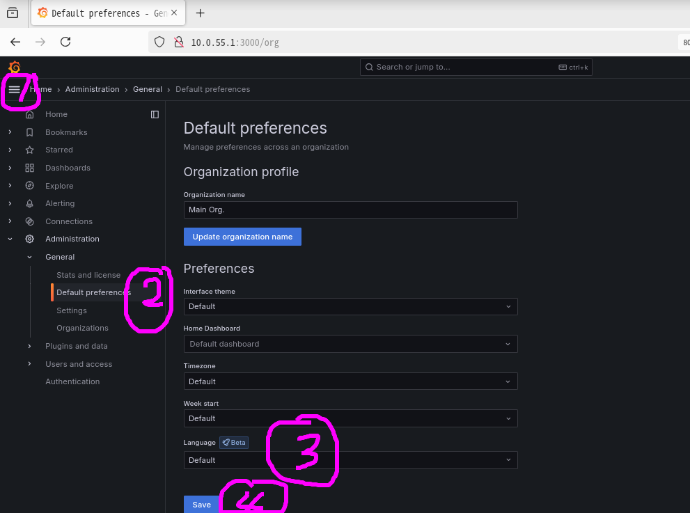
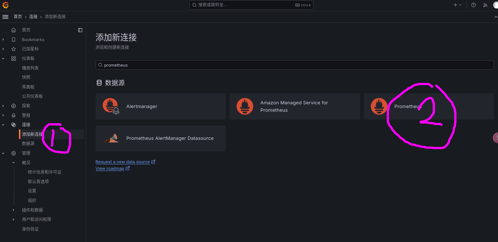
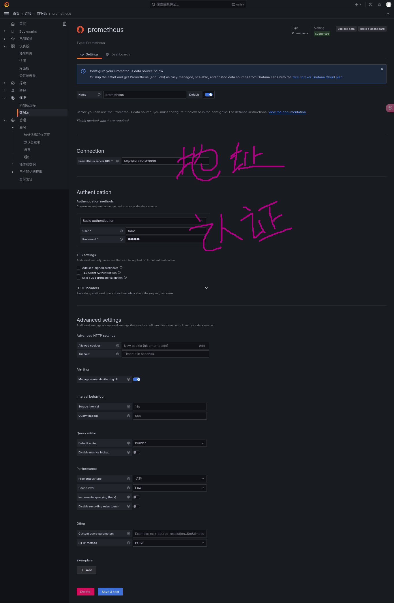
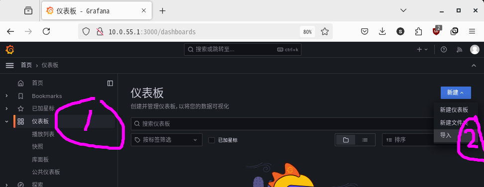

# 39.2 Prometheus Monitoring Deployment

Prometheus is an open-source time-series monitoring system and alerting toolkit that records purely numeric time-series data in real time and provides performance monitoring and alerting capabilities. It uses Prometheus TSDB as the time-series database, collects node system load, storage, and memory metrics through exporters, and deploys Alertmanager for alert notifications.

## Framework

The Prometheus monitoring deployment framework is shown in the figure.


Description:

| Component | Description |
| --------- | ----------- |
| Prometheus | The center of the entire monitoring system |
| Grafana | Visualizes monitoring data |
| Exporter | Responsible for data collection. Prometheus supports multiple Exporters; use `pkg search -D prometheus` to find them |
| Alertmanager | Responsible for processing alert information |
| Remote Storage | Prometheus can be configured with various remote storage options |

> **Note**
>
> Components such as Prometheus, Grafana, Exporter, and Alertmanager can be deployed on different devices or operating systems. Exporters should be installed on the monitored nodes. In the following examples, Prometheus, Grafana, and Alertmanager are installed on the same machine, while Exporters are deployed separately as needed.

If you encounter service startup issues, you can check the **/var/log/daemon.log** file. Most Prometheus configuration files use YAML format; pay attention to indentation. For Prometheus configuration files, you can use the `promtool check` command to verify the configuration file.

## Installing Basic Tools

After understanding the framework, you need to install the basic components of the Prometheus monitoring system.

### Installing prometheus

Install using the pkg package manager:

```sh
# pkg install prometheus
```

Or install using the Ports method:

```sh
# cd /usr/ports/net-mgmt/prometheus2/
# make install clean
```

#### Service

Configure the Prometheus service to start automatically at system boot and start the service:

```sh
# service prometheus enable   # Configure the Prometheus service to start automatically at system boot
# service prometheus start    # Start the Prometheus service
```

### Installing Grafana

Install using the pkg package manager:

```sh
# pkg install grafana
```

Or install using the Ports method:

```sh
# cd /usr/ports/www/grafana/
# make install clean
```

#### Service

Configure the Grafana service to start automatically at system boot and start the service:

```sh
# service grafana enable   # Configure the Grafana service to start automatically at system boot
# service grafana start    # Start the Grafana service
```

### Installing node_exporter

Install using the pkg package manager:

```sh
# pkg install node_exporter
```

Or install using the Ports method:

```sh
# cd /usr/ports/sysutils/node_exporter
# make install clean
```

#### Service

Configure the Node Exporter service to start automatically at system boot and start the service:

```sh
# service node_exporter enable   # Configure the Node Exporter service to start automatically at system boot
# service node_exporter start    # Start the Node Exporter service
```

## Configuration

Directory structure:

```sh
/
├── usr
│   └── local
│       └── etc
│           ├── prometheus.yml                 # Prometheus main configuration file
│           ├── prometheus_webconfig.yml       # Prometheus web authentication configuration file
│           ├── node_exporter_webconfig.yml    # Node Exporter web authentication configuration file
│           └── prometheus
│               └── alert.rules.yml           # Prometheus alert rules file
└── var
    └── log
        └── daemon.log                         # System daemon log
```

### Prometheus

The main configuration file for Prometheus is **/usr/local/etc/prometheus.yml**, with the following content:

```yml
scrape_configs:
  # The job name is added as a label job=<job_name> to any timeseries scraped from this config.
  - job_name: "prometheus"

    # metrics_path defaults to '/metrics'
    # scheme defaults to 'http'.

    static_configs:
      - targets: ["localhost:9090"]
```

The `scrape_configs` section configures the target nodes for data collection. The default `targets: ["localhost:9090"]` refers to the Prometheus service itself.

Now add `node_exporter` for monitoring host information. Add the following under `scrape_configs`:

```yml
scrape_configs:
  # The job name is added as a label job=<job_name> to any timeseries scraped from this config.
  - job_name: "prometheus"

    # metrics_path defaults to '/metrics'
    # scheme defaults to 'http'.

    static_configs:
      - targets: ["localhost:9090"]

  - job_name: "node_exporter_local"
    static_configs:
      - targets: ["localhost:9100"]
```

Restart Prometheus.

```sh
# service prometheus restart
```

This adds a new monitoring node to Prometheus with the job name `node_exporter_local`. Multiple hosts can be added within `[]`.

Prometheus provides a web interface (default port 9090) where you can view the following monitoring target information:


The Graph page allows you to view various monitoring metrics and supports expressions.


Viewing data or dashboards directly is not convenient enough. You can use Grafana for a more intuitive data display.

### Grafana

Open the Grafana web page in a browser (default port `3000`). The default username is `admin` and the password is `admin`. Please change the default password immediately after logging in.

As shown in the figure below, you can switch to a Chinese interface:



First, create a data source connection to Prometheus.






Use the created data source to create a dashboard. You can import community preset templates.




## Security Authentication

By default, only Grafana login requires a password. Components communicate with each other via HTTP. For example, you can directly access Node Exporter monitoring data by visiting `http://ip:9100/`, and Prometheus can be directly accessed via `http://ip:9090/`.

Exposing this information directly in a production environment poses security risks, so security authentication must be configured.

### Basic Authentication

#### Prometheus basic_auth

- Edit the **/usr/local/etc/prometheus_webconfig.yml** file with the following format:

```yml
basic_auth_users:
  prometheususer: $2a$10$mxpc1PdYgOwvGepNtCuBKO6RXVUzLDg8feOvuz6szOsBa9M28ECfe
```

In the second line, the part before the colon is the username, and the part after the colon is the bcrypt hash of the password. Here the `sttr` tool is used to generate it; other tools can also be used. Assuming the password is `prometheuspassword`:

```sh
# pkg install sttr
$ sttr bcrypt prometheuspassword
$2a$10$mxpc1PdYgOwvGepNtCuBKO6RXVUzLDg8feOvuz6szOsBa9M28ECfe%
```

The trailing `%` is a display artifact when the terminal does not produce a newline and can be ignored.

- Edit the **/usr/local/etc/prometheus.yml** file, adding the following three lines to the Prometheus configuration:

```yml
    basic_auth:
      username: prometheususer
      password: prometheuspassword
```

Note the indentation. The complete example is as follows:

```yml
scrape_configs:
  # The job name is added as a label job=<job_name> to any timeseries scraped from this config.
  - job_name: "prometheus"

    # metrics_path defaults to '/metrics'
    # scheme defaults to 'http'.

    static_configs:
      - targets: ["localhost:9090"]
    basic_auth:
      username: prometheususer
      password: prometheuspassword

  - job_name: "node_exporter_local"
    static_configs:
      - targets: ["localhost:9100"]
```

- Modify the Prometheus startup configuration and restart

```sh
# sysrc prometheus_args="--web.config.file='/usr/local/etc/prometheus_webconfig.yml'"  # Set Prometheus startup parameters, specifying the web configuration file
# service prometheus restart   # Restart the Prometheus service to apply the configuration
```

When accessing `http://ip:9090/`, Prometheus will require login first:


Grafana also needs authentication information when connecting to the data source.

#### Exporter basic_auth

The following uses node_exporter as an example:

- Edit the **/usr/local/etc/node_exporter_webconfig.yml** file with the following format:

```yml
basic_auth_users:
  node_exporter_user: $2a$10$XoJoz.x.m9FTEbaTF3hBsehE9C8zCWjCQUHkSL0Isk53UnUTjR4hi
```

- Modify the node_exporter startup configuration and restart the service

```sh
# sysrc node_exporter_args="--web.config.file='/usr/local/etc/node_exporter_webconfig.yml'"
# service node_exporter restart
```

- Edit the **/usr/local/etc/prometheus.yml** file as follows:

```yml
scrape_configs:
  # The job name is added as a label job=<job_name> to any timeseries scraped from this config.
  - job_name: "prometheus"

    # metrics_path defaults to '/metrics'
    # scheme defaults to 'http'.

    static_configs:
      - targets: ["localhost:9090"]
    basic_auth:
      username: prometheususer
      password: prometheuspassword

  - job_name: "node_exporter_local"
    static_configs:
      - targets: ["localhost:9100"]
    basic_auth:
      username: node_exporter_user
      password: node_exporter_password
```

Restart Prometheus.

```sh
# service prometheus restart
```

### CA Certificate Authentication

If higher security is required, CA certificate authentication can be used to enhance security, but not every exporter supports this authentication method.

The following continues to use Node Exporter as an example, assuming its node IP is **10.0.55.1**.

#### Generating Certificates

```sh
# Generate CA private key
$ openssl genpkey -algorithm RSA -out ca.key
# Generate CA certificate
$ openssl req -new -x509 -key ca.key -out ca.crt -days 3650 -subj "/CN=my-ca"
```

#### Generating Prometheus-side Certificates

```sh
# Generate Prometheus client private key
$ openssl genpkey -algorithm RSA -out prometheus.key
# Generate client certificate request
$ openssl req -new -key prometheus.key -out prometheus.csr -subj "/CN=prometheus-client"
# Sign the client certificate request with the CA
$ openssl x509 -req -in prometheus.csr -CA ca.crt -CAkey ca.key -CAcreateserial -out prometheus.crt -days 3650
```

#### Generating node_exporter-side Certificates

1. Create an OpenSSL configuration file to specify the SAN (Subject Alternative Name) when generating the certificate.

Create a file named `san.cnf` with the following content.

```ini
[ req ]
distinguished_name = req_distinguished_name
x509_extensions = v3_ca
prompt = no

[ req_distinguished_name ]
CN = node-exporter-server

[ v3_ca ]
# Add SAN field
subjectAltName = @alt_names

[ alt_names ]
DNS.1 = node-exporter-server.example.com  # If you have a domain name, fill in the actual domain name
IP.1 = 10.0.55.1  # If using an IP address, fill in the actual IP
```

> **Tip**
>
> The **10.0.55.1** and `node-exporter-server.example.com` in the above example are placeholders and must be replaced with actual values.

2. Use the SAN configuration when generating the certificate request

Use this configuration file to generate the certificate signing request (CSR) and certificate.

```sh
# First, generate the private key
$ openssl genpkey -algorithm RSA -out node_exporter.key
# Then, generate a CSR with the SAN field
$ openssl req -new -key node_exporter.key -out node_exporter.csr -config san.cnf
# Sign the certificate with the CA
$ openssl x509 -req -in node_exporter.csr -CA ca.crt -CAkey ca.key -CAcreateserial -out node_exporter.crt -days 3650 -extensions v3_ca -extfile san.cnf
```

The SAN (Subject Alternative Name) must be specified, otherwise access may fail. You can also configure Prometheus to ignore certificate verification, but this contradicts security principles and will not be discussed here.

#### Configuring Prometheus and node_exporter

Edit the **/usr/local/etc/node_exporter_webconfig.yml** file as follows:

```yml
tls_server_config:
  cert_file: /path/to/node_exporter.crt
  key_file: /path/to/node_exporter.key
  client_ca_file: /path/to/ca.crt
  client_auth_type: "RequireAndVerifyClientCert"
```

The last configuration item is the most important; this option is key to ensuring security.

Modify the **/usr/local/etc/prometheus.yml** file as follows:

```yml
  - job_name: "node_exporter_local"
    static_configs:
      - targets: ["10.0.55.1:9100"]
    scheme: 'https'
    tls_config:
      cert_file: '/path/to/prometheus.crt'
      key_file: '/path/to/prometheus.key'
      ca_file: '/path/to/ca.crt'
```

These two files were already mentioned in [Basic Authentication](#basic-authentication) and are used in the same way.

The storage location and permissions of key and certificate files should be set to the minimum access privileges.

Restart Prometheus and node_exporter to apply the changes.

## Pushgateway

The above introductions all use the pull method, where Prometheus pulls data from each Exporter. Pushgateway allows the monitored side to actively push data to Pushgateway, and then Prometheus pulls data from Pushgateway. This is suitable for monitoring temporary and batch tasks.

1. Install pushgateway

```sh
# pkg install pushgateway
# service pushgateway enable
# service pushgateway start
```

2. Configure Pushgateway in Prometheus

Edit the **/usr/local/etc/prometheus.yml** file, adding the following content:

```yml
  - job_name: "pushgateway"
    static_configs:
      - targets: ["localhost:9091"]
```

3. Example of a temporary task

Assume there is a management script for checking zombie processes, as follows:

```sh
num=$(ps aux |awk 'NR>1 {print $8}'|grep Z|wc -l)
echo "process_zombie $num"|curl --data-binary @- http://10.0.55.1:9091/metrics/job/check_processes
```

The first line checks the number of zombie processes, and the second line sends the zombie process count to Pushgateway. Note that each line of data sent must end with a newline character `\n`.

## Alerting

Prometheus alerting relies on the Alertmanager component. Here we use Jail Exporter as an example (installation and configuration are relatively simple, see above). You also need to write `kern.racct.enable=1` in the **/boot/loader.conf** file to enable the system resource accounting feature.

1. Install using pkg:

```sh
# pkg install alertmanager
```

2. Configure Alertmanager alert routing rules

The following example only demonstrates the Email notification method. Alertmanager also supports other notification channels.

```yml
global:
  smtp_smarthost: 'smtp.sina.com:25'
  smtp_from: 'xxxxx@sina.com'
  smtp_auth_username: 'xxxxx'
  smtp_auth_password: 'xxxxxxxxxxxxxxx'
templates:
  - '/usr/local/etc/alertmanager/template/*.tmpl'
route:
  group_by: ['alertname']
  group_wait: 30s
  group_interval: 5m
  repeat_interval: 3h
  receiver: xxxxx

  routes:
    - matchers:
        - alertname=~"jail"
      receiver: xxxxx
      routes:
        - matchers:
            - severity="critical"
          receiver: xxxxx

receivers:
  - name: 'xxxxx'
    email_configs:
      - to: 'xxxxx@qq.com'
```

The `global` section specifies global configuration; here it specifies the SMTP service. The `route` section specifies sending routing rules. The `receivers` section specifies receiver information.

3. Configure alert rules

Write a rules file, such as **/usr/local/etc/prometheus/alert.rules.yml**:

```yml
groups:
- name: jails-alerts
  rules:
  - alert: jail_down
    expr: absent(jail_id{name="dox"})
    for: 5m
    labels:
      severity: critical
    annotations:
      summary: "jail dox is down"
      description: "jail dox is down"
```

- `alert` specifies the alert name.
- `expr` specifies the alert trigger condition expression. Here `absent(jail_id{name="dox"})` means the alert is triggered when the metric (jail_id) for jail dox does not exist.
- `for` specifies the waiting time before triggering the alert, which is 5 minutes here. If the issue is resolved within 5 minutes, the alert will not be sent.

4. Include the rules file in the Prometheus configuration file and connect to Alertmanager

```yml
# Alertmanager configuration
alerting:
  alertmanagers:
    - static_configs:
        - targets:
          - 10.0.55.1:9093

# Load rules once and periodically evaluate them according to the global 'evaluation_interval'.
rule_files:
  # - "first_rules.yml"
  # - "second_rules.yml"
  - "/usr/local/etc/prometheus/alert.rules.yml"
```

5. Restart Prometheus and Alertmanager

```sh
# service prometheus restart
# service alertmanager restart
```

6. Test

Stop the Jail to trigger the rule:

```sh
# jail -r dox
```

An alert email will be sent after 5 minutes.

Then start the Jail again.

```sh
# jail -c dox
```

The alert rule is reset to inactive status.

## Remote Storage

Prometheus data supports remote storage. The following uses InfluxDB as an example.

1. For the installation and configuration of InfluxDB, please refer to the relevant database chapter in this book.

The InfluxDB service name is `influxd`.

For security, you should modify the **/usr/local/etc/influxd.conf** file to enable HTTP authentication in the http section:

```ini
[http]
auth-enabled = true
```

2. Create InfluxDB user and database

Use the `influx` command to enter the command-line client

```sql
create database "prometheus"
create user prometheus with password 'your_strong_password'
grant read on prometheus to prometheus
grant write on prometheus to prometheus
```

Restart InfluxDB to apply the changes.

3. Configure Prometheus

Edit the **/usr/local/etc/prometheus.yml** file, modifying as follows:

```yml
remote_write:
  - url: "http://10.0.55.1:8086/api/v1/prom/write?db=prometheus&u=prometheus&p=your_strong_password"
remote_read:
  - url: "http://10.0.55.1:8086/api/v1/prom/read?db=prometheus&u=prometheus&p=your_strong_password"
```

InfluxDB in FreeBSD Ports is the v1 version, configured using the v1 API.

> **Note**
>
> As of 2026, InfluxDB OSS v1 mainline is still in maintenance status, with the latest version being v1.12.x. InfluxDB in FreeBSD Ports is still v1.8.10, configured using the v1 API. For production environments, you may also consider using Port **net-mgmt/victoria-metrics** as an alternative time-series database.

Restart the Prometheus service to apply the changes.

4. Verification

You can use the `influx` command to query data metrics in the database:

```sql
use prometheus   -- Switch to the Prometheus database
select * from jail_id   -- Query all records in the jail_id table
1739497283285000000 jail_id  192.168.0.100:9452 jail_exporter prometheus 1
1739497298285000000 jail_id  192.168.0.100:9452 jail_exporter dox        4
1739497298285000000 jail_id  192.168.0.100:9452 jail_exporter prometheus 1
1739497313285000000 jail_id  192.168.0.100:9452 jail_exporter dox        4
```

## Advanced Prometheus Configuration

### Storage and Data Management

Prometheus data is stored in the **/var/db/prometheus** directory. It is recommended to create it as a separate dataset on ZFS with compression enabled:

```sh
# zfs create -o compression=zstd sys/var/db/prometheus
```

### Configuration File Details

The Prometheus configuration file **/usr/local/etc/prometheus.yml** uses YAML format. Be careful to avoid using tab characters and use proper space indentation:

```yml
global:
  scrape_interval: 15s
  evaluation_interval: 15s

scrape_configs:
  - job_name: "prometheus"
    static_configs:
      - targets:
          - mistwood:9090
  - job_name: bdc
    static_configs:
      - targets:
          - mistwood:9100
```

### PromQL Query Language

Prometheus provides the PromQL query language for querying and analyzing monitoring data. Grafana can parse PromQL and build dashboards based on it. Users can also use PromQL to write custom ad-hoc queries for quick searches without first building a dashboard.

### Exporters

Exporters are responsible for extracting, formatting, and sending metrics. Specific software (such as databases) has multiple corresponding exporters to choose from. Applications like RabbitMQ, GitLab, and Grafana support exporting their own application status in Prometheus-compatible formats for monitoring.

### Alertmanager

Alertmanager is an important component of Prometheus that can send various notifications (email, SMS, pager, chat messages) when specific events occur. You can configure alert rules to send notifications when specific events or thresholds are triggered (for example, when a system is unreachable or only 10% disk space remains).

## References

- Prometheus. Exporter Configuration Reference[EB/OL]. [2026-03-25]. <https://github.com/prometheus/exporter-toolkit/blob/master/docs/web-configuration.md>. Provides complete documentation for Exporter security authentication and TLS configuration.
- Prometheus. Prometheus Configuration Reference[EB/OL]. [2026-03-25]. <https://github.com/prometheus/prometheus/blob/main/docs/configuration/configuration.md>. Details the complete parameter set for the Prometheus main configuration file.
- Prometheus. Remote Storage Related[EB/OL]. [2026-03-25]. <https://prometheus.io/docs/operating/integrations/#remote-endpoints-and-storage>. Introduces the Prometheus remote read/write interface and integration solutions.
- Prometheus. Alertmanager Configuration Reference[EB/OL]. [2026-03-25]. <https://prometheus.io/docs/alerting/latest/configuration/>. Complete configuration guide for alert routing and notification channels.
