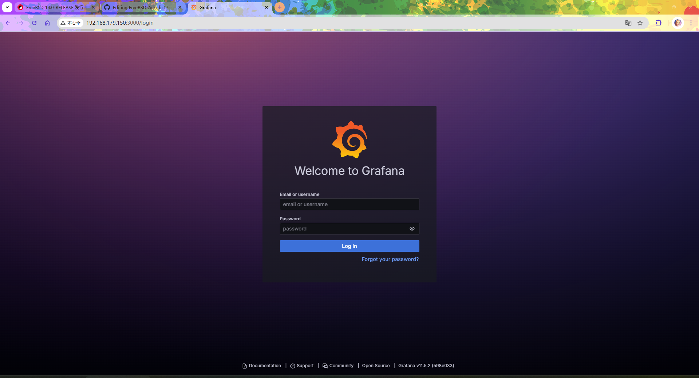
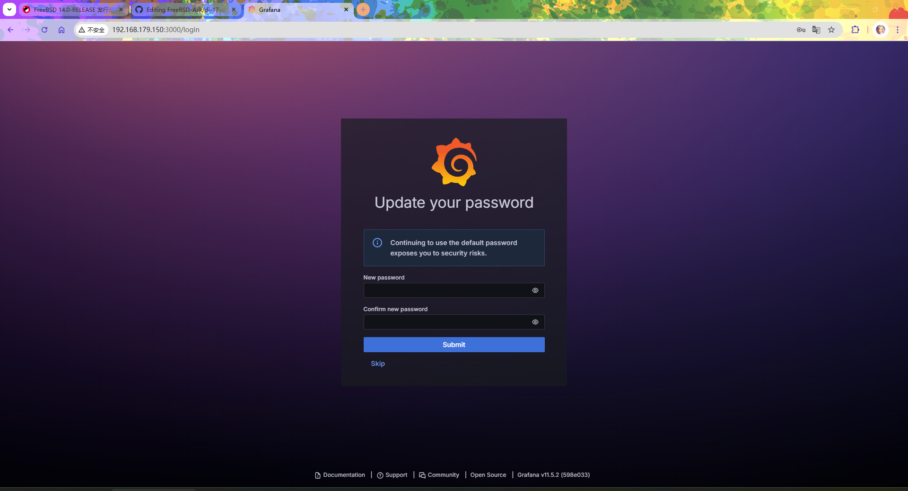
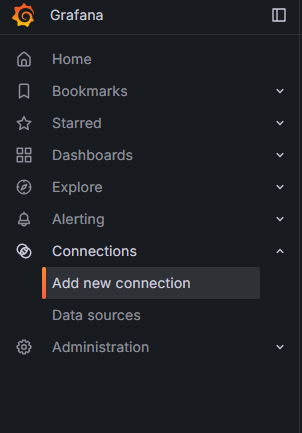
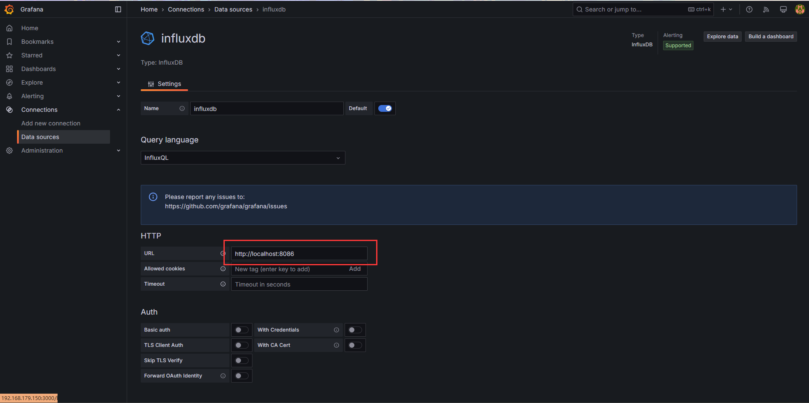
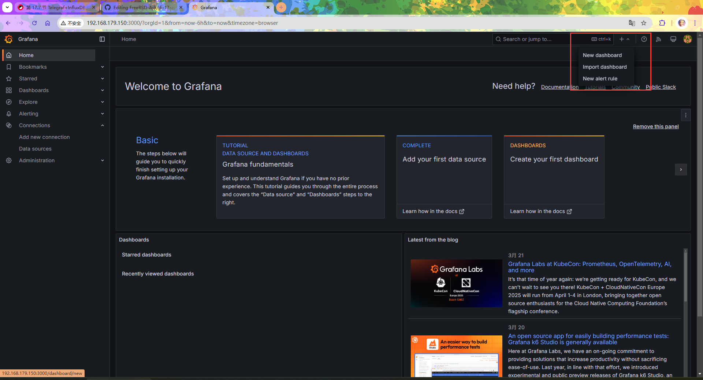
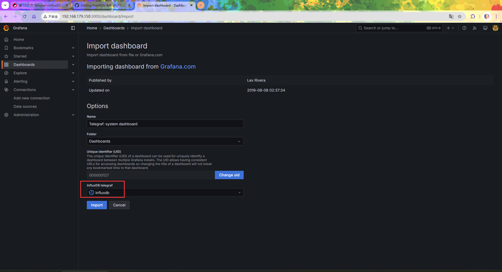
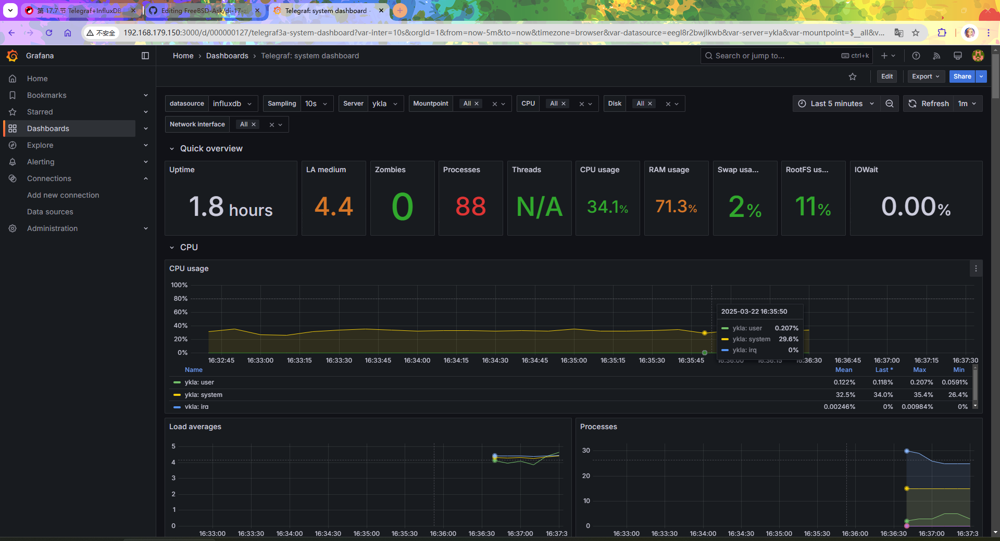

# 39.3 Telegraf, InfluxDB, and Grafana Monitoring Platform Architecture

System monitoring is the foundation of operations management and performance optimization. Through real-time collection, storage, and visualization of system metrics, it enables early fault detection, performance analysis, and capacity planning.

This architecture belongs to the TIG technology stack (Telegraf, InfluxDB, Grafana), which is an open-source monitoring platform system that follows the design principle of separating data collection, storage, and visualization.

Among them, InfluxDB serves as the time-series database responsible for efficiently storing monitoring data, Telegraf serves as the plugin-based collection agent responsible for metric collection, and Grafana provides visualization capabilities.

## InfluxDB Installation and Configuration

InfluxDB is an open-source database for storing and analyzing time-series data. The version available in FreeBSD Ports is 1.8.10, which is still usable, but InfluxData officially recommends that users migrate to InfluxDB 3.x. The InfluxDB OSS v1 mainline is still in maintenance status, with the latest version being v1.12.x.

### Installing InfluxDB

Install using the pkg package manager:

```sh
# pkg install influxdb
```

Or install using the Ports method:

```sh
# cd /usr/ports/databases/influxdb/
# make install clean
```

### Service Management

After installation, you need to configure the InfluxDB service to start automatically at system boot and start the service.

Configure the InfluxDB service to start automatically at system boot:

```sh
# service influxd enable
```

Start the InfluxDB service:

```sh
# service influxd start
```

### Modifying InfluxDB Configuration

If you need to customize the configuration, you can modify the InfluxDB configuration file **/usr/local/etc/influxd.conf**.

After modification, restart the InfluxDB service:

```sh
# service influxd restart
```

### Creating an InfluxDB Database

You need to create a database and user in InfluxDB for Telegraf.

```sql
# influx # Connect to the InfluxDB database
Connected to http://localhost:8086 version 1.8.10
InfluxDB shell version: 1.8.10
> CREATE DATABASE mydb -- Create an InfluxDB database
> CREATE USER username WITH PASSWORD 'password' -- Create a database user and password; here the username is username and the password is password
> SHOW DATABASES -- View databases
name: databases
name
----
_internal
mydb
>
> quit -- Exit the InfluxDB shell
```

> **Tip**
>
> The `username` and `password` in the above example are placeholders and must be replaced with actual values.

## Telegraf

Telegraf is an agent for collecting and reporting metrics.

### Installing Telegraf

Install using the pkg package manager:

```sh
# pkg install telegraf
```

Or install using the Ports method:

```sh
# cd /usr/ports/net-mgmt/telegraf/
# make install clean
```

### Adding to Startup

After installation, you need to configure the Telegraf service to start automatically at system boot.

Configure the Telegraf service to start automatically at system boot:

```sh
# service telegraf enable
```

Do not start the Telegraf service at this time.

### Configuring the InfluxDB Connection

Directory structure:

```sh
/usr/local/
└── etc/
    ├── influxd.conf              # InfluxDB configuration file
    └── telegraf.conf             # Telegraf configuration file
```

You need to configure Telegraf to send the collected data to InfluxDB. This section uses InfluxDB version 1.8.

Make the following modifications in the configuration file **/usr/local/etc/telegraf.conf**:

```ini
# Configure InfluxDB connection information (must match the database account and password created above)
[[outputs.influxdb]]        # Output plugin type is InfluxDB
  urls = ["http://127.0.0.1:8086"]  # InfluxDB service address
  database = "mydb"                 # Database name to write to
  username = "username"             # Database username
  password = "password"             # Database password
```

### Configuring Collection Metrics

You need to configure Telegraf's collection metrics. The configuration file path is **/usr/local/etc/telegraf.conf**:

Here we collect system metrics such as CPU, disk, disk IO, memory, and swap. The following is part of the Telegraf configuration file, where some parameters are enabled by default and some need to be manually uncommented.

```ini
# CPU
[[inputs.cpu]]

# Memory
[[inputs.mem]]

# swap
[[inputs.swap]]

# Disk
[[inputs.disk]]
  ignore_fs = ["tmpfs", "devtmpfs", "devfs", "iso9660", "overlay", "aufs", "squashfs"]

# Disk IO
[[inputs.diskio]]

# Processes
[[inputs.processes]]

# System (uptime, etc.)
[[inputs.system]]

# Network
[[inputs.net]]
```

### Starting the Service

After all configurations are complete, you can start the Telegraf service to begin collecting data.

Start the Telegraf service:

```sh
# service telegraf start
```

## Grafana

Grafana is an open-source data visualization and monitoring platform that can display data from data sources such as InfluxDB in chart form.

### Installing Grafana

Install using the pkg package manager:

```sh
# pkg install grafana
```

Install Grafana using the Ports method:

```sh
# cd /usr/ports/www/grafana/
# make install clean
```

### Daemons

After installation, you need to configure the Grafana service to start automatically at system boot and start the service.

Configure the Grafana service to start automatically at system boot:

```sh
# service grafana enable
```

Start the Grafana service:

```sh
# service grafana start
```

### Logging In to Grafana

After the Grafana service starts, you can access its web interface through a browser for configuration. The default Grafana login address is `http://localhost:3000`.



- Default login username and password:
  - Username: `admin`
  - Password: `admin`



After logging in, the system will prompt you to change the password.

> **Note**
>
> The above configuration is suitable for local development and testing environments. For production environments, it is recommended to enable TLS encryption for communication between components: the Telegraf output plugin supports HTTPS, Grafana should be configured with TLS certificates, and InfluxDB should be configured with HTTPS endpoints.

### Configuring the Data Source

You need to configure a data source in Grafana to read data from InfluxDB.

- After logging in, click **Connections** in the upper left corner -> select **Add new connection**



- Enter `InfluxDB` in the search box on the right -> select **InfluxDB** from the search results and click


- Click the **Add new data source** button in the upper right corner -> configure the InfluxDB-related content.


- Fill in the relevant InfluxDB connection information on the data source configuration page. The content to be configured is as follows:

> **Note**
>
> The InfluxDB version used above is 1.8, so the query language must be set to `InfluxQL` (the default option)

Enter `URL`: `http://localhost:8086`.



In the data source configuration, enter `mydb` for Database, `username` for User, and `password` for Password (these values were set when creating the InfluxDB database).


Click the `Save & Test` button to save the configuration. It will show that the connection is successful and data has been retrieved:


### Configuring the Dashboard

After the data source is configured, you can configure a Dashboard to visually display monitoring data. You can develop your own Dashboard or use community-contributed dashboard resources from the [official template library](https://grafana.com/grafana/dashboards/).

Here we import the template with id [928](https://grafana.com/grafana/dashboards/928-telegraf-system-dashboard/), which is specifically designed for Telegraf system monitoring and displays system metrics.

- To import a template, click `+` in the upper right corner -> `Import dashboard` to enter the import template page.



- Select the template with `id` `928` to import, enter `928`, then click "Load".


Select the database.



- Final template result



### Setting Chinese Language

Navigate to Home -> Administration -> General -> Default preferences -> Language, and select "Simplified Chinese".


## Troubleshooting and Outstanding Issues

### Kernel, Network, and CPU Information Not Displayed

Telegraf on FreeBSD uses the gopsutil library to collect system metrics through native interfaces such as sysctl, and does not depend on the Linux `/proc` file system. If some metrics are not displayed, check whether the corresponding input plugin is enabled in the configuration file and whether the Telegraf process has sufficient permissions to access the relevant sysctl variables.

## References

- InfluxData. InfluxDB 1.x Documentation[EB/OL]. [2026-04-17]. <https://docs.influxdata.com/influxdb/v1/>. Official InfluxDB 1.x documentation, covering installation, configuration, and query syntax.
- InfluxData. InfluxDB 1.8 Release Notes[EB/OL]. [2026-04-17]. <https://docs.influxdata.com/influxdb/v1.8/about_the_project/releasenotes-changelog/>. Documents the final version v1.8.10 (released in 2021) of the InfluxDB 1.8 series; the v1.8 series is no longer maintained, but the v1 mainline continues to be updated.
- InfluxData. Telegraf 1.26 Configuration[EB/OL]. [2026-03-26]. <https://docs.influxdata.com/telegraf/v1.26/configuration/>. Provides complete Telegraf configuration parameters and plugin usage instructions.
