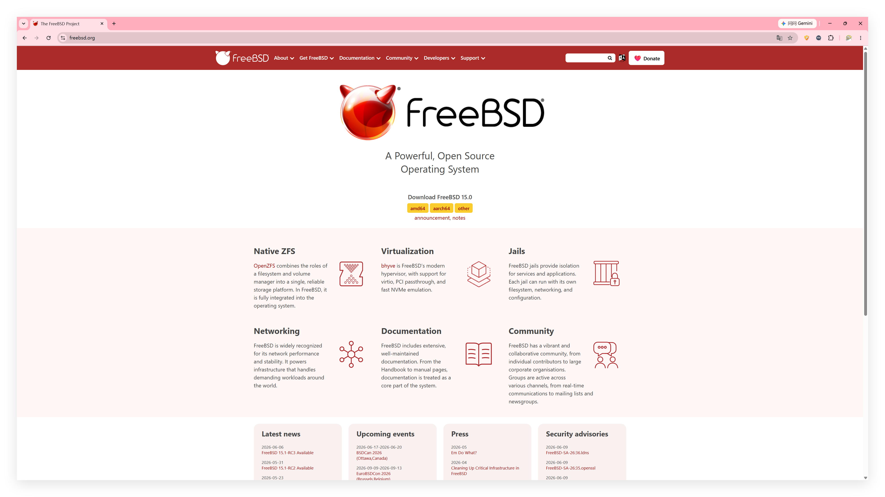
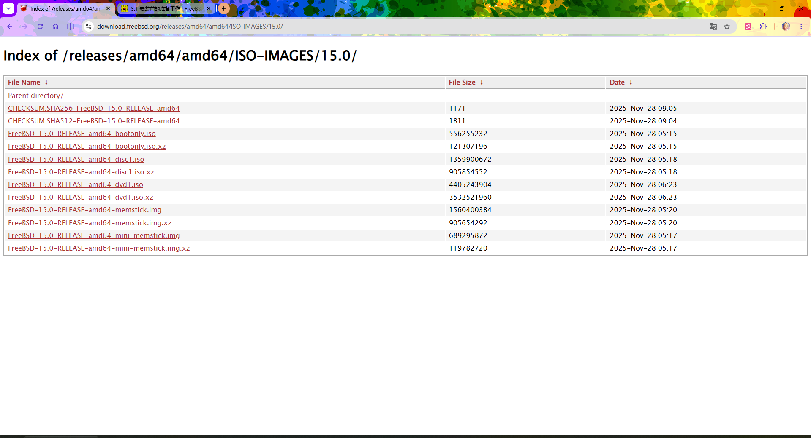
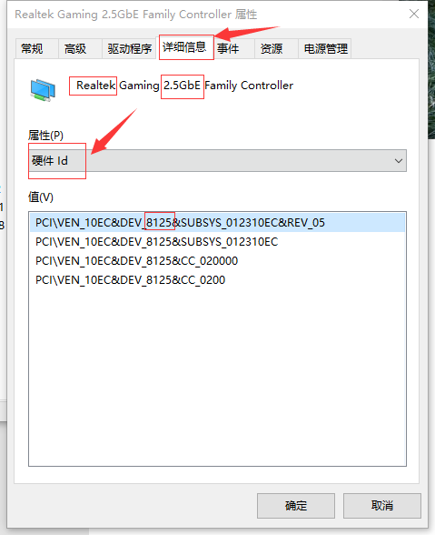

# 4.1 Pre-installation Preparation

Before deploying the FreeBSD system, preliminary work such as hardware compatibility assessment, installation media preparation and creation must be completed.

## Hardware Compatibility

The following lists the minimum hardware requirements and hardware compatibility query methods for the amd64 architecture.

### Minimum Hardware Requirements

amd64 (also known as x86-64) is an extension of the 64-bit x86 architecture, widely used in modern personal computers and servers. The minimum hardware requirements measured in a virtual machine environment for the 15.0-RELEASE version are as follows:

| Category | Scenario/Mode | Minimum Requirement |
| -------- | ------------- | ------------------- |
| Hard disk | Basic system installation only | Approximately 550 MB |
| Hard disk | KDE desktop environment installation (after installing via pkg) | Approximately 15 GB |
| Memory | UEFI mode | 256 MB |
| Memory | BIOS mode | 96 MB |
| Memory | ZFS file system (minimum) | 2 GB |

However, the above are theoretical minimum values for starting the installer; to ensure basic system usability, the actual memory capacity should be no less than 256 MB.

If you intend to use ZFS as the file system, the OpenZFS project officially recommends that the device should have at least 2 GB of memory (8 GB or more is recommended for optimal performance). When memory is below this value, manual tuning of ZFS parameters may be required.

### Measured Hardware Compatibility

The following table lists the measured support status of some hardware:

| Hardware Category | Series | Measured Model | Notes |
| ----------------- | ------ | -------------- | ----- |
| CPU | Intel Alder Lake (including hybrid architecture and pure E-core architecture) | i7-1260P, N100 | Can boot and run normally, but the scheduling mechanism is not yet mature, and turbo boost functionality is limited. i7-1260P is a hybrid architecture (P-core + E-core), N100 is a pure E-core architecture (4 Gracemont cores) |
| NVMe SSD | M.2 interface | Crucial P310, Intel 600P, Fanxiang S530Q, S500Pro, S542PRO | Works normally |
| Wireless network card | Intel AX series | AX200 | Wi-Fi 5 speed is comparable to Windows 11 IoT Enterprise 24H2 (measured using iperf2) |
| Wired network card | Realtek 2.5 G | RTL8125B | Requires additional driver installation, see the appendix of this book |
| Wired network card | Intel 2.5 G | i226-V | Works normally |
| Graphics card | Intel and AMD integrated/discrete graphics cards from the past decade | Intel Iris Xe Graphics, Intel HD Graphics 4000 | Support level is related to DRM driver porting progress; the drm-kmod meta Port automatically selects the appropriate driver based on the system version: install drm-61-kmod (based on Linux 6.1) on FreeBSD 14.x, install drm-66-kmod (based on Linux 6.6) on FreeBSD 15.0-RELEASE and later versions, and install drm-612-kmod (based on Linux 6.12) on newer FreeBSD 15-STABLE. Users can also manually install drm-latest-kmod (tracking the latest Linux DRM development version, based on Linux 6.12, suitable for newer FreeBSD 15 and FreeBSD 16). |
| NVIDIA graphics card | Graphics cards from the past decade or more | GTX 850M | Supported by NVIDIA's official graphics card driver |

> **Note**
>
> FreeBSD supports Secure Boot, but requires users to manually configure keys and sign boot components, which is not yet ready for out-of-the-box use. Before installing FreeBSD, it is recommended to disable Secure Boot. Additionally, FreeBSD does not support Fake RAID; the controller mode must be changed to AHCI.
>
> Fake RAID is a software RAID function provided by the motherboard BIOS/firmware, which depends on operating system driver support and is not true hardware RAID. AHCI (Advanced Host Controller Interface) is the standard operating mode for SATA controllers, providing native support for advanced features of SATA devices.
>
> How to operate: Enter the BIOS/UEFI setup interface, find the storage controller-related options, change the mode from RAID to AHCI, then save and restart. The specific menu location varies by motherboard model; refer to the motherboard manual.

#### References

- FreeBSD Project. drm-kmod: drm driver for FreeBSD[EB/OL]. [2026-06-05]. <https://github.com/freebsd/drm-kmod>. This repository provides FreeBSD graphics driver kernel module updates, tracking the progress of Linux DRM driver porting.
- FreeBSD Project. SecureBoot[EB/OL]. [2026-03-25]. <https://wiki.freebsd.org/SecureBoot>. This page provides FreeBSD Secure Boot-related status information.

### Specific Hardware Compatibility Query

In addition to the hardware measured above, the support status of more hardware can be found in the following external resources.

[bsd-hardware.info. Hardware for BSD](https://bsd-hardware.info/?view=search) This platform provides a BSD system hardware compatibility database that can be used to query device support status.


> **Note**
>
> Because this website may also contain errors (for example, misidentifying LPDDR5 as LPDDR4), actual testing is recommended.

## Downloading FreeBSD Images

After understanding the hardware support status, begin downloading the FreeBSD image. First, visit the FreeBSD project official website: <https://www.freebsd.org/>.



Click on the `amd64` text in yellow background with red text, and the page will redirect to the download page:

> **Tip**
>
> As time passes, the 15.0-RELEASE version may no longer be available when readers download it. In this case, simply select the topmost `FreeBSD-X.Y-RELEASE` in the list (this version is recommended for production environments). Here, `X.Y` should be a version number larger than `15.0`, such as `15.1`, `16.0`, etc.



```sh
File Name                                          File Size      Date
Parent directory/                                  -              -
CHECKSUM.SHA256-FreeBSD-15.0-RELEASE-amd64	1171	2025-Nov-28 09:05
CHECKSUM.SHA512-FreeBSD-15.0-RELEASE-amd64	1811	2025-Nov-28 09:04
FreeBSD-15.0-RELEASE-amd64-bootonly.iso	556255232	2025-Nov-28 05:15
FreeBSD-15.0-RELEASE-amd64-bootonly.iso.xz	121307196	2025-Nov-28 05:15
FreeBSD-15.0-RELEASE-amd64-disc1.iso	1359900672	2025-Nov-28 05:18
FreeBSD-15.0-RELEASE-amd64-disc1.iso.xz	905854552	2025-Nov-28 05:18
FreeBSD-15.0-RELEASE-amd64-dvd1.iso	4405243904	2025-Nov-28 06:23
FreeBSD-15.0-RELEASE-amd64-dvd1.iso.xz	3532521960	2025-Nov-28 06:23
FreeBSD-15.0-RELEASE-amd64-memstick.img	1560400384	2025-Nov-28 05:20
FreeBSD-15.0-RELEASE-amd64-memstick.img.xz	905654292	2025-Nov-28 05:20
FreeBSD-15.0-RELEASE-amd64-mini-memstick.img	689295872	2025-Nov-28 05:17
FreeBSD-15.0-RELEASE-amd64-mini-memstick.img.xz	119782720	2025-Nov-28 05:17
```

In the above list: the first row shows the file name, file size, and file build date (not the release date), and the second row is for navigating back to the parent directory.

| First Column | Description |
| ------------ | ----------- |
| CHECKSUM.SHA256-FreeBSD-15.0-RELEASE-amd64 | SHA-256 checksums for all images on this page |
| CHECKSUM.SHA512-FreeBSD-15.0-RELEASE-amd64 | SHA-512 checksums for all images on this page |
| FreeBSD-15.0-RELEASE-amd64-bootonly.iso | Network installation image, requires internet connection during installation |
| FreeBSD-15.0-RELEASE-amd64-bootonly.iso.xz | Compressed network installation image, requires internet connection during installation |
| FreeBSD-15.0-RELEASE-amd64-disc1.iso | Standard installation image |
| FreeBSD-15.0-RELEASE-amd64-disc1.iso.xz | Compressed standard installation image |
| FreeBSD-15.0-RELEASE-amd64-dvd1.iso | DVD image, includes more software packages (pkg) than the standard installation image |
| FreeBSD-15.0-RELEASE-amd64-dvd1.iso.xz | Compressed DVD image, includes more software packages (pkg) than the standard installation image |
| FreeBSD-15.0-RELEASE-amd64-memstick.img | Image for USB flash drives (can use Rufus to create a USB boot drive) |
| FreeBSD-15.0-RELEASE-amd64-memstick.img.xz | Compressed image for USB flash drives (no decompression needed, can use Rufus to create a USB boot drive) |
| FreeBSD-15.0-RELEASE-amd64-mini-memstick.img | Network installation image for USB flash drives, requires internet connection during installation |
| FreeBSD-15.0-RELEASE-amd64-mini-memstick.img.xz | Compressed network installation image for USB flash drives, requires internet connection during installation |

- **.xz** is a high-compression-ratio file compression format, commonly used to reduce the size of software distribution packages.
- **SHA-256** and **SHA-512** are cryptographic hash functions used to generate unique fingerprints for files. A checksum is a fixed-length string calculated through these functions, used to verify file integrity.

> **Tip**
>
> Network transmission may produce errors, causing the downloaded file to be inconsistent with the original image. Therefore, you need to use **checksums** to verify that the obtained file is completely identical to the officially released image. Windows 10 and 11 systems include the command-line tool CertUtil, which can be used to calculate checksums without installing additional software.

It should be noted that the DVD image only contains some offline software packages, not all of them. For the specific list, see the source code file **release/scripts/pkg-stage.sh**, which defines the list of pre-installed software packages included in the DVD image.

All FreeBSD installation media do not provide a graphical interface by default; it must be installed and configured separately after system installation. Although the DVD image contains more software packages, due to the complex dependencies of graphical interfaces and the potentially outdated package versions on the DVD, dependency conflicts or version mismatch issues may still be encountered when installing a graphical interface. Therefore, using the DVD image is not recommended.

## Development Versions and Non-amd64 Architectures

STABLE and CURRENT are both development branches and are not suitable for production environments; production environments should use RELEASE.

To use development branches, or to download images for non-amd64 architectures, select "other" on the main page.


> **Warning**
>
> Users of development versions should have the time and willingness to follow development updates, read mailing lists, and check issue tracking systems. This also requires users to possess a certain level of exploration and practical ability. Otherwise, using the RELEASE version is recommended.

| Installer | VM | SD Card | Documentation |
| --------- | -- | ------- | ------------- |
| Installation image | Pre-installed VM image | Storage card image | Documentation |
| For conventional installation | For cloud platforms and virtual machines | For single-board computers/embedded devices | Release notes and other documentation |

> **Tip**
>
> If unsure which image to choose, select `Installer` (for standard personal computers, excluding Apple).

> **Tip**
>
> If unclear about the differences between `amd64`, `aarch64`, `riscv64` and other architectures, select `amd64` (suitable for most standard personal computers, excluding Apple computers).

After selecting the main type of installation image, the specific download list will be displayed.

| Version Type | Deployment Environment | Download URL |
| ------------ | ---------------------- | ------------ |
| RELEASE official version | Virtual machine | <https://download.freebsd.org/releases/amd64/amd64/ISO-IMAGES/15.0/FreeBSD-15.0-RELEASE-amd64-disc1.iso> |
| RELEASE official version | Physical machine | <https://download.freebsd.org/releases/amd64/amd64/ISO-IMAGES/15.0/FreeBSD-15.0-RELEASE-amd64-memstick.img> |
| CURRENT development version (expert users only) | Virtual machine | <https://download.freebsd.org/snapshots/amd64/amd64/ISO-IMAGES/16.0/> |
| CURRENT development version (expert users only) | Physical machine | File names ending with `-amd64-memstick.img` or `-amd64-memstick.img.xz` |

Due to version iteration, the actual situation may have changed; please check on your own and select an appropriate RELEASE version for production environments.

### References

- FreeBSD Project. freebsd-src/UPDATING[EB/OL]. [2026-03-25]. <https://github.com/freebsd/freebsd-src/blob/main/UPDATING>. This file records major changes in system updates.
- FreeBSD Project. freebsd-src/RELNOTES[EB/OL]. [2026-03-25]. <https://github.com/freebsd/freebsd-src/blob/main/RELNOTES>. This file provides release notes and new features documentation for the release.
- Dell Technologies. How to determine the SHA-256 hash of a file for security applications[EB/OL]. [2026-03-25]. <https://www.dell.com/support/kbdoc/zh-cn/000130826/%E5%A6%82%E4%BD%95%E7%A1%AE%E5%AE%9A%E7%94%A8%E4%BA%8E%E5%AE%89%E5%85%A8%E5%BA%94%E7%94%A8%E7%A8%8B%E5%BA%8F%E7%9A%84%E6%96%87%E4%BB%B6-sha-256-%E5%93%88%E5%B8%8C>. This document introduces how to calculate file SHA-256 hash values on Windows systems. Readers may refer to it.

## Burning the FreeBSD Image

After downloading the FreeBSD image, you need to burn it to a USB flash drive before installation.

### Recommended Image Format

When creating a USB installation medium, it is recommended to use the `-img` or `-img.xz` format images. The `.iso` image uses a Hybrid boot mode, which supports booting from both optical drives and USB flash drives, but may not fully comply with UEFI specifications. Writing it directly to a USB flash drive may cause boot errors. See FreeBSD Project. FreeBSD -.iso files not support written to USB drive[EB/OL]. [2026-03-25]. <https://bugs.freebsd.org/bugzilla/show_bug.cgi?id=236786>. This bug report documents the compatibility issues of writing ISO images directly to USB devices. Readers are advised to prefer images ending with `iso` when installing using optical media, virtual machines, or cloud platforms; for physical machine USB flash drive installation, `img` images should be preferred.

However, there are exceptions. Some hosts' UEFI firmware supports booting from USB flash drives burned with `.iso` images (for example, some older Hasee computers), but not all hosts support this method (for example, some Xiaomi computers may not be able to boot).

Due to the variety of device types, even if testing passes on one host, FreeBSD's two ISO images may still have compatibility issues. If you encounter boot issues, please first try burning the `img` image using Rufus.

### Burning Method Using Rufus on Windows

Different operating system platforms have different recommended image burning tools.

For the Windows platform, it is recommended to use **Rufus** first. For Linux/FreeBSD platforms, you can directly use the `dd` command to burn the image: `dd if=FreeBSD-*.img of=/dev/daX bs=1M status=progress` (where **/dev/daX** is the target USB flash drive device, adjust according to the actual device name; `status=progress` displays transfer progress).

The Rufus download URL is <https://rufus.ie/zh>, which is an open-source USB boot drive creation tool for the Windows platform.

When using Rufus to burn an image, there is no need to decompress the file; simply select `-img.xz` to create the boot drive.


Although the image file checksum is actually correct, win32diskimager has defects when processing certain image formats and sometimes incorrectly reports checksum failures. In addition, win32diskimager has not been updated for over 9 years since releasing version 1.0.0 in March 2017; its executable file is not code-signed, it does not support compressed image formats (such as `.img.xz`), and its compatibility in modern UEFI environments is not as good as Rufus and balenaEtcher. Ventoy's boot loading mechanism is not fully compatible with FreeBSD images, which may cause boot failures. Both are **not recommended for use**.

**Readers should prefer using Rufus; if Rufus is not available, balenaEtcher can be used as an alternative.** balenaEtcher is a cross-platform (Windows/macOS/Linux) open-source image burning tool that supports directly burning compressed images (such as `.img.xz`, no decompression needed), automatically verifies data integrity after writing, and is still actively maintained. The balenaEtcher download URL is <https://etcher.balena.io/>.

> **Discussion Question**
>
> > Sometimes taking a detour is necessary. Life is a forest where people will eventually get lost again, meeting briefly. As the saying goes, "Persistent thoughts will surely bring an echo." However, people clearly realize that there is no "surely an echo"; there is only "a beginning without an ending" or "a fleeting pursuit." No one promises an echo; this is merely a philosophical sustenance that allows people to "reconcile" with this reality.
>>
>>The complete explanation of "Persistent thoughts will surely bring an echo" is not from Li Shutong, but originates from a contemporary work, "An Interpretation of Li Shutong's 'Wanqing Collection' on Life" (Wang Shaonong. An Interpretation of Li Shutong's "Wanqing Collection" on Life[M]. Beijing: Thread-bound Book Bureau, 2008.). The first half, "Persistent thoughts," is also not Li Shutong's original work, but appears to quote from Wang Longshu of the Southern Song Dynasty's "Longshu Pure Land Text, Volume 4": "It is because one wishes to keep persistent thoughts. If one persists for a long time, the mind of recitation will mature." In the Qing Dynasty Yu Xingmin's re-edited "Complete Book of the Pure Land," there is a similar description in the "Pure Land Awakening Faith" section: "The Pure Land Guide says: To end the cycle of birth and death, to practice pure karma, one should develop ten kinds of faith, with persistent thoughts, and will surely be born in the Pure Land." Indexing again to the "Collection of Pure Land Guide," it actually loops back to the "Buddha's Sutra of the Four Noble Truths," which records: "Also observing past lives, also attaining the path of practice, reflecting that worldly actions cannot be regretted, gathering, ceasing, transcending the world, non-action, stillness, ceasing views, one virtue, non-attachment, as liberated mind contemplating thoughts, from persistent thoughts, thoughts not forgotten, few words, thoughts not departing, this is called right mindfulness, this is called the noble truth of the path."
>>
>>Since this is Chinese Buddhism, historically recorded as An Shigao's translation contribution, it is necessary to examine its original form. Consulting the "Buddha's Sutra of the Four Noble Truths," it actually corresponds to the "Sutra of Distinguishing the Noble Truths" in the Middle-length Agama, which corresponds to the "Sutra 141 on the Distinction of Truths" in the "Majjhima Nikaya" of the "Pali Canon" (Duan Qing, Fan Jingjing, et al., trans. Chinese Translation of the Pali Canon: Sutta Pitaka: Majjhima Nikaya[M]. Shanghai: Zhongxi Book Bureau, 2022: 963-965.). It reads: "Friends, what is right mindfulness? This means a monk abides contemplating the body in the body, ardent, clearly comprehending, mindful, having removed covetousness and grief for the world; regarding feelings (...); regarding mind (...); abiding contemplating dhammas in dhammas, ardent, clearly comprehending, mindful, having removed covetousness and grief for the world. This is called right mindfulness." It can be clearly seen that "persistent thoughts not forgotten" actually corresponds to "mindful" (Pali: sati), which in literature is often also translated as "recollection" or "right mindfulness."
>>
>>In fact, in any early human religious activity, the ideas transmitted were the most appropriate moral thoughts and ethical behaviors of the time, and also the simplest and clearest. Any overly complex theory could not possibly have been passed down for thousands of years. Therefore, it is necessary to question the rationality of this "persistent thoughts" claim. There are significant differences among different academic viewpoints on this matter, but it is indisputable that in the earliest development of Buddhism, no theory beyond the knowledge structure, moral ethics, and cognitive ability of contemporary believers could have been widely accepted. Therefore, without examining any text, understanding based on experience is often the closest to rationality. "Persistent thoughts not forgotten" is essentially close to the statement: "A chef must know how to cook; water always flows downward," that is, xx is xx. It can be seen that "persistent thoughts" resonates deeply with contemporary continental philosophy—not returning things to themselves, but recognizing that sometimes, things simply are themselves. "The greatest sound is barely audible." "All true history is contemporary history" (Croce B. Theory and History of Historiography[M]. Tian Shigang, trans. Beijing: China Social Sciences Press, 2018), but whether it is Xuanzang's short-lived "Dharma Characteristic Only-Consciousness School" or the original meaning of "persistent thoughts," both reveal a profound truth: "All true history is ancient history." "Whoever attempts to interpret history is tampering with history. Discussing truth or falsehood is nothing more than fighting for one's own discourse power." Historiography is a hermeneutics. The classical Chinese presentation of Buddhist sutras and Taoist scriptures remains absolutely dominant, and there is no definitive edition; meanwhile, the Christian Two Associations have even published an official "Pinyin Version of the Bible." But in the past, and even now in Catholicism, conservatism is the norm. The balance between formal refinement, modernization, and internal theoretical evolution is a pain point for most theoretical development. Have later generations' classical interpretations of predecessors formed layer upon layer of obscuration, or have they refined them to conform to the development of the times? How much of what people today see and hold as opinions truly reflects the original author's views? Later generations often expound their own views through annotating classics, and even write books under pseudonyms.
>>
>>"Persistent thoughts not forgotten" happens to point out a principle: "No echo is the norm." This is not stubborn persistence and repetition, but understanding that a phrase mentioned by countless people—humans are born with nothing, and the only important thing is life or death. "Persistent thoughts not forgotten" is not an obsession with remembering, but a discovery: whatever is perceived, that is what it is. Rather than saying that a person spends their whole life choosing, it is better to say that a person spends their whole life waiting, waiting for an echo.
>
>
> How do you understand the relationship between "persistent thoughts" and "there will surely be an echo"?
>
> If everything is temporary and fleeting. Then, could there be a day, a moment, when the universe itself no longer exists?

## Appendix: FreeBSD-Compatible Ethernet Cards

FreeBSD has good support for various Ethernet cards.

### Realtek (Crab Card)

The Realtek RTL8125 is a common 2.5 G Ethernet card. In the consumer market, most common 2.5 G network cards use this model chip. Before installing FreeBSD, you can check the hardware identifier in the Windows Device Manager to confirm whether the network card model is RTL8125.



> **Tip**
>
> The RTL8125 does not have a default driver under FreeBSD and must be installed manually. The simplest method is to temporarily connect to the internet via USB tethering from a mobile phone; for specific methods, see other parts of this book. After installing the network card driver, you must restart the system.

#### Realtek Ethernet Card Driver Installation Method

After confirming that the network card model is on the support list, follow these steps to install the driver.

- Install using pkg:

```sh
# pkg install realtek-re-kmod
```

- Install using Ports:

```sh
# cd /usr/ports/net/realtek-re-kmod/
# make install clean
```

When compiling and installing, ensure that the source code is present in the **/usr/src** directory.

```sh
/usr/
├── ports/
│   └── net/
│       └── realtek-re-kmod/  # Realtek network card driver Ports directory
└── src/                      # System source code directory (required when compiling drivers)
```

> **Tip**
>
> If the Realtek network card still experiences disconnections or intermittent connectivity, try using Port **net/realtek-re-kmod198** as a replacement for **realtek-re-kmod**.

Related file structure:

```sh
/boot/
├── loader.conf        # System boot loader configuration file
└── modules/
    └── if_re.ko       # re network card driver kernel module
```

Edit the **/boot/loader.conf** file and write the following two lines:

```ini
if_re_load="YES"                        # Set to automatically load the re network card driver module at boot
if_re_name="/boot/modules/if_re.ko"     # Specify the full path of the re network card driver module to override the built-in re(4) driver
```

By default, a buffer large enough to receive jumbo frames is allocated. Jumbo frames are frames larger than the standard Ethernet frame (1500 bytes), typically 9000 bytes. Jumbo frames can reduce network overhead and improve transmission efficiency, but may cause compatibility issues in some network environments. The re network card-related configuration parameters are as follows:

| Parameter | Recommended Value | Function |
| --------- | ----------------- | -------- |
| `hw.re.max_rx_mbuf_sz` | `2048` | Reduce receive buffer size, lower memory requirements, avoid driver hangs caused by memory fragmentation |
| `hw.re.s5wol` | `1` | Enable S5 sleep wake |
| `hw.re.s0_magic_packet` | `1` | Enable magic packet wake (Wake-on-LAN) |

The configuration method is to use `sysrc` to write the parameters to **/boot/loader.conf**, for example:

```sh
# sysrc -f /boot/loader.conf hw.re.max_rx_mbuf_sz="2048"
# sysrc -f /boot/loader.conf hw.re.s5wol="1"
# sysrc -f /boot/loader.conf hw.re.s0_magic_packet="1"
```

After completing the above settings, you must restart the system for them to take effect.

References:

- FreshPorts. realtek-re-kmod: Kernel driver for Realtek PCIe Ethernet Controllers[EB/OL]. [2026-03-25]. <https://www.freshports.org/net/realtek-re-kmod>. The Realtek network card driver page on FreshPorts, providing installation information and version updates.
- Bug 275882 - **net/realtek-re-kmod**: Problem with checksum offload since +199.00[EB/OL]. [2026-03-26]. <https://bugs.freebsd.org/bugzilla/show_bug.cgi?id=275882>.

### Intel Network Cards

Intel network cards are also a common type of network adapter, and FreeBSD has good support for them.

#### 2.5 G

Intel i225-V and i226-V 2.5 G network cards can be driven by default without additional configuration. Tested on the I226-V rev04 model, using the `igc` driver, the network card appears as `igc0`.

References:

- FreeBSD Project. igc: Intel Ethernet Controller I225 driver[EB/OL]. [2026-03-25]. <https://man.freebsd.org/cgi/man.cgi?query=igc&sektion=4>. Manual page, detailing the usage of Intel I225/I226 series network card drivers.

#### Gigabit, Fast Ethernet, and Other Ethernet Cards

In addition to 2.5 G network cards, Intel has various other models of Ethernet cards. The i210 and i211 network cards are driven by igb and can usually be used without additional configuration, but have not been actually tested.

Support list and more details:

- FreeBSD Project. em, lem, igb: Intel(R) PRO/1000 Gigabit Ethernet adapter driver[EB/OL]. [2026-03-25]. <https://man.freebsd.org/cgi/man.cgi?query=em&sektion=4>. Manual page, containing Intel PRO/1000 series gigabit network card driver documentation.

## Appendix: USB Network Card Recommendations

USB network cards are highly portable and convenient to use, suitable for temporary use or when devices lack built-in network cards. The following introduces related USB network card recommendations.

> **Warning**
>
> Gigabit and 2.5 G network cards both experienced intermittent disconnection issues prior to 15.0-RELEASE. If there are more stable recommendations, please submit a PR.
>
> For 2.5 G USB network cards, the currently available models are only RTL8156 and RTL8156B.

| Type | Brand/Model | Chipset/Parameters | Notes |
| ---- | ----------- | ------------------ | ----- |
| USB Ethernet card | UGREEN USB Fast Ethernet card CR110 | AX88772A 100M | / |
| USB Ethernet card | UGREEN USB Gigabit network card CM209 | AX88179A 1000M | Disconnections prior to 15.0-RELEASE |
| Type-C Ethernet card | UGREEN Type-C to Fast Ethernet card 30287 | AX88772A 100M | / |
| Type-C Ethernet card | UGREEN Type-C to Gigabit network card CM199 | AX88179A 1000M | Disconnections prior to 15.0-RELEASE. Testing on Raspberry Pi 5 shows that AX88179A and RTL8156B network cards under 15.0-RELEASE can now run continuously and stably without disconnections, with the longest continuous running time exceeding 72 hours |
| USB wireless network card | COMFAST CF-WU810N (discontinued) | RTL8188EUS 2.4 G 150 M | Driven by rtwn |
| USB wireless network card | COMFAST CF-912AC | RTL8812AU 2.4 G & 5 G 1200 M | Driven by rtwn |
| USB wireless network card | COMFAST CF-915AC | RTL8811AU 2.4 G & 5 G 600 M | Driven by rtwn, theoretically supported, not actually tested, please submit an issue regardless of whether it is supported or not |
| USB wireless network card | UGREEN N300 M | RTL8192EU 2.4 G 300 M | Driven by rtwn, theoretically supported, not actually tested, please submit an issue regardless of whether it is supported or not |
| USB wireless network card | UGREEN AC 1300 M-Dual Band | RTL8812AU 2.4 G & 5 G 1300 M | Driven by rtwn, theoretically supported, not actually tested, please submit an issue regardless of whether it is supported or not |
| USB Ethernet card | UGREEN USB 2.5 G network card CM275 | RTL8156 2.5 G | Disconnections prior to 15.0-RELEASE |
| Type-C Ethernet card | UGREEN Type-C to 2.5 G network card | RTL8156 2.5 G | Disconnections prior to 15.0-RELEASE |

VendorID and ProductID are two standard identifiers for USB/PCI devices; drivers use these two IDs to identify and match hardware.

Hardware with the same chipset may be produced by different manufacturers using different VendorID/ProductID combinations.

If you purchase a network card based solely on chipset information, FreeBSD may not support its `VendorID` and `ProductID`, for example, DOREWIN.

In this case, you need to contact the driver developer to add the hardware information to the driver and recompile the kernel before it can be used.

Related bug reports:

- FreeBSD Bugzilla. Bug 166724 - if_re(4): watchdog timeout[EB/OL]. [2026-03-25]. <https://bugs.freebsd.org/bugzilla/show_bug.cgi?id=166724>. A historical bug report documenting the Realtek network card driver watchdog timeout issue.
- FreeBSD Bugzilla. Bug 267514 - AXGE(4) ASIX AX88179A ue0: link state changed to DOWN[EB/OL]. [2026-03-25]. <https://bugs.freebsd.org/bugzilla/show_bug.cgi?id=267514>. A bug report documenting the ASIX USB gigabit network card connection instability issue.
- FreeBSD Project. if_re(4) -- Realtek PCI Ethernet driver[EB/OL]. [2026-04-17]. <https://man.freebsd.org/cgi/man.cgi?query=if_re&sektion=4>. Realtek PCI Ethernet card driver manual page.
- FreeBSD Project. axge(4) -- ASIX USB Gigabit Ethernet driver[EB/OL]. [2026-04-17]. <https://man.freebsd.org/cgi/man.cgi?query=axge&sektion=4>. ASIX USB gigabit network card driver manual page.
- FreeBSD Project. rtwn(4) -- Realtek USB IEEE 802.11 wireless network driver[EB/OL]. [2026-04-17]. <https://man.freebsd.org/cgi/man.cgi?query=rtwn&sektion=4>. Realtek USB wireless network card driver manual page.
- FreeBSD Project. igb(4) -- Intel PRO/1000 Gigabit Ethernet adapter driver[EB/OL]. [2026-04-17]. <https://man.freebsd.org/cgi/man.cgi?query=igb&sektion=4>. Intel PRO/1000 gigabit network card driver manual page.
- FreeBSD Project. pciconf(8) -- PCI configuration utility[EB/OL]. [2026-04-17]. <https://man.freebsd.org/cgi/man.cgi?query=pciconf&sektion=8>. PCI device configuration utility manual page.
- FreeBSD Project. usbconfig(8) -- USB configuration utility[EB/OL]. [2026-04-17]. <https://man.freebsd.org/cgi/man.cgi?query=usbconfig&sektion=8>. USB device configuration utility manual page.

## Appendix: Sharing Hardware Data to a Database

If readers wish to upload their data to <https://bsd-hardware.info> to share with the community, follow the instructions in this section.

### Installing hw-probe

- Install hw-probe using pkg:

```sh
# pkg install hw-probe
```

- Or install hw-probe using Ports:

```sh
# cd /usr/ports/sysutils/hw-probe/
# make install clean
```

### Uploading Hardware Data

Execute the following command to collect hardware information and upload it to the hw-probe database:

```sh
# hw-probe -all -upload
Probe for hardware ... Ok
Reading logs ... Ok
Uploaded to DB, Thank you!

Probe URL: https://bsd-hardware.info/?probe=f64606c4b1
```

Visit the above link to view device information. The uploaded data here is the configuration information of the Radxa x4.

For other operating systems, see linuxhw. hw-probe/INSTALL.BSD.md[EB/OL]. [2026-03-25]. <https://github.com/linuxhw/hw-probe/blob/master/INSTALL.BSD.md>, which provides installation instructions for the hw-probe tool on BSD systems.

## Appendix: Image Resources

FreeBSD `-RELEASE` historical version download URLs:

| Version Range | Download URL |
| ------------- | ------------ |
| 5.1-RELEASE to 9.2-RELEASE | <http://ftp-archive.freebsd.org/pub/FreeBSD-Archive/old-releases/amd64/ISO-IMAGES> |
| 9.3-RELEASE to the latest `-RELEASE` version | <http://ftp-archive.freebsd.org/pub/FreeBSD-Archive/old-releases/amd64/amd64/ISO-IMAGES/> |

FreeBSD image BitTorrent download URL (unofficial, recommended to verify file checksums before use): <https://fosstorrents.com/distributions/freebsd/>
