# 4.2 FreeBSD 15 Installation Guide (AMD64)

FreeBSD 15.0-RELEASE is installed using the bsdinstall tool, with the process covering disk partitioning, network configuration, system component selection, and user account creation. This section uses the AMD64 architecture disc1.iso image as an example, documenting the complete operation from system boot to first login.

> **Note**
>
> The content of this section is based on the author's actual operation records in specific hardware and virtualization environments. Some conclusions (such as memory thresholds, timeout durations, and failure symptoms) come from personal testing experience and may differ across different hardware configurations or subsequent versions. Analysis involving source code behavior is based on the FreeBSD 15.0-RELEASE release version source code.

The following installation instructions are based on `FreeBSD-15.0-RELEASE-amd64-disc1.iso`. The installation process for `-dvd1.iso` and `-memstick.img` is similar.

> **Note**
>
> This section is demonstrated using VMware Workstation Pro 17 (with UEFI), and has been tested on VMware Workstation Pro 26H1.
>
> If installing on a physical machine, consider using the Rufus <https://rufus.ie/> tool with the <https://download.freebsd.org/releases/amd64/amd64/ISO-IMAGES/15.0/FreeBSD-15.0-RELEASE-amd64-memstick.img> image for burning. This file is the USB installation image for FreeBSD 15.0-RELEASE amd64 architecture. Rufus is a third-party tool whose interface may change with version updates; the image file path is subject to the FreeBSD official release page. This recommendation is based on the tool version and image release status as of March 2026.

## Booting the Installation Disk

After completing the preliminary preparation, boot the system from the installation disk to enter the system installation program.

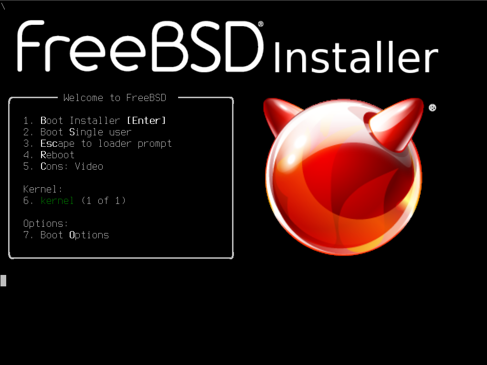

No action is required on this screen; wait ten seconds to automatically enter `1. Boot Installer [Enter]`, or press **Enter** directly.

If you press any other key, the boot process will pause. You can then press a number key to continue, or press **ESC** to enter the **OK prompt**.

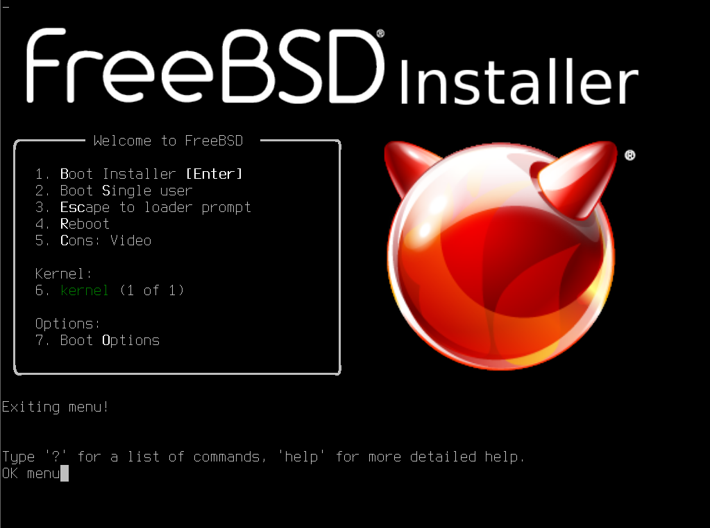

On this screen, type `menu` and press **Enter** to return to the main menu. Type `?` to view all available commands.

Operation method: Press the number key at the beginning of the option to select it. In the status column of the boot menu options, `on` means enabled, and `off` means disabled.

| Option | Explanation |
| ------ | ----------- |
| `1. Boot Installer [Enter]` | Used to install the system |
| `2. Boot Single user` | Single-user mode, used to recover the root password or repair disks. If the `secure_console` option in security hardening is enabled, entering single-user mode still requires the root password. This function is only available with physical access or a remote console (such as IPMI/IP-KVM) |
| `3. Escape to loader prompt` | Exit the menu and enter the loader command line; type `reboot` and press Enter to restart the system |
| `4. Reboot` | Restart |
| `5. Cons: Video` | Select console output mode: Video (`Video`), Serial (`Serial`), Dual mode with serial primary (`Dual (Serial primary)`), or Dual mode with video primary (`Dual (Video primary)`) |
| `6. kernel (1 of 1)` | Select the kernel to boot |
| `7. Boot Options` | Boot options |

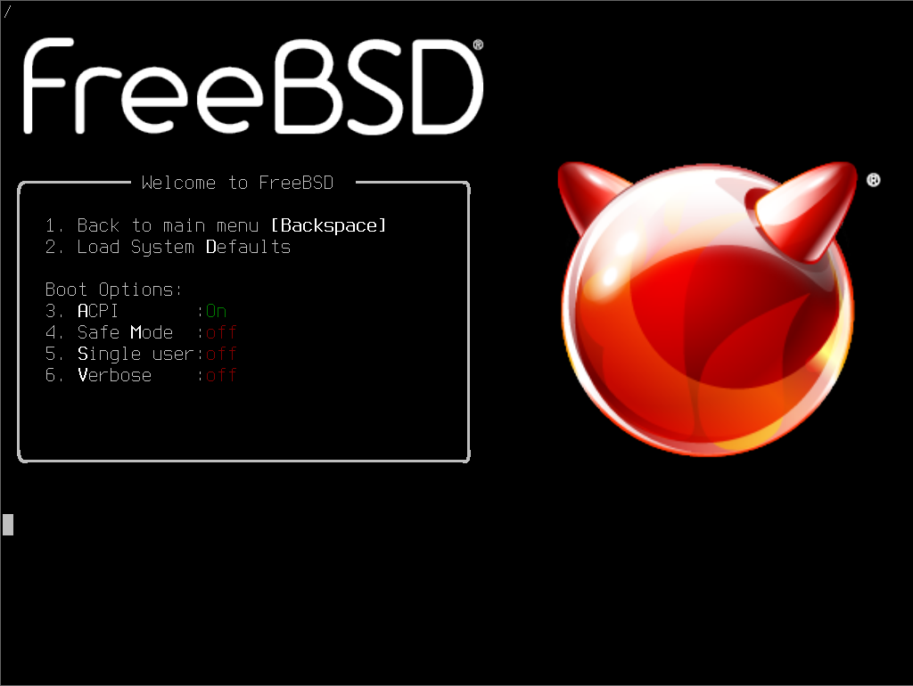

| `7. Boot Options` | Default Value | Description |
| ----------------- | ------------- | ----------- |
| `1. Back to main menu [Backspace]` | On | Press **Backspace** to return to the previous menu |
| `2. Load System Defaults` | off | Restore default configuration |
| `3. ACPI` | off | Advanced Configuration and Power Interface. Default off means this option is initially unselected. Unless necessary, manual enabling is not recommended; if needed, it is typically used for ACPI-related troubleshooting |
| `4. Safe Mode` | off | Safe mode |
| `5. Single user` | off | Single-user mode |
| `6. Verbose` | off | Verbose mode, increases debug information output |

## bsdinstall Installation Process

After booting the installation disk, you will enter the installation interface provided by the `bsdinstall` tool.

Press Enter or wait ten seconds to automatically enter the following screen.

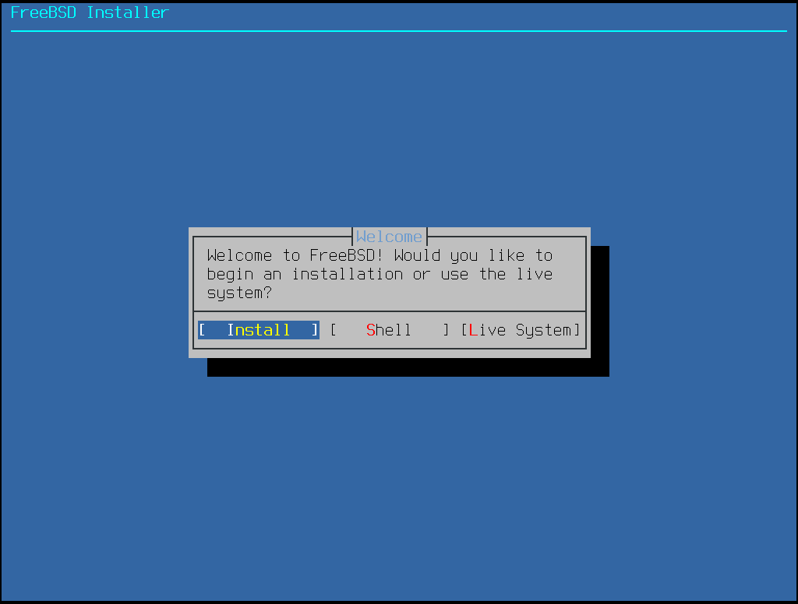

> **Tip**
>
> This screen is provided by the `bsdinstall` tool.
>
> This section guides users on how to use this tool to install FreeBSD. This tool exists not only in the installation image but also remains in the new system after installation is complete, and can also be used to execute a standard installation process (this point has important reference value for advanced installation methods).
>
> The `bsdinstall` tool is essentially composed of a series of sh scripts. Its source code is located at FreeBSD Project. freebsd-src/usr.sbin/bsdinstall[EB/OL]. [2026-03-25]. <https://github.com/freebsd/freebsd-src/tree/main/usr.sbin/bsdinstall>. This repository provides the FreeBSD system installer source code; the scripts are located in the "scripts" folder.

The installer displays the welcome menu:

`Welcome to FreeBSD! Would you like to begin installation, or use the Live system?`

Select `Install` on the left and press **Enter** to begin installation; `Shell` in the middle opens a command line; `Live System` on the right is LiveCD mode.

Unless otherwise specified, you can use the **Tab key** or **arrow keys** to switch options in the following operations, and press **Enter** to confirm the currently highlighted option. Note the red bold first letters of the options on the screen (such as **I** in `Install`, **S** in `Shell`, and **L** in `Live System`). Press the corresponding letter key on the keyboard directly (case-insensitive) to quickly select and enter the corresponding screen.

Selecting the Live CD option allows you to test some functionality before installation. Note the following before using the Live CD:

- Logging into the system requires authentication; the username is `root` and the password is empty (just press **Enter**).

- Since the system runs directly from the installation media, performance is typically weaker than a system installed on a hard disk. In extreme cases (such as when the internal hard disk is a mechanical drive and the external device is a solid-state USB flash drive), the LiveCD's I/O performance may be better than the hard disk-installed system, but due to USB bus bandwidth limitations and the lack of caching policies, this situation is relatively rare and difficult to predict in practice.

- This function only provides a command prompt and does not provide a graphical interface.

> **Warning**
>
> Pressing **Esc** at any step will **not** return to the previous menu; instead, it will jump directly to subsequent steps until exiting or completing the installation process.

## Setting the Keyboard Layout

After entering the installer, you first need to set the keyboard layout.

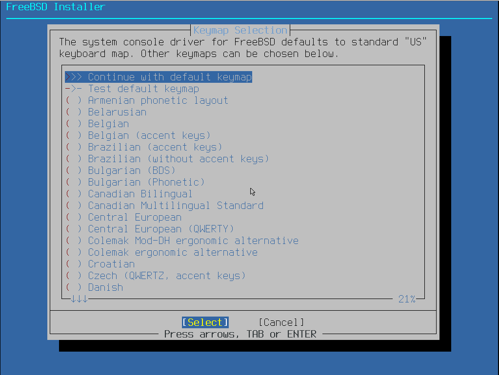

`The FreeBSD system console driver defaults to the standard US (American) keyboard layout. You can select a different keyboard layout below.`

This is the keyboard layout menu; press **Enter** directly to use the default US (American) keyboard layout (US keyboard layout is commonly used in China).

## Setting the Hostname

After setting the keyboard layout, configure the system hostname.

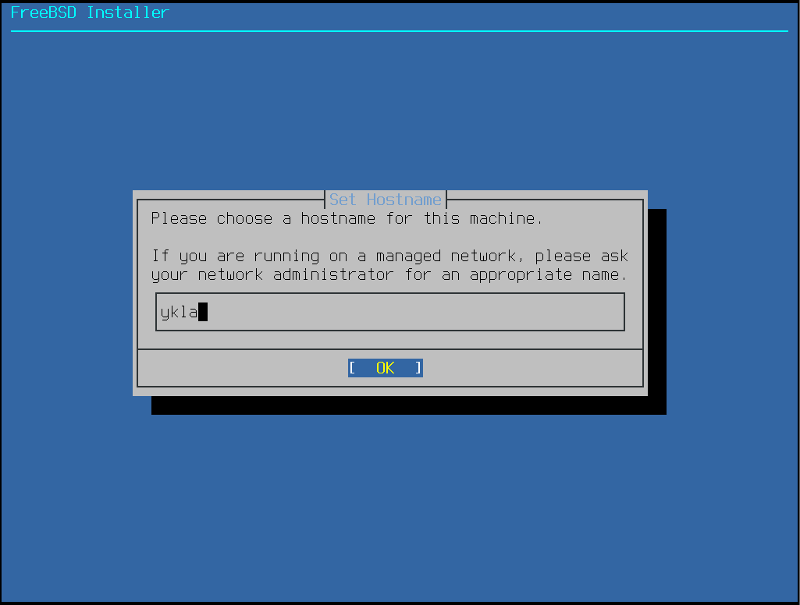

`Please select a hostname for this machine. If you are running on a managed network, please ask your network administrator for an appropriate name.`

This step is used to set the system hostname.

> **Warning**
>
> **Do not** press **Enter** directly in this step! This will result in an empty hostname, which may prevent the display manager (such as SDDM) from starting properly.

> **Warning**
>
> The FreeBSD source code assumes by default that the hostname will be obtained via DHCP. If the hostname is not set, the system will not automatically assign any value (including "Amnesiac"). Based on the current source code logic, there will be no empty hostname prompt when using DHCP; only when there is no network connection will the login information display "Amnesiac" along with an error message.

### References

- FreeBSD Project. Bug 286847: If the hostname is not set for the host, the value "Amnesiac" should be written to rc.conf.[EB/OL]. [2026-03-25]. <https://bugs.freebsd.org/bugzilla/show_bug.cgi?id=286847>. This bug report proposes that a default value should be written when the hostname is empty. This bug report was discovered by the author.
- FreeBSD Project. freebsd-src/libexec/getty/main.c[EB/OL]. [2026-03-25]. <https://github.com/freebsd/freebsd-src/blob/80c12959679ab203459dc20eb9ece3a7328b7de5/libexec/getty/main.c#L178>. This code segment contains the login prompt display logic and the `Amnesiac` source code.
- FreeBSD Project. bsdinstall: Warn if hostname is empty[EB/OL]. [2026-03-25]. <https://github.com/freebsd/freebsd-src/pull/1700>. This PR adds a warning for an empty hostname.

## Selecting the Installation Type

After setting the hostname, select the system installation type. FreeBSD 15 provides two installation methods: the traditional distribution sets installation and the new package-based installation.

> **Note**
>
> In FreeBSD 14, the installer does not provide the package (PkgBase) installation method and only supports the traditional distribution sets installation. In this case, the installation screen title is "Select Distribution Sets," and you proceed directly to the component selection step.

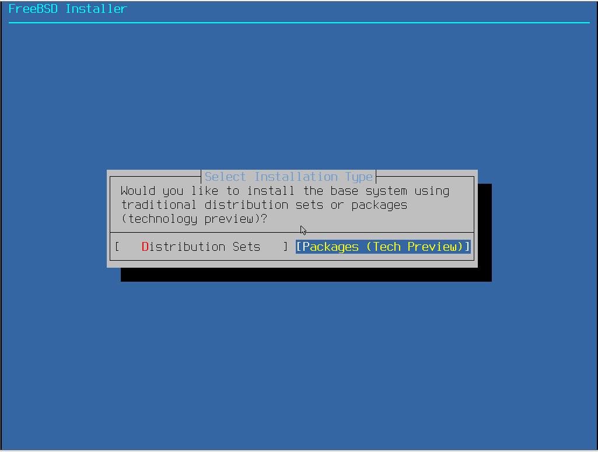

`Would you like to install the base system using traditional Distribution Sets or Packages (Technology Preview)?`

### Packages (PkgBase, Technology Preview)

PkgBase is a new installation method; please note the following key points.

> **Warning**
>
> For network and partition configuration details, see below. Please read the relevant sections thoroughly before making a selection.

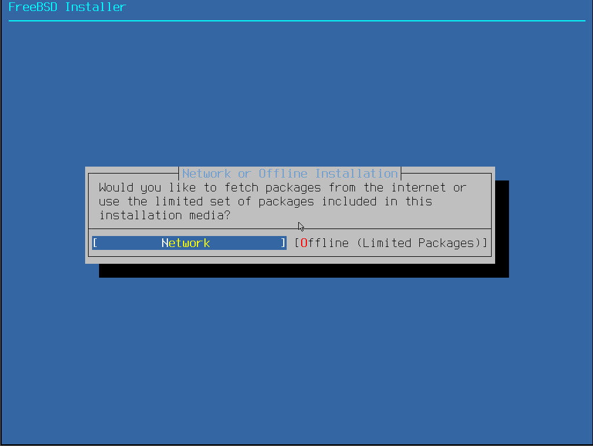

`Would you like to fetch packages from the internet, or use some packages included in this installation media?`

The PkgBase approach originated from the TrueOS project (formerly PC-BSD, sponsored by iXsystems, which independently maintained a PkgBase binary repository based on FreeBSD around 2019-2020, providing an important reference for the subsequent official adoption of this approach by FreeBSD). The TrueOS core project has since ceased development, but the related work on PkgBase has been taken over by FreeBSD project maintainers and continues to evolve. PkgBase aims to manage the base system (kernel and userland) in the form of packages, splitting it into independent binary packages manageable by the `pkg` tool.

This design philosophy is relatively close to common Linux distributions. It should be noted that PkgBase has some tension between system stability and ease of use:

- May affect stability: The risk of base system damage increases (this issue has received more feedback after widespread community use and is gradually gaining attention);
- Improved ease of use: Reduces the cost of switching between different FreeBSD version branches; developers can more conveniently update between stable, current, and other branches, and regular users do not need to endure the longer wait times of the freebsd-update tool.

#### Online Installation (Network)

If you choose the online installation method, the system will download the required packages from the internet. In this step, you can select additional components to install.

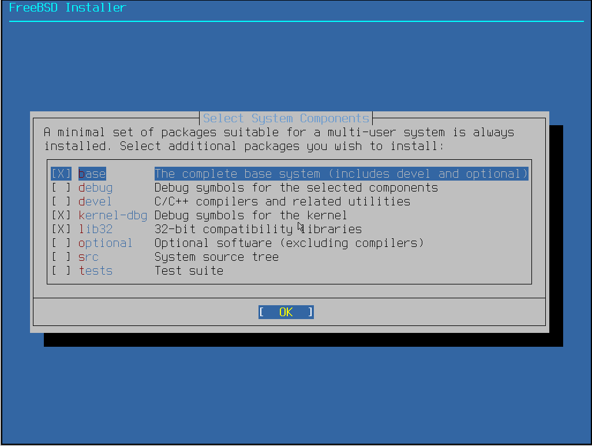

`The minimal package set suitable for a multi-user system will be installed by default. Please select any additional packages you would like to install.`

| Component | Description |
| --------- | ----------- |
| `[X] base` | Complete base system (includes devel and optional) |
| `[ ] debug` | Debug symbols for selected components |
| `[ ] devel` | C/C++ compilation programs and related tools |
| `[X] kernel-dbg` | Kernel debug symbols |
| `[X] lib32` | 32-bit compatibility libraries |
| `[ ] optional` | Optional software (excluding compilation programs) |
| `[ ] src` | System source code tree |
| `[ ] tests` | Test suite |

#### Offline Installation (Offline, Limited Packages)

If you cannot connect to the internet, you can choose the offline installation method. Offline installation uses the limited packages included in the installation media and does not require an internet connection to complete the installation.


`The minimal package set suitable for a multi-user system will always be installed. Please select any additional packages you would like to install.`

| Component | Description |
| --------- | ----------- |
| `[X] base` | Complete base system (includes devel and optional) |
| `[ ] debug` | Debug symbols for selected components |
| `[ ] devel` | C/C++ compilation programs and related tools |
| `[X] kernel-dbg` | Kernel debug symbols |
| `[X] lib32` | 32-bit compatibility libraries |
| `[ ] optional` | Optional software (excluding compilation programs) |
| `[ ] src` | System source code tree |
| `[ ] tests` | Test suite |

Testing has shown that even if all items are selected, a fully offline installation can be achieved.

### Distribution Sets

In addition to the package installation method, you can also choose the traditional distribution sets installation method, which is mature and stable.

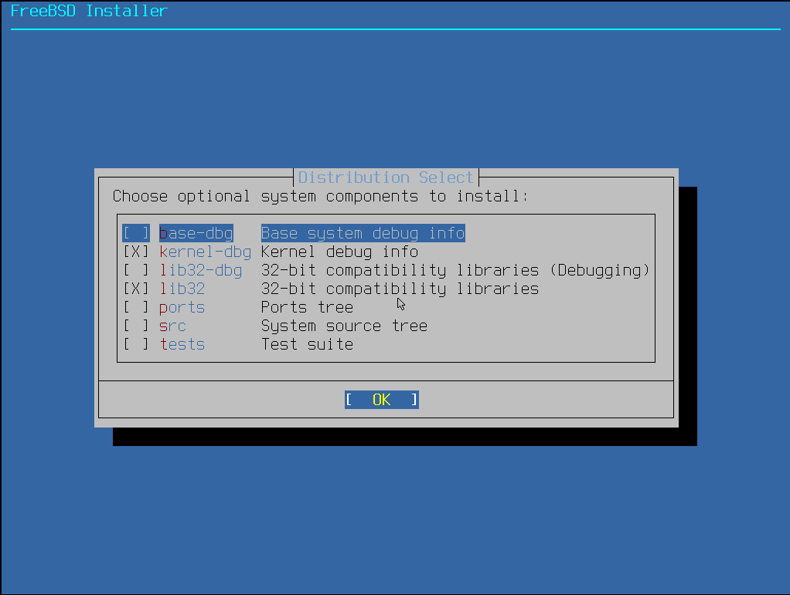

`Select optional system components to install`

> **Tip**
>
> Unless otherwise specified, press the **Space key** in the following operations to select or deselect items (`[ ]` changes to `[ * ]`).
>
> Since some graphics drivers (such as `drm`) and other programs require source code, and testing has shown that the `lib32` component may not work properly when installed separately after system installation, it is recommended to select both `lib32` and `src` during installation. It is recommended to additionally select `src` and `lib32` on top of the default options.

> **Warning**
>
> **Do not** select components other than `kernel-dbg`, `lib32`, and `src`; these components need to be downloaded from the network during installation, which may be slow. If needed, they can be installed separately after the system installation is complete.
>
> If a mirror site selection prompt appears during installation, it is usually because additional components requiring network download were selected; please avoid this operation.

| Option | Explanation |
| ------ | ----------- |
| `base-dbg` | Debug symbol files for the base system |
| `kernel-dbg` | Debug symbol files for the kernel |
| `lib32-dbg` | Debug symbol files for the 32-bit compatibility libraries |
| `lib32` | Compatibility libraries for running 32-bit applications on a 64-bit system |
| `ports` | FreeBSD Ports Collection |
| `src` | System source code tree |
| `tests` | Operating system test suite |

## Allocating Disk Space

After selecting the installation method and components, allocate disk space for the system.

FreeBSD 15.0-RELEASE supports selecting UFS or ZFS as the root file system. In older versions, the `bsdinstall` tool only supported UFS; FreeBSD Project. Revision 256361: bsdinstall: add ZFS support[EB/OL]. [2026-03-25]. <https://svn.freebsd.org/viewvc/base?view=revision&revision=256361>. This revision records the addition of ZFS support to bsdinstall, and `bsdinstall` began supporting ZFS. Through manual installation, booting from ZFS was supported as early as the FreeBSD 8.0-CURRENT development phase (see delphij. Is ZFS as / a good idea?[EB/OL]. [2026-03-25]. <https://blog.delphij.net/posts/2008/11/zfs-1/>). This blog discusses the technical feasibility of early FreeBSD ZFS root partition booting.

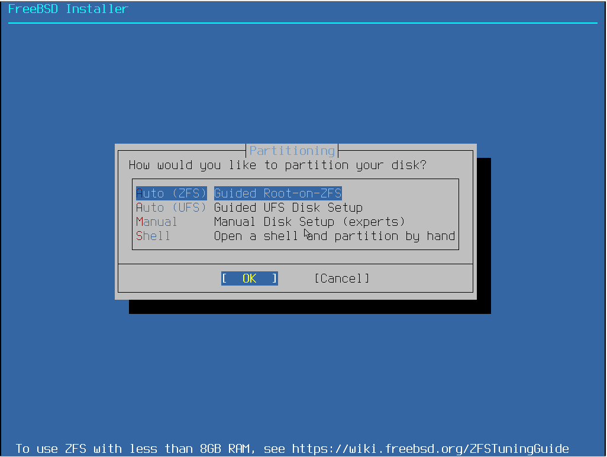

Partition menu. `How would you like to partition the disk?`

| Configuration Option | Description |
| -------------------- | ----------- |
| `Auto (ZFS) – Guided Root-on-ZFS` | Auto (ZFS) – Guided ZFS root partition |
| `Auto (UFS) – Guided UFS Disk Setup` | Auto (UFS) – Guided UFS disk setup |
| `Manual – Manual Disk Setup (experts)` | Manual – Manual disk setup (for experts) |
| `Shell – Open a shell and partition by hand` | Shell – Open a shell and partition manually |

For file system details, see other chapters (you can manually partition and extract `txz` files for customization). Here, the default `Auto (ZFS)` option is recommended. When available memory is less than 8 GB, ZFS ARC cache may compete with applications for memory resources; in this case, UFS may provide more predictable performance under daily desktop or lightweight server workloads. 8 GB is not a hard limit; ZFS can still run with less memory (see the low-memory testing below), but performance may degrade significantly.

For detailed methods of manual partitioning and partitioning via shell, see the relevant chapters on manual FreeBSD installation in this book.

### Auto (ZFS) (Using ZFS as the **/** File System)

> **Tip**
>
> Under extreme experimental conditions (only performing basic operations such as login and ls, with no actual workload), a ZFS system with 128 MB (traditional BIOS) / 256 MB (UEFI) of memory can complete booting, but this is entirely not viable for production. ZFS production environments recommend at least 2 GB of memory (OpenZFS officially recommends 8 GB or more for optimal performance; 2 GB or less can also run but is not recommended).

> **Note**
>
> If you repeatedly encounter partition table "corrupted" errors during manual partitioning, first exit the installer, restart and enter shell mode, and try recovering the partition table:
>
> ```sh
> # gpart recover ada0
> ```
>
> Expected output (example):
>
> ```sh
> # gpart recover ada0
> ada0 recovered
> ```
>
> Please determine the `ada0` parameter based on the actual hard disk device (it may be `da0`, `nda0`, etc.).
>
> If unsure of the current hard disk device name, refer to the illustrated command to check.
>
> 
>
> After recovery, execute the `bsdinstall` command to re-enter the installer interface.
>
> This issue may be related to partition table adjustments.

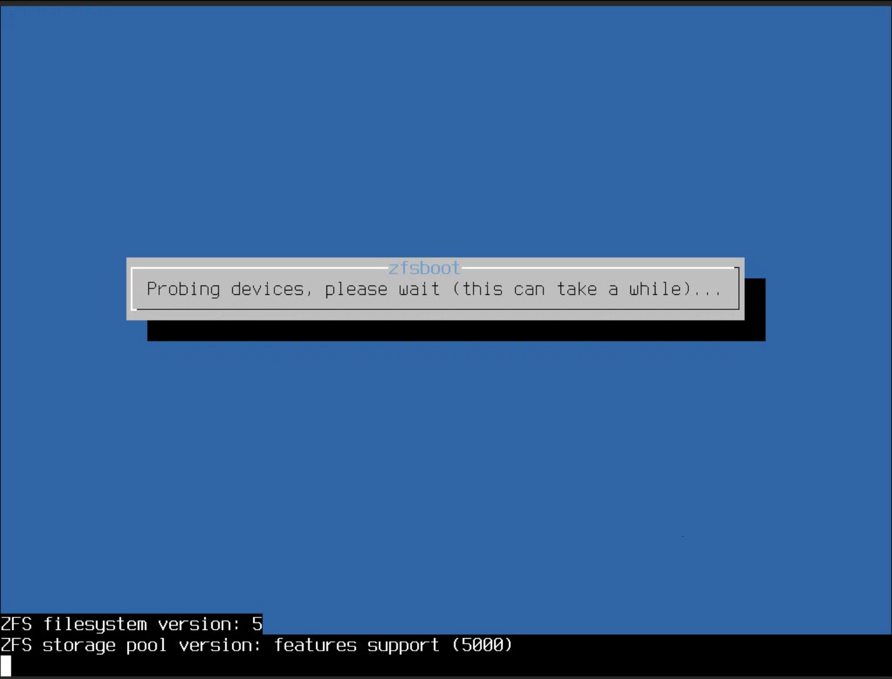

`Detecting devices. Please wait (this may take a while)...`

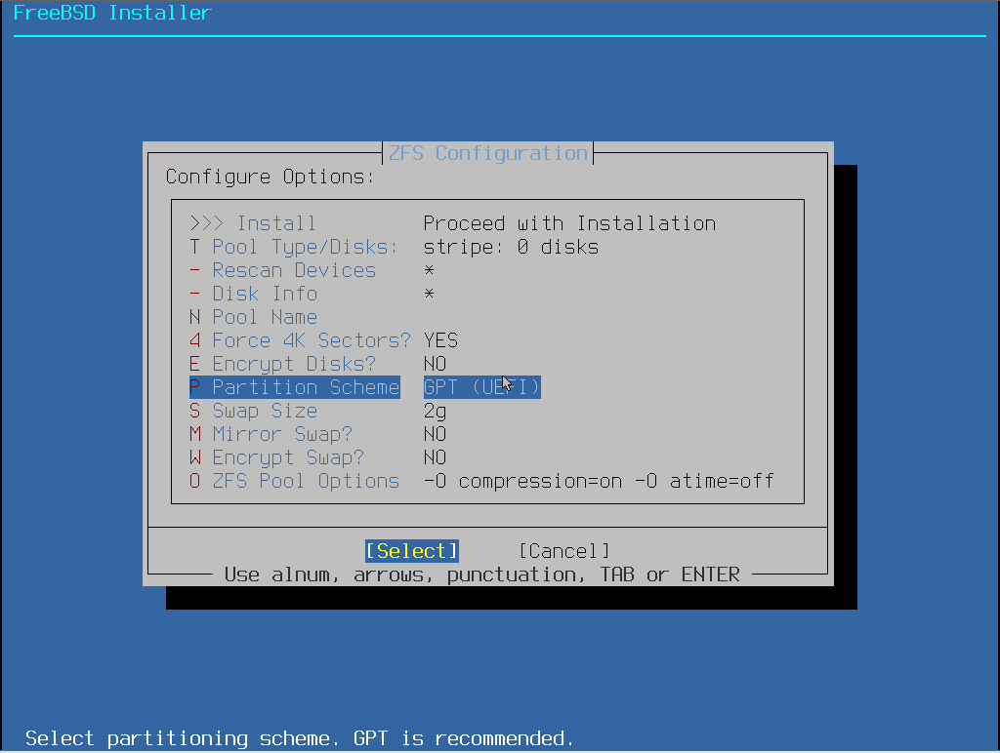

Most PCs and compatible machines manufactured after 2016 use UEFI firmware by default; you should select `GPT (UEFI)`. Do not use the default option, as it will create a 512 KB `freebsd-boot` partition (which is not needed for pure UEFI booting).

Older computers (such as those before 2013) should consider selecting the `GPT (BIOS)` option, which only supports BIOS booting; transition-period devices from 2013-2015 may support both Legacy BIOS and UEFI (via CSM). If you need compatibility with both, select `GPT (BIOS+UEFI)`.

| Configuration Option | Description | Notes |
| -------------------- | ----------- | ----- |
| `>> Install Proceed with Installation` | >> Install | Continue installation |
| `T Pool Type/Disks: stripe: 0 disks` | Pool type/disks: stripe: 0 disks | See details below |
| `- Rescan Devices *` | - Rescan devices * | |
| `- Disk Info *` | - Disk information * | |
| `N Pool Name zroot` | Pool name `zroot` | Default pool name `zroot` |
| `4 Force 4K Sectors? YES` | Force 4K sectors? Yes | 4K alignment |
| `E Encrypt Disks? NO` | Encrypt disks? No | For the encrypted login system solution, see other chapters in this book |
| `P Partition Scheme` | Partition scheme GPT (UEFI) | Only older computers (before 2013) need to select options such as `GPT (BIOS+UEFI)` |
| `S Swap Size 2g` | Swap size 2 GB | If you truly do not need a swap partition, enter `0` or `0G` at `Swap Size` to skip creation |
| `M Mirror Swap? NO` | Mirror swap? No | Whether to mirror the swap partition across multiple disks; if No is selected, each disk's swap partition is independent |
| `W Encrypt Swap? NO` | Encrypt swap? No | |

> **Tip**
>
> If you set this to `GPT (UEFI)` instead of other options, the subsequent partitioning and system update process will be simpler.

> **Note**
>
> Please carefully set the swap partition (`Swap Size`) size. If the system is for a desktop environment and requires hibernation, the swap space should be at least 1 times the physical memory; if it is a pure server environment with more than 16 GB of memory, 4-8 GB of swap space is usually sufficient; if memory exceeds 64 GB and kernel crash dumps are not needed, swap space can be even smaller or zero. Older systems with less physical memory that need to run large applications can increase swap size as appropriate. Since ZFS and UFS file systems are not easily shrinkable after creation, and creating swap files using the `dd` command or subsequent adjustments may introduce performance overhead or complexity.

> **Tip**
>
> If you cannot determine which disk to select next, you can choose `- Disk Info *` in this step to view detailed information about each disk:
>
> 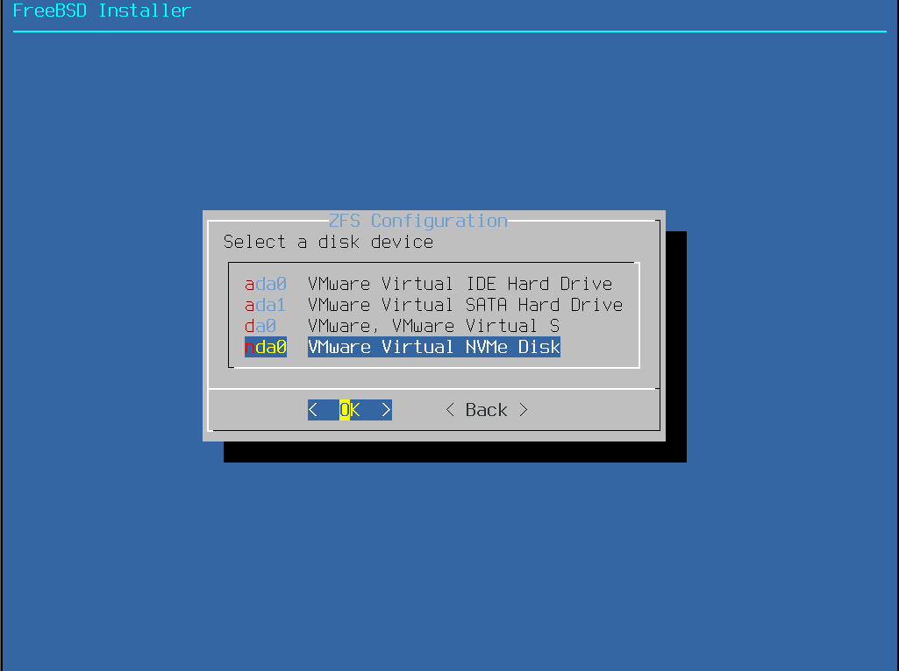
>
> On this screen, select a disk and press **Enter** to view details; select `<Back>` to return to the previous menu.
>
> 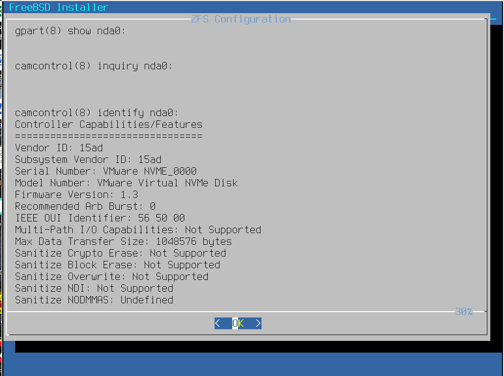
>
> Use **Up/Down arrow keys** to browse this screen. Press **Enter** to return to the previous menu.

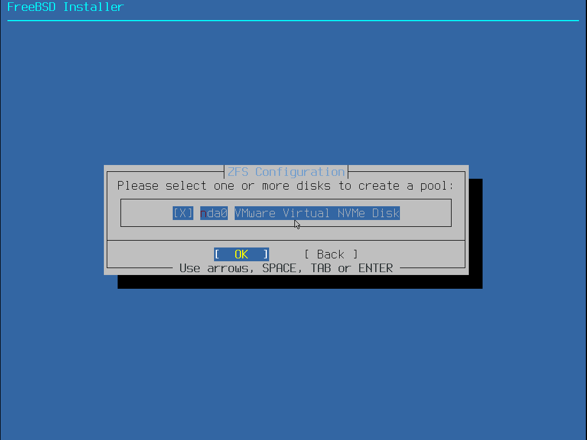

`Select virtual device type:`

| Configuration Option | Description | Characteristics |
| -------------------- | ----------- | --------------- |
| `Stripe` | Striping, i.e., `RAID 0` | No redundancy, only one hard disk needed |
| `mirror` | Mirroring, i.e., `RAID 1` | n-way mirror, minimum 2 hard disks required |
| `raid10` | RAID 1+0 | n groups of 2-way mirrors, minimum 4 hard disks required (even number of hard disks required) |
| `raidz1` | RAID-Z1 | Single redundancy RAID, minimum 3 hard disks required |
| `raidz2` | RAID-Z2 | Double redundancy RAID, minimum 4 hard disks required |
| `raidz3` | RAID-Z3 | Triple redundancy RAID, minimum 5 hard disks required |

Press **Enter** directly to use the default `Stripe` type.


Select the target hard disk and press **Enter** to confirm the selection.

> **Tip**
>
> If you want to install the system to a USB flash drive or external hard disk but it is not recognized, try replugging the device, then select `- Rescan Devices *` above to rescan the device list.

> **Note**
>
> If the hard disk is of the eMMC type, options such as `mmcsd0`, `mmcsd0boot0`, and `mmcsd0boot1` may appear; please select `mmcsd0`. Additionally, if multiple hard disks coexist with eMMC and another hard disk has more than 5 partitions, FreeBSD installed on eMMC may stall at the `Mounting from zfs:zroot/ROOT/default failed with error 22: retrying for 3 more seconds` prompt during boot. If parameters are manually specified, it may cause a kernel panic. There is currently no more detailed report information for this issue. If readers encounter this issue in a similar configuration, it is recommended to submit a detailed report to FreeBSD Bugzilla, including: motherboard model, eMMC capacity and version, partition table structure and number of partitions on the other hard disk, kernel logs, and related dmesg output.

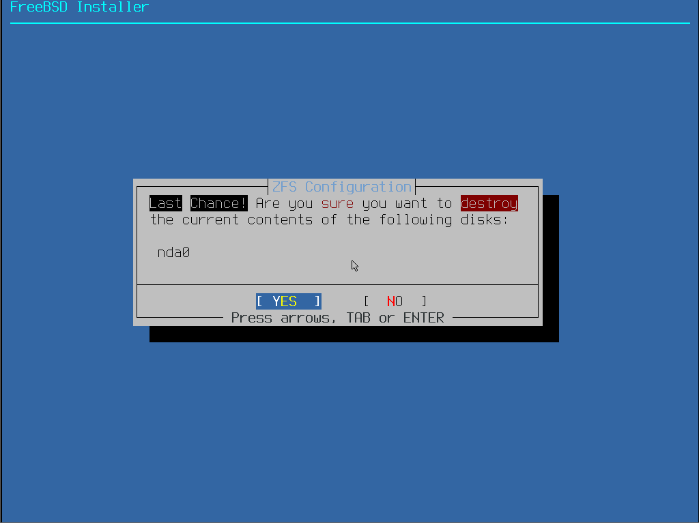

`Final confirmation! Are you sure you want to destroy all existing data on the following disks:`

This is the final warning and confirmation. Please ensure you have backed up important data; the selected disk will be completely formatted. Use the **arrow keys** or **Tab key** to switch focus to `<YES>`, and press **Enter** to confirm.

> **Warning**
>
> This operation will perform a full disk installation, and all data on the target disk will be lost! For non-full-disk installation (such as dual-boot), please refer to other relevant chapters in this book.

#### Appendix: Mounting and Decrypting a geli-Encrypted ZFS Root Partition

If you enabled encryption for the ZFS root partition through bsdinstall's "Encrypt Disks" option during installation (this option uses geli(8) for disk-level encryption), the method for subsequently mounting this disk is as follows. Note that geli disk-level encryption here is different from ZFS native encryption (dataset-level AES-256-GCM encryption): ZFS native encryption is used to encrypt user home directory datasets; for the related decryption operations, see the instructions in the user creation step below.

Taking an NVMe hard disk as an example, the disk structure after enabling geli disk encryption (with swap space also encrypted) is as follows:

| Partition Type | Mount Point | Device |
| -------------- | ----------- | ------ |
| efi | | **/dev/nda0p1** |
| freebsd-zfs | / | **/dev/nda0p2**, **/dev/nda0p2.eli** |
| freebsd-swap | | **/dev/nda0p3**, **/dev/nda0p3.eli** |

The EFI system partition is the same as a normal installation with no special changes. At system startup, you will be prompted to enter a password to decrypt and mount the root partition.
If you need to mount this encrypted partition in a LiveCD environment, the operation is relatively convenient (no key file is needed, only a password is required). Assuming the root partition is **/dev/nda0p2**, execute the following command:

```sh
# geli attach /dev/nda0p2
```

Expected output:

```sh
# geli attach /dev/nda0p2
Enter passphrase:
```

After entering the correct encryption password, the absence of any error message indicates successful decryption. Import the ZFS pool with the command `# zpool import zroot`, then mount the root file system with the command `# zfs mount zroot/ROOT/default`.

### Auto (UFS) (Using UFS as the **/** File System)

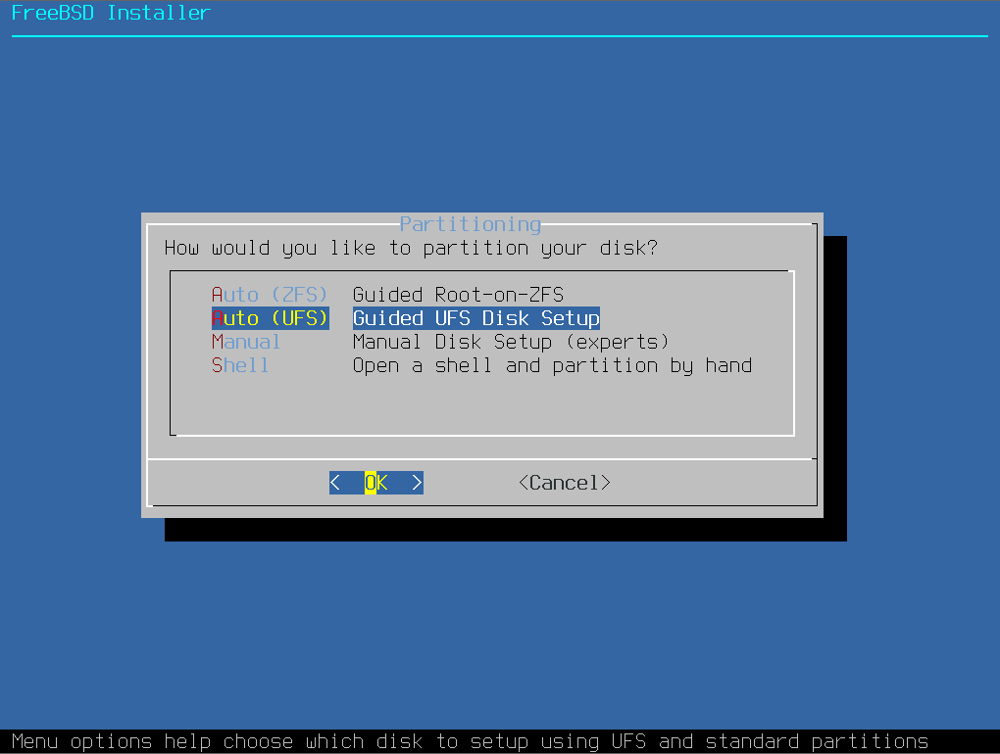

`How would you like to partition the disk?`

> **Tip**
>
> If you select `Partition`, the options are the same as below.

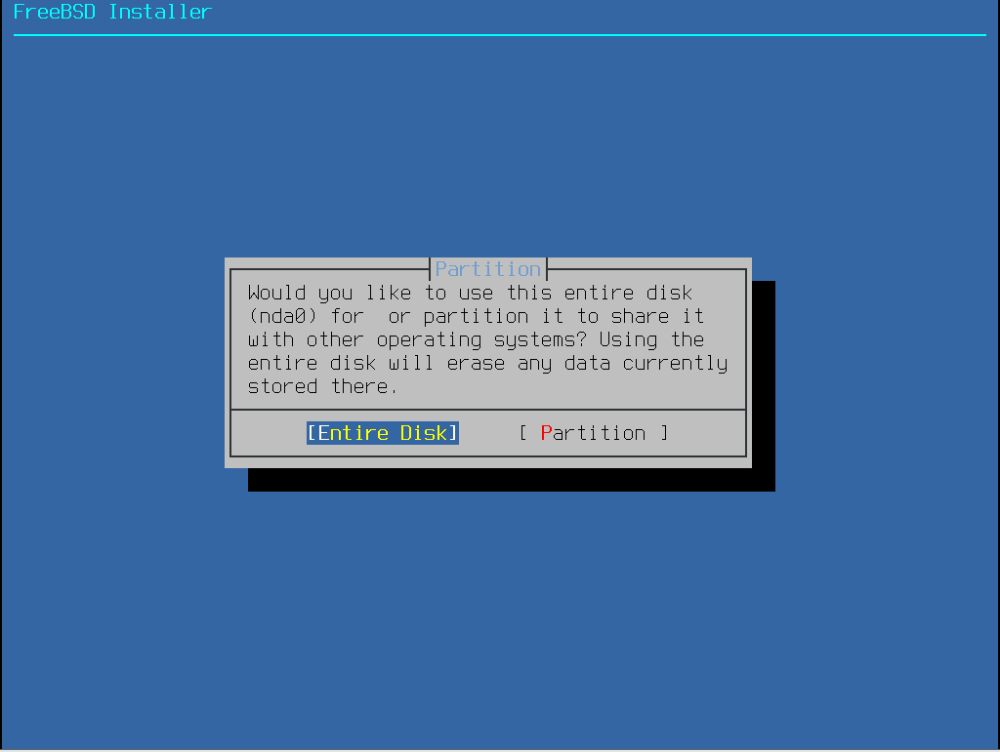

`Would you like to use the entire disk or partition the disk to coexist with other operating systems? Using the entire disk will erase all existing data on the disk.`

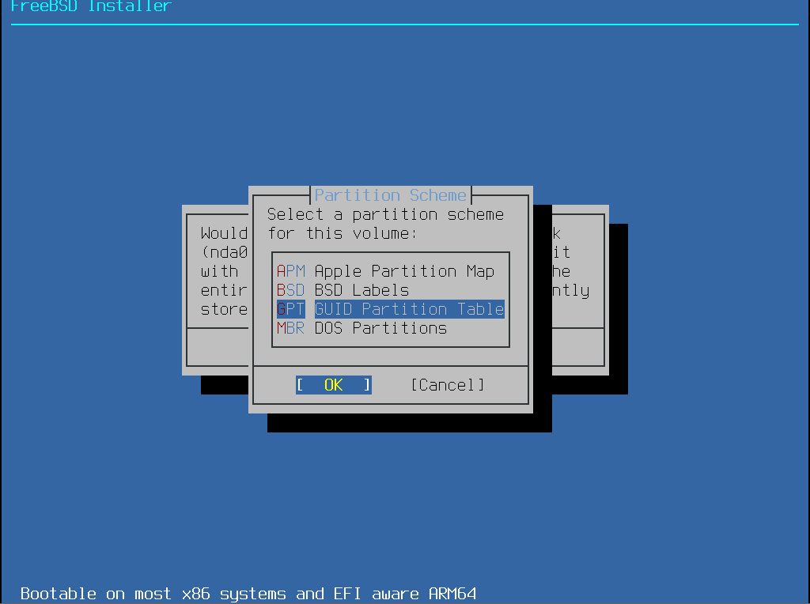

`Select a partition scheme for this volume`

| English | Description | Notes |
| ------- | ----------- | ----- |
| `APM Apple Partition Map` | Apple Partition Map | Used by Apple `PowerPC` (before 2006) |
| `BSD BSD Labels` | BSD disk labels | Only recognizable by BSD |
| `GPT GUID Partition Table` | GPT Globally Unique Identifier Partition Table | Used by modern computers (2013+) |
| `MBR DOS Partitions` | MBR Master Boot Record partition table | Used by older computers (XP, Win7 era) |

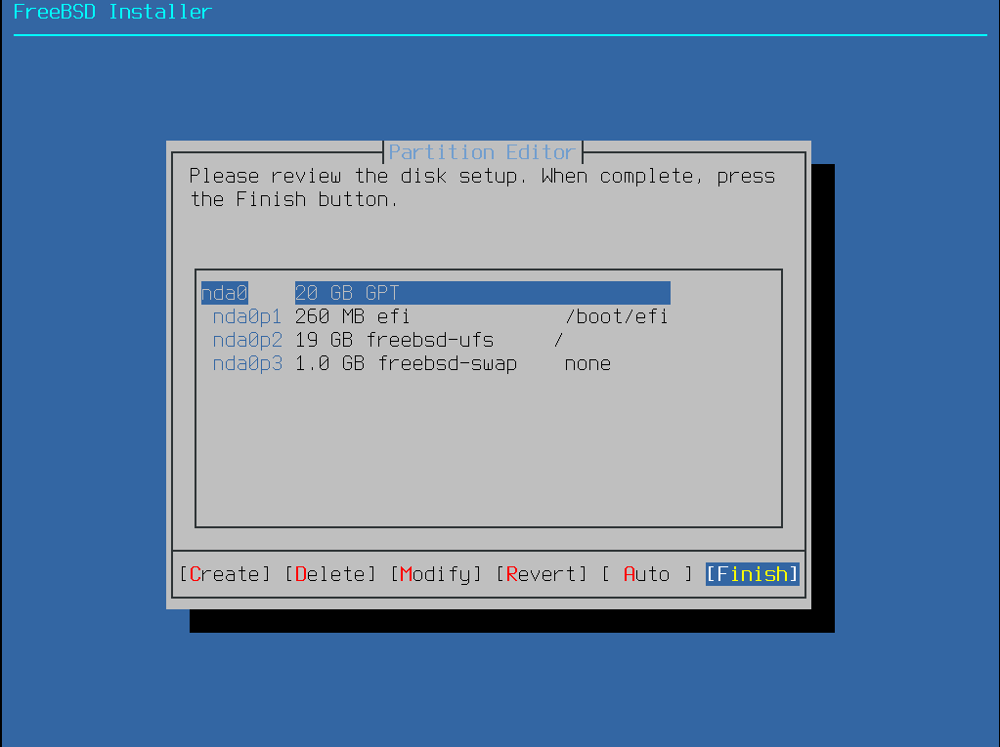

`Please review the current disk partition settings. Once confirmed, select Finish`

| English | Description |
| ------- | ----------- |
| `Create` | Create |
| `Delete` | Delete |
| `Modify` | Modify |
| `Revert` | Revert |
| `Auto` | Auto |
| `Finish` | Finish |


`Your changes have not been written to disk. If you chose to overwrite existing data, it will be permanently deleted. Are you sure you want to commit?`

| English | Description |
| ------- | ----------- |
| `Commit` | Commit |
| `Revert & Exit` | Revert and exit |
| `Back` | Back |

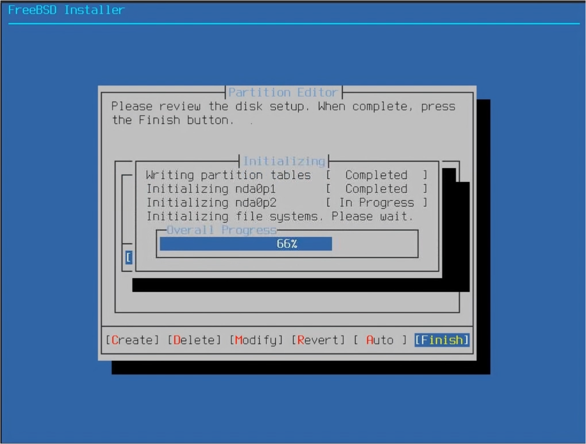

Initializing the disk; this screen usually completes in a very short time.

---

If the PkgBase installation method was previously selected:

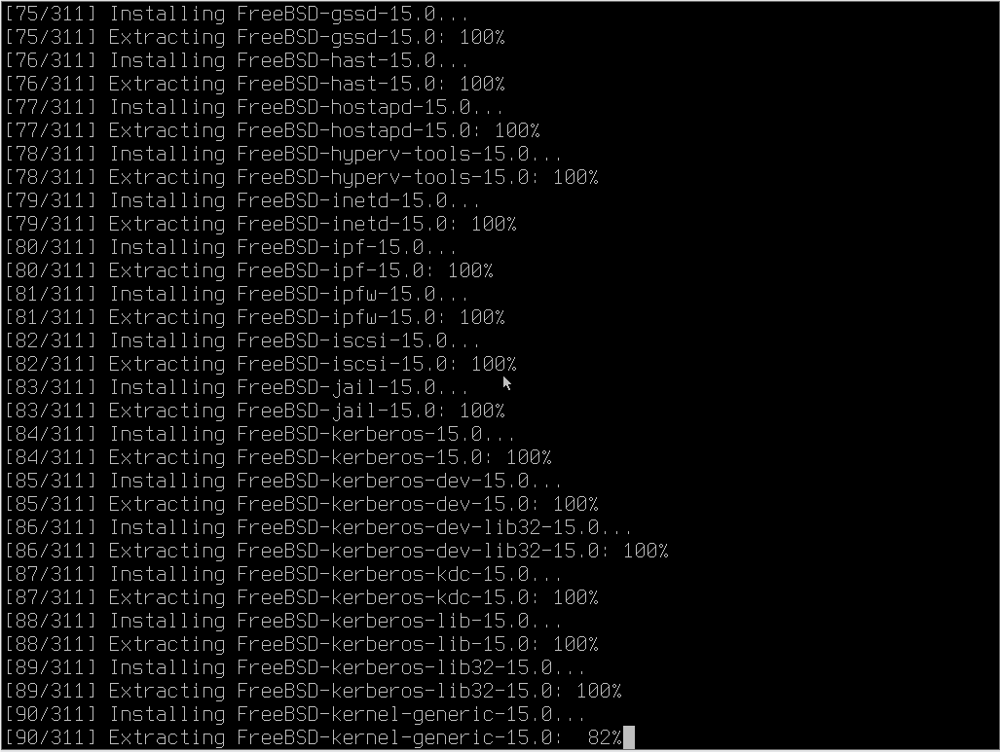

Verifying distribution files:

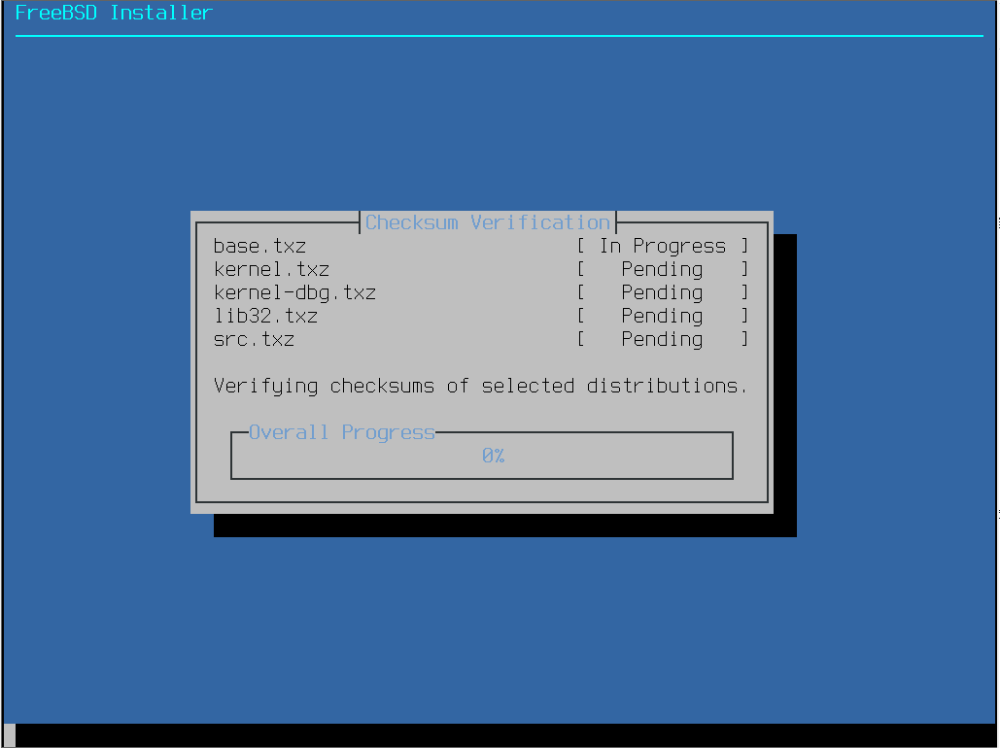

Extracting and installing distribution files:


## Setting the root Password

After disk partitioning is complete, set the password for the system administrator account.

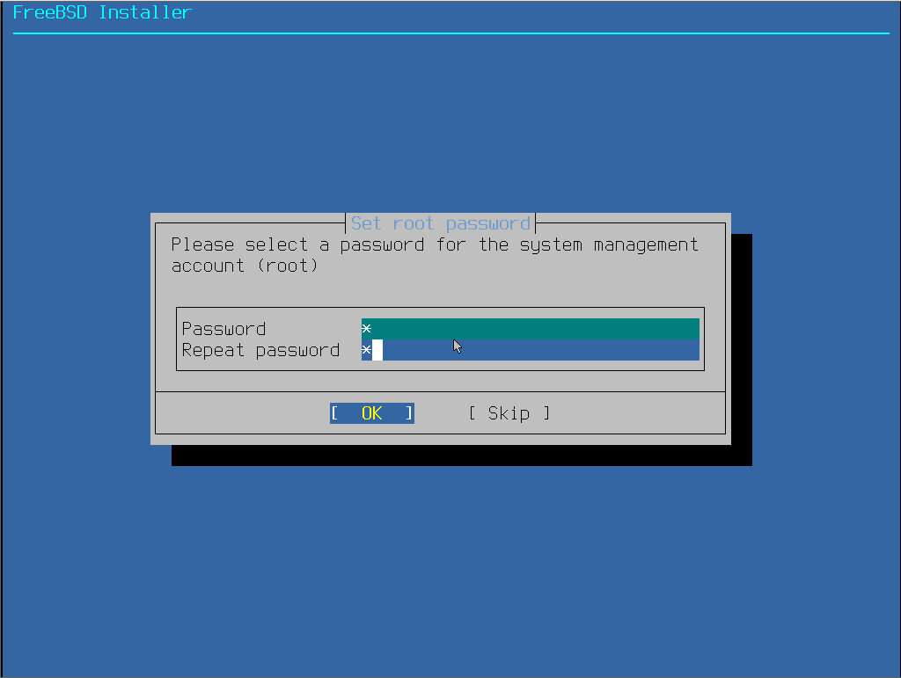

`Please set the password for the system administrator account (root): The characters you type will not be visible. Modifying the root password of the system to be installed.`

> **Tip**
>
> On this screen, use the **Up/Down arrow keys** or **Tab key** to move focus between different password input fields. After entering, press **Enter** to confirm.

Enter the root password here. Note: The above screen states "the characters you type will not be visible," but the actual behavior varies by version or terminal environment—in some cases, `*` mask characters are displayed, while in others there is no echo at all. In either case, press **Enter** after completing the input to confirm.

You are required to enter the password twice to confirm consistency. If the two passwords do not match, it will prompt `The passwords do not match`.

There is no mandatory requirement for root password strength, but it cannot be empty. If the password is empty, it will prompt `The password cannot be empty`, and a valid password must be entered to continue.

## Network Configuration

After setting the root password, you need to configure the network so that the system can connect to the internet or local network.

### Ethernet Card

First, the Ethernet card configuration method is introduced.

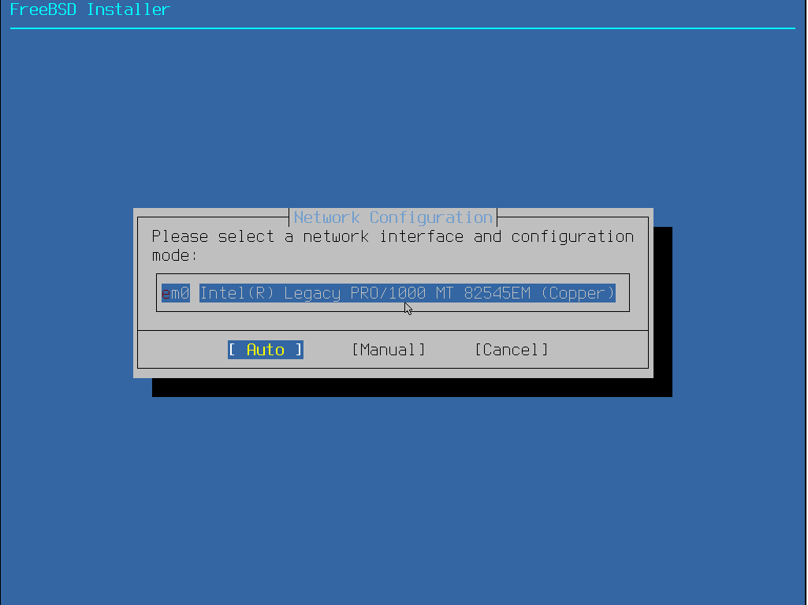

`Please select the network interface to configure and its configuration mode`

- `Auto`: Automatic
- `Manual`: Manual
- `Cancel`: Cancel

Here, select the network card to configure. Use the **arrow keys** to switch and press **Enter** to confirm the selection.

> **Note**
>
> In FreeBSD 14, the network interface selection screen only prompts "Please select a network interface to configure" and does not provide Auto/Manual/Cancel options; after directly selecting a network card, it proceeds to the IPv4 configuration step.

#### Auto

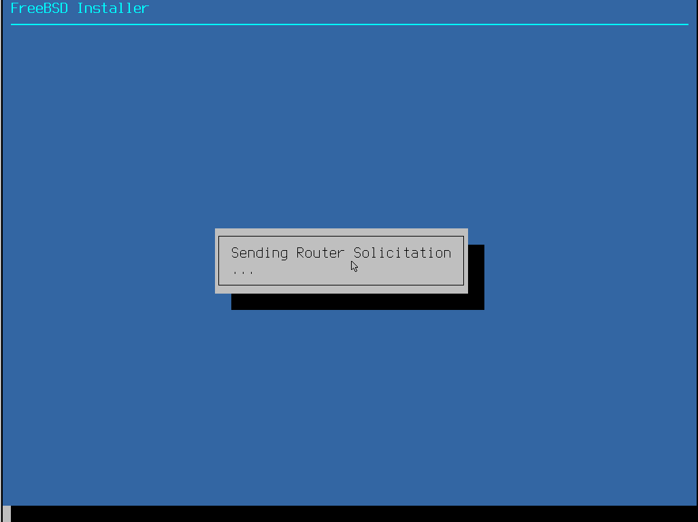

`Sending router solicitation`, the installer will automatically detect and configure the network environment.

#### Manual


`Would you like to configure IPv4 for this interface?`

Whether to configure IPv4. Press **Enter** to confirm the selection.

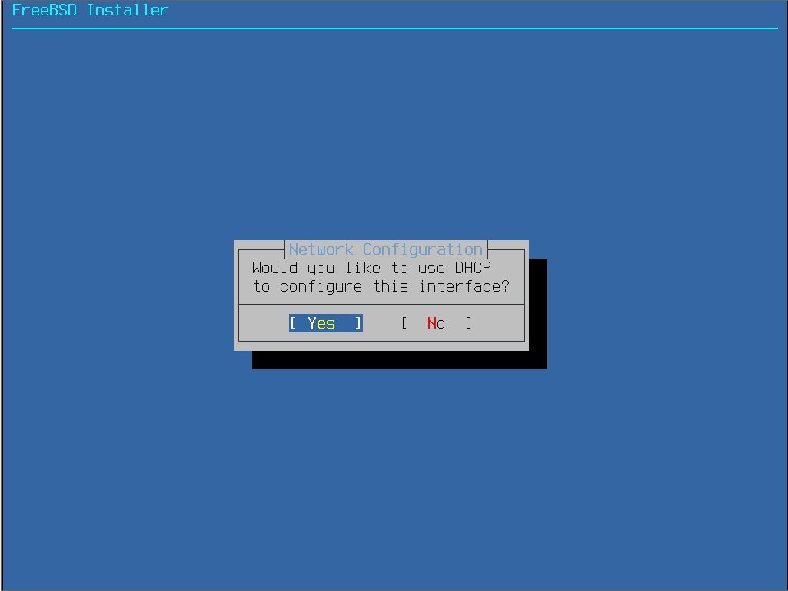

`Would you like to use DHCP to configure this interface?`

Whether to use DHCP for automatic configuration. Press **Enter** to confirm the selection. If there is no DHCP server in the network environment or DHCP acquisition fails, the installer will prompt you to manually enter the IPv4 address, subnet mask, and default gateway; please confirm this information in advance.

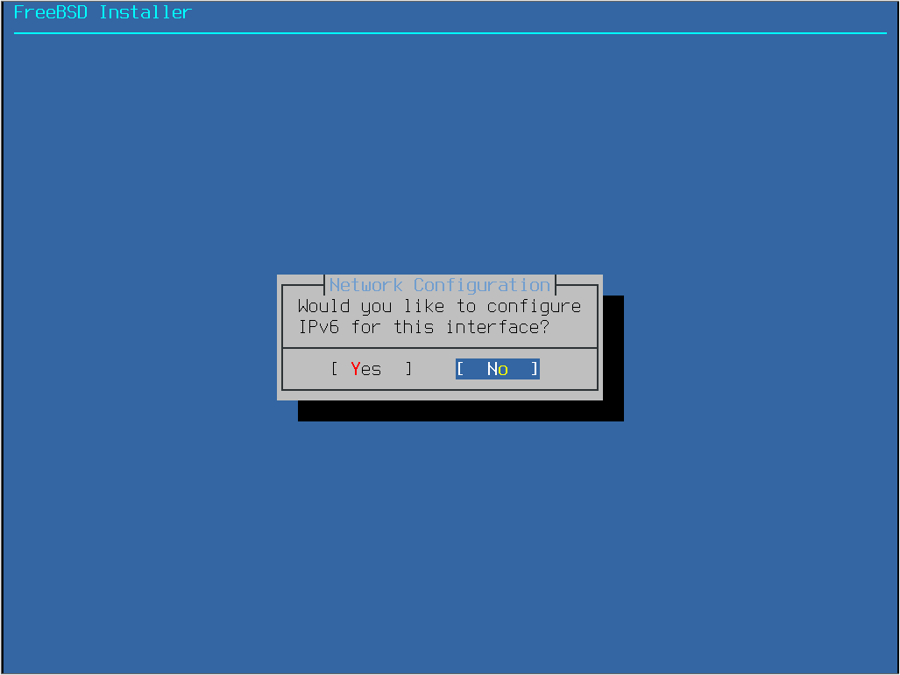

`Would you like to configure IPv6 for this interface?`

Whether to configure IPv6. This book does not cover IPv6, so select `No` and press **Enter**. You can configure it yourself if needed.

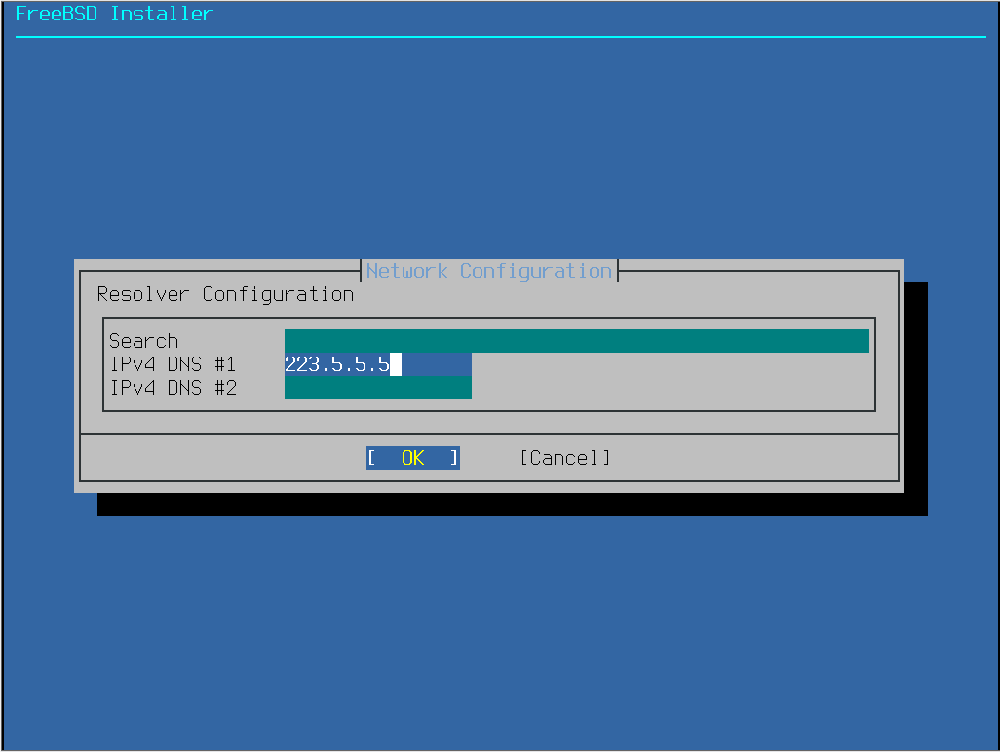

`Configure resolver`

You can usually keep the DNS settings assigned by DHCP, or specify them manually. The example in the image uses Alibaba Cloud public DNS **223.5.5.5**. The following are common public DNS options:

| Provider | Primary Address | Secondary Address | Features |
| -------- | --------------- | ----------------- | -------- |
| Alibaba Cloud Public DNS | 223.5.5.5 | 223.6.6.6 | Many domestic nodes, fast resolution of domestic domain names |
| Tencent DNSPod | 119.29.29.29 | 182.254.116.116 | Many domestic nodes, supports DoH/DoT |
| Cloudflare | 1.1.1.1 | 1.0.0.1 | Fastest globally, promises not to log user activity, supports DoH/DoT |
| Google | 8.8.8.8 | 8.8.4.4 | Globally stable and reliable, supports DoH/DoT, logs retained for 24-48 hours |
| Quad9 | 9.9.9.9 | 149.112.112.112 | Swiss non-profit operation, automatically blocks malicious domains, does not log user IP |

> **Note**
>
> Traditional DNS queries are transmitted in plaintext and may be monitored or tampered with by third parties (such as DNS hijacking, DNS pollution). It is recommended to prioritize providers that support encrypted DNS protocols (DoH or DoT) to protect the privacy and security of DNS queries. For domestic users accessing domestic websites, Alibaba Cloud or Tencent DNS usually has lower latency; for accessing international websites, Cloudflare or Google DNS may perform better.

Use the **arrow keys** to switch options and press **Enter** to confirm.

### Wireless Network Card/Wi-Fi Settings

> **Warning**
>
> Due to the known Bug 289202 (missing China regulatory domain), using the wireless network configuration function in the installer is currently not recommended. If you need a network connection, please complete the installation via Ethernet first. It is recommended to configure the wireless network separately after the system installation is complete and restarted, by referring to the wireless network chapter in this book (especially for Broadcom and similar network cards). Otherwise, the installer may be unresponsive for a long time or cause a kernel panic.


`Please select the wireless network interface to configure`

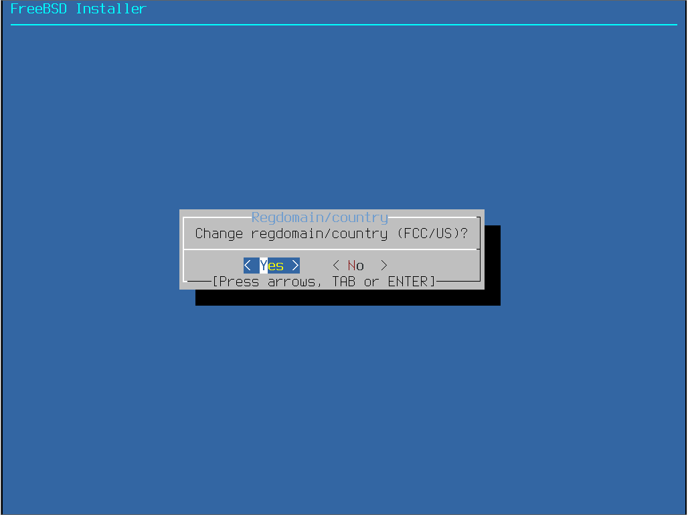

`Change wireless regulatory domain (currently FCC/US)?`

Modify the wireless regulatory domain and press Enter to confirm.

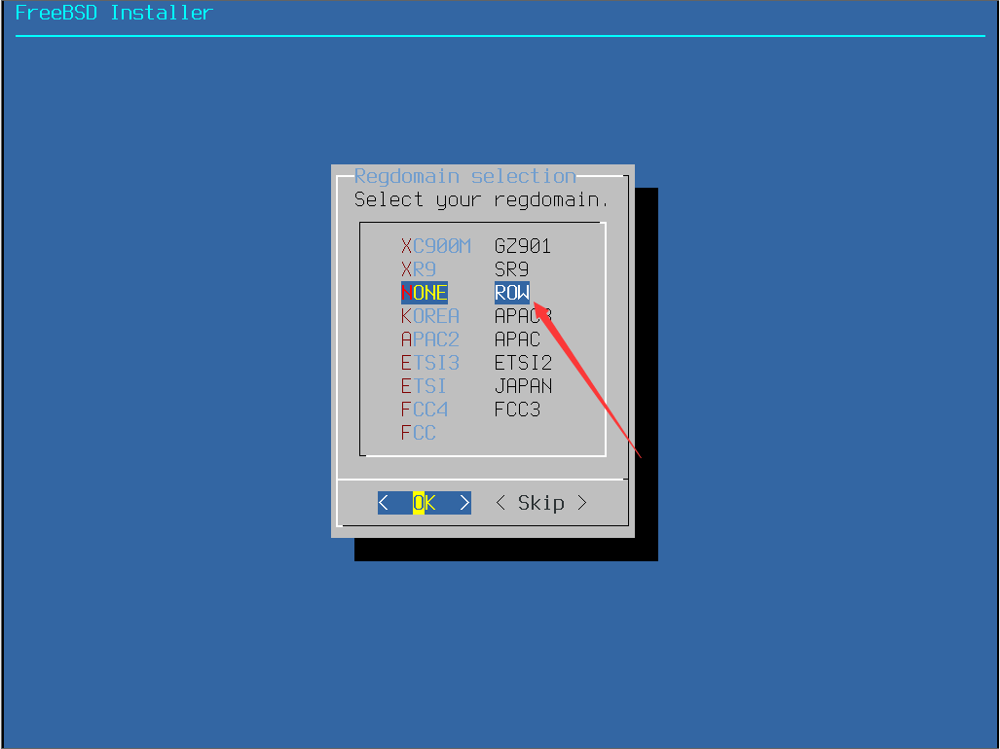

`Please select your country code`

Here you should select `NONE` or `ROW` (Rest of World). `ROW` is a generic wireless regulatory domain option; since the China regulatory domain is not yet defined in regdomain.xml (Bug 289202), selecting this option allows the wireless network card to operate on the most conservative set of channels, avoiding errors caused by selecting a specific country.

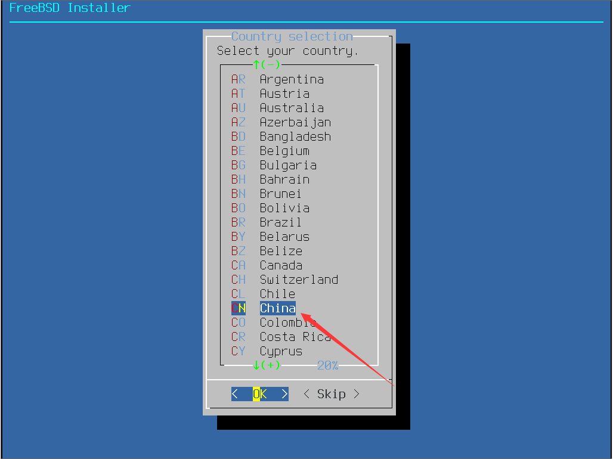

`Please select your region`

Select the corresponding region:

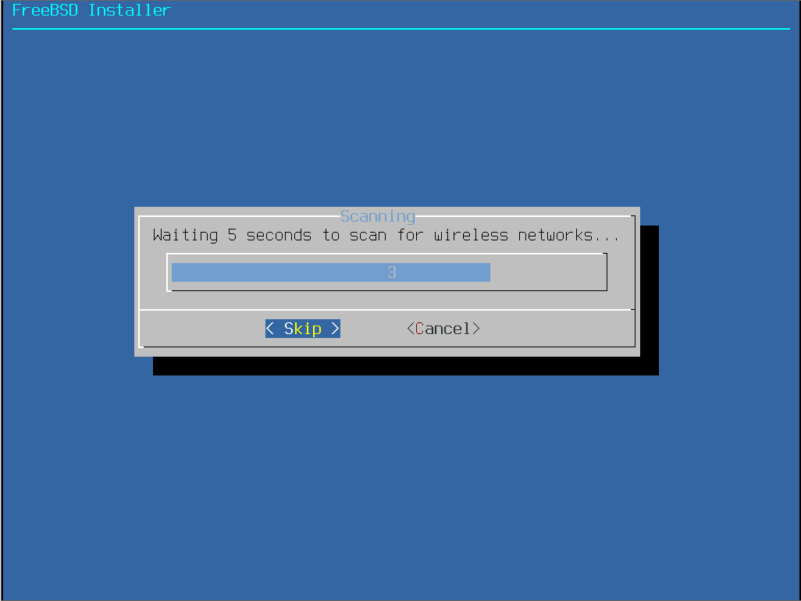

`Please wait 5 seconds, scanning for available wireless networks...`

Scanning.

> **Tip**
>
> As long as the system can recognize the network card, it means its driver is available. However, the installer may not be able to correctly scan all Wi-Fi networks. It is recommended to leave this blank and skip it, then configure it after the system installation is complete and restarted, by referring to the wireless network chapter in this book.

Find your Wi-Fi network in the list. If not found, try changing the wireless router's channel and try again.


`Please select the wireless network to connect to`

Enter the Wi-Fi password to connect:


`Would you like to configure IPv4 for this interface?`

Configure IPv4; press **Enter** to select.


`Would you like to use DHCP to configure this interface?`

Configure using DHCP; press **Enter** to select.


`Would you like to configure IPv6 for this interface?`

Configure IPv6; since this book does not use IPv6, select `No` and press **Enter** to select. You can configure IPv6 yourself if needed.


`Configure resolver`

You can usually keep the DNS settings assigned by DHCP, or specify them manually. The example in the image uses Alibaba Cloud public DNS **223.5.5.5**. For other common public DNS options, see the table above. Use the **arrow keys** to switch options and press **Enter** to confirm.

### References

- FreeBSD Project. Regulatory Domain Support[EB/OL]. [2026-03-25]. <https://wiki.freebsd.org/WiFi/RegulatoryDomainSupport>. This page introduces FreeBSD wireless regulatory domain support status.
- FreeBSD Project. freebsd-src/lib/lib80211/regdomain.xml[EB/OL]. [2026-03-25]. <https://github.com/freebsd/freebsd-src/blob/main/lib/lib80211/regdomain.xml>. This file defines the 802.11 wireless regulatory domain configuration; regdomain.xml's location in the source code.
- FreeBSD Project. regdomain.xml -- 802.11 wireless regulatory definitions[EB/OL]. [2026-03-25]. <https://man.freebsd.org/cgi/man.cgi?query=regdomain&sektion=5>. This manual page explains the wireless regulatory domain configuration file format; for corresponding codes, refer to the **/etc/regdomain.xml** file on the system.
- Alibaba Cloud. Alibaba Cloud Public DNS[EB/OL]. [2026-03-25]. <https://www.alidns.com/>. This service provides public DNS resolution.
- Tencent Cloud. DNSPod Public DNS[EB/OL]. [2026-06-10]. <https://www.dnspod.cn/Products/Public.DNS>. Free public DNS recursive resolution service provided by Tencent.
- Cloudflare. Cloudflare DNS[EB/OL]. [2026-06-10]. <https://1.1.1.1/>. Privacy- and speed-focused public DNS service provided by Cloudflare.
- Google. Google Public DNS[EB/OL]. [2026-06-10]. <https://dns.google/>. Global public DNS resolution service provided by Google.
- Quad9 Foundation. Quad9 DNS[EB/OL]. [2026-06-10]. <https://quad9.net/>. Security-focused public DNS service operated by a Swiss non-profit organization.

## Time Zone Settings

After network configuration is complete, you need to set the system time zone to ensure correct system time display.

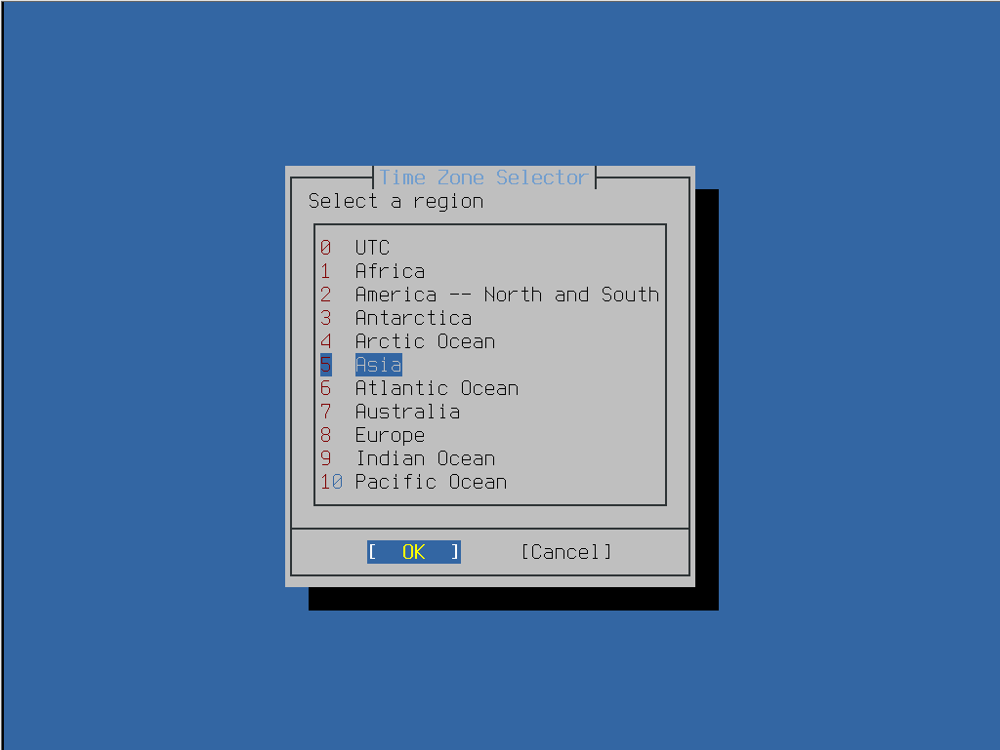

`Please select your region`

Set the system time zone. China belongs to `5 Asia`. Use the **arrow keys** to select and press **Enter** to confirm.


`Set country or region`

Select `9 China`. Use the **arrow keys** to select and press **Enter** to confirm.

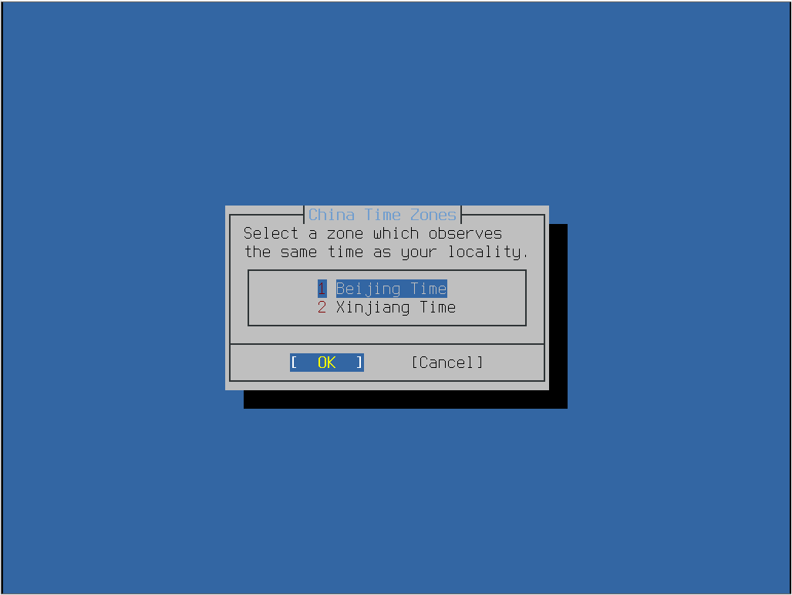

China uniformly uses UTC+8 time (Beijing Time); please select `1 Beijing Time`. Use the **arrow keys** to select and press **Enter** to confirm.


`Is the timezone abbreviation 'CST' appropriate?`

CST stands for China Standard Time; after confirming it is correct, press **Enter** to select `Yes`.

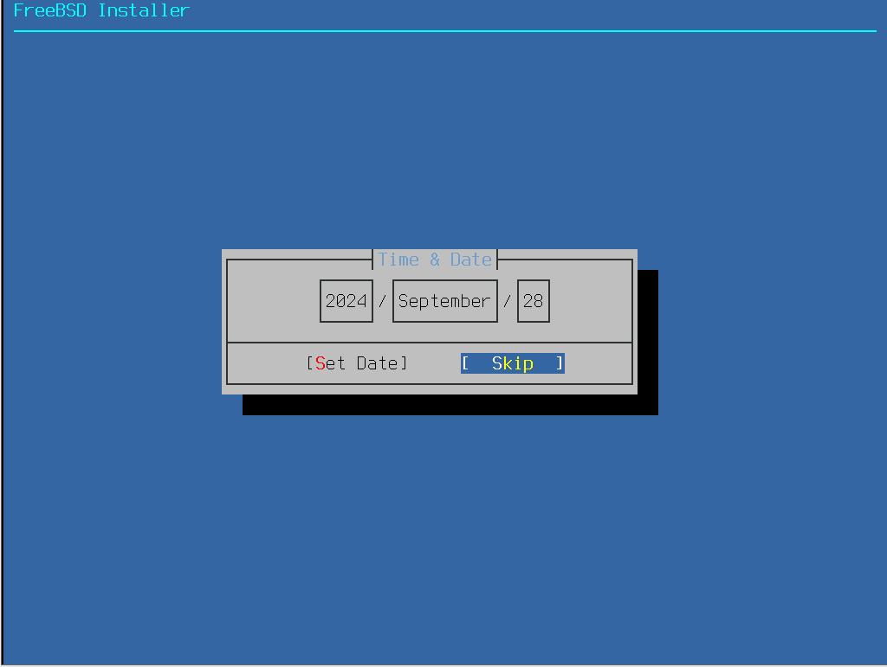

`Set time and date`

Press **Enter** directly to use the default settings.


`Time and date`

Press **Enter** to confirm.

## Startup Service Settings

After time zone settings are complete, select the services that will automatically run at system startup.

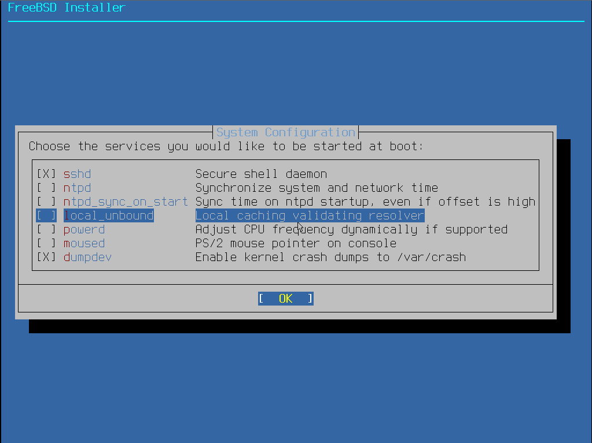

`Please select the services you would like to have started automatically at boot`

> **Warning**
>
> **Do not select all!**
>
> **Never** select `local_unbound`, as it may affect system DNS resolution (see FreeBSD Project. Bug 262290: After a normal FreeBSD installation and reboot, **/etc/resolv.conf** will be changed[EB/OL]. [2026-03-25]. <https://bugs.freebsd.org/bugzilla/show_bug.cgi?id=262290>. This bug report documents the local_unbound service causing resolv.conf changes). Unless you clearly understand its purpose.

| Option | Explanation |
| ------ | ----------- |
| `sshd` | Enable SSH remote access service |
| `ntpd` | Enable NTP network time protocol daemon for automatic clock synchronization |
| `ntpd_sync_on_start` | Synchronize time immediately at system startup |
| `local_unbound` | Enable local Unbound DNS cache forwarding resolver. Note: After enabling, you must manually configure DNS, otherwise you may not be able to connect to the internet normally. Not recommended for users who do not fully understand its functionality |
| `powerd` | Enable power management daemon, dynamically adjust CPU frequency to save energy |
| `moused` | Enable mouse support in the text console (tty) |
| `dumpdev` | Enable kernel crash dump functionality for system debugging |

> **Note**
>
> In FreeBSD 14, the display order of the service list is different: `local_unbound` is at the top of the list, followed by `sshd`, `moused`, `ntpd`, `ntpd_sync_on_start`, `powerd`, and `dumpdev`.

## Security Hardening

After startup service settings are complete, you need to configure system security hardening options to enhance system security.

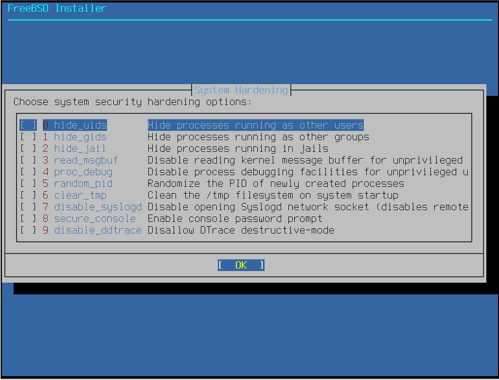

`Please select system security hardening options`

These are system security hardening options that can be enabled based on actual needs.

> **Tip**
>
> In FreeBSD installations prior to version 14, the `disable_sendmail` option appears in this step; it is recommended to select it. If this service is not disabled, there may be a delay of several minutes at each boot, and this service is mainly used for sending email, which most users do not need.

| Option | Explanation |
| ------ | ----------- |
| `0 hide_uids` | Hide processes owned by other users |
| `1 hide_gids` | Hide processes owned by other groups |
| `2 hide_jail` | Hide processes within jails |
| `3 read_msgbuf` | Prevent unprivileged users from reading the kernel message buffer (typically accessed via the `dmesg` command) |
| `4 proc_debug` | Disable process debugging functionality for unprivileged users |
| `5 random_pid` | Enable process PID randomization |
| `6 clear_tmp` | Automatically clean the **/tmp** directory at system startup |
| `7 disable_syslogd` | Disable syslogd network sockets (i.e., disable remote log reception) |
| `8 secure_console` | Enable console security protection (single-user mode also requires root password) |
| `9 disable_ddtrace` | Disable DTrace destructive operation mode |

## Installing Firmware

After security hardening settings are complete, install hardware firmware.

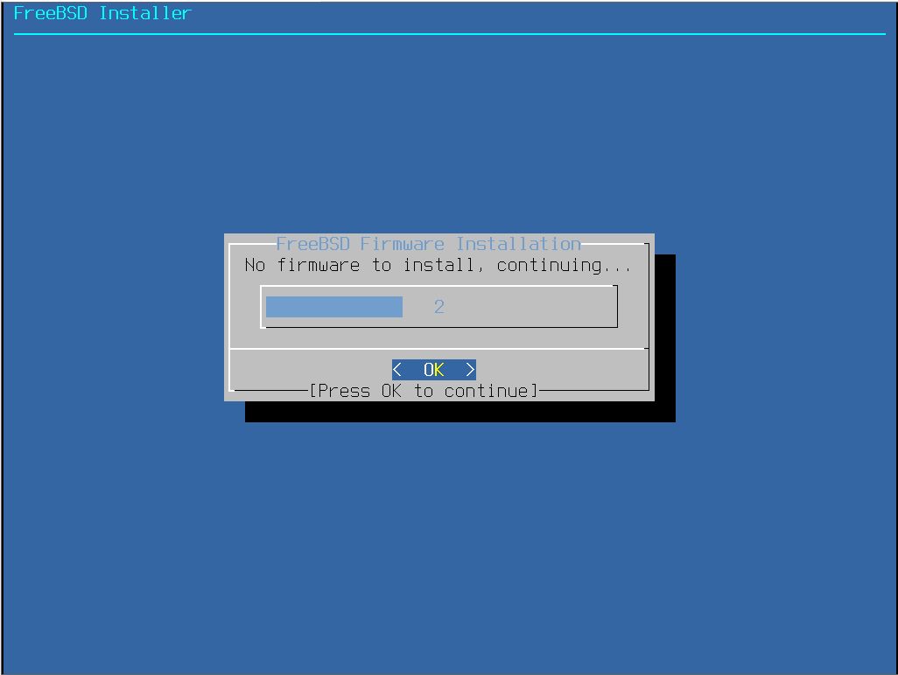

Automatically detect and install required hardware firmware.

(This screenshot is from a virtual machine installation)

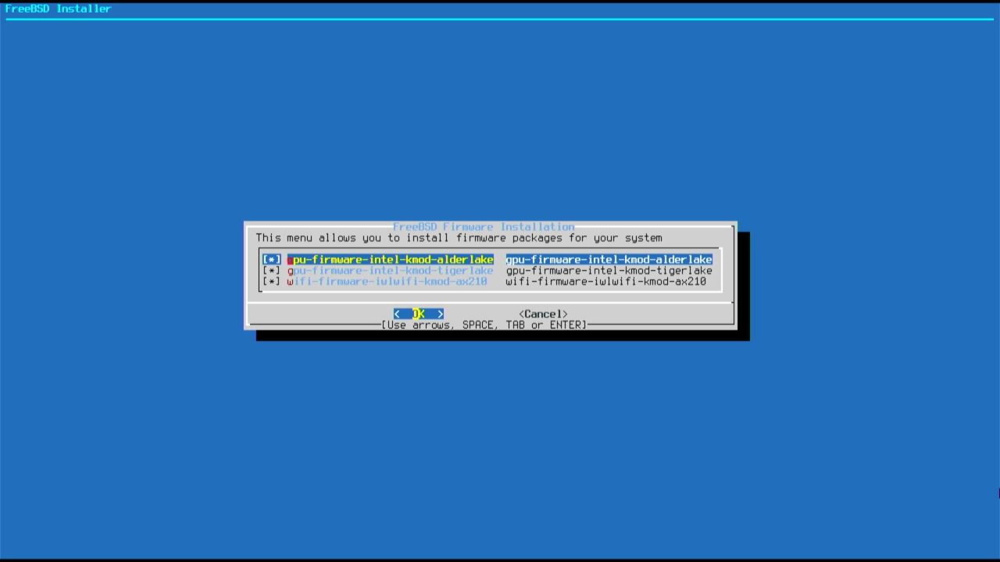

**(This screenshot is from a physical machine installation captured using a capture card)**

> **Warning**
>
> It is recommended to deselect all options in this step, i.e., do not install any firmware. Online installation may fail or take a long time due to network issues, and this step does not affect the basic boot and core functionality of the system. After canceling firmware installation, hardware such as wireless network cards and GPUs will not work properly at first system boot; you can supplement firmware installation via the `fwget` command after installation is complete and the system is connected to the internet;
>
> In FreeBSD 14 physical machine installations, this step may display a list of firmware that needs to be installed (such as graphics card firmware, etc.); please also deselect these and use the `fwget` command to obtain them after installation is complete.

### Appendix: Video Tutorials

The following videos are installation demonstrations for FreeBSD 14.2; the FreeBSD 15.0 installation process is highly similar and can be used as a reference. The validity of video links is subject to the access date:

- Bilibili. FreeBSD 14.2 Basic Installation and Configuration Tutorial[EB/OL]. [2026-03-25]. <https://www.bilibili.com/video/BV1STExzEEhh> (Physical machine)
- Bilibili. 002-VMware17 Installing FreeBSD 14.2[EB/OL]. [2026-03-25]. <https://www.bilibili.com/video/BV1gji2YLEoC> (Virtual machine)

## Creating a Regular User

After firmware installation is complete, create a regular user account.

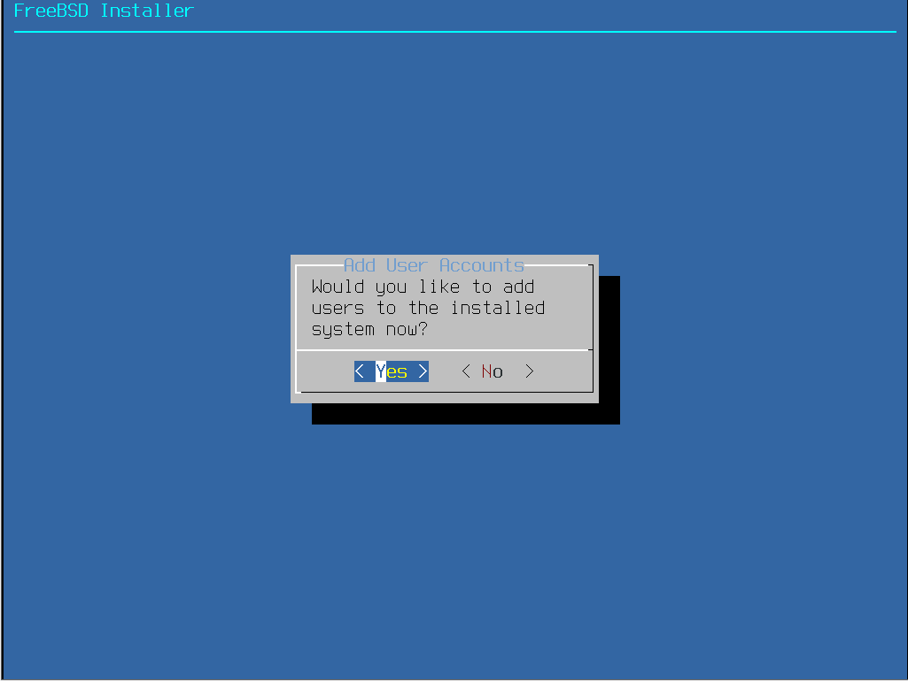

`Would you like to add a user to the installed system now?`

If you want to create one, press **Enter** to select `Yes`; if you do not need to create a regular user (using root only), use the **arrow keys** to select `No`.

> **Note**
>
> Most graphical display managers by default prohibit direct root user login. Therefore, without additional configuration (see other chapters), you may not be able to log into the desktop environment using the root account by default.

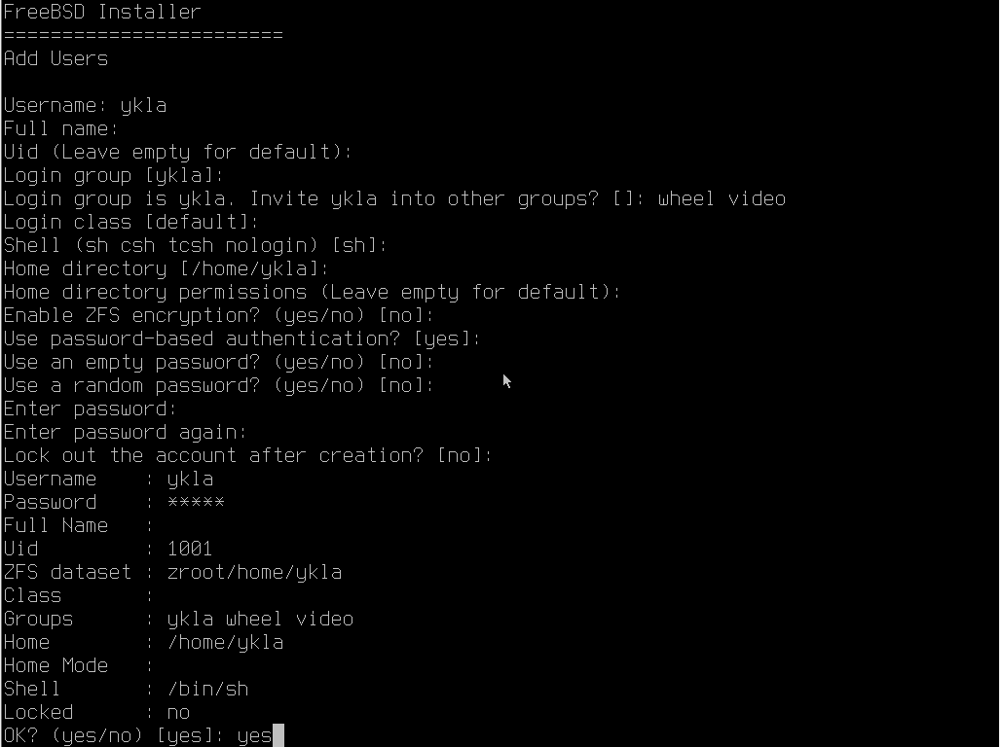

> **Warning**
>
> If you create a regular user, be sure to add them to both the `wheel` group (for `su` privilege escalation) and the `video` group (for graphics acceleration). Adding only the `wheel` group may prevent proper GPU access.

```sh
FreeBSD Installer # FreeBSD Installer
========================
Add Users # Add Users

Username: ykla # Enter username. Only lowercase letters (non-Latin characters not supported) or digits, cannot start with a hyphen. Maximum 16 characters (for historical reasons).
Full name: # Enter full name ①. Can be left empty. Cannot contain English colon :.
Uid (Leave empty for default):  # User UID, leave empty for default. Manual setting must be less than 32000 (historical reason: compatibility with early NFS and other protocols still using 16-bit UIDs; UIDs exceeding this range may cause identity mapping anomalies. Modern NFSv4 no longer uses numeric UIDs, but for backward compatibility, this limit is recommended).
Login group [ykla]: # User primary group
Login group is ykla. Invite ykla into other groups? []: wheel video # Invite user to join other groups, enter "wheel video" (separated by space)
Login class [default]: # User class
Shell (sh csh tcsh nologin) [sh]: # User default shell, default is sh
Home directory [/home/ykla]: # User home directory path, regular users default under /home
Home directory permissions (Leave empty for default): # User home directory permissions, leave empty for default
Enable ZFS encryption? (yes/no) [no]: # Whether to enable ZFS encryption (new in 14.1)
Use password-based authentication? [yes]:  # Whether to enable password authentication
Use an empty password? (yes/no) [no]:  # Whether to use an empty password, i.e., password is empty
Use a random password? (yes/no) [no]:  # Whether to use a random password. Setting yes will generate a random string and echo it to standard output. ②
Enter password:  # Enter password, no echo during password input (no **** mask displayed)
Enter password again:  # Enter password again to confirm, also no echo
Lock out the account after creation? [no]: # Whether to lock the account immediately after creation (disable the account)
Username    : ykla # Set username
Password    : ***** # Set user password
Full Name   : # Set full name
Uid         : 1001 # Set user UID
ZFS dataset : zroot/home/ykla # ZFS dataset corresponding to home directory (introduced in 14.1)
Class       :  # Set user class
Groups      : ykla wheel video # User groups
Home        : /home/ykla # Set user home directory path
Home Mode   :  # Set user home directory permissions
Shell       : /bin/sh # Set user default shell
Locked      : no # Whether the user is locked (disabled)
OK? (yes/no) [yes]: # Confirm whether the above settings are correct
adduser: INFO: Successfully added (ykla) to the user database. # User ykla has been successfully added to the database
Add another user? (yes/no) [no]: # Whether to continue adding other users
```

- ① If the full name is empty (i.e., not set), as a legacy behavior of the early UNIX system GECOS field, the system will assign a default value of `User &`. The relevant code is in the `static struct passwd fakeuser` structure in FreeBSD Project. freebsd-src/usr.sbin/pw/pw_user.c[EB/OL]. [2026-03-25]. <https://github.com/freebsd/freebsd-src/blob/main/usr.sbin/pw/pw_user.c>.

- ② If you choose to use a random password, a line will be displayed before the final confirmation message: `adduser: INFO: Password for (ykla) is: D1MnujkWMv/m`, where `D1MnujkWMv/m` is the generated random password.

Other parameters can usually be kept at their defaults. Starting from FreeBSD 14, the default shell for the root user has been changed to **/bin/sh** (previously **/bin/csh**).

Finally, it will ask `Add another user? (yes/no) [no]`; press **Enter** to end the user addition process, or type `yes` and press **Enter** to continue adding a second user.

### References

- FreeBSD Project. man adduser(8)[EB/OL]. [2026-03-25]. <https://man.freebsd.org/cgi/man.cgi?query=adduser&sektion=8>. This manual page explains the usage of the FreeBSD user addition command.

## Completing the Installation

After creating the regular user, complete the installation process.

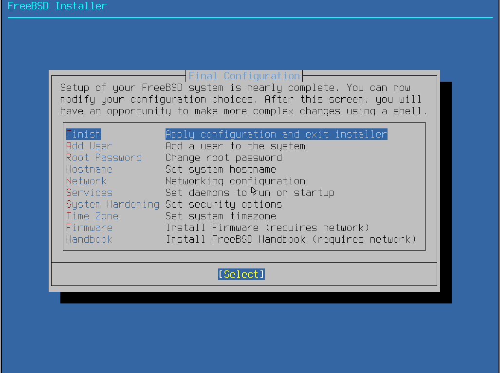

`Your FreeBSD system setup is nearly complete. You can now go back and modify previous configuration options. After this menu, you can also enter a Shell for more complex adjustments.`

Press **Enter** to select `Finish` to complete the installation.

| Configuration Option | Function Description |
| -------------------- | -------------------- |
| `Finish` | Apply all configuration and exit the installer |
| `Add User` | Add system users |
| `Root Password` | Reset root password |
| `Hostname` | Modify system hostname |
| `Network` | Reconfigure network |
| `Services` | Adjust services running at system startup |
| `System Hardening` | Modify security hardening options |
| `Time Zone` | Reset time zone |
| `Firmware` | Install firmware (requires network) |
| `Handbook` | Install FreeBSD Handbook (requires network) |

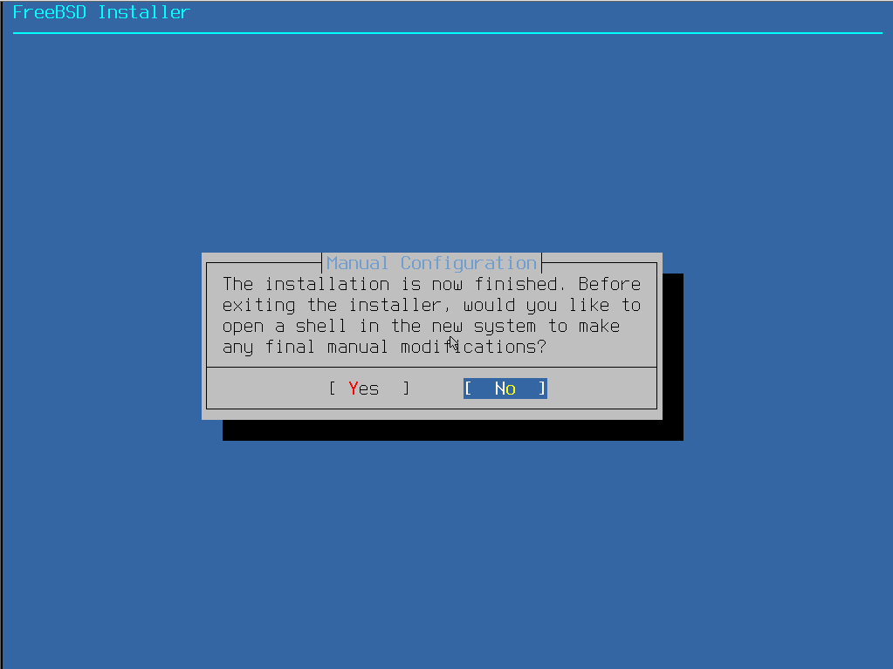

`Installation is now complete. Would you like to open a Shell in the new system for final manual adjustments before exiting the installer?`

Press **Enter** to select `No` to directly complete the installation (or select `Yes` to enter the shell).

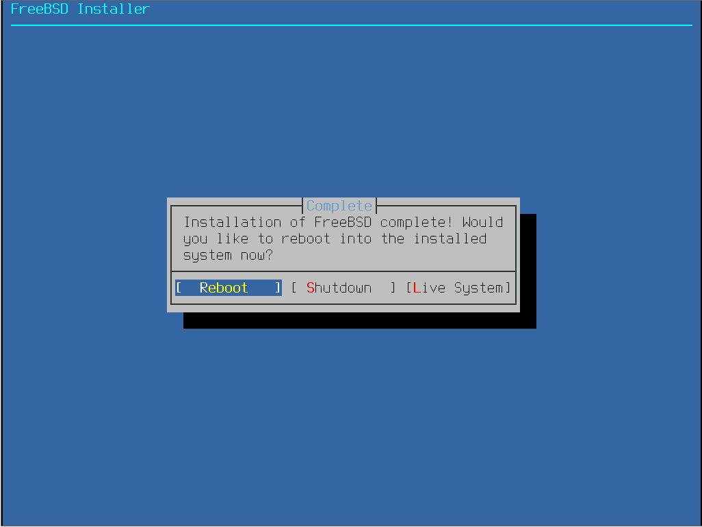

`FreeBSD installation is complete! Would you like to reboot now and enter the newly installed system?`

Press **Enter** to confirm the reboot.

## Welcome to the FreeBSD World

After installation is complete, reboot and enter the new FreeBSD system:

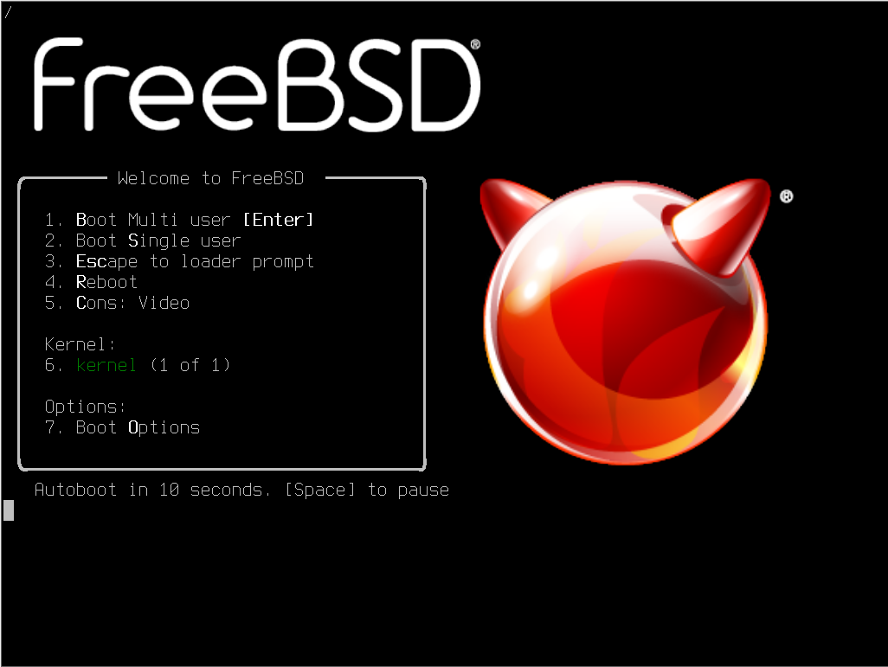

After the system has fully booted:

> **Tip**
>
> The FreeBSD base system does not include a graphical interface by default (Xorg is not installed), so after booting you will enter a text console interface (TTY).

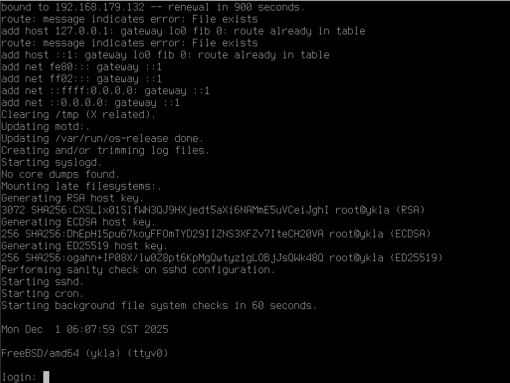

Enter the username `root` and the root password set during installation to log into the system.

> **Tip**
>
> When entering the password, it will not be displayed on the screen; there is no `****` mask prompt. After entering, press Enter directly to log in.

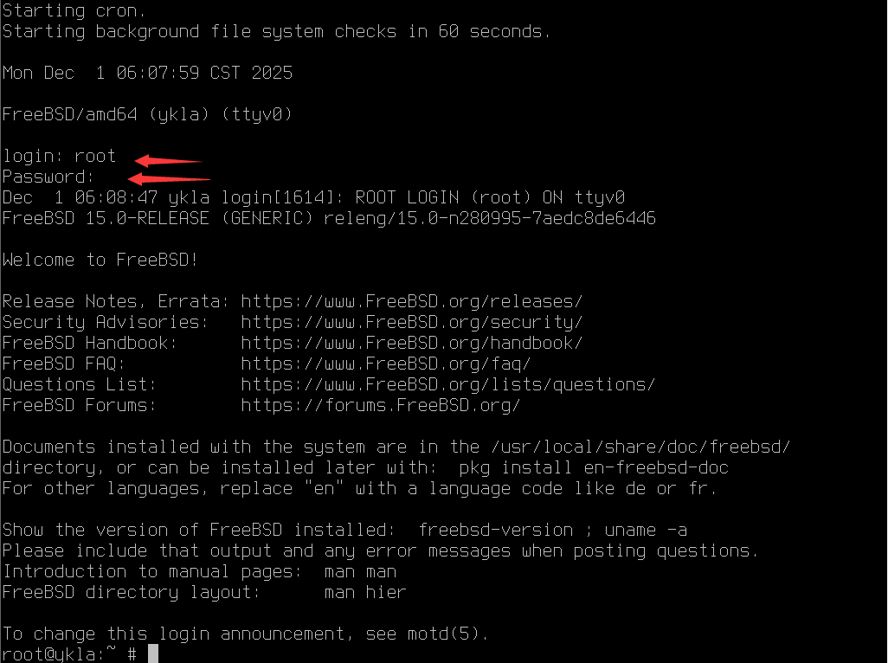
