# 4.4 Restoring a USB Boot Drive to a Normal Storage Device in Windows

After a USB storage device has been used as a system installation medium, its partition table structure may change, causing the operating system to be unable to fully recognize its available storage space.

The following provides three methods for restoring USB storage devices in a Windows environment.

> **Warning**
>
> The operations described in this section carry high risk and may damage some or all data. Do not proceed unless you have clearly accepted the worst-case outcome, made a complete and verifiable backup, and have a usable rollback plan.
>
> If you cannot resolve the issue on your own, seek professional technical services.

After using software such as Rufus or Win32DiskImager to create a USB boot drive for system installation, you may find that the USB flash drive's visible capacity is only about 30-100 MB (the EFI system partition; the exact size varies by image).


This USB flash drive has a capacity of 64 GB.

## Restoring a USB Boot Drive Using DiskGenius

First, the method for restoring a USB flash drive using DiskGenius is introduced. DiskGenius is a disk management tool; its official website is <https://www.diskgenius.cn/>. The free version of this software can meet the needs of the operations described in this section.

### Downloading DiskGenius

First, you need to download the DiskGenius software. When downloading, most users should select DiskGenius. DiskGenius download page[EB/OL]. [2026-03-25]. <https://www.diskgenius.cn/download.php>, which provides download links for various versions of DiskGenius.

After downloading, you will get a ZIP compressed package.

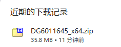

Create a new folder `1` on the desktop (path is **C:\Users\Username\Desktop\1**), and extract all files from the compressed package to this folder.

Related file structure:

```powershell
C:\Users\Username\
└── Desktop\
    └── 1\
        └── DiskGenius\
            └── DiskGenius.exe # DiskGenius executable file
```


The extracted files should appear as shown below:

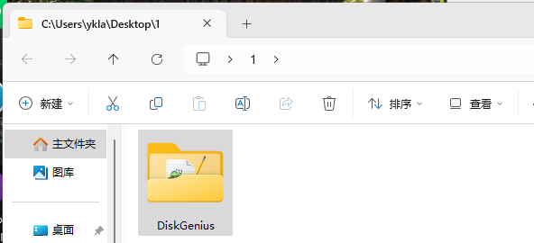

### Launching DiskGenius

After downloading and extracting are complete, launch DiskGenius. Simply find and run the extracted executable file.

To launch DiskGenius, double-click `DiskGenius.exe` (path such as **C:\Users\Username\Desktop\1\DiskGenius\DiskGenius.exe**; the specific path varies depending on the extraction location).

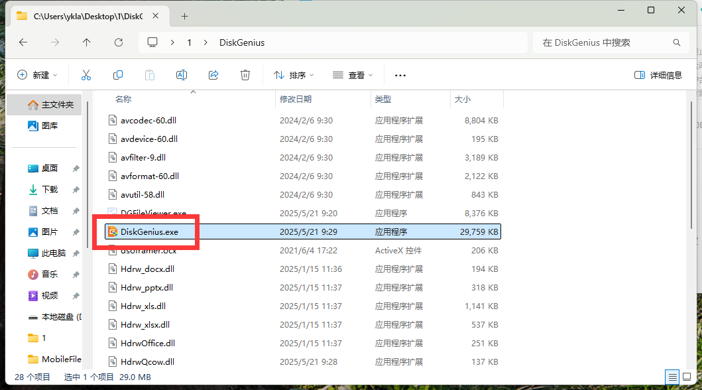

Agree to the license:

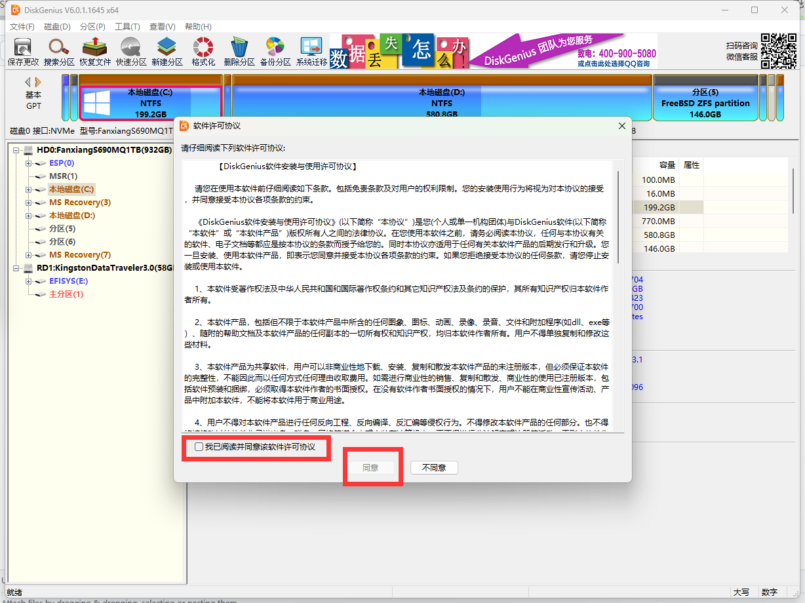

### Identifying the USB Flash Drive

After launching DiskGenius, you first need to determine which device is the target USB flash drive.

To determine which is the target USB flash drive, you can usually judge by the USB flash drive's capacity. If you are unsure of the USB flash drive's capacity, check your purchase records or remove the USB flash drive and check the capacity marked on its casing.

- Judging by capacity: A 64 GB USB flash drive typically displays as approximately 57-59.6 GB in Windows/Linux (because the operating system uses binary units GiB but labels them as GB, 64×10⁹÷1024³≈59.6; actual display is also affected by file system overhead), and displays as 64 GB in macOS (macOS uses decimal units);
- Judging by drive letter: In the image below, you can identify it by "EFISYS(E:)" (E drive), which is a USB boot drive created using Rufus;
- Judging by the interface displayed in DiskGenius: The "Hard Disk 1 Interface: USB" label at the top indicates this is a USB device, i.e., the target USB flash drive.

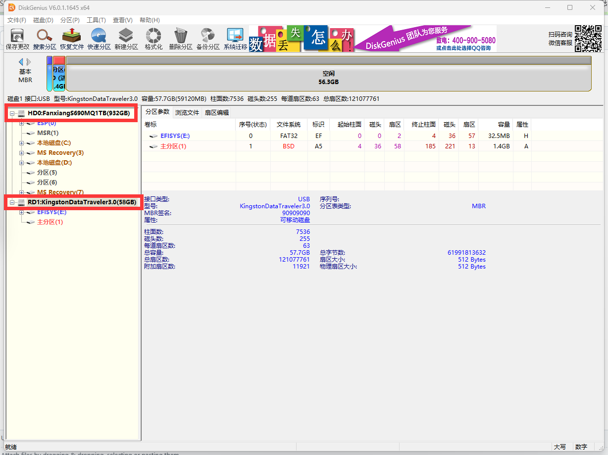

### Restoring the USB Flash Drive

After confirming the target USB flash drive, begin the restoration operation. First, delete all existing partitions on the USB flash drive.

After confirming the target USB flash drive, right-click on it and select "Delete All Partitions":


After confirming, select "Yes".

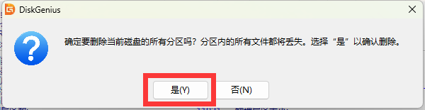

USB flash drive state after deletion:


Right-click on the empty area and select "Create New Partition".

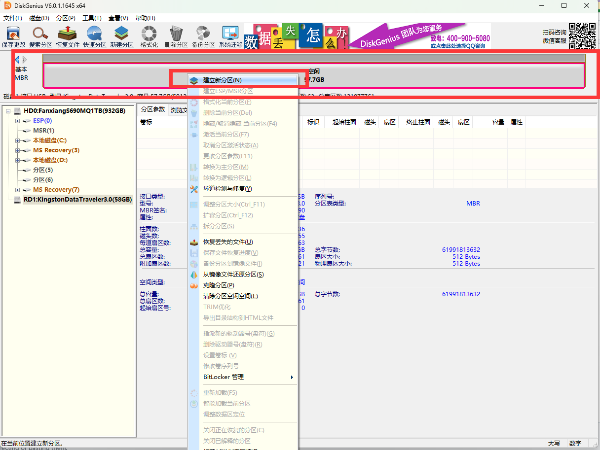

Set the parameters as follows: select `exFAT` for the file system (good compatibility, mainstream operating systems all support read/write, and no single file 4 GB size limit), check "Align to the following number of sectors", and select "4096 sectors" (achieving 4K alignment).


Click the "Save Changes" button in the upper left corner.

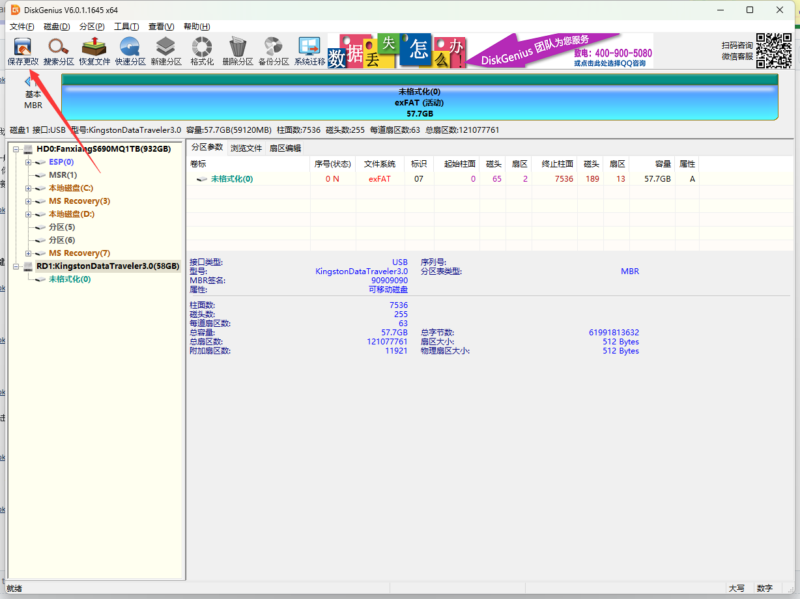

After confirming, select "Yes".

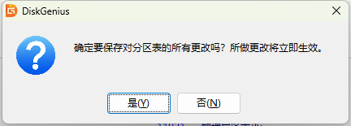

After confirming, select "Yes".

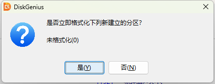

Final result:

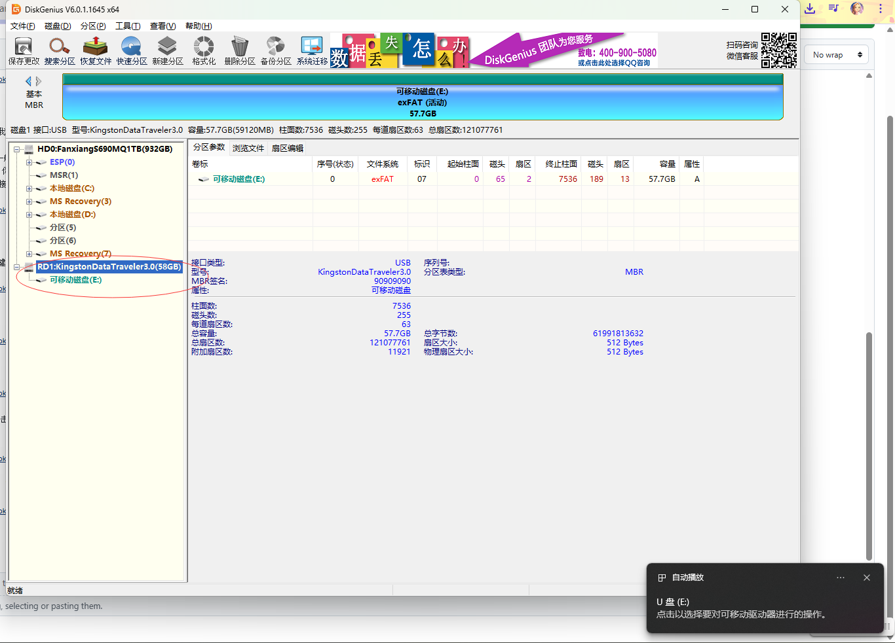

Open File Explorer:


Restoration complete.

## Restoring a USB Boot Drive Using AOMEI Partition Assistant

In addition to DiskGenius, you can also use AOMEI Partition Assistant to restore a USB flash drive. The usage method is basically the same as the DiskGenius method described above.

### Downloading and Installing AOMEI Partition Assistant

First, you need to download the AOMEI Partition Assistant software.

AOMEI Partition Assistant official website: <https://www.disktool.cn/>, which is the official website for AOMEI Partition Assistant.

Click AOMEI Technology. AOMEI Partition Assistant download page[EB/OL]. [2026-03-25]. <https://www.disktool.cn/download.html>, which provides download links for various versions of AOMEI Partition Assistant. It is recommended to download the "Green Edition" (no installation required, can be run directly). In the extracted directory, find "PartAssist.exe" (the executable file name may vary slightly), right-click and select "Open".


> **Tip**
>
> The Professional Edition will prompt for an authorization code; enter "1122". See AOMEI Technology. AOMEI Partition Assistant FAQ[EB/OL]. [2026-03-25]. <https://www.disktool.cn/faq/partition-assistant.html>, which provides frequently asked questions about AOMEI Partition Assistant, "Partition Assistant usage code: 1122".
>
> 

### Identifying the USB Flash Drive Device

After launching AOMEI Partition Assistant, first determine which device is the target USB flash drive.

You can determine whether a device is a USB flash drive using the following information (if the interface is not fully displayed, use the mouse scroll wheel to scroll down):


Open "Properties and Health":

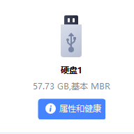

Observe the interface:


### Restoring the USB Boot Drive

After confirming the target USB flash drive, begin the restoration operation: first delete all partitions, then create a new partition.

#### Deleting All Partitions

First, you need to delete all partitions on the USB flash drive.

Select the USB flash drive device, right-click and select "Delete All Partitions".


In the confirmation dialog, click "OK" to execute the "Delete All Partitions" operation.


The interface after the operation is as shown below. Click the "Submit" button in the upper left corner to confirm and apply the above changes.

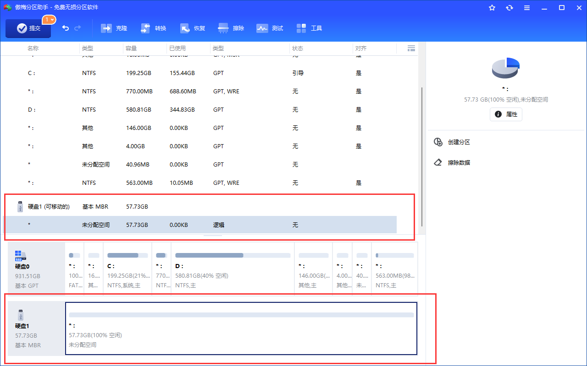

Click "Execute".

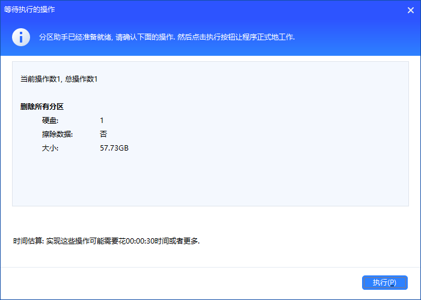

Confirm.


Partition deletion complete.

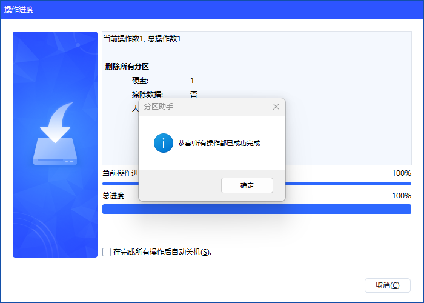

#### Creating a New Partition

After deleting all partitions, you need to create a new partition for the USB flash drive.

Click the USB flash drive at the bottom, right-click, and select "Create Partition".


Set the file system to "exFAT", then click the "OK" button.


Then click "Submit" in the upper left corner.

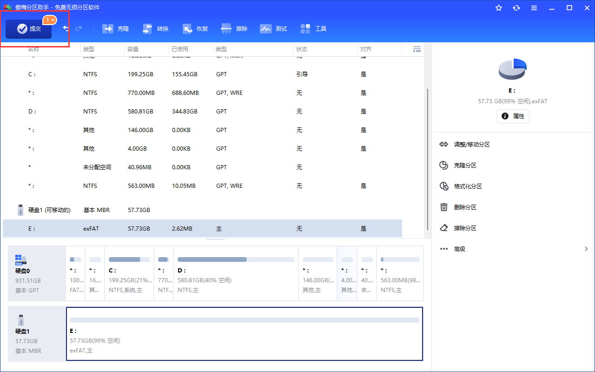

In the confirmation window that pops up:

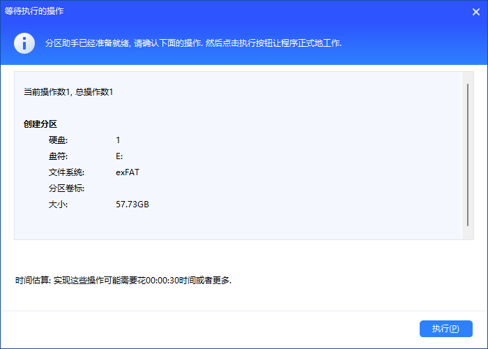

Execute:


At this point, the software has automatically assigned drive letter E to the USB flash drive.

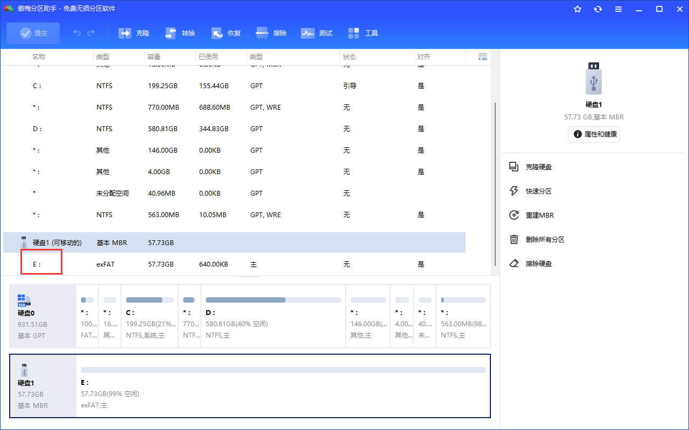

## Restoring via the diskpart Command

In addition to graphical interface tools, you can also use the Windows built-in command-line tool diskpart to restore a USB flash drive. To restore a USB flash drive using the command-line tool, first open PowerShell as an administrator, then select the appropriate operation steps based on the USB flash drive's partition table type.

MBR (Master Boot Record) and GPT (GUID Partition Table) are two common disk partition table formats, compared as follows:

| Feature | MBR | GPT |
| ------- | --- | --- |
| Full Name | Master Boot Record | GUID Partition Table |
| Applicable Scenarios | Older computers | Modern computers |
| Maximum Disk Capacity | 2 TB | 9.4 ZB |
| Maximum Number of Partitions | 4 primary partitions | 128 (Windows) |
| Boot Method | BIOS/Legacy | UEFI |

Open PowerShell: Right-click the Windows icon and select "Windows PowerShell (Administrator)".

### MBR Partition Table

First, the method for restoring a USB flash drive with an MBR partition table is introduced.

```powershell
PS C:\WINDOWS\system32> diskpart # Enter diskpart

Microsoft DiskPart version 10.0.26100.1150

Copyright (C) Microsoft Corporation.
On computer: DESKTOP-M5P610N

DISKPART> list disk # List all disks. Disk 1 has no GPT flag, indicating it uses an MBR partition table

  Disk ###  Status           Size     Free     Dyn  GPT
  --------  -------------  -------  -------  ---  ---
  Disk 0    Online              931 GB    41 MB        *
  Disk 1    Online               57 GB  5120 KB

DISKPART> sel disk 1 # Select disk 1

Disk 1 is now the selected disk.

DISKPART> clean # Clear all partitions on disk 1

DiskPart succeeded in cleaning the disk.

DISKPART> cre part pri # Create a primary partition on disk 1

DiskPart succeeded in creating the specified partition.

DISKPART> list part # List all primary partitions on disk 1

  Partition ###       Type              Size     Offset
  -------------  ----------------  -------  -------
* Partition      1    Primary                  57 GB  1024 KB

DISKPART> sel part 1 # Select primary partition 1

Partition 1 is now the selected partition.

DISKPART> format fs=exfat quick # Quick format the selected partition as exFAT file system

  100 percent completed

DiskPart successfully formatted the volume.

DISKPART> active # Set primary partition 1 as active

DiskPart marked the current partition as active.

DISKPART> ass letter=E # Mount to E drive, or you can remove the USB flash drive and reinsert it

DiskPart successfully assigned the drive letter or mount point.
```

### GPT Partition Table

```powershell
PS C:\WINDOWS\system32> diskpart

Microsoft DiskPart version 10.0.26100.1150

Copyright (C) Microsoft Corporation.
On computer: DESKTOP-M5P610N

DISKPART> list disk # List disks

  Disk ###  Status           Size     Free     Dyn  Gpt
  --------  -------------  -------  -------  ---  ---
  Disk 0    Online              931 GB    41 MB        *
  Disk 1    Online               57 GB      0 B

DISKPART> sel disk 1 # Select disk 1

Disk 1 is now the selected disk.

DISKPART> list disk # The currently selected disk will have a * marker

  Disk ###  Status           Size     Free     Dyn  Gpt
  --------  -------------  -------  -------  ---  ---
  Disk 0    Online              931 GB    41 MB        *
* Disk 1    Online               57 GB      0 B

DISKPART> clean # Clear the disk

DiskPart succeeded in cleaning the disk.

DISKPART> convert gpt # Convert the selected disk to GPT partition table format

DiskPart successfully converted the selected disk to GPT format.

DISKPART> list disk # List all disks

  Disk ###  Status           Size     Free     Dyn  Gpt
  --------  -------------  -------  -------  ---  ---
  Disk 0    Online              931 GB    41 MB        *
* Disk 1    Online               57 GB    57 GB        *

DISKPART> cre part pri # Create primary partition

DiskPart succeeded in creating the specified partition.

DISKPART> list part # List all partitions on disk 1

  Partition ###       Type              Size     Offset
  -------------  ----------------  -------  -------
* Partition      1    Primary                  57 GB  1024 KB

DISKPART> format fs=exfat quick # Quick format the selected partition as exFAT file system

  100 percent completed

DiskPart successfully formatted the volume.

DISKPART> ass letter=E # Assign the USB flash drive to drive letter E

DiskPart successfully assigned the drive letter or mount point.
```
