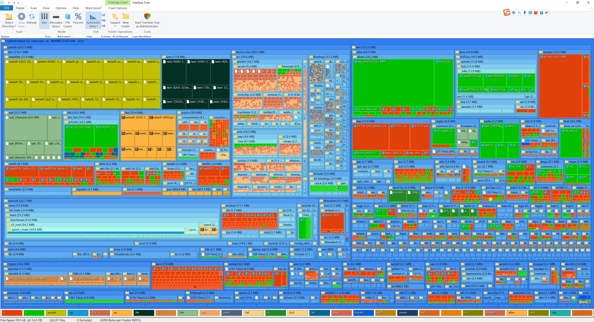
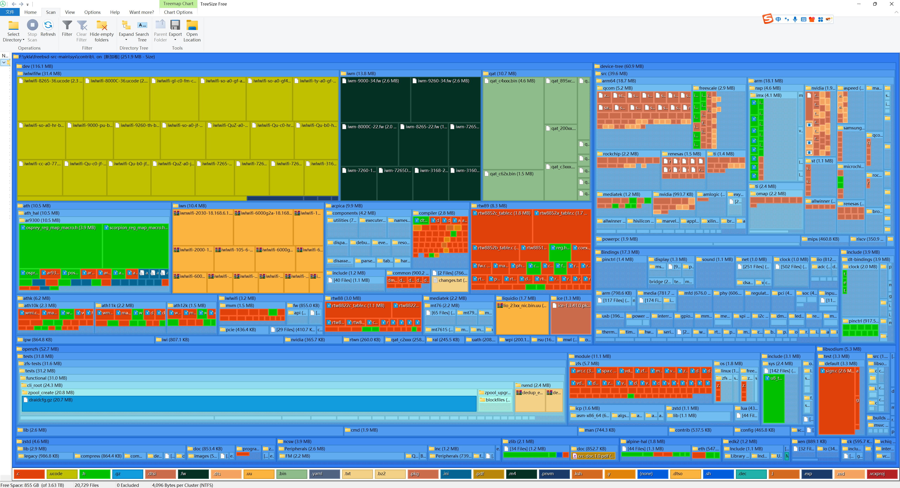

# 40.1 FreeBSD Source Code Directory Structure

If the source code has not been installed yet, please refer to the earlier chapter on obtaining the source code using Git.

The FreeBSD system source code is organized by function into directories such as bin, lib, share, usr.bin, and so on. The overall structure is shown as a tree diagram.

## FreeBSD src Directory Structure

Understanding the directory structure of the FreeBSD source code helps in comprehending how the system is organized.


Image generated by [treesize_free](https://www.jam-software.com/treesize_free).

The contrib directory contains third-party software integrated into the FreeBSD project. The following figure shows the contents of this directory:


The following is a detailed description of the **/usr/src/** directory structure:

```sh
/usr/src/
├── .arcconfig                   # Phabricator configuration file
├── .arclint                     # Used for Lint checks
├── .cirrus-ci                   # Cirrus CI script for installing pkg
├── .cirrus.yml                  # Cirrus CI configuration file
├── .clang-format                # ClangFormat tool configuration file
├── .git-blame-ignore-revs      # Git configuration for ignoring specific commits
├── .gitattributes               # Git configuration file
├── .github/                     # GitHub-related configuration
├── .gitignore                   # Git ignore file configuration
├── .mailmap                     # Author and committer name mapping
├── CONTRIBUTING.md              # GitHub contribution guidelines
├── COPYRIGHT                    # Copyright notice
├── LOCKS                        # Code review requirements
├── MAINTAINERS                  # FreeBSD maintainer processes
├── Makefile                     # Project build process definition
├── Makefile.inc1                # Build process environment variable settings
├── Makefile.libcompat          # Makefile for compatibility libraries
├── Makefile.sys.inc             # Build process file inclusion order
├── ObsoleteFiles.inc            # List of obsolete files to be deleted
├── README.md                    # Readme file
├── RELNOTES                     # Release notes
├── UPDATING                     # Major changes notes for FreeBSD-CURRENT
├── bin/                         # System and user commands
├── cddl/                        # Commands and libraries under CDDL license (DTrace, etc.)
├── contrib/                     # Third-party software
├── crypto/                      # Cryptography-related source code
│   ├── heimdal/                 # Heimdal Kerberos 5 implementation
│   ├── krb5/                    # MIT Kerberos 5 implementation
│   ├── libecc/                  # Portable elliptic curve cryptography library
│   ├── openssh/                 # OpenSSH source code
│   └── openssl/                 # OpenSSL source code
├── etc/                         # /etc templates
├── gnu/                         # Software under GPL and LGPL licenses
├── include/                     # System include files
├── kerberos5/                   # Heimdal Kerberos 5 implementation
├── krb5/                        # MIT Kerberos 5 implementation
├── lib/                         # System libraries
├── libexec/                     # System daemons
├── packages/                    # PkgBase build infrastructure
├── release/                     # Toolchain for building ISO, img, and images
├── rescue/                      # Build statically linked /rescue tools
├── sbin/                        # System commands
├── secure/                      # Cryptographic libraries and commands
├── share/                       # Shared resources
├── stand/                       # Boot loader source code
├── sys/                         # Kernel source code
├── targets/                     # Experimental DIRDEPS_BUILD mechanism (dependency-based build system)
├── tests/                       # Regression tests runnable via Kyua
├── tools/                       # Tools for regression testing and other miscellaneous tasks
├── usr.bin/                     # User commands
└── usr.sbin/                    # System administrator commands
```

## FreeBSD Kernel Source Code Directory Structure

The kernel source code is the core of the FreeBSD system. Understanding its directory structure helps in comprehending the system architecture. The following figure shows the overall organization of the kernel source code:



The contrib directory within the kernel source code also contains important third-party components. The following figure shows the contents of this directory:



The following is a detailed description of the **/usr/src/sys** kernel source code directory structure:

```sh
/usr/src/sys/
├── Makefile                     # Used to define the project build process
├── README.md                    # Readme file
├── amd64/                       # x86-64 architecture support
├── arm/                         # 32-bit ARM architecture support
├── arm64/                       # 64-bit ARM architecture support
├── bsm/                         # Basic Security Module (BSM) headers, audit-related
├── cam/                         # Common Access Method (CAM), storage subsystem
├── cddl/                        # Source code under CDDL license
├── compat/                      # Linux compatibility layer and FreeBSD 32-bit compatibility
├── conf/                        # Kernel build configuration layer
├── contrib/                     # Third-party software
│   └── dev/                     # Some device drivers (including wireless NICs, ACPI, Ethernet, etc.)
├── crypto/                      # Cryptographic drivers
├── ddb/                         # Interactive kernel debugger (FreeBSD built-in debugger)
├── dev/                         # Device drivers and other architecture-independent code
├── dts/                         # Device Tree Source (DTS) device tree source code
├── fs/                          # File systems other than UFS, NFS, and ZFS
├── gdb/                         # Kernel remote GDB stub implementation
├── geom/                        # GEOM framework (block device layer)
├── gnu/                         # Software under GPL and LGPL licenses
├── isa/                         # Industry Standard Architecture (ISA) bus related
├── kern/                        # Main part of the kernel
├── kgssapi/                     # GSSAPI-related files
├── libkern/                     # Provides libc-like functions for the kernel
├── modules/                     # Kernel module infrastructure
├── net/                         # Core networking code
├── net80211/                    # Wireless networking (IEEE 802.11)
├── netgraph/                    # Graph-based networking subsystem
├── netinet/                     # IPv4 protocol implementation
├── netinet6/                    # IPv6 protocol implementation
├── netipsec/                    # IPsec protocol implementation
├── netlink/                     # Kernel network configuration protocol
├── netpfil/                     # Packet filter implementation
├── netsmb/                      # SMB protocol implementation
├── nfs/                         # NFS network file system
├── nfsclient/                   # NFS client
├── nfsserver/                   # NFS server
├── nlm/                         # Network Lock Manager (NLM) protocol
├── ofed/                        # OFED-related (InfiniBand)
├── opencrypto/                  # OpenCrypto framework
├── riscv/                       # 64-bit RISC-V support
├── rpc/                         # Remote Procedure Call (RPC) related
├── security/                    # Security features
├── sys/                         # Kernel headers
├── teken/                       # Terminal emulator related
├── tests/                       # Kernel unit tests
├── tools/                       # Tools and scripts related to kernel build and development
├── ufs/                         # UFS file system
├── vm/                          # Virtual memory system
├── x86/                         # x86 architecture-related code (shared by i386 and amd64)
├── xdr/                         # External Data Representation (XDR) related
└── xen/                         # Open source virtual machine monitor
```
