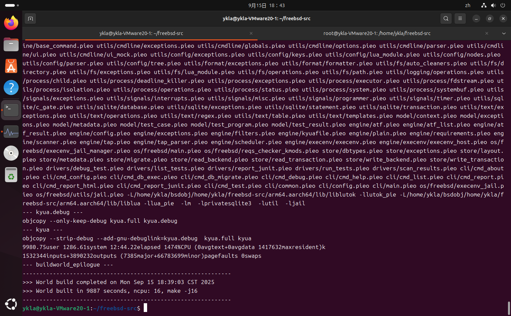
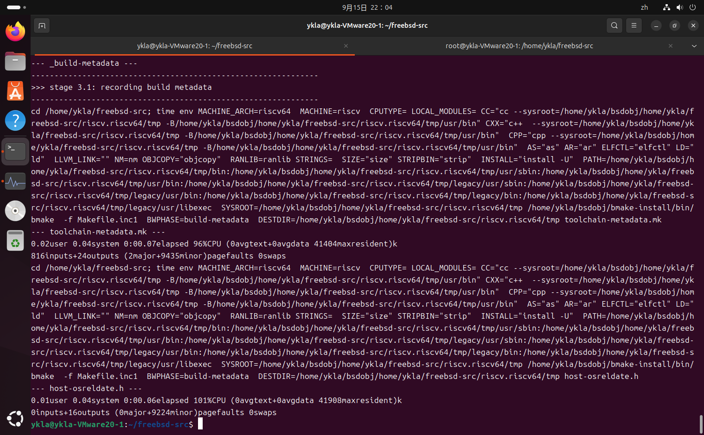

# 40.7 Cross-Building FreeBSD on Linux

Cross-building FreeBSD on Linux (using Ubuntu 24.04 LTS as an example) requires at least 12 GB of memory and 16 GB of swap. This section covers the steps from environment preparation to complete building.

## Device Environment

This section uses Ubuntu 24.04 LTS as an example; other Linux distributions can also be referenced. The build process has high system resource requirements; the recommended configuration is:

- Memory: Recommended capacity of at least 12 GB.
- Swap: Recommended capacity of 16 GB.

Insufficient memory may cause build failures.

## Installing Packages

Building FreeBSD requires installing the following packages and development libraries. Execute with root privileges:

```sh
apt update
apt install git build-essential libbz2-dev libarchive-dev libssl-dev flex
```

Purpose of each package:

| Package | Purpose |
| ------- | ------- |
| `git` | Version control tool for obtaining FreeBSD source code |
| `build-essential` | Basic build tool collection |
| `libbz2-dev` | bzip2 compression library development files |
| `libarchive-dev` | Archive library development files |
| `libssl-dev` | SSL library development files |
| `flex` | Lexical analyzer generator tool |

Some users may need to change software sources based on their network environment.

## Disabling Screen Blank

During long build processes, preventing the system from automatically turning off the screen can avoid build interruptions due to unexpected sleep.

For the GNOME desktop environment, go to "Settings" → "Power" → "Power Saving Options" and set "Screen Blank" to "Never". If using a pure command-line interface, you can use terminal multiplexers (such as `tmux` or `screen`) to keep sessions running.

## Disabling systemd-oomd

Starting from Ubuntu 22.04 LTS (Desktop), the system enables the `systemd-oomd` service by default. This service forcefully terminates high-usage processes when the system reaches memory thresholds, which may cause build failures without any notification to the user.

Disable systemd-oomd auto-start and stop it immediately:

```sh
systemctl mask --now systemd-oomd systemd-oomd.socket
```

Check the running status of `systemd-oomd`:

```sh
# systemctl status systemd-oomd systemd-oomd.socket     # View the running status of systemd-oomd and its socket unit
○ systemd-oomd.service # Should show a black circle indicating normal state; green indicates the service is still running
     Loaded: masked (Reason: Unit systemd-oomd.service is masked.)
     Active: inactive (dead) since Mon 2025-09-15 16:08:39 CST; 4h 17min ago
   Duration: 2min 18.952s
   Main PID: 170032 (code=exited, status=0/SUCCESS)
     Status: "Shutting down..."
        CPU: 217ms

Sep 15 16:06:20 ykla-VMware20-1 systemd[1]: Starting systemd-oomd.service - Userspace Out-Of-Memory (OOM) Killer...
Sep 15 16:06:20 ykla-VMware20-1 systemd[1]: Started systemd-oomd.service - Userspace Out-Of-Memory (OOM) Killer.
Sep 15 16:08:39 ykla-VMware20-1 systemd[1]: Stopping systemd-oomd.service - Userspace Out-Of-Memory (OOM) Killer...
Sep 15 16:08:39 ykla-VMware20-1 systemd[1]: systemd-oomd.service: Deactivated successfully.
Sep 15 16:08:39 ykla-VMware20-1 systemd[1]: Stopped systemd-oomd.service - Userspace Out-Of-Memory (OOM) Killer.

○ systemd-oomd.socket # Should show a black circle indicating normal state; green indicates the service is still running
     Loaded: masked (Reason: Unit systemd-oomd.socket is masked.)
     Active: inactive (dead)

...some log output omitted...
```

## Cloning FreeBSD Source Code with Git

> **Tip**
>
> The `/home/ykla` path shown in the examples in this section is an example path; please replace it with your actual user home directory.

Clone the FreeBSD source code repository:

```sh
cd /home/ykla
git clone --depth 1 https://github.com/freebsd/freebsd-src
```

`--depth 1` specifies a shallow clone, fetching only the latest commit, which significantly reduces download size and storage space. If you need the complete history, omit this parameter.

After cloning, the source code is located at **/home/ykla/freebsd-src** (the `freebsd-src` directory is automatically created by Git).

To build a specific version (such as 15.0-RELEASE), you can switch to the corresponding branch after cloning:

```sh
cd freebsd-src
git checkout releng/15.0
```

## Creating a Directory for Build Artifacts

Create the directory `bsdobj` to store build artifacts:

```sh
$ mkdir -p /home/ykla/bsdobj
```

The `-p` option: creates parent directories if they do not exist.

The directory structure is as follows:

```sh
/home/ykla/
├── freebsd-src/          # FreeBSD source code
└── bsdobj/               # Build artifacts directory
```

## Building Toolchain and World (User Space)

The `buildworld` target is used to build the complete FreeBSD user space (world), including system libraries, command-line tools, etc. This is the first step of cross-building.

Switch to the FreeBSD source code root directory:

```sh
$ cd /home/ykla/freebsd-src
```

Specify the object directory and use make.py to build the arm64/aarch64 base system, while enabling AArch64 and ARM LLVM backends and disabling 32-bit library support:

```sh
MAKEOBJDIRPREFIX=/home/ykla/bsdobj tools/build/make.py --bootstrap-toolchain -j16 TARGET=arm64 TARGET_ARCH=aarch64 WITH_LLVM_TARGET_AARCH64=yes WITH_LLVM_TARGET_ARM=yes WITHOUT_LIB32=yes buildworld
```

Option descriptions:

| Item | Description |
| ---- | ----------- |
| **MAKEOBJDIRPREFIX=/home/ykla/bsdobj** | Specify the output directory for all build artifacts |
| **tools/build/make.py** | Official script for starting the build process on non-FreeBSD systems |
| **--bootstrap-toolchain** | Use the LLVM/Clang/LLD bootstrap toolchain from the source tree instead of the one installed via apt, making it closer to a native build |
| **-j16** | Enable 16 parallel compilation tasks. Typically matches the CPU thread count, e.g., use `-j4` for 4 threads |
| **TARGET=arm64** | Set the target platform to arm64 |
| **TARGET_ARCH=aarch64** | Set the target CPU architecture to aarch64 |
| **WITH_LLVM_TARGET_AARCH64=yes** | Enable the LLVM AArch64 backend |
| **WITH_LLVM_TARGET_ARM=yes** | Enable the LLVM ARM backend |
| **WITHOUT_LIB32=yes** | Disable 32-bit compatibility libraries and related components; currently not passing tests |
| **buildworld** | Build the FreeBSD user space (world) |

The `buildworld` build takes a long time and may require several hours depending on hardware configuration. After a successful build, you can verify by checking whether the corresponding architecture directory structure has been generated under the `bsdobj` directory.

To verify whether the build was successful, refer to the following figure:



## Building the Kernel Toolchain

Ensure you are still in the FreeBSD source code root directory:

```sh
$ cd /home/ykla/freebsd-src
```

Build the kernel toolchain using the same parameters as `buildworld`:

```sh
$ MAKEOBJDIRPREFIX=/home/ykla/bsdobj tools/build/make.py --bootstrap-toolchain -j16 TARGET=arm64 TARGET_ARCH=aarch64 WITH_LLVM_TARGET_AARCH64=yes WITH_LLVM_TARGET_ARM=yes WITHOUT_LIB32=yes kernel-toolchain
```

Except for the `kernel-toolchain` at the end, all other option parameters remain the same.

To verify the kernel toolchain build result, refer to the following figure:


## Building the Kernel

Ensure you are still in the FreeBSD source code root directory:

```sh
$ cd /home/ykla/freebsd-src
```

Build the arm64/aarch64 kernel using the specified parameters:

```sh
$ MAKEOBJDIRPREFIX=/home/ykla/bsdobj tools/build/make.py --bootstrap-toolchain -j16 TARGET=arm64 TARGET_ARCH=aarch64 WITH_LLVM_TARGET_AARCH64=yes WITH_LLVM_TARGET_ARM=yes WITHOUT_LIB32=yes buildkernel
```

Except for the `buildkernel` at the end, all other option parameters remain the same.

To verify the kernel build result, refer to the following figure:


## Appendix: RISC-V 64

Build the riscv64 architecture kernel toolchain using the bootstrap toolchain and ignoring GCC detection:

```sh
$ MAKEOBJDIRPREFIX=/home/ykla/bsdobj tools/build/make.py --bootstrap-toolchain TRY_GCC_BROKEN=yes -j16 TARGET=riscv TARGET_ARCH=riscv64 kernel-toolchain
```

To verify the RISC-V kernel toolchain build result, refer to the following figure:



Build the riscv64 kernel using the cross-compiler and ignoring GCC detection:

```sh
$ MAKEOBJDIRPREFIX=/home/ykla/bsdobj tools/build/make.py --bootstrap-toolchain TRY_GCC_BROKEN=yes -j16 TARGET=riscv TARGET_ARCH=riscv64 buildkernel
```

To verify the RISC-V kernel build result, refer to the following figure:


## Troubleshooting and Outstanding Issues

### Building FreeBSD on Arch Linux

If compiling on Arch, you need to set a temporary environment variable:

```sh
export CFLAGS="-DSTRERROR_R_CHAR_P=1"
```

This parameter explicitly specifies the strerror_r return type, avoiding compilation errors caused by glibc supporting both POSIX and GNU specifications. Otherwise, the build process will abort at the krb5 stage.

You must also ensure that the `hostname` command exists and can output normally, and install packages such as `time`.

### 32-bit Build Issues

FreeBSD 15.0 no longer supports i386, armv6, and 32-bit powerpc architectures, retaining only armv7 as the last supported 32-bit platform.

### Ubuntu Native LLVM Toolchain

To be verified.

### Building More Architectures (e.g., amd64)

To be investigated.

## References

- Ubuntu Community. Jammy Jellyfish Release Notes: Ubuntu 22.04 LTS Release Notes[EB/OL]. (2021-10-15)[2026-03-25]. <https://discourse.ubuntu.com/t/jammy-jellyfish-release-notes/24668>. Introduces new features of Ubuntu 22.04, including a description of the systemd-oomd service.
- FreeBSD Community. Building on non-FreeBSD hosts[EB/OL]. [2026-03-25]. <https://wiki.freebsd.org/BuildingOnNonFreeBSD>. Community-maintained cross-platform build practice experience summary, providing only basic ideas with limited reference value.
- FreeBSD Project. src.conf: FreeBSD build system configuration parameters manual[EB/OL]. [2026-03-25]. <https://man.freebsd.org/cgi/man.cgi?query=src.conf&sektion=5>. Complete official manual for FreeBSD build system configuration parameters; build parameters are referenced here.
- FreeBSD Project. make.conf(5) -- system build configuration[EB/OL]. [2026-04-17]. <https://man.freebsd.org/cgi/man.cgi?query=make.conf&sektion=5>. System build configuration file manual page.
- FreeBSD Project. build(7) -- instructions for building FreeBSD[EB/OL]. [2026-04-17]. <https://man.freebsd.org/cgi/man.cgi?query=build&sektion=7>. FreeBSD build process manual page, covering buildworld/buildkernel and other targets.
- FreeBSD Project. make(1) -- maintain program groups[EB/OL]. [2026-04-17]. <https://man.freebsd.org/cgi/man.cgi?query=make&sektion=1>. BSD make build tool manual page.
- FreeBSD Project. clang(1) -- the Clang C, C++, and Objective-C compiler[EB/OL]. [2026-04-17]. <https://man.freebsd.org/cgi/man.cgi?query=clang&sektion=1>. Clang compiler manual page.
- FreeBSD Project. release(7) -- release building infrastructure[EB/OL]. [2026-04-17]. <https://man.freebsd.org/cgi/man.cgi?query=release&sektion=7>. FreeBSD release build infrastructure manual page.
- FreeBSD Project. cross-bootstrap-tools.yml: FreeBSD cross-compilation CI workflow[EB/OL]. [2026-03-25]. <https://github.com/freebsd/freebsd-src/blob/main/.github/workflows/cross-bootstrap-tools.yml>. Cross-compilation CI used by the FreeBSD project itself; an official continuous integration workflow example from the project.
