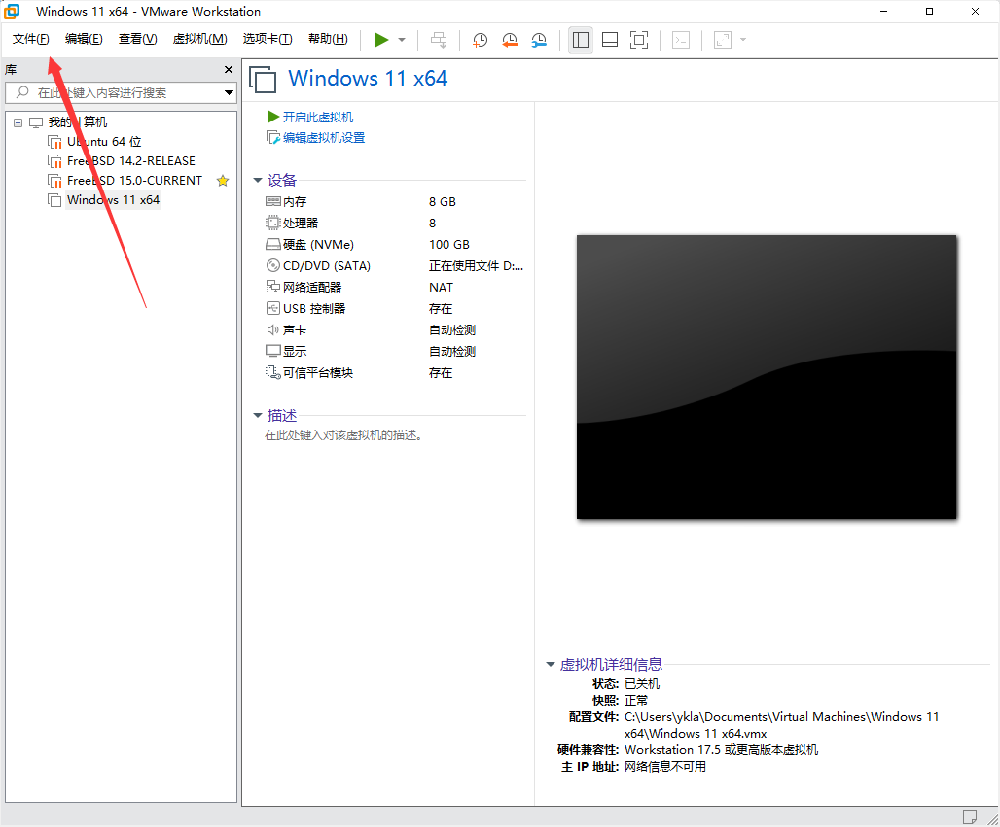
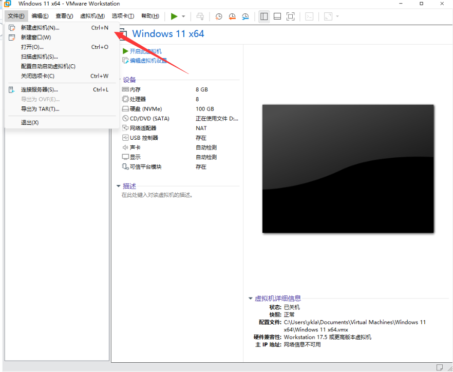
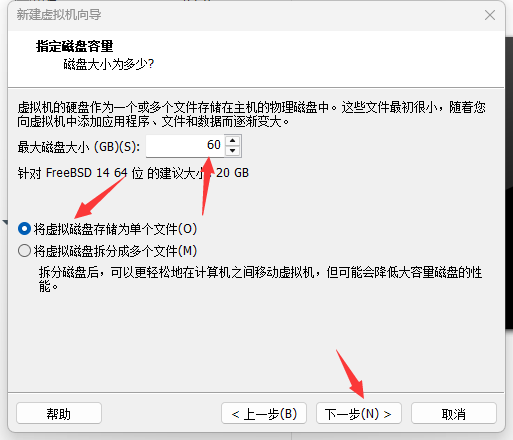
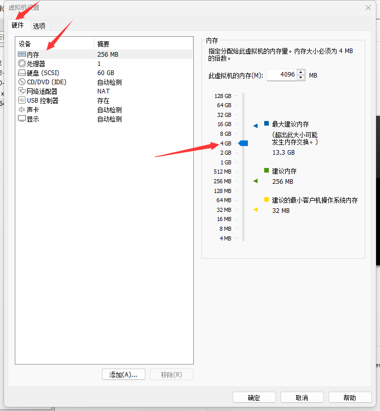
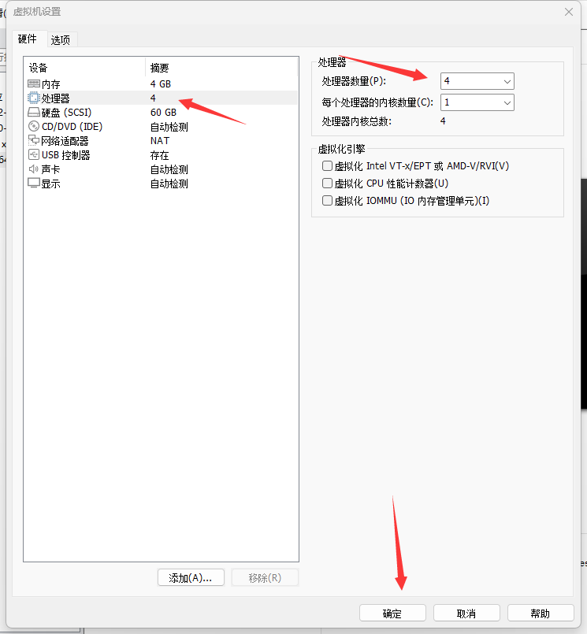
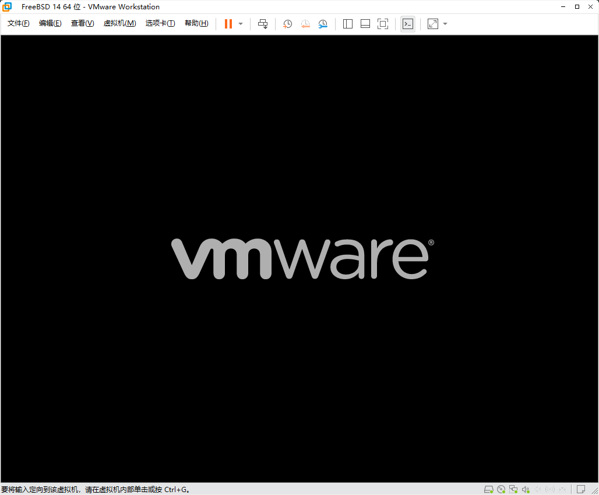
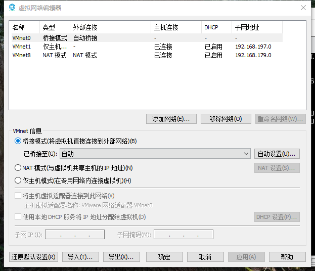
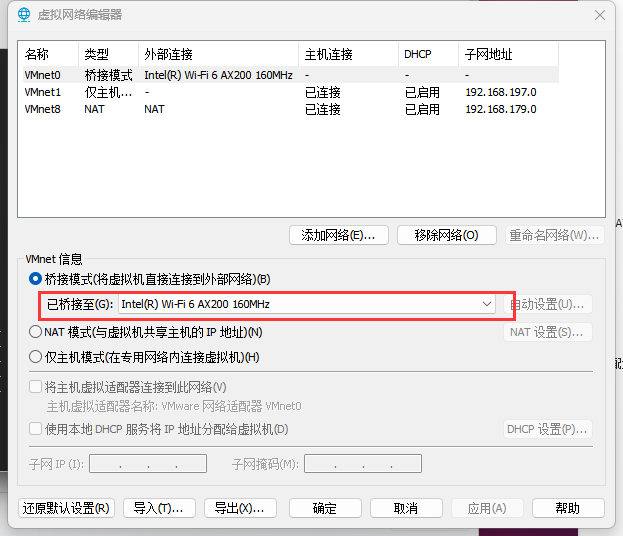
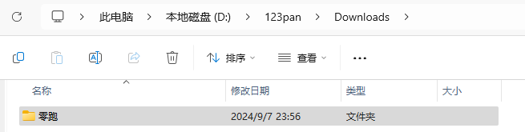
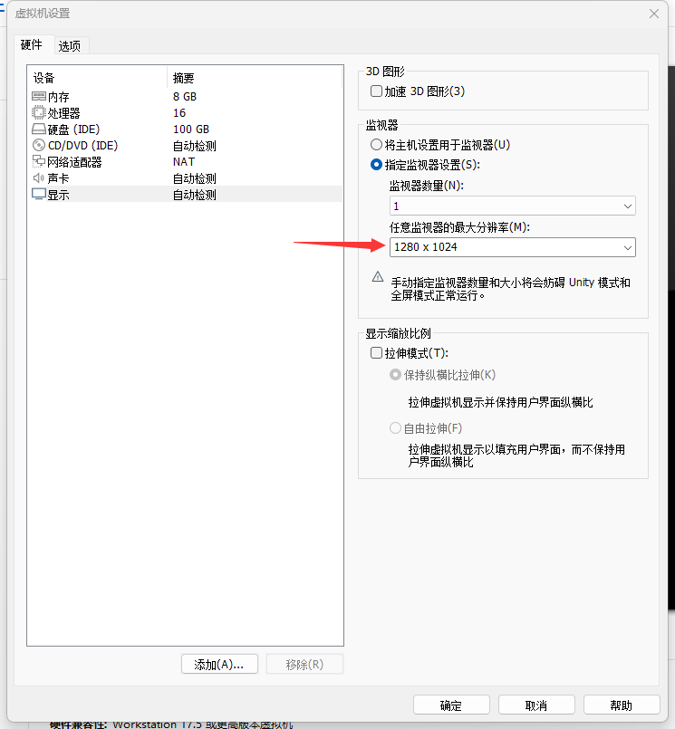

# 5.1 Installing FreeBSD with VMware Workstation Pro

VMware Workstation Pro is a Type-2 hypervisor that runs on top of the host operating system, utilizing binary translation and hardware-assisted virtualization (based on Intel VT-x or AMD-V technology) to virtualize the x86 instruction set.

> **Tip**
>
> Starting November 11, 2024, Broadcom announced that VMware Workstation Pro is free for all users (personal, educational, and commercial use), with no license key required. Select the free version at the license key screen during installation. The free policy applies to Workstation Pro 17.5.2 and later versions.

## Video Tutorial

The following video tutorial demonstrates the process of installing VMware Workstation Pro 17 on Windows 11:

FreeBSD Chinese Community. 001-Windows 11 Installing VMware 17[EB/OL]. [2026-04-04]. <https://www.bilibili.com/video/BV1Qji2YLEgS>.

## Image Download

Before starting the installation, you need to download the FreeBSD installation media image first.

> **Tip**
>
> Virtual machines can also use the [virtual machine images](https://download.freebsd.org/releases/VM-IMAGES/15.0-RELEASE/amd64/Latest/) officially built by FreeBSD. These images are pre-configured and require manual disk expansion when used. The file system can be either UFS or ZFS.
>
> Virtual machines typically use ISO disc images with filenames and extensions like `FreeBSD-15.0-RELEASE-amd64-disc1.iso`, but `FreeBSD-15.0-RELEASE-amd64-memstick.img` is not limited to USB flash drive flashing; virtual machines can also use it. For specific usage methods, refer to other sections.

## Configuring the Virtual Machine

After downloading the image, create a new virtual machine in VMware Workstation Pro.






Be sure to select "I will install the operating system later", otherwise it may cause boot issues.


Select "Other", then select FreeBSD.

> **Tip**
>
> In test environments, selecting other operating system types can also boot normally, but to maintain configuration consistency and avoid potential compatibility issues, it is recommended to select FreeBSD. For older versions of FreeBSD, legacy VMware Tools (the closed-source version) may have compatibility issues.


Virtual machines typically occupy a large amount of disk space. If you do not want the system drive (such as the C drive) to run out of space, adjust the virtual machine's storage location yourself.



Adjust the maximum size of the virtual disk according to your actual needs. The default value may be too small. If you plan to install a graphical desktop environment, it is recommended to allocate at least 20 GB of disk space.




The default 256 MB of memory is sufficient to boot the system, but is not suitable for daily use. The minimum recommended configuration is 512 MB.



The default 1 CPU core can boot, but for better performance, it is recommended to adjust based on the host machine's resources.


At "Use ISO image file", click "Browse", locate and select the downloaded `FreeBSD-15.0-RELEASE-amd64-disc1.iso` file.


> **Tip**
>
> Testing has confirmed that FreeBSD also supports VMware graphics drivers in UEFI environments.

> **Warning**
>
> FreeBSD Bug 250580 – VMware UEFI guests crash in virtual hardware after r366691[EB/OL]. (2020-10-24)[2026-04-04]. <https://bugs.freebsd.org/bugzilla/show_bug.cgi?id=250580>. FreeBSD 11-RELEASE/12-RELEASE may fail to boot in VMware's UEFI environment. Testing has confirmed that FreeBSD 13.0-RELEASE boots normally.





## Network Settings

Use NAT mode (the default setting). If the virtual machine cannot communicate with the host machine (physical machine), open VMware's "Edit" menu, select "Virtual Network Editor", and click "Restore Defaults" until the configuration returns to normal.

> **Note**
>
> Testing has shown that file transfer speeds between the virtual machine and the host machine are low in bridged mode.

> **Tip**
>
> If "Restore Defaults" does not work and the network adapter list is abnormal (for example, always showing only a single mode), try manually configuring the network as shown in the figure below.

> **Warning**
>
> The "Name" of NAT mode is bound to `VMware Network Adapter VMnet8` in the host's `Control Panel\Network and Internet\Network Connections`, with the default binding being `8`. In other words, the "Name" of NAT mode must be set to `VMnet8` as shown in the figure below, otherwise the virtual machine will not be able to access the network.
>
> 



Manual configuration is usually unnecessary. If the network interface inside the virtual machine keeps showing `no link`, try restarting the host machine, then open VMware's Virtual Network Editor and perform "Restore Defaults" again (manual configuration is not recommended as it may be ineffective).

If you cannot connect to the network, try setting the DNS server to **223.5.5.5** inside the virtual machine. For other network configuration methods, refer to other sections in this chapter.

If you still cannot obtain an IP address via DHCP after configuring bridged mode, try changing the network adapter's "Bridged to" option from "Automatic" to the physical network card currently in use on the host machine.



## Virtual Machine Enhancement Tools and Graphics Driver

The open-source implementation of VMware's paravirtualized drivers, open-vm-tools, provides shared folders, clipboard sharing, time synchronization, and other features through proprietary protocols such as HGFS (Host-Guest File System), improving the virtual machine's I/O performance and user experience.

To achieve good integration between the virtual machine and the host, install xf86-video-vmware (VMware graphics driver) and xf86-input-vmmouse (VMware virtual mouse driver). The pkg command is as follows:

```sh
# pkg install xf86-video-vmware open-vm-tools xf86-input-vmmouse
```

Alternatively, compile and install using the Ports system:

```sh
# cd /usr/ports/x11-drivers/xf86-video-vmware/ && make install clean
# cd /usr/ports/emulators/open-vm-tools/ && make install clean
# cd /usr/ports/x11-drivers/xf86-input-vmmouse/ && make install clean
```

> **Note**
>
> If graphical interface support is not needed, you can install the version without X11 dependencies (still the Port `emulators/open-vm-tools`):
>
> ```sh
> # pkg install open-vm-tools-nox11
> ```

After installation, the virtual machine screen auto-resize feature typically works without additional configuration.

> **Note**
>
> This driver must be installed even in Wayland environments.

> **Tip**
>
> If the screen display is abnormal (too large), try the following: Edit virtual machine settings → Hardware → Display → Monitor → Specify monitor settings → Maximum resolution of any monitor, set it to the host's resolution or slightly lower than the host's resolution. For specific steps, refer to the troubleshooting section.

### Mouse Integration: Free Mouse Switching Between Host and Virtual Machine

Please install the graphics driver and virtual machine enhancement tools first.

```sh
# service moused enable        # Enable moused service and write to system configuration
# Xorg -configure             # Generate default Xorg configuration file
# mv /root/xorg.conf.new /usr/local/etc/X11/xorg.conf.d/xorg.conf  # Install Xorg configuration file
```

Related file structure:

```sh
/
├── root/
│   └── xorg.conf.new # Generated default Xorg configuration file
└── usr/
    └── local/
        └── etc/
            └── X11/
                └── xorg.conf.d/
                    └── xorg.conf # Final installed Xorg configuration file
```

Edit the **/usr/local/etc/X11/xorg.conf.d/xorg.conf** file and modify the following sections (keep other parts unchanged):

```ini
Section "ServerLayout"
        Identifier     "X.org Configured"
        Screen          0  "Screen0" 0 0
        InputDevice    "Mouse0" "CorePointer"
        InputDevice    "Keyboard0" "CoreKeyboard"
        Option          "AutoAddDevices" "Off"  # Prevent Xorg from automatically adding input devices
EndSection

…………Some parts omitted here…………

Section "InputDevice"
      Identifier  "Mouse0"
      Driver      "vmmouse"  # Use VMware virtual mouse driver
      Option      "Protocol" "auto"
      Option      "Device" "/dev/sysmouse"
      Option      "ZAxisMapping" "4 5 6 7"
EndSection

…………Some parts omitted here…………
```

## Shared Folders

Please install the virtual machine enhancement tools (Open VM Tools) first.

### Setting Up Shared Folders on the Physical Machine


> **Note**
>
> In this example, the virtual machine name is shown as "Windows 11" because the virtual machine is configured as a dual-boot system with Windows 11 and FreeBSD, which is normal.

List currently available VMware shared folders:

```sh
# vmware-hgfsclient
123pan
```

### Loading the fuse Module

Add the following content to the **/boot/loader.conf** file:

```sh
fusefs_load="YES"
```

This loads the fusefs kernel module at system startup.

Related file structure:

```sh
/
├── boot/
│   └── loader.conf    # System boot loader configuration file
├── etc/
│   └── fstab          # File system mount configuration
└── mnt/
    └── hgfs/          # VMware shared folder mount point
```

### Mounting

#### Manual Mounting

> **Note**
>
> Replace `123pan` in the following command with the shared folder name configured in VMware.

Mount the VMware shared directory `123pan` to **/mnt/hgfs**:

```sh
# vmhgfs-fuse .host:/123pan /mnt/hgfs
```

#### Automatic Mounting

Edit the **/etc/fstab** file. Add the following mount entry (replace `123pan` with the actual shared folder name):

```sh
.host:/123pan      /mnt/hgfs    fusefs  rw,mountprog=/usr/local/bin/vmhgfs-fuse,allow_other,failok 0 0
```

The system will automatically mount the VMware shared directory.

Mount all unmounted file systems in fstab and check for errors (no error output means normal). Incorrect configuration may prevent the system from booting properly:

```sh
# mount -al
```

### Viewing Shared Folders

List the contents of the mounted VMware shared folders:

```sh
# ls /mnt/hgfs/
Downloads
# ls /mnt/hgfs/Downloads/
leapmotor
```



The file contents are consistent.

### References

- MaRcOGO. Resolving Ubuntu shared folders on VMware[EB/OL]. (2022-07)[2026-03-26]. <https://www.cnblogs.com/MaRcOGO/p/16463460.html>. Introduces VMware shared folder configuration methods.
- FreeBSD Forums. fuse: failed to open fuse device[EB/OL]. [2026-03-26]. <https://forums.freebsd.org/threads/fuse-failed-to-open-fuse-device.44544/>. Resolved the issue of fuse device failing to open (e.g., `fuse: failed to open fuse device: No such file or directory`), providing a key reference for shared folder configuration.
- FreeBSD Forums. VMware shared folders[EB/OL]. [2026-03-26]. <https://forums.freebsd.org/threads/vmware-shared-folders.10318/>. Detailed introduction to mounting VMware shared folders on FreeBSD.

## Troubleshooting and Outstanding Issues

You may encounter the following issues when installing and running FreeBSD with VMware.

> **Note**
>
> When remotely connecting to another Windows desktop via Windows Remote Desktop or other XRDP tools, and then operating FreeBSD through a VMware virtual machine running on that desktop, the mouse may behave abnormally. This is a known phenomenon.

- Every time you enter the graphical interface, the window becomes abnormally enlarged.

Adjusting the virtual machine's maximum resolution can resolve this issue.



Hardware → Display → Monitor → Specify monitor settings → Maximum resolution of any monitor (M), change from the default maximum `2560 x 1600` (2.5K / WQXGA) to a smaller value, or customize the value.

- No sound

Since the default volume is low, if there is still no sound after loading the sound card, turn the volume to the maximum and test again.
