# 5.2 Installing FreeBSD with VirtualBox

Oracle VirtualBox is a Type-2 hypervisor that provides computing, storage, and network resources to virtual machines through device emulation and paravirtualization technologies. VirtualBox supports multiple virtual disk image formats, defaulting to VDI (Virtual Disk Image), while also being compatible with VMDK (VMware), VHD (Microsoft), and other formats. This virtualization software runs on mainstream operating systems including Windows, macOS, Linux, and Oracle Solaris. FreeBSD can install VirtualBox OSE via Ports to serve as a host machine.

FreeBSD runs stably as a virtual machine in VirtualBox. The demonstration environment in this section uses VirtualBox 7.2.8 and Windows 11 25H2.

> **Note**
>
> VirtualBox currently maintains two parallel branches: 7.1.x and 7.2.x. The 7.2 series was first released in August 2025, adding Windows/Arm platform support, and is the current mainline version; the 7.1.x series continues to receive maintenance updates. In FreeBSD Ports, `emulators/virtualbox-ose` (6.1.x) has been marked as DEPRECATED with an expiration date of 2026-12-31. It is recommended to use `emulators/virtualbox-ose-72`.

## Downloading VirtualBox

Visit the official website [https://www.virtualbox.org](https://www.virtualbox.org), click the `Download` button on the right side of the page, and select the installer for your platform to complete the installation.

## Installation Settings

After installing VirtualBox, create and configure the virtual machine step by step.


Select "New" in the VirtualBox main interface.

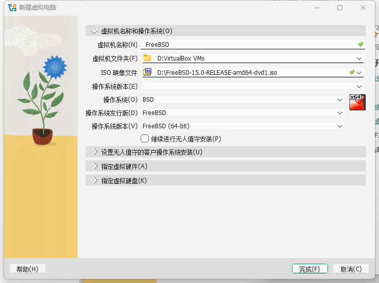

Enter "FreeBSD" in the "Name" field, and the related options below will be auto-filled.

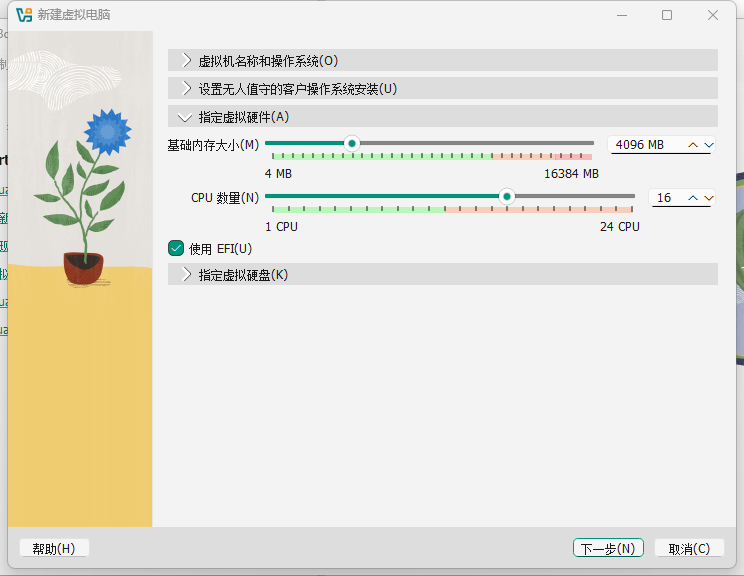

Allocate memory size and CPU count, and enable the EFI support option.

> **Tip**
>
> It is recommended to use UEFI boot mode, as Xorg can automatically detect the graphics driver without manually writing **/usr/local/etc/X11/xorg.conf**.


Adjust the virtual hard disk capacity.

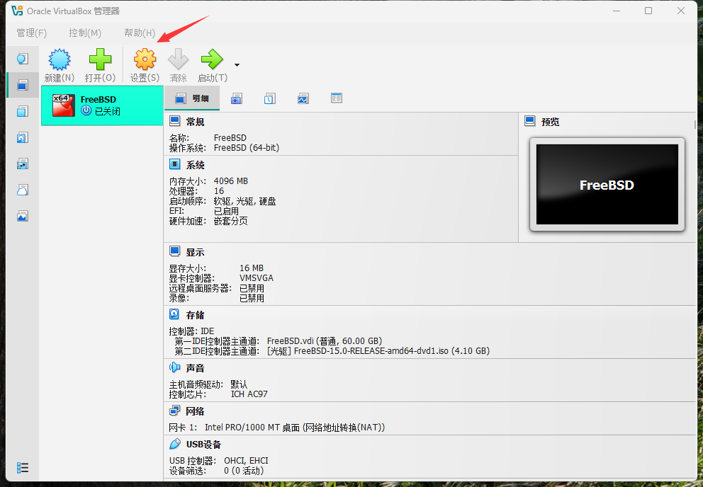

Enter the virtual machine settings.

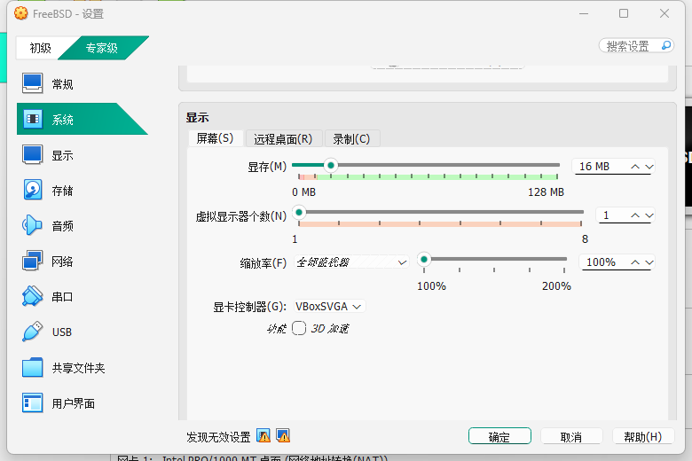

Set the graphics controller to `VBoxSVGA`.

> **Warning**
>
> Do not check "Enable 3D Acceleration". VirtualBox Guest Additions on FreeBSD do not support 3D acceleration; enabling it will cause display abnormalities.


If needed, you can switch the virtual hard disk to an NVMe controller:

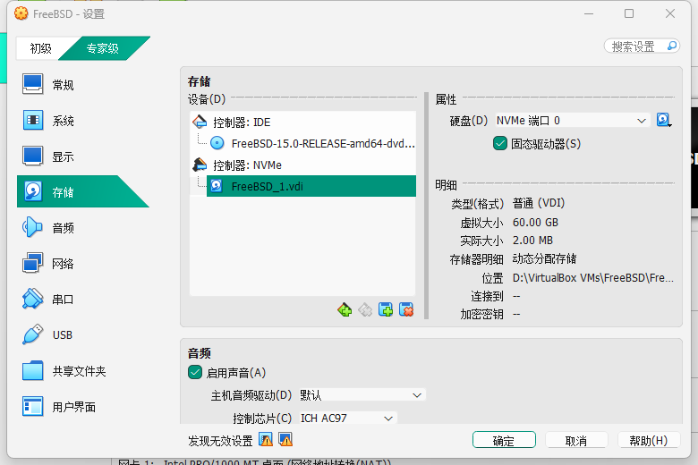

Click "Start" to begin installing FreeBSD.

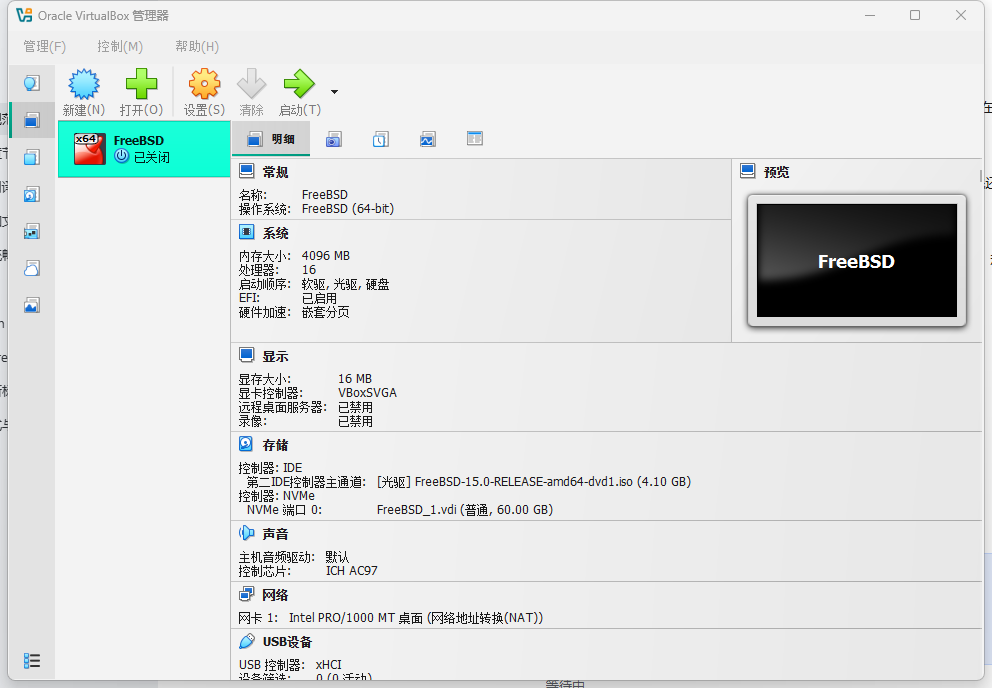

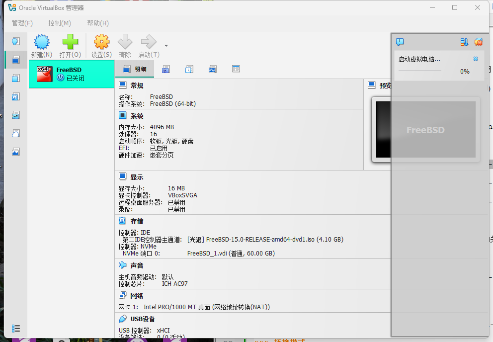

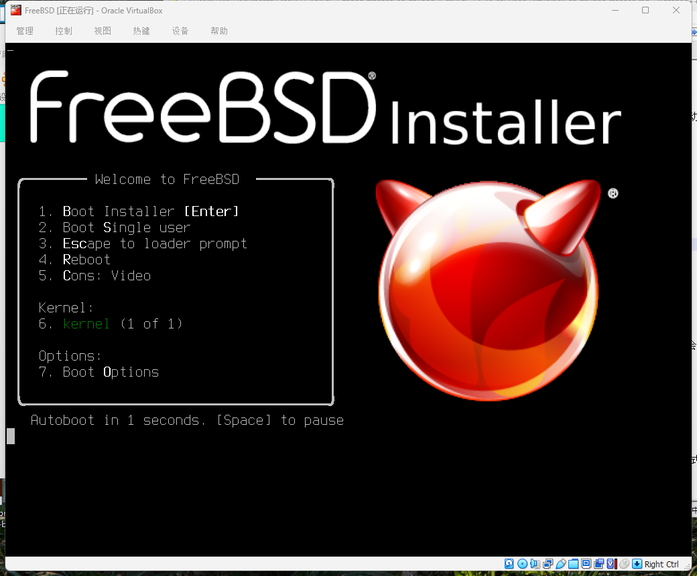

After installation is complete, you must manually shut down and remove the installation disc from the virtual machine settings (if prompted to force release, select agree), otherwise the next startup will enter the installation interface again.

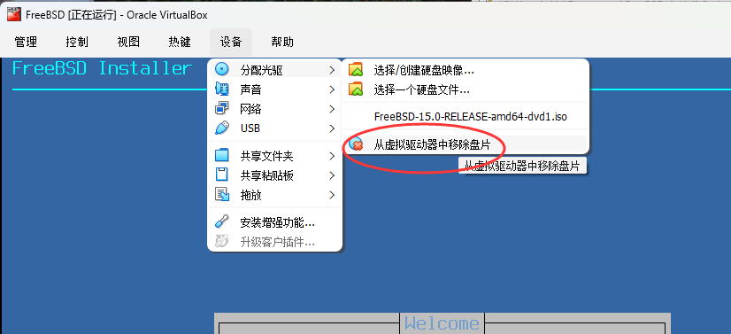

The completed FreeBSD virtual machine system:


## Resolving Inability to Shut Down Properly Under EFI

Edit the **/etc/sysctl.conf** file and add the following content:

```ini
hw.efi.poweroff=0
```

Then restart the system, and shutting down should work normally again. This setting disables the EFI power-off function, allowing the system to shut down through ACPI instead.

### References

- mib. 12.0-U8.1 -> 13.0-U2 poweroff problem & solution[EB/OL]. (2022-12-23)[2026-03-26]. <https://www.truenas.com/community/threads/12-0-u8-1-13-0-u2-poweroff-problem-solution.104813/>. Provides a solution for FreeBSD shutdown issues in EFI environments.
- FreeBSD Forums. EFI: VirtualBox computer non-stop after successful shutdown of FreeBSD[EB/OL]. (2022-04-28)[2026-03-26]. <https://forums.freebsd.org/threads/efi-virtualbox-computer-non-stop-after-successful-shutdown-of-freebsd.84856/>. Detailed analysis of the technical causes and fix methods for FreeBSD shutdown anomalies in VirtualBox.

## Network Settings

In terms of virtual networking, VirtualBox provides various network modes including NAT, Bridged, Internal, and Host-Only, each corresponding to different network topologies and connectivity.

### Bridged Mode

> **Tip**
>
> VirtualBox bridged mode enables bidirectional network connectivity.

Bridging is a convenient way for the host machine and virtual machine to communicate with each other. The virtual machine can obtain an IP address on the same subnet as the host machine. For example, if the host machine IP is **192.168.5.123**, the virtual machine IP will be **192.168.5.x**.

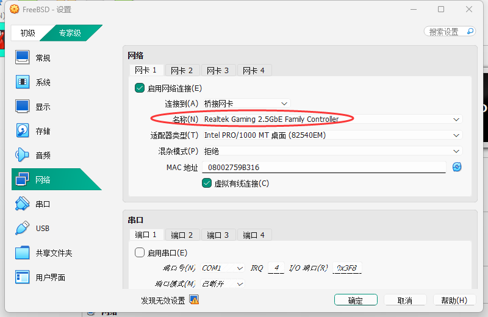

Make sure the network card selected in "Name(N)" in the figure above is the one currently in use, otherwise the virtual machine will not be able to access the network.

After configuration, run `dhclient em0` to immediately obtain an IP address. For a persistent configuration, add `ifconfig_em0="DHCP"` to **/etc/rc.conf**.

If you cannot access the Internet, set the DNS to **223.5.5.5**. For specific steps, refer to the DNS configuration section in this chapter.

### NAT and Host-Only Modes

Unlike VMware, in VirtualBox's default NAT mode, the host machine and virtual machine cannot directly communicate with each other. The virtual machine can access the host machine's special address **10.0.2.2** and the services running on it, but the host machine cannot access the virtual machine's ports, and the networks between virtual machines are also isolated from each other.

When bridged mode does not work, you can use a dual network adapter approach instead. If you want to control the FreeBSD system in the virtual machine from the host machine (such as Windows 11), you need to configure two network adapters: one in NAT mode for Internet access, and another in Host-Only mode for communication with the host machine.

First, configure the network adapter in NAT mode for Internet access:

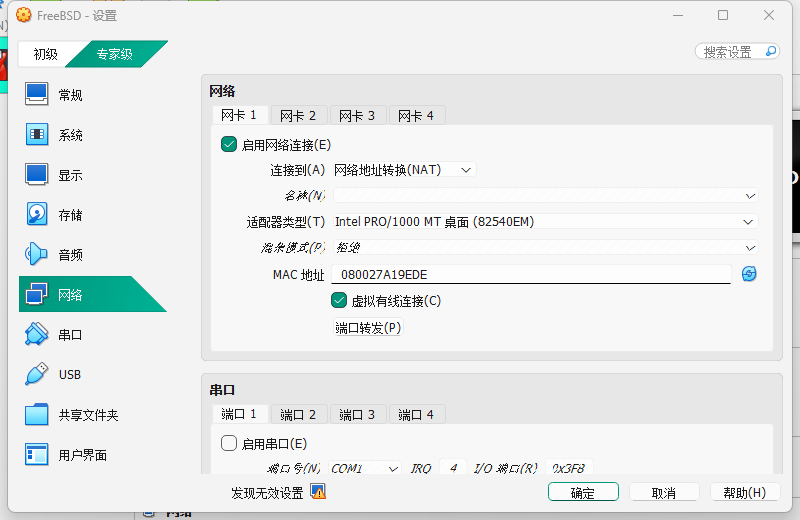

In the network adapter type dropdown, the "NAT" and "NAT Network" options have similar functionality. The main difference is that virtual machines can communicate with each other under "NAT Network" mode, while virtual machine networks are isolated from each other under "NAT" mode.

Then configure the second network adapter (Host-Only mode) for the local network:


Run `ifconfig` to check the network status. If the second network adapter `em1` has not obtained an IP address, you can temporarily obtain one via DHCP: `dhclient em1`. For a persistent configuration, add `ifconfig_em1="DHCP"` to **/etc/rc.conf**.

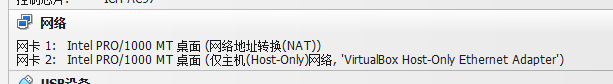

```sh
# netstat -rn -f inet | egrep 'default|10\.0\.2\.0/24|192\.168\.56\.0/24'
default            10.0.2.2           UGS             em0 # NAT network adapter, default gateway
10.0.2.0/24        link#1             U               em0
192.168.56.0/24    link#2             U               em1 # Host-Only network adapter, for communication with the host machine
```

In this configuration, the virtual machine and the host machine's local network cannot directly communicate with each other. SSH connections should be made through the `em1` IP address, typically `192.168.56.X`, rather than `10.0.2.X`.

### References

- Oracle. Network Address Translation (NAT)[EB/OL]. [2026-03-26]. <https://www.virtualbox.org/manual/topics/networkingdetails.html#network_nat>. You can also use port forwarding as described in the manual to establish network connectivity.
- Oracle Corporation. 6.3. Network Address Translation (NAT)[EB/OL]. [2026-04-04]. <https://www.virtualbox.org/manual/topics/networkingdetails.html#network_nat>. Differences between the "NAT" and "NAT Network" options.

## Virtual Machine Enhancement Tools

VirtualBox Guest Additions are a set of drivers and system services running inside the virtual machine, providing the following support:

- Shared clipboard.
- Integrated mouse pointer.
- Host time synchronization.
- Window resizing.
- Seamless mode.

> **Note**
>
> The following commands are executed inside the FreeBSD virtual machine.

### Installing Guest Additions

- Install using pkg:

```sh
# pkg install virtualbox-ose-additions-72
```

- Or install using Ports:

```sh
# cd /usr/ports/emulators/virtualbox-ose-additions-72/
# make install clean
```

- After installation, you can view the Guest Additions configuration instructions with the following command:

```sh
# pkg info -D virtualbox-ose-additions-72
```

### Service Management

After installing the Guest Additions, you need to enable the relevant services and set them to start at boot.

Enable the VirtualBox guest enhancement driver:

```sh
# service vboxguest enable
```

Enable the VirtualBox service:

```sh
# service vboxservice enable
```

Add the regular user ykla to the wheel group for administrative privileges:

```sh
# pw groupmod wheel -m ykla
```

If you are using the ntpd(8) time service, you should disable host time synchronization by adding the following to **/etc/rc.conf**:

```ini
vboxservice_flags="--disable-timesync"
```

### Desktop Preview

In Wayland environments, desktop functionality is currently unavailable due to the lack of corresponding DRM/KMS driver support. The following demonstrates installing and launching KDE under X11 in a virtual machine:

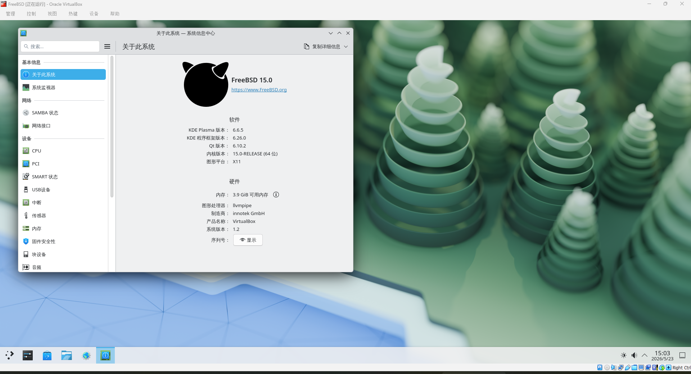

Window resizing, seamless mouse switching, and other features all work normally.

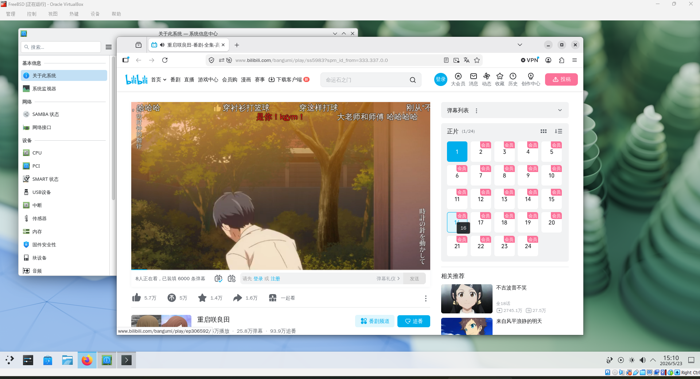

Video playback is relatively smooth, but the default volume is low; you may want to increase the system volume appropriately.

### Shared Folders

Shared folders are used to transfer files between the host machine and the virtual machine, and can be mounted and accessed via the `mount_vboxvfs` command. The following example creates a shared folder **C:\Users\ykla\\** in the VirtualBox graphical interface and mounts it to **/mnt/bsdboxshare** inside the virtual machine:


Note that the "Folder Name" is the filename that the operating system (FreeBSD virtual machine) will see, and it must not contain spaces.

View the folders to be mounted in the FreeBSD virtual machine:

```sh
$ dmesg | grep -i VBOXVFS
VBOXVFS[1]: sfprov_mount: path: [ykla]
```

The command to mount the shared folder in the FreeBSD virtual machine is as follows:

```sh
# mkdir -p /mnt/bsdboxshare # Create shared folder mount point
# mount_vboxvfs -w ykla /mnt/bsdboxshare # Mount shared folder ykla in writable mode
```

List the contents of the shared folder:

```sh
# ls /mnt/bsdboxshare/

……Other output omitted……

/mnt/bsdboxshare/SendTo/
/mnt/bsdboxshare/SiYuan/
/mnt/bsdboxshare/Templates/
```

## Troubleshooting and Outstanding Issues

### Mouse Captured in Virtual Machine Window, Unable to Move Out

Press the right `Ctrl` key to release the mouse (by default, the keyboard has left and right `Ctrl` keys). If you need to restore the screen due to auto-resizing or cannot find the menu bar, press `Home` + right `Ctrl`.

> **Tip**
>
> On a standard 108-key keyboard, the `Home` key is located below the `Scroll Lock` key.

### UEFI Firmware Settings

Press the `Esc` key repeatedly at boot to enter the VirtualBox virtual machine's UEFI firmware settings interface.
