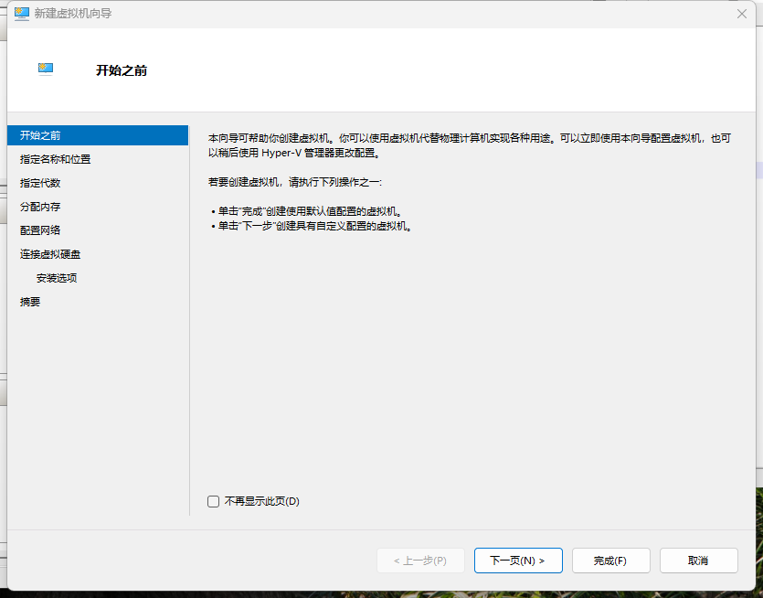
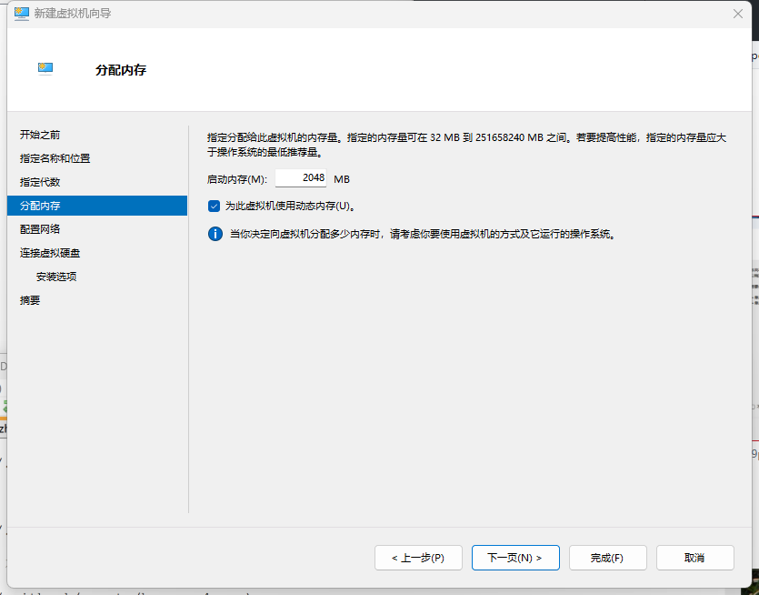
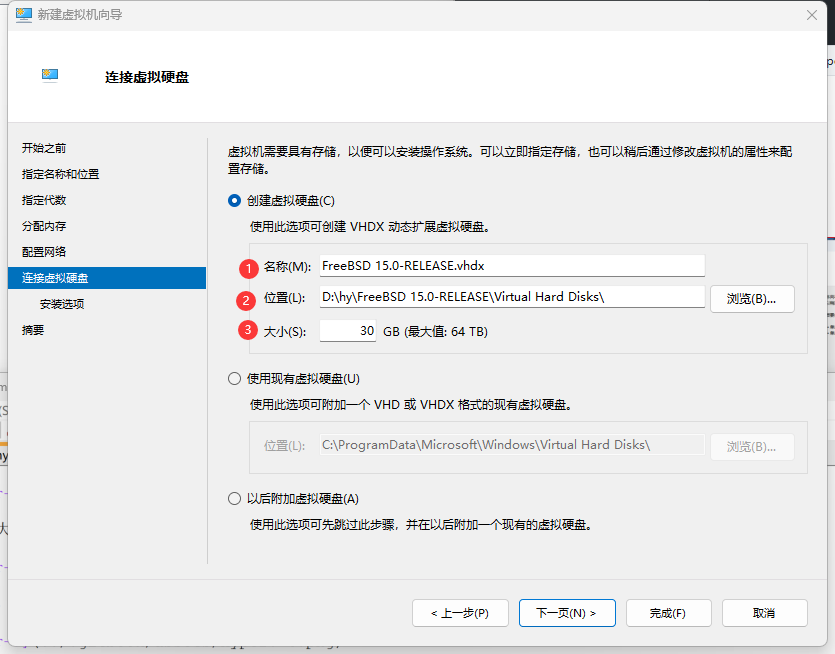
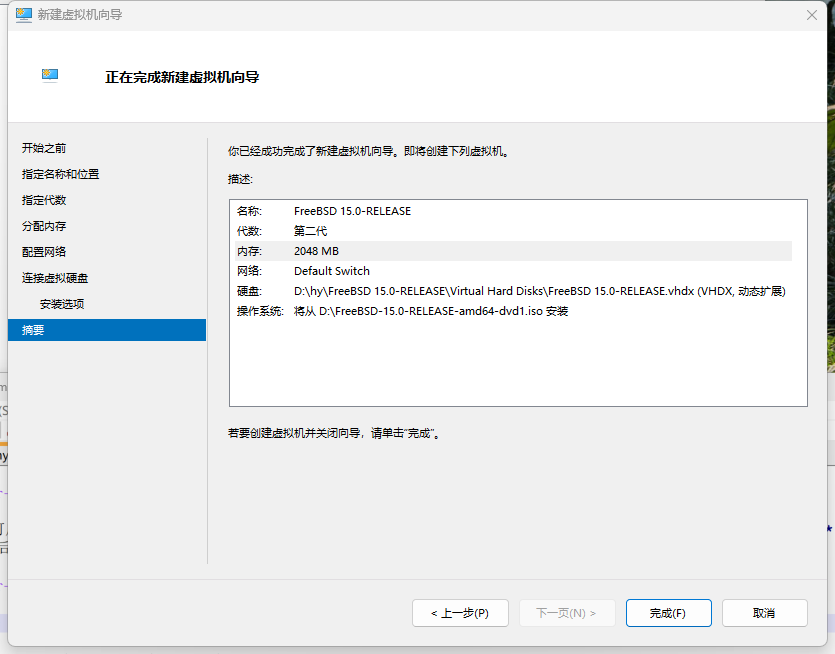
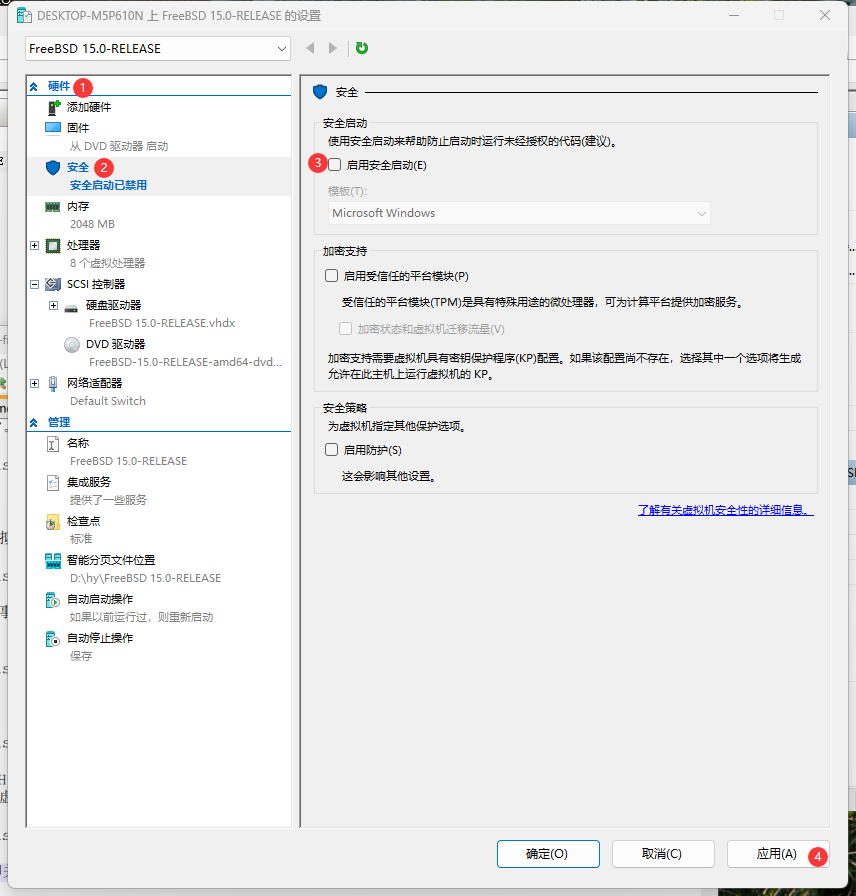
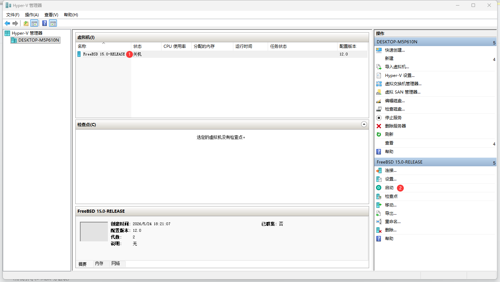
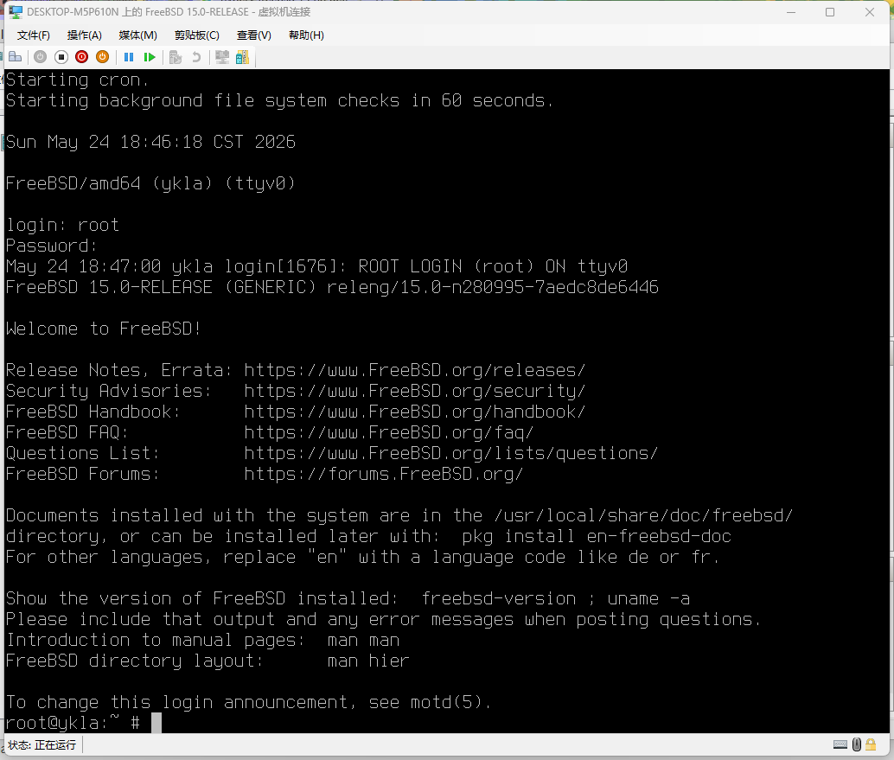
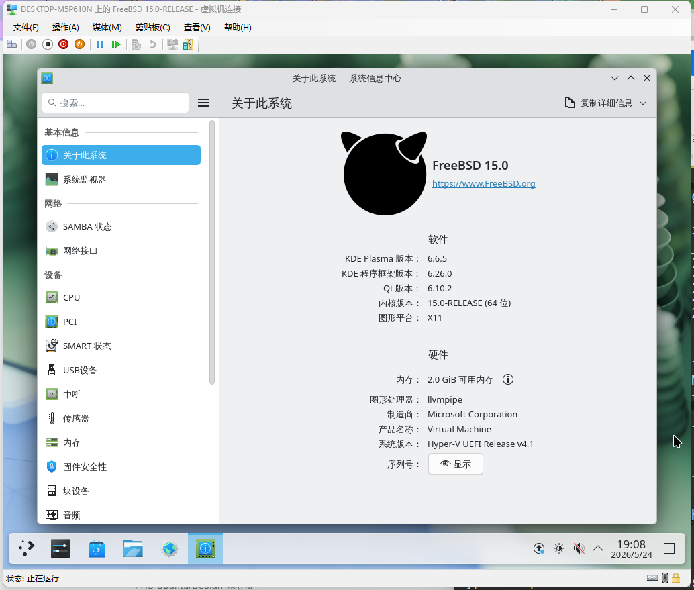

# 5.3 Installing FreeBSD with Hyper-V

Hyper-V is an enterprise-grade hypervisor developed by Microsoft for Windows and Windows Server, and is a built-in system component. This section covers the complete process of installing and configuring FreeBSD in Hyper-V.

## Introduction to Hyper-V

A hypervisor is software that creates and runs virtual machines, allowing multiple operating systems to run simultaneously on the same computer. According to the theoretical classification of virtualization technology, Hyper-V is a Type-1 architecture, where the virtualization layer directly manages hardware resources.

Hyper-V has two virtual machine architectures: Gen 1 (Generation 1) and Gen 2 (Generation 2), which differ in hardware support and boot methods. The differences between Gen 1 and Gen 2 are shown in the table below:

| Hyper-V Generation | Hard Disk | Boot Method |
| ------------------ | --------- | ----------- |
| Gen 1 | IDE + SCSI | MBR only |
| Gen 2 | SCSI only | UEFI only (including Secure Boot and PXE support) |

Virtual machines created through Quick Create default to the Gen 2 architecture.

> **Note**
>
> When using Gen 2, it is recommended to disable Secure Boot. FreeBSD's boot loader is not signed by Microsoft and cannot pass verification under Hyper-V's default Secure Boot configuration. FreeBSD provides the uefisign(8) tool for users to manually sign boot components to achieve Secure Boot, but this requires manual key configuration and is not yet ready for out-of-the-box use. If you are unfamiliar with manual signing, please disable Secure Boot before installation.

FreeBSD provides integration support for Hyper-V through the following kernel modules:

| Module | Function |
| ------ | -------- |
| `hv_utils` | Provides integration features such as time synchronization, heartbeat, and shutdown notification |
| `hv_vmbus` | Implements the Hyper-V virtual bus, serving as the foundation for other Hyper-V device drivers |
| `hv_netvsc` | Provides paravirtualized network driver (high-performance network communication) |
| `hv_storvsc` | Provides paravirtualized storage driver (virtual disk I/O support) |

## Test Environment

This section is based on the following software and hardware environment for testing and demonstration. Experimental results may vary depending on the environment.

| Item | Version/Configuration |
| ---- | --------------------- |
| Operating System | Windows 11 24H2 Professional |
| FreeBSD | 15.0-RELEASE |
| Hyper-V Version | 10.0.26100.7019 |
| VM Generation | Generation 2 |

## Installing Hyper-V

> **Note**
>
> Windows Home Edition and Home China Edition do not support Hyper-V.

Enable the Hyper-V feature component in the Windows system. Right-click the Windows logo, select "Terminal (Admin)" or "Windows PowerShell (Admin)" from the pop-up menu. Enter the following command:

```powershell
PS C:\WINDOWS\system32> DISM /Online /Enable-Feature /All /FeatureName:Microsoft-Hyper-V
```

The output is as follows:

```powershell
Deployment Image Servicing and Management tool
Version: 10.0.26100.5074

Image Version: 10.0.26200.8246

Enabling feature(s)
[==========================100.0%==========================]
The operation completed successfully.
```

The system will prompt for a restart, and Hyper-V will be installed during the restart process.


## Creating a Virtual Machine

After Hyper-V is installed, create a virtual machine. Right-click the host name in Hyper-V Manager and select "New" → "Virtual Machine".


Click "Next".



Set a name for the virtual machine. In this example, "FreeBSD 15.0-RELEASE" is used. You can also customize the virtual machine's storage path. Then click "Next".


Select "Generation 2". Then click "Next".


Allocate memory size, then click "Next".



Configure networking, select "Default Switch" from the dropdown, then click "Next".


Specify the name, size, and storage location of the virtual hard disk, then click "Next".



Click "Install an operating system from a bootable image file", click "Browse", locate and select the downloaded **FreeBSD-15.0-RELEASE-amd64-dvd1.iso** file, then click "Next".


Review the summary, confirm everything is correct, and click "Finish".



## Virtual Machine Configuration Adjustments

After the virtual machine is created, select the newly created virtual machine "FreeBSD 15.0-RELEASE" and click "Settings..." at the bottom right to adjust some settings.


Be sure to disable Secure Boot (see the note above), otherwise you will not be able to boot the installer from the installation media. Click "Hardware", select "Security", and uncheck "Enable Secure Boot" in the right pane.



Guest Service Interface is part of Hyper-V integration services, used for copying files between the host and the virtual machine. Time synchronization is handled by the independent Time Synchronization Service. See the references for details. Click "Management", then click "Integration Services", and check "Guest Service" in the right pane.


You can optionally disable "Use automatic checkpoints" (i.e., disable the automatic snapshot feature) to save space and time. See the references for details. Click "Management", then click "Checkpoints", and uncheck "Enable checkpoints" in the right pane.


## Installing FreeBSD in Hyper-V

After adjusting the virtual machine settings, prepare to install the FreeBSD system. Start the virtual machine "FreeBSD 15.0-RELEASE":



Install FreeBSD according to the prompts.


After installation is complete, you must manually eject the DVD. Click "Media", then click "DVD Drive", and select "Eject FreeBSD-15.0-RELEASE-amd64-dvd1.iso". Otherwise, the system will return to the installation interface.

Start the new system:



If the system cannot boot due to boot order issues (you need to wait for a while at the IPv4 interface), try adjusting the settings: click "Hardware", select "Firmware", select "Hard Drive" in the right pane, and select "Move Up" to place it at the top. This way, the FreeBSD virtual machine can boot directly.


## Desktop Environment

After installation, test the basic functionality of the virtual machine.

Both mouse and keyboard work properly, allowing seamless switching between the host and the virtual machine, but the virtual machine desktop resolution cannot adapt automatically.

You can connect via SSH to the IP address assigned to the default network interface "hn0".



Since Hyper-V's "Enhanced Session Mode" does not yet support FreeBSD, audio redirection is unavailable.

Before deleting a virtual machine, you must shut it down first.

## References

- Microsoft. Install Hyper-V[EB/OL]. (2025-05-23)[2026-04-04]. <https://learn.microsoft.com/en-us/windows-server/virtualization/hyper-v/get-started/install-hyper-v?tabs=powershell&pivots=windows>. Notes that Home editions do not support Hyper-V virtualization technology.
- Microsoft. Hyper-V virtualization on Windows Server and Windows[EB/OL]. [2026-03-26]. <https://learn.microsoft.com/en-us/windows-server/virtualization/hyper-v/overview>. Microsoft's official description of Hyper-V, detailing the Hyper-V virtualization architecture and feature characteristics.
- Microsoft. Install Hyper-V on Windows[EB/OL]. [2026-03-26]. <https://learn.microsoft.com/en-us/virtualization/hyper-v-on-windows/quick-start/enable-hyper-v>. Microsoft's official tutorial, providing multiple methods to enable Hyper-V.
- Microsoft. Hyper-V Integration Services[EB/OL]. [2026-03-26]. <https://learn.microsoft.com/en-us/virtualization/hyper-v-on-windows/reference/integration-services>. Detailed description of Hyper-V Integration Services features and configuration methods.
- Microsoft. Use checkpoints to revert virtual machines to a previous state[EB/OL]. [2026-03-26]. <https://learn.microsoft.com/en-us/virtualization/hyper-v-on-windows/user-guide/checkpoints?source=recommendations&tabs=hyper-v-manager%2Cpowershell>. Introduces how to create and use Hyper-V checkpoints.
- Microsoft. Choose between standard or production checkpoints in Hyper-V[EB/OL]. [2026-03-26]. <https://learn.microsoft.com/en-us/windows-server/virtualization/hyper-v/manage/choose-between-standard-or-production-checkpoints-in-hyper-v>. Compares the differences and applicable scenarios between standard and production checkpoints.
- nanorkyo. Impressions of installing FreeBSD13 in a Hyper-V environment[EB/OL]. [2026-03-26]. <https://qiita.com/nanorkyo/items/d33e1befd4eb9c004fcd>. Provides installation experience and tips for FreeBSD on Hyper-V.
- FreeBSD Foundation. FreeBSD UEFI Secure Boot[EB/OL]. [2026-04-17]. <https://freebsdfoundation.org/freebsd-uefi-secure-boot/>. Technical description of FreeBSD secure boot, explaining the relationship between bootloader signatures and UEFI firmware verification.
