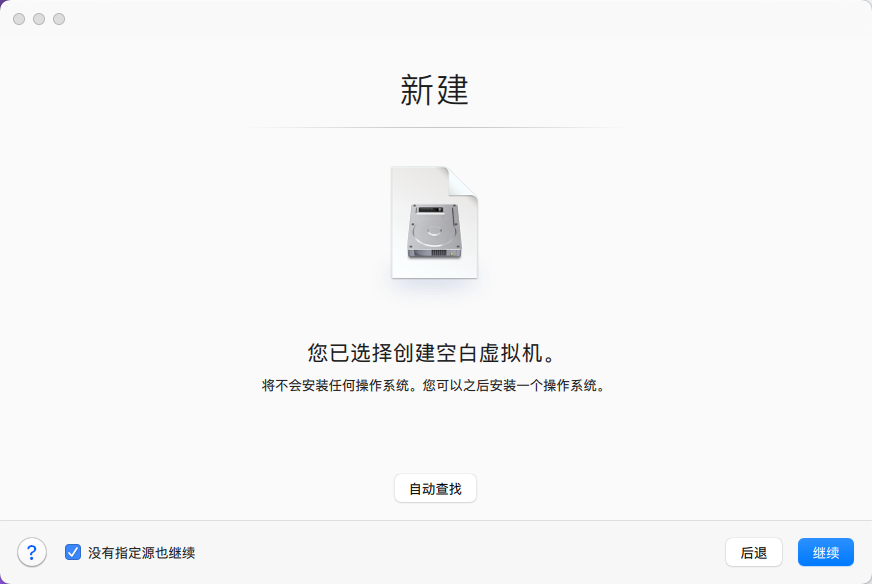
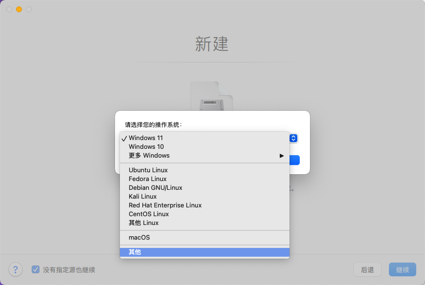
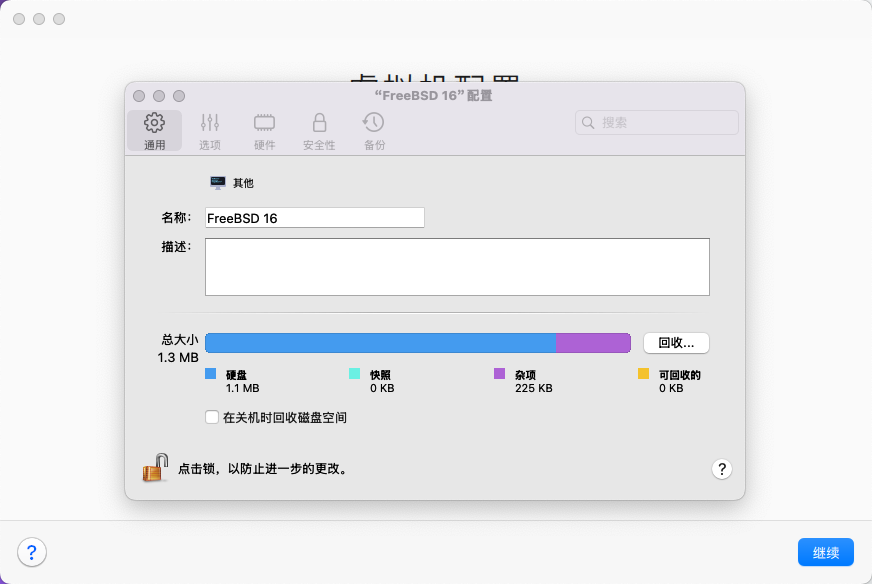
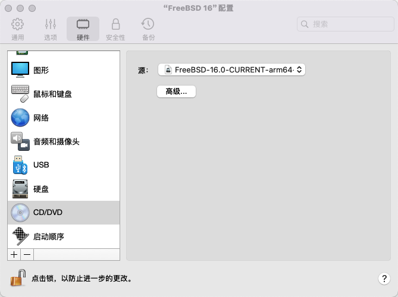
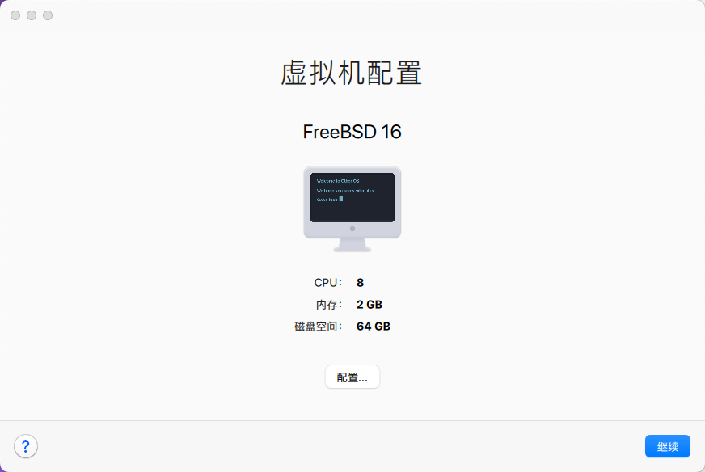
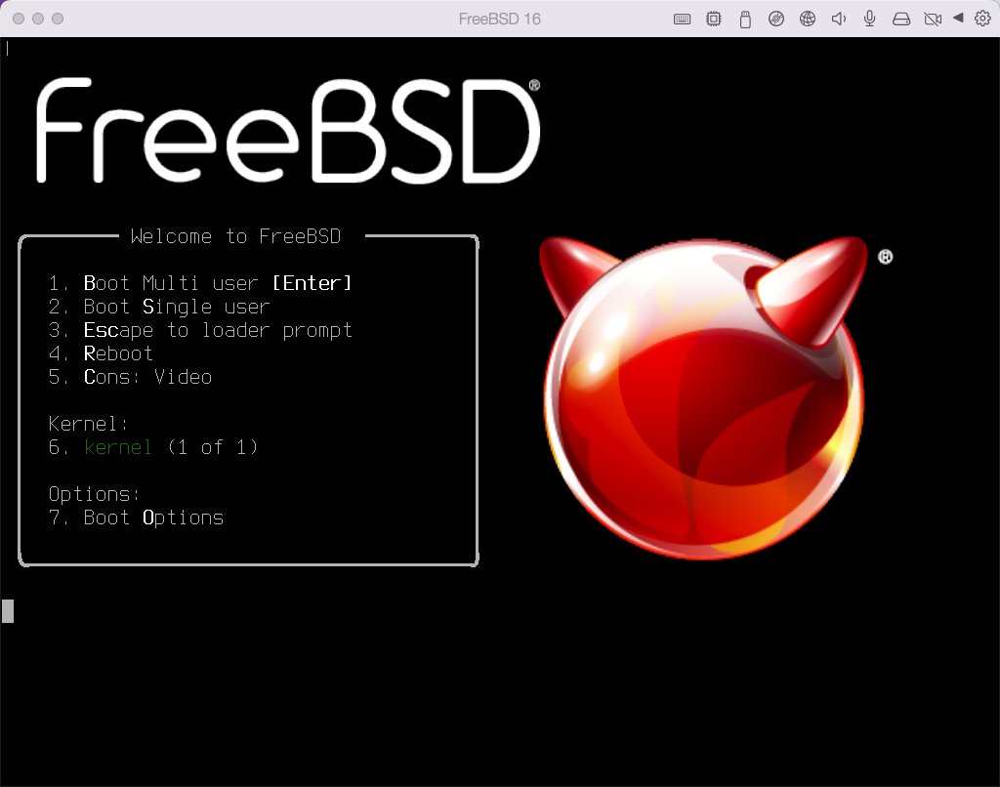

# 5.4 Installing FreeBSD on Apple M1 with Parallels Desktop

Under macOS 15.7.3 and Parallels Desktop 26.3.3 (57507), the graphical interface, keyboard, and mouse of FreeBSD 16.0 all work properly.

> **Warning**
>
> This section is based on Apple M1, so you should select the aarch64 architecture version of FreeBSD.

## Configuring the Virtual Machine

After the environment is ready, install FreeBSD. The figure below shows the new virtual machine page. Select "Install Windows, Linux, or macOS from an image file", confirm and continue.

Click "Continue without source" at the bottom left, confirm and continue.

In the "Select your operating system" interface, select "Other".

Preview the operating system type, confirm and continue.

On the "Name and Location" page, you can adjust various settings. Check "Customize settings before installation", confirm and continue.

After entering the configuration page, you can adjust various settings.

Select the "Hardware" tab at the top, select "CD/DVD" in the left sidebar, and choose the downloaded FreeBSD image in the "Source" on the right.

Preview the virtual machine configuration and click Continue.

> **Tip**
>
> Parallels Desktop's default settings are usually sufficient. It uses UEFI boot by default, so no hardware configuration adjustments are needed.

## Installing FreeBSD

Begin installing the FreeBSD system.

Preview after installing the desktop environment:

After installing the desktop environment, the system runs normally, but the resolution cannot be adjusted.

## CPU Usage Verification

After manually installing Port **sysutils/htop**, observation shows that CPU usage is normal and no additional adjustments are needed.

