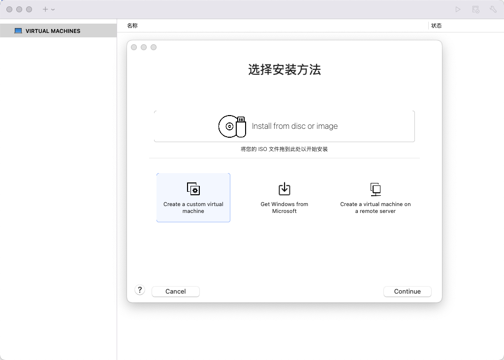
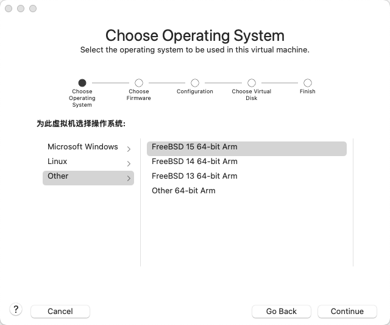
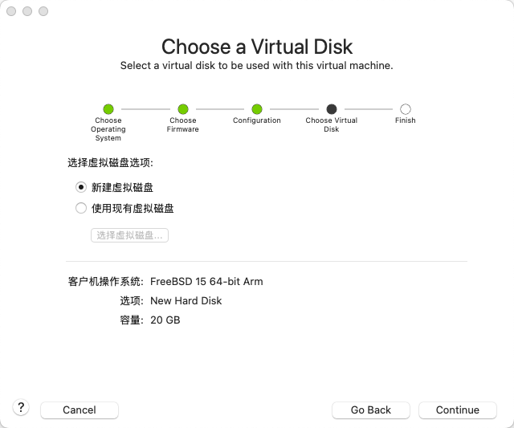
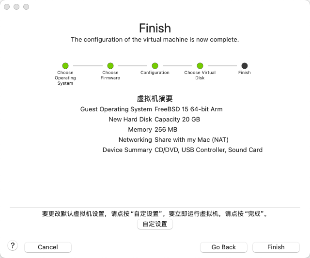
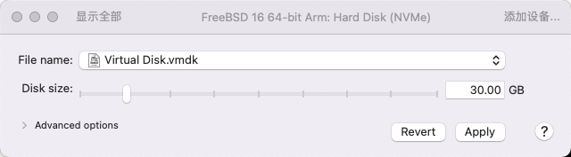

# 5.5 Installing FreeBSD on Apple M1 with VMware Fusion Pro

Under macOS 15.7.3 and VMware Fusion Professional 26H1 (25388279), FreeBSD 16.0 can be installed and run normally.

> **Note**
>
> Using macOS 14 is not recommended, as compatibility issues may prevent keyboard input. Please pay special attention to this.

## Downloading FreeBSD

First, you need to download the FreeBSD image for the Apple M1 architecture. The Apple M1 uses the ARM architecture, so please download the image with `aarch64` in its name. **Do not** download the `amd64` architecture image, otherwise the virtual machine will not run properly.

## Configuring the Virtual Machine

After downloading the image, begin configuring the virtual machine. Click "Create a custom virtual machine", then click "Continue":



On the operating system selection screen, click "Other", then select "FreeBSD 15 64-bit Arm" on the right (Fusion currently only has a template for version 15, but it also works for version 16), then click "Continue":



Select the virtual disk: choose "Create a new virtual disk". The capacity can be adjusted later. Then click "Continue":



On the "Finish" page, preview the configuration and click "Continue":



On the "Name your virtual machine" page, you can set the virtual machine name under "Save As". Here it is set to "FreeBSD 16 64-bit Arm". Tags and location can be customized. Then click Save.


After creation is complete, open the virtual machine settings.

Adjust the number of processors and memory capacity. The default memory configuration may be insufficient (`4096 MB` i.e. 4 GB), so it is recommended to increase it appropriately.


Adjust the virtual disk capacity, then click "Apply".



Connect the CD/DVD device by checking "Connect CD/DVD Drive".


Click "Choose a disc or disc image" and select the downloaded FreeBSD image.


## Installing the FreeBSD Virtual Machine


## Virtual Machine Enhancement Tools

- Install using pkg:

```sh
# pkg ins open-vm-tools
```

- Install using Ports:

```sh
# cd /usr/ports/emulators/open-vm-tools/
# make install clean
```

No additional configuration is required.

## Adjusting Resolution

Write `efi_max_resolution="1080p"` into the **/boot/loader.conf** file to set the virtual machine resolution to 1920x1080. See the virtual console and terminal section for details.

## Configuring the Desktop


