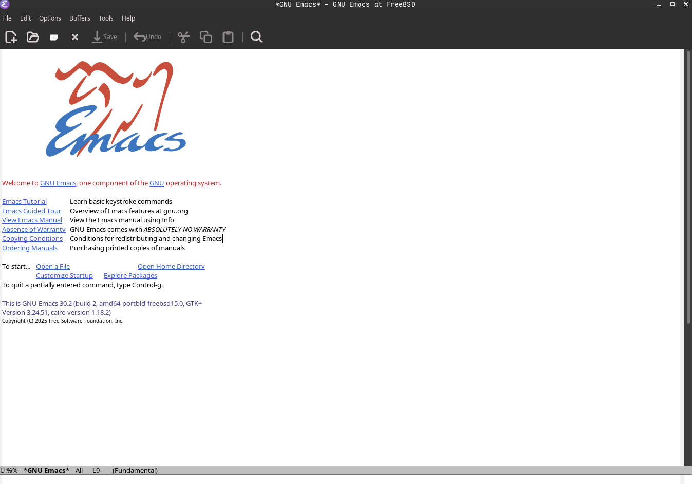
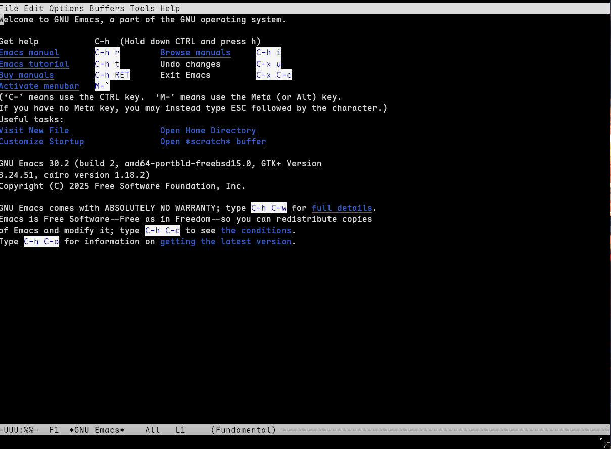
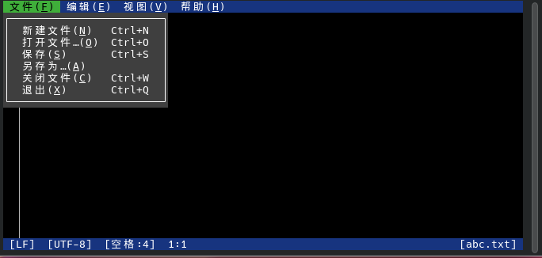

# 6.5 Text Editors

Text editors are tools used in UNIX-like systems to create, view, and modify plain text files. Whether editing the **/etc/rc.conf** file, writing scripts, or viewing logs, a text editor is required.

By editing paradigm, text editors can be divided into two major categories: **modal editors** and **modeless editors**.

The typical representative of modal editors is vi/Vim, whose core characteristic is dividing editing operations into multiple modes (such as normal mode, insert mode, command mode, etc.), where the meaning of keypresses differs across modes. For example, pressing `i` in normal mode enters insert mode, while pressing `i` in insert mode inputs the character `i`.

The typical representative of modeless editors is ee and Emacs, where keypress operations have consistent meanings across all states, and characters are typically inserted directly as text. The design of modal editing originated from the visual mode (1977—1978, gradually added) of the ex editor that Bill Joy began developing in 1976, which became the independent vi command in the ex 2.0 release in 1979. Its design motivation was to enable efficient editing on the limited keyboard of the ADM-3A terminal through mode switching, allowing editing commands to be executed without simultaneously pressing control keys.

This section introduces several common text editors in FreeBSD in sequence, covering built-in basic tools, classic editors, modern enhanced versions, and graphical options:

| Editor | Source | Brief Description |
| ------ | ------ | ----------------- |
| ee | Base system | Extremely simple, operates like Notepad, press ESC to enter menu operations |
| vi | Base system | Classic modal editor, BSD-native Nvi, lightweight but with many commands |
| Vim | Ports | Enhanced version of vi, with syntax highlighting, plugins, macros, and other modern features |
| NeoVim | Ports | Modern refactored version of Vim, Lua configuration, async plugins, LazyVim distribution |
| Emacs | Ports | Highly extensible, almost an "operating system," Lisp configuration |
| microsoft-edit | Ports | Microsoft open source, supports Chinese, mouse operation, user-friendly interface |

CLI editors do not require a graphical interface and can be used in SSH remote connections and pure text consoles, with low resource usage, suitable for server environments and remote management scenarios. GUI editors provide visual interfaces and mouse support, making them more suitable for daily development and document editing in desktop environments.

> **Note**
>
> This section only covers the basic usage of common text editors on FreeBSD and does not go into advanced configuration. Readers who need more information should consult relevant resources on their own.

## The ee Editor

`ee` is an editor included in the FreeBSD base system that supports Chinese text editing.

`ee` is more straightforward to use than [nano](https://www.redhat.com/zh/blog/getting-started-nano) (a GNU editor), as can be seen from its name "easy editor." `ee` is always in text insert mode unless a prompt or menu appears at the bottom.

Open the `a.txt` file using the ee editor:

```sh
# ee a.txt
```

You can edit directly; the usage is similar to `nano` or Windows Notepad.

Press **ESC** to bring up the menu, where you can perform operations such as saving and exiting. Press **Enter** twice to save.

## The vi Editor

FreeBSD also includes the `vi` editor. FreeBSD's `vi` is actually nex/nvi, a reimplementation of 4BSD ex/vi, designed to maintain strict compatibility with the original 4BSD ex/vi.

Unlike most Linux distributions that link `vi` to `vim`, BSD systems provide the native `nvi`, which is more complex to use but powerful.

`ex`, `vi`, and `view` are different interfaces of the same program and can be switched during an editing session. `view` is equivalent to `vi -R` (read-only mode). nvi closely follows the vi editor specification in the POSIX 1003.2 standard.

### Basic vi Usage

After opening `vi`, you are by default in **command mode**. Typing `i` enters **insert mode** (text mode) for text editing. Note: in insert mode, the **Backspace key** may not work (behaving like the Insert key); you need to use the **Delete key** to delete characters.

> **Tip**
>
> The `view` command is equivalent to using vi's -R (read-only) option.

Empty lines are displayed as `~`.

When editing is complete, press **ESC** to return to command mode.

In command mode, type `:` to enter the last-line command mode. Common commands include:

| Command | Description |
| ------- | ----------- |
| `:q` | Quit (fails if the file has been modified) |
| `:q!` | Force quit without saving changes |
| `:w` | Save the file |
| `:wq` or `ZZ` | Save and quit |
| `:wq!` | Force save and quit |
| `:/keyword` or `/keyword` | Search for a keyword (press n to find the next occurrence) |

**Example**:

```vim
ABC
~
~
~
~
:wq
```

## Vim (Enhanced vi)

Vim (vi IMproved) is an enhanced version of vi that provides modern features such as syntax highlighting, plugin support, and multiple windows. Bram Moolenaar began developing Vim in 1988, with its first public release in 1991, building on vi's operational model while significantly expanding its functionality. Vim employs a modal editing design: in normal mode, keypresses execute commands; in insert mode, text is input; in visual mode, text is selected; and in command-line mode, Ex commands are executed.

The Vim in FreeBSD Ports is compiled as a console version by default; for GUI support (gvim), you need to install the GTK or Motif variant of the Port **editors/vim**. Vim may consume a large amount of memory when handling very large files.

### Installing Vim

Install using pkg:

```sh
# pkg install vim
```

Or build using ports:

```sh
# cd /usr/ports/editors/vim
# make install clean
```

### Configuring Vim

After installation, you can use the `vim` command as a replacement for `vi` with a more user-friendly configuration. Basic configuration is placed in the **~/.vimrc** file.

Temporarily enable line numbers:

```vim
:set number          " Display absolute line numbers (shorthand :set nu)
:set relativenumber  " Display relative line numbers (shorthand :set rnu)
:set nonumber        " Disable absolute line numbers
:set norelativenumber " Disable relative line numbers
```

To permanently enable line numbers, edit the user configuration file **~/.vimrc** (create it if it does not exist):

```vim
set number              " or set nu
" set relativenumber    " Optional: enable relative line numbers
```

## NeoVim (Modern vi Improvement)

NeoVim is a refactored fork of Vim that is more modular, supports Lua scripting, has a more active plugin ecosystem, and offers better performance. Thiago de Arruda initiated NeoVim in 2014 to address Vim's technical debt and introduce modern extension mechanisms. Its core improvements include: a built-in LSP client (Language Server Protocol, requires third-party language servers), a Lua-based configuration and plugin system, an asynchronous I/O architecture, and GUI/editor integration interfaces via msgpack-rpc.

### Installing NeoVim

- Install using pkg:

```sh
# pkg install neovim
```

- Or build using ports:

```sh
# cd /usr/ports/editors/neovim
# make install clean
```

### Basic NeoVim Configuration

NeoVim's configuration file is located at **~/.config/nvim/init.lua** (Lua is recommended).

The commands for temporarily enabling line numbers are the same as in Vim. To permanently enable them, edit the **~/.config/nvim/init.lua** file (create it if it does not exist):

```lua
vim.opt.number = true          -- Display absolute line numbers
vim.opt.relativenumber = true  -- Display relative line numbers (recommended to use with number for hybrid mode)
```

### LazyVim Editor Overview

LazyVim is an out-of-the-box NeoVim configuration distribution based on the lazy.nvim plugin manager, integrating IDE features such as code completion, LSP, file browser, and Git integration. It is ideal for users who need a powerful editing experience quickly.

#### Installing LazyVim

Recommended for a fresh configuration:

```sh
# Backup old configuration (if it exists)
$ mv ~/.config/nvim{,.bak} 2>/dev/null || true
$ mv ~/.local/share/nvim{,.bak} 2>/dev/null || true
$ mv ~/.local/state/nvim{,.bak} 2>/dev/null || true
$ mv ~/.cache/nvim{,.bak} 2>/dev/null || true

# Clone the Starter template
$ git clone https://github.com/LazyVim/starter ~/.config/nvim

# Remove git history
$ rm -rf ~/.config/nvim/.git

# Launch (will automatically download many plugins on first run)
$ nvim
```

After launching, press the spacebar to open LazyVim's shortcut menu, which is quite intuitive.

NeoVim and Vim share most commands; the above `:q :q! :wq :wq! :/` etc. also work in LazyVim.


## The Emacs Editor

Emacs is a text editor with a long history and extremely powerful functionality, renowned for its "extensibility" (almost all features can be extended through Emacs Lisp). The original EMACS was written by David A. Moon and Guy L. Steele Jr. at the MIT AI Lab in 1976 as a set of macro packages for the TECO editor. Steele Jr. subsequently initiated a project to unify the various TECO macro packages, and Richard Stallman completed the critical work (including adding a macro mechanism for redefining keys), ultimately forming EMACS as a unified macro set (EMACS was originally an acronym for "Editor MACroS" or "E with MACroS"). The first working EMACS system was put into use in late 1976. GNU Emacs is the free software Emacs implementation that Stallman began developing in 1984 as one of the core components of the GNU Project, with the first public version (version 13) released on March 20, 1985, using Emacs Lisp as its extension language. Emacs's design philosophy is "the editor as an operating system" — through the Emacs Lisp language, Emacs provides functionality beyond text editing, such as a file manager, mail client, terminal emulator, and debugger frontend.

### Installing Emacs

Install using pkg:

```sh
# pkg install emacs
```

Or build using ports:

```sh
# cd /usr/ports/editors/emacs
# make install clean
```

### Basic Emacs Configuration

Emacs's user configuration file is typically **~/.emacs.d/init.el**.

Edit or create the **~/.emacs.d/init.el** configuration file:

```elisp
;; Emacs basic configuration example
(setq inhibit-startup-screen t)     ; Disable startup screen
(menu-bar-mode -1)                  ; Disable menu bar
(tool-bar-mode -1)                  ; Disable tool bar
(scroll-bar-mode -1)                ; Disable scroll bar
(global-display-line-numbers-mode 1); Display line numbers
```

### Exiting Emacs

The common way to exit Emacs is to first press the shortcut Ctrl + x, then press the shortcut Ctrl + c. If there are unsaved changes, Emacs will prompt whether to save them.

Other common launch methods:

- `emacs filename.txt` — open a file directly
- `emacs -nw` — launch without a graphical interface within the terminal

Emacs graphical user interface:



Emacs CLI:



## microsoft-edit

microsoft-edit is an open-source text editor from Microsoft that natively supports Chinese, has a simple interactive interface, and supports mouse operation. This editor is written in Rust and is designed to provide a lightweight, modern terminal text editor that supports syntax highlighting and UTF-8 encoding.

### Installing microsoft-edit

- Install using pkg:

```sh
# pkg install microsoft-edit
```

- You can also install using Ports:

```sh
# cd /usr/ports/editors/microsoft-edit/
# make install clean
```

### Using microsoft-edit

Open the `abc.txt` file using the msedit editor:

```sh
$ msedit abc.txt
```




The operation is intuitive and will not be elaborated further in this section.

## Editor Configuration File Structure

The following is a summary of the configuration file paths for the editors introduced in this section:

```sh
~/.vimrc  # Vim configuration file
~/.config/
└── nvim/
    └── init.lua  # NeoVim configuration file
~/.emacs.d/
└── init.el  # Emacs configuration file
```

## Exercises

1. Enable vi to support UTF-8 encoding and Chinese fonts.
2. Review the source code of the Nvi editor in FreeBSD and compare the differences with early UNIX vi.
3. Change the default editor in FreeBSD from vi to ee.
