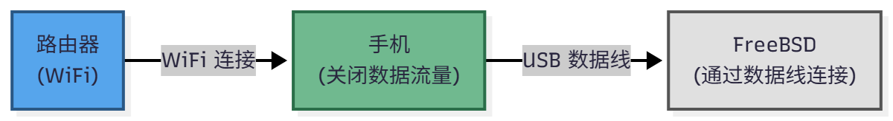

# 7.5 USB Network Tethering

## Overview

USB tethering is a technology that shares the wide area network (WAN) connection of a mobile device (such as a smartphone or tablet) with a computer system through the Universal Serial Bus (USB) physical layer.

The following configuration methods have been tested and verified on a Redmi Note 12 5G, and can support Android devices and iPhone 13 and earlier iOS devices (iPhone 14 and newer models are not available due to NCM protocol compatibility issues; see the Apple device driver section below for details).

### Traffic Characteristics of Wi-Fi Sharing

Some Android phones (such as Google Pixel 3 and newer models) can share the network with FreeBSD after turning on Wi-Fi and turning off mobile data. This function works by forwarding the phone's established Wi-Fi connection to FreeBSD via the USB interface, without generating mobile data traffic.



For Android devices that have obtained root privileges, you can also share the phone's VPN connection with the FreeBSD device via a data cable. For related software, refer to [VPN Hotspot](https://github.com/mygod/vpnhotspot), and for usage methods, refer to [Share V2ray Proxy by Creating a Wi-Fi Hotspot](https://www.sainnhe.dev/post/v2ray-hotspot/).

## Loading Kernel Modules

First, you need to load the corresponding kernel module so that the system can recognize USB tethering devices (if not loaded by default).

### Generic Android Device Driver

General Android devices use the Remote Network Driver Interface Specification (RNDIS) protocol and require loading the following kernel module:

```sh
# kldload if_urndis
```

This command loads the USB RNDIS network driver, enabling the system to recognize Android devices using the RNDIS protocol.

### Apple Device Driver

Apple iPhone/iPad devices require loading the following kernel module:

```sh
# kldload if_ipheth
```

This command loads the iPhone/iPad Ethernet network driver, enabling the system to recognize the USB tethering feature of iOS devices. After successful loading, the system typically creates a network interface such as `ue0`.

> **Note**
>
> Starting from the iPhone 14 series, Apple has switched the USB tethering protocol from traditional IP-over-USB to the NCM protocol. FreeBSD's if_ipheth driver currently does not support NCM mode, and the if_cdce driver also has compatibility issues with Apple's NCM implementation (Apple's NCM implementation does not fully conform to the standard), which may cause the connection to be unusable. As of late 2025, there is no complete solution for this issue.

### Newer Android Device Driver (CDC NCM)

Starting from the Google Pixel 6 series (2021), Google has switched the native Android USB tethering protocol from RNDIS to the Network Control Model (NCM), and some other manufacturers' newer devices have gradually followed suit. Such devices require loading the following kernel module:

```sh
# kldload if_cdce
```

This command loads the USB CDC ECM/NCM network driver, enabling the system to recognize Android devices using the NCM protocol. After successful loading, the system typically creates a network interface such as `ue0`.

## Persistent Driver Loading Mechanism

To automatically load the above modules at system startup, you can add the corresponding entries to the **/boot/loader.conf** file based on the device type:

```ini
if_urndis_load="YES"  # Set the system to automatically load the USB RNDIS network driver at startup
if_cdce_load="YES"    # Set the system to automatically load the USB CDC ECM/NCM network driver at startup
if_ipheth_load="YES"  # Set the system to automatically load the iPhone/iPad Ethernet driver at startup
```

After editing, save the file and restart the system for the changes to take effect.

## Physical Connection and Enabling Network Sharing

After loading the required kernel modules, connect the USB data cable between the FreeBSD system and the mobile device, then enable the USB tethering feature on the mobile device. The specific method for enabling it varies by device brand and system version, and can usually be found in the mobile device's "Settings," "Network," or "Personal Hotspot" menu. Note that some Android devices may require enabling USB debugging first before the USB tethering device can be recognized (most modern Android devices do not require this step); iOS devices may require confirming trust for this computer in the popup dialog to function properly.

## Obtaining an IP Address

After the mobile device enables USB tethering, the FreeBSD system will automatically create the corresponding network interface, typically named `ue0`. You can confirm the actual interface name using the `ifconfig` command. After confirming the interface name, obtain an IP address for the interface via DHCP:

```sh
# dhclient ue0
```

This command sends a DHCP request for the `ue0` interface to obtain network configuration parameters such as IP address, subnet mask, default gateway, and DNS server from the mobile device. After successful acquisition, you can use the `ifconfig ue0` command to view the assigned IP address.

## References

- FreeBSD Project. if_urndis -- USB Remote NDIS Ethernet device[EB/OL]. [2026-04-14]. <https://man.freebsd.org/cgi/man.cgi?query=if_urndis&sektion=4>. USB RNDIS network device driver manual page, for Android USB tethering.
- FreeBSD Project. if_cdce -- Communication Device Class Ethernet device[EB/OL]. [2026-04-14]. <https://man.freebsd.org/cgi/man.cgi?query=if_cdce&sektion=4>. USB CDC Ethernet device driver manual page.
- FreeBSD Project. if_ipheth -- Apple iPhone USB Ethernet device[EB/OL]. [2026-04-14]. <https://man.freebsd.org/cgi/man.cgi?query=if_ipheth&sektion=4>. iPhone USB tethering driver manual page.
- FreeBSD Project. dhclient -- Dynamic Host Configuration Protocol client[EB/OL]. [2026-04-14]. <https://man.freebsd.org/cgi/man.cgi?query=dhclient&sektion=8>. DHCP client manual page, describing automatic IP address configuration.
- FreeBSD Project. ifconfig -- configure network interface parameters[EB/OL]. [2026-04-14]. <https://man.freebsd.org/cgi/man.cgi?query=ifconfig&sektion=8>. Network interface configuration tool manual page.
- FreeBSD Project. loader.conf -- kernel and module configuration[EB/OL]. [2026-04-14]. <https://man.freebsd.org/cgi/man.cgi?query=loader.conf&sektion=5>. Kernel module loading configuration file format manual page.
