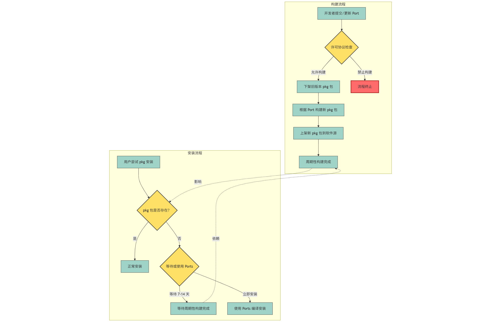

# 8.1 Overview of FreeBSD Package Manager

## Software Repository Overview

FreeBSD provides multiple types of software repositories, each serving different system components and software installation needs.

For readers familiar with Linux distributions, FreeBSD's package management approach can be compared to a combination of two major Linux distribution package managers:

- Arch Linux: Pacman, corresponding to pkg (also adhering to the KISS principle).
- Gentoo Linux: Portage, corresponding to Ports (Portage itself was inspired by Ports).

`pkg install` can be abbreviated as `pkg ins`, and the same applies to other commands.

The following table summarizes the basic information of each software repository:

| Software Repository | Description | Notes |
| ------------------- | ----------- | ----- |
| pkg | Similar to traditional Linux package managers, used for installing binary software packages | No configuration needed if you do not install software in binary form. `pkg` is not installed by default; typing `pkg` and pressing Enter will prompt for installation. **All pkg packages except PkgBase are actually built directly from Ports** |
| Ports Framework | Fetches the source code directory of a Port (does not contain source code itself, only description files, patch sets, and Makefiles for third-party software). Ports is a collection of Ports, maintained collectively in the `freebsd-ports` repository | Gentoo's package manager Portage (command `emerge`) was inspired by this, used to help users compile and install third-party software from source code. In other words, Ports (Port collection) is similar to Gentoo's [ebuild repository](https://mirrors.ustc.edu.cn/help/gentoo.html) |
| Ports Source | The Makefile in a Port defines several source code download addresses for the software package; this repository is used to fetch those source codes (because downloading from the official upstream is sometimes slow) | Equivalent to Gentoo's [Distfiles source](https://mirrors.ustc.edu.cn/help/gentoo.html). If you do not need to compile software from source code, you do not need to configure this |
| freebsd-update | Used to update the base system (kernel + userland) | Supports ALPHA, BETA, RC, and RELEASE versions; STABLE/CURRENT branches do not provide binary updates |
| PkgBase | Packages the FreeBSD base system (kernel + userland) into pkg packages, using pkg(8) to manage the base system; this is a new base system installation and update method provided by FreeBSD | Introduced as a technology preview in FreeBSD 15.0: VM and cloud images use PkgBase by default, while physical machines still use the traditional method by default. 14.x can manually enable it for evaluation and testing. During installation, you can choose to use PkgBase (FreeBSD-base source) in bsdinstall(8); the original freebsd-update(8) and distribution set method will remain supported during the 15.x lifecycle (planned for removal in FreeBSD 16, at which point PkgBase will become the standard method). Use `pkg upgrade` for base system upgrades/maintenance. Production environments are advised to continue evaluating its stability. Requires configuring the FreeBSD-base source (see below). Refer to [PkgBase Wiki](https://wiki.freebsd.org/PkgBase). PkgBase is actually built from the `freebsd-src` repository and has nothing to do with Ports. The FreeBSD base system has always been independent of and self-sustaining from Ports |
| kernel modules (kmods) | Kernel module source (including wireless network card drivers, Ethernet card drivers, DRM graphics drivers, etc.), used to address potential ABI incompatibility issues between minor versions | See: Possible solution to the drm-kmod kernel mismatch after upgrade from Bapt[EB/OL]. [2026-03-26]. <https://forums.freebsd.org/threads/possible-solution-to-the-drm-kmod-kernel-mismatch-after-upgrade-from-bapt.96058/#post-682984>, CFT: repository for kernel modules[EB/OL]. [2026-03-26]. <https://lists.freebsd.org/archives/freebsd-ports/2024-December/006997.html>. You can use the `fwget` command to automatically install required firmware |
| FreeBSD (pub) | Provides ISO installation images, documentation, development materials, and `snapshots`, which are very helpful for system installation, system rescue, and development reference | The Pub here refers to the official <https://ftp.freebsd.org/pub/FreeBSD/>. Its nature is similar to a regular mirror distribution repository, belonging to the same category as debian-cd and ubuntu-releases. Currently known mirrors that fully sync the FreeBSD (Pub) repository: <https://mirrors.nju.edu.cn/freebsd>. It provides the complete directory structure (such as `snapshots`, `development`) with relatively timely updates. See: FreeBSD.org ftp server[EB/OL]. [2026-03-26]. <https://ftp.freebsd.org/pub/FreeBSD/> directory structure |

## Understanding pkg's Quarterly Branch and the Rolling-Update Latest Branch

FreeBSD's pkg is divided into two repository branches: quarterly (built from the Ports XXXXQY branch) and latest (rolling update, built from the Ports main branch). quarterly is currently the default pkg software branch for FreeBSD.

```sh
# git clone https://git.FreeBSD.org/ports.git /usr/ports # Clone the FreeBSD Ports repository to the /usr/ports directory
Cloning into '/usr/ports'...
remote: Enumerating objects: 6715646, done.
remote: Counting objects: 100% (936/936), done.
remote: Compressing objects: 100% (120/120), done.
remote: Total 6715646 (delta 923), reused 816 (delta 816), pack-reused 6714710 (from 1)
Receiving objects: 100% (6715646/6715646), 1.50 GiB | 10.26 MiB/s, done.
Resolving deltas: 100% (4065984/4065984), done.
Updating files: 100% (168004/168004), done.
root@ykla:/home/ykla # cd /usr/ports/ # Switch to the git Ports path
root@ykla:/usr/ports # git branch -a # List all local branches
* main
  remotes/origin/2014Q1
  remotes/origin/2014Q2
  remotes/origin/2014Q3
  remotes/origin/2014Q4

     ……some omitted……

  remotes/origin/2025Q2
  remotes/origin/2025Q3
  remotes/origin/2025Q4
  remotes/origin/HEAD -> origin/main # You can see that main is the default branch
  remotes/origin/main
root@ykla:/usr/ports # git for-each-ref --sort=-committerdate --format='%(committerdate:short) %(authorname) %(refname:short) %(objectname:short)' refs/remotes/ # List all branches with last committer and time ①
2025-10-24 Hiroki Tagato origin be5283280c16
2025-10-24 Hiroki Tagato origin/main be5283280c16
2025-10-23 Colin Percival origin/2025Q4 060d3d65fcbb
2025-10-14 Bryan Drewery origin/2025Q3 9f09f84b2dd5
2025-07-01 FiLiS origin/2025Q2 c339266c40e5

  ……some omitted……

2015-07-23 Palle Girgensohn origin/2015Q2 7d7c2271f6c9
2015-04-09 Alonso Schaich origin/2015Q1 5bd325869bde
2014-10-01 Bryan Drewery origin/2014Q3 a0ccd6f83108
2014-06-28 Thomas Zander origin/2014Q2 a3377806e58e
2014-03-29 Lars Engels origin/2014Q1 5f4d6e1d6b07
root@ykla:/usr/ports # git merge-base origin/main origin/2025Q4 # Find the most recent common ancestor commit of two branches
6c256c6adb790f0588b920d41a5fe4dfa550079f
root@ykla:/usr/ports # git branch -r --contains 6c256c6adb790f0588b920d41a5fe4dfa550079f # List which remote branches contain this commit in their history ②
  origin/2025Q4
  origin/HEAD -> origin/main
  origin/main
root@ykla:/usr/ports # for branch in $(git branch -r | grep -v HEAD); do # View the creation time of branches ③
>   mb=$(git merge-base origin/main $branch)
>   date=$(git show -s --format='%ci' $mb)
>   echo "$branch created around $date"
> done

origin/2014Q1 created around 2013-12-16 08:00:15 +0000
origin/2014Q2 created around 2014-04-01 12:02:40 +0000
origin/2014Q3 created around 2014-07-01 10:13:26 +0000
origin/2014Q4 created around 2014-10-01 06:43:32 +0000
origin/2015Q1 created around 2015-01-01 14:35:03 +0000
origin/2015Q2 created around 2015-04-01 12:19:37 +0000
origin/2015Q3 created around 2015-07-01 12:12:08 +0000
origin/2015Q4 created around 2015-10-01 19:24:12 +0000

……some omitted……

origin/2024Q4 created around 2024-10-07 20:46:12 +0200
origin/2025Q1 created around 2025-01-05 11:22:53 +0100
origin/2025Q2 created around 2025-04-01 12:58:51 +0200
origin/2025Q3 created around 2025-07-01 22:32:34 +0300
origin/2025Q4 created around 2025-10-01 21:27:17 +0200
origin/main created around 2025-10-24 12:43:02 +0900
```

The content of quarterly is cut from the main branch (latest). New branches are released every January, April, July, and October ③ (cut from the main branch at a specific point in time ①), in the format `2024Q3`, `2025Q1`. This is to facilitate pulling the required branch directly via git, but the Ports Management Team (portmgr) only maintains the latest branch; older branches no longer accept any merges. ②

quarterly is actually similar to Debian's Stable version, where "Stable" here means not only "stable" but also "fixed." It is necessary to distinguish between the two words "stable" and "fixed":

According to [Merriam‑Webster](https://www.merriam-webster.com/dictionary/stable) and [Cambridge Dictionary](https://dictionary.cambridge.org/us/dictionary/english/stable), Stable has the meaning of "fixed." Consulting the *Contemporary Chinese Dictionary (7th Edition)*, page 1374, the first definition of "稳定" (stable) is "adjective, stable and firm, without change"; page 470 records "固定" (fixed) as "verb, not changing or not moving (as opposed to 'flowing')." Therefore, "fixed" is a means to achieve "stable," while "stable" is a goal.

> **Tip**
>
> Debian achieves **stability** by **fixing** package versions and only accepting security updates rather than feature updates. Its software repository is **fixed** — Debian also has testing and other branches. Common distributions achieve **Stable** versions by **fixing** software. Since these packages have gone through testing and development across multiple branches from unstable (i.e., sid, which Ubuntu is based on) to testing, the packages are naturally more **stable**. During the lifecycle of a **Stable** version system, virtually no software receives major version updates or feature updates.

The quarterly branch is similar to Debian's Stable version, fixing package versions and only accepting security updates and bug fixes to provide a predictable and stable user experience. No feature updates are backported to the quarterly branch.

> **Note**
>
> Not all repositories provide both `quarterly` and `latest`.

### References

- FreeBSD Project. Ports/QuarterlyBranch[EB/OL]. [2026-03-25]. <https://wiki.freebsd.org/Ports/QuarterlyBranch>. Explains the creation rules and maintenance policy of the Ports quarterly branch.
- FreeBSD Project. pkg -- package manager[EB/OL]. [2026-04-17]. <https://man.freebsd.org/cgi/man.cgi?query=pkg&sektion=8>. FreeBSD package manager manual page.
- Debian. DebianStability[EB/OL]. [2026-03-26]. <https://wiki.debian.org/DebianStability>. Meaning of stability.
- Debian. Chapter 3. Choosing a Debian distribution[EB/OL]. [2026-03-26]. <https://www.debian.org/doc/manuals/debian-faq/choosing.en.html#s3.1.1>. Here it actually means fixed.
- Debian. Choosing a Debian distribution[EB/OL]. [2026-03-26]. <https://www.debian.org/doc/manuals/debian-faq/choosing.zh-cn.html>. Chapter 3 Chinese version.
- Debian. 2.2. Are there package upgrades in "stable"?[EB/OL]. [2026-03-26]. <https://www.debian.org/doc/manuals/debian-faq/getting-debian.en.html#updatestable>. This points out that software will not receive feature updates.
- FreeBSD Project. pkg.freebsd.org[EB/OL]. [2026-03-26]. <https://pkg.freebsd.org/>. Not all architectures provide pkg repositories; this is related to platform support tiers.

## Overview of Ports and Port

### Ports History

Ports is a framework for building software from source code (it also supports closed-source binary packages). This framework was created by Jordan K. Hubbard (<jkh@FreeBSD.org>) and was first publicly released in August 1994.

```sh
# git log --reverse --max-parents=0 --pretty=format:"commit: %h%nAuthor: %an%nDate: %ci%n%n%B" # View the first commit record of the repository
commit: d27f048e966a
Author: Jordan K. Hubbard
Date: 1994-08-21 13:12:57 +0000

Commit my new ports make macros.  Still not 100% complete yet by any means
but fairly usable at this stage.
Submitted by:   jkh
```

"Committed the new make macros for ports. Although far from complete, they are already usable at this stage."

> **Tip**
>
> The above example illustrates: for open source projects, regardless of the version control system used, preserving complete commit records is very important.

NetBSD and OpenBSD also use Ports, but their implementations are not interchangeable.

#### References

- FreeBSD-Ports-Announce. Happy 20th birthday FreeBSD ports tree![EB/OL]. (2014-08)[2026-03-25]. <https://lists.freebsd.org/pipermail/freebsd-ports-announce/2014-August/000088.html>. Commemorating the 20th anniversary of FreeBSD Ports, reviewing its historical evolution and development.

### Definition of Ports and Port

A collection of related files (patch files, checksums, Makefile, etc.) for a piece of software is called a Port, and the collection of all Ports (ported software) is called the Ports Collection or Ports Tree, abbreviated as Ports. From a terminological perspective, Port refers to the porting build configuration of a single piece of software, while Ports refers to the entire collection of ported software.

Project Structure

```sh
/usr/
└── ports/ # Ports directory
    ├── accessibility/ # Category directory
    ├── arabic/
    ├── archivers/
    ├── astro/
    ├── audio/
    ├── benchmarks/
    ├── biology/
    ├── cad/
    ├── chinese/
    ├── comms/
    ├── converters/
    ├── databases/ # Database category
    │   ├── postgresql18-server/ # Single Port example
    │   │   ├── Makefile # Main file
    │   │   ├── distinfo # Checksum file
    │   │   ├── pkg-descr # Software description
    │   │   ├── files/ # Patch files directory
    │   │   └── pkg-plist-* # Installation file list
    │   └── ……other Ports……
    ├── deskutils/
    ├── devel/
    ├── dns/
    ├── editors/
    ├── emulators/
    ├── finance/
    ├── french/
    ├── ftp/
    ├── games/
    ├── german/
    ├── graphics/
    ├── hebrew/
    ├── hungarian/
    ├── irc/
    ├── japanese/
    ├── java/
    ├── korean/
    ├── lang/
    ├── mail/
    ├── math/
    ├── misc/
    ├── multimedia/
    ├── net/
    ├── net-im/
    ├── net-mgmt/
    ├── net-p2p/
    ├── news/
    ├── polish/
    ├── portuguese/
    ├── print/
    ├── russian/
    ├── science/
    ├── security/
    ├── shells/
    ├── sysutils/
    ├── textproc/
    ├── ukrainian/
    ├── vietnamese/
    ├── www/
    ├── x11/
    ├── x11-clocks/
    ├── x11-drivers/
    ├── x11-fm/
    ├── x11-fonts/
    ├── x11-servers/
    ├── x11-themes/
    ├── x11-toolkits/
    ├── x11-wm/
    ├── ports-mgmt/
    ├── Mk/
    ├── Templates/
    ├── Tools/
    ├── Keywords/
    ├── distfiles/ # Downloaded source files directory
    ├── COPYRIGHT
    ├── GIDs
    ├── UIDs
    ├── README
    ├── CHANGES
    ├── MOVED
    ├── UPDATING
    ├── Makefile
    └── CONTRIBUTING.md
```

View the Ports Framework structure:

```sh
$ cd /usr/ports # Switch to /usr/ports
$ ls # List all files in this directory  ①
accessibility	COPYRIGHT	GIDs		misc		README		www
arabic		databases	graphics	Mk		russian		x11
archivers	deskutils	hebrew		MOVED		science		x11-clocks
astro		devel		hungarian	multimedia	security	x11-drivers
audio		dns		irc		net		shells		x11-fm
benchmarks	editors		japanese	net-im		sysutils	x11-fonts
biology		emulators	java		net-mgmt	Templates	x11-servers
cad		filesystems	Keywords	net-p2p		textproc	x11-themes
CHANGES		finance		korean		news		Tools		x11-toolkits
chinese		french		lang		polish		UIDs		x11-wm
comms		ftp		mail		ports-mgmt	ukrainian
CONTRIBUTING.md	games		Makefile	portuguese	UPDATING
converters	german		math		print		vietnamese
$ ls databases/ # Switch to the databases category directory
adminer						php-xapian
adodb5						php81-dba

    ……some omitted……

mongodb60					py-apache-arrow
mongodb70					py-apsw
mongodb80					py-asyncmy
mongosh						py-asyncpg
$ cd databases/postgresql18-server # Switch to the postgresql18-server directory
ykla@ykla:/usr/ports/databases/postgresql18-server $ ls ②
distinfo		pkg-descr		pkg-plist-contrib	pkg-plist-pltcl
files			pkg-install-server	pkg-plist-plperl	pkg-plist-server
Makefile		pkg-plist-client	pkg-plist-plpython
```

- ① **/usr/ports** This directory as a whole is called Ports, including dozens of different category directories, each containing several Ports.
- ② **/usr/ports/databases/postgresql18-server** This directory as a whole is called a Port, consisting of files such as `distinfo` (checksum file), `pkg-descr` (software description file), `Makefile` (main file, containing build methods, version numbers, and download methods), `pkg-plist` (installation file list with permissions and ownership information), `files` (generally patch files; this Port also contains a post-installation message file `pkg-message`), etc.

The reason it is called "Ports Collection" (porting collection, not to be confused with "port collection") is that most of this software is not controlled, managed, or maintained by FreeBSD. The primary work of Port committers is to update Ports on FreeBSD to the latest versions provided by upstream developers and to remove Ports for software that is no longer maintained upstream. If upstream does not accept BSD-specific PR patches, or if it is difficult to build directly through the existing Ports framework, Port maintainers also need to fork a branch for maintenance themselves.

## The Process of Building pkg Packages from Ports

The Ports framework can compile source code and package it into pkg-format binary packages. The complete build process is shown in the following diagram.



> **Note**
>
> You can use both Ports and pkg simultaneously, as most users do. However, note that Ports and pkg should use the same branch: if Ports uses the main branch, then pkg should use the latest repository; if Ports uses the quarterly branch, then pkg should use the quarterly repository. Inconsistent branches can cause dependency issues (e.g., SSL). The latest repository also publishes later than Ports on the main branch (its packages are built from main), so even when using the latest repository, the above issues may occur. If you encounter problems, uninstall the pkg-installed packages and recompile using Ports.

> **Warning**
>
> If you have modified the default build parameters of a Port via `make config` and wish to retain those custom settings, you should not update that software via pkg afterward, otherwise the pkg-installed package will overwrite the custom parameters.

The following diagram shows the detailed process of building software packages with Ports:


> **Tip**
>
> The download path for Ports is **/usr/ports/distfiles/**.

```sh
/usr/ports/
└── distfiles/ # Download path for Ports
```

## PkgBase Repository Classification

To help readers better configure the PkgBase repository, the following summarizes the PkgBase information for FreeBSD's official repositories, including the update frequency and corresponding URL addresses for each branch.

| Branch | Update Frequency | URL Address |
| ------ | ---------------- | ----------- |
| main (16.0-CURRENT) | Twice daily | <https://pkg.freebsd.org/${ABI}/base_latest> |
| stable/14 | Twice daily | <https://pkg.freebsd.org/${ABI}/base_latest> |
| stable/14 | Weekly: Sunday | <https://pkg.freebsd.org/${ABI}/base_weekly> |
| stable/15 | Twice daily | <https://pkg.freebsd.org/${ABI}/base_latest> |
| stable/15 | Weekly: Sunday | <https://pkg.freebsd.org/${ABI}/base_weekly> |
| releng/14.4 (RELEASE) | With errata and security updates | <https://pkg.freebsd.org/${ABI}/base_release_4> |
| releng/15.0 (RELEASE) | With errata and security updates | <https://pkg.freebsd.org/${ABI}/base_release_0> |

The above update frequencies are based on the freebsd-base(7) manual page: development branches (CURRENT and STABLE) are built twice daily, and RELEASE branches are updated with errata and security updates. The main branch only provides base_latest, not base_weekly (see Baptiste Daroussin's explanation on the freebsd-pkgbase mailing list).

If the official repository download speed is slow, consider using a domestic mirror. Simply replace the `https://pkg.freebsd.org` part.

## Exercises

1. Analyze the technical reasons for the removal of Portsnap in FreeBSD 15 (you may discuss from dimensions such as security, branch support, disk usage, and offline capability), and explain the advantages of Git as a replacement.
2. Compare the metadata signature chain mechanisms of the FreeBSD pkg repository, Debian APT repository, and Arch Linux pacman repository, and analyze the differences in their protective capabilities against supply chain attack scenarios.
3. Software repository mirroring is a decentralized distribution architecture. Analyze the advantages and disadvantages of volunteer-operated mirror station models versus commercial CDN models in terms of sustainability, censorship resistance, and distribution efficiency, and propose a hybrid distribution scheme.
