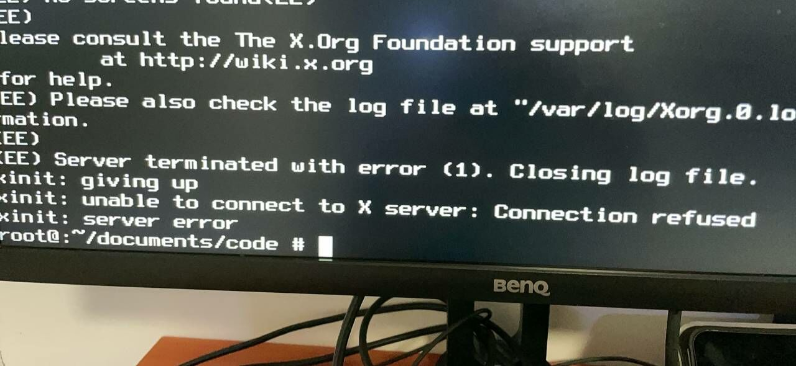

# 9.1 Graphics Driver Overview

A FreeBSD system installed using bsdinstall does not automatically install a graphical user interface. This section describes how to select and install drivers for graphics processing units (GPUs).

## When Do You Need to Install Graphics Drivers?



The image above shows the error screen that may appear when no graphics driver is installed.

> **Warning**
>
> Do not use **sysutils/desktop-installer**, as this tool may cause errors and configuration conflicts in the current environment.

## Graphics Support Status

FreeBSD's i915 and AMD graphics drivers are separated from the base system and provided as Ports. These drivers are ported from the Linux kernel's Direct Rendering Manager (DRM) and use Long Term Support (LTS) versions. The corresponding Linux kernel versions differ across system releases.

> **Note**
>
> When installing via Ports, the drm driver requires a copy of the current system source code in **/usr/src**. For details, refer to the system update chapter. If you have already followed other chapters in this book to install it, the system typically already has a copy of the source code, and there is no need to obtain it again.

DRM is a subsystem of the Linux kernel responsible for interacting with the GPUs of modern graphics cards. FreeBSD implements the Linux Kernel Programming Interface (LinuxKPI) in its kernel and has ported the Linux DRM. Some wireless network card drivers also use this porting approach.

> **Note**
>
> This porting does not cover all existing Linux DRM GPU drivers. Currently, only i915, amdgpu, and radeon are included; vmwgfx, xe, virtio, and others have not been ported. These unported GPUs lack DRM KMS driver support and cannot run on Wayland; on X11, they can only use framebuffer drivers (such as scfb or vesa) rather than hardware-accelerated drivers.

Graphics support status:

| Port Name | Linux DRM Version | Applicable FreeBSD Version | Description |
| --------- | ----------------- | -------------------------- | ----------- |
| **graphics/drm-515-kmod** | 5.15 LTS | 14.0–15.x | Not supported on FreeBSD 16.0 and above |
| **graphics/drm-61-kmod** | 6.1 LTS | 14.0 and above | Default choice for 14.x |
| **graphics/drm-66-kmod** | 6.6 LTS | 15.0 and above | Default choice for 15.0 |
| **graphics/drm-612-kmod** | 6.12 LTS | 15.1 and above | Default choice for 15.1 and above; Intel Meteor Lake graphics enabled by default after 6.7; AMD covers all architectures from GCN to RDNA 4 (RDNA 4 support introduced since Linux 6.12) |
| **graphics/drm-latest-kmod** | Tracking latest | 15.1 and above | Tracks the drm-kmod repository master branch, currently Linux 6.12; may be less stable than LTS versions |

When installing via the meta Port **graphics/drm-kmod**, the system automatically selects the appropriate version based on OSVERSION:

| OSVERSION Condition | Selected Port | Corresponding FreeBSD Version |
| ------------------- | ------------- | ----------------------------- |
| >= 1500509 | drm-612-kmod | 15.1 and above |
| >= 1500031 | drm-66-kmod | 15.0 |
| Others | drm-61-kmod | 14.x |

To specify a version, install the corresponding Port directly. The OSVERSION thresholds above are hardcoded values in the ports tree and may change as the ports tree is updated. Refer to the actual Makefile in the ports for the definitive values.

You can look up the OSVERSION-to-version mapping and Git commits in the final chapter of the Porter's Handbook.

To check the local `OSVERSION`, which displays the system version build identifier:

```sh
# uname -U
1500019
```

> **Warning**
>
> Each minor or major version upgrade may require re-fetching the system source code and recompiling and reinstalling the graphics driver modules to successfully complete the upgrade and avoid being stuck at a black screen; alternatively, you can use the "module source" approach.

## Joining the video Group

The video group is the user group responsible for accessing DRM and DRI video devices. Only users added to this group can properly enable the hardware acceleration features of the graphics card and the Wayland session functionality.

Add the specified user to the video group:

```sh
# pw groupmod video -m actual_username
```

> **Warning**
>
> Even if already in the `wheel` group, you should also join the `video` group. Otherwise, video hardware decoding may malfunction, and regular users under Wayland will not have permission to access the graphics card.

## Brightness Adjustment

### General Settings

Most computers require enabling ACPI video support in the **/boot/loader.conf** file:

```sh
# sysrc -f /boot/loader.conf acpi_video_load="YES"
```

ThinkPad users can enable IBM ACPI support and ACPI video support.

- Enable IBM ACPI support in the **/boot/loader.conf** file:

```sh
# sysrc -f /boot/loader.conf acpi_ibm_load="YES"
```

- Enable ACPI video support in the **/boot/loader.conf** file:

```sh
# sysrc -f /boot/loader.conf acpi_video_load="YES"
```

### Intel/AMD Graphics

The `backlight` utility was introduced in FreeBSD 13.

```sh
# backlight          # Print current brightness
# backlight -q       # Output brightness value only, convenient for scripting
# backlight -i       # Query backlight device info (name, type)
# backlight decr 20  # Decrease brightness by 20%
# backlight +        # Default brightness increase by 10%
# backlight -        # Default brightness decrease by 10%
```

If the above operations do not take effect, check the available devices under the **/dev/backlight** path.

- Example (use the `ls /dev/backlight` command to view actual devices):

Set the amdgpu_bl00 backlight brightness to 10:

```sh
# backlight -f /dev/backlight/amdgpu_bl00 10
```

Set the backlight0 backlight brightness to 10:

```sh
# backlight -f /dev/backlight/backlight0 10
```

### References

- Vadot E. backlight -- configure backlight hardware[EB/OL]. (2022-07-19)[2026-03-25]. <https://man.freebsd.org/cgi/man.cgi?query=backlight&sektion=8>. Tested and confirmed that this tutorial works for Renoir graphics.

## Status Check

Check whether the graphics card has been successfully driven:

```sh
$ pciconf -lv | grep -B4 VGA   # List all VGA-compatible devices and their models in the system
$ ls -al /dev/dri/card0
lrwxr-xr-x  1 root wheel 8 Jul  2 19:39 /dev/dri/card0 -> ../drm/0

$ ls -al /dev/backlight/backlight0
crw-rw---- 1 root video 1, 177 Aug 22  2025 /dev/backlight/backlight0  # Desktop HDMI output may not have this
```

After the graphics driver is successfully loaded, a `card0` device will appear in the system (default number is `0`; if there is a second graphics card, it will be `card1`), and a `backlight0` device may also appear (this device typically does not exist under HDMI output). You can use `kldstat | grep -E "i915kms|amdgpu|radeonkms"` to further confirm that the corresponding kernel module has been successfully loaded.

## Troubleshooting and Unresolved Issues

> **Note**
>
> When encountering any issues, please first recompile and reinstall using Ports, especially during version upgrades.

- If there are issues with the graphics driver, please contact the maintainers directly: <https://github.com/freebsd/drm-kmod/issues>.
- If a laptop fails to light up the screen upon resume, add `hw.acpi.reset_video="1"` to the **/boot/loader.conf** file to reset the display adapter on resume.
- Regular users may not have been added to the `wheel` group or the `video` group. If a regular user is not in the video group (being in the wheel group alone is insufficient), KDE Settings will always display the graphics driver as "llvmpipe", which affects display or hardware decoding functionality for regular users under Wayland.

### KLD XXX.ko depends on kernel - not available or version mismatch.

This indicates a kernel version mismatch. Please upgrade the system first or compile and install using Ports. You can use the kernel modules provided by the FreeBSD-kmods repository (see other chapters), which should not have similar issues.


## Exercises

1. Use `pciconf -lv | grep -B3 display` to check the local graphics card model, install the corresponding DRM driver based on the graphics card brand (Intel, AMD, or NVIDIA), and use `kldstat` to confirm the driver module is loaded.
2. After installing the graphics driver, check whether the **/dev/dri/card0** device exists, add the current user to the `video` group, and after rebooting, run `glxinfo | grep "OpenGL renderer"` to confirm hardware acceleration is working.
3. Enable ACPI video support in **/boot/loader.conf**, use the `backlight` command to adjust screen brightness, and record the actual effects of `backlight decr` and `backlight +`.
