# 9.6 Remote Desktop

Remote desktop access technology allows one device to remotely control the desktop environment of another device over a network. Remote desktop protocols are mainly divided into two categories: framebuffer-based protocols (such as VNC, defined in RFC 6143) and instruction stream-based protocols (such as RDP, extended from the ITU-T T.120 protocol family (including T.128, i.e., T.share)). This section covers the configuration of both protocols on FreeBSD.

## Directory Structure

```sh
/
├── home
│   └── ykla
│       └── .vnc
│           ├── passwd              # VNC password file
│           ├── xstartup             # VNC startup script
│           └── config               # VNC configuration file
│       └── .Xauthority              # X authorization file
├── usr
│   └── local
│       └── etc
│           └── xrdp
│               ├── xrdp.ini        # XRDP main configuration file
│               ├── sesman.ini      # XRDP session manager configuration
│               └── startwm.sh      # XRDP desktop environment startup script
└── var
    ├── run
    │   ├── sddm                     # SDDM authorization file directory
    │   ├── lightdm                  # LightDM authorization file directory
    │   └── user
    │       └── 120
    │           └── gdm              # GDM authorization file directory
    └── lib
        └── gdm                      # GDM legacy authorization file directory
```

## x11vnc (FreeBSD as the Controlled End, Screen Mirroring)

x11vnc provides screen mirroring functionality. User operations are synchronously displayed on the physical monitor, and operations on the physical monitor are also visible in the VNC client. It is recommended to use it with SSH tunneling or SSL encryption to prevent VNC traffic from being sniffed.

If there is no physical monitor, x11vnc cannot be used, but an HDMI graphics dummy plug can be used instead of a physical monitor.

### Installing x11vnc

- Install using pkg:

```sh
# pkg install x11vnc
```

- Or install using Ports:

```sh
# cd /usr/ports/net/x11vnc/
# make install clean
```

### Creating a Password

Set the x11vnc access password:

```sh
$ x11vnc -storepasswd
Enter VNC password:
Verify password:
Write password to /root/.vnc/passwd?  [y]/n y # Enter y and press Enter to confirm
Password written to: /root/.vnc/passwd
```

### Starting the Server (KDE 6 SDDM)

- Start x11vnc using the specified password file and SDDM authorization file:

```sh
$ x11vnc -display :0 -rfbauth ~/.vnc/passwd -auth $(find /var/run/sddm/ -type f)
```

> **Warning**
>
> Since x11vnc does not yet support Wayland, if you select `Wayland` in the bottom-left corner of SDDM, you will not be able to enter the desktop.

- Start x11vnc using the specified password file and LightDM authorization file:

```sh
$ x11vnc -display :0 -rfbauth ~/.vnc/passwd -auth /var/run/lightdm/root/:0
```

- Start x11vnc using the specified password file and GDM authorization file:

```sh
$ x11vnc -display :0 -rfbauth ~/.vnc/passwd -auth /var/lib/gdm/:0.Xauth # Or use /run/user/120/gdm/Xauthority, the specific path depends on the GDM version, use ls to check
```

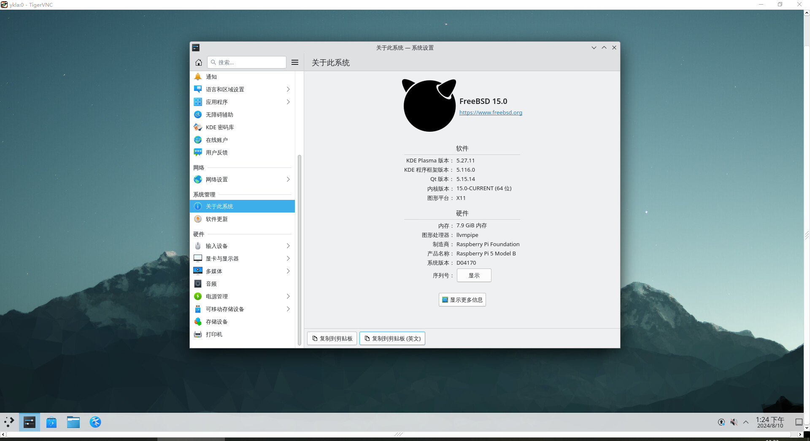

### References

- Arch Linux Wiki. X11vnc[EB/OL]. [2026-03-25]. <https://wiki.archlinux.org/title/X11vnc>. The official Arch Linux wiki providing detailed X11vnc configuration and usage guide.

## TigerVNC (FreeBSD as the Controlled End)

Enable the VNC server (only [TigerVNC](https://www.freshports.org/net/tigervnc-server/) remains in Ports).

### Installing TigerVNC Server

Install using pkg:

```sh
# pkg install tigervnc-server
```

Or install using Ports:

```sh
# cd /usr/ports/net/tigervnc-server/
# make install clean
```

### Setup

Create the **~/.vnc/** path:

```sh
$ mkdir -p ~/.vnc/
```

Edit the **~/.vnc/xstartup** file and add the following lines:

```sh
#!/bin/sh
unset SESSION_MANAGER        # Clear SESSION_MANAGER environment variable
unset DBUS_SESSION_BUS_ADDRESS  # Clear DBUS_SESSION_BUS_ADDRESS environment variable
# To use the desktop sessions below, first comment out or delete the exec line of xinitrc,
# otherwise xinitrc will replace the current process and subsequent desktop session commands will not be executed
[ -x /etc/X11/xinit/xinitrc ] && exec /etc/X11/xinit/xinitrc  # If xinitrc is executable, run it
[ -f /etc/X11/xinit/xinitrc ] && exec sh /etc/X11/xinit/xinitrc  # Otherwise run xinitrc file with sh
xsetroot -solid grey        # Set X root window background to grey
#exec startplasma-x11 &      # Start KDE Plasma (commented example)
#exec mate-session &         # Start MATE desktop (commented example)
#exec xfce4-session &        # Start XFCE4 desktop (commented example)
#exec gnome-session &        # Start GNOME desktop (commented example)
```

Remove the `#` comment at the beginning of the line for the desktop session you want to enable.

> **Warning**
>
> Make sure to keep the `&` character.

Set the xstartup script to executable permissions:

```sh
$ chmod 755 ~/.vnc/xstartup
```

- Execute the command in the terminal to start the VNC server:

```sh
$ vncserver
```

Start the VNC server on display `:1`:

```sh
$ vncserver :1

You will require a password to access your desktops.

Password: # Note: the password must be at least six characters!
Verify:
Would you like to enter a view-only password (y/n)? n
A view-only password is not used

New 'ykla:1 (ykla)' desktop is ykla:1

Creating default config /home/ykla/.vnc/config
Starting applications specified in /home/ykla/.vnc/xstartup
Log file is /home/ykla/.vnc/ykla:1.log
```

Here `:1` means `DISPLAY=:1`, i.e., the desktop display number is specified as `1`, corresponding to VNC service port `5901`. Desktop display numbers start from 0, but the port for number 0 is already occupied by the current desktop (unless it is a mirror VNC), so in practice the VNC service starts from `5901`. You must specify port `5901` when connecting.

Test:

```sh
$ vncserver :0

Warning: ykla:0 is taken because of /tmp/.X11-unix/X0
Remove this file if there is no X server ykla:0
A VNC server is already running as :0
```

If no communication port is specified when starting the service, the system will automatically assign one.

Display the current user's process list:

```sh
$ ps
 PID TT  STAT    TIME COMMAND
……irrelevant content omitted……
4769  0  S    0:02.72 /usr/local/bin/Xvnc :1 -auth /home/ykla/.Xauthority -desktop ykla:1 (ykla)
```

To stop the service, use the command `vncserver -kill :1`; you must specify the port number.

- If a firewall is enabled, using IPFW as an example, enter the following command in the terminal:

```sh
# ipfw add allow tcp from any to me 5900-5910 in keep-state
```

The above command opens ports 5900-5910, i.e., DISPLAY 0-10. Execute `ipfw list` to view all current firewall rules and confirm they have taken effect.

### References

- FreeBSD Forums. Xfce4 is not displayed correctly when I connect vncviewer (in Linux) to tightvnc-server (on FreeBSD)[EB/OL]. [2026-03-25]. <https://forums.freebsd.org/threads/xfce4-is-not-displayed-correctly-when-i-connect-vncviewer-in-linux-to-tightvnc-server-on-freebsd.85709/>. FreeBSD official forum discussion, resolving the issue of abnormal Xfce4 display during VNC remote connection.

## XRDP (FreeBSD as the Controlled End)

### Installing XRDP (Based on KDE6)

Install using pkg:

```sh
# pkg install xorg kde xrdp wqy-fonts xdg-user-dirs pulseaudio-module-xrdp
```

Or install using Ports:

```sh
# cd /usr/ports/x11/xorg/ && make install clean
# cd /usr/ports/x11/kde/ && make install clean
# cd /usr/ports/net/xrdp/ && make install clean
# cd /usr/ports/x11-fonts/wqy/ && make install clean
# cd /usr/ports/devel/xdg-user-dirs/ && make install clean
# cd /usr/ports/audio/pulseaudio-module-xrdp/ && make install clean
```

View configuration files:

```sh
# pkg info -D xrdp
```

### Configuring XRDP

Configure the daemons:

```sh
# service xrdp enable          # Set xrdp service to start on boot
# service xrdp-sesman enable   # Set xrdp-sesman service to start on boot
# service dbus enable          # Set D-Bus service to start on boot
```

Edit the **/usr/local/etc/xrdp/startwm.sh** file, find `#### start desktop environment`, and modify as follows:

```ini
#### start desktop environment
# exec gnome-session              # Start GNOME desktop, remove the leading #
# exec mate-session               # Start MATE desktop, remove the leading #
# exec start-lumina-desktop       # Start Lumina desktop, remove the leading #
# exec ck-launch-session startplasma-x11  # Start KDE6 desktop, remove the leading #
# exec startxfce4                 # Start XFCE desktop, remove the leading #
# exec xterm                      # Start XTerm, remove the leading #
```

Restart the system for changes to take effect.

### Configuring Chinese Environment (User Using Default sh)

Edit the **/usr/local/etc/xrdp/startwm.sh** file, add or modify the following content to set environment variables:

```sh
#### set environment variables here if you want
export LANG=zh_CN.UTF-8
```

Set the system language to Chinese.

### Troubleshooting and Unresolved Issues

#### No Sound Under XRDP

This issue can be mitigated through the Firefox browser.

## Remotely Accessing FreeBSD via TigerVNC from Windows

Download the TigerVNC viewer:

Download URL: <https://sourceforge.net/projects/tigervnc/files/stable/>

Check the VNC port on FreeBSD:

```sh
# sockstat -4l
USER     COMMAND    PID   FD  PROTO  LOCAL ADDRESS         FOREIGN ADDRESS
root     Xvnc        2585 4   tcp4   127.0.0.1:5910        *:*  #VNC occupied
root     xrdp        2580 13  tcp46  *:3389                *:*  #XRDP occupied
root     Xvnc        2016 5   tcp4   *:5901                *:*  #VNC occupied
root     sshd        1164 4   tcp4   *:22                  *:*  #SSH occupied
ntpd     ntpd        1127 21  udp4   *:123                 *:*
ntpd     ntpd        1127 24  udp4   127.0.0.1:123         *:*
ntpd     ntpd        1127 26  udp4   192.168.31.187:123    *:*
root     syslogd     1021 7   udp4   *:514                 *:*
```

### Troubleshooting and Unresolved Issues

#### Unable to Connect Due to Active Refusal by the Target Server

When using non-mirrored VNC connections, you must specify the port; otherwise, port 5900 is used by default. Since the service port for non-mirrored VNC is not 5900, the connection is refused.

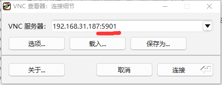

Example:

```sh
192.168.31.187:5901
```

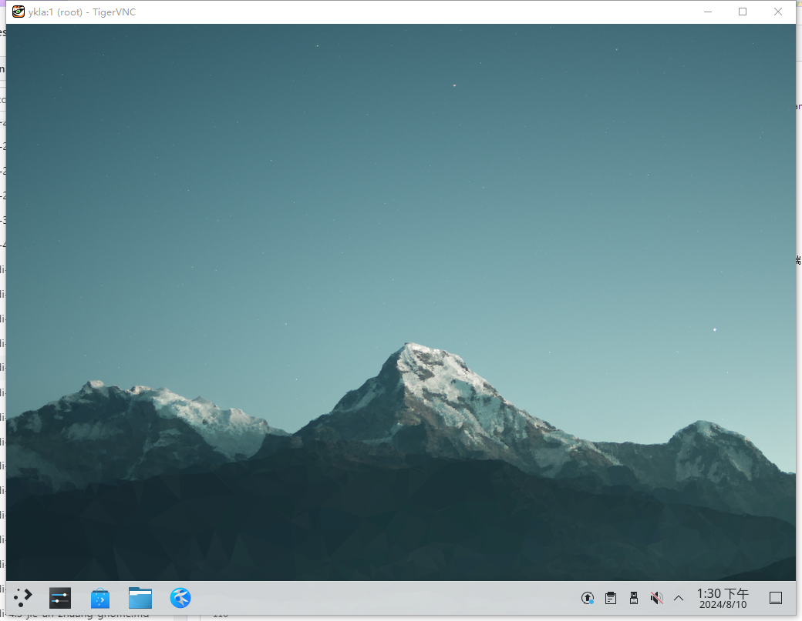

#### No Audio Output When Remotely Accessing FreeBSD via VNC

This issue has not been resolved in this section.

## Remotely Accessing FreeBSD via Windows Built-in Remote Desktop Connection (RDP)

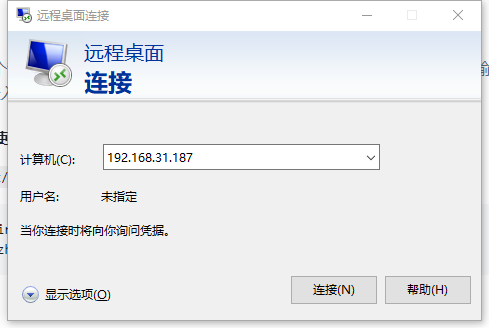

When logging into the device for the first time, there will be a security prompt. Enter `yes`, and after pressing Enter, the remote desktop window will pop up.


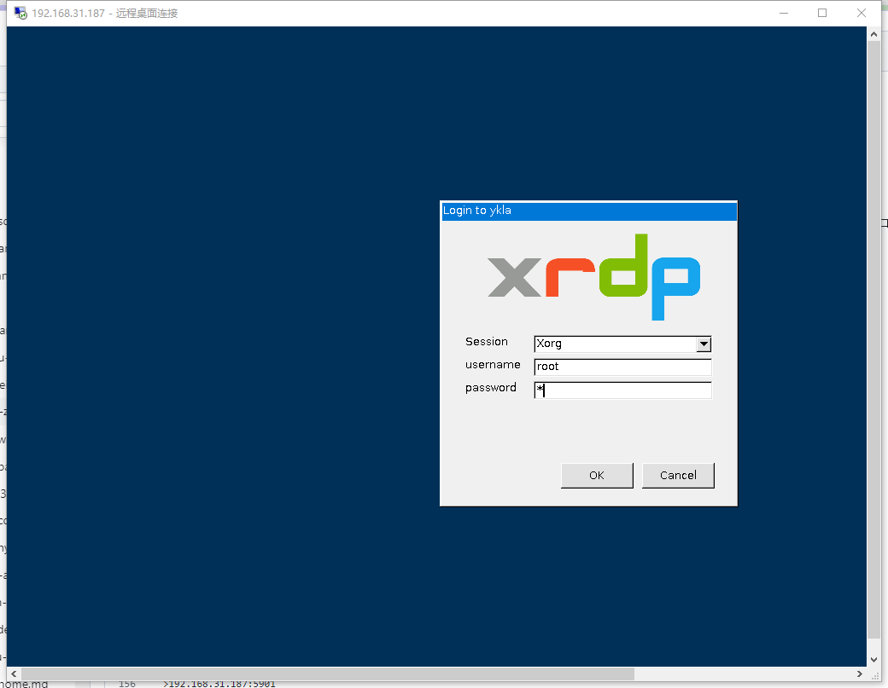


### Troubleshooting and Unresolved Issues

#### If the Windows Remote Desktop Window Is Neither in the Top-left Corner Nor Full-screen, the Display Will Be Blurry

You should uncheck "Smart resizing".

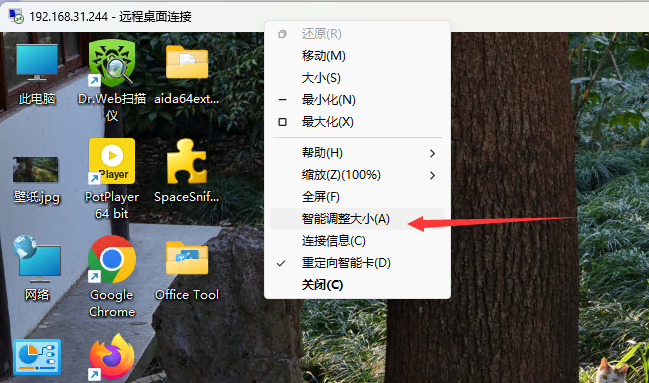

## Using Android to Remotely Access FreeBSD via XRDP

Download the required software:

The mobile RDP software developed by Microsoft: Remote Desktop

- Microsoft Corporation. Remote Desktop[EB/OL]. [2026-03-25]. <https://play.google.com/store/apps/details?id=com.microsoft.rdc.androidx&hl=zh_CN>. The official Android remote desktop client developed by Microsoft, supporting RDP protocol connections.

This software supports RDP connections on the Android platform.

Change the top-left mouse operation to touch operation. The default mouse operation is not convenient enough; you can also choose to connect a mouse and keyboard via OTG for control.

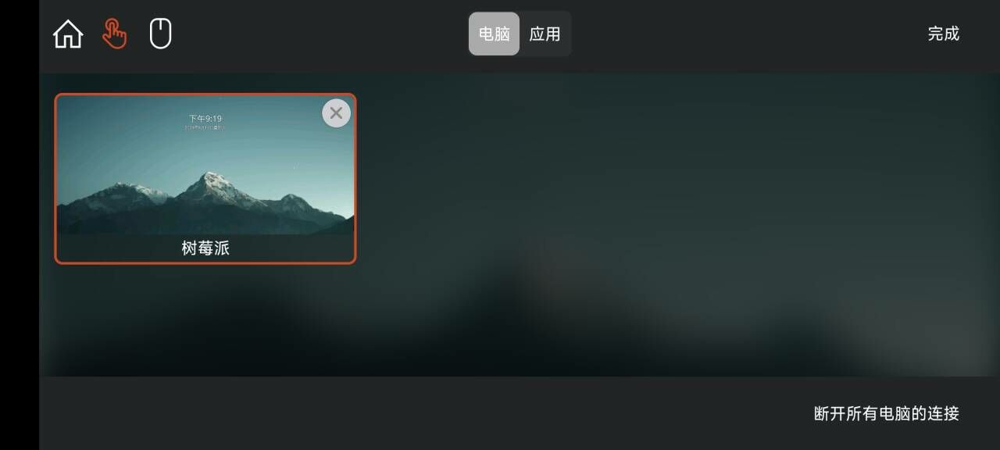

Connection diagram (Chromium is being compiled in the background, so resource usage will be high):


## Remotely Accessing Windows from FreeBSD via XRDP

### freerdp3

Install using pkg:

```sh
# pkg install freerdp3
```

Or using Ports:

```sh
# cd /usr/ports/net/freerdp3/
# make install clean
```

Use FreeBSD to remotely connect to Windows 11 24H2 via freerdp3:

```sh
$ xfreerdp3 /u:ykla /p:z  /v:192.168.31.213

……part omitted……
441] [19244:dca12700] [ERROR][com.freerdp.crypto] - [tls_print_new_certificate_warn]: Host key verification failed.
Certificate details for 192.168.31.213:3389 (RDP-Server):
        Common Name: DESKTOP-U72I6SS
        Subject:     CN = DESKTOP-U72I6SS
        Issuer:      CN = DESKTOP-U72I6SS
        Valid from:  Mar  4 12:39:28 2025 GMT
        Valid to:    Sep  3 12:39:28 2025 GMT
        Thumbprint:  36:b9:be:66:ab:2b:54:32:28:46:b6:98:68:8d:6f:20:a5:d1:58:8c:09:de:cc:3d:30:e1:06:6f:4f:62:54:de
The above X.509 certificate could not be verified, possibly because you do not have
the CA certificate in your certificate store, or the certificate has expired.
Please look at the OpenSSL documentation on how to add a private CA to the store.
Do you trust the above certificate? (Y/T/N) y # Enter y and press Enter to confirm the connection
```

> **Warning**
>
> Passing the password directly via the `/p` parameter on the command line causes the password to appear in the process list (viewable via commands such as `ps`), which poses a security risk.
>
> The **192.168.31.213** and `ykla` in the above example are placeholders and must be replaced with actual values. If the `/p` parameter is omitted in the example, the program will interactively prompt for the password after execution, which is more secure than writing the password in plaintext on the command line.

`xfreerdp3 /u:ykla /p:z /v:192.168.31.213` parameter descriptions:

| Parameter | Meaning | Description |
| --------- | ------- | ----------- |
| `xfreerdp3` | Command | Note the `x` prefix |
| `/u:ykla` | Username | `ykla` is the Windows login name |
| `/p:z` | Password | `z` is the login password for Windows user `ykla` |
| `/v:192.168.31.213` | Server | Replace with the actual Windows host address |

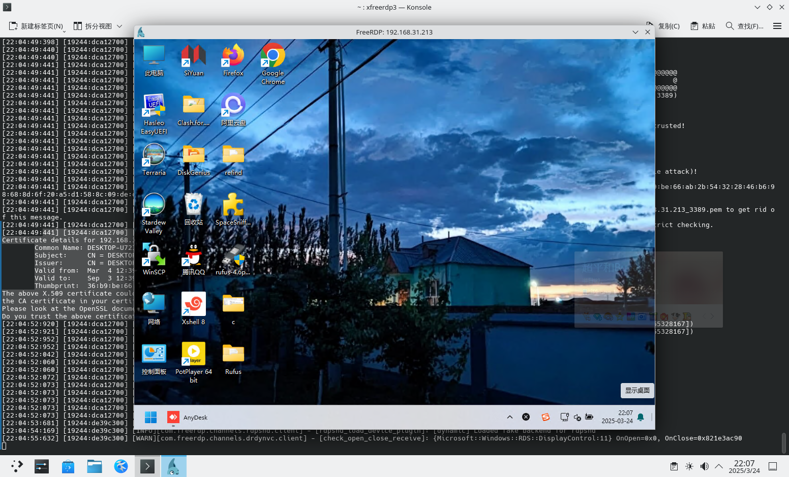

#### References

- Awakecoding. FreeRDP User Manual[EB/OL]. [2026-03-25]. <https://github.com/awakecoding/FreeRDP-Manuals/blob/master/User/FreeRDP-User-Manual.markdown>. FreeRDP user manual provided on GitHub, containing complete command descriptions and practical examples.

#### Troubleshooting and Unresolved Issues

During testing, it was found that a connection was successfully established without entering a username, which may be related to the FreeBSD username being the same as the Windows username.

### rdesktop (Does Not Support NLA)

**net/xrdesktop2** is a graphical frontend for rdesktop. During testing, it became unresponsive when opening keyboard settings.

---

Install rdesktop using pkg:

```sh
# pkg install rdesktop
```

Or install using Ports:

```sh
# cd /usr/ports/net/rdesktop/
# make install clean
```

rdesktop has no frontend GUI; you need to enter commands in the terminal:

```sh
# rdesktop ip:port # e.g., 192.168.31.155:3389
```

If you have not manually changed the Windows configuration, there is no need to add `:port_number`.

On the tested Windows 11 24H2, an error will be reported:

```sh
$ rdesktop 192.168.31.213
Failed to connect, CredSSP required by server (check if server has disabled old TLS versions, if yes use -V option).
```

According to rdesktop team. CredSSP does not work[EB/OL]. [2026-04-04]. <https://github.com/rdesktop/rdesktop/issues/71>. This is a long-standing issue.

> **Danger**
>
> Disabling Network Level Authentication (NLA) exposes the RDP service to severe security threats, including but not limited to:
>
> - **Credential forwarding attacks**: After NLA is disabled, user credentials will be sent to the remote host and stored in its memory. Attackers can use techniques such as pass-the-hash to steal credentials and continue impersonating the user even after the session is disconnected.
> - **Brute force attacks**: Without pre-session authentication, attackers can attempt logins without restriction.
> - **Denial of service attacks**: The server allocates session resources for each connection without verifying identity.
>
> **It is strongly recommended to prioritize using freerdp3 (see above), which supports NLA/CredSSP, rather than disabling NLA.** If you must disable NLA, please re-enable it immediately after the operation is completed, and ensure that the RDP port is not directly exposed to the public internet.

Steps to disable NLA are as follows, to be executed on the Windows machine you want to remotely connect to:

```powershell
PS C:\Users\ykla> reg add "HKEY_LOCAL_MACHINE\SYSTEM\CurrentControlSet\Control\Terminal Server\WinStations\RDP-Tcp" /v UserAuthentication /t REG_DWORD /d 0 /f  # Import the relevant registry entry
The operation completed successfully.
PS C:\Users\ykla> gpupdate /force  # Force refresh group policy
Updating policy...

Computer Policy update has completed successfully.
User Policy update has completed successfully.
```

Test the connection again:

```sh
$ rdesktop 192.168.31.213

ATTENTION! The server uses and invalid security certificate which can not be trusted for
the following identified reasons(s);

 1. Certificate issuer is not trusted by this system.

     Issuer: CN=DESKTOP-U72I6SS


Review the following certificate info before you trust it to be added as an exception.
If you do not trust the certificate the connection atempt will be aborted:

    Subject: CN=DESKTOP-U72I6SS
     Issuer: CN=DESKTOP-U72I6SS
 Valid From: Tue Mar  4 20:39:28 2025
         To: Wed Sep  3 20:39:28 2025

  Certificate fingerprints:

       sha1: 599c0e8bbc57c5ee8de8993d5241fb0f0d70e98d
     sha256: 36b9be66ab2b54322846b698688d6f20a5d1588c09decc3d30e1066f4f6254de


Do you trust this certificate (yes/no)? # Enter yes and press Enter
```


#### Troubleshooting and Unresolved Issues

##### No Sound During Video Playback

Not yet resolved.

#### References

- Microsoft Corporation. Troubleshoot authentication errors when you use RDP to connect to an Azure VM[EB/OL]. (2024-07-30)[2026-03-25]. <https://learn.microsoft.com/zh-cn/troubleshoot/azure/virtual-machines/windows/cannot-connect-rdp-azure-vm>. Microsoft official documentation providing RDP Network Level Authentication (NLA) configuration methods and troubleshooting guide.

## AnyDesk

AnyDesk can be used for remote access. FreeBSD supports amd64 and i386 architectures:

Due to copyright reasons (proprietary software may not be distributed without permission), users must build and install it themselves using Ports:

```sh
# cd /usr/ports/deskutils/anydesk/
# make install clean
```

Since you need to accept the license agreement to use it, the `BATCH=yes` parameter cannot be used:

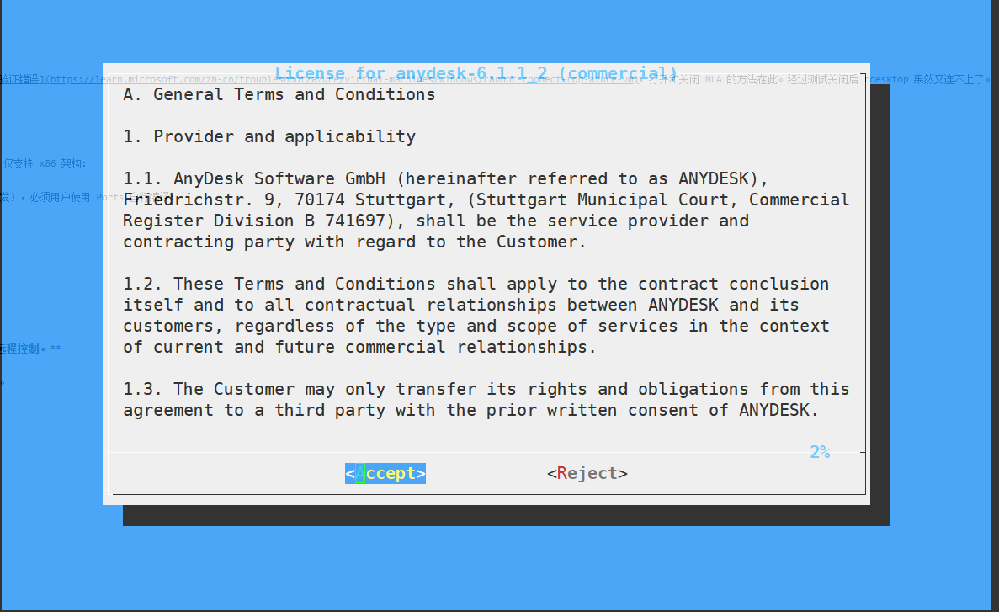

View the post-installation notes for AnyDesk:

```sh
# pkg info -D anydesk
```

It indicates that the proc filesystem needs to be mounted. Testing has shown that the program cannot start properly without this filesystem mounted.

```sh
# mount -t procfs proc /proc # Temporary mount; for persistent configuration, refer to the instructions above
```

The root user cannot run AnyDesk; it must be run as a regular user:

```sh
$ anydesk

(<unknown>:18311): Gtk-WARNING **: 21:07:13.540: Cannot find theme engine in module path: "adwaita",

……part omitted……
```

The AnyDesk main interface that pops up after executing the command:

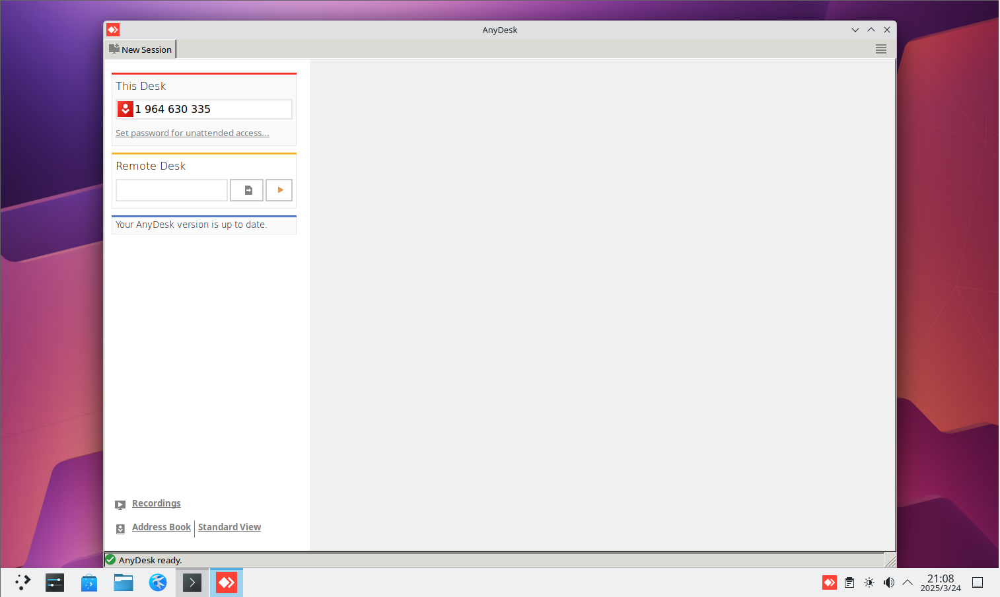

The party being connected must "Accept" to continue the connection.

### Windows Remotely Accessing FreeBSD via AnyDesk

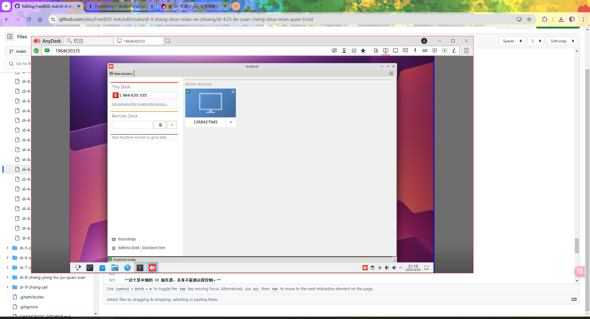

### FreeBSD Remotely Accessing Windows via AnyDesk

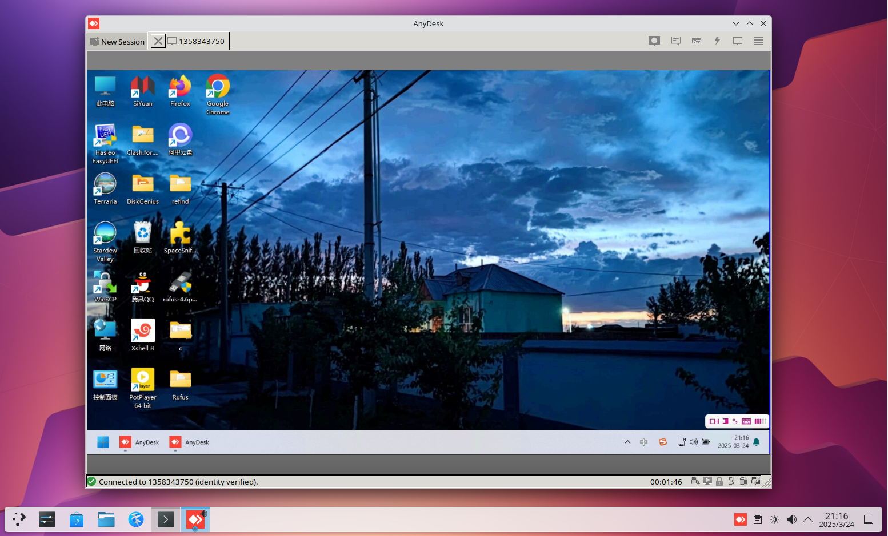

### Troubleshooting and Unresolved Issues

#### Unable to Move the Mouse in Windows When Remotely Connecting from FreeBSD via AnyDesk

To be resolved.

## RustDesk Relay Server

> **Note**
>
> This is a relay ID server and cannot be remotely controlled itself.

RustDesk cannot be used to control FreeBSD.

- Install using pkg:

```sh
# pkg install rustdesk-server
```

Or install using Ports:

```sh
# cd /usr/ports/net/rustdesk-server/
# make install clean
```

Configuring the RustDesk relay server:

Create a dedicated user to run the RustDesk relay service, avoiding running as root:

```sh
# pw useradd rustdesk -s /bin/sh -c "RustDesk Server"
# pw lock rustdesk
```

- Start hbbs:

```sh
# su -m rustdesk -c '/usr/local/bin/hbbs'
[2024-08-10 23:02:13.782550 +08:00] INFO [src/common.rs:122] Private key comes from id_ed25519
[2024-08-10 23:02:13.782587 +08:00] INFO [src/rendezvous_server.rs:1191] Key: mgRwOWJy9Vnz3LqQYjtNHwZQYg73uhdj9iCTMmIyoP4=  #	This is the Key
[2024-08-10 23:02:13.782655 +08:00] INFO [src/peer.rs:84] DB_URL=./db_v2.sqlite3
[2024-08-10 23:02:13.786349 +08:00] INFO [src/rendezvous_server.rs:99] serial=0
[2024-08-10 23:02:13.786381 +08:00] INFO [src/common.rs:46] rendezvous-servers=[]
[2024-08-10 23:02:13.786388 +08:00] INFO [src/rendezvous_server.rs:101] Listening on tcp/udp :21116
[2024-08-10 23:02:13.786391 +08:00] INFO [src/rendezvous_server.rs:102] Listening on tcp :21115, extra port for NAT test
[2024-08-10 23:02:13.786395 +08:00] INFO [src/rendezvous_server.rs:103] Listening on websocket :21118
[2024-08-10 23:02:13.786430 +08:00] INFO [libs/hbb_common/src/udp.rs:35] Receive buf size of udp [::]:21116: Ok(42080)
[2024-08-10 23:02:13.786581 +08:00] INFO [src/rendezvous_server.rs:138] mask: None
[2024-08-10 23:02:13.786594 +08:00] INFO [src/rendezvous_server.rs:139] local-ip: ""
[2024-08-10 23:02:13.786603 +08:00] INFO [src/common.rs:46] relay-servers=[]
[2024-08-10 23:02:13.786703 +08:00] INFO [src/rendezvous_server.rs:153] ALWAYS_USE_RELAY=N
[2024-08-10 23:02:13.786734 +08:00] INFO [src/rendezvous_server.rs:185] Start
[2024-08-10 23:02:13.786793 +08:00] INFO [libs/hbb_common/src/udp.rs:35] Receive buf size of udp [::]:0: Ok(42080)
[2024-08-10 23:09:11.043094 +08:00] INFO [src/peer.rs:102] update_pk 1101115918 [::ffff:192.168.31.90]:37057 b"\x06\xef\x81\xb4\xe2\x9e\xff(\xcb\xd7\x985S\x95)~1O\xe2\xfcu\xeeE\x91\xf1\xf2\xa1\xbe\rk\xcd\xc1" b"\x06\xef\x81\xb4\xe2\x9e\xff(\xcb\xd7\x985S\x95)~1O\xe2\xfcu\xeeE\x91\xf1\xf2\xa1\xbe\rk\xcd\xc1" #	Indicates device connected
^C[2024-08-10 23:10:06.746255 +08:00] INFO [src/common.rs:176] signal interrupt
```

- Then start hbbr:

```sh
# su -m rustdesk -c '/usr/local/bin/hbbr'
[2024-08-10 22:58:26.593397 +08:00] INFO [src/relay_server.rs:61] #blacklist(blacklist.txt): 0
[2024-08-10 22:58:26.593439 +08:00] INFO [src/relay_server.rs:76] #blocklist(blocklist.txt): 0
[2024-08-10 22:58:26.593445 +08:00] INFO [src/relay_server.rs:82] Listening on tcp :21117
[2024-08-10 22:58:26.593449 +08:00] INFO [src/relay_server.rs:84] Listening on websocket :21119
[2024-08-10 22:58:26.593452 +08:00] INFO [src/relay_server.rs:87] Start
[2024-08-10 22:58:26.593546 +08:00] INFO [src/relay_server.rs:105] DOWNGRADE_THRESHOLD: 0.66
[2024-08-10 22:58:26.593556 +08:00] INFO [src/relay_server.rs:115] DOWNGRADE_START_CHECK: 1800s
[2024-08-10 22:58:26.593559 +08:00] INFO [src/relay_server.rs:125] LIMIT_SPEED: 4Mb/s
[2024-08-10 22:58:26.593564 +08:00] INFO [src/relay_server.rs:136] TOTAL_BANDWIDTH: 1024Mb/s
[2024-08-10 22:58:26.593567 +08:00] INFO [src/relay_server.rs:146] SINGLE_BANDWIDTH: 16Mb/s
^C[2024-08-10 23:10:04.393365 +08:00] INFO [src/common.rs:176] signal interrupt
```

Open the RustDesk client on other devices. Both sides need to fill in the same "ID server (FreeBSD IP address or domain name)" and "Key", leaving other fields blank. Enter the ID displayed on the controlled end on the controlling end to connect.

### References

- FreshPorts. rustdesk-server Self hosted RustDesk server[EB/OL]. [2026-03-25]. <https://www.freshports.org/net/rustdesk-server/>. FreshPorts provides RustDesk relay server port details and installation guide.
- Safe Rabbit. Remote control software RustDesk self-hosted server full-platform deployment and usage tutorial[EB/OL]. (2024-02-20)[2026-03-25]. <https://www.cnblogs.com/safe-rabbit/p/18020812>. Blog providing a detailed full-platform deployment and usage tutorial for RustDesk self-hosted relay server.

## Exercises

1. Port more VNC servers to Ports.
2. Adapt for Wayland.
3. The diversity of remote desktop protocols (RDP, VNC, SPICE, X11 Forwarding) reflects different abstraction levels of the graphics stack. Compare the design trade-offs of each protocol in terms of bandwidth efficiency, security, and session persistence, and analyze the technical constraints of FreeBSD as a remote desktop server in protocol selection.
