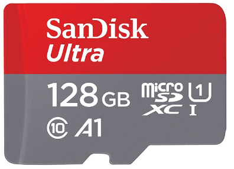
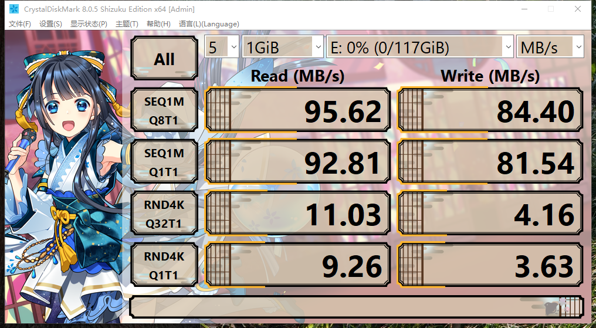
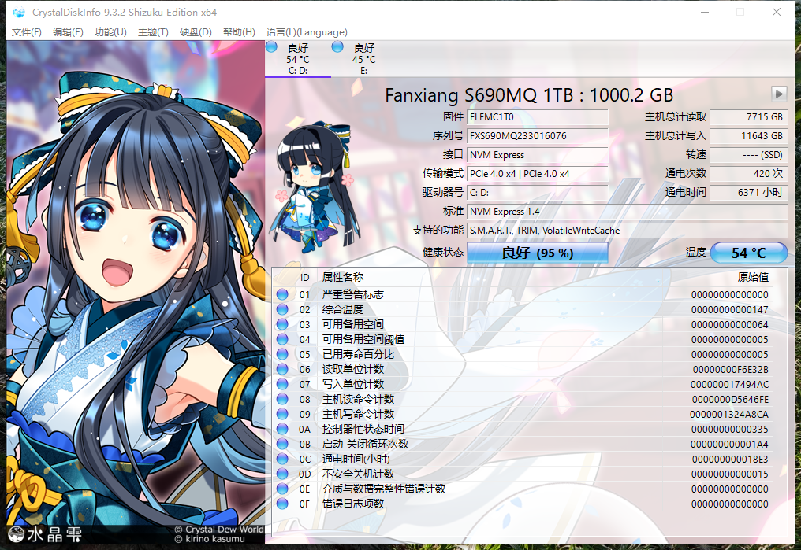
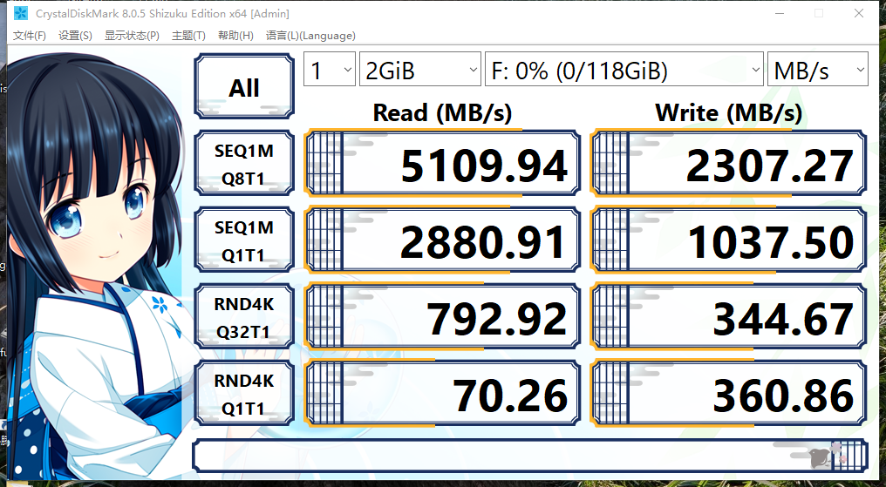
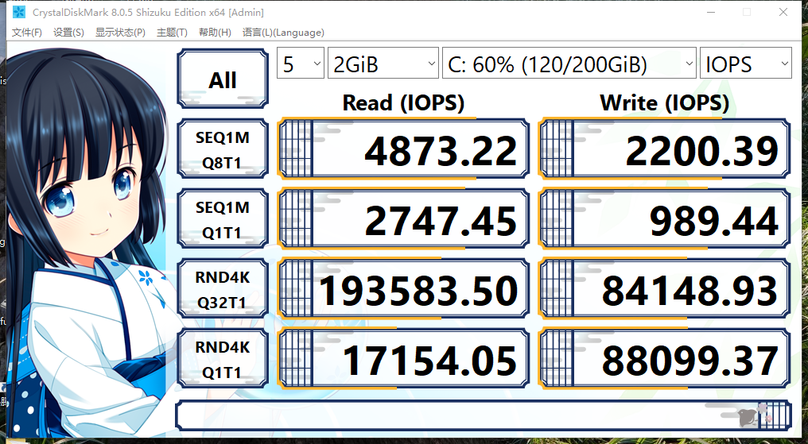
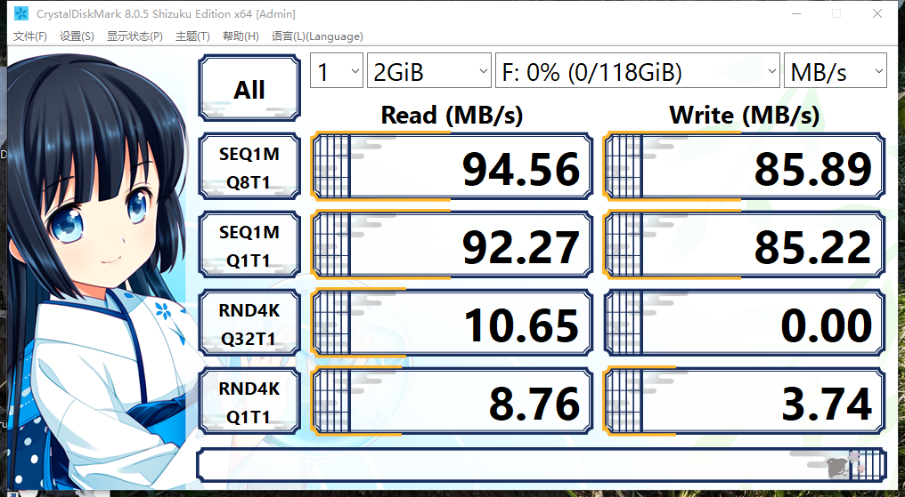
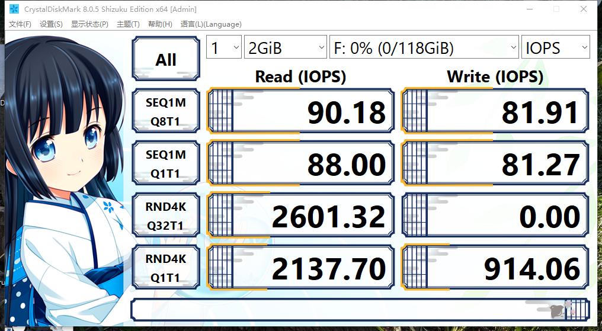

# Introduction to microSD Card Parameters

Storage card specifications are established by the [SD Association](https://www.sdcard.org/).

SD card standards are quite complex, comparable in complexity to the USB standards set by the USB-IF Association.

The reason SD card standards are complex is that as technology advances, the SD Association neither deprecates old standards nor frequently upgrades existing ones (e.g., by incrementing version numbers); instead, it creates new higher-tier standards. Different standards use different speed rating systems (such as Speed Class, UHS Speed Class, Video Speed Class, etc.), with overlap and differences between these systems.

The image shows a microSD (Micro Secure Digital) card, commonly used in devices like Raspberry Pi and mobile phones.

> **Note**
>
> Only the oldest Raspberry Pi models use standard SD cards; standard SD "full-size" cards are currently primarily used in cameras.

microSD is also commonly referred to as a TF card (TF was SanDisk's original product name TransFlash, later adopted by the SD Association and renamed microSD; they are the same physical product), and is often called a mobile phone memory card.

This SanDisk microSD card displays the following information:

| Parameter Label | Meaning |
| --------------- | ------- |
| `SanDisk Ultra` | `SanDisk` is the English brand name; `Ultra` is SanDisk's product model series, typically translated as "至尊高速" (Supreme Speed) |
| `128 GB` | The storage card capacity is 128 GB |
| `C10` (the `10` surrounded by a circular "C" symbol) | This parameter has limited reference value in current products; nearly all storage cards on the market are labeled C10, and products below this rating are now rare |
| `U1` (the `1` surrounded by a circular "U" symbol) | `U1` has a minimum sustained write speed of 10 MB/s, `U3` is 30 MB/s. **There is no U2 rating.** Currently only U1 and U3 exist; typically only older or low-speed products are labeled U1 |
| `microSDXC` | Indicates the card capacity falls within the range of over 32 GB to 2 TB (common market products start from 64 GB); the specification for 4 GB–32 GB is called microSDHC. Other specifications are now extremely rare, including capacities up to 2 GB (microSD) or over 2 TB up to 128 TB (microSDUC). Since the storage card itself clearly states its capacity, this parameter has limited practical reference value when purchasing. The SD Association defines: SD standard as up to 2 GB, SDHC as over 2 GB up to 32 GB, SDXC as over 32 GB up to 2 TB, SDUC as over 2 TB up to 128 TB |
| `1` (located to the right of XC, below U1) | Indicates the use of UHS-I bus, with a theoretical maximum rate of 104 MB/s; UHS-II has a theoretical rate of 312 MB/s. This bus specification determines the theoretical speed ceiling of the storage card |
| `A1` | Indicates the Application Performance Class, primarily reflecting random read/write capability. Currently only A1 and A2 ratings exist; unlabeled means it does not meet A1. The Raspberry Pi officially recommends using A2-rated storage cards |

## Other Parameter Notes

- `667x`, `1066x`: Lexar typically labels cards as 667x or 1066x. This notation originates from the optical drive speed multiplier system and is currently only used in optical disc devices and similar fields, representing a rather old labeling method (originating from the 1980s).

① 667x = 150 KB/s × 667 ≈ 100 MB/s;

② 1066x = 150 KB/s × 1066 ≈ 156 MB/s.

- `V30`: Newer products typically mark `U3` as `V30`. There is no need to deliberately choose V60; such products are more expensive (standard A2 storage cards cost approximately 1 CNY/GB, V60 approximately 3 CNY/GB, and V60 and A2 specifications typically do not coexist). V90-rated microSD cards are currently relatively rare; those below V30 are also relatively rare and are typically labeled as `U1`.

Speed standard correspondence: ***C10 = U1 = V10*** — these three ratings have the same meaning, but are usually labeled simultaneously.

This SanDisk microSD storage card displays 7 parameters, of which 4 have limited practical reference value.

## Storage Card Selection Summary

For Raspberry Pi, the primary considerations are capacity (at least 32 GB recommended), sequential read/write performance (at least V30), and random read/write performance (A2). However, most storage cards on the market use this labeling system. Moreover, except for the Raspberry Pi 5, other devices (such as the Switch) generally cannot reach the bus speeds that SD cards are designed for, **so in practice, when purchasing, you mainly need to focus on the A1 or A2 parameter.**

## Do They Meet the Stated Parameters?

**Expanded-capacity cards are no longer a mainstream issue**

In the past, cheap high-capacity storage cards were often expanded-capacity counterfeits. However, since the Raspberry Pi boot disk creation tool includes a built-in image verification program, such cards cannot pass its validation. If the stated capacity does not match the actual capacity, the image cannot be written. Therefore, this is not a concern for Raspberry Pi usage.

Current storage chip costs have dropped significantly, and expanded-capacity counterfeiting is generally no longer employed. Unless the stated capacity is clearly abnormal (e.g., over 128 GB at an extremely low price), this issue is unlikely to occur.

**Some stated parameters do not match actual test results, and drive disconnection may occur**

**MOVE SPEED**

The MOVE SPEED card's tested speed is even higher than some Samsung products. ~~Is this trading space for time?~~ Some A2 storage cards measure less than 1.5 MB/s in 4K read/write, which goes beyond mere parameter exaggeration.

In actual testing, the MOVE SPEED 128 GB A2 U3 V30 storage card experienced drive disconnection after writing only about 60 GB.

## How to Test Storage Cards and Hard Drives?

You can use `CrystalDiskInfo` to view hard drive S.M.A.R.T. information and basic parameters; you can also use `CrystalDiskMark` to test hard drive and storage card read/write speeds (use a USB 3.0 or higher card reader).

Both programs are developed by the same developer, but the [official website](https://crystalmark.info/en/) contains many advertisements that may cause users to mistakenly download non-official files.

Please download CrystalDiskInfo from **[CrystalDiskInfo SourceForge page](https://sourceforge.net/projects/crystaldiskinfo)**; please download CrystalDiskMark from **[CrystalDiskMark SourceForge page](https://sourceforge.net/projects/crystaldiskmark/files/)**.

Since the final download links still redirect to the above pages, directly visiting the official website is not recommended.

At the time of writing, the downloaded versions were `CrystalDiskInfo9_3_2Shizuku.exe` and `CrystalDiskMark8_0_5Shizuku.exe`. If you do not need the special visual effects, you can choose "CrystalDiskInfo9_3_2.exe" and "CrystalDiskMark8_0_5.exe" instead.

When purchasing solid-state drives, you should not only focus on read/write speeds but also pay attention to the SSD controller, NVMe protocol version, and support status.

Most niche-brand solid-state drives do not support ASPM (Active State Power Management) technology. This technology can reduce SSD temperatures while maintaining operating efficiency; tests have shown that enabling ASPM under certain conditions can lower drive temperatures to some extent.

Some niche-brand SSDs experience drive disconnection when ASPM is enabled due to poor compatibility, so they proactively disable this technology in their firmware. Other niche-brand SSDs have older firmware using lower NVMe protocol versions. There are even cases where multiple drives share the same serial number. A hard drive serial number is as important as a network card's MAC address and should not be duplicated in principle; if duplicated, the system may not correctly identify multiple drives.

### Viewing Fanxiang S690 (1 TB) NVMe SSD PCIe 4.0 Drive Parameters Using CrystalDiskInfo

### Testing Fanxiang S690 (1 TB) NVMe SSD PCIe 4.0 Read/Write Speed Using CrystalDiskMark

### Testing Lexar 1066x A2 U3 128 GB Storage Card Read/Write Speed Using CrystalDiskMark (Using USB 3.0 Card Reader)

The Lexar 1066x A2 U3 128 GB storage card's actual test results show a serious deviation from stated parameters: the A2 rating should achieve random read 4000 IOPS and random write 2000 IOPS, but the measured random read/write performance is only half of the stated values.

### microSD storage cards with stated speeds exceeding 104 MB/s have limited significance in typical usage scenarios

There are two reasons: first, no overclocked card reader is used (i.e., Lexar's bundled card reader, which supports its proprietary protocol); second, the UHS-I protocol has a theoretical speed ceiling of 104 MB/s (SDR104), and no storage card can theoretically exceed this speed unless using UHS-II (two rows of gold contacts). However, microSD rarely uses UHS-II; UHS-II is primarily used for standard-size SD cards (for cameras). While there are a few UHS-II microSD products on the market, such as the ProGrade Digital Catalyst series and Sabrent Rocket series, they are expensive and have limited selection.

Therefore, any product on the market with a stated speed exceeding the UHS-I theoretical limit that is not UHS-II typically achieves this through non-standard protocols. **These non-standard protocols can only be supported by the bundled official card reader (which is expensive and usually sold as a bundle); no other devices support this speed, making it of no practical significance.**

### Testing Samsung BAR Plus USB 3.1 Flash Drive 64 GB Read/Write Speed Using CrystalDiskMark

The metal version.

## References

- Kingston Technology. SD Card and microSD Card Type Guide[EB/OL]. [2026-03-25]. <https://www.kingston.com/cn/blog/personal-storage/microsd-sd-memory-card-guide>. Introduces the specification categories and applicable scenarios of various SD cards.
- Kingston Technology. SD Card and microSD Card Speed Class Guide[EB/OL]. [2026-03-25]. <https://www.kingston.com/cn/blog/personal-storage/memory-card-speed-classes>. Explains the meaning of speed class labels and purchasing guidance.
- Kingston Technology. Understanding SD Card and microSD Card Naming Conventions and Labels[EB/OL]. [2026-03-25]. <https://www.kingston.com/cn/blog/personal-storage/microsd-sd-memory-card-naming-conventions>. Explains the performance parameters represented by each field in storage card product labels.
- odinkuo. Archaeological question in computer fundamentals: what does the multiplier in optical drive speeds refer to[EB/OL]. [2026-03-25]. <https://www.mobile01.com/topicdetail.php?f=300&t=2126605&p=3>. Explains the optical drive speed multiplier concept and its conversion to the original CD transfer rate.
- RC丸钢. MOVE SPEED 64 GB TF (MicroSD) Storage Card Test[EB/OL]. [2026-03-25]. <https://www.bilibili.com/read/mobile?id=21681916>. Actual read/write speed testing and evaluation of the MOVE SPEED brand TF card.
- SilentNocturne. This MOVE SPEED card has exaggerated specs; the speed is only half of what's labeled[EB/OL]. [2026-03-25]. <https://post.smzdm.com/talk/p/az6o8zkr/>. Points out that the MOVE SPEED storage card's measured speed significantly differs from stated values.
- 远航的加菲猫. Mvespeed MOVE SPEED 400G Memory Card Simple Review[EB/OL]. [2026-03-25]. <https://post.smzdm.com/p/arq759g7/>. Actual capacity and performance testing of the large-capacity MOVE SPEED storage card.
- 尼奥叔叔. Does the MOVE SPEED TF card fail? It seems not (with game testing)[EB/OL]. [2026-03-25]. <https://post.smzdm.com/p/awzqn9z4/>. Verifies the actual usage experience of the MOVE SPEED TF card from a game loading perspective.
- Western Digital. SanDisk Extreme Pro Mobile ™ microSDXC™ UHS-I Storage Card: 128GB[EB/OL]. [2026-03-25]. <https://www.westerndigital.com/zh-cn/products/memory-cards/sandisk-extreme-pro-uhs-i-microsd?sku=SDSQXCY-128G-ZN6MA>. See note 8: "Uses patented technology."
- 滕飞et. Can storage cards be overclocked too? Actual test results are very surprising[EB/OL]. [2026-03-25]. <https://mp.weixin.qq.com/s/CMioVrUx0YJbF_v7zvQMRA>. Actual testing found that some storage cards can run beyond their stated speeds under certain conditions.
- Samsung. BAR Plus USB3.1 Flash Drive[EB/OL]. [2026-03-25]. <https://www.samsung.com.cn/memory-storage/usb-flash-drive/usb-3-1-flash-drive-bar-plus-64gb-titanium-gray-muf-64be4-cn/>. Samsung USB 3.1 flash drive product specifications and performance parameters.
- See SD Association. Capacity SD/SDHC/SDXC/SDUC[EB/OL]. [2026-04-16]. <https://www.sdcard.org/developers/sd-standard-overview/capacity-sd-sdhc-sdxc-sduc/>. This page defines SD/SDHC/SDXC/SDUC capacity standards.
- Lexar. Lexar Professional 667x microSDXC UHS-I Product Specifications[EB/OL]. [2026-04-16]. <https://resources.lexar.com/download/236/667x-microsdxc/1963/lexar-productsheet-pro-667x-microsd-en-201911.pdf>. This document is the product specification sheet for the Lexar 667x microSD card. Lexar's official 667x storage card has a stated read speed of 100 MB/s.
- SD Association. SD Specifications[EB/OL]. [2026-04-18]. <https://www.sdcard.org/developers/sd-standard-overview/>. SD card capacity standards and speed class definitions.
- B&H Photo Video. UHS-II microSDXC Memory Cards[EB/OL]. [2026-04-18]. <https://www.bhphotovideo.com/c/buy/micro-sd-cards/ci/39505/cp/13296+3496+23730+39505>. UHS-II microSD products exist.
