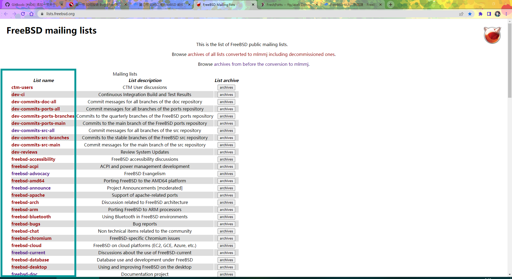
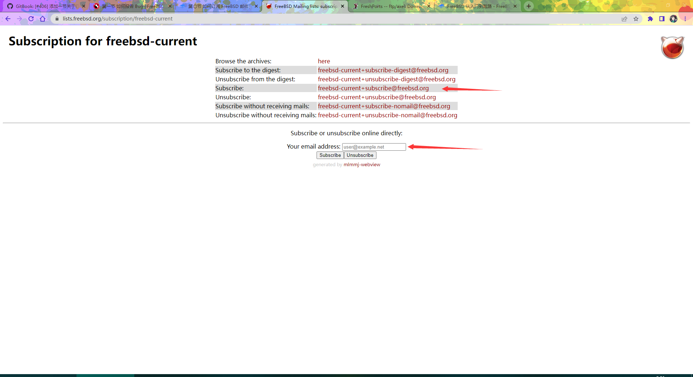

# Subscribing to FreeBSD Mailing Lists

## Overview

FreeBSD mailing lists can be found at [https://lists.freebsd.org/](https://lists.freebsd.org/), which is the primary platform for technical discussion and decision-making communication in the FreeBSD community.

### Mailing List Selection Guide

Different mailing lists have different audiences and discussion topics:

| Mailing List | Purpose |
| ------------ | ------- |
| **freebsd-current** | For discussing topics related to the FreeBSD current development branch (-CURRENT), suitable for users and developers interested in the latest development updates |
| **freebsd-stable** | For discussing topics related to the FreeBSD stable branch (-STABLE) |
| **freebsd-questions** | Suitable for beginners and general users to ask questions |
| **freebsd-doc** | Documentation-related discussions |
| **freebsd-ports** | Ports-related discussions |

It is recommended to subscribe to the appropriate mailing list based on your needs. Users who want a comprehensive understanding of FreeBSD development status may want to prioritize subscribing to freebsd-current.

Subscribing only requires entering your email address; you will then receive a reply email. Follow the instructions in the reply to send an email with any content to the specified address, and you will receive a confirmation message for a successful subscription.

If you want to change from a digest subscription to a full-text subscription, simply resend an email with any content to the corresponding Subscribe email address (e.g., `freebsd-doc+subscribe@freebsd.org` for freebsd-doc).

Emails should be written in English; if you are not proficient, you can use [https://deepl.com](https://deepl.com) for translation. When encountering issues, it is recommended to consult via email first before submitting a bug report to avoid duplicates.

If a reply requests additional information, please respond promptly and wait patiently.

## Illustrated Instructions

Open [https://lists.freebsd.org/](https://lists.freebsd.org/) and find the mailing list you want to subscribe to (using freebsd-current as an example):

Click the red text to enter:

Send an email to the address listed in that row; the email subject has no specific requirements. You will receive a reply email providing another email address; you need to send another email to that address to confirm, again with no specific subject requirements.

After completing the above steps, you will be added to the mailing list. If you do not receive a reply after sending an email, manually send an email to the address shown next to "subscribe"; the email subject and content have no specific requirements.

If you need to test whether your emails can be received, after subscribing following the above steps, send a test email to [freebsd-test](https://lists.freebsd.org/subscription/freebsd-test).

## Rules

This section is quoted from the FreeBSD Handbook.

- If you violate the rules after receiving two written warnings from the administrator (i.e., a third violation), you will be banned from all mailing lists.
- For casual chat, please visit [https://lists.freebsd.org/subscription/freebsd-chat](https://lists.freebsd.org/subscription/freebsd-chat)
- Unless necessary, you should not post to more than two mailing lists.
- Advertising (non-FreeBSD-related content) is strictly prohibited; violators will be immediately banned.
- Use English.
- Personal attacks and insults are strictly prohibited. Respect others' privacy; private emails should not be posted publicly.

## FreeBSD Community Code of Conduct (CoC)

The original text is available at [FreeBSD Community Code of Conduct](https://www.freebsd.org/internal/code-of-conduct/), which aims to establish inclusive and respectful behavioral guidelines for the FreeBSD community.

### FreeBSD Community Code of Conduct (CoC)

The FreeBSD community has always strived to be an inclusive and respectful community, and we hope this will not change as the community grows and evolves. To this end, we ask everyone to follow some basic rules:

- Be friendly and patient;
- Be welcoming;
- Be considerate;
- Be respectful;
- Be careful in the words you choose, and be kind to others;
- When we disagree, try to understand why.

This is not an exhaustive list of prohibited behaviors. Please understand it as a guiding principle aimed at making communication and participation in the community easier.

This code of conduct applies to all venues managed by the FreeBSD project. These venues include online chats, mailing lists, bug trackers, FreeBSD events (such as developer meetings and social gatherings), and other forums created by the project for communication. It applies to all your communications and behavior in these spaces, including emails, chats, speech, slides, videos, posters, signs, and even the T-shirts you wear in these spaces. Additionally, violations of this code of conduct outside these spaces may, in extreme cases, affect someone's ability to participate in the above venues.

If you believe someone is violating the code of conduct, please report it by sending an email to [conduct@FreeBSD.org](mailto:conduct@freebsd.org). For more details, please see our [reporting guidelines](https://www.freebsd.org/internal/conduct-reporting/).

- **Be friendly and patient.**
- **Be welcoming.** We strive to be a community that welcomes and supports people of all backgrounds and identities. This includes, but is not limited to, members of any race, ethnicity, culture, national origin, color, immigration status, social and economic class, educational level, gender, sexual orientation, gender identity and expression, age, body size, family status, political belief, religion, and mental and physical ability.
- **Be considerate.** Your work will be used by others, and you will rely on the work of others. Any decisions you make will affect users and colleagues, and you should consider those consequences. Remember that we are a global community, so you may not be communicating with others in their native language.
- **Be respectful.** We do not always agree, but disagreement is no excuse for poor behavior. We may feel frustrated, but we cannot let frustration turn into personal attacks. Remember, a community where people feel uncomfortable or threatened is not a productive community. FreeBSD community members should be respectful when dealing with other members and with people outside the FreeBSD community.
- **Be careful in the words you choose, and be kind to others.** Do not insult or demean other participants. Harassment and other exclusionary behavior are unacceptable. This includes, but is not limited to:
  - Violent threats or language directed against others.
  - Discriminatory jokes and language.
  - Posting sexually explicit or violent material.
  - Posting (or threatening to post) others' personally identifying information ("doxing").
  - Personal insults, especially those using racist or sexist terms.
  - Unwelcome sexual attention.
  - Advocating or encouraging any of the above behavior.
- **In general, if someone asks you to stop, then stop.** Continuing after being asked to stop is considered harassment.
- **When we disagree, try to understand why.** Social and technical disagreements happen all the time, and FreeBSD is no exception. It is important to resolve disagreements and differing views constructively. Remember that we are all different. FreeBSD's strength comes from its diverse community, with members from various backgrounds. Different people have different perspectives on issues. Not understanding why someone holds a particular view does not mean they are wrong. Don't forget that making mistakes is human; blaming each other is unhelpful. Focus on helping to resolve the problem and learning from mistakes.

#### Questions?

If you have any questions, please feel free to contact the FreeBSD Code of Conduct Committee via email at [conduct@FreeBSD.org](mailto:conduct@freebsd.org).

## Exercises

1. Browse the FreeBSD mailing list archives, select a technical discussion topic, trace its discussion history, and analyze the decision-making process.
2. Compare the FreeBSD mailing list code of conduct with other open-source projects' codes of conduct, and analyze the differences in community governance models and their causes.
3. Simulate a technical problem scenario, write a question email that conforms to the mailing list guidelines, and plan a follow-up strategy.
