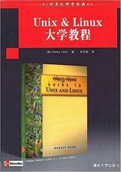
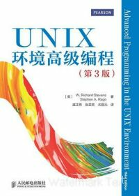
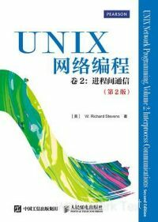
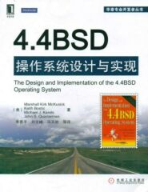
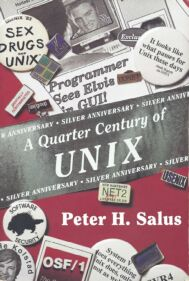
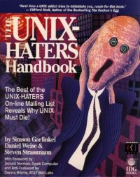
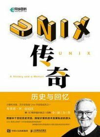
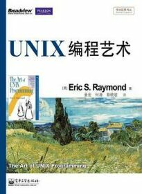
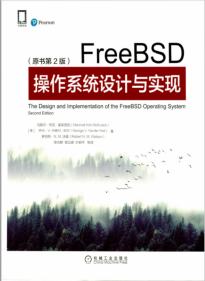

# Bibliography

This appendix lists reference books in fields such as command-line fundamentals, UNIX kernel principles, FreeBSD technical systems, and network protocols.

Some books are available through Chinese digital reading platforms, including [WeRead](https://weread.qq.com/), [QQ Reading](https://book.qq.com/), and [JD Reading](https://cread.jd.com/custom/custom_pcDownload.action). These platforms offer digital versions of technical books.

Some books are out of print and can be obtained through specialized second-hand book trading platforms such as [Duozhuayu](https://www.duozhuayu.com/) and [Kongfz](https://www.kongfz.com/).

## Main Reference Books

### Command-Line Fundamentals

This section introduces foundational and advanced books for learning the command line, suitable for readers at different levels.

| Cover/Title | Author/Translator | ISBN/Publisher | Description |
| ----------- | ----------------- | -------------- | ----------- |
|     *Harley Hahn's Guide to Unix and Linux* (Chinese Edition) | [US] Harley Hahn    Translated by Zhang Jieliang | 978-7-302-20956-0    Tsinghua University Press | A foundational tutorial on command-line operations and Shell programming, covering basic command usage and script writing for Unix/Linux systems |
|     *UNIX and Linux System Administration Handbook* (5th Edition, Chinese Edition) | [US] Evi Nemeth, Garth Snyder, Trent R. Hein, Ben Whaley, Dan Mackin et al.    Translated by Men Jia | 978-7-115-53276-3    Posts & Telecom Press | A system administration technical handbook covering core technologies for UNIX/Linux system operations, including user management, file systems, network configuration, and more |

### UNIX Fundamentals

This section includes core technical books on the UNIX operating system, covering key areas such as programming interfaces, network communication, and kernel implementation.

| Cover/Title | Author/Translator | ISBN/Publisher | Description |
| ----------- | ----------------- | -------------- | ----------- |
|     *Advanced Programming in the UNIX Environment* (3rd Edition, Chinese Edition) | [US] W. Richard Stevens, Stephen A. Rago et al.  Translated by Zhang Yifeng, Ma Shuchao et al. | 978-7-121-47833-8    Publishing House of Electronics Industry | A UNIX systems programming book, providing detailed explanations of programming interfaces including system calls, file I/O, and process control |
|     *UNIX Network Programming, Volume 1: The Sockets Networking API* (3rd Edition, Chinese Edition) | [US] W. Richard Stevens, Bill Fenner, Andrew M. Rudoff et al. | 978-7-115-51779-1    Posts & Telecom Press | A network programming book providing systematic coverage of the Sockets API, TCP/IP protocol stack implementation, and other network programming technologies |
|     *UNIX Network Programming, Volume 2: Interprocess Communications* (2nd Edition, Chinese Edition) | [US] W. Richard Stevens | 978-7-115-51780-7    Posts & Telecom Press | A book on interprocess communication technologies, providing detailed explanations of IPC mechanisms including pipes, message queues, shared memory, and semaphores |
|     *UNIX Internals: The New Frontiers* (Chinese Edition) | [US] Uresh Vahalia  Translated by Li Yu, Xue Lei, Huang Qingxin et al. | 978-7-111-49145-3    China Machine Press | A UNIX kernel technology book explaining kernel design principles including process management, memory management, and file systems |
|     *The Design and Implementation of the 4.4BSD Operating System* (Chinese Edition) | [US] Marshall Kirk McKusick et al.   Translated by Li Shanping, Liu Wenfeng, Ma Tianchi et al. | 978-7-111-36647-8    China Machine Press | A technical book on the 4.4BSD operating system, explaining the design and implementation details of BSD systems |

### Open Source and Free Software Movement

This section introduces the historical background and core literature of the open source and free software movement, helping readers understand the related culture and philosophy.

| Cover/Title | Author/Translator | ISBN/Publisher | Description |
| ----------- | ----------------- | -------------- | ----------- |
|     *A Quarter Century of UNIX* | Peter H. Salus | 978-0-201-54777-1    Addison-Wesley Professional | A UNIX history book that documents in detail the technical evolution of Unix from its inception to widespread adoption |
|     *The UNIX-HATERS Handbook* | Simson Garfinkel, Daniel Weise, Steven Strassmann | 978-1-56884-203-5    IDG Books Worldwide, Inc. | A Unix criticism book that analyzes the design flaws and technical limitations of Unix systems from a critical perspective |
|     *The Cathedral & the Bazaar* (Chinese Edition) | [US] Eric S. Raymond    Translated by Wei Jianfan | 978-7-111-45247-8    China Machine Press | A book on the history of the open source movement, explaining the differences between centralized and distributed software development models |
|     *UNIX: A History and Memoir* (Chinese Edition) | [US] Brian W. Kernighan    Translated by Han Lei | 978-7-115-55717-9    Posts & Telecom Press | A UNIX history book documenting the key milestones and historical context of Unix technical development |

The following books elaborate on UNIX's design philosophy, helping readers understand its software engineering thinking and technical philosophy.

| Cover/Title | Author/Translator | ISBN/Publisher | Description |
| ----------- | ----------------- | -------------- | ----------- |
|     *The Art of UNIX Programming* (TAOUP, Chinese Edition) | [US] Eric Raymond    Translated by Jiang Hong, He Yuan, Cai Xiaojun et al. | 978-7-121-17665-4    Publishing House of Electronics Industry | A book on UNIX system design philosophy, elaborating on software engineering thinking and technical philosophy |

*The Art of UNIX Programming* systematically elaborates on UNIX's design approach and software engineering theory, covering design principles and practical methods for Unix-like systems. The book emphasizes engineering practice, and most of the design principles described originate from specific historical contexts.

### FreeBSD Fundamentals

This section includes core technical books on the FreeBSD operating system, covering basic introductions, device driver development, and kernel design.

| Cover/Title | Author/Translator | ISBN/Publisher | Description |
| ----------- | ----------------- | -------------- | ----------- |
|     *FreeBSD Unleashed* (Chinese Edition) | [US] Michael Urban, Brian Tiemann et al.    Translated by Wisdom East Studio | 978-7-111-10201-4    China Machine Press | A FreeBSD technical book published in 2002, systematically explaining FreeBSD system architecture and core components. Some content, such as the system architecture overview, still retains reference value and is suitable for understanding the development trajectory of FreeBSD |
|     *FreeBSD Device Drivers: A Guide for the Intrepid* (Chinese Edition) | [CA] Joseph Kong    Translated by Chen Yidong | 978-7-111-41157-4    China Machine Press | A FreeBSD driver development book, providing detailed explanations of kernel module programming, device driver architecture, and driver development techniques |

The following are authoritative works on FreeBSD kernel design, with in-depth and specialized content providing core technical references for advanced researchers.

| Cover/Title | Author/Translator | ISBN/Publisher | Description |
| ----------- | ----------------- | -------------- | ----------- |
|     *The Design and Implementation of the FreeBSD Operating System* (2nd Edition, Chinese Edition) | [US] Marshall McKusick, George V. Neville-Neil, Robert N.M. Watson et al.    Translated by Chen Xiangqun, Guo Lifeng, Ye Shunping et al. | 978-7-111-68997-3    China Machine Press | An authoritative work on FreeBSD kernel design, providing detailed explanations of modern FreeBSD kernel architecture and implementation details |

Some chapters of this book need to be downloaded from the [web](https://course.cmpreading.com/web/refbook/detail/9661/215).

This book is an advanced technical monograph; readers should have a foundation in operating system theory before reading.

The primary author McKusick M K provides several BSD-related recorded courses on his website; see McKusick M K. BSD related courses[EB/OL]. [2026-03-26]. <https://www.mckusick.com/buylist.html>. A third edition is currently being written (to be published by No Starch Press); for related information, see McKusick M K. The History of the BSD Daemon: BSDCan 2025[EB/OL]. [2026-04-18]. <https://www.bsdcan.org/2025/talks/daemon.pdf>.

### IPv6 Network Stack

The following books provide line-by-line analysis of the design and implementation of the FreeBSD IPv6 network stack (KAME project). They are in-depth technical monographs in the field of network protocols, suitable for readers who wish to study network protocols systematically.

- Li Q, Jinmei T, Shima K. IPv6 Explained: Volume 1, Core Protocol Implementation[M]. Translated by Chen Juan, Zhao Zhenping. Beijing: Posts & Telecom Press, 2009: 846. ISBN: 978-7-115-18950-9 (English reprint ISBN: 978-7-115-19551-7). A detailed explanation of IPv6 core protocol implementation based on analysis of the FreeBSD KAME project code. English original: *IPv6 Core Protocols Implementation* (Morgan Kaufmann, 2007).
- Li Q, Jinmei T, Shima K. IPv6 Explained: Volume 2, Advanced Protocol Implementation[M]. Translated by Wang Jiazhen et al. Beijing: Posts & Telecom Press, 2009: 869. ISBN: 978-7-115-20891-0 (English reprint ISBN: 978-7-115-19519-7). A detailed explanation of IPv6 advanced protocols and extension mechanisms, including key technologies such as Mobile IPv6. English original: *IPv6 Advanced Protocols Implementation* (Morgan Kaufmann, 2007).

### ZFS

This section introduces reference literature related to the ZFS file system, helping readers master this storage technology.

| Cover/Title | Author/Translator | ISBN/Publisher | Description |
| ----------- | ----------------- | -------------- | ----------- |
| *Oracle® Solaris ZFS Administration Guide* | Oracle | Document number 819-7065-17 (Version [Oracle Solaris 10 8/11](https://docs.oracle.com/cd/E24847_01/), 2011) | [Read online](https://docs.oracle.com/cd/E24847_01/html/819-7065/index.html), [PDF](https://docs.oracle.com/cd/E24847_01/pdf/819-7065.pdf). ZFS administration technical document, detailing Solaris ZFS architecture and management operations. Note ZFS storage pool version compatibility limitations |

### DTrace and System Tuning

This section includes reference literature related to system performance tuning and dynamic tracing, helping readers master system debugging and performance optimization techniques.

| Cover/Title | Author/Translator | ISBN/Publisher | Description |
| ----------- | ----------------- | -------------- | ----------- |
|     *Solaris Performance and Tools* (Chinese Edition) | [US] Richard McDougall, Jim Mauro, Brendan Gregg et al.    Translated by Sun China Engineering and Research Institute | 978-7-111-21403-8    China Machine Press | Introduces common performance monitoring tools and DTrace usage. This book is based on Solaris 10 but is also applicable to FreeBSD. An authoritative guide to system performance tuning, detailing performance analysis tools and DTrace dynamic tracing technology |

| Cover/Title | Author/Translator | ISBN/Publisher | Description |
| ----------- | ----------------- | -------------- | ----------- |
| *DTrace User Guide* | Oracle | Document number 819-5488-10 (Version [Oracle Solaris 10](https://docs.oracle.com/cd/E18752_01/html/819-5488/), 2006) | [Read online](https://docs.oracle.com/cd/E18752_01/html/819-5488/), [PDF](https://docs.oracle.com/cd/E18752_01/pdf/819-5488.pdf). A beginner's technical document on DTrace, explaining the basic concepts and usage of the dynamic tracing framework |
| *Solaris Dynamic Tracing Guide* | Oracle | Document number 819-6959-10 (Version [Oracle Solaris 10 8/11](https://docs.oracle.com/cd/E24847_01/), 2011) | [Read online](https://download.oracle.com/docs/cd/E19253-01/819-6959/index.html), [PDF](https://download.oracle.com/docs/cd/E19253-01/819-6959/819-6959.pdf). An advanced technical document on DTrace, explaining advanced techniques and performance analysis methods for the dynamic tracing framework |

## Literature Review and Historical Documents

### FreeBSD Mastery Series

This series is written by Michael W. Lucas, covering multiple technical areas of FreeBSD, including:

- *FreeBSD Mastery: Storage Essentials*
- *FreeBSD Mastery: Specialty Filesystems*
- *FreeBSD Mastery: ZFS*
- *FreeBSD Mastery: Advanced ZFS*
- *FreeBSD Mastery: Jails*

The books in this series focus on basic operations and were published earlier; some technical content has become outdated with FreeBSD version iterations, but they still retain reference value as FreeBSD historical documents.

### *Absolute FreeBSD, 3rd Edition: The Complete Guide to FreeBSD*

| Cover/Title | Author | ISBN/Publisher |
| ----------- | ------ | -------------- |
|     ***Absolute FreeBSD, 3rd Edition: The Complete Guide to FreeBSD*** | Michael W. Lucas | 978-1-59327-892-2    No Starch Press |

The predecessor of the *Absolute FreeBSD* series, *Absolute BSD: The Ultimate Guide to FreeBSD* (ISBN 1-886411-74-3), was first published in 2002. From the second edition onward, it was renamed *Absolute FreeBSD*, with the third edition published in 2018. As a comprehensive introductory guide to FreeBSD, the book covers topics such as system installation, configuration management, and basic operations. See: Lucas M W. Absolute BSD: The Ultimate Guide to FreeBSD[M]. San Francisco: No Starch Press, 2002. ISBN: 1-886411-74-3.

### *Lions' Commentary on UNIX 6th Edition with Source Code*

Lions J. Lions' Commentary on UNIX 6th Edition with Source Code[M]. Translated by You Jinyuan. Beijing: China Machine Press, 2000. ISBN: 978-7-111-08018-3. A core document for early UNIX education, an annotated compilation of UNIX v6 source code.

The original work is titled *Lions' Commentary on UNIX 6th Edition with Source Code*, written by Lions J. It was originally used as course lecture notes at the University of New South Wales in Australia and is a core document in early UNIX education. The history of this book's Chinese translation is historically significant, reflecting the Chinese open source community's appreciation for classic technical literature (see: China Reading Weekly. "Underground Publications" Surface[N/OL]. (2000-08-02)[2026-03-26]. <https://www.gmw.cn/01ds/2000-08/02/GB/2000%5E311%5E0%5EDS1418.htm>).

In terms of academic literature classification, this book is closer to an "annotated source code compilation" than a systematic theoretical analysis. Its value lies in providing the original text of early UNIX implementations. With technological evolution, its direct technical reference value has transformed into historical research value.

### Early Chinese FreeBSD Literature (2000s)

- Wang Bo. FreeBSD Complete Guide[M]. Beijing: China Machine Press, 1999. ISBN: 978-7-111-07482-3. One of the earliest Chinese introductory books on FreeBSD in China, published in 1999. The author Wang Bo was an important promoter of the early FreeBSD Chinese community.
- Wang Bo. FreeBSD Complete Guide[M]. 2nd Edition. Beijing: China Machine Press, 2002. ISBN: 978-7-111-10286-1. A revised edition of the Chinese introductory book on FreeBSD, with updated technical content and distribution in Taiwan.
- Feng Baokun, Chen Zihong. FreeBSD Complete Strategy[M]. Beijing: China Materials Press; Beijing: Beijing Hope Electronic Press, 2004. ISBN: 978-7-5047-2160-0. Early Chinese introductory literature on FreeBSD.

These books reflect the early exploration of the FreeBSD operating system in the Chinese-speaking world at the beginning of the 21st century and hold historical research value. Due to rapid technological iteration, most of the specific technical content in these books is now outdated.
