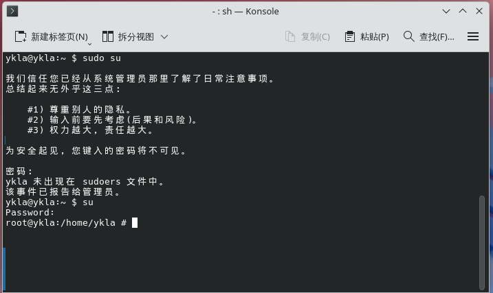

# To the Reader: Emancipate the Mind, Return to Authenticity, Uphold Humanism, and Reject the False Path of Suffering Philosophy

For most readers, understanding the full text may be difficult, or even impossible. "He who fights with monsters should look to it that he himself does not become a monster. And if you gaze long into an abyss, the abyss also gazes into you." Therefore, reading this text itself may be an experience of the "philosophy of suffering." If readers encounter obstacles while reading, they should feel free to skip the relevant paragraphs or even the entire text, and go directly to the content they need.

## You Are Not Alone

Two classic questions are:

1. "How on earth do you exit Vi?"


At first glance, the Vi interface provides no operation hints or help information.

As a text editor belonging to the same category as Notepad, Vi is not intuitive for beginners when it comes to saving and exiting, and its editing operations are also more complex.

> **Thought Question**
>
> Are we discussing Vi, Nvi, Vim, or Neovim? In distributions, they may all be linked to the vi command. For the aforementioned distributions, does Vi truly exist? When we discuss "Vi" being difficult to use, what exactly are we talking about?

> **Thought Question**
>
> Trace the history and analyze why Vi/Vim requires first pressing ESC, then typing the English colon : and the letter q (add an English exclamation mark ! for forced quit), and finally pressing Enter to quit without saving. How should we understand this technical debt, and who should bear the cost of its historical design?

> **Thought Question**
>
>> Some people compare Vi/Vim to other editors as the difference between an F1 racing car and a family sedan. Others compare Vi/Vim to other editors as the difference between the "Wubi input method" and the "Pinyin input method."
>
> Please consider whether there is a fundamental difference between the two analogies above?
>
>> If something expects more people to use it and be accepted by the general public, rather than being complacent and self-proclaiming itself as an "F1 racing car" or "elite academic forum" or something similar, then it must make trade-offs between functionality and user-friendliness, and this "degradation" is almost inevitable, because it will pull it down to the average level of the general public, whether in cognition or other aspects. Even professional software that has always been used only by industry insiders is constantly challenged by more mass-market versions with better user experiences.
>
>> Even F1 racing cars have tension between speed and safety (such as the HALO system)—is this not also a kind of user-friendly design? Some people call F1 racing cars "manual transmission," but this is actually a major misconception. F1 racing cars have used semi-automatic sequential gearboxes (paddle shift) since 1989—neither traditional manual nor automatic, but an electro-hydraulic semi-automatic shifting system controlled by the driver through paddles on the steering wheel. F1 historically used manual transmissions, gradually transitioning after Ferrari first introduced the semi-automatic gearbox in 1989, with the last manual F1 car exiting the sport in 1995. An obvious fact is that both purely manual and purely automatic transmissions would affect the fairness and spectacle of F1. If considering speed alone, then autonomous driving technology would undoubtedly be the best path. But this would in effect cancel the race, or turn it into a remote-controlled car competition. Therefore, the question is never why F1 isn't automatic—this is a pseudo-question and a fabricated imagination. It can also be seen that the FIA always prioritizes spectacle over simply pursuing the best speed and results. Therefore, F1 and other traditional sports competitions have a tension: they must consider user-friendliness and regard it as a decisive factor, reflected not only in audience acceptance but also in the fact that the risks of competition itself are far higher than other sports. If user-friendliness is not considered as the top priority, then the audience will inevitably reject this form of competition, and the entire event will naturally be eliminated by the market. In this sense, Red Bull Austria's sponsorship of extreme sports is likewise to gain this market dominance by sacrificing a degree of safety—or perhaps providing no safety at all. In such competitions, the user-friendliness of participants is alienated into the user-friendliness of spectators. Bystanders always expect more extreme competitions. User-friendliness will not be eliminated; it will only be transferred by capital. From this, a controversial judgment can be drawn: certain highly commercialized events are not centered on the development of human subjectivity, but rather emphasize capital-driven operations. If one analyzes only from the sport itself, one falls into a packaged trap. Such competitions are inhumane. A simple truth is that whatever the audience loves to watch should be the direction of development; otherwise, the rationality of its own existence will be completely lost. Everything prioritizes capitalization and efficiency.
>
>> To develop sports, sports must be abolished. The authenticity and competitiveness of sports are in tension—if you believe that certain "enhanced sports" relying on hormones and other human enhancements violate authenticity, then they do indeed improve competitiveness, and this is unrelated to ethical orientation; it is the blind, inevitable pursuit of professional sports. Traditional sports emphasize the educational function of competition, believing it can drive mass participation in sports and fitness. Practice has now proven that this view has limitations, creating a distorted situation that overemphasizes rankings and honors while neglecting the essence of sports. You can certainly screen out exceptionally outstanding athletes, but this may not have genuine significance for humanity's sports endeavors—sports may become a political sacrifice. It will only cause the nation's sports resources to be highly concentrated on a few individuals. You must admit that this is actually a kind of exhibition match; the fairness and justice of professional sports are hypocritical—merely more hidden than under the amateur principle. Everyone's free time, physical fitness, available facilities, and physical education received are different, and the differences are enormous. The professionalization of sports will always mean that only a small number of top athletes enjoy highly concentrated resources and capital. This is unfair to everyone, including themselves and the audience. The so-called "National Games" are clearly games for professional athletes—a professional level evaluation conference for professional athletes. Under such circumstances, whether it is appropriate to call them "National Games" is open to debate.
>
>> Sportsmanship is not something metaphysical; it is essentially a material force that develops people. And the current specialized, professionalized, and nationalized athletes are the ones who truly violate sportsmanship. Shifting sports to be off-field-centric is true mass sports, true promotion of the Olympic spirit. The current problem is that off-field people have become spectators rather than participants, and they lack the free time to become participants—watching competitions makes them nothing but unpaid, alienated non-competitors, and spectators are even ridiculed that "the spectator's name will never appear on the scoreboard." They fail to realize that without spectators, their competition itself cannot exist. They don't realize that without spectators, even the scoreboard wouldn't exist, and the competition itself would be canceled. They further fail to realize that regardless of whether spectators are formally present or not, spectators are an indispensable part of the competition—a competition can do without athletes, can do without referees, but spectators are necessary. Holding the view that spectators are bystanders rather than participants is incomprehensible.
>
>> If you truly believe that user-friendliness is secondary, and that your so-called professionalism = complexity = difficulty = steep learning curve, then you should support the "Enhanced Games." Because no matter how you look at it, "Faster, Higher, Stronger—Together" undoubtedly leads to such "Enhanced Games." When the Olympics opposed professional athletes (pure amateur principle) before 1988, what exactly was Coubertin opposing? Professional athletes should be abolished. This violates the true Olympic spirit, which was originally meant to give ordinary people healthy bodies and minds, and to promote world unity through sports—"Together"—but now it has become a carnival for a small group of people, which in turn alienates and insults the masses. Claiming to explore human limits is also a pseudo-proposition; that is a matter of biology. Moreover, most competitions themselves prohibit human enhancement technology. This is completely contrary to the spirit of sports. Sports themselves are about encouraging everyone to exercise and participate, not about watching others. And the reality is that examples of being inspired to participate by watching others are exceedingly rare. Having some people spend a long time on the sport itself to achieve better results, rather than developing the sport itself, is a form of alienation. They don't even study the rules, and only rise up when they suffer losses—and after so much development, they have little voice. Besides becoming exhibition matches and political tools, what is the actual use?
>
>> This is as debatable as e-sports. A row of five people in an internet café that still charges admission, going to watch a projector on site? A group of people watching them play games outdoors? Whether it's real or fixed is unknown. Is every notarization they get genuinely a real match? Everyone wants to be first—is this possible? And as long as you're not first, it absolutely equals losing everything. The meaning of sports competition is unclear. And what is the essential difference between watching people play and watching an AI of the same level play? From the earliest football, ping-pong diplomacy, women's volleyball, to even the promotion of baseball for all. In some countries where the commercial potential of sports has yet to be discovered, the historical development of sports has been almost entirely unrelated to the development of sports itself; its direction and resource allocation were previously determined entirely by political goals, with the value of commercial and mass sports marginalized, ultimately leading to sports alienation and resource waste. And we note that the commercialization of sports not only cannot reverse this alienation, but will intensify it. Therefore, the abolition of sports is inevitable, reasonable, and consistent with history and reality.
>
> How do you view this phenomenon? And why is "degradation" inevitable? When we use analogies, do we truly understand the objects being compared (some people mistakenly think F1 racing cars are manual transmission, considering only speed and not user-friendliness)? Is the amateur principle hypocritical or realistic? Is there an essential difference?

>> User-friendliness is also reflected in "foolproofing" or "fail-safe" design—whether in mechanical factories, nuclear power plants, processing plants, construction sites, military facilities, shield tunneling machine sites, high-speed rail locomotives, or underground vaults/cold storage, you will find that this kind of user-friendliness is not an abstract concept, nor is it merely about pleasing users:
>>
>> - Most cutting machines in mechanical factories require both hands to press two separate buttons simultaneously to start, and they detect whether real hands are pressing them, not other heavy objects.
>> - Most operations at nuclear power plants require confirmation and verification by different personnel.
>> - In processing plants, some areas require gloves, while others strictly prohibit gloves.
>> - Military facilities also have designs similar to mechanical engineering.
>> - Shield tunneling machines are generally buried on site after construction is completed, and their very existence is a form of user-friendliness.
>> - High-speed rail locomotives require drivers to step on a pedal within specific time intervals, and they must call out and point at signals.
>> - Underground vaults/cold storage all detect intrusion and prevent people from being accidentally locked inside, with internal telephones, cotton blankets, fire axes, and other items available.
>
> Can you provide more examples yourself? Inductive reasoning does not possess universal necessity. We need to further explore the rationality of user-friendliness in various fields through deductive argumentation—this task is left for readers to complete on their own.

> **Thought Question**
>
> Readers should now find at least one place in this book where the argumentative logic is inconsistent, and submit a PR on GitHub to make the correction.

2. "Why can't I ever enter my password?"



Because the password input area on the screen remains blank—not even **** style masking characters are displayed, i.e., there is no visual feedback at all. This is by design.

The prompt "Password is invisible" is not semantically clear enough.

In fact, as early as 2009, the commonly used privilege escalation tool sudo already provided the pwfeedback option (introduced with sudo 1.7.1), but very few distributions enable this option by default, and its related code has been reported to have multiple CVE vulnerabilities.

> **Thought Question**
>
> One reason most distributions tend not to use pwfeedback is that its related code may introduce more security vulnerabilities. Is this sudo trapping us in a quagmire of debate about balancing security and convenience, or is there a fundamental design problem with sudo itself? Understanding those alternative implementations ([sudo-rs](https://github.com/trifectatechfoundation/sudo-rs), [doas](https://man.openbsd.org/doas)), can you implement pwfeedback for these tools while ensuring security? If it can never be achieved under the existing security model, what do you think we can still do?

Many people frequently mistype or confuse commands, parameters, and options, but this is not the reader's fault.

In the current era, some academicians of the Chinese Academy of Sciences still need to learn how to use computers and mobile phones, and may find operations inconvenient. You might think this is a design problem, but how do you explain that the same age group (the elderly) can proficiently operate short video applications? Does this suggest, to some extent, that short video software is more user-friendly in terms of user experience design?

Many commands are either constrained by historical conditions or limited by the capabilities of their developers and maintainers, resulting in inconsistent designs that are neither easy to remember nor convenient to use. From a historical perspective, the designs of the aforementioned commands may have been the "optimal solution" at the time. The common household door locks we see only require the correct password fragment within the input to unlock. Yet some prompts in today's operating systems still violate the principle of least astonishment (users should not bear the consequences of poor design).

> **Thought Question**
>
> Is this assessment fair, or is it "hindsight bias"? What do you think?

Consulting the manual pages reveals a dedicated "BUGS" section that describes the current defects of the software.

Based on the author's personal experience, if an open-source software has almost no bugs that severely affect usage, it often does not match people's typical impression of a large open-source project. Because there are too many bugs, or the reality is bewildering, and they lack the economic motivation for repairs, most maintainers are powerless to do anything. The vast majority of open-source software with millions or even tens of millions of users has maintainers who have never received any financial compensation or significant reputation from it.

> **Thought Question**
>
> The reality we often face is that maintainers act arbitrarily, rejecting or opposing your pull requests (PRs). Persuading them is nearly impossible, and forking is not feasible. In this situation, the problem seems unsolvable.

> **Thought Question**
>
> Should those large companies provide financial support for open-source software out of moral obligation, rather than gradually controlling its development direction solely through code contributions?

Please trust the author—you are not the only one who finds these things difficult to use, or even wants to smash your keyboard. This is also one of the reasons people keep "reinventing the wheel" (implementing a tool from scratch). If you find GCC difficult to use, you can switch to Clang/LLVM. You are certainly not the first person to find GCC hard to use, nor will you be the last.

Many people emphasize the importance of the command line and look down on users of IDEs and other graphical user interface software with an arrogant attitude—this is truly unnecessary. Many people deliberately play devil's advocate, emphasizing the so-called advantages of these tools. This view sometimes exhibits an excessive rationalization of high usage costs, which can be seen as a manifestation of the "philosophy of suffering." The essence of Unix philosophy is not about adhering to immutable established norms, but about emphasizing people-orientedness. This is precisely why, in the first quarter of the 21st century, we still need to emphasize the significance of Unix philosophy. Many people, influenced by the philosophy of suffering, focus solely on tracing things back to their roots while neglecting the fundamental principle that technology should serve people. "Man is a thinking reed"—we are not subjects who can only passively accept without changing; we have the responsibility and obligation to transform this world and improve unreasonable designs, rather than forcing people to endure a set of imperfect design principles. In the face of deficient designs, we need to objectively point out: "This software indeed has design problems—it's not your fault." We can keep trying to change all of this, expressing our stance through submitting patches and feedback.

A very classic view holds: "One must fully master certain command-line tools or traditional compilation environments in order to thoroughly understand the UNIX operating system." One of these tools is Vim. Today, debating the merits of graphical interfaces versus command lines actually causes us to miss the point, ultimately yielding the banal and seemingly rational conclusion that each has its use in different environments. What the author truly questions is a kind of meritocracy (whose core view is social Darwinism akin to "the capable rise, the incompetent fall"): that everything command-line must be difficult to use, that all options must be memorized, that mastery requires taking this path, and that users who prefer graphical interfaces and desktops should be looked down upon. Whether it is Christianity's transcendent love for all people and love for God, Confucianism's graded love, or Mohism's universal impartial caring—all teach us that doing so for so long has been of no benefit. Computers should serve humanity, not discipline humanity. Ultimately, the majority should not be alienated by the hacker culture of an extremely small group. In the past, most people had difficulty accessing computers and could not receive good education—this essentially formed a concentration of discourse power, and is also a manifestation of cultural insecurity and "calcium deficiency." Wherever the circle is smaller, this phenomenon of discourse monopoly tends to be more severe, further detached from mass culture, and further deviating from the simple and plain cognition of the general public. What we need to do is to face all myths squarely—there is nothing inherently natural, sacred, or inviolable. This appears to be a conflict of viewpoints, but is actually a collision between civilizations. This may essentially be industrial civilization's thirst for efficiency-first, suppressing all humanity. The key to understanding this view is that it uniformly defines everyone's life goal as "I want to be number one," uniformly negating "I'm just an ordinary user, I'm doing this for fun, I don't want to learn compilation principles"—the actual presupposition of most people. It will never allow you to achieve all your reasonable needs on an operating system without knowing any command line. Those who cannot use it are regarded as eliminated at the bottom, screened and filtered out. We use technology and develop science to liberate humanity, not to let technology replace religion or Confucianism and re-enslave humanity. Nor to let those who have left the mountains mock those who still remain in the mountains.

> **Thought Question**
>
> > "Write clear programs—don't be clever."
> >
> > ——Kernighan B W, Plauger P J. The Elements of Programming Style[M]. Beijing: People's Posts and Telecommunications Press, 2015: 2. ISBN: 978-7-115-37952-8.
> >
> > Can this be considered a user-friendly design? Does AI programming need to follow this style? Readers, please consider this.

As long as people use things happily and joyfully, what's wrong with that? People always emphasize that these are knowledge and should be memorized. The real question is: what constitutes knowledge? Is knowledge linked to academic degrees? Then how do you explain that most undergraduate graduates cannot distinguish between a monitor and a computer case?

The American philosopher B.F. Skinner once said: "Education is what survives when what has been learned has been forgotten." Unlike the traditional Western emphasis on memory (such as Plato's theory of recollection, Augustine's illumination and divine memory, Locke's tabula rasa), Confucian doctrine (such as "learning and practicing it from time to time"), and even folklore (such as Meng Po's soup causing amnesia), Zhuangzi places greater emphasis on "forgetting"—which is also an elaboration of Laozi's "teaching without words" (Chapter 2 of the *Tao Te Ching*). In "Wandering Beyond," Zhuangzi emphasizes that "small knowledge is not equal to great knowledge"—most of what we learn daily is "small knowledge." Zhuangzi believes that whether in ancient or modern times, learning is fundamentally the alienation of people by external things; what people receive is the discipline of modern society, the culture of the Industrial Revolution, not true knowledge.

> **Thought Question**
>
> This book has tried to list the commands and options needed for daily use.
>
> A single command may have dozens or even hundreds of options or parameters, and dictionaries or documentation (whether man or info) are for reference, not for memorization.
>
> What do you think of "My life has a limit, but knowledge has no limit. To pursue the limitless with the limited is dangerous indeed" (*Zhuangzi·Inner Chapters·Nourishing the Lord of Life, Third*)?

People once believed that industrialization and the internet would accelerate the formation of a "global village." From 2G voice calls to 3G and 4G video calls, the channels for "being together" have been opened. But you will truly find that finding a "person" you can actually talk to remains difficult. We will come to understand that what truly determines distance is not time, not space, not the level of technology, nor whether we have time—but ourselves. By the time you read these words, perhaps FreeBSD, or even the concept of operating systems, including computers themselves, may have already become obsolete. But you will find that there is a voice here telling you: you are right. You are not alone!

All suffering is not worth promoting—that is merely a mythological narrative structure akin to religious redemption. Suffering does not make people better; it only makes them hide their true subjectivity. In this structure, suffering is repackaged by those with ulterior motives as the necessary path to happiness. Even within religion itself, such as Buddhism, there are two opposing views on suffering. Suffering is the "evil" in the world as discussed by Leibniz, and is also an eternal theological question. We can see that suffering is everywhere. There is a powerful tension between this "evil" and our happiness. Those who have endured suffering have had their subjectivity alienated by that very suffering. Promoting this evil—the only seemingly redeeming aspect on the surface is a possibility of transcendence. However, this transcendence negates the legitimacy of suffering itself. This transcendence does not take suffering as its purpose; it merely uses it as a means to reach the other shore or the afterlife. In summary, anyone who emphasizes the meaning of suffering and promotes suffering itself has a potentially sordid purpose. It urges people to adapt to and even pathologically enjoy all suffering, rather than upholding human subjectivity to transform the world, nor believing in the true power of this subjectivity—this is in fact a betrayal of the people. Evil is everywhere; the question is not about reconciling with evil, but about recognizing the root of its existence. Do not regard the fight against dragons as inevitable simply because you have fought them for too long. Refusing to face the meaninglessness of suffering is itself a form of formalism. Evil merely serves as the form of narrative legitimacy, while ignoring that the myth ultimately points to the highest good and happiness. This can at most serve as spiritual opium, maintaining a person's momentary stability. This instead further demonstrates the realistic basis for the existence of evil, but this absolutely does not mean evil is worth promoting and advocating. The purpose of this "philosophy of suffering" is not to develop people, but to screen people, and to endow the screened with a sense of sacredness and moral superiority. This makes it seem as though they possess a legitimate narrative weapon to criticize those who refuse to be subjected to suffering. What needs reflection is: what is the authentic meaning of the philosophy of suffering? Is it understanding that the order and rules of a fictional world cannot be changed, or recognizing that there exists a real world full of scars that dissolves people into a broken component within it? A simple fact is that humans are "thinking reeds," capable of making, using, and developing tools to transform the world. For any view of suffering that questions this fact, we need to consider its hidden ulterior motives. What truly develops and liberates people is never suffering, but people's own subjectivity—which allows them to recognize who they are, what they want to do, and how to achieve happiness and joy. A society truly worth promoting is an inclusive one that enables people to be provided for, to be productive, and to have support in their old age—not one that makes people adapt to loneliness and death. Under this philosophy of suffering, people lose all capacity for resistance and the possibility of practice. We must be vigilant against the moral declarations and methodology of this "philosophy of suffering." This is a wrong path that opposes revolution and reform, used to dissolve potential revolutionary sparks and the driving force of reform; it is a substantive refusal of power redistribution by vested interests, and a wrong path that departs from the people and from liberation. A simple formulation might be: "Whether suffering can develop people, I don't know, but suffering can absolutely make people cease to be human." What is worth promoting has never been suffering itself, but rather the subjectivity that, when facing a world full of "evil," still retains the desire to make it better and more inclusive, and considers how to prevent others from falling into the same suffering, driving social and policy innovation. Humanity is always optimistic, opposing nihilism and fatalism—not because humans fail to recognize the existence of evil, but because after recognizing it, human civilization will not yield when facing evil, and does not believe itself powerless. Whether it is the Chinese myths of Jingwei filling the sea, the Foolish Old Man removing the mountains, or Yu the Great taming the flood, or the Biblical stories of Noah's Ark and the Tower of Babel, they all show that when facing a hostile world, our ancestors did not merely pray to deities, totems, sacred objects, or ancestors for help, nor did they promote the necessity of a "philosophy of suffering." Our ancestors recognized that in the true earthly world there is no pure land, and the "City of God" exists only in books—everything must be created by our own hands. Humanity should never attribute its achievements to suffering, but should face its own tremendous power squarely. Recognizing the universality and inevitability of suffering is not contradictory to opposing suffering itself. This absolutely does not mean suffering is indispensable. The most absurd reality is making everyone endure unnecessary, artificially imposed suffering, only to discover in the end that one is merely ordinary. Because "everyone becoming a dragon" is an impractical fantasy—suffering cannot change this, which is the true bankruptcy of the "philosophy of suffering"; yet the "philosophy of suffering" also claims that your suffering is less than others', so you have no right to speak. Then who does have the right? By meritocracy? Because such a person logically does not exist—you cannot find such a person. This point was already perceived by the ancients during the era of the recommendation system, as seen in "Lying on Ice to Catch Carp" from the "Twenty-Four Filial Exemplars" (also said to be "Breaking Ice to Catch Carp"). It can be seen that this is a thoroughgoing lie and fraud, whose core purpose is to obscure people's thinking, discipline their bodies, and dissolve their subjectivity.

If after reading this book you forget everything, only knowing to use AI to look up command usage, or simply "go from entry to running away"—congratulations! You have grasped the most essential part of this book.

For a book that claims to be classified under "TP316.81," the large amount of copy-and-paste content may have been outdated even at the time of writing. But the author believes that whether readers oppose or support this, it actually doesn't matter. We must admit that the only thing we know for certain about the world is that we know nothing at all.

For those readers who hope to find specific computer principles, implementations, or a reference-book-like work in this book, they may be disappointed or consider this book worthless. Because the author is neither skilled at nor interested in these things—this is all to be expected. In the long river of time and human civilization, even if you were the top imperial examination scholar, it would be hard to leave a trace. Even if you were a conqueror who unified a continent, you would be buried deep underground, and future generations might even doubt whether you and your empire truly existed. The ancient Egyptians believed that death was not the end, but a gateway to the afterlife (Duat), where the deceased would merge with Osiris, lord of the underworld, and follow the path of the sun god Ra through the night realm, hoping to be reborn like the morning sun. Look at how enormous the Earth is as a sphere, then look at the full panorama of the Milky Way, and look at the visible universe that current technology can photograph—you will find that everything is as Bei Dao writes in the poem "All":

> All is fate

> All is smoke and clouds

> All is a beginning without end

> All is a pursuit that vanishes in a flash

> All joy has no smile

> All suffering has no tear stain

> All language is repetition

> All encounters are first meetings

> All love is in the heart

> All past is in dreams

> All hope comes with annotations

> All faith comes with groans

> All outbursts have a moment of stillness

> All death has a protracted echo

## A Brief Assessment of Documents Like *How To Ask Questions The Smart Way*, *How To Ask Questions*, and *XX Asking*

In an open-source NES game emulator project, the following scenario exists:

> I am using ubuntu 14.04 and even though I install the `liballegro5.0`, It seems no header files are downloaded with it (I search it and look up in usr/include). So do I have to download source and make it as tutorial said? Thanks.
>
> Try install liballegro5-dev as pointed in the tutorial, and the problem should be fixed.
>
> Oh, thank you very much. May I ask what's the differences between those two packages(xxx and xxx-dev)? I am new to it. Thanks again.
>
> Find the answers on Google or StackOverflow. If you are participating in open source software development, this kind of configuration problems should not be proposed as an "issue" unless you have strong evidence of faults existed in the code base or documentation.

Note that the meaning of xxx and xxx-dev is inherently ambiguous:

- A development version binary package

- A new version binary package for coexistence

- A binary package containing header files

- A binary package with development features enabled

- A pure source code package, with or without header files

It can be seen that the naming convention for xxx and xxx-dev lacks standardization. There are also many projects where the official release version is also "dev." Believing that the world is orderly, predetermined, and governed by laws is not inherently wrong, but it overlooks one point: in a world constructed by humans, everything requires humans to maintain and build order themselves, rather than expecting a deity to have predetermined all laws once and for all.

What matters is sharing and collective participation, not positioning oneself as an educator. In reality, this is the "makeshift troupe" theory—after demystification, it does not acknowledge the existence of so-called irreplaceable authority.

On one hand, it points out that there is such a "big shot" who is irreplaceable; on the other hand, industrialization demands standardization and uniformity. These two are in conflict, so one of them must be an illusion. The only answer is replacement cost, and the latter demands continuously reducing this cost through standardization.

In summary, this is an illusion. The real problem is not about solving problems, but about answering what he actually wants to do. If his purpose is not compilation at all, why not just send him a deb package? If it can be done on Windows, why insist on the philosophy-of-suffering approach on Linux or BSD?

The greatest sound is silence; the true way to solve problems is to dissolve the problems themselves. In short, if you don't pay, others have no obligation, so however they respond is reasonable. It's just that the rude responders should know that they too are not gods, and their day will come too. Indeed, there are many people who are clearly told where something is but pretend not to see it—this is deliberate obstruction.

*How To Ask Questions The Smart Way* can neither solve problems fundamentally nor superficially. Paying to solve problems is not foolish; he should open a paid section. What he says does make a lot of sense, doesn't it? But the problem is not whether it makes sense—the problem is: for a member of a team, this responsibility is presupposed, even if the license formally disclaims all warranties 100%, the structure remains as such. Is marketization something shameful? Whether planned or market-based, neither can allocate perfectly, can it?

When ready-made solutions exist, who wants to read documentation one by one? Even asking AI feels like too much trouble—why not admit this is human nature? This is why technologies like FreeBSD Jail have limited adoption, and similarly bhyve—its ease of use still needs improvement.

Consider the following scenario:

> "But some terms in the Chinese translation are not standard, for example translating 'library' as 'tushuguan' (the Chinese word for library as a building). Therefore, in subsequent lectures introducing Logisim, English terms will primarily be given, with Chinese translations provided in parentheses."

So why not provide feedback and correct it? Is it because of lack of permissions, or because submissions would not be accepted? In any case, advising readers here to abandon Chinese and switch to English—this approach itself is open to debate. Wouldn't it be more appropriate to simply note the feedback channels? Are people today really inferior to primitive ancestors? Primitive ancestors knew to evolve from chipped stone tools to polished stone tools; passively adapting to clumsy tools may actually limit the motivation for improvement. Apple's development tool Xcode long lacked complete Chinese interface support (the core interface was locked in English), leading some users to obtain versions through unofficial channels, resulting in security incidents. The logic is: when Chinese support is lacking, users can only use the English genuine version. However, no matter how harsh the environment, life will find a way. In GitHub projects that haven't opened Discussions, any question can only be raised as an Issue; in projects where Issues are also closed and no other convenient channels are provided, that project will forever have no problems.

In my humble opinion, the first lesson should be teaching people how to transform tools, starting from specific small things—like copy and paste. It overlooks one question: if newcomers repeatedly raise the same question, then it is certainly not the newcomers' own problem. If the road is uneven, fix the road—don't blame the people for not walking well.

The current approach is still to build a prototype first and then iterate, not considering—and not believing—that initial consideration and design are necessary. This approach holds that essence is constructed in time, thereby negating an unchanging subjectivity; as iteration continues, consciousness will naturally emerge from the system itself. This is actually the fundamental divergence between BSD and Linux—traditional Unix philosophy, so to speak. "Prototype first" actually creates a situation of negation of negation, which is in reality a Ship of Theseus-style negation. We often hear people say: get the code out first, build the wheel first. In short, this is a matter of technology discourse allocation, and it's not only the computer industry that works this way. The belief that as long as a project exists, a community will spontaneously organize itself—and organize itself rigorously; that the peripheral content of the system that seems unrelated to code will also self-organize, and is considered perpetually meaningless. In fact, this idea should have lost its market when Sun was acquired by Oracle.

In previous sports philosophy, spectators were considered irrelevant—the scoreboard would never display a spectator's name. In fact, they overlooked a truth: without spectators, the competition itself could not exist at all. The honors they receive cannot be separated from spectators at all, and perhaps the glory should belong entirely to the spectators. Because fundamentally, this code will be completely useless in a few years—or even in a few days. What truly makes a project viable is not the code, but these peripheral, formalistic things.

True open source and community are simple: participate together, be happiness-oriented—it's just that the object of play has shifted from other things to computers.

## Talk and Code

> Date Fri, 25 Aug 2000 11:09:12 -0700 (PDT)
>
> From Linus Torvalds < >
>
> Subject Re: SCO: "thread creation is about a thousand times faster than on native"
>
>
> On Fri, 25 Aug 2000, Jamie Lokier wrote:
>
>> Well well. I think it's possible to over the best of user-space "fake"
>> threads plus the advantages of "true" kernel threads in one blindingly
>> fast combination, in less than 8kB per thread.
>
> Talk is cheap. Show me the code.
>
> Linus
>
> ——Torvalds L. Re: SCO: "thread creation is about a thousand times faster than on native"[EB/OL]. (2000-08-25)[2026-04-04]. <https://lkml.org/lkml/2000/8/25/132>.

> **Thought Question**
>
> Readers should independently research Jamie Lokier's influence on Linux kernel thread performance.
> A: Isn't the line break a scam? In Windows, a carriage return is \r\n, while in Unix, a line feed is \n. Isn't Word's line break defined by Word itself? Other text editors don't recognize it.
>
> B: When I use GPT to generate content in Word, they're all line feeds, not carriage returns—I have to delete each one and press Enter again.
>
> A: Where did you paste it from? Or use plain text paste—Word has an option to paste without formatting.
>
> B: It's a generated file—where would I paste it from?
>
> A: Even with soft returns, you don't have to delete them one by one—you can use find and replace to convert them to hard returns. Enter find content: type `^l` in the "Find what" box, which represents the soft return symbol (manual line break). Enter replace content: type `^p` in the "Replace with" box, which represents the hard return symbol (paragraph mark). Just use find and replace.
>
> B: How am I supposed to know the identifier for this symbol?
>
> A: ChatGPT will tell you. You first need to come up with an idea—how to implement it is not important at all. Code is cheap. Show me the talk. AI can quickly put any idea into practice; even if it's difficult to implement now, it can be easily accomplished in the future.

> "Formulating a problem is often more important than solving it."
>
> ——Einstein A, Infeld L. The Evolution of Physics[M]. Beijing: CITIC Publishing Group, 2019: 92. ISBN 978-7-5217-0141-8. This book expounds on the philosophy of science from the perspective of relativity, emphasizing the importance of problem awareness. In the original English edition (Simon and Schuster, 1966), this sentence appears on page 92.

> "The philosophers have only interpreted the world, in various ways; the point is to change it."
>
> ——Thesis Eleven on Feuerbach, Marx's 1845 manuscript (Marx, Engels. Selected Works of Marx and Engels: Vol. 1[M]. Beijing: People's Publishing House, 1995: 57.)

> A nation is the accumulation of its people, and the people are the instruments of their hearts; national affairs are the phenomena of the collective psychology of a people. Therefore, the rise or fall of politics depends on the vigor or decay of the people's hearts. If my heart believes it can be done, then even the difficulty of moving mountains and filling seas will eventually see success; if my heart believes it cannot be done, then even the ease of turning one's palm or breaking a twig will yield no results. How great is the function of the heart! The heart is the source of all things. The overthrow of the Qing dynasty was accomplished by this heart; the construction of the Republic was defeated by this heart. The psychology of the revolutionary party, at the beginning of its success, was enslaved by the doctrine that "knowing is not difficult, but doing is difficult," and they regarded my plans as empty words, thus abandoning the responsibility of construction. If so, then the responsibility of subsequent construction cannot be exclusively held by the revolutionary party. After the establishment of the Republic, the responsibility of construction should be shared by all citizens. Yet for seven years, no progress has been seen in construction, while national affairs have become increasingly chaotic and the people's suffering has grown daily. Thinking at midnight, I am deeply pained and distressed! The construction of the Republic truly cannot be regarded as a matter of delay for even a moment.
>
> Citizens! Citizens! What kind of hearts do you have? Can you not do it? Will you not do it? Do you not know? I know it is not that you cannot, but that you will not; and it is not that you will not, but that you do not know. If you can know, then the work of construction is no more difficult than turning your palm or breaking a twig.
>
> ……The reason why I do not shrink from the trouble of writing at such length to expound the principle that "doing is easy, knowing is difficult" is because I consider this the necessary path for saving China. The fact that modern China has been weak and sluggish, on the verge of death, is truly because it has been misled by the doctrine that "knowing is not difficult, but doing is difficult." This doctrine has deeply penetrated the psychology of scholars, and from scholars it has spread to the masses, thus making the easy seem difficult and the difficult seem easy. As a result, in a China already sapped of vitality and fearful of difficulty, people fear what they should not fear, and do not fear what they should. Consequently, they avoid the easy and move toward the difficult. At first they wish to know before they act, but when knowledge proves unattainable, they can only sigh at the vast ocean and abandon everything. Occasionally there are indomitable individuals who exhaust their life's effort to attain a single piece of knowledge, yet because they consider action even more difficult, even though they know, they still dare not act. Thus, not knowing, they do not wish to act; and knowing, they dare not act—then there is nothing in the world that can be done. This is the cause of China's accumulated weakness and decline. Fear of difficulty is not inherently harmful—on the contrary, it is precisely the fear of difficulty that guides people toward economy of effort and simplicity, to achieve results and demonstrate accomplishment. This is an economic principle and a convenience of life. The harm lies only in the inversion of easy and difficult, leaving those who wish to avoid or pursue things with no clear direction.
>
> ——Sun Yat-sen. The International Development of China[M]. Beijing: SDX Joint Publishing Company, 2014: The International Development of China, Part One—Sun Wen's Doctrine: Doing Is Easy, Knowing Is Difficult (Psychological Construction), Preface, Chapter Five: General Discussion on Knowing and Doing. ISBN 978-7-108-04074-9. This book systematically expounds the doctrine of "doing is easy, knowing is difficult," providing a theoretical basis for China's modernization.

> People debate the credibility of Marx's theory, but its influence is undisputed. No philosopher in history can claim such a large proportion of internationally organized, active followers. Yet the contrast between this philosopher's halo and his life is a striking irony. Karl Marx's name has practically become a symbol of revolution. However, Marx rarely spent time on direct street-level political activism. Instead, his life consisted of endless research and writing in the British Museum's reading room, where he worked at the same desk every day from 9 AM to 7 PM when it closed. He continued this work at home for several more hours until he was exhausted and needed sleep to end the day. Ironically, although his ideas shaped a large part of the 20th century, Marx lived a relatively hidden and solitary life. If not for his family and a small group of close friends and political companions, he, sequestered in a world of books and manuscripts, would have been hard to distinguish from a medieval monk. Even more ironic is that despite his frequent disdain for the power of words and ideas (which he called "phantoms in the brains of philosophers"), he demonstrated how terrible weapons they could be. As a result of his theories, governments were overthrown, maps were redrawn, and his name became a household word of the 20th century.
>
> ——Lawhead W F. The Voyage of Philosophy[M]. 4th ed. Beijing: China Light Industry Press, 2017: 448. ISBN 978-7-5184-1260-0. This book is an introductory textbook on the history of Western philosophy, comprehensively surveying the development of philosophical thought.

> **Thought Question**
>
> Combining the above content, explore the following passage with "knowing is not difficult, but doing is difficult" as the core.
>
>> "But some terms in the Chinese translation are not standard, for example translating 'library' as 'tushuguan' (the Chinese word for library as a building). Therefore, in subsequent lectures introducing Logisim, English terms will primarily be given, with Chinese translations provided in parentheses."

> **Thought Question**
>
> Readers should now find at least three broken URL links, typos, or factual errors in this book, and submit a PR on GitHub to make the corrections.

## A Unix Philosophy View at the Quarter Mark of the 21st Century

Facts have proven that technology quickly becomes obsolete. Because of this, many people today consider it meaningless to discuss Unix or Unix philosophy. However, reducing Unix philosophy to purely specific technical operations is the greatest misreading of Unix philosophy, and is also what leads many people down the wrong path of changing course toward the philosophy of suffering.

The true Unix philosophy is by no means those conservative established norms mentioned above. The essence of Unix philosophy is people-orientedness; the true Unix philosophy is a form of humanism. In different eras, Unix philosophy should have different interpretations, but ultimately it is a humanism—we must uphold human subjectivity. It was precisely for fun, for playing Space Travel, that Unix was born; it was precisely "Just For Fun" that Linux came into being: this all demonstrates that computers should be adapted to people, rather than people passively adapting to the so-called rules of computers and pandering to and extolling those inherently imperfect design concepts.

The principle of "the greatest truths are the simplest" manifests in Western philosophy as Occam's razor, i.e., "entities should not be multiplied beyond necessity." This to some extent also inspired the concepts of phenomenology—we should eliminate from our minds those self-imposed notions, leaving only what we can directly feel—returning to the things themselves.

Let us now return to the operating system itself, return to the computer itself—computers should not become an additional burden, but should serve people—just as FreeBSD's slogan "The Power To Serve" suggests.

Therefore, the modern Unix philosophy, specifically, should not be "avoid user-interface-only," but should be "avoid command-line-only." Every program should report its operation progress, preferably with a progress bar (whether or not it truly reflects progress); the above behavior can be silenced with parameters, but the default behavior should not be so-called "silence is golden"—how many times have you used commands like dd and longed to see a progress bar instead of nothing, with no way to even tell if it's unresponsive? A program like ChatGPT is undoubtedly the greatest rebellion against "small is beautiful" and "one program should do one thing." People need what they need.

## From Entry to Running Away

Consider the following scenario descriptions:

- "Press any key to continue."

We get:

> "Which key is the 'any key'? There doesn't seem to be an 'any key' on the keyboard, and I can't find it by searching either."

- "Please rename the folder to English."

We then get:

```sh
$ ls
英语
English
```

- "Please open My Computer."

We get:

"This is my computer, not your computer."

- "Please shut down the computer."

We get:

"The monitor has been powered off, but the main unit is still running, and the cooling fan is still spinning."

Some believe that language is the home of words, reflecting human subjectivity; others believe that natural language has boundaries, and we can only understand what we are capable of understanding, and should remain silent about what language cannot reach; still others attempt to create entirely new artificial languages, using mathematics and logic to replace the problem-ridden natural languages. Some believe that different languages embody different worldviews and cultural differences; others believe that language is a structure that confines human civilization within it. Yet others believe that sages "teach without words," and that truly beautiful language is silence (total silence, i.e., knowing nothing).

The various explorations of language above inspire us that we cannot simply regard the people in the aforementioned situations as negative existences and give up on the possibility of education. Rather, we should reflect on our own teaching methods. Confucius emphasized teaching according to individual aptitude when facing different students. We can indeed explain things in a more complete and unambiguous way—the problem is that we often presuppose that readers and authors share the same "pre-understanding" and "pre-consciousness." Therefore, as discussions deepen, disagreements will only multiply.

Admittedly, axiomatizing everything formally seems to dissolve this problem:

Please press the letter A on your keyboard, which may appear as a or A (with images of different types of keyboards attached). If you don't know what a keyboard is, please see the image below (with image attached). "Press" means to push down with your finger and then release, for approximately 1 second. If you don't have a keyboard, please purchase one (with purchase link, payment), if you don't have money… if you don't know how long 1 second is, please blink 3 times… if you don't know what blinking is…

But the problem is that this falls into the hermeneutic circle. It can be seen that the only solution to this causal regression is to return to the starting point. Our original intention was to have them press any key, but it has evolved into how to select and purchase a keyboard… In fact, because they consider this to be beyond the boundary of understanding, the previous approach was: if the reader doesn't know what a keyboard or the 26 letters are, the dialogue is terminated, rather than infinite regression. Believing that a boundary exists is a typical approach in positivist science.

Research and understanding of such problems are difficult. Very few people face this problem squarely, just as they claim there are boundaries of language. That is not a boundary of language, but a boundary of their own theory.

Therefore, expecting a single book to make everyone understand is difficult. We need to consider: what is truly more difficult—writing peer-reviewed, editor-recommended core journal articles, or writing simple introductory articles?

What we need to solve has never been "where is the any key," "what is the folder called," or "how to shut down the computer." Rather, we need to solve "why must a key be pressed," "why isn't Chinese supported," "why does shutting down require multiple steps," and similar questions. This is the true boundary, or structural limitation. Why are things this way? Were computers originally like this? No—back then it was even more troublesome. Why has it come to the point where not knowing or not understanding these things is considered some people's "fault"? Who defines this "power"?

If from the very beginning we choose to "go from entry to running away," avoiding being framed by this structure and then being blamed for it—wouldn't that be delightful! Institute of Linguistics, Chinese Academy of Social Sciences, ed. Contemporary Chinese Dictionary[M]. 7th ed. Beijing: The Commercial Press, 2016: 982. The definition of "running away" (pǎolù) is "1. walking; 2. fleeing, escaping." Literally, "running away" could well be breaking free from a presupposed cage of knowledge.

Now, opening the old textbooks from years past—even at the very moment you are studying, the knowledge is already outdated. For example, the International Union of Pure and Applied Chemistry (IUPAC) has been revising the periodic table for decades (since 1988), yet textbooks still use the main group and subgroup classification. In fact, for many disciplines or majors, students only begin to open the door to the 20th century by the time they complete their doctorate. Yet they seem able to pontificate on everything, and directly terminate dialogue with those they consider to lack consensus. The author believes this is unnecessary. Some people come from the mountains and return to the mountains after graduation; just as we are urbanizing while other countries are de-urbanizing. Both are reasonable. The problem is that we will eventually completely discard this knowledge that is destined to become outdated—what is called knowledge. At that time, will someone accuse us: "Why don't you even understand 'press any key'?" Rather than simply leaving the space for those willing to help, or just saying "just press Enter."

> **Thought Question**
>
> Readers should now find at least one unclear or inaccurate description in this book, and submit a PR on GitHub to make the correction.

You may now know some things, or perhaps not; whether you have studied something or not—the author believes this is also unimportant. What is truly important is entirely defined by the reader. Because the author is the one who knows nothing, who can never learn things properly, who always has doubts, who is always wrong—the author completely understands. Readers can easily "go from entry to running away." Whatever choice readers make, all is acceptable.

"Entry" is a kind of joy, and "running away" is also a kind of open-mindedness. "I originally set out on a whim, and now that the whim has passed, I return—why must it be FreeBSD!"

## References

- Li Zheng. He Jifeng: Reaping "Abundance" Through "Accumulation"[EB/OL]. (2014-04-02)[2026-03-25]. <https://www.whb.cn/zhuzhan/kandian/20140402/5053.html>. Like young people, the 71-year-old Academician He now also uses a smartphone. This article introduces the research journey and educational philosophy of Chinese Academy of Sciences academician He Jifeng.
- RYANHANWU. How To Ask Questions The Smart Way[EB/OL]. [2026-04-19]. <https://github.com/ryanhanwu/How-To-Ask-Questions-The-Smart-Way/blob/main/README-zh_CN.md>. One of the original authors is the familiar Eric S. Raymond (author of *The Art of UNIX Programming*, founder of [OSI](https://opensource.org/))~~from the same school~~. This document is a classic question-asking guide for the open-source community, advocating efficient communication methods.
- Skinner B F. New Methods and New Aims in Teaching[J]. New Scientist, 1964, 22(392): 483-484. <https://www.bfskinner.org/wp-content/uploads/2014/02/New-Methods-aims-in-Teach.pdf>. The quote "Education is what survives when what has been learned has been forgotten" was not said by Einstein. Now spread as misinformation—how correct is the knowledge people acquire, really? Skinner discusses behaviorist educational theory and clarifies the attribution of this educational quote.
- Xie Yanlong. An Interpretation of Zhuangzi's "Forgetting" in Education[J]. University Education Science, 2022(1): 105-112. This article explores the positive significance of "forgetting" in education from the perspective of Zhuangzi's philosophy.
- Carse J P. Finite and Infinite Games: A Vision of Life as Play and Possibility[M]. Ma Xiaowu, Yu Qian, trans. Beijing: Publishing House of Electronics Industry, 2019. ISBN: 978-7-121-36425-9. This book re-examines human social activities and cultural phenomena from the perspective of games.
- Nietzsche. Beyond Good and Evil[M]. Zhao Qianfan, trans. Beijing: The Commercial Press, 2015: 146. ISBN: 978-7-100-11749-4. "He who fights with monsters should look to it that he himself does not become a monster. And if you gaze long into an abyss, the abyss also gazes into you" is from §146.
- Sudo Project. Legacy Releases of sudo[EB/OL]. [2026-04-17]. <https://www.sudo.ws/releases/legacy/>. Records that sudo 1.7.1 was released on April 19, 2009, first introducing the pwfeedback option.
- Ferrari S.p.A. Great Ferrari Innovations: The F1 semi-automatic gearbox[EB/OL]. (2022-02-04)[2026-04-17]. <https://www.ferrari.com/en-EN/magazine/articles/great-ferrari-innovations-the-f1-semi-automatic-gearbox>. The 1989 Ferrari 640 was the first car equipped with a semi-automatic sequential gearbox (designed by John Barnard), ending the era of manual gear shifting in F1.
- Fédération Internationale de l'Automobile. Formula One technical regulations 1995[EB/OL]. (1995)[2026-04-17]. <https://historicdb.fia.com/sites/default/files/regulations/1728484024/formula_one_techical_regulations_1995.pdf>. Technical regulations.
- Fédération Internationale de l'Automobile. Formula 1 technical regulations 2020[EB/OL]. (2020)[2026-04-17]. <https://api.fia.com/sites/default/files/2021_formula_1_technical_regulations_-_iss_6_-_2020-10-30.pdf>. Technical regulations.
- Fédération Internationale de l'Automobile. FIA Formula Regional technical regulations 2024[EB/OL]. (2024)[2026-04-17]. <https://api.fia.com/sites/default/files/2025_fia_formula_regional_technical_regulations_-_issue_2_-_2024.12.11.pdf>. Technical regulations.
- Jin Shoufu, trans. and annot. Ancient Egyptian *Book of the Dead*[M]. Beijing: The Commercial Press, 2020. In ancient Egyptian afterlife beliefs, the deceased merges with Osiris in Duat and follows the sun god Ra through the night realm in hopes of rebirth.
- Bei Dao. Curriculum Vitae[M]. Beijing: SDX Joint Publishing Company, 2015: 16. Bei Dao's "All."
- Chinese Olympic Committee. When Did Professional Athletes Enter the Olympics?[EB/OL]. (2004-08-05)[2026-04-18]. <https://www.olympic.cn/olympic/know/2004/0805/25385.html>. Reviews the historical process of the Olympics transitioning from the amateur principle to allowing professional athletes to participate.
- International Olympic Committee. "Faster, Higher, Stronger – Together": IOC Session approves historic change in Olympic motto [EB/OL]. (2021-07-20)[2026-04-19]. <https://www.olympics.com/ioc/news/-faster-higher-stronger-together-ioc-session-approves-historic-change-in-olympic-motto>. On July 20, 2021, the 138th IOC Session voted to add "Together" to the Olympic motto "Faster, Higher, Stronger," marking the first modification to the motto since its proposal in 1894.
- IUPAC. New Notations in the Periodic Table[J]. Pure and Applied Chemistry, 1988, 60(3): 431-436. <https://www.iupac.org/publications/pac/1988/pdf/6003x0431.pdf>. IUPAC released a new group numbering system for the periodic table in 1988, and has continued to revise the periodic table since then (including the 1997 naming of transactinide elements, the 2016 confirmation of elements 113, 115, 117, and 118, etc.).
